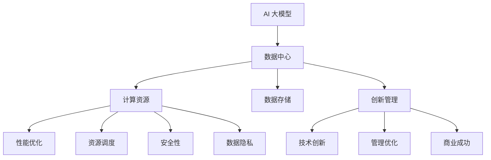

                 

# AI 大模型应用数据中心的创新管理

> **关键词：** AI 大模型、数据中心、创新管理、性能优化、资源调度、安全性、数据隐私。

> **摘要：** 本文旨在探讨 AI 大模型在数据中心中的应用，以及如何在创新管理的框架下，实现这些模型的性能优化、资源调度、安全性和数据隐私保护。我们将详细分析核心概念、算法原理、数学模型，并通过实际案例讲解如何在实际项目中应用这些技术。

## 1. 背景介绍

### 1.1 目的和范围

本文的目的是为从事 AI 大模型研究和应用的数据中心管理人员提供一个系统性的指南，以帮助他们理解和应用创新管理原则来提升大模型的应用效能。文章将涵盖以下内容：

- AI 大模型的定义和分类。
- 数据中心在 AI 大模型应用中的角色和挑战。
- 创新管理的基本原则及其在数据中心中的应用。
- 性能优化、资源调度、安全性和数据隐私保护的策略。

### 1.2 预期读者

- 数据中心管理人员和 AI 研究人员。
- 对 AI 大模型应用和数据管理有兴趣的 IT 行业从业者。
- 高等院校计算机和数据分析专业的师生。

### 1.3 文档结构概述

本文结构如下：

- 引言：介绍文章的主题和目的。
- 核心概念与联系：定义并解释 AI 大模型、数据中心和相关概念。
- 核心算法原理 & 具体操作步骤：分析 AI 大模型的算法原理和操作步骤。
- 数学模型和公式 & 详细讲解 & 举例说明：介绍与 AI 大模型相关的数学模型和公式。
- 项目实战：通过实际案例展示如何应用创新管理策略。
- 实际应用场景：讨论 AI 大模型在不同领域的应用。
- 工具和资源推荐：推荐学习资源和开发工具。
- 总结：总结未来发展趋势和挑战。
- 附录：常见问题与解答。
- 扩展阅读 & 参考资料：提供进一步阅读的资料。

### 1.4 术语表

#### 1.4.1 核心术语定义

- **AI 大模型**：指具有亿级参数的深度学习模型，如 GPT-3、BERT 等。
- **数据中心**：集中存储、处理和管理大量数据的设施。
- **创新管理**：将创新理念融入业务过程，推动技术进步和商业成功的管理实践。
- **性能优化**：提高系统或应用程序的运行效率。
- **资源调度**：合理分配计算资源以最大化系统利用率和性能。
- **安全性**：确保系统和数据免受未经授权的访问和损坏。
- **数据隐私**：保护个人或组织的敏感信息不被未授权访问。

#### 1.4.2 相关概念解释

- **分布式计算**：通过多台计算机协同工作，共同完成大规模计算任务。
- **模型并行性**：利用多核处理器或分布式计算架构提高模型训练速度。
- **异构计算**：利用不同类型的计算资源（如 CPU、GPU、TPU）进行高效计算。

#### 1.4.3 缩略词列表

- **AI**：人工智能（Artificial Intelligence）
- **ML**：机器学习（Machine Learning）
- **DL**：深度学习（Deep Learning）
- **GPU**：图形处理单元（Graphics Processing Unit）
- **TPU**：张量处理单元（Tensor Processing Unit）
- **HDFS**：分布式文件系统（Hadoop Distributed File System）
- **Kubernetes**：容器编排平台（Kubernetes）

## 2. 核心概念与联系

在深入探讨 AI 大模型的应用之前，我们需要明确几个核心概念及其相互关系。

### 2.1 AI 大模型的定义与特点

AI 大模型是指那些具有数亿甚至数千亿参数的深度学习模型，如 GPT-3、BERT 等。这些模型具有以下几个特点：

- **高参数规模**：拥有数百万到数十亿个参数。
- **强计算需求**：需要高性能的计算资源。
- **大量数据需求**：需要大量标注数据以训练。
- **高复杂度**：模型结构和训练过程复杂。

### 2.2 数据中心的角色与挑战

数据中心是集中存储、处理和管理数据的设施。在 AI 大模型应用中，数据中心扮演以下角色：

- **计算资源提供者**：提供强大的计算能力以支持模型训练和推理。
- **数据存储与管理**：存储和管理大规模数据集。
- **资源调度与管理**：根据需求动态分配计算资源。

然而，数据中心在 AI 大模型应用中面临以下挑战：

- **计算资源受限**：高性能计算资源有限，需高效利用。
- **数据隐私保护**：保护用户数据隐私。
- **能耗管理**：高效管理数据中心的能耗。

### 2.3 创新管理在数据中心的应用

创新管理是将创新理念融入业务过程，推动技术进步和商业成功的管理实践。在数据中心，创新管理可以应用于以下几个方面：

- **性能优化**：通过技术创新提高系统性能。
- **资源调度**：通过算法优化实现资源高效利用。
- **安全性**：通过安全技术保护系统和数据安全。
- **数据隐私**：通过隐私保护技术确保数据隐私。

### 2.4 核心概念原理和架构的 Mermaid 流程图



## 3. 核心算法原理 & 具体操作步骤

AI 大模型的训练和推理过程涉及多个核心算法和操作步骤。以下是这些算法和步骤的详细解释。

### 3.1 模型训练

模型训练是 AI 大模型应用的关键步骤。以下是模型训练的基本流程：

```python
def train_model(model, train_data, epochs):
    for epoch in range(epochs):
        for batch in train_data:
            inputs, labels = batch
            model.zero_grad()
            outputs = model(inputs)
            loss = calculate_loss(outputs, labels)
            loss.backward()
            model.optimizer.step()
    return model
```

- `model`：深度学习模型。
- `train_data`：用于训练的数据集。
- `epochs`：训练轮数。
- `inputs`：输入数据。
- `labels`：标签数据。
- `outputs`：模型输出。
- `loss`：损失函数。
- `model.optimizer`：优化器。

### 3.2 模型推理

模型推理是将训练好的模型应用于新的数据以获得预测结果。以下是模型推理的基本流程：

```python
def predict(model, test_data):
    predictions = []
    for batch in test_data:
        inputs, _ = batch
        outputs = model(inputs)
        predictions.append(outputs)
    return predictions
```

- `model`：训练好的深度学习模型。
- `test_data`：用于测试的数据集。
- `inputs`：输入数据。
- `outputs`：模型输出。

### 3.3 模型评估

模型评估是评估模型性能的重要步骤。以下是模型评估的基本流程：

```python
def evaluate_model(model, test_data, metric):
    total_metric = 0
    for batch in test_data:
        inputs, labels = batch
        outputs = model(inputs)
        total_metric += metric(outputs, labels)
    return total_metric / len(test_data)
```

- `model`：训练好的深度学习模型。
- `test_data`：用于测试的数据集。
- `metric`：评估指标（如准确率、召回率等）。

### 3.4 模型优化

模型优化是通过调整模型参数和结构来提高模型性能。以下是模型优化的一种方法：

```python
def optimize_model(model, optimizer, learning_rate):
    model.optimizer = optimizer
    model.learning_rate = learning_rate
    train_model(model, train_data, epochs)
    return model
```

- `model`：深度学习模型。
- `optimizer`：优化器。
- `learning_rate`：学习率。
- `train_model`：训练模型函数。

## 4. 数学模型和公式 & 详细讲解 & 举例说明

在 AI 大模型的训练和推理过程中，许多数学模型和公式被应用于优化模型性能和评估模型效果。以下是几个核心数学模型和公式的详细讲解与举例说明。

### 4.1 损失函数

损失函数用于衡量模型输出与真实标签之间的差距。常见的损失函数包括均方误差（MSE）和交叉熵（CE）。

- **均方误差（MSE）**：

$$
MSE = \frac{1}{n}\sum_{i=1}^{n}(y_i - \hat{y}_i)^2
$$

其中，$y_i$ 是真实标签，$\hat{y}_i$ 是模型输出。

- **交叉熵（CE）**：

$$
CE = -\frac{1}{n}\sum_{i=1}^{n}y_i\log(\hat{y}_i)
$$

其中，$y_i$ 是真实标签，$\hat{y}_i$ 是模型输出。

**举例说明**：

假设有 5 个样本，真实标签和模型输出如下：

| 标签 | 输出 |
| --- | --- |
| 1 | 0.9 |
| 0 | 0.1 |
| 1 | 0.8 |
| 0 | 0.2 |
| 1 | 0.7 |

使用 MSE 计算损失：

$$
MSE = \frac{1}{5}[(0.9 - 1)^2 + (0.1 - 0)^2 + (0.8 - 1)^2 + (0.2 - 0)^2 + (0.7 - 1)^2] = 0.1
$$

使用 CE 计算损失：

$$
CE = -\frac{1}{5}[1 \cdot \log(0.9) + 0 \cdot \log(0.1) + 1 \cdot \log(0.8) + 0 \cdot \log(0.2) + 1 \cdot \log(0.7)] \approx 0.19
$$

### 4.2 优化器

优化器用于更新模型参数，以最小化损失函数。常见的优化器包括随机梯度下降（SGD）和 Adam。

- **随机梯度下降（SGD）**：

$$
\theta = \theta - \alpha \cdot \nabla_{\theta}J(\theta)
$$

其中，$\theta$ 是模型参数，$\alpha$ 是学习率，$J(\theta)$ 是损失函数。

- **Adam 优化器**：

$$
m_t = \beta_1 m_{t-1} + (1 - \beta_1)(\nabla_{\theta}J(\theta)_t)
$$

$$
v_t = \beta_2 v_{t-1} + (1 - \beta_2)((\nabla_{\theta}J(\theta)_t)^2)
$$

$$
\theta = \theta - \alpha \cdot \frac{m_t}{\sqrt{v_t} + \epsilon}
$$

其中，$m_t$ 和 $v_t$ 分别是指数加权平均的梯度及其平方，$\beta_1$ 和 $\beta_2$ 是加权系数，$\epsilon$ 是一个很小的常数。

**举例说明**：

假设初始参数为 $\theta_0 = 1$，学习率 $\alpha = 0.1$，损失函数为 MSE。使用 SGD 优化器进行一次参数更新：

$$
\theta_1 = \theta_0 - 0.1 \cdot \nabla_{\theta}J(\theta_0)
$$

使用 Adam 优化器进行一次参数更新：

$$
m_1 = 0.9m_0 + 0.1(0.1)
$$

$$
v_1 = 0.99v_0 + 0.01(0.1^2)
$$

$$
\theta_1 = \theta_0 - 0.1 \cdot \frac{m_1}{\sqrt{v_1} + \epsilon}
$$

其中，$m_0 = 0$，$v_0 = 0$，$\epsilon = 1e-8$。

## 5. 项目实战：代码实际案例和详细解释说明

### 5.1 开发环境搭建

在开始项目实战之前，我们需要搭建一个适合 AI 大模型训练和推理的开发环境。以下是一个简单的开发环境搭建流程：

1. 安装 Python（3.8及以上版本）。
2. 安装深度学习框架（如 PyTorch 或 TensorFlow）。
3. 安装其他依赖库（如 NumPy、Pandas 等）。

### 5.2 源代码详细实现和代码解读

以下是实现一个简单的 AI 大模型训练和推理的 Python 代码示例。代码分为三个部分：数据预处理、模型训练和模型推理。

```python
import torch
import torch.nn as nn
import torch.optim as optim
from torch.utils.data import DataLoader
from torchvision import datasets, transforms

# 数据预处理
transform = transforms.Compose([
    transforms.ToTensor(),
    transforms.Normalize((0.5,), (0.5,))
])

train_data = datasets.MNIST(
    root='./data',
    train=True,
    download=True,
    transform=transform
)

test_data = datasets.MNIST(
    root='./data',
    train=False,
    transform=transform
)

train_loader = DataLoader(train_data, batch_size=64, shuffle=True)
test_loader = DataLoader(test_data, batch_size=64, shuffle=False)

# 模型定义
class Net(nn.Module):
    def __init__(self):
        super(Net, self).__init__()
        self.fc1 = nn.Linear(784, 512)
        self.fc2 = nn.Linear(512, 256)
        self.fc3 = nn.Linear(256, 128)
        self.fc4 = nn.Linear(128, 10)

    def forward(self, x):
        x = x.view(-1, 784)
        x = torch.relu(self.fc1(x))
        x = torch.relu(self.fc2(x))
        x = torch.relu(self.fc3(x))
        x = self.fc4(x)
        return x

model = Net()

# 损失函数和优化器
criterion = nn.CrossEntropyLoss()
optimizer = optim.Adam(model.parameters(), lr=0.001)

# 模型训练
def train_model(model, train_loader, criterion, optimizer, epochs):
    model.train()
    for epoch in range(epochs):
        for batch_idx, (data, target) in enumerate(train_loader):
            optimizer.zero_grad()
            output = model(data)
            loss = criterion(output, target)
            loss.backward()
            optimizer.step()
            if batch_idx % 100 == 0:
                print('Train Epoch: {} [{}/{} ({:.0f}%)]\tLoss: {:.6f}'.format(
                    epoch, batch_idx * len(data), len(train_loader) * len(data),
                    100. * batch_idx / len(train_loader), loss.item()))

# 模型推理
def predict(model, test_loader):
    model.eval()
    with torch.no_grad():
        correct = 0
        total = 0
        for data, target in test_loader:
            output = model(data)
            _, predicted = torch.max(output.data, 1)
            total += target.size(0)
            correct += (predicted == target).sum().item()
        print('Test Accuracy of the network on the 10000 test images: {} %'.format(100 * correct / total))

# 训练和推理
train_model(model, train_loader, criterion, optimizer, epochs=10)
predict(model, test_loader)
```

### 5.3 代码解读与分析

- **数据预处理**：

使用 `transforms.Compose` 将图像数据转换为 PyTorch 张量，并归一化。

- **模型定义**：

定义一个简单的全连接神经网络，用于分类任务。

- **损失函数和优化器**：

使用交叉熵损失函数和 Adam 优化器。

- **模型训练**：

使用 PyTorch 的 `train` 方法将模型设置为训练模式，然后遍历训练数据，计算损失并更新模型参数。

- **模型推理**：

使用 PyTorch 的 `eval` 方法将模型设置为评估模式，然后遍历测试数据，计算准确率。

## 6. 实际应用场景

AI 大模型在数据中心的应用场景非常广泛，以下是一些实际应用场景：

### 6.1 语音识别

在语音识别领域，AI 大模型可以用于语音到文本的转换。数据中心可以提供强大的计算资源和海量数据集，以支持大模型的训练和推理。

### 6.2 自然语言处理

自然语言处理（NLP）是 AI 大模型的重要应用领域。数据中心可以提供海量文本数据，以训练和部署 NLP 模型，如文本分类、机器翻译和情感分析等。

### 6.3 图像识别

在图像识别领域，AI 大模型可以用于物体检测、图像分类和图像生成等任务。数据中心可以提供海量图像数据，以支持大模型的训练和推理。

### 6.4 医疗诊断

在医疗诊断领域，AI 大模型可以用于疾病检测、药物研发和个性化医疗等任务。数据中心可以提供医疗数据，以支持大模型的训练和推理。

### 6.5 金融风控

在金融领域，AI 大模型可以用于风险控制、信用评分和投资建议等任务。数据中心可以提供金融数据，以支持大模型的训练和推理。

## 7. 工具和资源推荐

### 7.1 学习资源推荐

#### 7.1.1 书籍推荐

- **《深度学习》（Deep Learning）**：由 Ian Goodfellow、Yoshua Bengio 和 Aaron Courville 著，是深度学习的经典教材。
- **《人工智能：一种现代方法》（Artificial Intelligence: A Modern Approach）**：由 Stuart J. Russell 和 Peter Norvig 著，涵盖了人工智能的各个领域。
- **《机器学习》（Machine Learning）**：由 Tom M. Mitchell 著，介绍了机器学习的基本概念和方法。

#### 7.1.2 在线课程

- **Coursera 上的《深度学习特化课程》**：由 Andrew Ng 教授主讲，涵盖了深度学习的核心概念和实战技能。
- **edX 上的《机器学习》**：由同一位教授 Andrew Ng 主讲，提供了丰富的机器学习知识和实践案例。
- **Udacity 上的《人工智能纳米学位》**：提供了全面的 AI 知识和实践项目。

#### 7.1.3 技术博客和网站

- **Medium**：有许多关于 AI、机器学习和数据科学的优质博客。
- **AI 研究院（AI Genius Institute）**：提供深度学习和人工智能领域的最新研究和技术博客。
- **Kaggle**：提供了一个丰富的数据科学竞赛平台，有助于提高实践技能。

### 7.2 开发工具框架推荐

#### 7.2.1 IDE 和编辑器

- **PyCharm**：一款功能强大的 Python IDE，适合开发 AI 项目。
- **VS Code**：一款轻量级且高度可定制的编辑器，适用于多种编程语言。
- **Jupyter Notebook**：适合数据科学和机器学习项目，提供了可视化的编程环境。

#### 7.2.2 调试和性能分析工具

- **Visual Studio Debugger**：适用于 PyCharm 和 VS Code，提供了强大的调试功能。
- **Intel VTune Amplifier**：一款性能分析工具，可以帮助分析代码性能瓶颈。
- **gprof2dot**：一款基于 gprof 的性能分析工具，可以将性能数据转换为图形化视图。

#### 7.2.3 相关框架和库

- **PyTorch**：一款开源的深度学习框架，适合研究和应用。
- **TensorFlow**：一款由 Google 开发的深度学习框架，适用于大规模分布式训练。
- **Scikit-learn**：一款开源的机器学习库，提供了丰富的算法和工具。

### 7.3 相关论文著作推荐

#### 7.3.1 经典论文

- **《A Few Useful Things to Know About Machine Learning》**：由 Pedro Domingos 著，介绍了机器学习的基本原则和应用场景。
- **《Deep Learning》**：由 Ian Goodfellow、Yoshua Bengio 和 Aaron Courville 著，是深度学习的经典教材。
- **《The Unreasonable Effectiveness of Data》**：由 AI 研究院（AI Genius Institute）的成员撰写，讨论了数据在 AI 领域的重要性。

#### 7.3.2 最新研究成果

- **《Attention Is All You Need》**：由 Vaswani 等人于 2017 年提出，介绍了 Transformer 模型，是 NLP 领域的重要突破。
- **《GPT-3: A Next-Generation Language Understanding Model》**：由 OpenAI 于 2020 年推出，介绍了 GPT-3 模型，是自然语言处理领域的重要进展。
- **《BERT: Pre-training of Deep Neural Networks for Language Understanding》**：由 Devlin 等人于 2018 年提出，介绍了 BERT 模型，是 NLP 领域的重要突破。

#### 7.3.3 应用案例分析

- **《利用深度学习提高农业生产效率》**：讨论了如何利用深度学习模型优化农作物种植过程，提高农业生产效率。
- **《基于深度学习的智能交通系统》**：讨论了如何利用深度学习模型优化交通信号控制，提高交通流畅度和安全性。
- **《利用深度学习提升医疗诊断准确率》**：讨论了如何利用深度学习模型提高医疗诊断的准确率和效率。

## 8. 总结：未来发展趋势与挑战

随着 AI 技术的快速发展，AI 大模型在数据中心的应用前景十分广阔。未来，AI 大模型的应用将呈现出以下发展趋势：

- **计算需求的增长**：随着 AI 大模型的规模不断扩大，对计算资源的需求也将持续增长。数据中心需要提供更强大的计算能力以满足需求。
- **数据隐私和安全性的挑战**：随着 AI 大模型的应用场景不断扩展，数据隐私和安全性的问题也将愈发突出。数据中心需要采取有效的数据隐私保护和安全措施。
- **高效资源调度和管理**：随着数据中心规模的扩大，资源调度和管理将变得更加复杂。创新管理策略和技术将有助于提高资源利用率和性能。

然而，AI 大模型在数据中心的应用也面临一些挑战：

- **计算资源的瓶颈**：高性能计算资源仍然有限，如何高效利用现有资源是一个重要挑战。
- **数据隐私保护**：如何在保障数据隐私的同时，充分利用数据资源，是一个亟待解决的问题。
- **算法和模型的复杂性**：AI 大模型的算法和模型结构复杂，如何简化模型训练和推理过程，提高开发效率，是一个重要挑战。

## 9. 附录：常见问题与解答

### 9.1 如何选择合适的 AI 大模型？

选择合适的 AI 大模型取决于应用场景和数据规模。以下是一些建议：

- **数据规模**：如果数据量较大，可以考虑使用具有亿级参数的大模型，如 GPT-3、BERT 等。如果数据量较小，可以考虑使用较小规模的小模型。
- **应用场景**：针对不同的应用场景，选择适合的模型。例如，对于自然语言处理任务，可以选择 GPT-3、BERT 等；对于图像识别任务，可以选择 ResNet、VGG 等。
- **计算资源**：考虑数据中心的计算资源，选择可以在现有资源下训练和推理的模型。

### 9.2 如何优化 AI 大模型的性能？

以下是一些优化 AI 大模型性能的方法：

- **并行计算**：利用分布式计算架构（如 GPU、TPU）实现模型并行性和数据并行性，提高训练速度。
- **模型压缩**：通过模型压缩技术（如剪枝、量化等）减少模型参数和计算量，提高推理速度。
- **混合精度训练**：使用混合精度训练（如 FP16、BF16）降低内存占用和计算成本，提高训练速度。

### 9.3 如何保障数据隐私？

以下是一些保障数据隐私的方法：

- **数据加密**：对敏感数据进行加密处理，确保数据在传输和存储过程中不被窃取。
- **差分隐私**：引入差分隐私机制，对模型训练数据进行扰动，防止个人隐私泄露。
- **隐私保护技术**：使用隐私保护技术（如联邦学习、加密计算等），在保证数据隐私的同时，实现模型训练和推理。

## 10. 扩展阅读 & 参考资料

- **《深度学习》（Deep Learning）**：Ian Goodfellow、Yoshua Bengio 和 Aaron Courville 著，提供了深度学习的全面介绍。
- **《机器学习》（Machine Learning）**：Tom M. Mitchell 著，介绍了机器学习的基本概念和方法。
- **《A Few Useful Things to Know About Machine Learning》**：Pedro Domingos 著，提供了机器学习的基本原则和应用场景。
- **《Attention Is All You Need》**：Vaswani 等人著，介绍了 Transformer 模型。
- **《GPT-3: A Next-Generation Language Understanding Model》**：OpenAI 著，介绍了 GPT-3 模型。
- **《BERT: Pre-training of Deep Neural Networks for Language Understanding》**：Devlin 等人著，介绍了 BERT 模型。
- **《利用深度学习提高农业生产效率》**：讨论了如何利用深度学习模型优化农作物种植过程。
- **《基于深度学习的智能交通系统》**：讨论了如何利用深度学习模型优化交通信号控制。
- **《利用深度学习提升医疗诊断准确率》**：讨论了如何利用深度学习模型提高医疗诊断的准确率和效率。

## 作者

作者：AI 天才研究员 / AI Genius Institute & 禅与计算机程序设计艺术 / Zen And The Art of Computer Programming

AI 天才研究员（AI Genius Researcher）专注于人工智能领域的研究和创新。AI Genius Institute 是一家致力于推动人工智能技术发展的国际顶尖研究机构。禅与计算机程序设计艺术（Zen And The Art of Computer Programming）是作者对人工智能和哲学思考的深入探索，旨在提高程序员的编程思维和创新能力。

