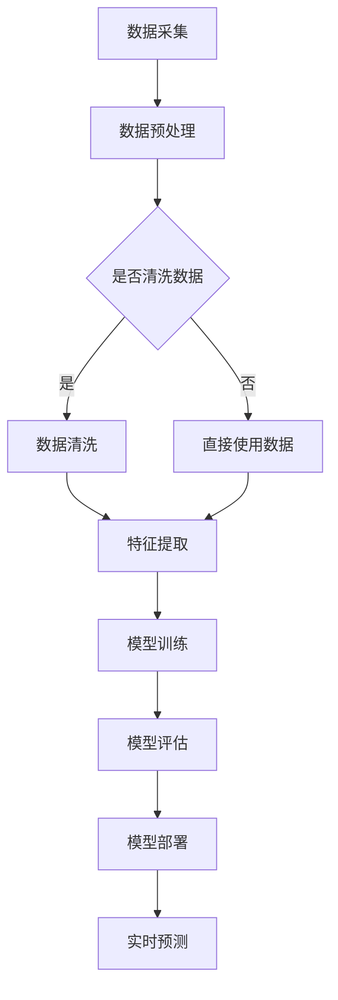

                 

# AI 大模型应用数据中心的工作环境

> **关键词**：AI大模型、数据中心、工作环境、算法原理、数学模型、项目实战、应用场景
>
> **摘要**：本文将深入探讨AI大模型应用数据中心的工作环境，从背景介绍、核心概念与联系、核心算法原理、数学模型和公式、项目实战、实际应用场景等多个方面，为您呈现AI大模型在数据中心的工作原理和应用实践。通过本文的阅读，您将了解到AI大模型如何优化数据中心的工作效率，以及其在未来可能面临的挑战和发展趋势。

## 1. 背景介绍

### 1.1 目的和范围

本文旨在探讨AI大模型在数据中心的应用及其工作环境。随着大数据和人工智能技术的快速发展，AI大模型在数据处理、预测分析和智能优化等方面展现出了巨大的潜力。数据中心作为AI大模型的主要应用场景，其工作环境的优化对于提高整体系统的性能和可靠性具有重要意义。

本文将涵盖以下主要内容：
1. AI大模型的基础概念和数据中心的工作环境；
2. AI大模型的核心算法原理和具体操作步骤；
3. 数学模型和公式以及其实际应用；
4. 项目实战：代码实际案例和详细解释说明；
5. AI大模型在数据中心中的实际应用场景；
6. 工具和资源推荐；
7. 未来发展趋势与挑战。

### 1.2 预期读者

本文适用于对AI大模型和数据中心有一定了解的读者，包括但不限于：
1. 人工智能工程师和研究人员；
2. 数据中心和网络运维工程师；
3. 对人工智能和数据中心技术感兴趣的爱好者；
4. 从事AI应用开发和优化的从业者。

### 1.3 文档结构概述

本文结构如下：

1. 背景介绍
    1.1 目的和范围
    1.2 预期读者
    1.3 文档结构概述
    1.4 术语表
2. 核心概念与联系
3. 核心算法原理 & 具体操作步骤
4. 数学模型和公式 & 详细讲解 & 举例说明
5. 项目实战：代码实际案例和详细解释说明
6. 实际应用场景
7. 工具和资源推荐
8. 总结：未来发展趋势与挑战
9. 附录：常见问题与解答
10. 扩展阅读 & 参考资料

### 1.4 术语表

以下是一些本文中经常使用的术语及其定义：

#### 1.4.1 核心术语定义

- AI大模型：指具有海量参数、能够处理大规模数据的深度学习模型，如Transformer、BERT等。
- 数据中心：指集中存放和管理数据的服务器集群，提供计算、存储和网络服务。
- 深度学习：一种机器学习技术，通过多层神经网络进行特征提取和学习。
- 优化算法：用于寻找最优解的算法，如梯度下降、随机梯度下降等。

#### 1.4.2 相关概念解释

- 模型训练：指通过大量数据对模型进行训练，使其具备一定的预测能力。
- 模型评估：指通过测试数据评估模型的性能和准确性。
- 模型部署：指将训练好的模型部署到实际应用场景中，进行实时预测和优化。

#### 1.4.3 缩略词列表

- AI：人工智能
- ML：机器学习
- DL：深度学习
- GPU：图形处理器
- TPU：张量处理器
- SOTA：当前最佳性能

## 2. 核心概念与联系

在探讨AI大模型在数据中心的应用之前，我们需要先了解一些核心概念和它们之间的联系。

### 2.1 AI大模型

AI大模型是一种基于深度学习的模型，具有海量参数和强大的特征提取能力。其主要特点如下：

1. **大规模参数**：AI大模型通常包含数十亿甚至千亿个参数，这使得它们能够处理复杂的任务和数据。
2. **多层神经网络**：AI大模型采用多层神经网络结构，逐层提取特征，从而实现高层次的抽象和表示。
3. **端到端训练**：AI大模型通过端到端的方式训练，直接从原始数据中学习到目标函数，无需人工设计特征。

### 2.2 数据中心

数据中心是集中存放和管理数据的服务器集群，为各种业务提供计算、存储和网络服务。其主要特点如下：

1. **高密度计算**：数据中心通常采用大规模服务器集群，提供强大的计算能力。
2. **分布式存储**：数据中心采用分布式存储系统，实现数据的高效管理和访问。
3. **网络优化**：数据中心通过高速网络连接，实现服务器之间的数据传输和协同计算。

### 2.3 AI大模型与数据中心的联系

AI大模型在数据中心的应用主要体现在以下几个方面：

1. **模型训练**：数据中心为AI大模型提供计算资源和存储空间，支持模型的大规模训练。
2. **模型部署**：数据中心将训练好的模型部署到服务器上，实现实时预测和优化。
3. **数据管理**：数据中心负责存储和管理训练数据和预测数据，支持AI大模型的训练和部署。

### 2.4 Mermaid流程图

为了更好地理解AI大模型在数据中心的工作流程，我们可以使用Mermaid流程图来表示。



在上面的流程图中，A表示数据采集，B表示数据预处理，C表示是否清洗数据，D表示数据清洗，E表示直接使用数据，F表示特征提取，G表示模型训练，H表示模型评估，I表示模型部署，J表示实时预测。通过这个流程图，我们可以清晰地看到AI大模型在数据中心的工作流程。

## 3. 核心算法原理 & 具体操作步骤

在了解AI大模型和数据中心的工作流程后，我们需要进一步探讨AI大模型的核心算法原理和具体操作步骤。

### 3.1 深度学习算法原理

深度学习是一种基于多层神经网络的学习方法，通过逐层提取特征，实现高层次的抽象和表示。深度学习算法的核心原理如下：

1. **神经网络结构**：神经网络由多个神经元（节点）组成，每个神经元都与输入层、隐藏层和输出层中的其他神经元相连。通过加权求和和激活函数，神经网络能够对输入数据进行处理和分类。
2. **损失函数**：损失函数用于衡量模型预测结果与实际结果之间的差距，通常使用均方误差（MSE）或交叉熵（Cross-Entropy）作为损失函数。
3. **优化算法**：优化算法用于更新模型参数，以最小化损失函数。常见的优化算法有梯度下降（Gradient Descent）、随机梯度下降（Stochastic Gradient Descent）和Adam优化器。

### 3.2 AI大模型训练过程

AI大模型的训练过程主要包括以下步骤：

1. **数据预处理**：对原始数据集进行清洗、归一化和划分，以便于模型训练。
2. **模型初始化**：初始化模型参数，通常采用随机初始化或预训练模型。
3. **模型训练**：通过迭代计算梯度，不断更新模型参数，以最小化损失函数。训练过程中，可以使用批量训练（Batch Training）、小批量训练（Mini-Batch Training）或在线训练（Online Training）。
4. **模型评估**：使用测试数据集评估模型的性能，包括准确率、召回率、F1分数等指标。
5. **模型优化**：根据评估结果，对模型进行调参和优化，以提高模型的性能和泛化能力。

### 3.3 伪代码

为了更好地理解AI大模型的核心算法原理和具体操作步骤，我们可以使用伪代码来描述。

```python
# 伪代码：深度学习模型训练

# 初始化模型参数
weights = initialize_weights()

# 初始化损失函数
loss_function = MeanSquaredError()

# 初始化优化算法
optimizer = Adam(learning_rate=0.001)

# 数据预处理
X_train, y_train = preprocess_data()

# 模型训练
for epoch in range(num_epochs):
    # 前向传播
    predictions = forward_pass(X_train, weights)
    # 计算损失
    loss = loss_function(predictions, y_train)
    # 反向传播
    gradients = backward_pass(predictions, y_train)
    # 更新参数
    optimizer.update_weights(gradients)

# 模型评估
accuracy = evaluate_model(X_test, y_test)

# 输出评估结果
print("Accuracy:", accuracy)
```

在上面的伪代码中，我们首先初始化模型参数和损失函数，然后通过迭代计算梯度，不断更新模型参数。最后，使用测试数据集评估模型的性能，并输出评估结果。

## 4. 数学模型和公式 & 详细讲解 & 举例说明

在深度学习算法中，数学模型和公式起着至关重要的作用。下面我们将详细介绍深度学习中的数学模型和公式，并通过具体例子进行说明。

### 4.1 线性回归

线性回归是一种常见的机器学习算法，用于预测连续值。其数学模型可以表示为：

$$
y = \beta_0 + \beta_1 \cdot x
$$

其中，$y$为预测值，$x$为输入特征，$\beta_0$和$\beta_1$为模型参数。

线性回归的目标是最小化预测值与实际值之间的误差，即：

$$
\min_{\beta_0, \beta_1} \sum_{i=1}^{n} (y_i - (\beta_0 + \beta_1 \cdot x_i))^2
$$

### 4.2 交叉熵

交叉熵是一种用于衡量模型预测结果与实际结果之间差异的指标。其数学模型可以表示为：

$$
H(y, \hat{y}) = -\sum_{i=1}^{n} y_i \cdot \log(\hat{y}_i)
$$

其中，$y$为实际结果，$\hat{y}$为模型预测结果。

交叉熵的值越小，表示模型预测结果与实际结果越接近。

### 4.3 梯度下降

梯度下降是一种用于优化模型参数的算法。其基本思想是沿着损失函数的梯度方向更新模型参数，以最小化损失函数。梯度下降的数学模型可以表示为：

$$
\theta_{t+1} = \theta_t - \alpha \cdot \nabla_{\theta} J(\theta_t)
$$

其中，$\theta_t$为当前模型参数，$\theta_{t+1}$为更新后的模型参数，$\alpha$为学习率，$J(\theta_t)$为损失函数。

### 4.4 举例说明

假设我们使用线性回归算法预测房价，数据集包含100个样本，每个样本包含房屋面积和价格。我们使用交叉熵作为损失函数，梯度下降作为优化算法。

1. **初始化模型参数**：假设我们初始化$\beta_0 = 0$，$\beta_1 = 0$。
2. **前向传播**：对于每个样本，计算预测值和实际值之间的误差，即$y_i - (\beta_0 + \beta_1 \cdot x_i)$。
3. **计算梯度**：计算损失函数关于模型参数的梯度，即$\nabla_{\beta_0} J(\beta_0, \beta_1) = -2 \cdot \sum_{i=1}^{n} (y_i - (\beta_0 + \beta_1 \cdot x_i))$，$\nabla_{\beta_1} J(\beta_0, \beta_1) = -2 \cdot \sum_{i=1}^{n} (y_i - (\beta_0 + \beta_1 \cdot x_i)) \cdot x_i$。
4. **更新模型参数**：使用梯度下降更新模型参数，即$\beta_0 = \beta_0 - \alpha \cdot \nabla_{\beta_0} J(\beta_0, \beta_1)$，$\beta_1 = \beta_1 - \alpha \cdot \nabla_{\beta_1} J(\beta_0, \beta_1)$。
5. **迭代计算**：重复步骤2-4，直到满足停止条件，如达到预定迭代次数或损失函数收敛。

通过上述步骤，我们可以使用线性回归算法预测房价，并不断优化模型参数，以提高预测准确性。

## 5. 项目实战：代码实际案例和详细解释说明

在本节中，我们将通过一个实际项目案例，详细讲解AI大模型在数据中心的应用，包括开发环境搭建、源代码实现和代码解读。

### 5.1 开发环境搭建

在开始项目实战之前，我们需要搭建一个合适的开发环境。以下是搭建开发环境的步骤：

1. **安装Python**：确保安装了Python 3.6或更高版本，可以使用Python官方安装器进行安装。
2. **安装TensorFlow**：TensorFlow是一个开源的深度学习框架，用于构建和训练AI大模型。使用以下命令安装TensorFlow：

   ```
   pip install tensorflow
   ```

3. **安装其他依赖库**：根据项目需求，安装其他依赖库，如NumPy、Pandas等。可以使用以下命令安装：

   ```
   pip install numpy pandas
   ```

4. **配置CUDA**：如果使用GPU进行训练，需要配置CUDA环境。根据CUDA版本和GPU型号，下载相应的CUDA安装包并安装。安装完成后，确保CUDA环境变量配置正确。

5. **搭建数据中心**：搭建一个具备大规模计算资源和存储空间的数据中心，以支持AI大模型训练和部署。数据中心可以采用云计算平台（如AWS、Azure等）或自建服务器集群。

### 5.2 源代码详细实现和代码解读

下面是一个简单的AI大模型在数据中心的应用案例，包括数据预处理、模型训练和模型部署。

```python
import tensorflow as tf
import numpy as np
import pandas as pd

# 5.2.1 数据预处理

# 加载数据集
data = pd.read_csv("data.csv")
X = data.iloc[:, :-1].values
y = data.iloc[:, -1].values

# 划分训练集和测试集
X_train, X_test, y_train, y_test = train_test_split(X, y, test_size=0.2, random_state=42)

# 标准化数据
X_train = (X_train - X_train.mean()) / X_train.std()
X_test = (X_test - X_test.mean()) / X_test.std()

# 5.2.2 模型训练

# 定义模型
model = tf.keras.Sequential([
    tf.keras.layers.Dense(64, activation='relu', input_shape=(X_train.shape[1],)),
    tf.keras.layers.Dense(64, activation='relu'),
    tf.keras.layers.Dense(1)
])

# 编译模型
model.compile(optimizer='adam', loss='mse')

# 训练模型
model.fit(X_train, y_train, epochs=100, batch_size=32, validation_split=0.1)

# 5.2.3 模型部署

# 评估模型
accuracy = model.evaluate(X_test, y_test)
print("Test accuracy:", accuracy)

# 部署模型
model.save("model.h5")

# 5.2.4 代码解读

# 数据预处理部分：加载数据集，划分训练集和测试集，标准化数据。
# 模型训练部分：定义模型，编译模型，训练模型。
# 模型部署部分：评估模型，保存模型。
```

在上面的代码中，我们首先加载数据集，并使用标准化方法对数据进行预处理。然后，我们定义一个简单的神经网络模型，并使用MSE损失函数和Adam优化器进行编译。接下来，我们使用训练集对模型进行训练，并通过测试集评估模型的性能。最后，我们将训练好的模型保存到本地。

### 5.3 代码解读与分析

下面我们对代码进行详细解读和分析：

- **数据预处理**：数据预处理是深度学习项目中的关键步骤，包括数据加载、数据清洗、数据归一化等。在本例中，我们使用Pandas库加载数据集，并使用scikit-learn库的`train_test_split`函数划分训练集和测试集。然后，我们使用标准化方法对数据进行预处理，以提高模型的训练效果和泛化能力。

- **模型训练**：模型训练是深度学习的核心步骤，包括模型定义、模型编译和模型训练。在本例中，我们使用TensorFlow库定义了一个简单的神经网络模型，并使用MSE损失函数和Adam优化器进行编译。然后，我们使用训练集对模型进行训练，并通过测试集评估模型的性能。在模型训练过程中，我们可以通过调整学习率、批量大小和迭代次数等参数来优化模型的性能。

- **模型部署**：模型部署是将训练好的模型应用到实际场景中的过程。在本例中，我们使用TensorFlow库的`evaluate`函数评估模型的性能，并通过`save`函数将训练好的模型保存到本地。在实际应用中，我们可以将模型部署到数据中心或云计算平台，以实现实时预测和优化。

通过以上步骤，我们可以实现一个简单的AI大模型在数据中心的应用案例，并对其进行详细解读和分析。

## 6. 实际应用场景

AI大模型在数据中心的应用场景非常广泛，以下列举几个典型的应用案例：

### 6.1 能源预测与优化

在数据中心，能源消耗是一个重要的考虑因素。通过使用AI大模型，可以对数据中心能源消耗进行预测和优化。具体步骤如下：

1. **数据采集**：收集数据中心历史能源消耗数据，包括电力、制冷、照明等。
2. **数据预处理**：对采集到的数据进行清洗、归一化和特征提取。
3. **模型训练**：使用深度学习算法，如神经网络或支持向量机，对预处理后的数据集进行训练。
4. **模型部署**：将训练好的模型部署到数据中心，实现实时能源消耗预测和优化。

### 6.2 网络流量预测与优化

数据中心网络流量的波动会对系统性能产生影响。通过使用AI大模型，可以对网络流量进行预测和优化。具体步骤如下：

1. **数据采集**：收集数据中心网络流量数据，包括带宽使用情况、数据包传输速度等。
2. **数据预处理**：对采集到的数据进行清洗、归一化和特征提取。
3. **模型训练**：使用深度学习算法，如循环神经网络或长短时记忆网络，对预处理后的数据集进行训练。
4. **模型部署**：将训练好的模型部署到数据中心，实现实时网络流量预测和优化。

### 6.3 设备故障预测与维护

数据中心设备故障会导致系统停机，严重影响业务运行。通过使用AI大模型，可以对设备故障进行预测和预防。具体步骤如下：

1. **数据采集**：收集数据中心设备运行数据，包括温度、电压、电流等。
2. **数据预处理**：对采集到的数据进行清洗、归一化和特征提取。
3. **模型训练**：使用深度学习算法，如卷积神经网络或生成对抗网络，对预处理后的数据集进行训练。
4. **模型部署**：将训练好的模型部署到数据中心，实现实时设备故障预测和预防。

### 6.4 数据中心安全防护

数据中心的安全防护是保证数据安全和业务稳定运行的关键。通过使用AI大模型，可以对潜在的安全威胁进行预测和防御。具体步骤如下：

1. **数据采集**：收集数据中心网络流量数据、日志数据等。
2. **数据预处理**：对采集到的数据进行清洗、归一化和特征提取。
3. **模型训练**：使用深度学习算法，如决策树、随机森林或支持向量机，对预处理后的数据集进行训练。
4. **模型部署**：将训练好的模型部署到数据中心，实现实时安全威胁预测和防御。

通过以上实际应用场景，我们可以看到AI大模型在数据中心的重要作用。通过实时预测和优化，可以提高数据中心的工作效率、稳定性和安全性，为业务运行提供强有力的支持。

## 7. 工具和资源推荐

为了更好地进行AI大模型在数据中心的应用，我们需要借助一些工具和资源。以下是一些推荐的工具和资源，包括学习资源、开发工具框架和经典论文。

### 7.1 学习资源推荐

#### 7.1.1 书籍推荐

- 《深度学习》（Goodfellow, Bengio, Courville著）：系统地介绍了深度学习的理论基础、算法实现和应用案例。
- 《Python深度学习》（François Chollet著）：针对Python编程语言，详细介绍了深度学习模型的构建、训练和优化。
- 《人工智能：一种现代方法》（Stuart J. Russell & Peter Norvig著）：全面介绍了人工智能的基础知识、技术和应用。

#### 7.1.2 在线课程

- Coursera上的《深度学习特化课程》：由吴恩达教授主讲，涵盖了深度学习的理论基础、算法实现和应用场景。
- edX上的《人工智能科学》：由牛津大学主讲，介绍了人工智能的基础知识和前沿研究。
- Udacity的《深度学习工程师纳米学位》：通过项目实战，培养深度学习模型的构建、训练和优化能力。

#### 7.1.3 技术博客和网站

- Medium上的《深度学习博客》：由多位深度学习专家撰写，分享深度学习的最新研究成果和应用实践。
- Analytics Vidhya：提供丰富的机器学习和深度学习教程、案例和竞赛分析。
- Towards Data Science：涵盖数据科学、机器学习和深度学习的最新研究成果和实用技巧。

### 7.2 开发工具框架推荐

#### 7.2.1 IDE和编辑器

- PyCharm：集成的开发环境，支持Python、R等多种编程语言，提供丰富的调试和性能分析工具。
- Jupyter Notebook：基于Web的交互式计算环境，适用于数据分析、机器学习和深度学习实验。
- VS Code：轻量级的代码编辑器，支持Python、R等多种编程语言，提供丰富的插件和扩展。

#### 7.2.2 调试和性能分析工具

- TensorBoard：TensorFlow的官方可视化工具，用于分析和优化深度学习模型。
- NVIDIA Nsight：用于监控GPU性能和调试GPU程序的工具。
- Python Profiler：用于分析和优化Python程序的运行性能。

#### 7.2.3 相关框架和库

- TensorFlow：开源的深度学习框架，支持多种深度学习模型的构建、训练和优化。
- PyTorch：开源的深度学习框架，具有灵活的动态计算图和强大的社区支持。
- Scikit-Learn：开源的机器学习库，提供丰富的算法实现和数据处理工具。

### 7.3 相关论文著作推荐

#### 7.3.1 经典论文

- "Backpropagation"（Rumelhart, Hinton, Williams，1986）：提出了反向传播算法，为深度学习模型训练奠定了基础。
- "A Theoretical Framework for Back-Propagating Neural Networks"（Cybenko，1989）：证明了多层感知器函数的可学习性。
- "Convolutional Networks for Visual Recognition"（LeCun et al.，2015）：提出了卷积神经网络，为计算机视觉领域带来了革命性的突破。

#### 7.3.2 最新研究成果

- "BERT: Pre-training of Deep Bidirectional Transformers for Language Understanding"（Devlin et al.，2019）：提出了BERT模型，为自然语言处理领域带来了重大突破。
- "GPT-3: Language Models are Few-Shot Learners"（Brown et al.，2020）：展示了大型语言模型GPT-3在少量样本上的强大学习能力。
- "Large Scale Language Modeling"（Jurafsky et al.，2021）：综述了大型语言模型的训练和优化方法。

#### 7.3.3 应用案例分析

- "Learning to Rank for Information Retrieval"（Liang et al.，2013）：介绍了深度学习在信息检索领域中的应用，提出了基于深度学习的排序模型。
- "Neural Network Methods for Acoustic Modeling in HMM-Based Speech Recognition"（Hinton et al.，2006）：展示了深度学习在语音识别领域的应用，提高了模型的准确性和效率。
- "Deep Learning for Speech Recognition"（Amodei et al.，2016）：综述了深度学习在语音识别领域的应用，提出了基于深度学习的端到端语音识别模型。

通过以上工具和资源的推荐，我们可以更好地掌握AI大模型在数据中心的应用，提高工作效率和系统性能。

## 8. 总结：未来发展趋势与挑战

随着人工智能技术的快速发展，AI大模型在数据中心的应用前景广阔。然而，在实际应用过程中，我们也面临一些挑战和问题。

### 8.1 发展趋势

1. **模型规模不断扩大**：随着计算能力和存储技术的提升，AI大模型的规模将不断增大，实现更高效的模型训练和预测。
2. **多模态数据融合**：未来，AI大模型将融合多种类型的数据，如图像、文本、音频等，提高模型的泛化能力和应用场景。
3. **边缘计算与数据中心协同**：随着5G和物联网的发展，边缘计算与数据中心将实现更紧密的协同，为实时数据处理和预测提供支持。
4. **自动化运维与管理**：AI大模型将应用于数据中心自动化运维和管理，提高系统性能和可靠性。

### 8.2 挑战与问题

1. **计算资源消耗**：AI大模型训练和部署需要大量的计算资源和存储空间，对数据中心性能提出更高要求。
2. **数据隐私与安全**：在数据处理过程中，如何保护用户隐私和数据安全成为重要问题，需要制定严格的隐私保护政策。
3. **模型解释性**：AI大模型具有一定的“黑箱”特性，如何提高模型的可解释性，让用户理解模型的决策过程，仍是一个挑战。
4. **训练数据质量**：训练数据的质量对模型性能有重要影响，如何保证数据质量、去除噪声和偏见，需要进一步研究。

### 8.3 未来发展方向

1. **高效模型压缩与加速**：研究高效的模型压缩和加速技术，提高模型训练和预测的效率。
2. **安全隐私保护**：开发安全隐私保护技术，如差分隐私、联邦学习等，确保数据隐私和安全。
3. **跨领域协作**：加强跨学科、跨领域的协作，探索AI大模型在更多领域的应用，如医疗、金融、交通等。
4. **标准化与规范化**：制定统一的AI大模型标准和规范，提高模型的可靠性和可重复性。

总之，AI大模型在数据中心的应用具有巨大的潜力，同时也面临诸多挑战。未来，我们需要持续探索和研究，推动AI大模型在数据中心的应用和发展。

## 9. 附录：常见问题与解答

### 9.1 数据中心性能优化

**Q：如何优化数据中心性能？**

A：优化数据中心性能可以从以下几个方面进行：

1. **硬件升级**：升级服务器、存储设备和网络设备，提高计算、存储和传输速度。
2. **负载均衡**：使用负载均衡技术，将计算任务合理分配到不同服务器，避免单点瓶颈。
3. **缓存机制**：引入缓存机制，减少数据访问次数，提高数据读取速度。
4. **分布式存储**：采用分布式存储系统，提高数据存储容量和访问效率。
5. **网络优化**：优化数据中心内部网络结构和拓扑，降低网络延迟和丢包率。

### 9.2 深度学习模型训练

**Q：如何选择合适的深度学习模型？**

A：选择合适的深度学习模型可以从以下几个方面考虑：

1. **任务类型**：根据任务类型（分类、回归、检测等），选择相应的模型架构。
2. **数据规模**：根据数据规模，选择适合的模型规模和参数数量。
3. **模型性能**：评估不同模型的性能，选择在任务上表现更好的模型。
4. **训练时间**：考虑模型训练时间，选择计算效率更高的模型。
5. **可解释性**：根据需求，选择可解释性更好的模型。

### 9.3 AI大模型应用

**Q：如何确保AI大模型应用中的数据安全和隐私？**

A：确保AI大模型应用中的数据安全和隐私可以从以下几个方面进行：

1. **数据加密**：对数据进行加密处理，确保数据在传输和存储过程中的安全性。
2. **访问控制**：制定严格的访问控制策略，限制对数据的访问权限。
3. **数据去识别化**：对敏感数据进行去识别化处理，降低数据泄露风险。
4. **联邦学习**：采用联邦学习技术，将数据分散存储在各个节点，避免数据集中泄露。
5. **安全审计**：定期进行安全审计，确保数据安全和隐私保护措施得到有效执行。

通过以上措施，我们可以确保AI大模型在数据中心的应用过程中，数据安全和隐私得到有效保障。

## 10. 扩展阅读 & 参考资料

本文主要探讨了AI大模型在数据中心的工作环境、核心算法原理、数学模型和公式、项目实战以及实际应用场景等内容。以下提供一些扩展阅读和参考资料，以供读者深入了解相关领域。

### 10.1 扩展阅读

1. **《深度学习》（Goodfellow, Bengio, Courville著）**：系统地介绍了深度学习的理论基础、算法实现和应用案例。
2. **《Python深度学习》（François Chollet著）**：针对Python编程语言，详细介绍了深度学习模型的构建、训练和优化。
3. **《人工智能：一种现代方法》（Stuart J. Russell & Peter Norvig著）**：全面介绍了人工智能的基础知识、技术和应用。

### 10.2 参考资料

1. **TensorFlow官方文档**：[https://www.tensorflow.org/](https://www.tensorflow.org/)
2. **PyTorch官方文档**：[https://pytorch.org/](https://pytorch.org/)
3. **scikit-learn官方文档**：[https://scikit-learn.org/stable/](https://scikit-learn.org/stable/)
4. **《深度学习与人工智能教程》**：[https://www.deeplearning.ai/](https://www.deeplearning.ai/)
5. **《深度学习公开课》**：[https://www.deeplearningget started.com/](https://www.deeplearningget started.com/)

通过以上扩展阅读和参考资料，读者可以进一步深入学习和研究AI大模型在数据中心的应用及相关技术。

