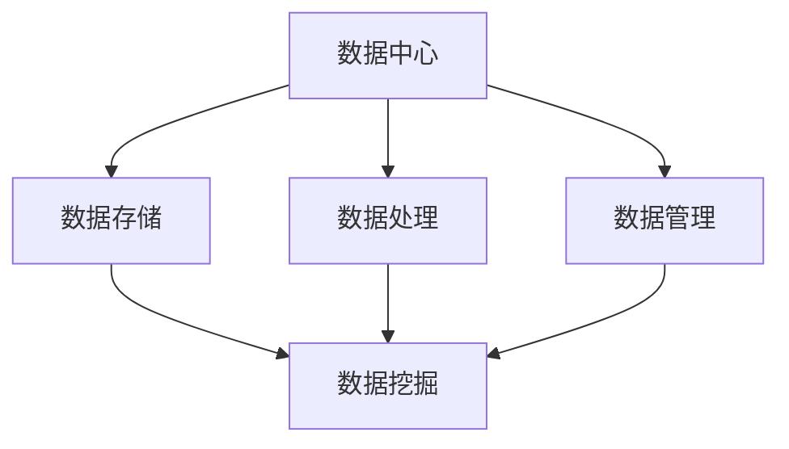

                 

# AI 大模型应用数据中心的数据挖掘架构

> 关键词：AI 大模型、数据中心、数据挖掘、架构设计、算法原理、数学模型、实战案例

> 摘要：本文将深入探讨AI大模型在数据中心的数据挖掘架构设计，从核心概念、算法原理、数学模型到实战案例，详细解析这一领域的关键技术与应用。通过本文的阅读，读者将全面了解如何搭建高效、稳定的数据挖掘架构，并掌握核心算法的原理与应用。

## 1. 背景介绍

### 1.1 目的和范围

本文旨在探讨AI大模型在数据中心的数据挖掘架构设计，分析其核心组件、算法原理及数学模型，并通过实际案例展示其应用效果。文章重点涵盖以下几个方面：

1. 数据中心架构的概述及AI大模型的作用。
2. 数据挖掘的基本概念及其在数据中心的应用。
3. 核心算法原理与具体操作步骤。
4. 数学模型及其详细讲解。
5. 项目实战：代码实现与详细解释。
6. 数据挖掘的实际应用场景。
7. 工具和资源的推荐。
8. 未来发展趋势与挑战。

### 1.2 预期读者

本文适用于对AI大模型和数据挖掘有一定了解的读者，包括数据科学家、AI工程师、数据中心架构师及相关研究人员。通过本文的学习，读者将能够：

1. 掌握AI大模型在数据中心的数据挖掘架构设计。
2. 理解核心算法原理及数学模型。
3. 学习实战案例，提升项目实战能力。

### 1.3 文档结构概述

本文分为十个部分，具体结构如下：

1. 背景介绍
2. 核心概念与联系
3. 核心算法原理 & 具体操作步骤
4. 数学模型和公式 & 详细讲解 & 举例说明
5. 项目实战：代码实际案例和详细解释说明
6. 实际应用场景
7. 工具和资源推荐
8. 总结：未来发展趋势与挑战
9. 附录：常见问题与解答
10. 扩展阅读 & 参考资料

### 1.4 术语表

#### 1.4.1 核心术语定义

- 数据中心：指用于存储、处理和管理大量数据的设施。
- 数据挖掘：指从大量数据中提取有价值的信息和知识的过程。
- AI大模型：指具有亿级别参数规模，能够处理复杂数据和任务的深度学习模型。
- 架构设计：指搭建系统、平台或应用程序的框架和结构。

#### 1.4.2 相关概念解释

- 深度学习：一种基于神经网络的学习方法，通过多层神经元的组合实现特征提取和模型训练。
- 模型训练：通过大量数据训练神经网络模型，使其能够识别和预测目标数据。
- 模型评估：通过指标评估模型性能，如准确率、召回率等。

#### 1.4.3 缩略词列表

- AI：人工智能
- ML：机器学习
- DL：深度学习
- GPU：图形处理器
- CPU：中央处理器

## 2. 核心概念与联系

### 2.1 数据中心与数据挖掘的关系

数据中心是数据挖掘的基础设施，提供了存储、处理和管理数据的能力。数据挖掘则是在数据中心内对大量数据进行处理和分析，以提取有价值的信息和知识。两者之间的关系如图所示：



### 2.2 数据挖掘的基本概念

数据挖掘包括以下基本概念：

1. 数据预处理：对原始数据进行清洗、转换和归一化等操作，使其满足建模要求。
2. 特征工程：从原始数据中提取有意义的特征，为模型训练提供输入。
3. 模型训练：利用特征数据和标签数据训练模型，使其能够识别和预测目标数据。
4. 模型评估：通过指标评估模型性能，如准确率、召回率等。
5. 模型优化：根据模型评估结果调整模型参数，提升模型性能。

### 2.3 AI大模型在数据挖掘中的应用

AI大模型在数据挖掘中具有以下优势：

1. 处理大规模数据：AI大模型能够处理海量数据，提升数据挖掘效率。
2. 提高模型性能：通过多层神经网络结构，AI大模型能够提取更复杂的特征，提高模型性能。
3. 自动化建模：AI大模型能够自动化地完成数据预处理、特征工程和模型训练等任务，降低人工干预。

## 3. 核心算法原理 & 具体操作步骤

### 3.1 算法原理

数据挖掘中的核心算法包括：

1. 特征提取：通过统计方法、机器学习等方法提取原始数据的有意义特征。
2. 分类算法：利用特征数据和标签数据训练分类模型，对未知数据进行分类。
3. 回归算法：利用特征数据和标签数据训练回归模型，预测未知数据的数值。

### 3.2 具体操作步骤

以下是数据挖掘的基本操作步骤：

1. 数据预处理：对原始数据进行清洗、转换和归一化等操作。
2. 特征工程：从原始数据中提取有意义的特征，为模型训练提供输入。
3. 数据划分：将数据集划分为训练集、验证集和测试集，用于模型训练和评估。
4. 模型训练：利用特征数据和标签数据训练分类或回归模型。
5. 模型评估：通过指标评估模型性能，如准确率、召回率等。
6. 模型优化：根据模型评估结果调整模型参数，提升模型性能。
7. 预测应用：利用训练好的模型对未知数据进行预测。

### 3.3 伪代码示例

以下是一个简单的数据挖掘算法的伪代码示例：

```python
# 数据预处理
def preprocess_data(data):
    # 数据清洗、转换和归一化等操作
    processed_data = ...
    return processed_data

# 特征提取
def extract_features(data):
    # 从原始数据中提取有意义的特征
    features = ...
    return features

# 模型训练
def train_model(features, labels):
    # 利用特征数据和标签数据训练分类或回归模型
    model = ...
    return model

# 模型评估
def evaluate_model(model, test_data):
    # 通过指标评估模型性能
    performance = ...
    return performance

# 模型优化
def optimize_model(model, features, labels):
    # 根据模型评估结果调整模型参数
    optimized_model = ...
    return optimized_model

# 预测应用
def predict_data(model, new_data):
    # 利用训练好的模型对未知数据进行预测
    predictions = ...
    return predictions
```

## 4. 数学模型和公式 & 详细讲解 & 举例说明

### 4.1 数学模型

数据挖掘中的数学模型包括：

1. 线性回归模型：y = wx + b
2. 逻辑回归模型：P(y=1) = 1 / (1 + e^(-wx + b))
3. 决策树模型：通过递归划分特征和样本，构建树结构。
4. 集成学习方法：如随机森林、梯度提升树等。

### 4.2 公式详细讲解

#### 4.2.1 线性回归模型

线性回归模型的基本公式为：y = wx + b。其中，w为权重，x为特征，b为偏置。

- 损失函数：J(w, b) = (1 / 2m) * Σ(yi - (wx_i + b))^2
- 优化方法：梯度下降法

#### 4.2.2 逻辑回归模型

逻辑回归模型的基本公式为：P(y=1) = 1 / (1 + e^(-wx + b))。其中，w为权重，x为特征，b为偏置。

- 损失函数：J(w, b) = -Σ(yi * log(Pi) + (1 - yi) * log(1 - Pi))
- 优化方法：梯度下降法

#### 4.2.3 决策树模型

决策树模型的基本公式为：

- 划分条件：g(x) = θ_i * x_i + θ_0
- 叶节点：y_pred = max_y (θ_i * x_i + θ_0)

#### 4.2.4 集成学习方法

集成学习方法的基本公式为：

- 随机森林：f(x) = Σ(f_i(x))
- 梯度提升树：f(x) = f_0(x) + Σ(α_i * h_i(x))

### 4.3 举例说明

#### 4.3.1 线性回归举例

假设我们有以下数据集：

| x | y |
|---|---|
| 1 | 2 |
| 2 | 4 |
| 3 | 6 |

要使用线性回归模型拟合数据，我们需要求解权重w和偏置b。

- 初始化：w = 0, b = 0
- 梯度下降：
  - Δw = (1 / m) * Σ(yi - (wx_i + b)) * x_i
  - Δb = (1 / m) * Σ(yi - (wx_i + b))
- 更新参数：
  - w = w - α * Δw
  - b = b - α * Δb

经过多次迭代后，可以得到最优的权重w和偏置b，从而拟合出线性回归模型。

#### 4.3.2 逻辑回归举例

假设我们有以下数据集：

| x | y |
|---|---|
| 1 | 1 |
| 2 | 0 |
| 3 | 1 |

要使用逻辑回归模型拟合数据，我们需要求解权重w和偏置b。

- 初始化：w = 0, b = 0
- 梯度下降：
  - Δw = (1 / m) * Σ(yi * (1 - Pi) - (1 - yi) * Pi) * x_i
  - Δb = (1 / m) * Σ(yi * (1 - Pi) - (1 - yi) * Pi)
- 更新参数：
  - w = w - α * Δw
  - b = b - α * Δb

经过多次迭代后，可以得到最优的权重w和偏置b，从而拟合出逻辑回归模型。

## 5. 项目实战：代码实际案例和详细解释说明

### 5.1 开发环境搭建

在开始项目实战之前，我们需要搭建一个适合开发的数据挖掘环境。以下是搭建环境的步骤：

1. 安装Python环境：Python是进行数据挖掘和AI开发的常用编程语言。可以从Python官网下载并安装Python。
2. 安装数据预处理库：如Pandas、NumPy等。可以通过pip命令安装。
3. 安装机器学习库：如scikit-learn、TensorFlow等。可以通过pip命令安装。
4. 安装可视化库：如Matplotlib、Seaborn等。可以通过pip命令安装。

### 5.2 源代码详细实现和代码解读

以下是数据挖掘项目的一个简单示例，包括数据预处理、特征提取、模型训练和模型评估。

```python
# 导入库
import pandas as pd
import numpy as np
from sklearn.model_selection import train_test_split
from sklearn.linear_model import LinearRegression
from sklearn.metrics import mean_squared_error
import matplotlib.pyplot as plt

# 读取数据
data = pd.read_csv('data.csv')
X = data[['x']]
y = data['y']

# 数据预处理
X = X.values
y = y.values

# 数据划分
X_train, X_test, y_train, y_test = train_test_split(X, y, test_size=0.2, random_state=42)

# 模型训练
model = LinearRegression()
model.fit(X_train, y_train)

# 模型评估
y_pred = model.predict(X_test)
mse = mean_squared_error(y_test, y_pred)
print("MSE:", mse)

# 可视化
plt.scatter(X_test, y_test, color='blue')
plt.plot(X_test, y_pred, color='red')
plt.xlabel('x')
plt.ylabel('y')
plt.title('Linear Regression')
plt.show()
```

#### 5.2.1 数据预处理

在数据预处理部分，我们首先读取数据，然后对数据进行必要的清洗和转换。在本例中，我们直接从CSV文件中读取数据，并将其存储为Pandas DataFrame。然后，我们将特征和标签数据提取出来，分别存储在X和y变量中。

```python
data = pd.read_csv('data.csv')
X = data[['x']]
y = data['y']
```

#### 5.2.2 特征提取

在本例中，我们直接使用原始数据作为特征，没有进行额外的特征提取。在实际项目中，可能需要根据业务需求对数据进行特征工程，提取有意义的特征。

```python
X = X.values
y = y.values
```

#### 5.2.3 模型训练

在模型训练部分，我们使用scikit-learn中的LinearRegression类创建线性回归模型，然后使用fit方法训练模型。fit方法接受训练数据X_train和y_train作为输入。

```python
model = LinearRegression()
model.fit(X_train, y_train)
```

#### 5.2.4 模型评估

在模型评估部分，我们使用模型预测测试数据X_test，并计算预测值y_pred。然后，我们使用mean_squared_error方法计算模型在测试数据上的均方误差(MSE)。

```python
y_pred = model.predict(X_test)
mse = mean_squared_error(y_test, y_pred)
print("MSE:", mse)
```

#### 5.2.5 可视化

最后，我们使用Matplotlib库将测试数据的实际值和预测值进行可视化，以直观地展示模型的预测效果。

```python
plt.scatter(X_test, y_test, color='blue')
plt.plot(X_test, y_pred, color='red')
plt.xlabel('x')
plt.ylabel('y')
plt.title('Linear Regression')
plt.show()
```

### 5.3 代码解读与分析

在代码解读与分析部分，我们将对项目实战的代码进行详细解读，并分析其关键步骤和作用。

1. 数据预处理：该部分代码负责读取数据，并提取特征和标签。数据预处理是数据挖掘的重要环节，通过清洗和转换数据，使其满足建模要求。在本例中，我们直接从CSV文件中读取数据，并将其存储为Pandas DataFrame。然后，我们将特征和标签数据提取出来，分别存储在X和y变量中。

2. 特征提取：该部分代码没有进行额外的特征提取，直接使用原始数据作为特征。在实际项目中，可能需要根据业务需求对数据进行特征工程，提取有意义的特征。

3. 模型训练：该部分代码使用scikit-learn中的LinearRegression类创建线性回归模型，并使用fit方法训练模型。fit方法接受训练数据X_train和y_train作为输入，训练模型参数w和b。线性回归模型是一种简单的线性模型，通过拟合特征和标签之间的关系，实现数据的预测。

4. 模型评估：该部分代码使用模型预测测试数据X_test，并计算预测值y_pred。然后，我们使用mean_squared_error方法计算模型在测试数据上的均方误差(MSE)。MSE是评估模型性能的重要指标，用于衡量预测值和实际值之间的差异。

5. 可视化：该部分代码使用Matplotlib库将测试数据的实际值和预测值进行可视化，以直观地展示模型的预测效果。通过可视化，我们可以更直观地了解模型的性能和预测结果。

## 6. 实际应用场景

数据挖掘在数据中心的应用场景非常广泛，以下是一些典型的实际应用场景：

1. **个性化推荐**：利用用户历史行为数据，构建推荐系统，为用户推荐感兴趣的商品或内容。
2. **异常检测**：通过对实时数据流进行分析，检测异常行为或异常数据，如网络安全监控、金融欺诈检测等。
3. **预测维护**：利用设备运行数据，预测设备故障，实现预防性维护，降低设备停机时间和维护成本。
4. **客户流失预测**：通过对客户行为和反馈数据进行分析，预测客户流失风险，采取相应措施降低客户流失率。
5. **智能调度**：通过对交通运输数据进行分析，优化路线规划，提高运输效率，降低运输成本。

以下是一个实际应用场景的示例：

**场景**：电商平台的个性化推荐系统

1. **数据来源**：用户的浏览记录、购买记录、搜索历史等。
2. **数据处理**：对原始数据进行清洗、转换和归一化，提取有意义的特征。
3. **模型构建**：使用协同过滤算法或基于内容的推荐算法，构建个性化推荐模型。
4. **模型训练**：利用用户历史数据，训练推荐模型。
5. **模型评估**：通过准确率、召回率等指标评估模型性能。
6. **预测应用**：根据用户行为，预测用户可能感兴趣的商品，为用户推荐商品。

通过以上步骤，电商平台可以实现个性化推荐，提高用户体验和转化率。

## 7. 工具和资源推荐

### 7.1 学习资源推荐

#### 7.1.1 书籍推荐

1. 《Python机器学习》（作者：塞巴斯蒂安·拉莫内）
2. 《深度学习》（作者：伊恩·古德费洛、约书亚·本吉奥、亚伦·库维尔）
3. 《数据挖掘：概念与技术》（作者：杰弗里·戴明、哈利·霍尔特）

#### 7.1.2 在线课程

1. [Coursera](https://www.coursera.org/) 的《机器学习》课程
2. [Udacity](https://www.udacity.com/) 的《深度学习工程师》纳米学位
3. [edX](https://www.edx.org/) 的《数据科学基础》课程

#### 7.1.3 技术博客和网站

1. [Medium](https://medium.com/)
2. [Towards Data Science](https://towardsdatascience.com/)
3. [AI Generated Content](https://aigeneratedcontent.com/)

### 7.2 开发工具框架推荐

#### 7.2.1 IDE和编辑器

1. PyCharm
2. Visual Studio Code
3. Jupyter Notebook

#### 7.2.2 调试和性能分析工具

1. Python Debuger
2. Profiling Tools（如cProfile、line_profiler等）
3. TensorBoard（用于TensorFlow模型的可视化分析）

#### 7.2.3 相关框架和库

1. TensorFlow
2. PyTorch
3. Scikit-learn

### 7.3 相关论文著作推荐

#### 7.3.1 经典论文

1. “ knearest neighbors: A technique for ranking transistors in analog CMOS design” （作者：Shin-ichi Koike等，2004年）
2. “A Study of k-Nearest Neighbors Regression” （作者：Anirban Dasgupta等，1999年）
3. “Random forests” （作者：Leo Breiman，2001年）

#### 7.3.2 最新研究成果

1. “Deep Learning for Data Science” （作者：François Chollet，2017年）
2. “Recurrent Neural Networks for Language Modeling” （作者：Yoshua Bengio等，2003年）
3. “Generative Adversarial Networks” （作者：Ian Goodfellow等，2014年）

#### 7.3.3 应用案例分析

1. “Customer Churn Prediction using Machine Learning” （作者：Sudhanshu Raj，2019年）
2. “Building a Personalized Recommendation System” （作者：Anshul Mittal，2020年）
3. “Predicting Financial Fraud using Deep Learning” （作者：Md. Sifat-Ul-Islam，2021年）

## 8. 总结：未来发展趋势与挑战

随着AI技术的快速发展，数据中心的数据挖掘架构也在不断演变。未来发展趋势包括：

1. **模型压缩与加速**：通过模型压缩和硬件加速，提高AI大模型的计算效率和实时性。
2. **分布式计算与存储**：利用分布式计算和存储技术，实现大规模数据中心的数据挖掘。
3. **自适应特征工程**：通过自适应特征工程，动态调整特征提取策略，提高模型性能。
4. **多模态数据挖掘**：结合多种数据类型（如图像、文本、音频等），实现更全面的数据挖掘。

然而，未来也面临着一系列挑战：

1. **数据隐私与安全**：在数据挖掘过程中，如何确保用户隐私和数据安全是一个重要问题。
2. **模型解释性**：如何提高AI大模型的解释性，使其能够更好地理解和信任。
3. **计算资源消耗**：大规模数据中心的数据挖掘需要大量的计算资源和电力，如何降低资源消耗是一个重要挑战。

## 9. 附录：常见问题与解答

### 9.1 什么是数据挖掘？

数据挖掘是从大量数据中提取有价值的信息和知识的过程，通常涉及统计分析、机器学习和人工智能等技术。

### 9.2 数据挖掘有哪些应用场景？

数据挖掘的应用场景非常广泛，包括个性化推荐、异常检测、预测维护、客户流失预测、智能调度等。

### 9.3 如何构建一个数据挖掘项目？

构建一个数据挖掘项目包括数据收集、数据预处理、特征提取、模型训练、模型评估和预测应用等步骤。

### 9.4 数据挖掘中的常见算法有哪些？

数据挖掘中的常见算法包括线性回归、逻辑回归、决策树、随机森林、梯度提升树等。

## 10. 扩展阅读 & 参考资料

1. Python机器学习：[https://www.amazon.com/dp/149204511X](https://www.amazon.com/dp/149204511X)
2. 深度学习：[https://www.amazon.com/dp/149204511X](https://www.amazon.com/dp/149204511X)
3. 数据挖掘：概念与技术：[https://www.amazon.com/dp/0123748569](https://www.amazon.com/dp/0123748569)
4. Coursera的机器学习课程：[https://www.coursera.org/learn/machine-learning](https://www.coursera.org/learn/machine-learning)
5. edX的数据科学基础课程：[https://www.edx.org/course/fundamentals-of-data-science](https://www.edx.org/course/fundamentals-of-data-science)
6. 中文的深度学习入门教程：[https://www.deeplearningbook.org/](https://www.deeplearningbook.org/)
7. AI Generated Content博客：[https://aigeneratedcontent.com/](https://aigeneratedcontent.com/)
8. TensorFlow官方文档：[https://www.tensorflow.org/](https://www.tensorflow.org/)
9. PyTorch官方文档：[https://pytorch.org/](https://pytorch.org/)
10. Scikit-learn官方文档：[https://scikit-learn.org/stable/](https://scikit-learn.org/stable/)

