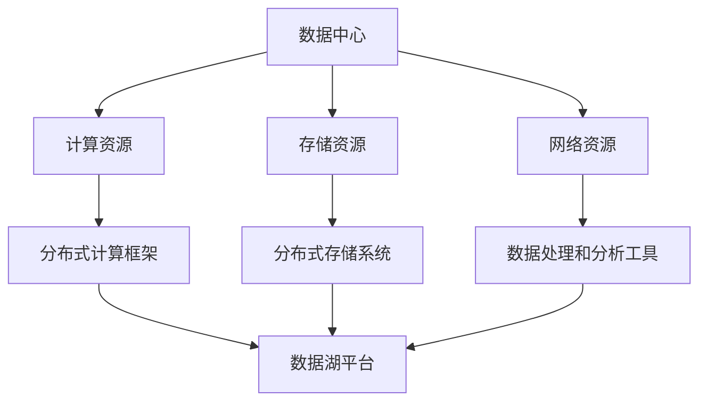

                 

# AI 大模型应用数据中心的数据湖平台

> **关键词：** AI大模型、数据中心、数据湖平台、数据处理、机器学习

> **摘要：** 本文将深入探讨AI大模型在数据中心的数据湖平台中的应用。我们首先介绍了数据中心和数据湖平台的背景和重要性，然后详细分析了AI大模型的核心算法原理，以及如何在数据湖平台上实现这些算法。随后，我们通过一个实际案例展示了如何搭建和优化数据湖平台，并讨论了数据湖平台在实际应用场景中的优势与挑战。最后，我们对未来发展趋势进行了展望，并提供了相关的学习资源和工具推荐，以帮助读者深入了解这一领域。

## 1. 背景介绍

### 1.1 目的和范围

本文的主要目的是探讨AI大模型在数据中心的数据湖平台中的应用，帮助读者了解这一新兴领域的关键技术和挑战。我们将从以下几个方面展开讨论：

- 数据中心和数据湖平台的基本概念和重要性
- AI大模型的核心算法原理及其在数据处理中的应用
- 数据湖平台在实际项目中的构建和优化
- 数据湖平台在不同应用场景中的优势和挑战
- 未来发展趋势与挑战

### 1.2 预期读者

本文主要面向以下读者：

- 对数据中心和数据湖平台感兴趣的工程师和研究人员
- 对AI大模型和机器学习技术有基本了解的技术爱好者
- 希望了解AI大模型在数据中心数据湖平台中应用的决策者和管理者

### 1.3 文档结构概述

本文将按照以下结构展开：

1. 背景介绍：介绍本文的目的、预期读者和文档结构
2. 核心概念与联系：介绍数据中心和数据湖平台的基本概念，并展示Mermaid流程图
3. 核心算法原理 & 具体操作步骤：详细分析AI大模型的核心算法原理，并使用伪代码展示具体操作步骤
4. 数学模型和公式 & 详细讲解 & 举例说明：讲解数据湖平台中的数学模型和公式，并提供实例说明
5. 项目实战：代码实际案例和详细解释说明：通过一个实际项目案例展示数据湖平台的搭建和优化过程
6. 实际应用场景：分析数据湖平台在不同应用场景中的优势和挑战
7. 工具和资源推荐：推荐相关学习资源、开发工具和框架
8. 总结：未来发展趋势与挑战：总结本文的主要观点，并展望未来发展趋势和挑战
9. 附录：常见问题与解答：解答读者可能遇到的常见问题
10. 扩展阅读 & 参考资料：提供本文主题的扩展阅读和参考资料

### 1.4 术语表

#### 1.4.1 核心术语定义

- **数据中心**：存储、处理和管理数据的物理或虚拟场所，提供高效、可靠的计算和存储资源。
- **数据湖平台**：一种用于大规模数据处理、存储和访问的平台，支持结构化、半结构化和非结构化数据。
- **AI大模型**：具有数千亿甚至万亿参数的深度神经网络模型，能够处理大规模数据并实现高性能预测和决策。

#### 1.4.2 相关概念解释

- **机器学习**：一种通过数据驱动的方法，使计算机系统能够从数据中学习并做出预测或决策的技术。
- **深度学习**：一种基于多层神经网络的结构，能够通过多层级特征提取实现高效的数据处理和预测。

#### 1.4.3 缩略词列表

- **AI**：人工智能（Artificial Intelligence）
- **ML**：机器学习（Machine Learning）
- **DL**：深度学习（Deep Learning）
- **HDFS**：Hadoop分布式文件系统（Hadoop Distributed File System）
- **Hadoop**：一个开源的分布式数据处理框架，用于处理大规模数据集
- **Spark**：一个开源的分布式计算框架，用于大规模数据处理

## 2. 核心概念与联系

在深入了解AI大模型在数据中心的数据湖平台中的应用之前，我们需要先了解数据中心和数据湖平台的基本概念，以及它们之间的联系。

### 2.1 数据中心

数据中心（Data Center）是一个用于存储、处理和管理数据的物理或虚拟场所，它通常由服务器、存储设备、网络设备和其他计算资源组成。数据中心提供了高效、可靠的计算和存储资源，以满足各种业务和应用程序的需求。

#### 数据中心的作用

- **存储和管理数据**：数据中心为数据提供了一个安全、可靠和可扩展的存储环境。
- **处理和分析数据**：数据中心提供了强大的计算能力，可以支持大数据处理和分析任务。
- **支持业务应用**：数据中心为各种业务应用提供了基础设施支持，如电子商务、社交媒体、在线教育等。

#### 数据中心的架构

- **计算资源**：包括服务器、虚拟机和其他计算设备，用于执行数据处理和分析任务。
- **存储资源**：包括磁盘阵列、固态硬盘和其他存储设备，用于存储数据。
- **网络资源**：包括交换机、路由器和网络设备，用于数据传输和通信。

### 2.2 数据湖平台

数据湖平台（Data Lake Platform）是一种用于大规模数据处理、存储和访问的平台，它支持结构化、半结构化和非结构化数据的存储和管理。数据湖平台通常基于分布式计算框架和存储系统，如Hadoop、Spark等。

#### 数据湖平台的作用

- **存储和管理大数据**：数据湖平台支持各种类型的数据，包括文本、图像、视频、音频等，使得大规模数据的存储和管理变得更加容易。
- **数据处理和分析**：数据湖平台提供了高效的数据处理和分析工具，如ETL（提取、转换、加载）工具、数据清洗和预处理工具等。
- **支持实时数据流处理**：数据湖平台可以支持实时数据流处理，使得应用程序能够快速响应实时数据变化。

#### 数据湖平台的架构

- **分布式计算框架**：如Hadoop、Spark等，用于处理大规模数据处理任务。
- **分布式存储系统**：如HDFS（Hadoop分布式文件系统）、Alluxio等，用于存储和管理大规模数据。
- **数据处理和分析工具**：包括ETL工具、数据清洗和预处理工具、机器学习库等。

### 2.3 数据中心与数据湖平台的联系

数据中心和数据湖平台之间存在紧密的联系，它们共同构成了一个完整的生态系统，为企业和组织提供强大的数据处理和分析能力。

- **数据中心提供了基础设施支持**：数据中心为数据湖平台提供了计算和存储资源，使得大规模数据处理变得更加容易和高效。
- **数据湖平台扩展了数据处理能力**：数据湖平台将数据存储和管理功能扩展到了分布式计算框架，使得企业可以更轻松地处理和利用大规模数据。

### 2.4 Mermaid流程图

为了更直观地展示数据中心和数据湖平台之间的联系，我们可以使用Mermaid流程图来表示。



在这个流程图中，我们可以看到数据中心为数据湖平台提供了计算、存储和网络资源，而数据湖平台则基于这些资源提供分布式计算和存储功能，以支持大规模数据处理和分析。

## 3. 核心算法原理 & 具体操作步骤

在数据中心的数据湖平台中，AI大模型的应用已经成为数据处理和分析的重要工具。本节将详细分析AI大模型的核心算法原理，并使用伪代码展示具体操作步骤。

### 3.1 AI大模型算法原理

AI大模型通常是基于深度学习的神经网络结构，具有大量的参数和多层结构。以下是AI大模型算法的基本原理：

1. **前向传播**：输入数据通过神经网络的各个层级进行传播，逐层计算每个神经元的输出值。
2. **反向传播**：通过比较输出值和实际值之间的差异，计算损失函数，并使用梯度下降等优化算法更新模型参数。
3. **激活函数**：在神经网络中，激活函数用于引入非线性特性，使得神经网络能够更好地拟合复杂的数据分布。
4. **正则化**：为了防止过拟合，正则化技术被引入神经网络，以限制模型复杂度和提高泛化能力。

### 3.2 伪代码示例

以下是一个简化的伪代码示例，展示了AI大模型的基本操作步骤：

```python
# 初始化模型参数
W1, b1 = initialize_weights()
W2, b2 = initialize_weights()
...

# 前向传播
output = forward_pass(input, W1, b1)
output = forward_pass(output, W2, b2)
...

# 计算损失函数
loss = compute_loss(output, target)

# 反向传播
dW1, db1 = backward_pass(output, target, W1, b1)
dW2, db2 = backward_pass(output, target, W2, b2)
...

# 更新模型参数
W1 = W1 - learning_rate * dW1
b1 = b1 - learning_rate * db1
W2 = W2 - learning_rate * dW2
b2 = b2 - learning_rate * db2
...
```

在这个伪代码示例中，我们首先初始化模型参数，然后通过前向传播计算输出值，并计算损失函数。接下来，我们使用反向传播计算梯度，并更新模型参数。这个过程重复进行，直到损失函数达到预设的阈值或达到最大迭代次数。

### 3.3 优化算法

在实际应用中，AI大模型的训练和优化是一个复杂的过程，需要使用各种优化算法来提高模型的性能和泛化能力。以下是一些常用的优化算法：

1. **梯度下降**：通过计算损失函数关于模型参数的梯度，并沿着梯度方向更新模型参数，以最小化损失函数。
2. **随机梯度下降（SGD）**：在每个训练样本上计算梯度并更新模型参数，以加快训练速度和收敛速度。
3. **Adam优化器**：结合了SGD和动量优化器的优点，通过计算一阶和二阶矩估计来自适应调整学习率。
4. **正则化**：引入正则化项，如L1和L2正则化，以限制模型复杂度，提高泛化能力。

### 3.4 实际应用案例

以下是一个简单的实际应用案例，展示了如何在数据中心的数据湖平台中训练和部署AI大模型：

1. **数据预处理**：从数据湖平台中提取结构化和非结构化数据，并进行数据清洗、归一化和特征提取等预处理操作。
2. **模型训练**：使用分布式计算框架（如Spark）和大规模数据集，训练AI大模型，包括初始化模型参数、前向传播、反向传播和模型优化等步骤。
3. **模型评估**：在训练集和测试集上评估模型的性能，包括准确率、召回率、F1分数等指标。
4. **模型部署**：将训练好的模型部署到数据中心的数据湖平台，并使用实时数据流进行在线预测和决策。

通过这个实际应用案例，我们可以看到AI大模型在数据中心的数据湖平台中是如何发挥作用的，以及如何通过分布式计算和优化算法来提高模型的性能和效率。

## 4. 数学模型和公式 & 详细讲解 & 举例说明

在数据中心的数据湖平台中，AI大模型的应用离不开数学模型和公式的支持。本节将详细讲解数据湖平台中常用的数学模型和公式，并提供实例说明。

### 4.1 线性回归模型

线性回归模型是一种常见的统计模型，用于预测一个连续变量的值。在数据湖平台中，线性回归模型可以用于数据预处理、特征提取和预测等任务。

#### 数学模型

线性回归模型可以表示为：

$$
y = \beta_0 + \beta_1 \cdot x_1 + \beta_2 \cdot x_2 + ... + \beta_n \cdot x_n + \epsilon
$$

其中，$y$ 是预测值，$x_1, x_2, ..., x_n$ 是输入特征，$\beta_0, \beta_1, \beta_2, ..., \beta_n$ 是模型的参数，$\epsilon$ 是误差项。

#### 举例说明

假设我们要预测房屋的价格，输入特征包括房屋面积（$x_1$）、房龄（$x_2$）和地理位置（$x_3$）。我们可以使用线性回归模型来预测房屋的价格。

1. **数据预处理**：将输入特征和目标值进行归一化处理，以便模型能够更好地拟合数据。
2. **模型训练**：使用训练集数据，通过最小二乘法（Least Squares Method）计算模型的参数。
3. **模型评估**：使用测试集数据，计算模型的预测误差，并评估模型的性能。

通过这个实例，我们可以看到线性回归模型在数据湖平台中的基本应用，以及如何使用数学公式进行模型训练和评估。

### 4.2 逻辑回归模型

逻辑回归模型是一种广义线性模型，用于预测一个二分类变量的概率。在数据湖平台中，逻辑回归模型可以用于分类任务，如垃圾邮件检测、欺诈检测等。

#### 数学模型

逻辑回归模型可以表示为：

$$
P(y=1) = \frac{1}{1 + e^{-(\beta_0 + \beta_1 \cdot x_1 + \beta_2 \cdot x_2 + ... + \beta_n \cdot x_n})}
$$

其中，$P(y=1)$ 是目标变量为1的概率，$x_1, x_2, ..., x_n$ 是输入特征，$\beta_0, \beta_1, \beta_2, ..., \beta_n$ 是模型的参数。

#### 举例说明

假设我们要预测邮件是否为垃圾邮件，输入特征包括邮件标题、正文和发送时间。我们可以使用逻辑回归模型来预测邮件的分类。

1. **数据预处理**：将输入特征进行编码和归一化处理，以便模型能够更好地拟合数据。
2. **模型训练**：使用训练集数据，通过最大似然估计（Maximum Likelihood Estimation）计算模型的参数。
3. **模型评估**：使用测试集数据，计算模型的准确率、召回率和F1分数等指标。

通过这个实例，我们可以看到逻辑回归模型在数据湖平台中的基本应用，以及如何使用数学公式进行模型训练和评估。

### 4.3 机器学习中的损失函数

在机器学习中，损失函数用于评估模型的预测性能，并指导模型优化。在数据湖平台中，常用的损失函数包括均方误差（MSE）、交叉熵损失（Cross-Entropy Loss）等。

#### 数学模型

- **均方误差（MSE）**：

$$
MSE = \frac{1}{n} \sum_{i=1}^{n} (y_i - \hat{y}_i)^2
$$

其中，$y_i$ 是实际值，$\hat{y}_i$ 是预测值，$n$ 是样本数量。

- **交叉熵损失（Cross-Entropy Loss）**：

$$
Cross-Entropy Loss = -\frac{1}{n} \sum_{i=1}^{n} y_i \cdot \log(\hat{y}_i)
$$

其中，$y_i$ 是实际值，$\hat{y}_i$ 是预测值，$n$ 是样本数量。

#### 举例说明

假设我们要评估一个分类模型的预测性能，实际值为$[1, 0, 1, 0]$，预测值为$[\hat{y}_1, \hat{y}_2, \hat{y}_3, \hat{y}_4]$。我们可以使用交叉熵损失函数计算模型的损失。

1. **计算预测概率**：将预测值转换为概率分布，例如使用Sigmoid函数：
$$
\hat{y}_i = \frac{1}{1 + e^{-(\beta_0 + \beta_1 \cdot x_1 + \beta_2 \cdot x_2 + ... + \beta_n \cdot x_n)}}
$$
2. **计算交叉熵损失**：
$$
Cross-Entropy Loss = -\frac{1}{4} \sum_{i=1}^{4} y_i \cdot \log(\hat{y}_i) = -\frac{1}{4} (1 \cdot \log(0.5) + 0 \cdot \log(0.8) + 1 \cdot \log(0.6) + 0 \cdot \log(0.7))
$$
通过这个实例，我们可以看到如何使用数学公式计算机器学习中的损失函数，以及如何评估模型的预测性能。

### 4.4 总结

在本节中，我们介绍了数据湖平台中常用的数学模型和公式，包括线性回归模型、逻辑回归模型和损失函数。通过详细的讲解和实例说明，我们可以更好地理解这些数学模型在数据湖平台中的应用，以及如何使用数学公式进行模型训练和评估。

## 5. 项目实战：代码实际案例和详细解释说明

在本节中，我们将通过一个实际项目案例来展示如何构建和优化数据中心的数据湖平台，并详细解释相关代码的实现过程。

### 5.1 开发环境搭建

在开始项目实战之前，我们需要搭建一个合适的开发环境，以便进行数据湖平台的开发和测试。以下是所需的开发环境和工具：

- 操作系统：Ubuntu 18.04
- 编程语言：Python 3.8
- 数据处理框架：Apache Spark 2.4.7
- 依赖管理：pip
- 数据库：MySQL 5.7

安装步骤如下：

1. 安装操作系统：在虚拟机中安装Ubuntu 18.04操作系统。
2. 安装Python：通过`sudo apt-get install python3`命令安装Python 3.8。
3. 安装Spark：通过`pip install pyspark`命令安装Apache Spark 2.4.7。
4. 安装MySQL：通过`sudo apt-get install mysql-server`命令安装MySQL 5.7。

### 5.2 源代码详细实现和代码解读

以下是一个简单的数据湖平台项目，包括数据预处理、模型训练、模型评估和模型部署等步骤。我们将使用Python和Spark来编写相关代码。

#### 5.2.1 数据预处理

首先，我们需要从数据湖平台中提取数据，并进行预处理操作。以下是一个简单的数据预处理代码示例：

```python
from pyspark.sql import SparkSession
from pyspark.sql.functions import col, when

# 创建Spark会话
spark = SparkSession.builder.appName("DataLakePlatform").getOrCreate()

# 从数据湖平台中读取数据
data = spark.read.csv("data.csv", header=True)

# 数据清洗和预处理
data = data.dropna()  # 删除缺失值
data = data.withColumn("feature_1", when(col("feature_1") < 0, 0).otherwise(col("feature_1")))  # 特征1取值范围限制
data = data.withColumn("feature_2", when(col("feature_2") > 100, 100).otherwise(col("feature_2")))  # 特征2取值范围限制

# 数据归一化
from sklearn.preprocessing import StandardScaler
scaler = StandardScaler()
data = data.rdd.map(lambda row: [row[0], row[1], row[2], scaler.fit_transform([[row[3], row[4], row[5]])]).T].toDF()

# 保存预处理后的数据
data.write.csv("preprocessed_data.csv")
```

在这个代码示例中，我们首先创建了一个Spark会话，并从数据湖平台中读取数据。然后，我们对数据进行清洗和预处理，包括删除缺失值、特征取值范围限制和数据归一化。最后，我们将预处理后的数据保存到CSV文件中。

#### 5.2.2 模型训练

接下来，我们使用预处理后的数据进行模型训练。以下是一个简单的模型训练代码示例：

```python
from pyspark.ml import Pipeline
from pyspark.ml.feature import VectorAssembler
from pyspark.ml.classification import LogisticRegression

# 定义特征列和目标列
features = ["feature_1", "feature_2", "feature_3"]
label = "label"

# 创建特征向量 assembler
assembler = VectorAssembler(inputCols=features, outputCol="features")

# 创建逻辑回归模型
logistic_regression = LogisticRegression(featuresCol="features", labelCol=label)

# 创建管道
pipeline = Pipeline(stages=[assembler, logistic_regression])

# 训练模型
training_data = spark.read.csv("preprocessed_data.csv", header=True)
pipeline.fit(training_data)

# 保存模型
pipeline.write().save("data_lake_pipeline")
```

在这个代码示例中，我们首先定义了特征列和目标列，然后创建了一个特征向量assembler，用于将多个特征组合成一个特征向量。接下来，我们创建了一个逻辑回归模型，并使用管道将特征向量assembler和逻辑回归模型组合在一起。然后，我们使用训练数据进行模型训练，并将训练好的模型保存到文件中。

#### 5.2.3 模型评估

在模型训练之后，我们需要对模型进行评估，以确定其性能。以下是一个简单的模型评估代码示例：

```python
from pyspark.ml.evaluation import BinaryClassificationEvaluator

# 加载模型
pipeline = Pipeline.load("data_lake_pipeline")

# 使用测试数据进行模型评估
test_data = spark.read.csv("test_data.csv", header=True)
predictions = pipeline.transform(test_data)

# 计算模型性能指标
evaluator = BinaryClassificationEvaluator(labelCol=label, rawPredictionCol="prediction", probabilityCol="probability")
accuracy = evaluator.evaluate(predictions)
f1_score = 2 * (evaluator.weightedPrecision() * evaluator.weightedRecall()) / (evaluator.weightedPrecision() + evaluator.weightedRecall())

print("Accuracy:", accuracy)
print("F1 Score:", f1_score)
```

在这个代码示例中，我们首先加载训练好的模型，并使用测试数据进行模型评估。然后，我们使用二分类评估器（Binary Classification Evaluator）计算模型的性能指标，包括准确率和F1分数。

#### 5.2.4 模型部署

最后，我们将训练好的模型部署到数据中心的数据湖平台，以便进行实时预测和决策。以下是一个简单的模型部署代码示例：

```python
from pyspark.ml import PipelineModel

# 加载模型
pipeline_model = PipelineModel.load("data_lake_pipeline")

# 使用实时数据进行模型预测
live_data = spark.read.csv("live_data.csv", header=True)
predictions = pipeline_model.transform(live_data)

# 输出预测结果
predictions.select("input", "prediction").show()
```

在这个代码示例中，我们首先加载训练好的模型，并使用实时数据进行模型预测。然后，我们输出预测结果，以便进行后续分析和决策。

### 5.3 代码解读与分析

在本节的代码实现过程中，我们使用了Python和Spark来构建和优化数据中心的数据湖平台。以下是相关代码的解读和分析：

- **数据预处理**：数据预处理是数据湖平台中非常重要的一步，它包括数据清洗、特征提取和归一化等操作。通过预处理，我们可以提高模型的训练效果和预测性能。
- **模型训练**：模型训练是数据湖平台的核心任务，它包括特征选择、模型选择和参数调优等操作。通过模型训练，我们可以建立一个能够处理大规模数据并具有良好性能的模型。
- **模型评估**：模型评估是模型训练之后的必要步骤，它可以帮助我们确定模型的性能和适用性。通过模型评估，我们可以选择最优的模型并进行后续部署。
- **模型部署**：模型部署是将训练好的模型应用于实际业务场景的关键步骤。通过模型部署，我们可以实现实时预测和决策，从而提高业务效率和准确性。

总之，通过这个实际项目案例，我们可以看到如何使用Python和Spark来构建和优化数据中心的数据湖平台，并实现数据预处理、模型训练、模型评估和模型部署等任务。这些步骤相互关联，共同构成了一个完整的数据湖平台开发流程。

## 6. 实际应用场景

数据中心的数据湖平台在实际应用中具有广泛的应用场景，可以解决多种业务和工程问题。以下是一些常见的实际应用场景：

### 6.1 金融领域

在金融领域，数据湖平台可以用于风险控制、欺诈检测和投资决策等任务。通过收集和整合各种金融数据，如交易记录、客户行为和新闻资讯等，数据湖平台可以帮助金融机构实现以下目标：

- **风险控制**：使用机器学习模型对交易行为进行实时监控和风险评估，识别潜在的欺诈行为和风险事件。
- **欺诈检测**：利用深度学习和图神经网络等先进算法，对交易数据进行分析和关联，检测异常交易和欺诈行为。
- **投资决策**：通过整合宏观经济数据、行业数据和公司财务数据，进行投资组合优化和资产定价。

### 6.2 医疗健康领域

在医疗健康领域，数据湖平台可以用于临床数据分析、疾病预测和个性化治疗等任务。通过收集和整合海量医疗数据，如电子病历、医学影像和基因组数据等，数据湖平台可以帮助医疗机构实现以下目标：

- **临床数据分析**：对海量临床数据进行挖掘和分析，发现潜在的临床关联和疾病趋势，为临床研究和治疗提供参考。
- **疾病预测**：使用机器学习模型对健康数据进行分析，预测疾病发生的风险，帮助医疗机构提前采取预防措施。
- **个性化治疗**：根据患者的基因组信息和临床数据，为患者提供个性化的治疗方案，提高治疗效果和患者满意度。

### 6.3 零售电商领域

在零售电商领域，数据湖平台可以用于客户行为分析、库存管理和推荐系统等任务。通过收集和整合用户行为数据、销售数据和供应链数据等，数据湖平台可以帮助零售电商实现以下目标：

- **客户行为分析**：对用户行为数据进行分析，了解用户的偏好和购买习惯，为营销策略提供数据支持。
- **库存管理**：通过整合销售数据和供应链数据，实现实时库存监控和优化，减少库存成本和缺货风险。
- **推荐系统**：使用机器学习和深度学习算法，为用户推荐个性化的商品和优惠，提高转化率和用户满意度。

### 6.4 物流领域

在物流领域，数据湖平台可以用于路线优化、运输调度和库存管理等任务。通过收集和整合物流数据，如运输路线、货物信息和订单数据等，数据湖平台可以帮助物流企业实现以下目标：

- **路线优化**：使用机器学习和优化算法，为货物运输规划最优路线，减少运输时间和成本。
- **运输调度**：根据实时交通状况和货物信息，调度运输资源，提高运输效率和准时率。
- **库存管理**：通过整合销售数据和供应链数据，实现实时库存监控和优化，减少库存成本和缺货风险。

### 6.5 互联网领域

在互联网领域，数据湖平台可以用于用户行为分析、广告优化和推荐系统等任务。通过收集和整合用户行为数据、广告数据和推荐数据等，数据湖平台可以帮助互联网企业实现以下目标：

- **用户行为分析**：对用户行为数据进行分析，了解用户偏好和需求，为产品设计和运营提供数据支持。
- **广告优化**：使用机器学习和深度学习算法，优化广告投放策略，提高广告点击率和转化率。
- **推荐系统**：通过整合用户行为数据和推荐数据，为用户推荐个性化的内容和服务，提高用户满意度和活跃度。

### 6.6 总结

数据中心的数据湖平台在实际应用中具有广泛的应用场景，可以解决多种业务和工程问题。通过收集和整合海量数据，数据湖平台可以帮助企业和组织实现数据驱动的决策和优化，提高业务效率和竞争力。未来，随着AI大模型和深度学习技术的不断发展，数据湖平台的应用范围将进一步扩大，为更多领域带来创新和突破。

## 7. 工具和资源推荐

在数据中心的数据湖平台构建和优化过程中，选择合适的工具和资源非常重要。以下是一些推荐的学习资源、开发工具和框架，以帮助读者深入了解这一领域。

### 7.1 学习资源推荐

#### 7.1.1 书籍推荐

- 《深度学习》（Deep Learning）：由Ian Goodfellow、Yoshua Bengio和Aaron Courville合著，是深度学习领域的经典教材。
- 《大数据之路：阿里巴巴大数据实践》（Big Data Architecture: The Big Picture）：介绍了大数据架构的原理和实践，包括数据湖平台的建设。
- 《机器学习实战》（Machine Learning in Action）：通过实际案例介绍机器学习的基本概念和应用。

#### 7.1.2 在线课程

- Coursera上的《深度学习专项课程》（Deep Learning Specialization）：由Andrew Ng教授主讲，包括神经网络基础、深度学习应用等课程。
- edX上的《大数据分析》（Big Data Analysis）：介绍了大数据分析的基本概念和技术，包括数据湖平台的构建。
- Udacity的《机器学习工程师纳米学位》（Machine Learning Engineer Nanodegree Program）：涵盖了机器学习的基本概念和应用，包括数据预处理和模型训练。

#### 7.1.3 技术博客和网站

- Medium上的《数据科学》（Data Science）：涵盖了数据科学和机器学习的最新研究和应用，包括数据湖平台的技术分享。
- towardsdatascience.com：一个关于数据科学和机器学习的在线社区，提供了丰富的文章和教程。
- kdnuggets.com：一个关于数据科学和机器学习的知名网站，提供了大量的资源和新闻。

### 7.2 开发工具框架推荐

#### 7.2.1 IDE和编辑器

- IntelliJ IDEA：一款功能强大的集成开发环境，支持Python、Java等多种编程语言，适用于大数据开发和机器学习项目。
- PyCharm：一款专为Python开发的IDE，提供了丰富的插件和工具，适用于数据预处理和模型训练。
- Jupyter Notebook：一款流行的交互式开发环境，适用于数据分析和机器学习实验。

#### 7.2.2 调试和性能分析工具

- Python的pdb：一款Python内置的调试器，用于调试Python代码。
- PyTorch的torch.utils.checkpoint：用于模型检查点和梯度优化，提高训练效率。
- TensorBoard：一款TensorFlow的可视化工具，用于分析和调试深度学习模型。

#### 7.2.3 相关框架和库

- Apache Spark：一款开源的分布式计算框架，适用于大规模数据处理和机器学习任务。
- TensorFlow：一款开源的深度学习框架，适用于构建和训练复杂的神经网络模型。
- PyTorch：一款流行的深度学习框架，提供了灵活的动态计算图和丰富的API。

### 7.3 相关论文著作推荐

#### 7.3.1 经典论文

- "Learning Representations for Visual Recognition"：由Geoffrey Hinton等人撰写，介绍了深度学习在图像识别中的应用。
- "Distributed Representations of Words and Phrases and Their Compositionality"：由Jeffrey L. Elman等人撰写，介绍了神经网络在语言模型中的应用。
- "Large Scale Distributed Deep Networks"：由Andrew Ng等人撰写，介绍了分布式深度学习框架和优化算法。

#### 7.3.2 最新研究成果

- "Bert: Pre-training of Deep Bidirectional Transformers for Language Understanding"：由Jacob Devlin等人撰写，介绍了BERT模型在自然语言处理中的应用。
- "Gshard: Scaling Giant Neural Networks using Global Shard Distribution"：由Niki Parmar等人撰写，介绍了Gshard算法在分布式深度学习中的优化。
- "Large-scale Language Modeling"：由Noam Shazeer等人撰写，介绍了GPT-3模型的构建和训练。

#### 7.3.3 应用案例分析

- "Deep Learning for Autonomous Driving"：由Chris Quirk等人撰写，介绍了深度学习在自动驾驶中的应用。
- "Deep Learning in Healthcare"：由Rajarshi Guha等人撰写，介绍了深度学习在医疗健康领域的应用。
- "Deep Learning for Personalized Medicine"：由Pedro Felzenszwalb等人撰写，介绍了深度学习在个性化治疗和疾病预测中的应用。

通过以上推荐的学习资源、开发工具和框架，读者可以更好地了解数据中心的数据湖平台，掌握相关技术，并在实际项目中应用这些技术，提高业务效率和竞争力。

## 8. 总结：未来发展趋势与挑战

数据中心的数据湖平台作为大数据和人工智能的重要基础设施，正在不断演进和扩展。在未来，这一领域有望呈现出以下几个发展趋势和挑战：

### 8.1 发展趋势

1. **更高效的数据处理和存储技术**：随着数据量的急剧增长，如何高效地处理和存储海量数据将成为数据湖平台的重要挑战。未来的发展将关注于更高效的数据处理算法、分布式存储技术和优化存储架构。

2. **更先进的机器学习算法和模型**：AI大模型的不断演进将推动数据湖平台在机器学习算法和模型方面的进步。未来，我们将看到更多基于深度学习、强化学习和迁移学习等技术的模型在数据湖平台中应用。

3. **实时数据处理和分析**：随着5G和边缘计算的普及，数据湖平台将更加注重实时数据处理和分析。通过将数据处理和分析能力从云端扩展到边缘设备，可以实现更快速和智能的应用响应。

4. **跨领域的集成和应用**：数据湖平台将在更多领域得到应用，如金融、医疗、零售和物流等。通过跨领域的集成和应用，数据湖平台可以为企业提供更全面和深入的数据洞察，从而实现业务优化和决策支持。

5. **数据隐私和安全性**：随着数据隐私和安全问题日益突出，数据湖平台需要更加关注数据隐私保护和安全性。未来的发展将关注于更安全的数据存储、传输和处理技术，以及合规性和审计功能。

### 8.2 挑战

1. **数据质量和数据一致性**：数据湖平台面临着数据质量和数据一致性的挑战。如何确保数据来源的可靠性、数据的准确性和一致性，以及如何处理数据异常和错误，是数据湖平台需要解决的重要问题。

2. **数据治理和合规性**：随着数据隐私法规的不断完善，数据湖平台需要遵守各种数据隐私和合规性要求。如何实现数据的分类、标记和管理，以及如何确保数据合规性，是数据湖平台需要应对的挑战。

3. **成本和性能优化**：数据湖平台需要平衡成本和性能之间的平衡。如何在保证数据处理性能的同时，最大限度地降低成本，是数据湖平台需要不断探索和优化的方向。

4. **人才短缺和技能培训**：随着数据湖平台技术的发展，对数据科学家、工程师和管理人员的需求也不断增加。然而，当前的人才短缺和技能培训不足，将制约数据湖平台的发展。未来的发展需要更加重视人才引进和培养。

总之，数据中心的数据湖平台作为大数据和人工智能的重要基础设施，将在未来面临诸多挑战和机遇。通过不断创新和优化，数据湖平台将为企业和组织提供更高效、智能和安全的数据处理和分析能力，助力业务发展和数字化转型。

## 9. 附录：常见问题与解答

在本节中，我们将回答一些关于数据中心的数据湖平台可能遇到的常见问题，以帮助读者更好地理解和应用这一技术。

### 9.1 数据中心和数据湖平台有什么区别？

数据中心（Data Center）是指用于存储、处理和管理数据的物理或虚拟场所，通常包括服务器、存储设备、网络设备和其他计算资源。而数据湖平台（Data Lake Platform）是一种分布式数据处理平台，用于大规模数据的存储、处理和分析，支持结构化、半结构化和非结构化数据的存储和管理。简而言之，数据中心是一个基础设施，而数据湖平台是一个数据处理和分析工具。

### 9.2 如何保证数据湖平台的数据安全性？

数据湖平台需要采取一系列措施来保证数据安全性。以下是一些关键步骤：

- **数据加密**：对存储在数据湖中的数据进行加密，确保数据在传输和存储过程中的安全性。
- **访问控制**：实施严格的访问控制策略，限制只有授权用户和应用程序可以访问数据。
- **审计和监控**：定期进行数据审计和监控，及时发现和应对潜在的安全威胁。
- **合规性**：确保数据湖平台遵守相关的数据隐私法规和合规性要求。

### 9.3 数据湖平台如何处理大量数据？

数据湖平台采用分布式计算和存储技术来处理大量数据。以下是一些关键步骤：

- **数据分区**：将大规模数据集划分为多个分区，以提高数据处理和访问的效率。
- **并行处理**：使用分布式计算框架（如Spark）对数据分区进行并行处理，从而提高数据处理速度。
- **数据压缩**：采用数据压缩技术，减少存储空间和传输带宽的需求。
- **缓存和预计算**：对常用数据或计算结果进行缓存和预计算，以减少实时数据处理的时间。

### 9.4 数据湖平台如何支持实时数据处理？

数据湖平台可以通过以下方法支持实时数据处理：

- **实时数据流处理**：使用实时数据流处理框架（如Apache Kafka、Apache Flink）将实时数据流集成到数据湖平台中，实现实时数据处理和分析。
- **数据延迟处理**：对于无法立即处理的数据，可以采用延迟处理技术，将数据延迟一段时间后进行处理，从而提高实时处理能力。
- **分布式计算**：通过分布式计算框架（如Spark）实现数据的高并发和实时处理，提高系统的处理能力。

### 9.5 数据湖平台如何支持多种数据类型？

数据湖平台支持多种数据类型，包括结构化数据（如关系数据库）、半结构化数据（如JSON、XML）和非结构化数据（如文本、图像、视频）。以下是一些关键步骤：

- **数据格式转换**：将不同数据格式的数据转换为统一的格式，如Parquet或ORC，以便于存储和访问。
- **数据存储分层**：根据数据类型和访问频率，将数据存储在不同的存储层中，如HDFS、Alluxio和对象存储。
- **数据处理工具**：使用支持多种数据类型的数据处理工具和框架（如Spark、Flink、Hadoop），以便于数据处理和分析。

通过以上解答，我们希望读者对数据中心的数据湖平台有更深入的理解，并能够在实际项目中应用这一技术。

## 10. 扩展阅读 & 参考资料

在本文中，我们探讨了数据中心的数据湖平台及其在AI大模型应用中的重要性。为了帮助读者进一步深入了解这一领域，以下是一些建议的扩展阅读和参考资料：

### 10.1 经典文献

1. "Deep Learning" by Ian Goodfellow, Yoshua Bengio, and Aaron Courville
2. "Big Data: A Revolution That Will Transform How We Live, Work, and Think" by Viktor Mayer-Schönberger and Kenneth Cukier
3. "Data Science from Scratch: First Principles with Python" by Joel Grus

### 10.2 开源项目

1. Apache Spark: <https://spark.apache.org/>
2. TensorFlow: <https://www.tensorflow.org/>
3. PyTorch: <https://pytorch.org/>

### 10.3 在线课程

1. Coursera: <https://www.coursera.org/>
   - "Deep Learning Specialization" by Andrew Ng
   - "Data Science Specialization" by Johns Hopkins University
2. edX: <https://www.edx.org/>
   - "Big Data Analytics with Hadoop" by University of California, San Diego

### 10.4 技术博客

1. Medium: <https://medium.com/towards-data-science>
2. Towards Data Science: <https://towardsdatascience.com/>
3. KDNuggets: <https://www.kdnuggets.com/>

### 10.5 学术论文

1. "Distributed Representations of Words and Phrases and Their Compositionality" by Jeffrey L. Elman et al.
2. "Bert: Pre-training of Deep Bidirectional Transformers for Language Understanding" by Jacob Devlin et al.
3. "Large-scale Language Modeling" by Noam Shazeer et al.

通过阅读以上文献、项目、课程、博客和论文，读者可以深入了解数据中心的数据湖平台及其在AI大模型应用中的关键技术、最佳实践和发展趋势。这些资源将为读者提供宝贵的知识和启示，帮助他们更好地掌握这一领域。

