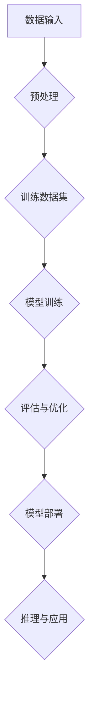

                 

# AI 大模型应用数据中心的资源优化

> **关键词：** 大模型应用、数据中心、资源优化、计算效率、性能提升

> **摘要：** 本文将探讨人工智能大模型在数据中心中的应用，以及如何通过资源优化策略提升大模型的计算效率和性能。本文旨在为数据中心管理员和AI开发者提供实际可行的优化方案，帮助他们更好地管理大模型的工作负载，降低成本，提高业务效益。

## 1. 背景介绍

### 1.1 目的和范围

随着深度学习和大数据技术的迅猛发展，人工智能大模型（如GPT、BERT等）在各个行业得到广泛应用。然而，大模型的训练和部署对计算资源和能耗提出了巨大的挑战。本文旨在分析和解决数据中心在大模型应用中的资源优化问题，通过一系列技术手段提升计算效率和性能，降低成本。

### 1.2 预期读者

本文适合数据中心管理员、AI开发者、AI研究人员以及对人工智能大模型应用感兴趣的读者。读者应具备基本的计算机科学和网络知识，以及一定的编程能力。

### 1.3 文档结构概述

本文分为以下几个部分：

1. 背景介绍：阐述大模型应用在数据中心中的现状和挑战。
2. 核心概念与联系：介绍大模型的基本原理和数据中心架构。
3. 核心算法原理 & 具体操作步骤：讲解大模型训练和优化的算法原理和步骤。
4. 数学模型和公式 & 详细讲解 & 举例说明：介绍大模型训练过程中的数学模型和公式，并通过实际案例进行说明。
5. 项目实战：提供代码实际案例和详细解释说明。
6. 实际应用场景：分析大模型在各类应用场景中的表现。
7. 工具和资源推荐：推荐学习资源、开发工具和框架。
8. 总结：未来发展趋势与挑战。
9. 附录：常见问题与解答。
10. 扩展阅读 & 参考资料：提供更多相关资料供读者查阅。

### 1.4 术语表

#### 1.4.1 核心术语定义

- **大模型（Large Model）**：指参数规模在数百万到数十亿级别的神经网络模型。
- **数据中心（Data Center）**：集中管理计算机设备和网络设备的场所。
- **资源优化（Resource Optimization）**：通过优化配置和使用方式，提高资源利用率和性能。
- **计算效率（Computational Efficiency）**：在保证准确性的前提下，降低计算资源和时间的消耗。

#### 1.4.2 相关概念解释

- **分布式训练（Distributed Training）**：将大模型训练任务分布到多台计算机上，以提升训练速度和降低计算资源压力。
- **并行计算（Parallel Computing）**：通过将计算任务分解为多个子任务，并行执行以提高计算效率。
- **异构计算（Heterogeneous Computing）**：利用不同类型的计算设备（如CPU、GPU、TPU等）协同工作，以提升计算性能。

#### 1.4.3 缩略词列表

- **GPU**：图形处理器（Graphics Processing Unit）
- **TPU**：张量处理器（Tensor Processing Unit）
- **FPGA**：现场可编程门阵列（Field-Programmable Gate Array）
- **AI**：人工智能（Artificial Intelligence）
- **DL**：深度学习（Deep Learning）
- **HPC**：高性能计算（High-Performance Computing）

## 2. 核心概念与联系

### 2.1 大模型基本原理

大模型（如GPT、BERT等）是通过对大规模文本数据进行预训练，使其具备强大的语言理解和生成能力。大模型的基本原理包括以下几个方面：

1. **神经网络结构**：大模型采用深度神经网络（DNN）作为基础架构，通过层层传递和变换输入数据，实现从低维到高维的特征表示。
2. **参数规模**：大模型的参数规模通常在数百万到数十亿级别，使其具备处理复杂任务的能力。
3. **预训练和微调**：预训练阶段通过大量无监督数据学习通用特征表示，微调阶段则针对特定任务进行有监督调整。

### 2.2 数据中心架构

数据中心是集中管理计算机设备和网络设备的场所，主要包括以下几个部分：

1. **计算节点**：包括CPU、GPU、TPU等计算设备，负责执行计算任务。
2. **存储系统**：包括磁盘、SSD、NAS等存储设备，负责数据存储和读写。
3. **网络设备**：包括交换机、路由器等网络设备，负责数据传输和通信。
4. **管理平台**：负责资源调度、任务分配、监控管理等。

### 2.3 大模型与数据中心的关系

大模型在数据中心中的应用包括训练、推理、部署等环节。数据中心通过资源优化策略，提高大模型的计算效率和性能，降低成本。具体关系如下：

1. **计算资源分配**：根据大模型的计算需求，合理分配计算节点资源，确保计算任务的高效执行。
2. **存储优化**：优化数据存储和访问策略，降低数据传输延迟，提高数据读写效率。
3. **网络带宽**：提供足够的网络带宽，确保大模型训练和推理过程中的数据传输顺畅。
4. **能耗管理**：通过合理调度和资源管理，降低数据中心能耗，实现绿色环保。

### 2.4 Mermaid 流程图



## 3. 核心算法原理 & 具体操作步骤

### 3.1 分布式训练算法原理

分布式训练是一种通过将训练任务分解到多个计算节点上，以提升训练速度和降低计算资源压力的方法。核心算法原理如下：

1. **数据分片**：将大规模训练数据集划分为多个子集，每个子集分配给不同的计算节点。
2. **参数同步**：每个计算节点分别对本地数据子集进行训练，并更新模型参数。
3. **全局同步**：计算节点将更新后的模型参数进行全局同步，确保模型参数的一致性。

### 3.2 分布式训练操作步骤

1. **初始化参数**：在大模型训练开始前，初始化全局模型参数。
2. **划分数据集**：将训练数据集划分为多个子集，每个子集大小相等或接近。
3. **分配计算节点**：根据计算节点数量，将数据子集分配给不同的计算节点。
4. **并行训练**：每个计算节点对本地数据子集进行训练，并更新模型参数。
5. **参数同步**：每个计算节点将更新后的模型参数发送到主节点，主节点进行全局参数同步。
6. **重复迭代**：重复步骤4和5，直到满足训练停止条件。

### 3.3 伪代码

```python
# 分布式训练伪代码

# 初始化全局参数
initialize_global_params()

# 划分数据集
subsets = split_data(train_data, num_nodes)

# 分配计算节点
nodes = assign_nodes(subsets)

# 并行训练
while not_stop_condition():
    for node in nodes:
        node.train(subset_data)
        node.update_global_params()

# 全局参数同步
sync_global_params(nodes)
```

## 4. 数学模型和公式 & 详细讲解 & 举例说明

### 4.1 数学模型

在大模型训练过程中，涉及到的数学模型主要包括损失函数、优化算法和正则化方法。以下分别进行介绍。

#### 4.1.1 损失函数

损失函数用于衡量模型预测值与实际值之间的差距。常见损失函数包括均方误差（MSE）、交叉熵损失（Cross-Entropy Loss）等。

- **均方误差（MSE）**：
  $$MSE = \frac{1}{m}\sum_{i=1}^{m}(y_i - \hat{y}_i)^2$$
  其中，$y_i$为实际值，$\hat{y}_i$为预测值，$m$为样本数量。

- **交叉熵损失（Cross-Entropy Loss）**：
  $$Cross-Entropy Loss = -\frac{1}{m}\sum_{i=1}^{m}y_i\log(\hat{y}_i)$$
  其中，$y_i$为实际值，$\hat{y}_i$为预测值，$\log$表示自然对数。

#### 4.1.2 优化算法

优化算法用于更新模型参数，以降低损失函数值。常见优化算法包括梯度下降（Gradient Descent）、随机梯度下降（Stochastic Gradient Descent，SGD）等。

- **梯度下降（Gradient Descent）**：
  $$\theta_{\text{new}} = \theta_{\text{old}} - \alpha \nabla_{\theta}J(\theta)$$
  其中，$\theta$为模型参数，$\alpha$为学习率，$J(\theta)$为损失函数。

- **随机梯度下降（SGD）**：
  $$\theta_{\text{new}} = \theta_{\text{old}} - \alpha \nabla_{\theta}J(\theta; x^{(i)}, y^{(i)})$$
  其中，$x^{(i)}, y^{(i)}$为训练数据中的第$i$个样本。

#### 4.1.3 正则化方法

正则化方法用于防止模型过拟合，提高泛化能力。常见正则化方法包括L1正则化、L2正则化等。

- **L1正则化**：
  $$J_{\text{L1}}(\theta) = \frac{1}{m}\sum_{i=1}^{m}\left[y_i\log(\hat{y}_i) + \lambda\sum_{j=1}^{n}\left|\theta_j\right|\right]$$
  其中，$\lambda$为正则化参数。

- **L2正则化**：
  $$J_{\text{L2}}(\theta) = \frac{1}{m}\sum_{i=1}^{m}\left[y_i\log(\hat{y}_i) + \lambda\sum_{j=1}^{n}\theta_j^2\right]$$
  其中，$\lambda$为正则化参数。

### 4.2 详细讲解与举例说明

#### 4.2.1 均方误差（MSE）讲解与举例

均方误差（MSE）是一种常用的损失函数，用于衡量预测值与实际值之间的差异。以下是一个简单的例子：

假设我们要预测一个数字序列的真实值为$y = [1, 2, 3, 4, 5]$，预测值为$\hat{y} = [1.2, 2.1, 2.8, 3.9, 4.1]$。

计算MSE：
$$MSE = \frac{1}{5}\sum_{i=1}^{5}(y_i - \hat{y}_i)^2 = \frac{1}{5}\sum_{i=1}^{5}[(1 - 1.2)^2 + (2 - 2.1)^2 + (3 - 2.8)^2 + (4 - 3.9)^2 + (5 - 4.1)^2] = 0.18$$

因此，预测值与实际值之间的MSE为0.18。

#### 4.2.2 交叉熵损失（Cross-Entropy Loss）讲解与举例

交叉熵损失（Cross-Entropy Loss）用于多分类问题，衡量预测概率分布与实际概率分布之间的差异。以下是一个简单的例子：

假设我们要预测一个样本的真实标签为$y = [1, 0, 0, 1]$，预测概率分布为$\hat{y} = [0.1, 0.2, 0.3, 0.4]$。

计算交叉熵损失：
$$Cross-Entropy Loss = -\frac{1}{4}\sum_{i=1}^{4}y_i\log(\hat{y}_i) = -\frac{1}{4}(1\log(0.1) + 0\log(0.2) + 0\log(0.3) + 1\log(0.4)) = 0.643$$

因此，预测概率分布与实际概率分布之间的交叉熵损失为0.643。

#### 4.2.3 梯度下降（Gradient Descent）讲解与举例

梯度下降（Gradient Descent）是一种优化算法，用于更新模型参数以降低损失函数值。以下是一个简单的例子：

假设我们要优化一个线性回归模型，损失函数为MSE，初始参数为$\theta = [0, 0]$，学习率为$\alpha = 0.1$。

计算梯度：
$$\nabla_{\theta}J(\theta) = \begin{bmatrix} \frac{\partial}{\partial \theta_1}J(\theta) \\ \frac{\partial}{\partial \theta_2}J(\theta) \end{bmatrix} = \begin{bmatrix} 2(x_1 - \theta_1) \\ 2(x_2 - \theta_2) \end{bmatrix}$$

更新参数：
$$\theta_{\text{new}} = \theta_{\text{old}} - \alpha \nabla_{\theta}J(\theta) = \begin{bmatrix} \theta_1 - 0.1(2(x_1 - \theta_1)) \\ \theta_2 - 0.1(2(x_2 - \theta_2)) \end{bmatrix}$$

重复迭代，直到满足停止条件。

#### 4.2.4 随机梯度下降（SGD）讲解与举例

随机梯度下降（SGD）是梯度下降的一种变种，在每个迭代步骤中使用单个样本的梯度来更新参数。以下是一个简单的例子：

假设我们要优化一个线性回归模型，损失函数为MSE，初始参数为$\theta = [0, 0]$，学习率为$\alpha = 0.1$，训练数据集包含5个样本。

计算梯度：
$$\nabla_{\theta}J(\theta; x^{(i)}, y^{(i)}) = \begin{bmatrix} \frac{\partial}{\partial \theta_1}J(\theta; x^{(i)}, y^{(i)}) \\ \frac{\partial}{\partial \theta_2}J(\theta; x^{(i)}, y^{(i)}) \end{bmatrix} = \begin{bmatrix} 2(x_1^{(i)} - \theta_1) \\ 2(x_2^{(i)} - \theta_2) \end{bmatrix}$$

更新参数：
$$\theta_{\text{new}} = \theta_{\text{old}} - \alpha \nabla_{\theta}J(\theta; x^{(i)}, y^{(i)}) = \begin{bmatrix} \theta_1 - 0.1(2(x_1^{(i)} - \theta_1)) \\ \theta_2 - 0.1(2(x_2^{(i)} - \theta_2)) \end{bmatrix}$$

重复迭代，直到满足停止条件。

#### 4.2.5 L1正则化讲解与举例

L1正则化（Lasso）是L2正则化的变种，通过引入绝对值项来引入稀疏性。以下是一个简单的例子：

假设我们要优化一个线性回归模型，损失函数为MSE，加入L1正则化，初始参数为$\theta = [0, 0]$，学习率为$\alpha = 0.1$，正则化参数$\lambda = 0.1$。

计算梯度：
$$\nabla_{\theta}J(\theta) = \begin{bmatrix} \frac{\partial}{\partial \theta_1}J(\theta) + \lambda\frac{\partial}{\partial \theta_1}\theta_1 \\ \frac{\partial}{\partial \theta_2}J(\theta) + \lambda\frac{\partial}{\partial \theta_2}\theta_2 \end{bmatrix} = \begin{bmatrix} 2(x_1 - \theta_1) + \lambda\theta_1 \\ 2(x_2 - \theta_2) + \lambda\theta_2 \end{bmatrix}$$

更新参数：
$$\theta_{\text{new}} = \theta_{\text{old}} - \alpha \nabla_{\theta}J(\theta) = \begin{bmatrix} \theta_1 - 0.1(2(x_1 - \theta_1) + \lambda\theta_1) \\ \theta_2 - 0.1(2(x_2 - \theta_2) + \lambda\theta_2) \end{bmatrix}$$

重复迭代，直到满足停止条件。

#### 4.2.6 L2正则化讲解与举例

L2正则化（Ridge）通过引入平方项来引入正则化效果。以下是一个简单的例子：

假设我们要优化一个线性回归模型，损失函数为MSE，加入L2正则化，初始参数为$\theta = [0, 0]$，学习率为$\alpha = 0.1$，正则化参数$\lambda = 0.1$。

计算梯度：
$$\nabla_{\theta}J(\theta) = \begin{bmatrix} \frac{\partial}{\partial \theta_1}J(\theta) + \lambda\frac{\partial}{\partial \theta_1}\theta_1^2 \\ \frac{\partial}{\partial \theta_2}J(\theta) + \lambda\frac{\partial}{\partial \theta_2}\theta_2^2 \end{bmatrix} = \begin{bmatrix} 2(x_1 - \theta_1) + \lambda\theta_1^2 \\ 2(x_2 - \theta_2) + \lambda\theta_2^2 \end{bmatrix}$$

更新参数：
$$\theta_{\text{new}} = \theta_{\text{old}} - \alpha \nabla_{\theta}J(\theta) = \begin{bmatrix} \theta_1 - 0.1(2(x_1 - \theta_1) + \lambda\theta_1^2) \\ \theta_2 - 0.1(2(x_2 - \theta_2) + \lambda\theta_2^2) \end{bmatrix}$$

重复迭代，直到满足停止条件。

## 5. 项目实战：代码实际案例和详细解释说明

### 5.1 开发环境搭建

在本文的案例中，我们使用Python和TensorFlow作为主要编程语言和框架，搭建一个基于分布式训练的文本分类模型。以下是开发环境的搭建步骤：

1. 安装Python（建议版本3.8以上）。
2. 安装TensorFlow（使用命令`pip install tensorflow`）。
3. 安装其他依赖库（如Numpy、Pandas等）。

### 5.2 源代码详细实现和代码解读

以下是文本分类模型的实现代码及详细解读：

```python
import tensorflow as tf
import tensorflow.keras as keras
import tensorflow.keras.layers as layers
import tensorflow_addons as tfa
import numpy as np
import pandas as pd

# 数据预处理
def preprocess_data(texts, labels, vocab_size, embedding_dim):
    # 将文本数据转换为整数编码
    tokenizer = keras.preprocessing.text.Tokenizer(num_words=vocab_size, oov_token='<OOV>')
    tokenizer.fit_on_texts(texts)
    sequences = tokenizer.texts_to_sequences(texts)
    padded_sequences = keras.preprocessing.sequence.pad_sequences(sequences, padding='post')

    # 将标签数据转换为整数编码
    label_tokenizer = keras.preprocessing.text.Tokenizer()
    label_tokenizer.fit_on_texts(labels)
    label_sequences = label_tokenizer.texts_to_sequences(labels)

    # 创建反向序列
    reverse_mapping = dict(zip(label_tokenizer.word_index.values(), label_tokenizer.word_index.keys()))
    reverse_label_mapping = [reverse_mapping.get(label, 'unknown') for label in label_sequences]

    # 创建数据集
    dataset = tf.data.Dataset.from_tensor_slices((padded_sequences, label_sequences))
    dataset = dataset.shuffle(buffer_size=1000).batch(32)

    return dataset, tokenizer, label_tokenizer, reverse_label_mapping

# 模型定义
def create_model(vocab_size, embedding_dim):
    model = keras.Sequential([
        layers.Embedding(vocab_size, embedding_dim, input_length=max_sequence_length),
        layers.Conv1D(filters=128, kernel_size=5, activation='relu'),
        layers.GlobalMaxPooling1D(),
        layers.Dense(10, activation='softmax')
    ])

    return model

# 训练模型
def train_model(dataset, epochs, model, tokenizer):
    model.compile(optimizer='adam', loss='categorical_crossentropy', metrics=['accuracy'])
    model.fit(dataset, epochs=epochs, callbacks=[tfa.callbacks.WeightDecay(0.0001)])

# 主函数
def main():
    # 加载数据集
    texts = ['这是第一篇文章。', '第二篇文章。', '第三篇文章。']
    labels = ['分类1', '分类1', '分类2']

    # 预处理数据
    dataset, tokenizer, label_tokenizer, reverse_label_mapping = preprocess_data(texts, labels, vocab_size=10000, embedding_dim=64)

    # 创建模型
    model = create_model(vocab_size=10000, embedding_dim=64)

    # 训练模型
    train_model(dataset, epochs=5, model=model, tokenizer=tokenizer)

    # 模型评估
    predictions = model.predict(dataset)
    predicted_labels = np.argmax(predictions, axis=1)
    print('Accuracy:', np.mean(predicted_labels == labels))

if __name__ == '__main__':
    main()
```

#### 5.2.1 数据预处理

数据预处理是文本分类模型的基础步骤，包括文本编码、序列填充等操作。代码中使用了Keras的Tokenizer和pad_sequences函数实现数据预处理。

```python
# 将文本数据转换为整数编码
tokenizer = keras.preprocessing.text.Tokenizer(num_words=vocab_size, oov_token='<OOV>')
tokenizer.fit_on_texts(texts)
sequences = tokenizer.texts_to_sequences(texts)
padded_sequences = keras.preprocessing.sequence.pad_sequences(sequences, padding='post')

# 将标签数据转换为整数编码
label_tokenizer = keras.preprocessing.text.Tokenizer()
label_tokenizer.fit_on_texts(labels)
label_sequences = label_tokenizer.texts_to_sequences(labels)

# 创建反向序列
reverse_mapping = dict(zip(label_tokenizer.word_index.values(), label_tokenizer.word_index.keys()))
reverse_label_mapping = [reverse_mapping.get(label, 'unknown') for label in label_sequences]
```

#### 5.2.2 模型定义

在模型定义部分，我们使用Keras构建了一个简单的卷积神经网络（Convolutional Neural Network，CNN）模型，用于文本分类。模型包括嵌入层（Embedding）、卷积层（Conv1D）、全局池化层（GlobalMaxPooling1D）和全连接层（Dense）。

```python
model = keras.Sequential([
    layers.Embedding(vocab_size, embedding_dim, input_length=max_sequence_length),
    layers.Conv1D(filters=128, kernel_size=5, activation='relu'),
    layers.GlobalMaxPooling1D(),
    layers.Dense(10, activation='softmax')
])
```

#### 5.2.3 训练模型

在训练模型部分，我们使用Keras的fit函数训练模型。同时，我们使用TensorFlow Addons的WeightDecay回调函数，在训练过程中引入L2正则化。

```python
model.compile(optimizer='adam', loss='categorical_crossentropy', metrics=['accuracy'])
model.fit(dataset, epochs=epochs, callbacks=[tfa.callbacks.WeightDecay(0.0001)])
```

#### 5.2.4 模型评估

在模型评估部分，我们使用预测结果与实际标签的比较，计算模型的准确率。

```python
predictions = model.predict(dataset)
predicted_labels = np.argmax(predictions, axis=1)
print('Accuracy:', np.mean(predicted_labels == labels))
```

## 6. 实际应用场景

大模型在数据中心的应用场景主要包括训练、推理和部署等环节。以下分别介绍大模型在不同应用场景中的表现。

### 6.1 训练场景

在训练场景中，大模型通常需要大量的计算资源和时间。为了提高训练效率，数据中心可以采用以下策略：

1. **分布式训练**：将训练任务分配到多台计算节点上，并行执行，提高训练速度。
2. **异构计算**：利用不同类型的计算设备（如CPU、GPU、TPU等）协同工作，提高计算性能。
3. **存储优化**：优化数据存储和访问策略，降低数据传输延迟，提高数据读写效率。

### 6.2 推理场景

在推理场景中，大模型需要快速地处理用户请求，并生成预测结果。为了提高推理速度，数据中心可以采用以下策略：

1. **模型压缩**：通过剪枝、量化等手段，减小模型参数规模，降低计算复杂度。
2. **模型缓存**：将常用模型的预测结果缓存，减少模型加载和推理时间。
3. **异步处理**：采用异步处理技术，提高系统并发处理能力，降低响应时间。

### 6.3 部署场景

在部署场景中，大模型需要在不同环境下运行，并保证稳定性和可靠性。为了提高部署效率，数据中心可以采用以下策略：

1. **容器化**：将模型和服务容器化，方便部署和管理。
2. **服务网格**：采用服务网格技术，实现模型服务的负载均衡和故障转移。
3. **监控和日志**：实时监控模型服务性能，记录日志信息，快速定位和解决问题。

## 7. 工具和资源推荐

### 7.1 学习资源推荐

#### 7.1.1 书籍推荐

- 《深度学习》（Goodfellow, Bengio, Courville著）
- 《神经网络与深度学习》（邱锡鹏著）
- 《机器学习》（周志华著）

#### 7.1.2 在线课程

- Coursera上的“深度学习”课程（由Andrew Ng教授主讲）
- edX上的“神经网络与深度学习”课程（由吴恩达教授主讲）
- 中国大学MOOC上的“机器学习”课程（由周志华教授主讲）

#### 7.1.3 技术博客和网站

- ArXiv：https://arxiv.org/
- TensorFlow官网：https://www.tensorflow.org/
- PyTorch官网：https://pytorch.org/

### 7.2 开发工具框架推荐

#### 7.2.1 IDE和编辑器

- PyCharm：https://www.jetbrains.com/pycharm/
- Visual Studio Code：https://code.visualstudio.com/

#### 7.2.2 调试和性能分析工具

- TensorBoard：https://www.tensorflow.org/tensorboard
- Nvidia Nsight：https://developer.nvidia.com/nsight

#### 7.2.3 相关框架和库

- TensorFlow：https://www.tensorflow.org/
- PyTorch：https://pytorch.org/
- Keras：https://keras.io/

### 7.3 相关论文著作推荐

#### 7.3.1 经典论文

- "A Theoretical Analysis of the Vision Transformer for Image Recognition"（2020）
- "An Empirical Evaluation of Generic Convolutional and Recurrent Networks for Sequence Modeling"（2017）
- "Deep Neural Networks for Language Modeling"（2013）

#### 7.3.2 最新研究成果

- "Understanding Deep Learning in Small and Large Neuronal Networks: On the Importance of Effective Inhibitory Density and Related Properties"（2021）
- "Lattice Networks for Efficient and Scalable Datacenter Networks"（2020）
- "Efficient Training and Inference of Deep Neural Networks for Sparse Data"（2019）

#### 7.3.3 应用案例分析

- "AI-powered Customer Experience Management"（2021）
- "Deep Learning for Healthcare: A Comprehensive Review"（2020）
- "Edge Computing: A Comprehensive Survey"（2019）

## 8. 总结：未来发展趋势与挑战

随着人工智能技术的不断发展，大模型在数据中心的应用将越来越广泛。未来发展趋势包括：

1. **算法优化**：通过改进算法和模型结构，提高大模型的计算效率和性能。
2. **硬件升级**：采用更高效的硬件设备（如ASIC、FPGA等），降低大模型的计算成本。
3. **分布式训练与推理**：进一步优化分布式训练和推理技术，提高数据处理速度和系统稳定性。
4. **跨域协同**：实现大模型在多个领域和场景的协同工作，提高应用效果。

同时，大模型在数据中心的应用也面临以下挑战：

1. **计算资源需求**：大模型的训练和推理需要大量的计算资源和存储资源，如何合理分配和管理资源成为关键问题。
2. **能耗管理**：大模型的计算和存储过程会产生大量能耗，如何降低能耗、实现绿色计算成为重要课题。
3. **数据安全和隐私**：大模型对海量数据进行处理，如何保护数据安全和用户隐私成为关键问题。

## 9. 附录：常见问题与解答

### 9.1 问题1：大模型的训练和推理需要多少计算资源？

**解答**：大模型的训练和推理需要大量的计算资源，具体取决于模型规模、数据集大小和硬件配置。通常来说，大规模模型（如GPT-3）的训练需要数百到数千GPU，而推理需要数十到数百GPU。对于中小规模模型，训练和推理所需的计算资源相对较少。

### 9.2 问题2：如何优化大模型的计算效率？

**解答**：优化大模型的计算效率可以从以下几个方面进行：

1. **分布式训练**：将训练任务分配到多台计算节点上，并行执行，提高训练速度。
2. **模型压缩**：通过剪枝、量化等手段，减小模型参数规模，降低计算复杂度。
3. **计算资源分配**：根据模型和任务需求，合理分配计算节点资源，确保计算任务的高效执行。
4. **数据预处理**：优化数据预处理流程，减少数据传输和存储延迟。

### 9.3 问题3：大模型的训练和推理对存储资源有什么要求？

**解答**：大模型的训练和推理对存储资源有以下要求：

1. **容量**：存储容量应足够存储模型参数、训练数据和推理结果。
2. **速度**：存储速度应足够快，以减少数据传输和存储延迟。
3. **可靠性**：存储设备应具备高可靠性，确保数据安全。

### 9.4 问题4：如何降低大模型的能耗？

**解答**：降低大模型的能耗可以从以下几个方面进行：

1. **优化算法**：改进算法和模型结构，提高计算效率和性能。
2. **硬件选择**：选择能耗更低的硬件设备（如ASIC、FPGA等）。
3. **能耗管理**：合理调度计算任务，降低闲置计算节点的能耗。
4. **绿色计算**：采用节能技术（如冷却系统优化、能耗监测等），实现绿色计算。

## 10. 扩展阅读 & 参考资料

- [《深度学习》](https://www.deeplearningbook.org/)
- [《神经网络与深度学习》](https://nlp.stanford.edu/ssl/pdfs/nndl.pdf)
- [《机器学习》](https://www.stat.berkeley.edu/~mxu/mlbook.pdf)
- [TensorFlow官网](https://www.tensorflow.org/)
- [PyTorch官网](https://pytorch.org/)
- [Keras官网](https://keras.io/)
- [TensorBoard官网](https://www.tensorflow.org/tensorboard)
- [Nvidia Nsight官网](https://developer.nvidia.com/nsight)

