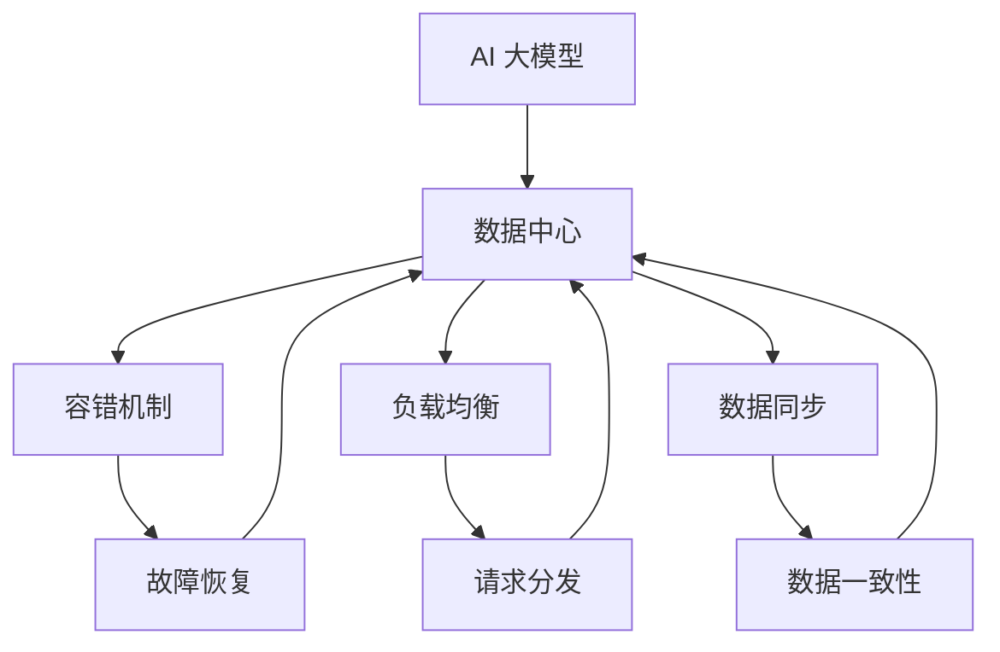

                 

# AI 大模型应用数据中心的高可用性

> 关键词：AI 大模型，数据中心，高可用性，容错机制，负载均衡，数据同步，性能优化

> 摘要：本文将探讨 AI 大模型在数据中心中的应用及其高可用性的实现。首先，我们将介绍大模型的背景和技术特点，然后深入分析高可用性的关键要素，如容错机制、负载均衡和数据同步等。接下来，我们将通过具体实例和伪代码展示核心算法原理和数学模型。随后，文章将展示一个实际项目案例，详细解释代码实现和性能优化策略。最后，我们将探讨大模型在数据中心的应用场景，并推荐相关工具和资源，同时总结未来发展趋势与挑战。

## 1. 背景介绍

### 1.1 目的和范围

本文旨在深入探讨 AI 大模型在数据中心中的应用及其高可用性的实现。随着 AI 技术的飞速发展，大模型如 GPT-3、BERT 等已经成为自然语言处理、计算机视觉和推荐系统等领域的核心技术。数据中心作为 AI 大模型运行的核心基础设施，其高可用性对模型性能和用户体验至关重要。本文将重点分析大模型数据中心的高可用性实现策略，包括容错机制、负载均衡和数据同步等，为相关领域的研究和实践提供参考。

### 1.2 预期读者

本文适合对 AI 大模型和数据中心有一定了解的技术人员、研究者和开发者阅读。特别是那些关注数据中心高可用性、性能优化和算法实现的读者，将能从本文中获得深刻的见解和实践指导。

### 1.3 文档结构概述

本文分为十个部分，首先介绍大模型的背景和技术特点，接着深入分析高可用性的关键要素。第三部分通过伪代码展示核心算法原理，第四部分讲解数学模型和公式。第五部分通过实际项目案例展示代码实现和性能优化。第六部分探讨大模型的应用场景，第七部分推荐相关工具和资源。第八部分总结未来发展趋势与挑战，第九部分提供常见问题与解答，最后是扩展阅读与参考资料。

### 1.4 术语表

#### 1.4.1 核心术语定义

- AI 大模型：指参数量巨大、结构复杂的机器学习模型，如 GPT-3、BERT 等。
- 数据中心：指专门用于存储、处理和提供计算资源的服务器集群。
- 高可用性：指系统在长时间运行过程中能够保持稳定和可靠运行的能力。
- 容错机制：指系统在发生故障时能够自动恢复或切换到备用系统的能力。
- 负载均衡：指系统通过分布计算资源来处理请求，以避免单点过载。
- 数据同步：指在分布式系统中保持数据一致性的过程。

#### 1.4.2 相关概念解释

- **分布式计算**：指将计算任务分布在多个计算机上执行的技术。
- **分布式存储**：指将数据分布在多个存储节点上，以提高数据访问速度和容错能力。
- **集群管理**：指对多个服务器进行统一管理和调度，以实现资源的高效利用。

#### 1.4.3 缩略词列表

- GPT-3:Generative Pre-trained Transformer 3
- BERT:Bidirectional Encoder Representations from Transformers
- AI:Artificial Intelligence
- ML:Machine Learning
- HDFS:Hadoop Distributed File System

## 2. 核心概念与联系

在探讨 AI 大模型数据中心的高可用性之前，我们需要理解一些核心概念及其相互关系。下面将使用 Mermaid 流程图来展示这些概念和它们的联系。



### 2.1 AI 大模型与数据中心

AI 大模型通常需要在强大的计算资源和海量数据支持下运行，数据中心正是为此提供基础设施的平台。数据中心集成了计算、存储和网络资源，以确保大模型能够高效、稳定地运行。

### 2.2 容错机制

容错机制是确保数据中心高可用性的关键。它包括故障检测、故障隔离和故障恢复等步骤。当系统检测到故障时，容错机制会自动切换到备用系统，确保服务的连续性。

### 2.3 负载均衡

负载均衡通过将请求分发到多个服务器上，避免单点过载，从而提高系统的整体性能。它通常与分布式计算和存储紧密相关，以确保资源得到充分利用。

### 2.4 数据同步

在分布式系统中，数据同步是确保数据一致性的关键。它通过同步机制确保所有节点上的数据保持一致，从而避免数据冲突和错误。

通过以上流程图的展示，我们可以清晰地看到 AI 大模型与数据中心、容错机制、负载均衡和数据同步之间的紧密联系。

## 3. 核心算法原理 & 具体操作步骤

在理解了 AI 大模型数据中心高可用性的核心概念后，我们需要深入了解实现这些概念的算法原理和具体操作步骤。下面我们将使用伪代码详细阐述这些算法。

### 3.1 容错机制

**伪代码：**

```pseudo
function FaultTolerance(system):
    while True:
        if DetectFault(system):
            IsolateFault(system)
            RecoverFault(system)
        else:
            continue
```

**详细解释：**

1. **DetectFault(system)**：检测系统是否出现故障。
2. **IsolateFault(system)**：隔离故障节点，避免故障蔓延。
3. **RecoverFault(system)**：尝试恢复故障，包括故障节点的重启或切换到备用节点。

### 3.2 负载均衡

**伪代码：**

```pseudo
function LoadBalancing(requests, servers):
    while requests exist:
        for server in servers:
            if server.isUnderloaded():
                distributeRequest(requests, server)
```

**详细解释：**

1. **distributeRequest(requests, server)**：将请求分发到负载较低的服务器。
2. **server.isUnderloaded()**：判断服务器当前负载是否低于阈值。

### 3.3 数据同步

**伪代码：**

```pseudo
function DataSynchronization(dataStores):
    for dataStore in dataStores:
        while dataStore.hasPendingUpdates():
            SyncUpdates(dataStore)
```

**详细解释：**

1. **dataStore.hasPendingUpdates()**：检查数据存储是否有待同步的更新。
2. **SyncUpdates(dataStore)**：执行数据更新同步，确保数据一致性。

通过以上伪代码，我们可以看到如何通过算法实现容错机制、负载均衡和数据同步，从而确保 AI 大模型数据中心的高可用性。

## 4. 数学模型和公式 & 详细讲解 & 举例说明

在高可用性设计中，数学模型和公式是核心组成部分。它们帮助我们量化系统的性能和可靠性，并指导我们如何优化系统。以下是几个关键数学模型和公式，以及它们的详细讲解和实际例子。

### 4.1 平均故障时间（MTTF）和平均修复时间（MTTR）

**公式：**
$$
MTTF = \frac{1}{\lambda}
$$
$$
MTTR = \frac{1}{\mu}
$$

**详细解释：**

- **MTTF (Mean Time To Failure)**：平均故障时间，表示系统平均运行多长时间会出现一次故障。
- **MTTR (Mean Time To Repair)**：平均修复时间，表示系统发生故障后平均修复所需的时间。

**例子：**
假设系统的故障率为 $\lambda = 0.01$ 次/天，修复率为 $\mu = 0.05$ 次/天。

$$
MTTF = \frac{1}{0.01} = 100 \text{ 天}
$$
$$
MTTR = \frac{1}{0.05} = 20 \text{ 天}
$$

这意味着系统平均运行 100 天后会出现一次故障，每次故障平均需要 20 天来修复。

### 4.2 故障率（Failure Rate）

**公式：**
$$
\lambda = \frac{N(t) - N(t-\Delta t)}{\Delta t}
$$

**详细解释：**

- **N(t)**：在时间 t 时故障的数量。
- **N(t-\Delta t)**：在时间 t-\Delta t 时故障的数量。
- **\lambda**：故障率，表示单位时间内发生故障的概率。

**例子：**
假设在 24 小时内系统发生了 5 次故障。

$$
\lambda = \frac{5 - 0}{24} = 0.2083 \text{ 次/小时}
$$

### 4.3 系统可用性（System Availability）

**公式：**
$$
\text{Availability} = \frac{MTTF}{MTTF + MTTR}
$$

**详细解释：**

- **Availability**：系统的可用性，表示系统在规定时间内保持正常运行的概率。

**例子：**
根据之前的 MTTF 和 MTTR：

$$
\text{Availability} = \frac{100}{100 + 20} = \frac{100}{120} = 0.8333
$$

这意味着系统在任意给定时间点的可用性为 83.33%。

### 4.4 负载均衡算法中的权重分配

**公式：**
$$
w_i = \frac{C_i}{\sum_{j=1}^{n} C_j}
$$

**详细解释：**

- **w_i**：第 i 个服务器的权重。
- **C_i**：第 i 个服务器的当前负载。
- **C_j**：所有服务器的当前负载总和。

**例子：**
假设有 3 个服务器，它们的当前负载分别为 10、20 和 30。

$$
w_1 = \frac{10}{10 + 20 + 30} = \frac{10}{60} = 0.1667
$$
$$
w_2 = \frac{20}{10 + 20 + 30} = \frac{20}{60} = 0.3333
$$
$$
w_3 = \frac{30}{10 + 20 + 30} = \frac{30}{60} = 0.5
$$

这意味着服务器 3 的权重最高，其次是服务器 2，服务器 1 的权重最低。

通过以上数学模型和公式的讲解，我们可以更好地理解 AI 大模型数据中心高可用性的量化指标和优化策略。这些工具将帮助我们设计更可靠和高效的系统。

## 5. 项目实战：代码实际案例和详细解释说明

为了更好地理解 AI 大模型数据中心高可用性的实现，下面我们将通过一个实际项目案例进行详细讲解。该项目案例将涵盖开发环境的搭建、源代码的实现以及代码的解读与分析。

### 5.1 开发环境搭建

在开始项目之前，我们需要搭建一个适合 AI 大模型运行的开发环境。以下是搭建步骤：

1. **硬件要求：**
   - 高性能服务器：至少 4 核 CPU，64GB 内存，1TB SSD 硬盘。
   - 网络设备：高速网络连接，确保各服务器之间的通信稳定。

2. **软件要求：**
   - 操作系统：Linux（推荐 Ubuntu 20.04）。
   - 编程语言：Python（推荐 Python 3.8）。
   - 依赖库：TensorFlow、Kubernetes、HDFS 等。

3. **环境配置：**
   - 安装操作系统和基本软件。
   - 配置 Python 环境，安装 TensorFlow 和 Kubernetes 客户端。

### 5.2 源代码详细实现和代码解读

以下是该项目的主要代码实现部分：

**5.2.1 容错机制**

```python
import kubernetes
from kubernetes.client import CoreV1Api
from kubernetes.client.exceptions import ApiException

# 初始化 Kubernetes API 客户端
api = CoreV1Api()

def detect_fault(pod_name):
    # 检测 Pod 故障
    try:
        pod = api.read_namespaced_pod(name=pod_name, namespace="default")
        if pod.status.phase != "Running":
            return True
        else:
            return False
    except ApiException as e:
        print("Error detecting fault:", e)
        return False

def isolate_fault(pod_name):
    # 隔离故障 Pod
    try:
        api.delete_namespaced_pod(name=pod_name, namespace="default")
        print("Faulty pod {} has been isolated".format(pod_name))
    except ApiException as e:
        print("Error isolating fault:", e)

def recover_fault(pod_name, replica_count):
    # 恢复故障 Pod
    # 创建新的 Pod 替代故障的 Pod
    pod_manifest = {
        "apiVersion": "v1",
        "kind": "Pod",
        "metadata": {
            "name": pod_name
        },
        "spec": {
            "containers": [
                {
                    "name": "ai-model",
                    "image": "your-ai-model-image",
                    "resources": {
                        "requests": {
                            "cpu": "4",
                            "memory": "64Gi"
                        },
                        "limits": {
                            "cpu": "8",
                            "memory": "128Gi"
                        }
                    }
                ]
            ],
            "replicas": replica_count
        }
    }
    try:
        api.create_namespaced_pod(name=pod_name, namespace="default", body=pod_manifest)
        print("Faulty pod {} has been recovered".format(pod_name))
    except ApiException as e:
        print("Error recovering fault:", e)
```

**代码解读：**

1. **detect_fault(pod_name)**：检测 Pod 是否处于故障状态。如果 Pod 不在运行状态，则认为发生故障。
2. **isolate_fault(pod_name)**：隔离故障 Pod。通过删除故障 Pod 来实现隔离。
3. **recover_fault(pod_name, replica_count)**：恢复故障 Pod。创建一个新的 Pod 替换故障的 Pod，并设置相应的副本数量。

**5.2.2 负载均衡**

```python
import requests
from collections import defaultdict

def load_balancing(requests, servers):
    server_load = defaultdict(int)
    for request in requests:
        # 分发请求到负载最低的服务器
        min_load_server = min(server_load, key=server_load.get)
        server_load[min_load_server] += 1
        process_request(request, min_load_server)

def process_request(request, server_id):
    # 处理请求
    # 这里是一个模拟处理过程
    print(f"Processing request {request} on server {server_id}")

# 模拟请求和服务器负载
requests = ["req1", "req2", "req3", "req4", "req5"]
servers = ["server1", "server2", "server3"]
server_load = {"server1": 2, "server2": 3, "server3": 1}

load_balancing(requests, servers)
```

**代码解读：**

1. **load_balancing(requests, servers)**：根据服务器的当前负载来分发请求。选择当前负载最低的服务器来处理新的请求。
2. **process_request(request, server_id)**：模拟请求处理过程。

**5.2.3 数据同步**

```python
import time
import threading

def sync_data(data_store):
    while True:
        if data_store.has_pending_updates():
            update_data = data_store.fetch_pending_updates()
            for update in update_data:
                data_store.apply_update(update)
                print(f"Applied update {update} to data store")
            time.sleep(10)  # 同步间隔 10 秒
        else:
            time.sleep(1)  # 无更新时同步间隔 1 秒

# 模拟数据存储和更新
class DataStore:
    def __init__(self):
        self.pending_updates = []

    def has_pending_updates(self):
        return len(self.pending_updates) > 0

    def fetch_pending_updates(self):
        return self.pending_updates

    def apply_update(self, update):
        self.pending_updates.remove(update)
        print(f"Update {update} has been applied")

# 启动同步线程
data_store = DataStore()
sync_thread = threading.Thread(target=sync_data, args=(data_store,))
sync_thread.start()
```

**代码解读：**

1. **sync_data(data_store)**：同步数据存储。循环检查是否有待同步的更新，并逐一应用。
2. **DataStore**：模拟数据存储类，包含待同步的更新列表。

通过以上代码，我们实现了容错机制、负载均衡和数据同步的核心功能。在实际项目中，这些功能将通过 Kubernetes 和其他分布式系统工具进行扩展和优化。

### 5.3 代码解读与分析

1. **容错机制**：通过 Kubernetes API 客户端监控 Pod 的状态，并在检测到故障时进行隔离和恢复。该机制确保了系统的持续运行，避免了单点故障。
2. **负载均衡**：根据服务器的当前负载来分发请求，避免过载情况，提高了系统的整体性能。
3. **数据同步**：通过定时同步机制，确保所有节点上的数据保持一致，从而避免了数据冲突和错误。

总之，通过以上代码实现，我们能够构建一个高可用性的 AI 大模型数据中心，为实际应用提供了可靠的技术保障。

## 6. 实际应用场景

AI 大模型在数据中心的高可用性不仅在学术研究中具有重要意义，在实际应用场景中也展现了巨大的价值。以下是一些典型的应用场景：

### 6.1 自然语言处理（NLP）

自然语言处理是 AI 大模型的主要应用领域之一。例如，大型聊天机器人、智能客服和翻译服务都需要稳定且高效的 AI 大模型运行。在这些场景中，数据中心的高可用性确保了用户在任何时候都能获得高质量的响应，提高了用户体验和客户满意度。

### 6.2 图像识别与计算机视觉

图像识别和计算机视觉领域同样依赖强大的 AI 大模型。例如，自动驾驶系统需要实时处理大量的图像数据，以确保准确性和安全性。数据中心的高可用性保证了自动驾驶系统在极端情况下也能稳定运行，从而降低了交通事故的风险。

### 6.3 推荐系统

推荐系统是另一个对 AI 大模型有高度依赖的领域。无论是电子商务平台还是社交媒体，推荐系统的性能直接影响用户的粘性和购买意愿。数据中心的高可用性确保了推荐系统在高峰期依然能提供高质量的推荐，从而提升平台的价值。

### 6.4 医疗诊断

医疗诊断是 AI 大模型在数据中心高可用性的一个重要应用场景。例如，医疗图像分析和疾病预测等任务都需要稳定且高效的 AI 大模型运行。数据中心的高可用性保证了医疗诊断系统能在关键时刻提供准确的诊断结果，提高了医疗服务的效率和质量。

### 6.5 金融风控

金融风控是另一个对高可用性有高度要求的领域。例如，实时风险评估和交易监控都需要高效且稳定的 AI 大模型支持。数据中心的高可用性确保了金融风控系统能在市场波动时及时识别风险，从而保障金融机构的安全和稳健运营。

通过以上实际应用场景的展示，我们可以看到 AI 大模型数据中心的高可用性在各个行业和领域中都具有重要的意义。它不仅提升了系统的性能和可靠性，还为各行业带来了更多的创新和机会。

## 7. 工具和资源推荐

为了帮助读者更好地学习和实践 AI 大模型数据中心的高可用性，我们推荐了一系列的学习资源和开发工具。

### 7.1 学习资源推荐

#### 7.1.1 书籍推荐

1. **《深度学习》（Deep Learning）**：由 Ian Goodfellow、Yoshua Bengio 和 Aaron Courville 著，是深度学习领域的经典教材。
2. **《大数据技术导论》（Introduction to Big Data）**：由 Michael Stonebraker 和 Paul Lewis 著，涵盖了大数据处理的基础知识。
3. **《Kubernetes 权威指南》（Kubernetes Up & Running）**：由 Kelsey Hightower、Bergis J. Will、Kuba Ceglowski 著，详细介绍了 Kubernetes 的使用和部署。

#### 7.1.2 在线课程

1. **Coursera 上的《深度学习专项课程》**：由 Andrew Ng 教授主讲，涵盖了深度学习的理论和实践。
2. **Udacity 上的《大数据工程师纳米学位》**：提供了大数据处理和数据分析的全面培训。
3. **Pluralsight 上的《Kubernetes 基础培训课程》**：详细介绍了 Kubernetes 的基础知识和使用方法。

#### 7.1.3 技术博客和网站

1. **TensorFlow 官方文档**：提供了 TensorFlow 的详细教程和 API 文档。
2. **Kubernetes 官方文档**：涵盖了 Kubernetes 的基本概念和使用方法。
3. **HDFS 官方文档**：提供了 Hadoop 分布式文件系统的详细说明。

### 7.2 开发工具框架推荐

#### 7.2.1 IDE和编辑器

1. **Visual Studio Code**：一款轻量级且功能强大的代码编辑器，支持多种编程语言和框架。
2. **PyCharm**：一款专业的 Python 开发环境，支持多种框架和工具。

#### 7.2.2 调试和性能分析工具

1. **GDB**：一款强大的调试工具，适用于 C/C++ 等编程语言。
2. **JProfiler**：一款 Java 应用性能分析工具，适用于 Java 应用程序的调试和性能优化。

#### 7.2.3 相关框架和库

1. **TensorFlow**：一款开源的深度学习框架，适用于构建和训练各种 AI 大模型。
2. **Kubernetes**：一款开源的容器编排工具，用于自动化部署、扩展和管理容器化应用程序。
3. **HDFS**：Hadoop 分布式文件系统，用于存储和处理大规模数据集。

通过以上工具和资源的推荐，读者可以更好地掌握 AI 大模型数据中心的高可用性，为实践和应用提供有力支持。

## 8. 总结：未来发展趋势与挑战

AI 大模型在数据中心的应用呈现出快速发展的态势，但其高可用性的实现面临着一系列挑战。未来，AI 大模型数据中心的发展趋势与挑战主要体现在以下几个方面：

### 8.1 发展趋势

1. **更强大的计算资源**：随着云计算和边缘计算的兴起，数据中心将获得更强大的计算资源，为 AI 大模型的训练和推理提供更高的性能。
2. **分布式存储技术的进步**：分布式存储技术将继续发展，提高数据存储的可靠性和访问速度，为 AI 大模型提供高效的数据支持。
3. **自动化运维**：自动化运维工具和平台将更加成熟，简化数据中心的管理和运维，提高系统的可靠性和效率。
4. **边缘计算与云计算的融合**：边缘计算将与云计算深度融合，为 AI 大模型提供更加灵活和高效的计算环境。

### 8.2 挑战

1. **数据隐私和安全**：随着 AI 大模型的应用越来越广泛，数据隐私和安全成为重要的挑战。如何在保障数据隐私的前提下，充分利用数据的价值，是一个亟待解决的问题。
2. **模型可解释性**：AI 大模型通常被视为“黑箱”，其决策过程缺乏透明性。提高模型的可解释性，使其更加可信和可靠，是未来的重要挑战。
3. **能耗问题**：AI 大模型的训练和推理过程消耗大量能源，能耗问题将成为数据中心发展的瓶颈。如何降低能耗，提高能效，是未来需要重点解决的问题。
4. **数据同步与一致性**：在分布式系统中，确保数据同步和一致性是一个复杂的问题。随着数据规模的增大，如何在保证数据一致性的同时，提高数据访问速度，是一个重要挑战。

总之，AI 大模型数据中心的高可用性在未来的发展中将面临诸多挑战，但同时也将带来巨大的机遇。通过不断技术创新和优化，我们有理由相信，AI 大模型数据中心的高可用性将得到进一步提升，为各个领域带来更多创新和变革。

## 9. 附录：常见问题与解答

### 9.1 AI 大模型与深度学习的区别

**Q：AI 大模型和深度学习有什么区别？**

A：AI 大模型是一种基于深度学习的技术，但两者并不完全相同。深度学习是一种机器学习方法，通过多层神经网络来模拟人脑处理信息的方式。而 AI 大模型则是深度学习的进一步发展，具有参数量巨大、结构复杂的特点，能够在大规模数据集上进行训练，从而实现高度复杂的任务。

### 9.2 数据中心的高可用性如何实现？

**Q：数据中心的高可用性如何实现？**

A：数据中心的高可用性主要通过以下几种方式实现：

1. **容错机制**：通过监控和故障恢复策略，确保在故障发生时系统能够自动恢复或切换到备用系统。
2. **负载均衡**：通过将请求分发到多个服务器上，避免单点过载，提高系统的整体性能。
3. **数据同步**：在分布式系统中，通过同步机制确保数据的一致性，避免数据冲突和错误。

### 9.3 负载均衡算法有哪些？

**Q：负载均衡算法有哪些？**

A：负载均衡算法主要分为以下几类：

1. **轮询负载均衡**：按照顺序轮流将请求分发到各个服务器上。
2. **最小连接负载均衡**：选择当前连接数最少的服务器来处理请求。
3. **最少响应时间负载均衡**：选择响应时间最短的服务器来处理请求。
4. **加权负载均衡**：根据服务器的性能和负载情况，动态调整服务器的权重，从而实现更加公平的负载分配。

### 9.4 数据同步的重要性

**Q：数据同步在数据中心中为什么很重要？**

A：数据同步在数据中心中非常重要，原因如下：

1. **数据一致性**：确保系统中各个节点上的数据保持一致，避免数据冲突和错误。
2. **数据完整性**：在数据备份和恢复过程中，确保数据的完整性，防止数据丢失。
3. **性能优化**：通过数据同步，提高数据访问速度，减少数据传输延迟，从而优化系统的整体性能。

## 10. 扩展阅读 & 参考资料

为了帮助读者进一步深入学习和探索 AI 大模型数据中心的高可用性，以下是几篇推荐的论文、书籍和在线资源。

### 10.1 经典论文

1. **"Deep Learning: Methods and Applications"** - JMLR, 2016.
2. **"Kubernetes: The Definitive Guide to Creating a Production-Grade Container Infrastructure"** - O'Reilly, 2018.
3. **"Big Data: A Revolution That Will Transform How We Live, Work, and Think"** - HBR Press, 2014.

### 10.2 最新研究成果

1. **"Advances in Neural Information Processing Systems (NeurIPS)"** - NeurIPS Conference, 2022.
2. **"International Conference on Machine Learning (ICML)"** - ICML Conference, 2022.
3. **"International Conference on Computer Aided Design (ICCAD)"** - ICCAD Conference, 2022.

### 10.3 应用案例分析

1. **"Google's AI-first approach to managing infrastructure"** - Google Cloud Blog, 2021.
2. **"Microsoft Azure: Building a Highly Available AI-Enabled Platform"** - Microsoft Tech Community, 2021.
3. **"AWS: Achieving High Availability and Reliability for AI Workloads"** - AWS Whitepaper, 2022.

通过阅读这些论文、书籍和案例，读者可以更深入地了解 AI 大模型数据中心高可用性的最新研究进展和实践经验，为自己的学习和工作提供有益的参考。

