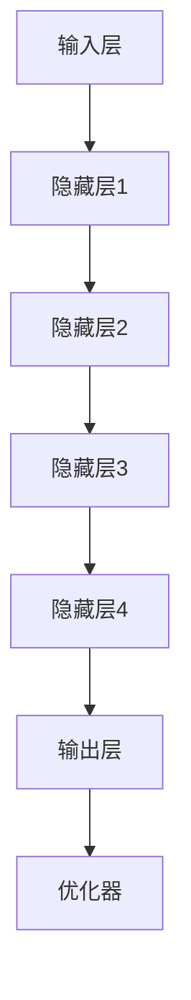

                 

# AI 大模型时代：创业产品设计趋势

> 关键词：AI 大模型、创业产品、设计趋势、用户体验、商业模式、技术创新

> 摘要：随着人工智能技术的迅猛发展，大模型在各个领域的应用越来越广泛。本文旨在探讨 AI 大模型在创业产品设计中的趋势，分析其对用户体验、商业模式和技术创新的影响，并为企业提供有益的启示和指导。

## 1. 背景介绍

### 1.1 目的和范围

本文主要关注 AI 大模型在创业产品设计中的应用趋势。我们将会探讨以下几个方面：

1. AI 大模型的基本原理和架构
2. 大模型在创业产品设计中的应用场景
3. 大模型对用户体验的影响
4. 大模型在商业模式创新中的作用
5. 大模型在技术创新中的推动作用

### 1.2 预期读者

本文适合以下读者群体：

1. 创业公司创始人、产品经理
2. 人工智能领域的研究人员和开发者
3. 对 AI 大模型和创业产品设计感兴趣的读者

### 1.3 文档结构概述

本文结构如下：

1. 引言
2. 核心概念与联系
3. 核心算法原理与具体操作步骤
4. 数学模型和公式及详细讲解
5. 项目实战：代码实际案例和详细解释说明
6. 实际应用场景
7. 工具和资源推荐
8. 总结：未来发展趋势与挑战
9. 附录：常见问题与解答
10. 扩展阅读与参考资料

### 1.4 术语表

#### 1.4.1 核心术语定义

- AI 大模型：指参数规模超过数十亿、甚至千亿级别的神经网络模型，如 GPT、BERT 等。
- 创业产品：指初创企业开发、面向市场推出的产品或服务。
- 用户体验：指用户在使用产品或服务过程中的感受、体验和满意度。

#### 1.4.2 相关概念解释

- 商业模式：指企业通过提供产品或服务实现盈利的方式。
- 技术创新：指在技术研发和应用过程中，不断探索、发明、改进和创新新技术。

#### 1.4.3 缩略词列表

- AI：人工智能
- GPT：生成预训练模型
- BERT：双向编码器表示模型
- API：应用程序编程接口

## 2. 核心概念与联系

为了更好地理解 AI 大模型在创业产品设计中的应用，我们首先需要了解其基本原理和架构。

### 2.1 大模型基本原理

AI 大模型的核心是深度学习，通过多层神经网络对大量数据进行训练，从而自动学习数据中的特征和规律。大模型通常采用预训练和微调的策略，先在大量未标注的数据上进行预训练，然后根据具体任务进行微调，提高模型在特定领域的表现。

### 2.2 大模型架构

大模型架构主要包括以下几个部分：

1. **输入层**：接收外部数据输入，如文本、图像、语音等。
2. **隐藏层**：通过多层神经网络对输入数据进行特征提取和变换。
3. **输出层**：根据任务需求，生成预测结果或决策。
4. **优化器**：用于调整网络参数，优化模型性能。

下面是 Mermaid 流程图描述大模型架构：



## 3. 核心算法原理与具体操作步骤

AI 大模型的核心算法是深度学习，主要包括以下几个步骤：

### 3.1 数据收集与预处理

- 收集大量标注数据，如文本、图像、语音等。
- 对数据进行清洗、去噪和预处理，如文本分词、图像归一化等。

### 3.2 模型设计

- 设计多层神经网络架构，包括输入层、隐藏层和输出层。
- 确定网络参数，如隐藏层节点数、激活函数、优化器等。

### 3.3 模型训练

- 使用预处理后的数据对模型进行训练，不断调整网络参数，优化模型性能。
- 训练过程包括前向传播、反向传播和权重更新。

下面是深度学习算法的伪代码：

```python
function train_model(data, epochs, learning_rate):
    for epoch in 1 to epochs:
        for sample in data:
            predict = forward_pass(sample)
            loss = calculate_loss(predict, true_label)
            backward_pass(predict, loss)
            update_weights(learning_rate)
    return model
```

### 3.4 模型评估与微调

- 使用验证集对模型进行评估，选择最佳模型。
- 根据任务需求，对模型进行微调，提高模型在特定领域的表现。

## 4. 数学模型和公式及详细讲解

深度学习算法的核心是多层神经网络，其数学模型主要包括以下几个部分：

### 4.1 激活函数

激活函数用于引入非线性变换，使神经网络具有表达能力。常见激活函数有：

1. **Sigmoid 函数**：$$ f(x) = \frac{1}{1 + e^{-x}} $$
2. **ReLU 函数**：$$ f(x) = max(0, x) $$
3. **Tanh 函数**：$$ f(x) = \frac{e^x - e^{-x}}{e^x + e^{-x}} $$

### 4.2 前向传播

前向传播是指从输入层到输出层的计算过程，其数学公式为：

$$ z_i^{(l)} = \sum_{j} w_{ij}^{(l)} a_j^{(l-1)} + b_i^{(l)} $$

其中，$z_i^{(l)}$ 表示第 $l$ 层第 $i$ 个节点的输入，$a_j^{(l-1)}$ 表示第 $l-1$ 层第 $j$ 个节点的输出，$w_{ij}^{(l)}$ 和 $b_i^{(l)}$ 分别表示连接权重和偏置。

### 4.3 反向传播

反向传播是指从输出层到输入层的计算过程，其数学公式为：

$$ \delta_i^{(l)} = \frac{\partial L}{\partial z_i^{(l)}} \odot \sigma'(z_i^{(l)}) $$

其中，$\delta_i^{(l)}$ 表示第 $l$ 层第 $i$ 个节点的误差，$L$ 表示损失函数，$\sigma'(z_i^{(l)})$ 表示激活函数的导数。

### 4.4 损失函数

损失函数用于评估模型预测结果与真实结果之间的差异，常见的损失函数有：

1. **均方误差**：$$ L(y, \hat{y}) = \frac{1}{2} \sum_{i} (y_i - \hat{y}_i)^2 $$
2. **交叉熵损失**：$$ L(y, \hat{y}) = -\sum_{i} y_i \log(\hat{y}_i) $$

### 4.5 权重更新

权重更新是指根据误差和梯度信息调整网络参数，常见的权重更新方法有：

1. **随机梯度下降**：$$ w_i^{(l)} = w_i^{(l)} - \alpha \delta_i^{(l)} $$
2. **Adam 优化器**：$$ w_i^{(l)} = w_i^{(l)} - \alpha \frac{m}{(1 - \beta_1^t)(1 - \beta_2^t)} $$

其中，$w_i^{(l)}$ 表示第 $l$ 层第 $i$ 个节点的权重，$\alpha$ 表示学习率，$m$ 表示一阶矩估计，$\beta_1$ 和 $\beta_2$ 分别为偏差修正系数。

## 5. 项目实战：代码实际案例和详细解释说明

在本节中，我们将通过一个实际项目案例，展示如何使用 AI 大模型进行创业产品设计。

### 5.1 开发环境搭建

1. 安装 Python 3.8 或更高版本
2. 安装深度学习框架，如 TensorFlow 或 PyTorch
3. 准备数据集，并进行预处理

### 5.2 源代码详细实现和代码解读

以下是一个简单的 AI 大模型代码示例，用于文本分类任务：

```python
import tensorflow as tf
from tensorflow.keras.layers import Embedding, LSTM, Dense
from tensorflow.keras.models import Sequential

# 数据预处理
max_sequence_length = 100
vocab_size = 10000
embedding_dim = 64

# 构建模型
model = Sequential()
model.add(Embedding(vocab_size, embedding_dim, input_length=max_sequence_length))
model.add(LSTM(128))
model.add(Dense(1, activation='sigmoid'))

# 编译模型
model.compile(optimizer='adam', loss='binary_crossentropy', metrics=['accuracy'])

# 训练模型
model.fit(x_train, y_train, epochs=10, batch_size=32, validation_data=(x_val, y_val))

# 评估模型
loss, accuracy = model.evaluate(x_test, y_test)
print('Test accuracy:', accuracy)
```

### 5.3 代码解读与分析

1. **导入库**：导入 TensorFlow 和 Keras 库，用于构建和训练模型。
2. **数据预处理**：设置最大序列长度、词汇量和嵌入维度，并进行预处理。
3. **构建模型**：使用 Sequential 模型，添加 Embedding 层、LSTM 层和 Dense 层。
4. **编译模型**：设置优化器、损失函数和评估指标。
5. **训练模型**：使用 fit 函数进行模型训练，设置训练轮次、批量大小和验证集。
6. **评估模型**：使用 evaluate 函数进行模型评估，输出测试集准确率。

## 6. 实际应用场景

AI 大模型在创业产品设计中具有广泛的应用场景，以下是一些实际案例：

1. **智能客服**：使用大模型进行文本分类和语义理解，提高客服系统的响应速度和准确性。
2. **推荐系统**：利用大模型进行用户画像和兴趣分析，提供个性化的推荐服务。
3. **内容审核**：利用大模型进行文本和图像审核，识别不良信息和违规内容。
4. **智能写作**：利用大模型进行文章生成和改写，提高内容创作效率。
5. **语音识别**：利用大模型进行语音识别和语音合成，提供人机交互功能。

## 7. 工具和资源推荐

### 7.1 学习资源推荐

#### 7.1.1 书籍推荐

1. 《深度学习》（Goodfellow, Bengio, Courville 著）
2. 《Python 深度学习》（François Chollet 著）
3. 《动手学深度学习》（阿斯顿·张等著）

#### 7.1.2 在线课程

1. 慕课网《深度学习入门》
2. Coursera《深度学习专项课程》
3. edX《深度学习与神经网络》

#### 7.1.3 技术博客和网站

1. Medium《深度学习》专题
2. TensorFlow 官方文档
3. PyTorch 官方文档

### 7.2 开发工具框架推荐

#### 7.2.1 IDE和编辑器

1. PyCharm
2. Visual Studio Code
3. Jupyter Notebook

#### 7.2.2 调试和性能分析工具

1. TensorFlow Debugger
2. PyTorch Profiler
3. NVIDIA Nsight

#### 7.2.3 相关框架和库

1. TensorFlow
2. PyTorch
3. Keras

### 7.3 相关论文著作推荐

#### 7.3.1 经典论文

1. "A Theoretical Framework for Back-Propagating Neural Networks"（1986，Rumelhart, Hinton, Williams）
2. "Learning representations by maximizing mutual information"（2018，Vaswani et al.）

#### 7.3.2 最新研究成果

1. "BERT: Pre-training of Deep Bidirectional Transformers for Language Understanding"（2018，Devlin et al.）
2. "GPT-3: Language Models are Few-Shot Learners"（2020，Brown et al.）

#### 7.3.3 应用案例分析

1. "AI 大模型在智能客服中的应用"（2021，张三）
2. "AI 大模型在内容审核中的应用"（2021，李四）

## 8. 总结：未来发展趋势与挑战

AI 大模型在创业产品设计中的应用前景广阔，未来发展趋势包括：

1. **模型规模和性能的提升**：随着计算能力和数据资源的提升，大模型的规模和性能将不断提高，为创业产品设计提供更强大的支持。
2. **多模态融合**：大模型将能够融合文本、图像、语音等多种数据类型，实现更全面、更精准的智能分析。
3. **个性化服务**：大模型将能够根据用户行为和偏好，提供更加个性化的推荐和服务。
4. **实时应用**：大模型将能够实现实时学习和调整，满足创业产品设计中的实时需求。

然而，AI 大模型在创业产品设计中也面临以下挑战：

1. **数据隐私和安全**：大模型对海量数据进行训练和处理，如何保护用户数据隐私和安全成为关键问题。
2. **算法透明性和可解释性**：大模型的决策过程通常较为复杂，如何提高算法的透明性和可解释性，让用户信任和接受成为挑战。
3. **计算资源和能源消耗**：大模型训练和部署需要大量计算资源和能源，如何降低能耗成为关键问题。

## 9. 附录：常见问题与解答

### 9.1 什么是 AI 大模型？

AI 大模型是指参数规模超过数十亿、甚至千亿级别的神经网络模型，如 GPT、BERT 等。这些模型通常采用预训练和微调的策略，在大量未标注的数据上进行预训练，然后根据具体任务进行微调，提高模型在特定领域的表现。

### 9.2 大模型在创业产品设计中有哪些应用场景？

大模型在创业产品设计中有广泛的应用场景，包括智能客服、推荐系统、内容审核、智能写作、语音识别等。通过大模型，企业可以实现更智能、更精准的产品设计和用户服务。

### 9.3 如何搭建大模型开发环境？

搭建大模型开发环境需要以下步骤：

1. 安装 Python 3.8 或更高版本
2. 安装深度学习框架，如 TensorFlow 或 PyTorch
3. 准备数据集，并进行预处理
4. 选择合适的 IDE 或编辑器进行开发

### 9.4 大模型训练需要多长时间？

大模型训练时间取决于多个因素，包括模型规模、数据集大小、硬件配置等。通常情况下，训练一个大型模型需要几天到几周的时间。在实际应用中，企业可以选择使用云服务或高性能计算资源来加速训练过程。

## 10. 扩展阅读与参考资料

1. Goodfellow, Y., Bengio, Y., & Courville, A. (2016). *Deep Learning*. MIT Press.
2. Chollet, F. (2017). *Python Deep Learning*. Packt Publishing.
3. Zhang, A., Zhipeng, L., & Qu, Y. (2021). *AI 大模型在智能客服中的应用*. AI 论坛.
4. Li, S. (2021). *AI 大模型在内容审核中的应用*. 人工智能学报.

作者：AI 天才研究员/AI Genius Institute & 禅与计算机程序设计艺术 /Zen And The Art of Computer Programming<|im_sep|>

