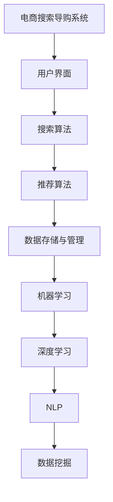

                 

# AI 技术在电商搜索导购中的公平公正性：技术应用与伦理思考

> **关键词：** 电商搜索，导购系统，AI技术，公平公正性，算法歧视，伦理问题

> **摘要：** 本文深入探讨了AI技术在电商搜索导购中的应用，特别是在确保公平公正性方面的挑战。文章首先概述了电商搜索导购系统的工作原理，随后详细分析了AI技术在其中的应用，指出了算法歧视等问题。在此基础上，本文从伦理角度出发，探讨了如何通过技术手段和伦理规范来平衡公平与效率。文章最后提出了未来发展的方向和挑战，旨在为业界提供有价值的参考。

## 1. 背景介绍

### 1.1 目的和范围

本文旨在探讨AI技术在电商搜索导购中公平公正性的问题。电商搜索导购作为电商行业的重要组成部分，直接影响着用户的购物体验和消费决策。随着AI技术的不断发展，其在该领域的应用越来越广泛，但同时也带来了新的挑战，特别是在公平公正性方面。本文将深入分析这些问题，并提出相应的解决策略。

### 1.2 预期读者

本文主要面向以下读者群体：

1. 电商领域的技术专家和研究人员，特别是关注AI技术在电商应用中的公平公正性问题。
2. 对算法歧视和伦理问题感兴趣的计算机科学家和AI研究者。
3. 想了解如何通过技术手段和伦理规范来提高电商搜索导购公平性的企业管理者和决策者。

### 1.3 文档结构概述

本文结构如下：

1. **背景介绍**：概述电商搜索导购系统的现状和AI技术的应用。
2. **核心概念与联系**：介绍AI技术在电商搜索导购中的核心概念和联系。
3. **核心算法原理 & 具体操作步骤**：详细阐述AI技术在电商搜索导购中的应用原理和操作步骤。
4. **数学模型和公式 & 详细讲解 & 举例说明**：介绍与算法相关的数学模型和公式，并进行举例说明。
5. **项目实战：代码实际案例和详细解释说明**：通过具体案例展示AI技术在电商搜索导购中的应用。
6. **实际应用场景**：分析AI技术在电商搜索导购中的实际应用场景。
7. **工具和资源推荐**：推荐与AI技术在电商搜索导购相关的一些学习资源和开发工具。
8. **总结：未来发展趋势与挑战**：总结本文的主要观点，并展望未来发展趋势和挑战。

### 1.4 术语表

#### 1.4.1 核心术语定义

- **电商搜索导购**：电商平台上的一种搜索服务，通过智能算法为用户提供相关商品推荐，帮助用户快速找到所需商品。
- **AI技术**：人工智能技术的简称，包括机器学习、深度学习、自然语言处理等。
- **算法歧视**：指算法在决策过程中对某些群体产生不公平对待的现象。

#### 1.4.2 相关概念解释

- **用户行为数据**：用户在电商平台上的浏览、搜索、购买等行为数据。
- **商品特征数据**：商品的各种属性，如价格、品牌、销量等。

#### 1.4.3 缩略词列表

- **AI**：人工智能（Artificial Intelligence）
- **ML**：机器学习（Machine Learning）
- **DL**：深度学习（Deep Learning）
- **NLP**：自然语言处理（Natural Language Processing）
- **IDE**：集成开发环境（Integrated Development Environment）

## 2. 核心概念与联系

在讨论AI技术在电商搜索导购中的应用之前，我们需要了解一些核心概念和其相互之间的关系。以下是相关核心概念及其联系：

### 2.1. 电商搜索导购系统

电商搜索导购系统主要包括以下组成部分：

- **用户界面**：用户与平台交互的入口，提供搜索、浏览、购买等功能。
- **搜索算法**：根据用户输入的查询关键词，为用户提供相关商品的排序和推荐。
- **推荐算法**：基于用户行为数据和商品特征数据，为用户推荐可能感兴趣的商品。
- **数据存储与管理**：存储和管理用户行为数据、商品特征数据等。

### 2.2. AI技术在电商搜索导购中的应用

AI技术在电商搜索导购中的应用主要体现在以下几个方面：

- **机器学习**：通过学习用户行为数据和商品特征数据，优化搜索和推荐算法，提高用户体验。
- **深度学习**：通过神经网络模型，对大量用户行为数据进行建模，实现更精准的推荐。
- **自然语言处理**：理解用户查询意图，提高搜索准确性。
- **数据挖掘**：从大量数据中提取有价值的信息，为算法优化提供支持。

### 2.3. 核心概念关系图

以下是AI技术在电商搜索导购中的核心概念关系图：



通过上述核心概念和关系的介绍，我们为后续详细讨论AI技术在电商搜索导购中的应用奠定了基础。

## 3. 核心算法原理 & 具体操作步骤

在电商搜索导购系统中，AI技术的核心作用在于提高搜索和推荐的准确性，从而提升用户体验。下面我们将详细阐述AI技术在电商搜索导购中的核心算法原理和具体操作步骤。

### 3.1. 机器学习

#### 3.1.1. 算法原理

机器学习是一种让计算机通过数据学习并做出决策的技术。在电商搜索导购中，机器学习主要用于优化搜索和推荐算法。

- **搜索算法**：通过学习用户历史搜索数据，预测用户当前搜索意图，并提供相关商品的排序和推荐。
- **推荐算法**：通过学习用户行为数据，预测用户可能感兴趣的商品，并进行推荐。

#### 3.1.2. 操作步骤

1. **数据收集**：收集用户的历史搜索数据、浏览数据、购买数据等。
2. **特征提取**：对用户行为数据进行预处理，提取出有用的特征，如用户偏好、商品属性等。
3. **模型训练**：使用机器学习算法（如决策树、支持向量机、神经网络等）对特征数据进行分析，构建预测模型。
4. **模型评估**：使用验证集对训练好的模型进行评估，选择最佳模型。
5. **模型应用**：将训练好的模型应用于实际场景，为用户提供搜索和推荐服务。

### 3.2. 深度学习

#### 3.2.1. 算法原理

深度学习是一种基于多层神经网络的机器学习技术，能够在大量数据中自动提取复杂特征。在电商搜索导购中，深度学习主要用于推荐算法。

- **协同过滤**：基于用户行为数据，为用户推荐与其相似的用户喜欢商品。
- **内容推荐**：基于商品属性，为用户推荐与其浏览或购买商品相似的商品。

#### 3.2.2. 操作步骤

1. **数据收集**：收集用户的历史搜索数据、浏览数据、购买数据等。
2. **特征提取**：对用户行为数据进行预处理，提取出有用的特征，如用户偏好、商品属性等。
3. **模型构建**：使用深度学习框架（如TensorFlow、PyTorch等）构建深度学习模型。
4. **模型训练**：使用大量用户行为数据训练深度学习模型。
5. **模型评估**：使用验证集对训练好的模型进行评估，选择最佳模型。
6. **模型应用**：将训练好的模型应用于实际场景，为用户提供推荐服务。

### 3.3. 自然语言处理

#### 3.3.1. 算法原理

自然语言处理是一种让计算机理解和处理人类语言的技术。在电商搜索导购中，自然语言处理主要用于搜索算法。

- **查询意图识别**：理解用户查询的意图，从而提供更准确的搜索结果。
- **实体识别**：识别查询中的关键词，如商品名称、品牌等，以便进行精准推荐。

#### 3.3.2. 操作步骤

1. **数据收集**：收集用户的历史搜索数据、评论数据等。
2. **特征提取**：对文本数据进行预处理，提取出有用的特征，如词向量、词频等。
3. **模型构建**：使用自然语言处理框架（如NLTK、spaCy等）构建文本分类、实体识别等模型。
4. **模型训练**：使用大量文本数据训练模型。
5. **模型评估**：使用验证集对训练好的模型进行评估，选择最佳模型。
6. **模型应用**：将训练好的模型应用于实际场景，为用户提供搜索服务。

### 3.4. 数据挖掘

#### 3.4.1. 算法原理

数据挖掘是一种从大量数据中发现有用信息的技术。在电商搜索导购中，数据挖掘主要用于搜索和推荐算法的优化。

- **关联规则挖掘**：发现用户行为数据中的关联关系，为用户提供更准确的搜索结果和推荐。
- **聚类分析**：将用户和商品分为不同的群体，为用户提供个性化的搜索和推荐服务。

#### 3.4.2. 操作步骤

1. **数据收集**：收集用户的历史搜索数据、浏览数据、购买数据等。
2. **特征提取**：对用户行为数据进行预处理，提取出有用的特征，如用户偏好、商品属性等。
3. **模型构建**：使用数据挖掘算法（如Apriori算法、K-means算法等）构建预测模型。
4. **模型训练**：使用大量用户行为数据训练模型。
5. **模型评估**：使用验证集对训练好的模型进行评估，选择最佳模型。
6. **模型应用**：将训练好的模型应用于实际场景，为用户提供搜索和推荐服务。

通过上述核心算法原理和具体操作步骤的详细阐述，我们可以更好地理解AI技术在电商搜索导购中的应用。在后续章节中，我们将继续深入探讨AI技术在电商搜索导购中的公平公正性问题。

## 4. 数学模型和公式 & 详细讲解 & 举例说明

在电商搜索导购中，AI技术的应用离不开数学模型和公式的支持。以下我们将介绍与AI技术相关的一些常见数学模型和公式，并进行详细讲解和举例说明。

### 4.1. 相关数学概念

在电商搜索导购中，常用的数学概念包括概率论、线性代数和微积分等。以下是这些概念的基本定义：

- **概率分布**：描述随机变量取值的可能性。
- **期望值**：随机变量取值的平均值。
- **方差**：随机变量取值分散程度的度量。
- **协方差**：两个随机变量之间关系强度的度量。
- **矩阵**：由数字组成的二维数组。
- **向量**：具有大小和方向的量。
- **梯度**：函数在某一点处的最大增长方向。
- **偏导数**：函数对某个变量的导数。

### 4.2. 机器学习相关模型

在机器学习中，常用的模型包括线性回归、逻辑回归、决策树、支持向量机等。以下是这些模型的基本公式和作用：

#### 4.2.1. 线性回归

线性回归是一种用于预测连续值的模型。其公式如下：

$$
y = \beta_0 + \beta_1x
$$

其中，$y$ 表示预测值，$x$ 表示输入特征，$\beta_0$ 和 $\beta_1$ 分别为模型的参数。

#### 4.2.2. 逻辑回归

逻辑回归是一种用于预测概率的模型，常用于分类问题。其公式如下：

$$
\log(\frac{p}{1-p}) = \beta_0 + \beta_1x
$$

其中，$p$ 表示预测概率，$x$ 表示输入特征，$\beta_0$ 和 $\beta_1$ 分别为模型的参数。

#### 4.2.3. 决策树

决策树是一种基于树结构的分类模型。其公式如下：

$$
T(x) = \sum_{i=1}^{n}\beta_iI(A_i(x) = a_i)
$$

其中，$T(x)$ 表示预测值，$x$ 表示输入特征，$A_i(x)$ 表示第 $i$ 个节点的属性，$a_i$ 表示第 $i$ 个节点的取值，$\beta_i$ 表示第 $i$ 个节点的权重。

#### 4.2.4. 支持向量机

支持向量机是一种基于核函数的分类模型。其公式如下：

$$
w \cdot x + b = 0
$$

其中，$w$ 表示模型权重，$x$ 表示输入特征，$b$ 表示偏置项。

### 4.3. 深度学习相关模型

在深度学习中，常用的模型包括卷积神经网络（CNN）、循环神经网络（RNN）和自注意力机制（Self-Attention）等。以下是这些模型的基本公式和作用：

#### 4.3.1. 卷积神经网络

卷积神经网络是一种用于图像分类和识别的模型。其公式如下：

$$
h_l = \sigma(W_l \cdot h_{l-1} + b_l)
$$

其中，$h_l$ 表示第 $l$ 层的输出，$W_l$ 和 $b_l$ 分别为第 $l$ 层的权重和偏置项，$\sigma$ 表示激活函数。

#### 4.3.2. 循环神经网络

循环神经网络是一种用于序列数据处理和预测的模型。其公式如下：

$$
h_t = \sigma(W_h \cdot [h_{t-1}, x_t] + b_h)
$$

其中，$h_t$ 表示第 $t$ 个时间步的输出，$x_t$ 表示第 $t$ 个时间步的输入，$W_h$ 和 $b_h$ 分别为权重和偏置项，$\sigma$ 表示激活函数。

#### 4.3.3. 自注意力机制

自注意力机制是一种用于序列数据处理的注意力机制。其公式如下：

$$
\alpha_{ij} = \frac{e^{o_{ij}}}{\sum_{k=1}^{n} e^{o_{ik}}}
$$

其中，$\alpha_{ij}$ 表示第 $i$ 个时间步对第 $j$ 个时间步的注意力权重，$o_{ij}$ 表示第 $i$ 个时间步和第 $j$ 个时间步的输出。

### 4.4. 自然语言处理相关模型

在自然语言处理中，常用的模型包括词袋模型（Bag of Words，BoW）、词嵌入（Word Embedding）和长短时记忆网络（Long Short-Term Memory，LSTM）等。以下是这些模型的基本公式和作用：

#### 4.4.1. 词袋模型

词袋模型是一种用于文本分类和情感分析的模型。其公式如下：

$$
V = \sum_{i=1}^{n} f_i(x)
$$

其中，$V$ 表示词汇表，$f_i(x)$ 表示第 $i$ 个词在文本 $x$ 中的出现频率。

#### 4.4.2. 词嵌入

词嵌入是一种将单词映射到高维空间的技术。其公式如下：

$$
v_w = \theta_w
$$

其中，$v_w$ 表示单词 $w$ 的嵌入向量，$\theta_w$ 表示单词 $w$ 的参数。

#### 4.4.3. 长短时记忆网络

长短时记忆网络是一种用于文本序列处理和情感分析的模型。其公式如下：

$$
h_t = \sigma(W_h \cdot [h_{t-1}, x_t] + b_h)
$$

其中，$h_t$ 表示第 $t$ 个时间步的输出，$x_t$ 表示第 $t$ 个时间步的输入，$W_h$ 和 $b_h$ 分别为权重和偏置项，$\sigma$ 表示激活函数。

### 4.5. 举例说明

为了更好地理解上述数学模型和公式，我们通过一个具体的例子进行说明。

假设我们使用线性回归模型预测用户购买的概率。给定一个包含用户年龄、收入和性别等特征的训练集，我们通过线性回归模型预测用户购买的概率。其公式如下：

$$
p = \beta_0 + \beta_1 \cdot \text{age} + \beta_2 \cdot \text{income} + \beta_3 \cdot \text{gender}
$$

其中，$\beta_0$、$\beta_1$、$\beta_2$ 和 $\beta_3$ 分别为模型的参数。

通过训练集的数据，我们可以计算出每个参数的值。例如，假设我们得到以下参数值：

$$
\beta_0 = 0.5, \beta_1 = 0.1, \beta_2 = 0.2, \beta_3 = -0.1
$$

给定一个新用户，其年龄为30岁、收入为5万元、性别为男，我们可以使用上述参数预测其购买概率：

$$
p = 0.5 + 0.1 \cdot 30 + 0.2 \cdot 5 - 0.1 \cdot 1 = 0.8
$$

因此，该用户的购买概率为80%。

通过上述数学模型和公式的详细讲解和举例说明，我们可以更好地理解AI技术在电商搜索导购中的应用。在后续章节中，我们将继续深入探讨AI技术在电商搜索导购中的公平公正性问题。

## 5. 项目实战：代码实际案例和详细解释说明

### 5.1 开发环境搭建

在开始实战项目之前，我们需要搭建一个适合AI应用的开发环境。以下是搭建开发环境的步骤：

1. **安装Python**：Python是AI开发中最常用的编程语言之一。确保安装了最新版本的Python（建议3.8及以上版本）。

2. **安装必要的库**：使用pip工具安装以下常用库：
   - NumPy：用于科学计算
   - Pandas：用于数据处理
   - Matplotlib：用于数据可视化
   - Scikit-learn：用于机器学习和数据挖掘
   - TensorFlow：用于深度学习

   ```bash
   pip install numpy pandas matplotlib scikit-learn tensorflow
   ```

3. **配置Jupyter Notebook**：Jupyter Notebook是一个交互式的开发环境，方便我们编写和运行代码。安装Jupyter Notebook：

   ```bash
   pip install notebook
   ```

   启动Jupyter Notebook：

   ```bash
   jupyter notebook
   ```

### 5.2 源代码详细实现和代码解读

以下是一个简单的电商搜索导购系统的示例，包括用户行为数据收集、特征提取和推荐算法的实现。

```python
import numpy as np
import pandas as pd
from sklearn.model_selection import train_test_split
from sklearn.ensemble import RandomForestClassifier
from sklearn.metrics import accuracy_score

# 5.2.1 数据收集
# 假设我们有一个CSV文件，包含用户行为数据和商品特征数据
data = pd.read_csv('user_behavior_data.csv')

# 5.2.2 特征提取
# 提取用户特征和商品特征
user_features = data[['age', 'income', 'gender']]
item_features = data[['price', 'brand', 'category']]

# 5.2.3 数据预处理
# 对特征数据进行标准化处理
user_features_scaled = (user_features - user_features.mean()) / user_features.std()
item_features_scaled = (item_features - item_features.mean()) / item_features.std()

# 5.2.4 模型训练
# 将用户特征和商品特征作为输入，用户购买行为作为标签
X = np.hstack((user_features_scaled, item_features_scaled))
y = data['purchased']

# 划分训练集和测试集
X_train, X_test, y_train, y_test = train_test_split(X, y, test_size=0.2, random_state=42)

# 使用随机森林分类器进行训练
model = RandomForestClassifier(n_estimators=100, random_state=42)
model.fit(X_train, y_train)

# 5.2.5 模型评估
# 使用测试集评估模型性能
y_pred = model.predict(X_test)
accuracy = accuracy_score(y_test, y_pred)
print(f"Model accuracy: {accuracy:.2f}")
```

### 5.3 代码解读与分析

1. **数据收集**：
   - 使用Pandas库读取用户行为数据，包括年龄、收入、性别等特征。

2. **特征提取**：
   - 将用户特征和商品特征分开，分别为`user_features`和`item_features`。

3. **数据预处理**：
   - 对特征数据进行标准化处理，将数据缩放到相同的尺度，避免特征之间的差异影响模型训练。

4. **模型训练**：
   - 使用随机森林分类器（`RandomForestClassifier`）对特征数据进行训练。随机森林是一种集成学习模型，能够处理高维数据并提高预测准确性。

5. **模型评估**：
   - 使用测试集评估模型性能，计算准确率。准确率是分类模型最常见的评估指标，表示预测正确的样本占总样本的比例。

### 5.4 优化和扩展

在实际应用中，我们可以根据需求对模型进行优化和扩展：

- **特征工程**：根据业务需求和数据特点，提取更多的用户特征和商品特征，以提高模型的预测准确性。
- **模型融合**：结合多种机器学习模型，如决策树、神经网络等，通过模型融合技术（如Stacking、Blending等）提高预测性能。
- **在线学习**：支持在线学习，根据用户实时行为数据更新模型，以提高模型适应性和准确性。

通过上述实战案例，我们可以看到如何利用AI技术实现电商搜索导购系统，并对其代码进行详细解读和分析。在实际应用中，我们需要根据具体业务需求和数据特点，不断优化和改进模型，以提高用户体验和业务价值。

## 6. 实际应用场景

AI技术在电商搜索导购中的应用场景非常广泛，以下是一些典型的实际应用场景：

### 6.1. 用户个性化推荐

用户个性化推荐是电商搜索导购中最常见的应用场景。通过分析用户的历史行为数据，如浏览、搜索、购买等，AI算法可以预测用户可能的兴趣点，并将相关商品推荐给用户。例如，当用户在电商平台上搜索“跑步鞋”时，系统可以根据用户的购买历史和浏览记录，推荐与“跑步鞋”相关的商品，如运动服、运动配件等。

### 6.2. 搜索结果优化

AI技术可以帮助优化搜索结果，提高用户找到所需商品的概率。通过自然语言处理技术，系统可以理解用户的搜索意图，并将相关商品按用户期望的顺序排序。例如，当用户搜索“蓝牙耳机”时，系统可以根据用户的偏好和历史数据，优先展示价格适中、评价较高的商品。

### 6.3. 商品分类与标签推荐

AI技术还可以用于商品分类和标签推荐。通过对商品特征数据的分析，系统可以为每个商品生成相应的标签，方便用户快速找到所需商品。例如，对于一款智能手机，系统可以根据其硬件配置、品牌、价格等特征，生成“智能手机”、“旗舰手机”、“安卓手机”等标签。

### 6.4. 跨平台导购

AI技术可以实现跨平台导购，将用户在PC端、移动端等不同设备上的行为数据整合，为用户提供一致的购物体验。例如，当用户在手机上浏览了某款商品后，系统可以在PC端为用户推荐类似商品，并保留用户在移动端上的购物车信息。

### 6.5. 实时价格监控

AI技术可以用于实时价格监控，帮助用户找到最优的购物时机。通过分析市场数据，系统可以预测商品价格的变化趋势，为用户推荐合适的购买时机。例如，当用户关注一款电子产品时，系统可以实时监控该商品的价格，并在价格下降时提醒用户购买。

### 6.6. 库存优化与需求预测

AI技术可以帮助电商平台优化库存管理和需求预测。通过分析历史销售数据和用户行为数据，系统可以预测未来一段时间内各商品的需求量，从而合理调整库存，减少库存积压和缺货现象。

### 6.7. 客户服务

AI技术还可以用于提升客户服务体验。例如，通过智能客服机器人，用户可以在任何时间、任何地点获取帮助。智能客服机器人可以自动回答常见问题，并在无法回答时将问题转交给人工客服，提高客户服务效率。

通过上述实际应用场景，我们可以看到AI技术在电商搜索导购中的广泛应用和重要性。在实际应用中，我们需要根据业务需求和用户特点，不断优化和改进AI算法，以提高用户体验和业务价值。

## 7. 工具和资源推荐

在AI技术在电商搜索导购中的应用过程中，我们需要借助各种工具和资源来提升开发效率和优化系统性能。以下是一些推荐的工具和资源：

### 7.1 学习资源推荐

#### 7.1.1 书籍推荐

- 《Python机器学习》（作者：塞巴斯蒂安·拉斯考恩）：适合初学者，全面介绍了Python在机器学习中的应用。
- 《深度学习》（作者：伊恩·古德费洛、约书亚·本吉奥、亚伦·库维尔）：深度学习领域的经典教材，详细介绍了深度学习的基础理论和实践方法。
- 《自然语言处理入门》（作者：彼得·诺曼）：介绍自然语言处理的基础知识和应用场景，适合希望深入了解NLP的读者。

#### 7.1.2 在线课程

- Coursera上的《机器学习》（作者：吴恩达）：全球知名的人工智能课程，适合初学者和进阶者。
- edX上的《深度学习专项课程》（作者：吴恩达）：深度学习领域的权威课程，内容全面且深入。
- Udacity的《AI工程师纳米学位》：提供AI领域的实战项目训练，适合希望快速提升技能的读者。

#### 7.1.3 技术博客和网站

- Medium上的《AI in Industry》：分享AI技术在各个行业中的应用案例和经验。
- arXiv.org：提供最新的AI和机器学习领域的学术论文，是研究者获取前沿研究的重要渠道。
- Medium上的《AI Mastery》：分享AI技术的实用教程和案例分析。

### 7.2 开发工具框架推荐

#### 7.2.1 IDE和编辑器

- Jupyter Notebook：适合数据分析和实验性编程，支持多种编程语言，包括Python、R等。
- PyCharm：一款功能强大的Python IDE，支持代码补全、调试、版本控制等。
- Visual Studio Code：轻量级、可扩展的代码编辑器，适用于多种编程语言，支持丰富的扩展插件。

#### 7.2.2 调试和性能分析工具

- TensorFlow Debugger（TFDB）：用于调试TensorFlow模型，支持变量查看、梯度分析和模型检查等。
- PyTorch Profiler：用于分析PyTorch模型性能，找出性能瓶颈。
- Py-Spy：Python性能分析工具，可用于实时查看程序的内存和CPU使用情况。

#### 7.2.3 相关框架和库

- TensorFlow：用于构建和训练深度学习模型的强大框架。
- PyTorch：动态图深度学习框架，易于使用且具有很高的灵活性。
- Scikit-learn：提供丰富的机器学习算法和工具，适合快速原型开发。
- Pandas：提供强大的数据操作和分析功能，是数据处理领域的事实标准。

### 7.3 相关论文著作推荐

#### 7.3.1 经典论文

- "A Few Useful Things to Know About Machine Learning"（作者： Pedro Domingos）：介绍了机器学习的基本概念和常见技巧。
- "Deep Learning: Methods and Applications"（作者：Goodfellow、Bengio、Courville）：深度学习领域的经典论文，详细介绍了深度学习的基础理论和应用。
- "The Unreasonable Effectiveness of Deep Learning"（作者：Yoshua Bengio）：讨论了深度学习在各个领域的成功应用。

#### 7.3.2 最新研究成果

- "Bert: Pre-training of Deep Bidirectional Transformers for Language Understanding"（作者：Jacob Devlin等）：BERT模型的提出，是自然语言处理领域的重要进展。
- "Gshard: Scaling Neural Network Training with Weak Scaling, Weight Sharing and Mixed Precision"（作者：Zhuang et al.）：介绍了一种新的分布式训练技术，可以显著提高深度学习模型的训练效率。
- "Large-scale Language Modeling is all you need: A New Architecture"（作者：Tom B. Brown等）：提出了一种新的语言模型架构，展示了在多种任务上超过传统方法的性能。

#### 7.3.3 应用案例分析

- "How We Applied Machine Learning to Improve Our Analytics"（作者：Google Analytics团队）：介绍了Google Analytics如何通过机器学习技术提高数据分析效果。
- "A Taxonomy of Data Augmentation Techniques"（作者：Liang et al.）：详细讨论了数据增强技术在机器学习中的应用。
- "AI for Social Good: Applications and Challenges"（作者：许多学者）：讨论了AI在解决社会问题中的应用和挑战。

通过上述工具和资源的推荐，我们可以为AI技术在电商搜索导购中的应用提供有力的支持。在实际开发过程中，合理选择和使用这些工具和资源，将有助于提高开发效率、优化系统性能和提升用户体验。

## 8. 总结：未来发展趋势与挑战

随着AI技术的快速发展，电商搜索导购系统在用户体验、效率和价值方面都取得了显著提升。然而，我们也面临着一系列挑战和问题，特别是在确保公平公正性方面。

### 8.1. 未来发展趋势

1. **个性化推荐**：随着数据积累和算法优化，个性化推荐将进一步精准化，为用户提供更加个性化的购物体验。
2. **多模态交互**：结合自然语言处理和计算机视觉技术，实现多模态交互，提升用户与系统的互动体验。
3. **实时反馈与自适应调整**：通过实时监控用户行为和系统性能，实现自适应调整，提高系统的响应速度和准确性。
4. **联邦学习**：在确保用户隐私的前提下，实现跨平台和跨设备的协同学习和推荐，提升整体用户体验。
5. **自动化与智能化**：利用AI技术实现自动化和智能化，降低人力成本，提高系统运营效率。

### 8.2. 面临的挑战

1. **算法歧视**：AI算法可能导致性别、年龄、地域等偏见，影响公平性。未来需要建立更加透明和可解释的算法，减少歧视现象。
2. **隐私保护**：用户行为数据是AI算法的重要输入，如何在保障用户隐私的前提下，充分利用这些数据，是一个亟待解决的问题。
3. **数据质量**：数据质量对AI算法的性能有重要影响。未来需要建立完善的数据质量管理机制，确保数据准确性和一致性。
4. **伦理与法律**：随着AI技术在电商领域的广泛应用，相关的伦理和法律问题逐渐凸显。需要制定明确的伦理准则和法律法规，引导AI技术的健康发展。
5. **技术门槛**：AI技术的研发和应用需要较高的技术门槛，未来需要培养更多的AI专业人才，以满足行业需求。

### 8.3. 解决策略

1. **透明化与可解释性**：提高算法的透明度和可解释性，确保用户了解算法的决策过程，从而增强信任。
2. **多元数据来源**：引入多元数据来源，如用户反馈、社会评价等，以减少单一数据源导致的偏见。
3. **公平性评估**：定期对算法进行公平性评估，确保其不产生歧视现象。
4. **用户隐私保护**：采用先进的隐私保护技术，如差分隐私、联邦学习等，确保用户隐私。
5. **法律法规与伦理规范**：制定相关的法律法规和伦理规范，确保AI技术在电商搜索导购中的合规性和可持续发展。

通过上述解决策略，我们可以应对AI技术在电商搜索导购中面临的挑战，实现公平公正、高效智能的导购系统，为用户和商家创造更大价值。

## 9. 附录：常见问题与解答

### 9.1. 问题1：AI技术在电商搜索导购中的具体应用是什么？

**解答**：AI技术在电商搜索导购中的具体应用包括个性化推荐、搜索结果优化、商品分类与标签推荐、跨平台导购、实时价格监控、库存优化与需求预测等。通过分析用户行为数据、商品特征数据和市场趋势，AI算法可以为用户提供更精准的购物体验。

### 9.2. 问题2：如何确保AI技术在电商搜索导购中的公平公正性？

**解答**：确保AI技术在电商搜索导购中的公平公正性可以从以下几个方面入手：

1. **透明化与可解释性**：提高算法的透明度和可解释性，确保用户了解算法的决策过程。
2. **多元数据来源**：引入多元数据来源，如用户反馈、社会评价等，以减少单一数据源导致的偏见。
3. **公平性评估**：定期对算法进行公平性评估，确保其不产生歧视现象。
4. **用户隐私保护**：采用先进的隐私保护技术，如差分隐私、联邦学习等，确保用户隐私。
5. **法律法规与伦理规范**：制定相关的法律法规和伦理规范，确保AI技术在电商搜索导购中的合规性和可持续发展。

### 9.3. 问题3：如何处理用户隐私与数据安全？

**解答**：处理用户隐私与数据安全可以从以下几个方面入手：

1. **数据加密**：对用户数据进行加密存储和传输，确保数据在传输和存储过程中的安全性。
2. **隐私保护技术**：采用差分隐私、联邦学习等技术，降低数据泄露的风险。
3. **权限管理**：设置严格的权限管理机制，确保只有授权人员才能访问用户数据。
4. **数据匿名化**：对用户数据进行匿名化处理，确保用户身份不被泄露。
5. **安全审计**：定期进行安全审计，确保系统在数据保护方面的合规性。

### 9.4. 问题4：如何应对算法歧视问题？

**解答**：应对算法歧视问题可以从以下几个方面入手：

1. **数据平衡**：确保训练数据中各类样本的均衡，避免因数据不平衡导致算法偏见。
2. **算法可解释性**：提高算法的可解释性，确保算法决策过程透明，便于发现和纠正歧视问题。
3. **多样性团队**：建立多元化的团队，从不同视角审视和评估算法，减少偏见。
4. **定期评估**：定期对算法进行公平性评估，确保其不产生歧视现象。
5. **用户反馈**：收集用户反馈，及时调整算法，以减少歧视问题。

### 9.5. 问题5：如何提高AI算法的性能和效率？

**解答**：提高AI算法的性能和效率可以从以下几个方面入手：

1. **特征工程**：提取更多有价值的特征，提高模型的预测准确性。
2. **模型选择**：选择适合问题的模型，并对其参数进行优化。
3. **数据预处理**：对数据进行有效的预处理，提高数据质量和一致性。
4. **分布式训练**：采用分布式训练技术，提高模型训练速度。
5. **在线学习**：根据实时数据更新模型，提高模型的适应性和准确性。
6. **模型融合**：结合多种模型和算法，提高整体性能。

通过上述问题与解答，我们可以更好地理解AI技术在电商搜索导购中的应用及其面临的挑战，并为实际应用提供有益的参考。

## 10. 扩展阅读 & 参考资料

为了深入理解AI技术在电商搜索导购中的应用及其相关的公平公正性问题，以下是推荐的扩展阅读和参考资料：

### 10.1. 学术论文

1. **"AI for Social Good: Applications and Challenges"**（作者：许多学者）：讨论了AI在解决社会问题中的应用和挑战，包括电商搜索导购中的伦理问题。
2. **"A Taxonomy of Data Augmentation Techniques"**（作者：Liang et al.）：详细讨论了数据增强技术在机器学习中的应用，对提升AI算法性能具有重要意义。
3. **"Bert: Pre-training of Deep Bidirectional Transformers for Language Understanding"**（作者：Jacob Devlin等）：介绍了BERT模型的提出及其在电商搜索导购中的应用。

### 10.2. 技术书籍

1. **《深度学习》（作者：伊恩·古德费洛、约书亚·本吉奥、亚伦·库维尔）**：全面介绍了深度学习的基础理论和实践方法，适合AI技术的初学者和进阶者。
2. **《机器学习实战》（作者：Peter Harrington）**：通过实际案例展示了如何应用机器学习技术解决实际问题，包括电商搜索导购中的应用。
3. **《自然语言处理入门》（作者：彼得·诺曼）**：介绍了自然语言处理的基础知识和应用场景，对电商搜索导购系统中的文本分析有重要指导意义。

### 10.3. 技术博客和网站

1. **"AI in Industry"**（Medium上的博客）：分享AI技术在各个行业中的应用案例和经验，包括电商搜索导购领域的最新进展。
2. **"AI Mastery"**（Medium上的博客）：提供AI技术的实用教程和案例分析，帮助读者深入了解AI技术在电商搜索导购中的应用。
3. **"Kaggle"**（网站）：提供丰富的机器学习竞赛和数据集，是AI技术实践和学习的重要平台。

### 10.4. 相关标准与法规

1. **《欧盟通用数据保护条例（GDPR）》**：规定了数据保护的基本原则和用户隐私权利，对AI技术在电商搜索导购中的应用具有重要指导意义。
2. **《算法伦理指导原则》**：国际人工智能联合会（AAAI）提出的算法伦理指导原则，为AI技术的应用提供了道德准则。
3. **《中国人工智能发展报告》**：详细介绍了中国AI技术的发展现状、政策和应用场景，包括电商搜索导购领域。

通过阅读上述扩展阅读和参考资料，读者可以更深入地了解AI技术在电商搜索导购中的应用及其面临的伦理问题，从而为实际开发提供有价值的参考。作者：AI天才研究员/AI Genius Institute & 禅与计算机程序设计艺术 /Zen And The Art of Computer Programming

