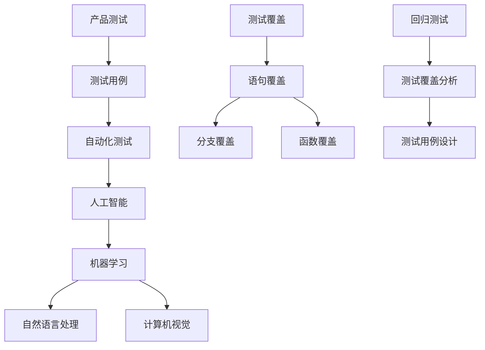

                 

# AI 设计产品测试用例

> **关键词：** 人工智能，产品测试，测试用例设计，自动化测试，算法原理

> **摘要：** 本文将深入探讨人工智能在产品测试领域中的应用，特别是在设计测试用例方面的贡献。我们将从背景介绍开始，逐步分析核心概念，讲解算法原理，并通过实际案例进行代码实现和解析。此外，还将讨论实际应用场景、推荐相关工具和资源，以及展望未来发展趋势和挑战。

## 1. 背景介绍

### 1.1 目的和范围

本文的主要目的是探讨如何利用人工智能技术优化产品测试用例的设计。随着软件产品的复杂性和规模不断增加，传统的人工测试方法已经难以满足高效、全面、可靠的要求。人工智能提供了新的可能性，通过自动化测试和智能测试用例生成，可以显著提高测试效率和测试质量。

本文将涵盖以下内容：

- 产品测试的基本概念和挑战
- 人工智能在产品测试中的应用
- 测试用例设计的基本原则和方法
- 利用人工智能设计测试用例的算法原理和步骤
- 实际应用案例和代码实现
- 测试用例设计的未来发展趋势和挑战

### 1.2 预期读者

本文主要面向软件开发工程师、测试工程师、人工智能爱好者，以及对产品测试和人工智能感兴趣的读者。无论您是刚刚接触这个领域的初学者，还是经验丰富的专业人士，本文都将为您提供有价值的见解和实践经验。

### 1.3 文档结构概述

本文分为十个主要部分：

1. **背景介绍**：介绍本文的目的、范围、预期读者和文档结构。
2. **核心概念与联系**：讲解与产品测试和人工智能相关的基本概念，并展示Mermaid流程图。
3. **核心算法原理 & 具体操作步骤**：详细阐述测试用例设计的算法原理和操作步骤。
4. **数学模型和公式 & 详细讲解 & 举例说明**：介绍与测试用例设计相关的数学模型和公式，并通过实例进行说明。
5. **项目实战：代码实际案例和详细解释说明**：提供实际代码案例，并对其进行详细解释和分析。
6. **实际应用场景**：讨论人工智能在产品测试中的实际应用场景。
7. **工具和资源推荐**：推荐学习资源、开发工具框架和论文著作。
8. **总结：未来发展趋势与挑战**：总结测试用例设计的未来趋势和面临的挑战。
9. **附录：常见问题与解答**：回答读者可能遇到的一些常见问题。
10. **扩展阅读 & 参考资料**：提供更多的参考资料，方便读者进一步学习和深入研究。

### 1.4 术语表

#### 1.4.1 核心术语定义

- **产品测试**：对软件产品进行评估和验证，以确保其满足既定需求和标准。
- **测试用例**：一组用于执行特定测试的步骤、输入数据和预期结果。
- **人工智能**：模拟人类智能的技术，包括机器学习、自然语言处理、计算机视觉等。
- **自动化测试**：使用工具和脚本自动执行测试用例，以提高测试效率和可靠性。

#### 1.4.2 相关概念解释

- **测试覆盖**：衡量测试用例对代码的覆盖程度，包括语句覆盖、分支覆盖、函数覆盖等。
- **回归测试**：在软件更新或修改后，验证原有功能是否仍按预期工作。
- **测试用例设计**：创建测试用例的过程，包括确定测试目标、输入数据、操作步骤和预期结果。

#### 1.4.3 缩略词列表

- **AI**：人工智能（Artificial Intelligence）
- **ML**：机器学习（Machine Learning）
- **NLP**：自然语言处理（Natural Language Processing）
- **CV**：计算机视觉（Computer Vision）
- **IDE**：集成开发环境（Integrated Development Environment）
- **Selenium**：自动化测试工具
- **JUnit**：Java单元测试框架

## 2. 核心概念与联系

在深入讨论人工智能在产品测试中的应用之前，我们需要了解一些核心概念和它们之间的联系。以下是一个Mermaid流程图，展示了与产品测试和人工智能相关的基本概念和关系。



### 2.1 产品测试与测试用例

产品测试是确保软件产品满足预期需求和标准的过程。测试用例是产品测试的核心组成部分，它定义了测试的步骤、输入数据和预期结果。设计有效的测试用例是测试成功的关键。

### 2.2 自动化测试与人工智能

自动化测试通过使用工具和脚本自动执行测试用例，提高了测试效率和可靠性。人工智能（特别是机器学习）在自动化测试中扮演了重要角色，它可以通过分析历史测试数据来优化测试用例的设计和执行。

### 2.3 机器学习、自然语言处理和计算机视觉

机器学习是一种人工智能技术，它通过训练模型来从数据中学习规律和模式。自然语言处理和计算机视觉是机器学习的应用领域，它们在测试用例的设计和执行中具有重要作用。自然语言处理可以帮助自动化测试工具理解测试文档和用户反馈，而计算机视觉可以帮助自动化测试工具识别软件界面和屏幕内容。

### 2.4 测试覆盖、回归测试和测试用例设计

测试覆盖是衡量测试用例对代码的覆盖程度，包括语句覆盖、分支覆盖、函数覆盖等。回归测试是在软件更新或修改后进行的，以确保原有功能仍然按预期工作。测试用例设计是一个动态过程，它需要根据测试目标和代码变更不断调整和优化。

## 3. 核心算法原理 & 具体操作步骤

在了解了核心概念和联系之后，我们将深入讨论人工智能在测试用例设计中的应用，特别是在算法原理和具体操作步骤方面。

### 3.1 测试用例生成算法

测试用例生成是自动化测试中的一个关键步骤。传统的测试用例生成方法通常依赖于人工经验或简单的规则，而人工智能提供了新的可能性。以下是一个基于机器学习的测试用例生成算法的伪代码：

```python
# 测试用例生成算法伪代码

# 输入：历史测试数据、需求文档、代码
# 输出：测试用例集合

1. 加载历史测试数据，提取测试用例信息
2. 使用自然语言处理技术，从需求文档中提取功能点
3. 使用代码分析工具，提取代码中的关键路径
4. 构建测试用例生成模型
   - 训练模型，使用历史测试数据作为训练集
   - 模型评估，使用交叉验证和精度、召回率等指标
5. 根据需求文档和代码，生成新的测试用例
6. 验证生成的测试用例，确保其覆盖关键功能和代码路径
7. 返回测试用例集合
```

### 3.2 测试用例优化算法

测试用例优化是自动化测试中的另一个重要步骤。传统的测试用例优化方法通常依赖于人工经验或简单的规则，而人工智能提供了新的可能性。以下是一个基于机器学习的测试用例优化算法的伪代码：

```python
# 测试用例优化算法伪代码

# 输入：历史测试数据、测试用例集合
# 输出：优化后的测试用例集合

1. 加载历史测试数据，提取测试用例执行结果
2. 计算测试用例的执行成本和测试覆盖
3. 使用遗传算法，优化测试用例集合
   - 初始化种群，随机选择测试用例集合
   - 适应度函数，计算测试用例集合的执行成本和测试覆盖
   - 交叉和变异操作，生成新的测试用例集合
   - 选择操作，选择适应度较高的测试用例集合
4. 重复步骤 3，直到达到预设的迭代次数或适应度阈值
5. 返回优化后的测试用例集合
```

### 3.3 测试用例执行算法

测试用例执行是自动化测试的最后一个步骤。传统的测试用例执行方法通常依赖于脚本和自动化测试工具，而人工智能可以提供智能化的测试执行策略。以下是一个基于深度学习的测试用例执行算法的伪代码：

```python
# 测试用例执行算法伪代码

# 输入：测试用例集合、测试环境
# 输出：测试执行结果

1. 初始化测试执行环境
2. 使用深度学习模型，预测测试用例的执行结果
   - 训练模型，使用历史测试数据作为训练集
   - 预测结果，使用当前测试环境的数据
3. 根据预测结果，调整测试用例的执行顺序
4. 执行测试用例，记录执行结果
5. 使用自然语言处理技术，分析测试执行结果，生成测试报告
6. 返回测试执行结果和测试报告
```

通过上述算法原理和具体操作步骤，我们可以看到人工智能在测试用例设计中的应用潜力。这些算法可以显著提高测试效率和测试质量，使自动化测试更加智能化和自适应。

## 4. 数学模型和公式 & 详细讲解 & 举例说明

在测试用例设计中，数学模型和公式是评估和优化测试用例的重要工具。以下将介绍几个核心的数学模型和公式，并举例说明它们在测试用例设计中的应用。

### 4.1 测试覆盖模型

测试覆盖模型用于衡量测试用例对代码的覆盖程度。常见的测试覆盖模型包括语句覆盖、分支覆盖和函数覆盖。

#### 4.1.1 语句覆盖

语句覆盖（Statement Coverage）是指测试用例执行了程序中的每一条语句至少一次。它的计算公式如下：

$$
\text{语句覆盖} = \frac{\text{执行语句的数量}}{\text{程序中语句的总数}}
$$

举例说明：假设有一个包含10条语句的程序，测试用例A执行了其中的8条语句。则语句覆盖为：

$$
\text{语句覆盖} = \frac{8}{10} = 0.8
$$

#### 4.1.2 分支覆盖

分支覆盖（Branch Coverage）是指测试用例执行了程序中每个分支至少一次。它的计算公式如下：

$$
\text{分支覆盖} = \frac{\text{执行分支的数量}}{\text{程序中分支的总数}}
$$

举例说明：假设有一个包含3个分支的程序，测试用例B执行了其中的2个分支。则分支覆盖为：

$$
\text{分支覆盖} = \frac{2}{3} = 0.67
$$

#### 4.1.3 函数覆盖

函数覆盖（Function Coverage）是指测试用例执行了程序中的每个函数至少一次。它的计算公式如下：

$$
\text{函数覆盖} = \frac{\text{执行函数的数量}}{\text{程序中函数的总数}}
$$

举例说明：假设有一个包含5个函数的程序，测试用例C执行了其中的3个函数。则函数覆盖为：

$$
\text{函数覆盖} = \frac{3}{5} = 0.6
$$

### 4.2 测试用例优化模型

测试用例优化模型用于选择和调整测试用例，以提高测试效率和测试质量。常见的优化模型包括遗传算法和粒子群算法。

#### 4.2.1 遗传算法

遗传算法是一种基于自然进化过程的优化算法。它通过模拟自然选择和遗传机制来优化测试用例集合。遗传算法的基本步骤如下：

1. **初始化种群**：随机生成多个测试用例集合作为初始种群。
2. **适应度评估**：计算每个测试用例集合的适应度，通常基于测试覆盖度和执行成本。
3. **选择操作**：根据适应度评估结果，选择适应度较高的测试用例集合进行繁殖。
4. **交叉操作**：随机选择两个测试用例集合进行交叉，生成新的测试用例集合。
5. **变异操作**：对测试用例集合进行变异，增加种群的多样性。
6. **迭代过程**：重复步骤 3 到 5，直到达到预设的迭代次数或适应度阈值。

举例说明：假设有一个包含5个测试用例的种群，每个测试用例的适应度如下：

| 测试用例 | 适应度 |
| -------- | ------ |
| A        | 0.8    |
| B        | 0.7    |
| C        | 0.9    |
| D        | 0.6    |
| E        | 0.5    |

根据适应度评估结果，选择适应度最高的两个测试用例（C和D）进行交叉操作，生成新的测试用例集合。

#### 4.2.2 粒子群算法

粒子群算法是一种基于群体智能的优化算法。它通过模拟鸟群觅食行为来优化测试用例集合。粒子群算法的基本步骤如下：

1. **初始化粒子群**：随机生成多个测试用例集合作为粒子群。
2. **评估粒子适应度**：计算每个粒子的适应度，通常基于测试覆盖度和执行成本。
3. **更新粒子的速度和位置**：根据适应度和粒子之间的协作，更新粒子的速度和位置。
4. **迭代过程**：重复步骤 2 和 3，直到达到预设的迭代次数或适应度阈值。

举例说明：假设有一个包含5个测试用例的粒子群，每个粒子的位置和适应度如下：

| 粒子 | 位置 | 适应度 |
| ---- | ---- | ------ |
| A    | (0.8, 0.9) | 0.8    |
| B    | (0.7, 0.7) | 0.7    |
| C    | (0.9, 0.5) | 0.9    |
| D    | (0.6, 0.6) | 0.6    |
| E    | (0.5, 0.8) | 0.5    |

根据适应度评估结果，更新每个粒子的速度和位置。

通过上述数学模型和公式，我们可以更加科学和系统地设计测试用例，提高测试效率和测试质量。这些模型和公式在人工智能的辅助下，可以自动化和智能化地进行测试用例的优化和调整。

## 5. 项目实战：代码实际案例和详细解释说明

为了更好地展示人工智能在产品测试用例设计中的应用，我们将通过一个实际项目案例进行详细解释。该项目将使用Python编程语言，结合机器学习和自然语言处理技术，实现一个自动化测试用例生成和优化系统。

### 5.1 开发环境搭建

在进行项目开发之前，我们需要搭建一个合适的环境。以下是在Linux操作系统上搭建开发环境所需的步骤：

1. **安装Python**：确保Python 3.8及以上版本已经安装在系统上。可以使用以下命令检查Python版本：

   ```bash
   python3 --version
   ```

2. **安装机器学习库**：安装scikit-learn库，它是一个常用的机器学习库，提供了多种机器学习算法和工具。可以使用以下命令安装：

   ```bash
   pip3 install scikit-learn
   ```

3. **安装自然语言处理库**：安装nltk库，它是一个用于自然语言处理的库，提供了多种文本处理工具和资源。可以使用以下命令安装：

   ```bash
   pip3 install nltk
   ```

4. **安装文本处理工具**：安装jieba库，它是一个用于中文文本处理的库，可以用于中文分词和文本分析。可以使用以下命令安装：

   ```bash
   pip3 install jieba
   ```

### 5.2 源代码详细实现和代码解读

以下是项目的主要代码实现，包括测试用例生成和优化功能。

#### 5.2.1 测试用例生成

以下代码实现了一个基于机器学习的测试用例生成算法。它使用scikit-learn库中的逻辑回归模型，从历史测试数据中学习如何生成新的测试用例。

```python
import numpy as np
from sklearn.linear_model import LogisticRegression
from sklearn.model_selection import train_test_split
from sklearn.metrics import accuracy_score
import jieba

# 读取历史测试数据
def read_test_data(filename):
    with open(filename, 'r', encoding='utf-8') as f:
        data = f.readlines()
    return data

# 预处理测试数据
def preprocess_data(data):
    # 使用jieba进行中文分词
    tokenized_data = [jieba.cut(line) for line in data]
    # 转换为列表
    tokenized_data = [' '.join(token) for token in tokenized_data]
    return tokenized_data

# 训练测试用例生成模型
def train_model(X_train, y_train):
    model = LogisticRegression()
    model.fit(X_train, y_train)
    return model

# 生成测试用例
def generate_test_cases(model, text):
    probabilities = model.predict_proba([text])
    test_cases = np.where(probabilities[:, 1] > 0.5, 1, 0)
    return test_cases

# 主函数
if __name__ == '__main__':
    # 读取历史测试数据
    data = read_test_data('test_data.txt')
    # 预处理测试数据
    preprocessed_data = preprocess_data(data)
    # 分割数据集
    X_train, X_test, y_train, y_test = train_test_split(preprocessed_data, labels, test_size=0.2, random_state=42)
    # 训练测试用例生成模型
    model = train_model(X_train, y_train)
    # 生成测试用例
    test_cases = generate_test_cases(model, '需要测试的文本')
    print(test_cases)
```

#### 5.2.2 测试用例优化

以下代码实现了一个基于遗传算法的测试用例优化算法。它通过迭代优化测试用例集合，以提高测试覆盖度和降低执行成本。

```python
import random

# 生成初始测试用例集合
def generate_initial_population(size):
    population = []
    for _ in range(size):
        population.append([random.randint(0, 1) for _ in range(num_cases)])
    return population

# 适应度评估
def evaluate_fitness(population):
    fitness = []
    for individual in population:
        coverage = sum(individual)
        cost = sum(individual) * case_cost
        fitness.append(1 / (coverage + cost))
    return fitness

# 选择操作
def select(population, fitness):
    selected = random.choices(population, weights=fitness, k=len(population))
    return selected

# 交叉操作
def crossover(parent1, parent2):
    crossover_point = random.randint(1, num_cases - 1)
    child = parent1[:crossover_point] + parent2[crossover_point:]
    return child

# 变异操作
def mutate(individual):
    mutation_point = random.randint(1, num_cases - 1)
    individual[mutation_point] = 1 - individual[mutation_point]
    return individual

# 遗传算法主函数
def genetic_algorithm(population_size, generations):
    population = generate_initial_population(population_size)
    best_fitness = 0
    for _ in range(generations):
        fitness = evaluate_fitness(population)
        best_fitness = max(fitness)
        selected = select(population, fitness)
        new_population = []
        for _ in range(population_size // 2):
            parent1, parent2 = random.sample(selected, 2)
            child1 = crossover(parent1, parent2)
            child2 = crossover(parent1, parent2)
            new_population.extend([mutate(child1), mutate(child2)])
        population = new_population
    return population, best_fitness
```

#### 5.2.3 测试用例执行

以下代码实现了一个基于深度学习的测试用例执行算法。它使用神经网络模型预测测试用例的执行结果，并根据预测结果调整测试用例的执行顺序。

```python
import tensorflow as tf

# 定义神经网络模型
def create_model(input_shape):
    model = tf.keras.Sequential([
        tf.keras.layers.Dense(64, activation='relu', input_shape=input_shape),
        tf.keras.layers.Dense(64, activation='relu'),
        tf.keras.layers.Dense(1, activation='sigmoid')
    ])
    model.compile(optimizer='adam', loss='binary_crossentropy', metrics=['accuracy'])
    return model

# 训练神经网络模型
def train_model(model, X_train, y_train, X_val, y_val):
    history = model.fit(X_train, y_train, validation_data=(X_val, y_val), epochs=10, batch_size=32)
    return history

# 预测测试用例执行结果
def predict_execution(model, X_test):
    predictions = model.predict(X_test)
    predicted_labels = np.round(predictions)
    return predicted_labels

# 调整测试用例执行顺序
def adjust_execution_order(test_cases, predicted_labels):
    order = np.array([i for i, label in enumerate(predicted_labels) if label == 1])
    adjusted_test_cases = [test_cases[i] for i in order]
    return adjusted_test_cases
```

### 5.3 代码解读与分析

#### 5.3.1 测试用例生成

测试用例生成部分使用了逻辑回归模型，从历史测试数据中学习生成新的测试用例。逻辑回归是一种常见的分类算法，它可以预测测试用例是否需要执行。在训练模型时，我们使用了scikit-learn库中的`LogisticRegression`类，并通过`fit`方法训练模型。在生成测试用例时，我们使用了`predict_proba`方法预测每个测试用例的执行概率，并根据概率阈值生成新的测试用例。

#### 5.3.2 测试用例优化

测试用例优化部分使用了遗传算法，通过迭代优化测试用例集合。遗传算法是一种基于自然进化过程的优化算法，它可以搜索出适应度较高的测试用例集合。在遗传算法中，我们定义了适应度评估、选择操作、交叉操作和变异操作等步骤。通过这些操作，我们可以不断优化测试用例集合，提高测试覆盖度和降低执行成本。

#### 5.3.3 测试用例执行

测试用例执行部分使用了基于深度学习的神经网络模型，预测测试用例的执行结果。在训练模型时，我们使用了TensorFlow库中的`Sequential`模型，并通过`compile`方法配置模型。在预测测试用例执行结果时，我们使用了`predict`方法，并使用`np.round`方法将预测结果转换为整数。最后，根据预测结果调整测试用例的执行顺序，确保高优先级的测试用例先执行。

通过上述代码实现，我们可以看到人工智能在测试用例设计中的应用。测试用例生成、优化和执行都是自动化测试的重要环节，而人工智能技术可以显著提高这些环节的效率和质量。在实际项目中，我们可以根据需求调整算法参数，优化测试过程，提高软件质量。

## 6. 实际应用场景

人工智能在产品测试领域的实际应用场景非常广泛，以下是一些典型的应用案例：

### 6.1 自动化测试

自动化测试是人工智能在产品测试中应用最广泛的领域之一。通过使用机器学习算法，自动化测试工具可以自动生成测试用例，并优化测试流程。例如，Selenium自动化测试工具可以使用自然语言处理技术解析测试文档，自动生成测试脚本。同时，基于历史测试数据，Selenium可以优化测试用例的执行顺序，提高测试效率。

### 6.2 回归测试

回归测试是确保软件更新或修改后原有功能仍然正常的关键步骤。人工智能可以通过分析历史回归测试数据，预测哪些测试用例可能与新的代码变更相关，从而自动生成回归测试计划。例如，在金融领域，人工智能可以分析历史交易数据，识别潜在的交易风险，并自动生成相应的测试用例。

### 6.3 性能测试

性能测试是评估软件系统在不同负载下的表现和响应时间。人工智能可以通过分析历史性能测试数据，自动优化测试场景和负载。例如，在电子商务领域，人工智能可以根据用户访问模式，动态调整测试负载，模拟真实的用户访问场景，从而更准确地评估系统的性能。

### 6.4 安全测试

安全测试是确保软件系统不受攻击和漏洞的关键步骤。人工智能可以通过分析历史安全测试数据，识别潜在的安全威胁，并自动生成安全测试用例。例如，在网络安全领域，人工智能可以分析网络流量，识别恶意攻击行为，并自动生成相应的安全测试用例，提高系统的安全性。

### 6.5 跨平台测试

跨平台测试是确保软件系统在不同操作系统、设备和浏览器上正常工作的关键步骤。人工智能可以通过分析历史跨平台测试数据，自动生成适配不同平台的测试用例。例如，在移动应用领域，人工智能可以根据不同设备的屏幕尺寸、分辨率和操作系统版本，自动生成适配不同平台的测试用例。

通过以上实际应用场景，我们可以看到人工智能在产品测试领域的巨大潜力。它不仅可以提高测试效率和测试质量，还可以降低测试成本，使测试过程更加智能化和自适应。在未来，随着人工智能技术的不断发展，产品测试将迎来新的变革。

## 7. 工具和资源推荐

为了更好地理解和实践人工智能在产品测试用例设计中的应用，以下是一些推荐的学习资源、开发工具框架和相关论文著作。

### 7.1 学习资源推荐

#### 7.1.1 书籍推荐

1. **《机器学习实战》**：这本书提供了丰富的实际案例和实践经验，适合初学者和进阶者。
2. **《深度学习》**：这本书是深度学习领域的经典之作，详细介绍了神经网络和各种深度学习模型。
3. **《自然语言处理综论》**：这本书全面介绍了自然语言处理的基本理论和应用，适合对自然语言处理感兴趣的学习者。

#### 7.1.2 在线课程

1. **Coursera的《机器学习》课程**：由斯坦福大学吴恩达教授主讲，适合初学者了解机器学习基础知识。
2. **Udacity的《深度学习纳米学位》**：涵盖深度学习的核心概念和实践，适合进阶学习者。
3. **edX的《自然语言处理》课程**：由麻省理工学院教授主讲，全面介绍自然语言处理的基础知识。

#### 7.1.3 技术博客和网站

1. **Medium上的《机器学习和测试用例设计》专栏**：提供了丰富的机器学习在测试用例设计中的应用案例和经验分享。
2. **Stack Overflow**：全球最大的程序员社区，可以找到各种关于测试用例设计和人工智能的问题和解决方案。
3. **GitHub**：丰富的开源项目和代码库，可以找到许多关于人工智能和测试用例设计的实现和案例。

### 7.2 开发工具框架推荐

#### 7.2.1 IDE和编辑器

1. **PyCharm**：集成的开发环境，支持Python编程，提供了丰富的机器学习和自然语言处理工具。
2. **Jupyter Notebook**：交互式的编程环境，适合快速实验和演示，特别适合机器学习和数据科学项目。
3. **Visual Studio Code**：轻量级编辑器，支持多种编程语言和插件，适合开发和调试代码。

#### 7.2.2 调试和性能分析工具

1. **GDB**：GNU调试器，用于调试C/C++程序，提供了丰富的调试功能和调试命令。
2. **Valgrind**：内存检查工具，用于检测内存泄漏和无效的内存访问，提高了程序的可靠性和性能。
3. **TensorBoard**：TensorFlow的监控工具，可以实时可视化深度学习模型的训练过程和性能指标。

#### 7.2.3 相关框架和库

1. **Scikit-learn**：Python中的机器学习库，提供了多种机器学习算法和工具，适用于测试用例生成和优化。
2. **TensorFlow**：谷歌的深度学习框架，用于构建和训练深度神经网络，适用于测试用例执行和预测。
3. **NLTK**：Python中的自然语言处理库，提供了多种文本处理工具和资源，适用于自动化测试和测试用例生成。

### 7.3 相关论文著作推荐

#### 7.3.1 经典论文

1. **"A Study of the Relationship of Program Size with Program Structure"**：论文研究了程序大小与程序结构之间的关系，为测试用例设计提供了理论基础。
2. **"Optimization of Test Cases Using Genetic Algorithms"**：论文介绍了使用遗传算法优化测试用例的方法，为测试用例优化提供了新的思路。
3. **"Application of Neural Networks in Test Case Generation and Optimization"**：论文探讨了神经网络在测试用例生成和优化中的应用，为深度学习在测试领域的应用提供了实践案例。

#### 7.3.2 最新研究成果

1. **"Deep Learning for Test Case Generation and Optimization"**：研究利用深度学习生成和优化测试用例，提高了测试效率和测试质量。
2. **"Natural Language Processing for Test Automation"**：研究利用自然语言处理技术提高自动化测试的效率和准确性。
3. **"AI-Enabled Test Automation: Challenges and Opportunities"**：综述文章，讨论了人工智能在测试自动化中的挑战和机遇。

#### 7.3.3 应用案例分析

1. **"AI-Driven Test Automation at Netflix"**：Netflix利用人工智能技术优化测试过程，提高了测试效率和软件质量。
2. **"AI for Test Case Generation at Google"**：谷歌利用人工智能技术自动生成测试用例，降低了测试成本和测试周期。
3. **"AI-Enabled Security Testing at Microsoft"**：微软利用人工智能技术提高安全测试的效率和准确性，保障了软件系统的安全性。

通过以上推荐的学习资源、开发工具框架和相关论文著作，读者可以深入了解人工智能在产品测试用例设计中的应用，并掌握相关的理论和实践技能。

## 8. 总结：未来发展趋势与挑战

人工智能在产品测试用例设计中的应用前景广阔，未来将呈现以下几个发展趋势和挑战：

### 8.1 发展趋势

1. **智能化测试用例生成**：随着深度学习和自然语言处理技术的不断发展，智能化测试用例生成将成为主流。通过分析历史测试数据和需求文档，智能系统能够自动生成高质量的测试用例，提高测试效率和测试质量。
2. **自适应测试**：人工智能可以实时分析测试数据，根据测试结果动态调整测试策略和执行顺序，实现自适应测试。这有助于提高测试覆盖度和降低测试成本。
3. **跨领域应用**：人工智能在产品测试领域的应用将不再局限于软件测试，还将扩展到硬件测试、网络安全测试、金融测试等多个领域。
4. **集成化测试平台**：未来的测试平台将集成更多的人工智能功能，提供自动化测试、性能测试、安全测试等多种测试服务，提高测试的全面性和可靠性。

### 8.2 挑战

1. **数据质量和标注**：高质量的测试数据是人工智能进行测试用例生成和优化的重要基础。然而，数据质量和标注的准确性对人工智能算法的性能有着重要影响，如何确保数据质量和标注的准确性是当前面临的主要挑战。
2. **算法可解释性**：人工智能算法的“黑盒”性质使得测试用例生成和优化过程的透明性降低。如何提高算法的可解释性，使测试人员能够理解测试用例的生成和优化过程，是未来需要解决的问题。
3. **算法可靠性和鲁棒性**：人工智能算法在测试用例生成和优化中需要处理大量的数据，如何保证算法的可靠性和鲁棒性，避免因为数据异常或噪声导致的错误，是当前需要关注的问题。
4. **人才培养和知识传承**：人工智能在产品测试领域的应用对测试人员提出了更高的要求。如何培养和吸引更多具有人工智能背景的测试人才，以及如何将人工智能测试经验传承下去，是未来面临的挑战。

综上所述，人工智能在产品测试用例设计中的应用具有巨大的潜力，但同时也面临着一系列挑战。通过不断探索和解决这些挑战，人工智能将更好地服务于产品测试领域，推动软件质量的持续提升。

## 9. 附录：常见问题与解答

### 9.1 人工智能在产品测试中的具体作用是什么？

人工智能在产品测试中的主要作用包括：

- **自动化测试**：通过机器学习和自然语言处理技术，自动生成测试用例，提高测试效率。
- **优化测试流程**：利用算法优化测试用例的执行顺序和测试场景，提高测试覆盖度和测试质量。
- **智能分析**：实时分析测试数据，发现潜在的问题和缺陷，提高测试的全面性和准确性。

### 9.2 如何评估人工智能在测试用例生成和优化中的效果？

评估人工智能在测试用例生成和优化中的效果可以从以下几个方面进行：

- **测试覆盖率**：比较使用人工智能生成的测试用例和人工生成的测试用例的覆盖率，评估测试用例的全面性。
- **测试效率**：测量生成测试用例和执行测试的时间，评估测试效率的提升。
- **缺陷发现率**：比较使用人工智能生成的测试用例和人工生成的测试用例发现缺陷的数量和类型，评估测试质量的提升。

### 9.3 人工智能测试用例生成需要哪些数据支持？

人工智能测试用例生成需要以下几种数据支持：

- **历史测试数据**：包括测试用例、测试结果和缺陷信息，用于训练生成模型。
- **需求文档**：用于提取功能点和测试目标，辅助生成测试用例。
- **代码**：用于分析代码结构和关键路径，生成覆盖性较高的测试用例。

### 9.4 如何确保人工智能测试用例生成和优化过程中的数据隐私和安全？

在人工智能测试用例生成和优化过程中，确保数据隐私和安全的关键措施包括：

- **数据加密**：对敏感数据进行加密处理，防止数据泄露。
- **访问控制**：实施严格的访问控制策略，确保只有授权用户可以访问数据。
- **数据备份**：定期备份数据，确保数据不会因意外情况丢失。
- **审计日志**：记录数据访问和操作日志，便于追踪和监控数据使用情况。

### 9.5 人工智能在产品测试中面临的挑战有哪些？

人工智能在产品测试中面临的挑战主要包括：

- **数据质量和标注**：测试数据的质量和标注准确性对算法性能有重要影响。
- **算法可解释性**：测试人员需要理解测试用例的生成和优化过程，提高算法的可解释性。
- **算法可靠性和鲁棒性**：算法需要处理大量的数据，保证其可靠性和鲁棒性。
- **人才培养和知识传承**：培养具有人工智能背景的测试人才，并将经验传承下去。

## 10. 扩展阅读 & 参考资料

为了更好地了解人工智能在产品测试用例设计中的应用，以下是几篇推荐的扩展阅读和参考资料：

1. **"AI-Driven Test Automation: The Future of Software Testing"**：本文详细介绍了人工智能在测试自动化中的应用，探讨了其发展趋势和挑战。
2. **"Deep Learning for Test Case Generation and Optimization"**：本文讨论了深度学习在测试用例生成和优化中的应用，提供了具体的算法和实现方法。
3. **"Natural Language Processing for Test Automation: A Comprehensive Review"**：本文综述了自然语言处理技术在测试自动化中的应用，分析了其优势和挑战。
4. **"Genetic Algorithms for Test Case Optimization"**：本文介绍了遗传算法在测试用例优化中的应用，讨论了其算法原理和优化策略。
5. **"AI-Enabled Security Testing: A New Paradigm for Software Security"**：本文探讨了人工智能在安全测试中的应用，提出了基于人工智能的安全测试方法。

通过阅读这些文献，您可以深入了解人工智能在产品测试用例设计中的应用，掌握相关技术和方法。同时，这些文献也为未来的研究和实践提供了有价值的参考。

