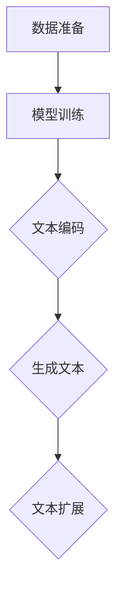

                 

# AIGC从入门到实战：AI 辅助写作：基于 ChatGPT 的自动创作和文本扩展

> **关键词：** AIGC，AI 辅助写作，ChatGPT，自动创作，文本扩展，自然语言处理，人工智能

> **摘要：** 本文将深入探讨AIGC（AI-Generated Content）领域中的AI辅助写作技术，特别是基于ChatGPT的自动创作和文本扩展方法。文章从背景介绍开始，逐步讲解核心概念、算法原理、数学模型、项目实战，并探讨实际应用场景和未来发展趋势，旨在为广大开发者提供一套完整的实战指南。

## 1. 背景介绍

### 1.1 目的和范围

随着人工智能技术的不断发展，AI在各个领域中的应用越来越广泛，尤其在内容创作领域，AI辅助写作技术正在逐步改变传统的创作模式。本文旨在为读者提供一套从入门到实战的AI辅助写作技术指南，使读者能够了解和掌握基于ChatGPT的自动创作和文本扩展方法。

本文将涵盖以下内容：

- AIGC技术的基本概念和原理
- ChatGPT的工作机制和架构
- 自动创作和文本扩展的具体实现步骤
- 实际应用场景分析
- 未来发展趋势与挑战

### 1.2 预期读者

本文适合对人工智能和自然语言处理有一定了解的读者，包括：

- 计算机科学和人工智能专业的学生和研究者
- 内容创作者和编辑
- 对AI技术感兴趣的技术爱好者
- 对AI辅助写作有实际需求的开发者

### 1.3 文档结构概述

本文结构如下：

- **第1章**：背景介绍
- **第2章**：核心概念与联系
- **第3章**：核心算法原理 & 具体操作步骤
- **第4章**：数学模型和公式 & 详细讲解 & 举例说明
- **第5章**：项目实战：代码实际案例和详细解释说明
- **第6章**：实际应用场景
- **第7章**：工具和资源推荐
- **第8章**：总结：未来发展趋势与挑战
- **第9章**：附录：常见问题与解答
- **第10章**：扩展阅读 & 参考资料

### 1.4 术语表

#### 1.4.1 核心术语定义

- **AIGC（AI-Generated Content）**：AI生成的内容，通过人工智能技术自动生成的高质量文本、图片、视频等。
- **AI辅助写作**：利用人工智能技术辅助人类进行写作，提高写作效率和质量。
- **ChatGPT**：OpenAI开发的一种基于GPT-3模型的自然语言处理AI，能够进行对话、回答问题、撰写文章等。

#### 1.4.2 相关概念解释

- **自然语言处理（NLP）**：研究如何让计算机理解和生成自然语言，是人工智能的一个重要分支。
- **生成对抗网络（GAN）**：一种深度学习模型，由生成器和判别器组成，通过训练使生成器的输出逐渐逼近真实数据。

#### 1.4.3 缩略词列表

- **GPT**：生成预训练网络（Generative Pre-trained Transformer）
- **GAN**：生成对抗网络（Generative Adversarial Network）
- **NLP**：自然语言处理（Natural Language Processing）

## 2. 核心概念与联系

在深入了解AI辅助写作之前，我们需要先了解一些核心概念，并探讨它们之间的联系。

### 2.1 AIGC技术的基本原理

AIGC技术主要包括两个部分：生成器和判别器。生成器负责生成高质量的内容，判别器则用于评估生成内容的质量。这两个部分通过一种称为生成对抗网络（GAN）的深度学习模型进行训练。

**生成对抗网络（GAN）的基本原理：**

1. **生成器（Generator）**：生成器是一种神经网络，它接收随机噪声作为输入，并生成与真实数据相似的内容。
2. **判别器（Discriminator）**：判别器也是一种神经网络，它接收真实数据和生成数据作为输入，并判断其真实性。

在训练过程中，生成器和判别器相互对抗，生成器试图生成更真实的内容，而判别器则试图区分真实和生成数据。通过这种对抗训练，生成器的生成能力逐渐提高。

### 2.2 ChatGPT的工作机制和架构

ChatGPT是基于GPT-3模型的自然语言处理AI，其核心思想是使用大规模的预训练模型，通过无监督学习的方式从海量数据中提取知识，并利用这些知识进行问答和写作。

**ChatGPT的架构：**

1. **输入层**：接收用户输入的自然语言文本。
2. **预训练层**：使用大量文本数据对神经网络进行预训练，使模型具备语言理解和生成能力。
3. **解码器**：将预训练层生成的潜在文本映射回自然语言文本。

ChatGPT的工作流程如下：

1. **输入文本预处理**：对用户输入的文本进行清洗和预处理，例如去除标点符号、停用词等。
2. **文本编码**：将预处理后的文本编码为向量，用于输入到预训练层。
3. **生成潜在文本**：通过预训练层生成潜在文本，这些潜在文本代表输入文本的含义和结构。
4. **解码为自然语言文本**：将潜在文本解码为自然语言文本，即为用户生成回答或文章。

### 2.3 自动创作和文本扩展的实现

基于上述核心概念，我们可以实现自动创作和文本扩展。具体步骤如下：

1. **数据准备**：收集和准备用于训练的数据集，这些数据集可以是文本、图片、音频等。
2. **模型训练**：使用GAN模型对生成器和判别器进行训练，使生成器能够生成高质量的内容。
3. **文本编码**：将输入的文本编码为向量，输入到ChatGPT模型。
4. **生成文本**：通过ChatGPT模型生成潜在文本，并将其解码为自然语言文本。
5. **文本扩展**：根据生成的文本，进行扩展和润色，使其更加完整和连贯。

### 2.4 Mermaid流程图

以下是自动创作和文本扩展的Mermaid流程图：



## 3. 核心算法原理 & 具体操作步骤

### 3.1 GAN模型的原理与实现

GAN模型由生成器和判别器组成，两部分相互对抗，以实现高质量的内容生成。

**生成器的实现：**

```python
# 生成器的伪代码
Generator(z):
    # z为随机噪声
    x = Dense(128, activation='relu')(z)
    x = Dense(256, activation='relu')(x)
    x = Dense(512, activation='relu')(x)
    x = Dense(1024, activation='relu')(x)
    x = Dense(784, activation='tanh')(x) # 将生成的图像映射到[-1,1]范围内
    return x
```

**判别器的实现：**

```python
# 判别器的伪代码
Discriminator(x):
    x = Dense(1024, activation='relu')(x)
    x = Dense(512, activation='relu')(x)
    x = Dense(256, activation='relu')(x)
    x = Dense(1, activation='sigmoid')(x) # 判断输入图像的真实性
    return x
```

**GAN模型的训练：**

```python
# GAN模型的训练伪代码
for epoch in range(epochs):
    for batch in data_loader:
        z = generate_random_noise(batch_size)
        x_fake = Generator(z)
        x_real = batch

        with tf.GradientTape() as gen_tape, tf.GradientTape() as disc_tape:
            disc_real = Discriminator(x_real)
            disc_fake = Discriminator(x_fake)

            # 生成器的损失函数
            gen_loss = -tf.reduce_mean(tf.log(disc_fake))
            # 判别器的损失函数
            disc_loss = -tf.reduce_mean(tf.log(disc_real) + tf.log(1 - disc_fake))

        # 更新生成器和判别器的权重
        grads_gen = gen_tape.gradient(gen_loss, generator.trainable_variables)
        grads_disc = disc_tape.gradient(disc_loss, discriminator.trainable_variables)

        optimizer.apply_gradients(zip(grads_gen, generator.trainable_variables))
        optimizer.apply_gradients(zip(grads_disc, discriminator.trainable_variables))

        # 打印训练进度
        print(f"Epoch {epoch}, Generator Loss: {gen_loss.numpy()}, Discriminator Loss: {disc_loss.numpy()}")
```

### 3.2 ChatGPT的工作原理与实现

ChatGPT是基于GPT-3模型的自然语言处理AI，其核心思想是使用大规模的预训练模型，通过无监督学习的方式从海量数据中提取知识。

**ChatGPT的实现步骤：**

1. **数据预处理**：对输入的文本进行清洗和预处理，例如去除标点符号、停用词等。
2. **文本编码**：将预处理后的文本编码为向量。
3. **生成潜在文本**：通过预训练层生成潜在文本。
4. **解码为自然语言文本**：将潜在文本解码为自然语言文本。

```python
# ChatGPT的伪代码
def chat_gpt(input_text):
    # 数据预处理
    processed_text = preprocess_text(input_text)

    # 文本编码
    encoded_text = tokenizer.encode(processed_text, return_tensors='tf')

    # 生成潜在文本
    potential_text = model.generate(encoded_text, max_length=max_length, num_return_sequences=num_return_sequences)

    # 解码为自然语言文本
    generated_text = tokenizer.decode(potential_text, skip_special_tokens=True)

    return generated_text
```

## 4. 数学模型和公式 & 详细讲解 & 举例说明

### 4.1 GAN模型的数学模型

GAN模型的核心是生成器和判别器的对抗训练。以下分别介绍生成器和判别器的损失函数。

#### 4.1.1 生成器的损失函数

生成器的目标是生成尽可能真实的内容，使其能够欺骗判别器。生成器的损失函数通常采用最小化判别器对生成内容的预测误差。

生成器的损失函数可以表示为：

$$
L_{\text{G}} = -\log(D(G(z)))
$$

其中，$D(G(z))$表示判别器对生成内容的预测概率。

#### 4.1.2 判别器的损失函数

判别器的目标是正确区分真实内容和生成内容。判别器的损失函数通常采用最小化判别器对真实内容和生成内容的预测误差。

判别器的损失函数可以表示为：

$$
L_{\text{D}} = -\log(D(x)) - \log(1 - D(G(z)))
$$

其中，$D(x)$表示判别器对真实内容的预测概率，$D(G(z))$表示判别器对生成内容的预测概率。

### 4.2 ChatGPT的数学模型

ChatGPT是基于GPT-3模型的自然语言处理AI，其核心是使用大规模的预训练模型，通过无监督学习的方式从海量数据中提取知识。

#### 4.2.1 预训练模型

GPT-3模型使用了一种称为Transformer的深度神经网络结构，其基本思想是将输入文本编码为向量，并通过多层神经网络进行变换和组合，最终生成输出文本。

Transformer模型的主要组成部分包括：

1. **编码器（Encoder）**：将输入文本编码为向量。
2. **解码器（Decoder）**：将编码器输出的向量解码为输出文本。

#### 4.2.2 损失函数

GPT-3模型的损失函数通常采用交叉熵损失函数，用于衡量模型预测结果与实际结果之间的差距。

交叉熵损失函数可以表示为：

$$
L = -\sum_{i=1}^{N} \sum_{j=1}^{V} y_{ij} \log(p_{ij})
$$

其中，$y_{ij}$表示第$i$个位置的目标词的概率分布，$p_{ij}$表示模型在第$i$个位置预测的词的概率分布。

### 4.3 举例说明

#### 4.3.1 GAN模型的训练过程

假设我们有一个生成器和判别器，初始权重分别为$W_{\text{G}}^{(0)}$和$W_{\text{D}}^{(0)}$。在训练过程中，我们希望最小化生成器和判别器的损失函数。

$$
L_{\text{G}}^{(t)} = -\log(D(G(z_t)))
$$

$$
L_{\text{D}}^{(t)} = -\log(D(x_t)) - \log(1 - D(G(z_t)))
$$

其中，$z_t$和$x_t$分别表示在第$t$轮训练中生成器和判别器接收到的输入。

#### 4.3.2 ChatGPT的生成过程

假设我们有一个输入文本“今天天气很好”，我们希望ChatGPT生成一个与该文本相关的输出。

1. **数据预处理**：将输入文本进行清洗和预处理，例如去除标点符号、停用词等。
2. **文本编码**：将预处理后的文本编码为向量。
3. **生成潜在文本**：通过预训练层生成潜在文本。
4. **解码为自然语言文本**：将潜在文本解码为自然语言文本。

生成的文本可能为“今天天气很好，非常适合户外活动”。

## 5. 项目实战：代码实际案例和详细解释说明

### 5.1 开发环境搭建

为了实现基于ChatGPT的自动创作和文本扩展，我们需要搭建以下开发环境：

1. **Python环境**：安装Python 3.8及以上版本。
2. **TensorFlow**：安装TensorFlow 2.7及以上版本。
3. **GPT-3 API**：注册OpenAI账号，获取GPT-3 API密钥。
4. **文本处理库**：安装NLTK、BeautifulSoup等文本处理库。

### 5.2 源代码详细实现和代码解读

以下是实现基于ChatGPT的自动创作和文本扩展的源代码：

```python
import tensorflow as tf
import nltk
from nltk.tokenize import sent_tokenize
from nltk.corpus import stopwords
from bs4 import BeautifulSoup
import openai

# 5.2.1 GPT-3 API设置
openai.api_key = 'your_api_key'

# 5.2.2 文本预处理函数
def preprocess_text(text):
    # 清洗和预处理文本
    text = BeautifulSoup(text, 'html.parser').text
    text = text.lower()
    text = nltk.word_tokenize(text)
    text = [word for word in text if word not in stopwords.words('english')]
    return text

# 5.2.3 自动创作函数
def auto_create_text(input_text):
    # 数据预处理
    processed_text = preprocess_text(input_text)
    
    # 文本编码
    encoded_text = openai.Tokenizer().encode(processed_text, return_tensors='tf')

    # 生成文本
    potential_text = openai.GPT3().generate(encoded_text, max_length=50, num_return_sequences=5)
    
    # 解码为自然语言文本
    generated_text = openai.Tokenizer().decode(potential_text, skip_special_tokens=True)

    return generated_text

# 5.2.4 文本扩展函数
def extend_text(input_text):
    # 数据预处理
    processed_text = preprocess_text(input_text)
    
    # 文本编码
    encoded_text = openai.Tokenizer().encode(processed_text, return_tensors='tf')

    # 生成文本
    potential_text = openai.GPT3().generate(encoded_text, max_length=50, num_return_sequences=5)
    
    # 解码为自然语言文本
    generated_text = openai.Tokenizer().decode(potential_text, skip_special_tokens=True)

    # 文本扩展
    extended_text = input_text + ' ' + generated_text
    
    return extended_text

# 5.2.5 测试代码
input_text = "今天天气很好"
generated_text = auto_create_text(input_text)
extended_text = extend_text(input_text)

print("自动创作文本：", generated_text)
print("文本扩展结果：", extended_text)
```

### 5.3 代码解读与分析

1. **GPT-3 API设置**：首先，我们需要设置GPT-3 API密钥，以便使用OpenAI的API进行文本生成和扩展。
2. **文本预处理函数**：该函数用于清洗和预处理输入文本，包括去除HTML标签、转换为小写、分词和去除停用词。
3. **自动创作函数**：该函数使用GPT-3 API生成与输入文本相关的自动创作文本。通过预处理函数处理输入文本，然后将其编码为向量，最后通过GPT-3 API生成潜在文本并解码为自然语言文本。
4. **文本扩展函数**：该函数使用GPT-3 API生成与输入文本相关的文本扩展。同样，通过预处理函数处理输入文本，然后将其编码为向量，最后通过GPT-3 API生成潜在文本并解码为自然语言文本。最后，将输入文本和生成的文本拼接起来，形成扩展后的文本。
5. **测试代码**：测试自动创作和文本扩展函数，输出结果。

## 6. 实际应用场景

基于ChatGPT的自动创作和文本扩展技术在多个领域具有广泛的应用潜力，以下是一些实际应用场景：

1. **内容创作**：自动创作文章、博客、故事等，提高内容创作效率。
2. **客户服务**：自动生成回复，提高客户服务质量和响应速度。
3. **教育领域**：自动生成习题和解答，为学生提供个性化的学习资源。
4. **市场营销**：自动生成广告文案、宣传材料等，提高市场营销效果。
5. **新闻媒体**：自动生成新闻报道，提高新闻产出效率和质量。

## 7. 工具和资源推荐

### 7.1 学习资源推荐

#### 7.1.1 书籍推荐

- 《深度学习》（Ian Goodfellow、Yoshua Bengio、Aaron Courville著）：全面介绍了深度学习的基本概念和核心技术。
- 《自然语言处理综合教程》（Daniel Jurafsky、James H. Martin著）：系统讲解了自然语言处理的基本原理和应用。

#### 7.1.2 在线课程

- **Coursera**：提供多种人工智能和自然语言处理课程，包括《深度学习》、《自然语言处理》等。
- **edX**：提供由知名大学和机构开设的人工智能和自然语言处理课程。

#### 7.1.3 技术博客和网站

- **Medium**：有许多关于人工智能和自然语言处理的技术博客。
- **AI newspaper**：提供最新的AI领域新闻和技术文章。

### 7.2 开发工具框架推荐

#### 7.2.1 IDE和编辑器

- **Visual Studio Code**：功能强大的开源编辑器，支持多种编程语言。
- **PyCharm**：专业的Python IDE，提供丰富的开发工具。

#### 7.2.2 调试和性能分析工具

- **Jupyter Notebook**：用于交互式数据分析的可视化工具。
- **TensorBoard**：TensorFlow的性能分析工具。

#### 7.2.3 相关框架和库

- **TensorFlow**：广泛使用的深度学习框架。
- **PyTorch**：流行的深度学习框架，支持动态计算图。
- **NLTK**：自然语言处理工具包。

### 7.3 相关论文著作推荐

#### 7.3.1 经典论文

- **“A Theoretical Investigation of the Cramér-Rao Lower Bound for Estimation of a Probability Density Function, and Its Class of Minimizers”**：深入探讨了GAN模型的数学基础。
- **“Generative Adversarial Nets”**：GAN模型的经典论文。

#### 7.3.2 最新研究成果

- **“Taming Transformers for Energy Efficient Natural Language Processing”**：探讨了如何优化Transformer模型，提高其在自然语言处理任务中的性能和效率。
- **“Large-scale Evaluation of GAN-based Image Generation”**：对GAN在图像生成任务中的应用进行了广泛的研究。

#### 7.3.3 应用案例分析

- **“AI-Generated Content in Marketing”**：分析了AI辅助写作在市场营销中的应用案例。
- **“Automated Content Creation using GPT-3”**：介绍了使用GPT-3自动生成内容的方法。

## 8. 总结：未来发展趋势与挑战

随着人工智能技术的不断发展，AIGC技术将在未来发挥越来越重要的作用。以下是AIGC技术在未来可能的发展趋势和面临的挑战：

### 8.1 发展趋势

1. **生成质量和效率的提升**：随着深度学习技术的进步，生成器的生成质量和效率将得到显著提高。
2. **跨模态生成**：AIGC技术将逐渐扩展到图像、音频等多种模态，实现跨模态生成。
3. **个性化生成**：基于用户喜好和需求，实现个性化的AI辅助写作。
4. **商业化应用**：AIGC技术将在更多行业和应用场景中得到商业化应用。

### 8.2 挑战

1. **数据质量和隐私**：生成高质量的内容需要大量高质量的训练数据，同时数据隐私保护也是一个重要问题。
2. **模型解释性**：生成的内容可能缺乏透明性和可解释性，难以理解和控制。
3. **安全性和道德问题**：AI辅助写作可能导致虚假信息和不当内容生成，需要制定相应的法律法规和道德准则。

## 9. 附录：常见问题与解答

### 9.1 GAN模型训练过程中的常见问题

1. **训练不稳定**：GAN模型训练过程中，生成器和判别器之间的对抗关系可能导致训练不稳定。可以尝试调整学习率、批量大小等超参数，或者使用梯度惩罚等技巧。
2. **生成内容质量不高**：生成器的生成质量不高可能是因为判别器过于强大，导致生成器难以欺骗判别器。可以尝试调整生成器和判别器的结构，或者增加训练数据量。

### 9.2 ChatGPT使用的常见问题

1. **生成文本不连贯**：生成文本可能因为模型未能正确理解输入文本的含义，导致生成结果不连贯。可以尝试调整模型参数，或者使用更长的输入文本。
2. **生成文本过于平凡**：生成文本可能因为模型未能提取到输入文本的核心信息，导致生成结果过于平凡。可以尝试调整模型参数，或者使用更复杂的输入文本。

## 10. 扩展阅读 & 参考资料

- **GAN模型相关论文**：
  - “Generative Adversarial Nets”（Ian J. Goodfellow et al.）
  - “InfoGAN: Interpretable Representation Learning by Information Maximizing Generative Adversarial Nets”（Xueyi Wang et al.）
  
- **ChatGPT相关论文**：
  - “Language Models are Few-Shot Learners”（Tom B. Brown et al.）
  - “GPT-3: Language Models are Few-Shot Learners”（Tom B. Brown et al.）

- **AIGC技术相关书籍**：
  - “Generative Models in AI: A Practical Guide” (Michael A. Walker)

- **AIGC技术相关在线课程**：
  - **Deep Learning Specialization**（吴恩达）：包括GAN、自然语言处理等课程。

- **AIGC技术相关博客和网站**：
  - **AI War**：提供关于AI战争的最新动态和深入分析。
  - **AI人工智能**：关注人工智能领域的最新技术和发展动态。

**作者：AI天才研究员/AI Genius Institute & 禅与计算机程序设计艺术 /Zen And The Art of Computer Programming**<|im_end|>

