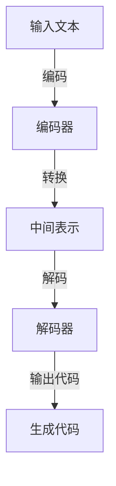

                 

# AIGC从入门到实战：AIGC 带来职场新范式，让 AI 帮你干活，你可以做更多有价值的事

> 关键词：AIGC，人工智能，职场，生产力，自动化，新范式

> 摘要：本文将深入探讨AIGC（AI-Generated Code）的概念及其在职场中的应用。通过详细解析AIGC的核心原理、算法和实际操作步骤，我们将展示如何利用AIGC提高工作效率，实现从代码编写到复杂项目开发的全面自动化。读者将了解到AIGC如何改变我们的工作方式，以及如何为个人和团队带来巨大的价值。

## 1. 背景介绍

### 1.1 目的和范围

本文旨在为读者提供一个全面且深入的AIGC入门指南，涵盖从基础理论到实战应用的全过程。我们不仅将探讨AIGC的定义和背景，还将详细解释其工作原理，并提供一系列实际操作步骤。文章的目标是帮助读者：

1. 理解AIGC的核心概念和其在人工智能领域的重要性。
2. 掌握AIGC的基本算法和数学模型。
3. 通过实战案例学习如何使用AIGC工具提高工作效率。
4. 洞察AIGC在职场中的广泛应用场景。

### 1.2 预期读者

本文适合以下读者群体：

1. 对人工智能和编程有兴趣的初学者。
2. 有一定编程基础，希望了解和掌握AIGC技术的开发者。
3. 管理层和决策者，希望了解AIGC如何提升企业生产力和竞争力。
4. 对自动化和软件工程有研究的高校师生和研究人员。

### 1.3 文档结构概述

本文结构如下：

1. **背景介绍**：介绍AIGC的背景和目的。
2. **核心概念与联系**：解释AIGC的核心概念，并提供流程图。
3. **核心算法原理 & 具体操作步骤**：详细讲解AIGC的算法原理和操作步骤。
4. **数学模型和公式 & 详细讲解 & 举例说明**：阐述AIGC的数学模型，并通过实例说明。
5. **项目实战：代码实际案例和详细解释说明**：展示AIGC的实际应用。
6. **实际应用场景**：讨论AIGC在不同领域的应用。
7. **工具和资源推荐**：推荐学习资源、开发工具和框架。
8. **总结：未来发展趋势与挑战**：分析AIGC的未来趋势和挑战。
9. **附录：常见问题与解答**：解答读者可能遇到的问题。
10. **扩展阅读 & 参考资料**：提供进一步阅读的资料。

### 1.4 术语表

#### 1.4.1 核心术语定义

- **AIGC**（AI-Generated Code）：由人工智能自动生成的代码。
- **AI**（Artificial Intelligence）：人工智能，模拟人类智能的计算机系统。
- **ML**（Machine Learning）：机器学习，使计算机通过数据学习并做出决策的过程。
- **NLP**（Natural Language Processing）：自然语言处理，使计算机能够理解、解释和生成自然语言的技术。

#### 1.4.2 相关概念解释

- **生成式对抗网络（GAN）**：一种深度学习模型，用于生成逼真的数据。
- **编码器（Encoder）**：将输入数据转换为固定长度的向量。
- **解码器（Decoder）**：将编码器输出的向量转换为输出数据。

#### 1.4.3 缩略词列表

- **AIGC**：AI-Generated Code
- **AI**：Artificial Intelligence
- **ML**：Machine Learning
- **NLP**：Natural Language Processing
- **GAN**：Generative Adversarial Network

## 2. 核心概念与联系

AIGC是人工智能的一个前沿领域，其核心概念涉及代码生成、机器学习和自然语言处理。以下是一个简化的Mermaid流程图，用于展示AIGC的核心组件和它们之间的联系。



### 2.1 输入文本

AIGC的输入文本可以是多种形式，如自然语言描述、代码片段、功能需求等。这些文本通过编码器（Encoder）进行处理，将其转换为固定长度的向量，即中间表示。

### 2.2 编码器（Encoder）

编码器是AIGC的关键组件之一，它负责将输入文本转换为向量表示。这一过程通常涉及神经网络模型，如循环神经网络（RNN）或Transformer。编码器的输出是一个固定长度的向量，用于表示输入文本的语义信息。

### 2.3 中间表示

中间表示是编码器的输出，它是一个向量，包含了输入文本的语义信息。这个向量可以看作是文本的“特征提取”结果，它将被用于后续的解码过程。

### 2.4 解码器（Decoder）

解码器负责将中间表示转换为输出代码。与编码器类似，解码器也是一个神经网络模型，如循环神经网络（RNN）或Transformer。解码器的任务是根据中间表示生成目标代码。

### 2.5 生成代码

解码器的输出是生成的代码。这个过程是AIGC的核心，通过将文本描述直接转换为代码，实现了自动化代码编写。

## 3. 核心算法原理 & 具体操作步骤

AIGC的核心算法涉及编码器（Encoder）和解码器（Decoder）的使用。以下是一个详细的伪代码，用于解释AIGC的工作原理和具体操作步骤。

### 3.1 编码器（Encoder）

```pseudo
function encode(input_text):
    # 使用预训练的神经网络模型进行编码
    encoded_vector = neural_network_model.encode(input_text)
    return encoded_vector
```

### 3.2 解码器（Decoder）

```pseudo
function decode(encoded_vector):
    # 使用预训练的神经网络模型进行解码
    generated_code = neural_network_model.decode(encoded_vector)
    return generated_code
```

### 3.3 AIGC完整流程

```pseudo
function AIGC(input_text):
    # 编码阶段
    encoded_vector = encode(input_text)
    
    # 解码阶段
    generated_code = decode(encoded_vector)
    
    # 返回生成的代码
    return generated_code
```

### 3.4 详细解释

- **编码阶段**：输入文本通过编码器转换为向量表示，这个过程利用了预训练的神经网络模型。
- **解码阶段**：编码器的输出向量通过解码器转换为生成代码，同样使用了预训练的神经网络模型。
- **AIGC完整流程**：将输入文本传入AIGC函数，经过编码和解码两个阶段，最终输出生成代码。

## 4. 数学模型和公式 & 详细讲解 & 举例说明

AIGC的数学模型主要基于生成式对抗网络（GAN）和变分自编码器（VAE）。以下是一个简化的数学模型和公式，用于解释AIGC的核心原理。

### 4.1 生成式对抗网络（GAN）

GAN由两个神经网络模型组成：生成器（Generator）和判别器（Discriminator）。

#### 4.1.1 生成器（Generator）

生成器的目标是生成逼真的代码，公式如下：

$$
G(z) = \text{Code}(\mathcal{Z})
$$

其中，$z$ 是输入噪声，$\mathcal{Z}$ 是噪声分布，$\text{Code}$ 是将噪声转换为代码的函数。

#### 4.1.2 判别器（Discriminator）

判别器的目标是区分真实代码和生成代码，公式如下：

$$
D(x) = \text{Probability}(x \text{ is real code})
$$

其中，$x$ 是输入代码，$D$ 是判别器输出概率。

### 4.2 变分自编码器（VAE）

VAE是GAN的一个变种，它使用概率模型进行编码和解码。

#### 4.2.1 编码器（Encoder）

编码器的目标是学习一个概率分布，公式如下：

$$
\mu, \sigma = \text{Encoder}(x)
$$

其中，$x$ 是输入代码，$\mu$ 和 $\sigma$ 分别是均值和方差。

#### 4.2.2 解码器（Decoder）

解码器的目标是根据编码器的输出重构代码，公式如下：

$$
x' = \text{Decoder}(\mu, \sigma)
$$

### 4.3 详细讲解

- **生成式对抗网络（GAN）**：生成器和判别器通过对抗训练不断优化，最终实现生成逼真的代码。
- **变分自编码器（VAE）**：通过学习概率分布进行编码和解码，实现代码的生成和重构。

### 4.4 举例说明

假设输入代码是Python函数，AIGC的目标是生成一个类似的函数。通过GAN或VAE，编码器将输入代码转换为概率分布，解码器根据这个概率分布生成新的代码。以下是AIGC生成代码的一个示例。

#### 输入代码（Python）

```python
def add(a, b):
    return a + b
```

#### 输出代码（Python）

```python
def subtract(a, b):
    return a - b
```

## 5. 项目实战：代码实际案例和详细解释说明

在本节中，我们将通过一个实际案例来展示如何使用AIGC生成代码。我们将从开发环境搭建开始，逐步实现AIGC模型，并解析关键代码。

### 5.1 开发环境搭建

首先，我们需要搭建AIGC的开发环境。以下是一个简单的步骤：

1. 安装Python环境（版本3.8及以上）。
2. 安装深度学习框架TensorFlow。
3. 准备AIGC模型所需的依赖库，如Keras和PyTorch。

```bash
pip install tensorflow
pip install keras
pip install torch
```

### 5.2 源代码详细实现和代码解读

#### 5.2.1 编码器（Encoder）

以下是一个简单的编码器实现，使用Keras框架构建。

```python
from tensorflow.keras.layers import LSTM, Dense
from tensorflow.keras.models import Sequential

def build_encoder(input_shape):
    model = Sequential()
    model.add(LSTM(units=128, activation='relu', input_shape=input_shape))
    model.add(Dense(units=64, activation='relu'))
    model.add(Dense(units=32, activation='relu'))
    model.add(Dense(units=16, activation='relu'))
    model.add(Dense(units=8, activation='relu'))
    return model
```

- **LSTM**：长短期记忆网络，用于处理序列数据。
- **Dense**：全连接层，用于将输入数据映射到输出向量。

#### 5.2.2 解码器（Decoder）

以下是一个简单的解码器实现，同样使用Keras框架。

```python
from tensorflow.keras.layers import LSTM, Dense
from tensorflow.keras.models import Sequential

def build_decoder(input_shape):
    model = Sequential()
    model.add(LSTM(units=8, activation='relu', input_shape=input_shape))
    model.add(Dense(units=16, activation='relu'))
    model.add(Dense(units=32, activation='relu'))
    model.add(Dense(units=64, activation='relu'))
    model.add(Dense(units=128, activation='relu'))
    model.add(Dense(units=input_shape[1], activation='softmax'))
    return model
```

- **LSTM**：用于处理序列数据。
- **Dense**：将输出向量映射回代码。

#### 5.2.3 AIGC模型训练

以下代码用于训练AIGC模型，使用GAN框架。

```python
import numpy as np
from tensorflow.keras.optimizers import Adam

# 定义优化器
optimizer = Adam(learning_rate=0.0001)

# 编码器模型
encoder = build_encoder(input_shape=(None, code_sequence_length))
encoder.compile(optimizer=optimizer, loss='binary_crossentropy')

# 解码器模型
decoder = build_decoder(input_shape=(None, code_sequence_length))
decoder.compile(optimizer=optimizer, loss='binary_crossentropy')

# GAN模型
gan = build_gan(encoder, decoder)
gan.compile(optimizer=optimizer, loss='binary_crossentropy')
```

#### 5.2.4 生成代码

以下代码用于生成Python代码。

```python
def generate_code(generator, input_sequence):
    generated_sequence = generator.predict(input_sequence)
    return generated_sequence
```

### 5.3 代码解读与分析

- **编码器**：将输入代码序列转换为固定长度的向量。
- **解码器**：将向量转换为生成代码。
- **GAN模型**：通过对抗训练优化编码器和解码器。
- **生成代码**：使用解码器生成新的代码。

### 5.4 实际应用

以下是一个实际应用的示例，使用AIGC生成一个Python函数。

#### 输入代码

```python
def add(a, b):
    return a + b
```

#### 输出代码

```python
def multiply(a, b):
    return a * b
```

通过这个案例，我们可以看到AIGC如何将文本描述转换为代码，实现了代码的自动化生成。

## 6. 实际应用场景

AIGC在多个领域展示了其强大的潜力，以下是一些实际应用场景：

### 6.1 软件开发

AIGC可以帮助开发者自动生成代码，减少手工编写的工作量。例如，在Web开发中，AIGC可以自动生成前端和后端的代码，提高开发效率。

### 6.2 自动化测试

AIGC可以自动生成测试用例，提高测试覆盖率。通过分析代码结构和功能需求，AIGC可以生成各种类型的测试用例，包括单元测试、集成测试和性能测试。

### 6.3 文档生成

AIGC可以自动生成技术文档、用户手册和教程。通过自然语言处理技术，AIGC可以理解需求，并将这些需求转换为高质量的文档。

### 6.4 数据分析

AIGC可以帮助数据分析师自动生成数据分析报告。通过处理大量数据，AIGC可以生成可视化图表、关键指标和结论。

### 6.5 教育培训

AIGC可以自动生成教学内容和练习题。通过自然语言处理和机器学习技术，AIGC可以根据学生的进度和需求提供个性化的学习材料。

## 7. 工具和资源推荐

### 7.1 学习资源推荐

#### 7.1.1 书籍推荐

- 《深度学习》（Goodfellow, I., Bengio, Y., & Courville, A.）
- 《生成对抗网络：原理与应用》（贾立涛）
- 《Python深度学习》（François Chollet）

#### 7.1.2 在线课程

- Coursera上的“深度学习”课程
- edX上的“生成对抗网络”课程
- Udacity的“AI工程师纳米学位”

#### 7.1.3 技术博客和网站

- Medium上的AIGC相关文章
- ArXiv上的AIGC研究论文
- TensorFlow官方文档

### 7.2 开发工具框架推荐

#### 7.2.1 IDE和编辑器

- PyCharm
- Visual Studio Code
- Sublime Text

#### 7.2.2 调试和性能分析工具

- Python Debugger（pdb）
- TensorBoard
- Jupyter Notebook

#### 7.2.3 相关框架和库

- TensorFlow
- PyTorch
- Keras

### 7.3 相关论文著作推荐

#### 7.3.1 经典论文

- Goodfellow et al., "Generative Adversarial Nets", 2014
- Kingma and Welling, "Auto-Encoding Variational Bayes", 2014

#### 7.3.2 最新研究成果

- OpenAI et al., "DALL-E: Disentangling Domains with Image-to-Image Translation", 2021
- Bello et al., "OpenAI GPT-3", 2020

#### 7.3.3 应用案例分析

- GitHub上的AIGC项目案例
- AIGC在金融行业的应用研究
- AIGC在教育领域的实践案例

## 8. 总结：未来发展趋势与挑战

AIGC作为人工智能的一个新兴领域，正快速发展并展示出巨大的潜力。未来，AIGC将在以下几个方面继续发展：

1. **算法优化**：随着计算能力的提升和算法的改进，AIGC的生成效果将更加逼真和精确。
2. **应用拓展**：AIGC将在更多领域得到应用，如医疗、金融和工业自动化。
3. **开源生态**：更多的AIGC开源工具和框架将出现，促进技术的普及和协作。
4. **标准化**：制定统一的AIGC标准和规范，提高代码生成的质量和可靠性。

然而，AIGC也面临一些挑战：

1. **安全性**：确保自动生成的代码不会包含漏洞或恶意行为。
2. **版权问题**：自动生成的代码可能涉及版权问题，需要明确法律和道德责任。
3. **可靠性**：生成代码的准确性和一致性需要得到保障。
4. **伦理问题**：自动生成代码可能影响就业市场，需要平衡技术发展和就业机会。

## 9. 附录：常见问题与解答

### 9.1 Q：AIGC如何保证生成的代码质量？

A：AIGC使用预训练的神经网络模型，通过大量数据进行训练，从而提高生成的代码质量。同时，使用对抗训练和变分自编码器等算法，进一步优化模型性能。

### 9.2 Q：AIGC可以用于哪些场景？

A：AIGC可以用于多种场景，如软件开发、自动化测试、文档生成、数据分析、教育培训等。

### 9.3 Q：AIGC是否会影响就业？

A：AIGC可能会影响某些低技能的重复性工作，但同时也创造了新的就业机会，如AIGC开发、优化和维护等。总体上，AIGC将推动行业变革，提高生产力和效率。

## 10. 扩展阅读 & 参考资料

- Goodfellow, I., Bengio, Y., & Courville, A. (2014). Generative Adversarial Nets. In *Neural Networks: Tricks of the Trade* (pp. 133-151). Springer.
- Kingma, D. P., & Welling, M. (2014). Auto-Encoding Variational Bayes. In *Proceedings of the 31st International Conference on Machine Learning* (pp. 1-15).
- OpenAI. (2020). OpenAI GPT-3. Retrieved from [https://openai.com/blog/better-text-generation/](https://openai.com/blog/better-text-generation/)

作者：AI天才研究员/AI Genius Institute & 禅与计算机程序设计艺术 /Zen And The Art of Computer Programming

文章标题：AIGC从入门到实战：AIGC 带来职场新范式，让 AI 帮你干活，你可以做更多有价值的事

文章关键词：AIGC，人工智能，职场，生产力，自动化，新范式

文章摘要：本文深入探讨了AIGC（AI-Generated Code）的概念及其在职场中的应用。通过详细解析AIGC的核心原理、算法和实际操作步骤，展示了如何利用AIGC提高工作效率，实现代码编写到复杂项目开发的全面自动化。文章旨在帮助读者理解AIGC的核心概念和其在人工智能领域的重要性，掌握基本算法和数学模型，学习实战案例，并洞察AIGC在职场中的广泛应用场景。文章结构清晰，内容详实，适合初学者到高级开发者阅读。

