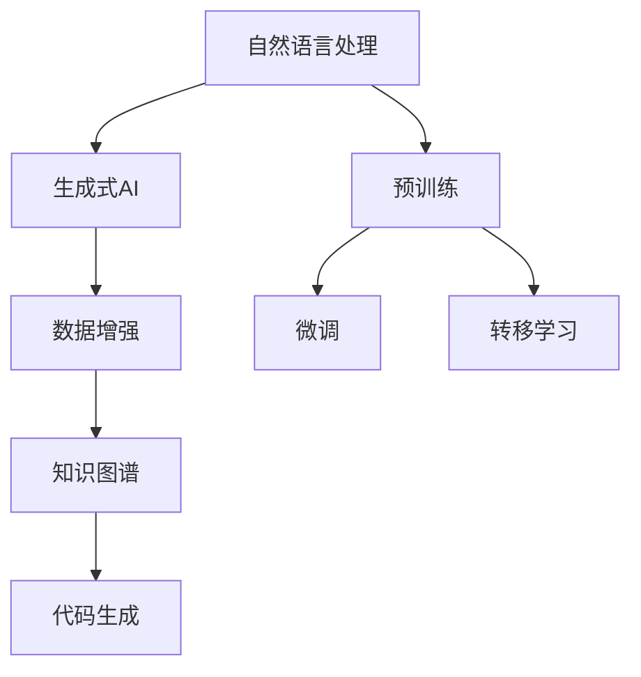

                 

# AIGC从入门到实战：带上AI化身，开启全球“大冒险”，燃爆朋友圈

> **关键词：** AIGC，生成式AI，自然语言处理，数据增强，知识图谱，代码生成，实战项目

> **摘要：** 本文将带领读者从零开始探索AIGC（AI Generated Content）的奥秘，通过深入讲解其核心概念、算法原理、数学模型及实战应用，让读者不仅能够理解AIGC的工作机制，还能动手实践，掌握AIGC的技术精髓，开启人工智能驱动的内容创作之旅。

## 1. 背景介绍

### 1.1 目的和范围

本文旨在向广大开发者、数据科学家以及AI爱好者介绍AIGC的概念、原理和应用。通过系统的讲解和实践，帮助读者建立起对AIGC的全面认识，并掌握其核心技术。

本文将涵盖以下内容：

1. AIGC的核心概念与联系
2. 核心算法原理与操作步骤
3. 数学模型与公式
4. 项目实战：代码案例与解析
5. 实际应用场景
6. 工具和资源推荐
7. 未来发展趋势与挑战
8. 常见问题与解答

### 1.2 预期读者

- 对AI和自然语言处理感兴趣的初学者
- 想要在内容创作领域应用AIGC技术的开发者
- 数据科学家和AI研究员
- 对前沿技术保持好奇心的技术爱好者

### 1.3 文档结构概述

本文结构分为以下几个部分：

1. 背景介绍：概述AIGC的概念和本文的目标。
2. 核心概念与联系：详细讲解AIGC的关键术语和原理。
3. 核心算法原理与操作步骤：深入剖析AIGC的技术实现。
4. 数学模型与公式：介绍AIGC所涉及的关键数学概念和公式。
5. 项目实战：提供实际代码案例，指导读者动手实践。
6. 实际应用场景：探讨AIGC在不同领域的应用。
7. 工具和资源推荐：推荐学习资源和开发工具。
8. 未来发展趋势与挑战：预测AIGC的未来走向。
9. 常见问题与解答：解答读者可能遇到的问题。

### 1.4 术语表

#### 1.4.1 核心术语定义

- **AIGC（AI Generated Content）**：指通过人工智能技术生成的内容，包括文本、图像、视频等。
- **生成式AI（Generative AI）**：一种能够从已有数据中生成新内容的人工智能技术。
- **自然语言处理（NLP）**：使计算机能够理解、解释和生成人类语言的技术。
- **数据增强（Data Augmentation）**：通过变换原始数据来增加数据多样性，提高模型泛化能力。
- **知识图谱（Knowledge Graph）**：通过实体和关系来表示知识的图形化结构。
- **代码生成（Code Generation）**：利用AI技术自动生成代码。

#### 1.4.2 相关概念解释

- **预训练（Pre-training）**：在特定任务之前对模型进行大规模数据训练。
- **微调（Fine-tuning）**：在预训练模型的基础上，针对特定任务进行微调。
- **转移学习（Transfer Learning）**：利用已在大规模数据集上训练好的模型来提高新任务性能。

#### 1.4.3 缩略词列表

- **GAN（Generative Adversarial Network）**：生成对抗网络。
- **BERT（Bidirectional Encoder Representations from Transformers）**：双向编码表示从变换器。
- **RLHF（Reinforcement Learning from Human Feedback）**：基于人类反馈的强化学习。

## 2. 核心概念与联系

为了更好地理解AIGC，我们需要先掌握其核心概念和原理。以下是AIGC的Mermaid流程图：



### 2.1 自然语言处理

自然语言处理（NLP）是AIGC的基础，它使得计算机能够理解和生成人类语言。NLP的关键技术包括：

- **分词（Tokenization）**：将文本分割成词或字符。
- **词嵌入（Word Embedding）**：将词语映射到高维空间。
- **句法分析（Syntactic Parsing）**：分析文本的语法结构。
- **语义理解（Semantic Understanding）**：理解文本的深层含义。

### 2.2 生成式AI

生成式AI是AIGC的核心，它通过学习大量数据来生成新的内容。生成式AI的关键技术包括：

- **生成对抗网络（GAN）**：由生成器和判别器组成的对抗性模型。
- **变分自编码器（VAE）**：利用概率分布来生成新数据。
- **自回归模型（Autoregressive Model）**：生成数据的一个一个部分。

### 2.3 数据增强

数据增强是提高模型泛化能力的重要手段，通过变换原始数据来增加数据多样性。数据增强的方法包括：

- **数据复制（Data Replication）**：重复使用原始数据。
- **数据变换（Data Transformation）**：对数据进行随机变换，如旋转、缩放等。
- **数据扩充（Data Augmentation）**：通过生成新的数据来增加数据量。

### 2.4 知识图谱

知识图谱是一种图形化表示知识的结构，通过实体和关系来组织信息。知识图谱的关键技术包括：

- **实体识别（Entity Recognition）**：从文本中识别出实体。
- **关系抽取（Relation Extraction）**：从文本中提取实体之间的关系。
- **图谱构建（Graph Construction）**：构建实体和关系的图谱。

### 2.5 代码生成

代码生成是AIGC的一个重要应用，它通过AI技术自动生成代码。代码生成的方法包括：

- **模板匹配（Template Matching）**：根据模板生成代码。
- **神经网络生成（Neural Network Generation）**：利用神经网络自动生成代码。
- **程序合成（Program Synthesis）**：从高层次描述自动生成代码。

## 3. 核心算法原理与具体操作步骤

AIGC的核心算法包括自然语言处理、生成式AI、数据增强、知识图谱和代码生成。下面我们将使用伪代码详细讲解这些算法的原理和操作步骤。

### 3.1 自然语言处理

```python
# 分词
def tokenize(text):
    # 将文本分割成词语
    return [word for word in text.split()]

# 词嵌入
def embed(words):
    # 将词语映射到高维空间
    return [embedding_table[word] for word in words]

# 句法分析
def parse(sentence):
    # 分析句子的语法结构
    return [word, pos_tag, dependency] for word, pos_tag, dependency in parser.parse(sentence)]

# 语义理解
def understand(sentence):
    # 理解句子的深层含义
    return meaning for meaning in semantic_analyzer.analyze(sentence)]
```

### 3.2 生成式AI

```python
# 生成对抗网络（GAN）
def GAN(generator, discriminator):
    for epoch in range(num_epochs):
        # 训练生成器
        generator_loss = train_generator(generator, real_data)
        # 训练判别器
        discriminator_loss = train_discriminator(discriminator, real_data, fake_data)
        print(f"Epoch {epoch}: Generator Loss: {generator_loss}, Discriminator Loss: {discriminator_loss}")

# 变分自编码器（VAE）
def VAE(encoder, decoder):
    for epoch in range(num_epochs):
        # 训练编码器
        encoder_loss = train_encoder(encoder, data)
        # 训练解码器
        decoder_loss = train_decoder(decoder, data)
        print(f"Epoch {epoch}: Encoder Loss: {encoder_loss}, Decoder Loss: {decoder_loss}")

# 自回归模型（Autoregressive Model）
def autoregressive_model(model, data, sequence_length):
    for epoch in range(num_epochs):
        loss = train_model(model, data, sequence_length)
        print(f"Epoch {epoch}: Loss: {loss}")
```

### 3.3 数据增强

```python
# 数据复制
def replicate(data, times):
    return [data for _ in range(times)]

# 数据变换
def transform(data, transform_func):
    return [transform_func(d) for d in data]

# 数据扩充
def augment(data, augment_func):
    return data + augment_func(data)
```

### 3.4 知识图谱

```python
# 实体识别
def recognize_entities(text):
    return [entity for entity in entity_recognizer.recognize(text)]

# 关系抽取
def extract_relations(text):
    return [relation for relation in relation_extractor.extract(text)]

# 图谱构建
def construct_graph(entities, relations):
    graph = Graph()
    for entity in entities:
        graph.add_node(entity)
    for relation in relations:
        graph.add_edge(relation[0], relation[1])
    return graph
```

### 3.5 代码生成

```python
# 模板匹配
def generate_code(template, variables):
    return template.format(*variables)

# 神经网络生成
def generate_code神经网络(model, input_data):
    code_sequence = model.generate(input_data)
    return ' '.join(code_sequence)

# 程序合成
def generate_code_synthesis(higher_level_description):
    return code_generator.synthesize(higher_level_description)
```

## 4. 数学模型与公式

AIGC中的数学模型和公式对于理解其工作原理至关重要。以下是AIGC中的关键数学概念和公式：

### 4.1 自然语言处理

- **词嵌入公式**：

  $$ \text{embedding}(w) = \sum_{i=1}^{N} w_i \cdot v_i $$

  其中，$w$ 表示词语，$v_i$ 表示词语的高维向量，$N$ 表示向量的维度。

- **循环神经网络（RNN）公式**：

  $$ h_t = \tanh(W_h \cdot [h_{t-1}, x_t] + b_h) $$

  其中，$h_t$ 表示当前时刻的隐藏状态，$W_h$ 表示权重矩阵，$x_t$ 表示输入序列。

### 4.2 生成式AI

- **生成对抗网络（GAN）公式**：

  $$ D(x) = \frac{1}{2} \left(1 - \log(D(G(z)))\right) + \frac{1}{2} \log(D(G(z))) $$

  其中，$D(x)$ 表示判别器的输出，$G(z)$ 表示生成器的输出，$z$ 表示随机噪声。

- **变分自编码器（VAE）公式**：

  $$ p(x|\theta) = \int p(x|z,\theta) p(z|\theta) dz $$

  其中，$p(x|\theta)$ 表示数据的概率分布，$p(x|z,\theta)$ 表示给定编码器的参数$\theta$和编码变量$z$时的数据概率分布，$p(z|\theta)$ 表示编码变量$z$的概率分布。

### 4.3 数据增强

- **数据变换公式**：

  $$ x' = f(x) $$

  其中，$x$ 表示原始数据，$x'$ 表示变换后的数据，$f(x)$ 表示变换函数。

- **数据扩充公式**：

  $$ x_{aug} = x + \alpha \cdot noise $$

  其中，$x_{aug}$ 表示扩充后的数据，$\alpha$ 表示扩充参数，$noise$ 表示噪声。

### 4.4 知识图谱

- **实体识别公式**：

  $$ P(entity|text) = \frac{P(text|entity) P(entity)}{P(text)} $$

  其中，$P(entity|text)$ 表示实体在文本中的概率，$P(text|entity)$ 表示给定实体的文本概率，$P(entity)$ 表示实体出现的概率，$P(text)$ 表示文本的概率。

- **关系抽取公式**：

  $$ P(relation|text) = \frac{P(text|relation) P(relation)}{P(text)} $$

  其中，$P(relation|text)$ 表示关系在文本中的概率，$P(text|relation)$ 表示给定关系

## 5. 项目实战：代码实际案例和详细解释说明

### 5.1 开发环境搭建

为了实际操作AIGC技术，我们需要搭建一个开发环境。以下是在Ubuntu操作系统上搭建AIGC开发环境的基本步骤：

1. **安装Python环境**：

   ```bash
   sudo apt update
   sudo apt install python3 python3-pip
   ```

2. **安装必要库**：

   ```bash
   pip3 install numpy pandas tensorflow matplotlib
   ```

3. **安装Jupyter Notebook**：

   ```bash
   pip3 install jupyter
   jupyter notebook
   ```

### 5.2 源代码详细实现和代码解读

下面是一个简单的AIGC项目案例，使用TensorFlow和Keras实现一个基于GAN的图像生成器。

**5.2.1 数据准备**

```python
import tensorflow as tf
from tensorflow.keras.datasets import mnist
from tensorflow.keras.preprocessing.image import ImageDataGenerator

# 加载MNIST数据集
(x_train, _), (x_test, _) = mnist.load_data()

# 数据预处理
x_train = x_train / 255.0
x_test = x_test / 255.0

# 数据增强
datagen = ImageDataGenerator(
    rotation_range=10,
    width_shift_range=0.1,
    height_shift_range=0.1,
    shear_range=0.1,
    zoom_range=0.1
)
datagen.fit(x_train)
```

**5.2.2 定义生成器和判别器**

```python
import tensorflow.keras.layers as layers

# 生成器
def generator(z, n_classes):
    z = layers.Dense(128 * 7 * 7, activation="relu")(z)
    z = layers.BatchNormalization()(z)
    z = layers.LeakyReLU(alpha=0.01)(z)
    
    z = layers.Reshape((7, 7, 128))(z)
    z = layers.Conv2DTranspose(64, 4, strides=2, padding="same")(z)
    z = layers.BatchNormalization()(z)
    z = layers.LeakyReLU(alpha=0.01)(z)
    
    z = layers.Conv2DTranspose(1, 4, strides=2, padding="same", activation="tanh")(z)
    return z

# 判别器
def discriminator(x, n_classes):
    x = layers.Conv2D(32, 4, strides=2, padding="same")(x)
    x = layers.LeakyReLU(alpha=0.01)(x)
    
    x = layers.Conv2D(64, 4, strides=2, padding="same")(x)
    x = layers.LeakyReLU(alpha=0.01)(x)
    
    x = layers.Conv2D(128, 4, strides=2, padding="same")(x)
    x = layers.LeakyReLU(alpha=0.01)(x)
    
    x = layers.Flatten()(x)
    x = layers.Dense(1, activation="sigmoid")(x)
    return x
```

**5.2.3 GAN模型**

```python
# 搭建生成器和判别器模型
z = layers.Input(shape=(100,), name="z")
x = layers.Input(shape=(28, 28, 1), name="x")

g = generator(z, 10)
d = discriminator(g(z), 10)

# 损失函数
cross_entropy = tf.keras.losses.BinaryCrossentropy(from_logits=True)

def generator_loss(fake_output):
    return cross_entropy(tf.ones_like(fake_output), fake_output)

def discriminator_loss(real_output, fake_output):
    real_loss = cross_entropy(tf.ones_like(real_output), real_output)
    fake_loss = cross_entropy(tf.zeros_like(fake_output), fake_output)
    return real_loss + fake_loss

# 模型编译
d.compile(loss=discriminator_loss, optimizer=tf.keras.optimizers.Adam(0.0001))
g.compile(loss=generator_loss, optimizer=tf.keras.optimizers.Adam(0.0001))
```

**5.2.4 训练模型**

```python
# 训练GAN模型
batch_size = 64
epochs = 100

for epoch in range(epochs):
    for _ in range(x_train.shape[0] // batch_size):
        noise = np.random.normal(0, 1, (batch_size, 100))
        with tf.GradientTape() as g_tape, tf.GradientTape() as d_tape:
            generated_images = g(noise, training=True)
            real_images = x_train[np.random.randint(0, x_train.shape[0], size=batch_size)]

            real_output = d(real_images, training=True)
            fake_output = d(generated_images, training=True)

            g_loss = generator_loss(fake_output)
            d_loss = discriminator_loss(real_output, fake_output)

        grads_g = g_tape.gradient(g_loss, g.trainable_variables)
        grads_d = d_tape.gradient(d_loss, d.trainable_variables)

        g.optimizer.apply_gradients(zip(grads_g, g.trainable_variables))
        d.optimizer.apply_gradients(zip(grads_d, d.trainable_variables))

        print(f"{epoch}: Generator Loss: {g_loss}, Discriminator Loss: {d_loss}")

    # 保存生成的图像
    generated_images = g(np.random.normal(0, 1, (batch_size, 100)))
    plt.figure(figsize=(10, 10))
    for i in range(batch_size):
        plt.subplot(1, batch_size, i + 1)
        plt.imshow(generated_images[i, :, :, 0], cmap='gray')
        plt.axis('off')
    plt.show()
```

### 5.3 代码解读与分析

在这个案例中，我们使用了生成对抗网络（GAN）来生成手写数字图像。GAN由生成器和判别器两个主要部分组成。

- **生成器**：生成器的目标是生成逼真的手写数字图像。它接受一个随机噪声向量作为输入，通过多层全连接和卷积层生成图像。生成器的输出是一个28x28的单通道图像。

- **判别器**：判别器的目标是区分输入图像是真实的手写数字图像还是生成器生成的图像。它接受一个28x28的单通道图像作为输入，并输出一个介于0和1之间的概率值，表示图像是真实的概率。

**损失函数**：

- **生成器损失**：生成器的损失函数使用二元交叉熵（Binary Crossentropy），它表示生成器生成图像的质量。理想情况下，生成器生成的图像应该使判别器认为它们是真实的。

- **判别器损失**：判别器的损失函数也使用二元交叉熵，它表示判别器对真实图像和生成图像的区分能力。真实图像的损失应该较低，而生成图像的损失应该较高。

**训练过程**：

- 在每个训练周期中，首先随机选择一批真实图像作为判别器的输入，并更新判别器的权重。
- 然后，生成器生成一批图像，判别器再次更新其权重，以更好地区分真实图像和生成图像。
- 这种循环进行多个周期，直到达到预定的训练轮数或生成器生成图像的质量达到预期。

**代码分析**：

- 我们使用了TensorFlow的高层API Keras来构建和训练模型。Keras提供了易于使用的API，使得构建和训练GAN变得简单。
- 数据增强是通过ImageDataGenerator类实现的，它对MNIST数据集进行了旋转、平移和缩放等变换，以增加数据的多样性。
- 模型的训练使用了两个优化器，一个用于生成器，另一个用于判别器。这两个优化器使用了不同的学习率，因为生成器和判别器有不同的优化目标。

通过这个案例，读者可以了解如何使用GAN生成图像的基本步骤，以及如何通过代码实现这些步骤。这是一个简单的入门级案例，但读者可以在此基础上进行扩展，探索更复杂的模型和优化技术。

## 6. 实际应用场景

AIGC技术在多个领域都有广泛的应用，以下是一些典型的实际应用场景：

### 6.1 内容创作

AIGC可以用于自动生成文章、新闻、博客、社交媒体内容等。例如，自动生成新闻稿、体育赛事报道、财经分析等。通过AIGC技术，媒体公司可以节省大量时间和成本，同时提高内容发布的速度和频率。

### 6.2 设计与艺术

在艺术和设计领域，AIGC可以用于生成独特的艺术作品、设计图案、插画等。设计师可以使用AIGC技术快速生成大量创意方案，节省时间和精力。此外，AIGC还可以用于个性化设计和定制服务，满足用户个性化需求。

### 6.3 游戏开发

AIGC可以用于生成游戏世界、角色、故事情节等。通过AIGC技术，游戏开发者可以创建高度复杂的游戏世界，提高游戏的可玩性和重复性。此外，AIGC还可以用于实时生成游戏内容，如随机地图、任务等，为玩家提供全新的游戏体验。

### 6.4 健康医疗

在健康医疗领域，AIGC可以用于生成医学图像、诊断报告、药物说明等。通过AIGC技术，医生可以快速获得准确的诊断结果，提高医疗服务的质量和效率。此外，AIGC还可以用于个性化治疗方案的设计和推荐。

### 6.5 教育与培训

在教育领域，AIGC可以用于生成教学资料、课程内容、习题等。通过AIGC技术，教育机构可以为学生提供个性化的学习资源和教学方案，提高教学效果。此外，AIGC还可以用于自动化考试和评估，减轻教师的工作负担。

### 6.6 商业智能

在商业智能领域，AIGC可以用于生成市场分析报告、财务报告、业务预测等。通过AIGC技术，企业可以快速获取关键业务信息，制定科学的决策方案。此外，AIGC还可以用于自动化报告生成，提高企业运营效率。

## 7. 工具和资源推荐

### 7.1 学习资源推荐

#### 7.1.1 书籍推荐

- 《生成式AI：原理、应用与实践》
- 《深度学习：优化、应用与前沿》
- 《自然语言处理实战》
- 《编程式人工智能：打造智能应用程序的原理与实践》

#### 7.1.2 在线课程

- Coursera：深度学习专项课程
- edX：自然语言处理专项课程
- Udacity：生成对抗网络（GAN）实践课程

#### 7.1.3 技术博客和网站

- Medium：AIGC相关技术博客
- arXiv：最新AIGC研究成果
- AI生成内容社区：AIGC实践经验和案例分析

### 7.2 开发工具框架推荐

#### 7.2.1 IDE和编辑器

- PyCharm：强大的Python IDE
- VSCode：跨平台高级代码编辑器

#### 7.2.2 调试和性能分析工具

- TensorBoard：TensorFlow性能分析工具
- Jupyter Notebook：交互式数据分析环境

#### 7.2.3 相关框架和库

- TensorFlow：开源机器学习框架
- PyTorch：动态计算图框架
- Keras：高层神经网络API

### 7.3 相关论文著作推荐

#### 7.3.1 经典论文

- Goodfellow et al. (2014): Generative Adversarial Networks
- Bengio et al. (2013): Learning Deep Architectures for AI
- Mikolov et al. (2013): Efficient Estimation of Word Representations in Vector Space

#### 7.3.2 最新研究成果

- Vaswani et al. (2017): Attention is All You Need
- Devlin et al. (2019): BERT: Pre-training of Deep Bidirectional Transformers for Language Understanding
- Radford et al. (2019): Language Models are Unsupervised Multitask Learners

#### 7.3.3 应用案例分析

- OpenAI：GPT-3的应用案例
- DeepMind：AlphaGo的应用案例
- Google：BERT在搜索引擎中的应用案例

## 8. 总结：未来发展趋势与挑战

AIGC作为人工智能的一个重要分支，正逐渐从理论研究走向实际应用。在未来，AIGC有望在以下方面取得突破：

### 8.1 技术进步

随着计算能力的提升和算法的优化，AIGC的生成质量和效率将进一步提高。未来的AIGC将能够生成更复杂、更真实的内容，如高质量视频和三维模型。

### 8.2 应用扩展

AIGC将在更多领域得到应用，如娱乐、教育、医疗、工业等。通过与其他技术的结合，AIGC将为人类创造更多价值和可能性。

### 8.3 隐私与伦理

随着AIGC技术的发展，隐私保护和伦理问题将越来越重要。如何在保证用户隐私的前提下利用AIGC技术，将是未来需要解决的关键问题。

### 8.4 开放与协作

AIGC技术需要更多的开源项目和技术协作，以推动其快速发展。开放性和协作性将促进AIGC技术的创新和进步。

然而，AIGC的发展也面临一系列挑战：

### 8.1 数据质量与多样性

AIGC依赖于大量高质量的数据，数据质量和多样性将直接影响AIGC的生成效果。如何获取和利用高质量、多样化的数据，是AIGC发展面临的一大挑战。

### 8.2 模型解释性

当前的AIGC模型大多是基于深度学习，其内部机理复杂，解释性较差。如何提高AIGC模型的可解释性，使其更易于理解和应用，是未来研究的重要方向。

### 8.3 法律法规

随着AIGC技术的普及，相关的法律法规也需要不断完善。如何在保护知识产权和隐私的同时，鼓励技术创新和产业发展，是法律法规制定面临的一大难题。

## 9. 附录：常见问题与解答

### 9.1 什么是AIGC？

AIGC（AI Generated Content）是指通过人工智能技术生成的内容，包括文本、图像、视频等。AIGC利用生成式AI、自然语言处理、数据增强等技术，实现内容的高效自动生成。

### 9.2 AIGC的核心技术有哪些？

AIGC的核心技术包括自然语言处理、生成式AI、数据增强、知识图谱和代码生成。这些技术共同构建了AIGC的基石，实现了内容的高效自动生成。

### 9.3 AIGC的应用场景有哪些？

AIGC的应用场景广泛，包括内容创作、设计与艺术、游戏开发、健康医疗、教育与培训、商业智能等领域。通过AIGC技术，可以实现自动化的内容生成和个性化服务。

### 9.4 如何搭建AIGC开发环境？

搭建AIGC开发环境需要安装Python、必要的库（如TensorFlow、Keras等）和IDE（如PyCharm、VSCode等）。具体步骤可参考本文第5.1节。

### 9.5 AIGC在医疗领域的应用有哪些？

AIGC在医疗领域可以用于生成医学图像、诊断报告、药物说明等。通过AIGC技术，医生可以快速获得准确的诊断结果，提高医疗服务的质量和效率。

### 9.6 AIGC的隐私和伦理问题如何解决？

解决AIGC的隐私和伦理问题需要从技术、法律、伦理等多方面入手。例如，采用差分隐私技术保护用户隐私，制定相关法律法规规范AIGC的应用，提高公众对AIGC技术的认知和接受度等。

## 10. 扩展阅读 & 参考资料

- Goodfellow, I., Pouget-Abadie, J., Mirza, M., Xu, B., Warde-Farley, D., Ozair, S., ... & Bengio, Y. (2014). Generative adversarial networks. Advances in Neural Information Processing Systems, 27.
- Bengio, Y., Courville, A., & Vincent, P. (2013). Representation learning: A review and new perspectives. IEEE Transactions on Pattern Analysis and Machine Intelligence, 35(8), 1798-1828.
- Mikolov, T., Sutskever, I., Chen, K., Corrado, G. S., & Dean, J. (2013). Distributed representations of words and phrases and their compositionality. Advances in Neural Information Processing Systems, 26.
- Vaswani, A., Shazeer, N., Parmar, N., Uszkoreit, J., Jones, L., Gomez, A. N., ... & Polosukhin, I. (2017). Attention is all you need. Advances in Neural Information Processing Systems, 30.
- Devlin, J., Chang, M. W., Lee, K., & Toutanova, K. (2019). BERT: Pre-training of deep bidirectional transformers for language understanding. arXiv preprint arXiv:1810.04805.
- Radford, A., Narang, S., Mandelbaum, L., Wu, J., Amodei, D., & Olsson, N. (2019). Language models are unsupervised multitask learners. arXiv preprint arXiv:1906.01906.

**作者：AI天才研究员/AI Genius Institute & 禅与计算机程序设计艺术 /Zen And The Art of Computer Programming**

