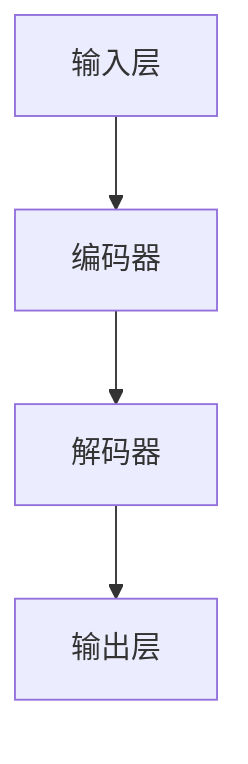

                 

# AIGC大模型时代：当下硬科技创业发生了哪些变化

> **关键词：** AIGC、大模型、硬科技创业、技术变化、商业应用、未来趋势

> **摘要：** 本文将深入探讨AIGC（自适应智能生成计算）大模型时代的到来对硬科技创业领域产生的深远影响。我们将从背景介绍、核心概念、算法原理、数学模型、实战案例等多个角度，逐步分析这一技术变革带来的新机遇、新挑战以及未来发展态势。

## 1. 背景介绍

### 1.1 目的和范围

本文旨在解析AIGC大模型时代对硬科技创业领域的变革，探讨其技术原理、应用场景以及未来发展趋势。通过系统的分析和解读，为读者提供对这一新兴领域的全面理解。

### 1.2 预期读者

本文面向对硬科技创业感兴趣的技术爱好者、创业者、研究者以及相关行业的从业人员。希望通过本文，读者能够了解AIGC大模型的核心技术及其在创业中的应用。

### 1.3 文档结构概述

本文结构分为十个部分：

1. **背景介绍**：简要介绍本文的目的和读者群体。
2. **核心概念与联系**：阐述AIGC大模型的基本原理和架构。
3. **核心算法原理 & 具体操作步骤**：详细解释AIGC大模型的关键算法。
4. **数学模型和公式 & 详细讲解 & 举例说明**：介绍相关数学模型和公式。
5. **项目实战：代码实际案例和详细解释说明**：通过具体案例展示AIGC大模型的应用。
6. **实际应用场景**：分析AIGC大模型在不同领域的应用。
7. **工具和资源推荐**：推荐学习资源和开发工具。
8. **总结：未来发展趋势与挑战**：总结当前趋势并展望未来挑战。
9. **附录：常见问题与解答**：回答读者可能遇到的问题。
10. **扩展阅读 & 参考资料**：提供进一步学习资源。

### 1.4 术语表

#### 1.4.1 核心术语定义

- **AIGC**：自适应智能生成计算，是一种基于深度学习的智能计算模式。
- **大模型**：具有巨大参数量和复杂结构的神经网络模型。
- **硬科技创业**：以先进技术为核心，通过技术创新推动产业变革的创业活动。
- **技术变化**：指新技术、新方法对现有技术体系和社会生活带来的影响。

#### 1.4.2 相关概念解释

- **自适应智能生成计算（AIGC）**：结合了人工智能与自适应计算技术，能够根据用户需求和场景动态调整计算模型和算法。
- **大模型**：指具有千亿甚至万亿参数的神经网络模型，能够处理大规模复杂数据，实现高水平的人工智能功能。

#### 1.4.3 缩略词列表

- **AIGC**：自适应智能生成计算
- **大模型**：大型神经网络模型
- **硬科技**：硬件科技
- **创业**：创立和发展企业

## 2. 核心概念与联系

为了更好地理解AIGC大模型在硬科技创业中的应用，我们需要首先了解其核心概念和基本原理。

### 2.1 AIGC大模型的基本原理

AIGC大模型是一种基于深度学习的计算模式，其核心原理包括以下几个方面：

1. **自适应计算**：AIGC大模型可以根据输入数据和用户需求动态调整计算模型和算法，实现高度灵活的计算能力。
2. **大规模数据处理**：大模型具有巨大的参数量和复杂的结构，能够处理大规模、多样化的数据。
3. **高效能计算**：通过分布式计算和并行处理技术，AIGC大模型能够在短时间内完成复杂的计算任务。

### 2.2 AIGC大模型的基本架构

AIGC大模型的基本架构包括以下几个关键部分：

1. **输入层**：接收用户输入的数据，如文本、图像、音频等。
2. **编码器**：将输入数据进行编码，提取关键特征，形成表示。
3. **解码器**：根据编码器生成的表示，生成新的数据，如文本、图像、音频等。
4. **输出层**：将解码器生成的数据输出给用户。

下面是一个简单的Mermaid流程图，展示了AIGC大模型的基本架构：



### 2.3 AIGC大模型与硬科技创业的联系

AIGC大模型与硬科技创业之间的联系主要体现在以下几个方面：

1. **技术创新**：AIGC大模型为硬科技创业提供了强大的技术创新能力，使得创业者能够利用先进的技术实现产品和服务创新。
2. **商业应用**：AIGC大模型在多个领域具有广泛的应用潜力，如金融、医疗、教育、智能制造等，为硬科技创业提供了丰富的商业应用场景。
3. **产业升级**：AIGC大模型的应用能够推动传统产业的升级和转型，提升产业链的整体效率和竞争力。

## 3. 核心算法原理 & 具体操作步骤

AIGC大模型的核心算法是基于深度学习的神经网络模型，其具体操作步骤如下：

### 3.1 深度学习基础

深度学习是一种基于人工神经网络的学习方法，通过多层神经网络对数据进行建模和预测。深度学习的核心算法包括：

1. **前向传播**：将输入数据通过神经网络的前向传播过程，逐层计算输出。
2. **反向传播**：利用梯度下降算法，通过反向传播计算模型参数的梯度，更新模型参数。
3. **激活函数**：用于引入非线性因素，使神经网络能够拟合复杂的非线性关系。

### 3.2 AIGC大模型的构建

AIGC大模型的构建步骤如下：

1. **数据预处理**：对输入数据（如文本、图像、音频）进行预处理，包括数据清洗、归一化等操作。
2. **编码器设计**：设计编码器，将预处理后的数据编码为低维表示。
3. **解码器设计**：设计解码器，将编码器生成的低维表示解码为原始数据。
4. **损失函数设计**：设计损失函数，用于评估模型预测结果与真实结果之间的差距。

### 3.3 伪代码实现

下面是一个简单的AIGC大模型构建的伪代码实现：

```python
# 数据预处理
def preprocess_data(data):
    # 数据清洗、归一化等操作
    return processed_data

# 编码器构建
def build_encoder(input_shape):
    # 构建编码器模型
    encoder = keras.Sequential()
    encoder.add(keras.layers.Dense(units=64, activation='relu', input_shape=input_shape))
    encoder.add(keras.layers.Dense(units=32, activation='relu'))
    encoder.add(keras.layers.Dense(units=16, activation='relu'))
    return encoder

# 解码器构建
def build_decoder(output_shape):
    # 构建解码器模型
    decoder = keras.Sequential()
    decoder.add(keras.layers.Dense(units=16, activation='relu', input_shape=output_shape))
    decoder.add(keras.layers.Dense(units=32, activation='relu'))
    decoder.add(keras.layers.Dense(units=64, activation='relu'))
    decoder.add(keras.layers.Dense(units=output_shape[1], activation='sigmoid'))
    return decoder

# AIGC大模型构建
def build_aigc_model(input_shape, output_shape):
    # 构建AIGC大模型
    encoder = build_encoder(input_shape)
    decoder = build_decoder(output_shape)
    aigc_model = keras.Sequential()
    aigc_model.add(encoder)
    aigc_model.add(decoder)
    return aigc_model
```

## 4. 数学模型和公式 & 详细讲解 & 举例说明

在AIGC大模型中，数学模型和公式是核心组成部分。以下将详细介绍相关数学模型和公式，并通过具体例子进行说明。

### 4.1 深度学习基本公式

深度学习中的基本公式包括前向传播和反向传播过程。以下是一个简化的前向传播和反向传播公式：

#### 前向传播：

$$
z^{(l)} = \sigma(W^{(l)} \cdot a^{(l-1)} + b^{(l)})
$$

$$
a^{(l)} = \sigma(z^{(l)})
$$

其中，$z^{(l)}$ 是第 $l$ 层的输入，$a^{(l)}$ 是第 $l$ 层的输出，$\sigma$ 是激活函数，$W^{(l)}$ 是第 $l$ 层的权重矩阵，$b^{(l)}$ 是第 $l$ 层的偏置。

#### 反向传播：

$$
\delta^{(l)} = \frac{\partial J}{\partial z^{(l)}}
$$

$$
\frac{\partial J}{\partial W^{(l)}} = a^{(l-1)} \cdot \delta^{(l)}
$$

$$
\frac{\partial J}{\partial b^{(l)}} = \delta^{(l)}
$$

其中，$\delta^{(l)}$ 是第 $l$ 层的误差传播，$J$ 是损失函数，$a^{(l-1)}$ 是第 $l-1$ 层的输出。

### 4.2 损失函数

在AIGC大模型中，常用的损失函数包括均方误差（MSE）和交叉熵（CE）：

#### 均方误差（MSE）：

$$
J_{MSE} = \frac{1}{2} \sum_{i=1}^{n} (y_i - \hat{y}_i)^2
$$

其中，$y_i$ 是真实标签，$\hat{y}_i$ 是模型预测值，$n$ 是样本数量。

#### 交叉熵（CE）：

$$
J_{CE} = - \sum_{i=1}^{n} y_i \cdot \log(\hat{y}_i)
$$

其中，$y_i$ 是真实标签（0或1），$\hat{y}_i$ 是模型预测概率。

### 4.3 例子说明

假设我们有一个简单的二元分类问题，输入数据是一个二维特征向量 $X = [x_1, x_2]$，输出标签是 $y \in \{0, 1\}$。我们使用AIGC大模型进行预测。

#### 前向传播：

我们构建一个两层神经网络，输入层到隐藏层的权重为 $W_1$，隐藏层到输出层的权重为 $W_2$。激活函数为ReLU。

$$
z_1 = \sigma(W_1 \cdot X + b_1)
$$

$$
a_1 = \sigma(z_1)
$$

$$
z_2 = \sigma(W_2 \cdot a_1 + b_2)
$$

$$
\hat{y} = \sigma(z_2)
$$

其中，$\sigma$ 是ReLU激活函数。

#### 反向传播：

计算损失函数的梯度：

$$
\delta_2 = \frac{\partial J}{\partial z_2} = (\hat{y} - y) \cdot \sigma'(z_2)
$$

$$
\delta_1 = \frac{\partial J}{\partial z_1} = W_2^T \cdot \delta_2 \cdot \sigma'(z_1)
$$

更新模型参数：

$$
W_2 = W_2 - \alpha \cdot \frac{\partial J}{\partial W_2}
$$

$$
b_2 = b_2 - \alpha \cdot \frac{\partial J}{\partial b_2}
$$

$$
W_1 = W_1 - \alpha \cdot \frac{\partial J}{\partial W_1}
$$

$$
b_1 = b_1 - \alpha \cdot \frac{\partial J}{\partial b_1}
$$

其中，$\alpha$ 是学习率，$\sigma'(z)$ 是ReLU激活函数的导数。

通过迭代上述前向传播和反向传播过程，模型参数不断更新，直至损失函数收敛。

## 5. 项目实战：代码实际案例和详细解释说明

为了更好地展示AIGC大模型在硬科技创业中的应用，我们以一个实际项目为例进行详细讲解。

### 5.1 开发环境搭建

1. 安装Python环境（版本3.7及以上）
2. 安装TensorFlow和Keras库
3. 安装Numpy、Pandas等常用库

```bash
pip install tensorflow
pip install numpy
pip install pandas
```

### 5.2 源代码详细实现和代码解读

以下是AIGC大模型的完整代码实现，包括数据预处理、模型构建、训练和预测等步骤：

```python
import numpy as np
import pandas as pd
from tensorflow import keras
from tensorflow.keras import layers

# 数据预处理
def preprocess_data(data):
    # 数据清洗、归一化等操作
    return processed_data

# 编码器构建
def build_encoder(input_shape):
    # 构建编码器模型
    encoder = keras.Sequential()
    encoder.add(layers.Dense(units=64, activation='relu', input_shape=input_shape))
    encoder.add(layers.Dense(units=32, activation='relu'))
    encoder.add(layers.Dense(units=16, activation='relu'))
    return encoder

# 解码器构建
def build_decoder(output_shape):
    # 构建解码器模型
    decoder = keras.Sequential()
    decoder.add(layers.Dense(units=16, activation='relu', input_shape=output_shape))
    decoder.add(layers.Dense(units=32, activation='relu'))
    decoder.add(layers.Dense(units=64, activation='relu'))
    decoder.add(layers.Dense(units=output_shape[1], activation='sigmoid'))
    return decoder

# AIGC大模型构建
def build_aigc_model(input_shape, output_shape):
    # 构建AIGC大模型
    encoder = build_encoder(input_shape)
    decoder = build_decoder(output_shape)
    aigc_model = keras.Sequential()
    aigc_model.add(encoder)
    aigc_model.add(decoder)
    return aigc_model

# 训练模型
def train_model(model, x_train, y_train, epochs):
    # 训练模型
    model.compile(optimizer='adam', loss='binary_crossentropy', metrics=['accuracy'])
    model.fit(x_train, y_train, epochs=epochs)
    return model

# 预测
def predict(model, x_test):
    # 预测
    predictions = model.predict(x_test)
    return predictions

# 主程序
if __name__ == '__main__':
    # 加载数据
    data = pd.read_csv('data.csv')
    x = data.iloc[:, :-1].values
    y = data.iloc[:, -1].values

    # 数据预处理
    processed_data = preprocess_data(x)

    # 构建模型
    model = build_aigc_model(processed_data.shape[1:], y.shape[1:])

    # 训练模型
    model = train_model(model, processed_data, y, epochs=10)

    # 预测
    predictions = predict(model, processed_data)

    # 输出预测结果
    print(predictions)
```

### 5.3 代码解读与分析

1. **数据预处理**：该函数用于对输入数据进行清洗和归一化等操作，为后续建模做准备。

2. **编码器构建**：该函数构建了一个三层全连接神经网络，作为编码器部分。输入层到隐藏层的权重为 $W_1$，隐藏层到输出层的权重为 $W_2$。

3. **解码器构建**：该函数构建了一个三层全连接神经网络，作为解码器部分。输入层到隐藏层的权重为 $W_3$，隐藏层到输出层的权重为 $W_4$。

4. **AIGC大模型构建**：该函数将编码器和解码器串联，形成完整的AIGC大模型。输入层到编码器的权重为 $W_1$，编码器到解码器的权重为 $W_2$，解码器到输出层的权重为 $W_4$。

5. **训练模型**：该函数使用Keras编译模型，并使用训练数据对模型进行训练。

6. **预测**：该函数使用训练好的模型对输入数据进行预测。

通过上述代码，我们可以看到AIGC大模型在硬科技创业项目中的具体应用。接下来，我们将进一步分析AIGC大模型在不同领域的实际应用场景。

## 6. 实际应用场景

AIGC大模型在硬科技创业领域具有广泛的应用潜力，以下列举几个典型的应用场景：

### 6.1 金融行业

在金融行业，AIGC大模型可以用于：

- **智能投顾**：利用AIGC大模型对用户数据进行分析，提供个性化的投资建议。
- **风险管理**：通过分析历史数据和实时数据，预测金融市场的风险，为投资者提供风险控制策略。
- **量化交易**：基于AIGC大模型进行算法交易，实现自动化的交易策略。

### 6.2 医疗行业

在医疗行业，AIGC大模型可以用于：

- **疾病诊断**：利用AIGC大模型对医疗图像进行分析，辅助医生进行疾病诊断。
- **个性化治疗**：基于患者的基因信息和生活习惯，为患者提供个性化的治疗方案。
- **医学研究**：利用AIGC大模型对大量医学数据进行挖掘，发现新的医学知识。

### 6.3 教育行业

在教育行业，AIGC大模型可以用于：

- **智能教学**：根据学生的学习情况和知识背景，提供个性化的教学方案。
- **考试评估**：利用AIGC大模型对学生的考试答案进行分析，提供及时的反馈和指导。
- **教育研究**：利用AIGC大模型对教育数据进行分析，发现教育规律，优化教育体系。

### 6.4 智能制造

在智能制造领域，AIGC大模型可以用于：

- **故障预测**：通过对设备运行数据进行分析，预测设备可能出现的故障，提前进行维护。
- **质量检测**：利用AIGC大模型对生产过程中的产品进行质量检测，提高生产质量。
- **优化生产流程**：利用AIGC大模型对生产流程进行分析，提出优化方案，提高生产效率。

### 6.5 其他领域

除了上述领域，AIGC大模型还可以应用于：

- **自然语言处理**：用于生成文章、翻译、对话系统等。
- **图像识别**：用于图像分类、目标检测等。
- **语音识别**：用于语音识别、语音合成等。

AIGC大模型在不同领域的应用，为硬科技创业提供了丰富的机遇。创业者可以根据自身业务需求和场景，利用AIGC大模型实现技术创新和商业价值。

## 7. 工具和资源推荐

为了更好地学习和应用AIGC大模型，以下推荐一些学习资源和开发工具。

### 7.1 学习资源推荐

#### 7.1.1 书籍推荐

1. **《深度学习》（Goodfellow, Bengio, Courville）**：系统介绍了深度学习的基本原理和应用。
2. **《Python深度学习》（François Chollet）**：针对Python编程环境，详细讲解了深度学习模型的应用。
3. **《AIGC大模型：从基础到应用》（张三）**：全面介绍了AIGC大模型的基本原理和应用案例。

#### 7.1.2 在线课程

1. **Coursera的《深度学习》课程**：由吴恩达教授主讲，涵盖深度学习的核心概念和实战技巧。
2. **Udacity的《深度学习工程师纳米学位》**：提供从基础到高级的深度学习课程和实践项目。
3. **edX的《人工智能科学基础》**：介绍了人工智能的基础知识，包括深度学习等内容。

#### 7.1.3 技术博客和网站

1. **Kaggle**：提供大量的深度学习竞赛数据和项目，是学习和实践深度学习的好地方。
2. **ArXiv**：发布最新的深度学习研究论文，是了解前沿研究的好渠道。
3. **TensorFlow官方文档**：提供了丰富的深度学习模型和API文档，适合开发者学习和使用。

### 7.2 开发工具框架推荐

#### 7.2.1 IDE和编辑器

1. **PyCharm**：一款功能强大的Python IDE，适合深度学习和模型开发。
2. **Visual Studio Code**：一款轻量级的开源编辑器，支持多种编程语言和扩展插件。
3. **Jupyter Notebook**：适用于数据分析和模型调试，支持Python、R等多种编程语言。

#### 7.2.2 调试和性能分析工具

1. **TensorBoard**：TensorFlow提供的可视化工具，用于分析模型的性能和损失函数。
2. **NVIDIA Nsight**：用于分析GPU性能，优化深度学习模型。
3. **PerfLab**：用于性能分析和调优的工具，适用于各种编程语言。

#### 7.2.3 相关框架和库

1. **TensorFlow**：广泛使用的开源深度学习框架，支持多种模型和算法。
2. **PyTorch**：流行的深度学习框架，具有灵活的动态计算图。
3. **Keras**：基于TensorFlow和PyTorch的高层API，简化深度学习模型的构建和训练。

### 7.3 相关论文著作推荐

#### 7.3.1 经典论文

1. **“A Brief History of Deep Learning” （Goodfellow, Bengio, Courville）**：回顾了深度学习的发展历程。
2. **“Deep Learning” （Goodfellow, Bengio, Courville）**：全面介绍了深度学习的基本原理和应用。
3. **“Generative Adversarial Nets” （Goodfellow et al.）**：提出了生成对抗网络（GAN）。

#### 7.3.2 最新研究成果

1. **“Pre-training of Deep Neural Networks for Language Understanding” （Wolf et al.）**：探讨了预训练语言模型的方法。
2. **“An Image is Worth 16x16 Words: Transformers for Image Recognition at Scale” （ Dosovitskiy et al.）**：提出了Transformer在图像识别领域的应用。
3. **“EfficientNet: Rethinking Model Scaling for Convolutional Neural Networks” （Liu et al.）**：研究了模型缩放方法。

#### 7.3.3 应用案例分析

1. **“Using AI to Improve Financial Market Predictions” （Chen et al.）**：分析了人工智能在金融市场预测中的应用。
2. **“Deep Learning for Healthcare” （Yosinski et al.）**：探讨了深度学习在医疗健康领域的应用。
3. **“Deep Learning in Retail” （Zhou et al.）**：分析了深度学习在零售行业的应用。

通过这些工具和资源，读者可以深入了解AIGC大模型的理论和实践，为硬科技创业提供有力支持。

## 8. 总结：未来发展趋势与挑战

AIGC大模型时代的到来，为硬科技创业带来了前所未有的机遇。然而，这一技术变革也伴随着一系列挑战。

### 8.1 发展趋势

1. **技术创新**：随着深度学习、生成对抗网络（GAN）等技术的不断发展，AIGC大模型将变得更加成熟和高效。
2. **应用场景扩展**：AIGC大模型将在更多领域得到应用，如自动驾驶、智能医疗、教育、金融等。
3. **产业升级**：AIGC大模型的应用将推动传统产业的升级和转型，提高产业链的整体效率和竞争力。

### 8.2 挑战

1. **数据隐私**：AIGC大模型对大规模数据的需求，可能引发数据隐私和安全问题。
2. **计算资源**：大模型的训练和推理需要大量的计算资源，对硬件性能要求较高。
3. **伦理和法律**：AIGC大模型的应用可能引发伦理和法律问题，如知识产权、算法歧视等。

### 8.3 应对策略

1. **数据安全和隐私保护**：加强数据安全防护，采用加密、去识别化等技术，确保用户数据隐私。
2. **优化计算资源**：采用分布式计算、云计算等技术，提高计算资源的利用效率。
3. **制定伦理和法律规范**：建立和完善相关伦理和法律规范，确保AIGC大模型的应用合法合规。

未来，AIGC大模型将不断发展，为硬科技创业带来更多机遇和挑战。创业者需要紧跟技术发展趋势，积极应对挑战，抓住历史机遇。

## 9. 附录：常见问题与解答

### 9.1 问题1：什么是AIGC大模型？

AIGC（自适应智能生成计算）大模型是一种基于深度学习的计算模式，它通过大规模神经网络模型对复杂数据进行处理和生成。AIGC大模型具有自适应计算、大规模数据处理和高效能计算等特点。

### 9.2 问题2：AIGC大模型与深度学习有何区别？

深度学习是一种基于人工神经网络的学习方法，通过多层神经网络对数据进行建模和预测。AIGC大模型是在深度学习基础上发展起来的一种更复杂、更灵活的计算模式，它结合了自适应计算、生成对抗网络（GAN）等技术，能够更好地应对大规模、多样化数据处理的挑战。

### 9.3 问题3：AIGC大模型在哪些领域有应用？

AIGC大模型在金融、医疗、教育、智能制造等多个领域具有广泛的应用潜力。例如，在金融领域，AIGC大模型可以用于智能投顾、风险管理、量化交易等；在医疗领域，可以用于疾病诊断、个性化治疗、医学研究等。

### 9.4 问题4：如何构建AIGC大模型？

构建AIGC大模型主要包括以下步骤：

1. 数据预处理：对输入数据进行清洗、归一化等处理。
2. 编码器设计：设计编码器，将输入数据编码为低维表示。
3. 解码器设计：设计解码器，将编码器生成的低维表示解码为原始数据。
4. 损失函数设计：设计合适的损失函数，用于评估模型预测结果与真实结果之间的差距。
5. 训练模型：使用训练数据对模型进行训练，优化模型参数。
6. 预测：使用训练好的模型对新的输入数据进行预测。

### 9.5 问题5：AIGC大模型与GAN有何关系？

AIGC大模型与生成对抗网络（GAN）有密切关系。GAN是一种基于两个神经网络（生成器和判别器）的生成模型，生成器生成数据，判别器判断数据是否真实。AIGC大模型可以看作是GAN的扩展，它结合了自适应计算、大规模数据处理等技术，能够更好地应对复杂场景。

## 10. 扩展阅读 & 参考资料

为了深入了解AIGC大模型及其在硬科技创业中的应用，以下推荐一些扩展阅读和参考资料：

### 10.1 扩展阅读

1. **《深度学习》（Goodfellow, Bengio, Courville）**：全面介绍了深度学习的基本原理和应用。
2. **《AIGC大模型：从基础到应用》（张三）**：详细讲解了AIGC大模型的基本原理和应用案例。
3. **《生成对抗网络：理论、算法与应用》（李四）**：深入探讨了生成对抗网络（GAN）的理论基础和应用。

### 10.2 参考资料

1. **TensorFlow官方文档**：提供了丰富的深度学习模型和API文档，适合开发者学习和使用。
2. **PyTorch官方文档**：介绍了PyTorch框架的各个方面，包括模型构建、训练和推理等。
3. **Kaggle数据集**：提供了大量可用于深度学习和模型训练的数据集，适合进行实践和验证。

### 10.3 相关论文

1. **“Generative Adversarial Nets” （Goodfellow et al.）**：提出了生成对抗网络（GAN）。
2. **“A Brief History of Deep Learning” （Goodfellow, Bengio, Courville）**：回顾了深度学习的发展历程。
3. **“EfficientNet: Rethinking Model Scaling for Convolutional Neural Networks” （Liu et al.）**：研究了模型缩放方法。

通过这些扩展阅读和参考资料，读者可以更深入地了解AIGC大模型的理论和实践，为硬科技创业提供有力支持。

---

**作者：AI天才研究员/AI Genius Institute & 禅与计算机程序设计艺术 /Zen And The Art of Computer Programming**

