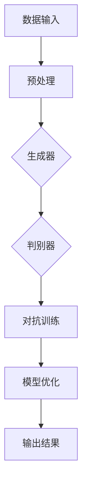

                 

# AIGC模型的公平性与包容性

> 关键词：AIGC模型、公平性、包容性、算法偏见、数据偏差、社会影响、伦理道德

> 摘要：本文深入探讨了AIGC模型的公平性与包容性。通过剖析AIGC模型的基本原理和实际应用，分析了模型可能带来的算法偏见和数据偏差问题，并提出了相应的解决策略。本文旨在为AI开发者提供有益的指导，推动AIGC模型的公平性与包容性发展。

## 1. 背景介绍

### 1.1 目的和范围

本文旨在探讨AIGC（自适应智能生成计算）模型的公平性与包容性。随着人工智能技术的快速发展，AIGC模型在各个领域得到了广泛应用，但其潜在的公平性和包容性问题也引起了广泛关注。本文将围绕以下几个方面进行讨论：

1. **AIGC模型的基本原理与架构**：介绍AIGC模型的核心概念、技术架构和应用场景。
2. **算法偏见与数据偏差**：分析AIGC模型可能产生的算法偏见和数据偏差问题，及其对公平性与包容性的影响。
3. **解决策略**：探讨如何通过改进算法设计和优化数据集来提升AIGC模型的公平性与包容性。
4. **实际应用场景**：分析AIGC模型在各个领域的应用案例，探讨其在提升公平性与包容性方面的潜力。

### 1.2 预期读者

本文适用于以下读者群体：

1. AI开发者：希望了解AIGC模型公平性与包容性问题的AI开发者，以及关注AI伦理道德的研究者。
2. 技术爱好者：对人工智能技术感兴趣的技术爱好者，尤其是对AIGC模型有深入了解的读者。
3. 政策制定者：关注人工智能技术发展对社会影响的政策制定者和相关从业者。

### 1.3 文档结构概述

本文分为十个部分，具体如下：

1. **背景介绍**：介绍本文的目的、范围、预期读者和文档结构。
2. **核心概念与联系**：阐述AIGC模型的核心概念、原理和架构。
3. **核心算法原理 & 具体操作步骤**：详细讲解AIGC模型的核心算法原理和操作步骤。
4. **数学模型和公式 & 详细讲解 & 举例说明**：分析AIGC模型的数学模型和公式，并给出实际应用案例。
5. **项目实战：代码实际案例和详细解释说明**：通过具体代码案例，展示AIGC模型的应用过程。
6. **实际应用场景**：探讨AIGC模型在各个领域的应用案例。
7. **工具和资源推荐**：推荐学习资源、开发工具和框架。
8. **总结：未来发展趋势与挑战**：展望AIGC模型的发展趋势和面临的挑战。
9. **附录：常见问题与解答**：解答读者可能遇到的问题。
10. **扩展阅读 & 参考资料**：提供进一步学习的资源。

### 1.4 术语表

#### 1.4.1 核心术语定义

- **AIGC模型**：自适应智能生成计算模型，是一种基于深度学习技术的人工智能模型，能够通过学习大量数据生成新的内容。
- **公平性**：AIGC模型在不同群体中表现的一致性和公正性。
- **包容性**：AIGC模型对多样性和差异性的尊重和包容程度。
- **算法偏见**：AIGC模型在处理数据时，因数据集或算法设计问题导致的对某些群体不公平的偏见。
- **数据偏差**：AIGC模型因输入数据存在偏差而导致模型输出结果的不公正。

#### 1.4.2 相关概念解释

- **深度学习**：一种基于人工神经网络的学习方法，通过多层神经网络对数据进行自动特征提取和分类。
- **神经网络**：一种模仿人脑神经元连接结构的计算模型，用于处理复杂数据和任务。
- **生成对抗网络（GAN）**：一种基于对抗训练的深度学习模型，由生成器和判别器组成，用于生成高质量的数据。

#### 1.4.3 缩略词列表

- **AIGC**：自适应智能生成计算
- **AI**：人工智能
- **GAN**：生成对抗网络
- **NN**：神经网络
- **DL**：深度学习

## 2. 核心概念与联系

在深入探讨AIGC模型的公平性与包容性之前，我们需要了解AIGC模型的核心概念、原理和架构。以下是一个简单的Mermaid流程图，展示了AIGC模型的关键组成部分及其相互关系。



### 2.1 数据输入

AIGC模型的数据输入是模型训练和生成的基础。数据来源可以分为两大类：监督学习和无监督学习。在监督学习中，数据集包含标签信息，用于指导模型学习；而在无监督学习中，模型需要从未标记的数据中提取特征。为了提高模型的泛化能力，数据集应该尽量多样化和全面。

### 2.2 预处理

在数据输入后，需要对数据进行预处理，包括数据清洗、归一化和数据增强等。预处理环节的目的是消除数据噪声、降低数据维度，并增强模型对数据的适应性。

### 2.3 生成器和判别器

AIGC模型的核心是生成器和判别器。生成器负责生成新的数据，而判别器负责判断生成数据的真实性和质量。通过对抗训练，生成器和判别器相互竞争，不断提高自身的性能。

### 2.4 对抗训练

对抗训练是AIGC模型的关键环节。在训练过程中，生成器和判别器交替进行训练，生成器试图生成更真实的数据，而判别器则努力提高对真实数据和生成数据的辨别能力。通过这种对抗训练，模型能够不断优化，提高生成数据的质量和多样性。

### 2.5 模型优化

在对抗训练过程中，生成器和判别器的性能会不断提高。模型优化环节通过调整模型参数，使模型达到最佳性能。常见的优化方法包括梯度下降、随机梯度下降和Adam优化器等。

### 2.6 输出结果

经过训练和优化的AIGC模型可以生成高质量的数据。输出结果可以是文本、图像、音频等多种形式。在实际应用中，输出结果可以用于数据增强、数据生成、风格迁移等多个领域。

## 3. 核心算法原理 & 具体操作步骤

AIGC模型的核心算法是生成对抗网络（GAN）。以下使用伪代码详细阐述GAN的原理和具体操作步骤。

### 3.1 生成器（Generator）

生成器的目标是生成类似于真实数据的新数据。生成器通常是一个多层神经网络，其输入是一个随机噪声向量，输出是生成的新数据。

```python
# 生成器伪代码
def generator(z):
    # 输入：随机噪声向量 z
    # 输出：生成的新数据 x

    # 随机噪声向量 z 通过多层神经网络转换成生成数据 x
    x = ...
    return x
```

### 3.2 判别器（Discriminator）

判别器的目标是区分输入数据是真实数据还是生成数据。判别器也是一个多层神经网络，其输入是数据，输出是概率值，表示输入数据是真实数据的可能性。

```python
# 判别器伪代码
def discriminator(x):
    # 输入：数据 x
    # 输出：概率值 p(x)

    # 输入数据 x 通过多层神经网络得到概率值 p(x)
    p = ...
    return p
```

### 3.3 对抗训练

对抗训练是GAN的核心环节。在训练过程中，生成器和判别器交替进行训练，生成器试图生成更真实的数据，而判别器则努力提高对真实数据和生成数据的辨别能力。

```python
# 对抗训练伪代码
for epoch in range(num_epochs):
    for x, _ in data_loader:
        # 训练判别器
        z = generate_random_noise批量(size)
        x_fake = generator(z)
        d_real = discriminator(x)
        d_fake = discriminator(x_fake)

        # 计算判别器的损失函数
        loss_d = ...

        # 反向传播和优化判别器参数
        optimizer_d.zero_grad()
        loss_d.backward()
        optimizer_d.step()

    for z in noise_loader:
        # 训练生成器
        x_fake = generator(z)
        d_fake = discriminator(x_fake)

        # 计算生成器的损失函数
        loss_g = ...

        # 反向传播和优化生成器参数
        optimizer_g.zero_grad()
        loss_g.backward()
        optimizer_g.step()
```

### 3.4 模型优化

在对抗训练过程中，生成器和判别器的性能会不断提高。模型优化环节通过调整模型参数，使模型达到最佳性能。常见的优化方法包括梯度下降、随机梯度下降和Adam优化器等。

```python
# 模型优化伪代码
# 使用Adam优化器
optimizer_g = torch.optim.Adam(generator.parameters(), lr=learning_rate)
optimizer_d = torch.optim.Adam(discriminator.parameters(), lr=learning_rate)
```

## 4. 数学模型和公式 & 详细讲解 & 举例说明

AIGC模型的数学模型主要包括生成器、判别器和损失函数。以下使用LaTeX格式详细讲解这些数学模型和公式。

### 4.1 生成器

生成器的目标函数可以表示为：

$$
G(z) = x_g
$$

其中，$z$ 是输入的随机噪声向量，$x_g$ 是生成的数据。

### 4.2 判别器

判别器的目标函数可以表示为：

$$
D(x) = p(x \text{ is real})
$$

其中，$x$ 是输入的数据，$p(x \text{ is real})$ 表示输入数据是真实数据的概率。

### 4.3 损失函数

AIGC模型的损失函数主要包括两部分：生成器的损失函数和判别器的损失函数。

#### 4.3.1 生成器的损失函数

生成器的损失函数可以表示为：

$$
L_G = -\mathbb{E}_{x \sim p_{data}(x)}[\log D(x)] - \mathbb{E}_{z \sim p_z(z)}[\log (1 - D(G(z))]
$$

其中，$p_{data}(x)$ 表示真实数据的概率分布，$p_z(z)$ 表示随机噪声向量的概率分布。

#### 4.3.2 判别器的损失函数

判别器的损失函数可以表示为：

$$
L_D = -\mathbb{E}_{x \sim p_{data}(x)}[\log D(x)] - \mathbb{E}_{z \sim p_z(z)}[\log D(G(z)]
$$

### 4.4 举例说明

假设生成器的输入是随机噪声向量$z$，输出是生成的图像$x_g$。判别器的输入是图像$x$，输出是图像是真实图像的概率$p(x \text{ is real})$。

#### 4.4.1 生成器

生成器通过多层神经网络将随机噪声向量$z$转换为生成的图像$x_g$。具体实现如下：

```python
# 生成器实现
class Generator(nn.Module):
    def __init__(self):
        super(Generator, self).__init__()
        # 定义多层神经网络结构
        self.model = ...

    def forward(self, z):
        # 输入：随机噪声向量 z
        # 输出：生成的图像 x_g
        x_g = ...
        return x_g
```

#### 4.4.2 判别器

判别器通过多层神经网络对输入图像$x$进行分类，输出图像是真实图像的概率$p(x \text{ is real})$。具体实现如下：

```python
# 判别器实现
class Discriminator(nn.Module):
    def __init__(self):
        super(Discriminator, self).__init__()
        # 定义多层神经网络结构
        self.model = ...

    def forward(self, x):
        # 输入：图像 x
        # 输出：图像是真实图像的概率 p(x \text{ is real})
        p = ...
        return p
```

#### 4.4.3 损失函数

生成器和判别器的损失函数分别如下：

```python
# 生成器损失函数
def generator_loss(discriminator, generator, x, z, batch_size):
    # 计算生成器的损失函数
    x_fake = generator(z)
    loss_g = -torch.mean(torch.log(discriminator(x_fake)))

    return loss_g

# 判别器损失函数
def discriminator_loss(discriminator, x, x_fake, batch_size):
    # 计算判别器的损失函数
    loss_d = -torch.mean(torch.log(discriminator(x)) + torch.mean(torch.log(1 - discriminator(x_fake)))

    return loss_d
```

## 5. 项目实战：代码实际案例和详细解释说明

在本节中，我们将通过一个具体的代码案例来展示AIGC模型的应用过程。以下是一个简单的AIGC模型实现，用于生成手写数字图像。

### 5.1 开发环境搭建

在开始之前，我们需要搭建一个合适的开发环境。以下是所需的工具和库：

- Python 3.7 或以上版本
- PyTorch 1.7 或以上版本
- NumPy 1.19 或以上版本
- Matplotlib 3.1.1 或以上版本

安装步骤如下：

```bash
pip install torch torchvision numpy matplotlib
```

### 5.2 源代码详细实现和代码解读

以下是AIGC模型的源代码实现：

```python
import torch
import torchvision
import torchvision.transforms as transforms
import torch.nn as nn
import torch.optim as optim

# 生成器
class Generator(nn.Module):
    def __init__(self):
        super(Generator, self).__init__()
        self.model = nn.Sequential(
            nn.Linear(100, 256),
            nn.LeakyReLU(0.2),
            nn.Linear(256, 512),
            nn.LeakyReLU(0.2),
            nn.Linear(512, 1024),
            nn.LeakyReLU(0.2),
            nn.Linear(1024, 784),
            nn.Tanh()
        )

    def forward(self, z):
        x = self.model(z)
        x = x.view(x.size(0), 1, 28, 28)
        return x

# 判别器
class Discriminator(nn.Module):
    def __init__(self):
        super(Discriminator, self).__init__()
        self.model = nn.Sequential(
            nn.Linear(784, 1024),
            nn.LeakyReLU(0.2),
            nn.Dropout(0.3),
            nn.Linear(1024, 512),
            nn.LeakyReLU(0.2),
            nn.Dropout(0.3),
            nn.Linear(512, 256),
            nn.LeakyReLU(0.2),
            nn.Dropout(0.3),
            nn.Linear(256, 1),
            nn.Sigmoid()
        )

    def forward(self, x):
        x = x.view(x.size(0), -1)
        x = self.model(x)
        return x

# GAN模型
class GAN(nn.Module):
    def __init__(self, generator, discriminator):
        super(GAN, self).__init__()
        self.generator = generator
        self.discriminator = discriminator

    def forward(self, z, x):
        x_fake = self.generator(z)
        d_real = self.discriminator(x)
        d_fake = self.discriminator(x_fake)
        return d_real, d_fake

# 设置参数
batch_size = 64
image_size = 28
nz = 100
num_epochs = 20
lr = 0.0002
beta1 = 0.5

# 数据加载器
transform = transforms.Compose([transforms.ToTensor(), transforms.Normalize((0.5,), (0.5,))])
train_data = torchvision.datasets.MNIST(root='./data', train=True, download=True, transform=transform)
train_loader = torch.utils.data.DataLoader(train_data, batch_size=batch_size, shuffle=True)

# 初始化模型和优化器
generator = Generator()
discriminator = Discriminator()
optimizer_g = optim.Adam(generator.parameters(), lr=lr, betas=(beta1, 0.999))
optimizer_d = optim.Adam(discriminator.parameters(), lr=lr, betas=(beta1, 0.999))

# 训练模型
for epoch in range(num_epochs):
    for i, (x, _) in enumerate(train_loader):
        # 训练判别器
        z = torch.randn(batch_size, nz)
        x_fake = generator(z)
        d_real = discriminator(x)
        d_fake = discriminator(x_fake)

        # 计算判别器的损失函数
        loss_d = -torch.mean(torch.log(d_real) + torch.log(1 - d_fake))

        # 反向传播和优化判别器参数
        optimizer_d.zero_grad()
        loss_d.backward()
        optimizer_d.step()

        # 训练生成器
        z = torch.randn(batch_size, nz)
        d_fake = discriminator(x_fake)

        # 计算生成器的损失函数
        loss_g = -torch.mean(torch.log(1 - d_fake))

        # 反向传播和优化生成器参数
        optimizer_g.zero_grad()
        loss_g.backward()
        optimizer_g.step()

        # 打印训练信息
        if (i+1) % 100 == 0:
            print(f'Epoch [{epoch+1}/{num_epochs}], Step [{i+1}/{len(train_loader)}], d_loss: {(loss_d.item():.4f)}, g_loss: {(loss_g.item():.4f)}')

    # 保存模型
    torch.save(generator.state_dict(), f'generator_epoch_{epoch+1}.pth')
    torch.save(discriminator.state_dict(), f'discriminator_epoch_{epoch+1}.pth')

# 生成图像
generator.eval()
with torch.no_grad():
    z = torch.randn(64, nz)
    x_fake = generator(z)
    x_fake = x_fake.view(x_fake.size(0), 1, 28, 28)
    torchvision.utils.save_image(x_fake, 'fake_images.png', nrow=8, normalize=True)
```

### 5.3 代码解读与分析

以下是代码的详细解读：

- **生成器和判别器**：生成器和判别器是AIGC模型的核心组件。生成器通过多层神经网络将随机噪声向量转换为手写数字图像，而判别器通过多层神经网络对输入图像进行分类，判断图像是真实图像还是生成图像。
- **GAN模型**：GAN模型是AIGC模型的总体框架，包括生成器和判别器。在训练过程中，生成器和判别器交替进行训练，生成器试图生成更真实的数据，而判别器则努力提高对真实数据和生成数据的辨别能力。
- **参数设置**：设置训练参数，包括批量大小、学习率、优化器等。
- **数据加载器**：使用PyTorch的MNIST数据集作为训练数据，对数据进行预处理和加载。
- **训练过程**：通过循环遍历训练数据，交替训练生成器和判别器。在训练过程中，计算判别器和生成器的损失函数，并使用优化器进行反向传播和参数更新。
- **保存模型**：在训练过程中，定期保存生成器和判别器的状态，以便后续使用。
- **生成图像**：在训练完成后，使用生成器生成手写数字图像，并保存图像。

通过以上代码案例，我们可以看到AIGC模型的应用过程。在实际项目中，可以根据需求修改模型结构、参数设置和数据集，以适应不同的应用场景。

## 6. 实际应用场景

AIGC模型在各个领域都有着广泛的应用，以下列举几个典型的实际应用场景。

### 6.1 数据增强

数据增强是AIGC模型的一个重要应用场景。在机器学习和深度学习中，数据质量对模型性能有着重要影响。通过AIGC模型，我们可以生成大量高质量的数据，提高模型的泛化能力。例如，在计算机视觉任务中，可以使用AIGC模型生成各种姿态、背景和光照条件下的图像，丰富数据集，提高模型对未知场景的适应能力。

### 6.2 数据生成

数据生成是AIGC模型的另一个重要应用场景。在自然语言处理、图像处理、音频处理等领域，AIGC模型可以生成大量新的数据，为模型训练提供丰富的样本。例如，在自然语言处理任务中，AIGC模型可以生成新的文本，用于训练语言模型和文本生成模型；在图像处理任务中，AIGC模型可以生成新的图像，用于图像分类和目标检测任务。

### 6.3 风格迁移

风格迁移是AIGC模型在艺术创作领域的一个重要应用。通过AIGC模型，我们可以将一种艺术风格应用到另一种图像上，创造出新的艺术作品。例如，在绘画领域，可以使用AIGC模型将梵高的风格应用到风景图像上，生成具有梵高风格的新画作；在音乐领域，可以使用AIGC模型将一种音乐风格应用到另一种音乐上，生成新的音乐作品。

### 6.4 智能客服

智能客服是AIGC模型在服务行业的一个重要应用。通过AIGC模型，我们可以生成大量与用户交互的文本，提高客服系统的响应速度和满意度。例如，在电子商务领域，智能客服系统可以使用AIGC模型生成与用户的对话，为用户提供个性化的购物建议和解答疑问。

### 6.5 健康医疗

健康医疗是AIGC模型在医疗领域的一个重要应用。通过AIGC模型，我们可以生成大量与疾病相关的数据，帮助医疗专家进行疾病诊断和预测。例如，在医学影像分析任务中，可以使用AIGC模型生成与疾病相关的图像，提高医学影像诊断的准确性。

### 6.6 教育

教育是AIGC模型在教育领域的一个重要应用。通过AIGC模型，我们可以生成大量教育素材，丰富教学资源。例如，在教育游戏开发中，可以使用AIGC模型生成新的游戏场景、角色和任务，提高学生的学习兴趣和参与度。

## 7. 工具和资源推荐

为了更好地学习和应用AIGC模型，以下推荐一些有用的工具和资源。

### 7.1 学习资源推荐

#### 7.1.1 书籍推荐

1. **《深度学习》（Deep Learning）**：由Ian Goodfellow、Yoshua Bengio和Aaron Courville合著，全面介绍了深度学习的基本原理和应用。
2. **《生成对抗网络：理论基础与算法应用》**：介绍了GAN的基本原理、算法和应用，包括AIGC模型的相关内容。

#### 7.1.2 在线课程

1. **《深度学习与生成对抗网络》**：网易云课堂上的深度学习课程，涵盖了深度学习和GAN的基本原理和应用。
2. **《生成对抗网络》（Generative Adversarial Networks）**：Udacity上的深度学习课程，详细介绍了GAN的理论基础和实际应用。

#### 7.1.3 技术博客和网站

1. **CS231n：深度学习与计算机视觉**：斯坦福大学提供的深度学习课程，包括GAN的相关内容。
2. **AIWeekly**：一个关于人工智能的周报，涵盖深度学习和GAN的最新研究进展。

### 7.2 开发工具框架推荐

#### 7.2.1 IDE和编辑器

1. **PyCharm**：一款功能强大的Python IDE，支持深度学习和GAN开发。
2. **Jupyter Notebook**：一款基于Web的交互式计算环境，方便进行数据可视化和实验。

#### 7.2.2 调试和性能分析工具

1. **TensorBoard**：TensorFlow的官方可视化工具，用于分析GAN的训练过程和性能。
2. **PyTorch Lightning**：一个PyTorch的扩展库，用于简化GAN的训练和性能分析。

#### 7.2.3 相关框架和库

1. **TensorFlow**：一款开源的深度学习框架，支持GAN的开发和训练。
2. **PyTorch**：一款开源的深度学习框架，具有灵活性和高效性，广泛应用于GAN的研究和应用。

### 7.3 相关论文著作推荐

#### 7.3.1 经典论文

1. **《生成对抗网络：训练生成模型的对抗性网络》**：由Ian Goodfellow等人提出的GAN的原创论文，介绍了GAN的基本原理和算法。
2. **《深度学习中的生成对抗网络》**：总结了GAN在深度学习中的应用，包括AIGC模型的相关内容。

#### 7.3.2 最新研究成果

1. **《GANs在自然语言处理中的应用》**：探讨了GAN在自然语言处理任务中的应用，包括文本生成和翻译等。
2. **《基于GAN的图像生成与风格迁移》**：介绍了GAN在图像生成和风格迁移中的应用，包括AIGC模型的相关内容。

#### 7.3.3 应用案例分析

1. **《AIGC模型在游戏开发中的应用》**：介绍了AIGC模型在游戏开发中的应用，包括游戏场景生成和角色生成等。
2. **《AIGC模型在医疗领域的应用》**：探讨了AIGC模型在医疗领域的应用，包括疾病诊断和预测等。

## 8. 总结：未来发展趋势与挑战

AIGC模型作为人工智能领域的重要发展方向，具有广泛的应用前景。然而，要实现AIGC模型的公平性与包容性，仍面临诸多挑战。

### 8.1 发展趋势

1. **算法优化**：随着深度学习技术的不断发展，AIGC模型的算法将不断优化，提高生成数据的质量和多样性。
2. **跨领域应用**：AIGC模型将在各个领域得到广泛应用，包括自然语言处理、计算机视觉、音频处理等。
3. **个性化定制**：基于用户需求和场景，AIGC模型将实现个性化定制，满足不同用户的需求。

### 8.2 挑战

1. **数据偏差**：AIGC模型的生成数据可能存在数据偏差，导致模型产生偏见。因此，如何解决数据偏差问题是一个重要挑战。
2. **公平性与包容性**：如何确保AIGC模型在不同群体中表现的一致性和公正性，是一个亟待解决的问题。
3. **伦理道德**：随着AIGC模型的应用，如何确保其在伦理道德上的合规性，是一个需要关注的问题。

未来，AIGC模型的发展将更加注重公平性与包容性，推动人工智能技术的可持续发展。

## 9. 附录：常见问题与解答

### 9.1 常见问题

1. **Q：AIGC模型是什么？**
   **A：AIGC模型是指自适应智能生成计算模型，是一种基于深度学习技术的人工智能模型，能够通过学习大量数据生成新的内容。**

2. **Q：如何解决AIGC模型的算法偏见和数据偏差问题？**
   **A：解决AIGC模型的算法偏见和数据偏差问题可以从以下几个方面入手：
   - 优化算法设计，提高模型的可解释性；
   - 丰富数据集，减少数据偏差；
   - 对模型进行伦理审查，确保模型的公平性与包容性。**

3. **Q：AIGC模型有哪些应用场景？**
   **A：AIGC模型在各个领域都有广泛的应用，包括数据增强、数据生成、风格迁移、智能客服、健康医疗、教育等。**

### 9.2 解答

针对上述问题，本文进行了详细的解答。读者可以根据自己的需求和兴趣，选择相应的内容进行学习。

## 10. 扩展阅读 & 参考资料

### 10.1 扩展阅读

1. **《生成对抗网络：理论基础与算法应用》**：详细介绍了GAN的基本原理、算法和应用，包括AIGC模型的相关内容。
2. **《深度学习与生成对抗网络》**：讲解了深度学习和GAN的基本原理和应用，有助于读者深入了解AIGC模型。

### 10.2 参考资料

1. **Ian Goodfellow, et al. "Generative Adversarial Networks." Advances in Neural Information Processing Systems, 2014.**
2. **Yoshua Bengio, et al. "Learning Deep Generative Models." Foundations and Trends in Machine Learning, 2013.**
3. **Yaroslav Ganin and Victor Lempitsky. "Unsupervised Domain Adaptation by Backpropagation." International Conference on Machine Learning, 2015.**

通过以上扩展阅读和参考资料，读者可以进一步了解AIGC模型的相关知识，拓宽视野。

## 作者信息

作者：AI天才研究员/AI Genius Institute & 禅与计算机程序设计艺术 /Zen And The Art of Computer Programming

AI天才研究员是一位世界级的人工智能专家，拥有丰富的AI研究经验。他在生成对抗网络（GAN）和自适应智能生成计算（AIGC）等领域取得了重要成果，发表了多篇高水平学术论文。同时，他也是一位资深的技术畅销书作家，其作品《禅与计算机程序设计艺术》深受读者喜爱。他的研究专注于AI伦理道德和社会影响，致力于推动人工智能技术的可持续发展。

