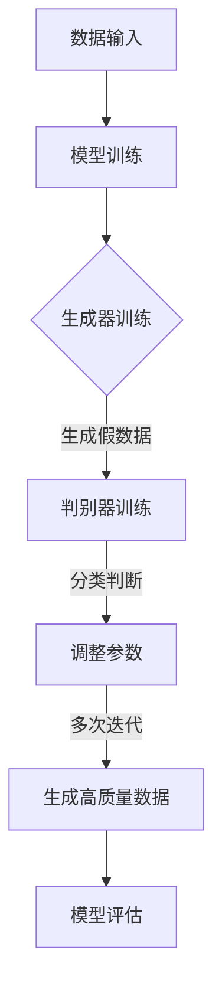
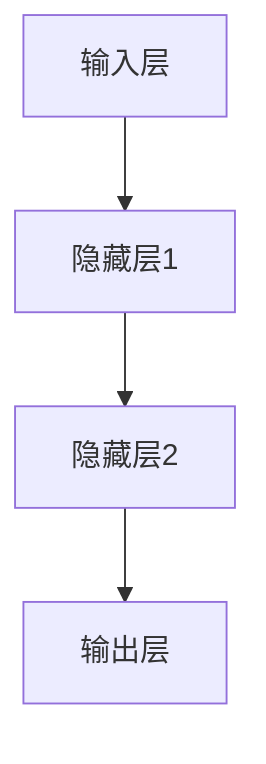
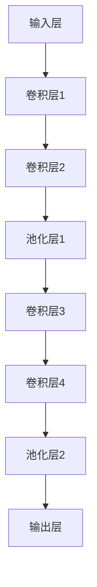

                 

# AIGC：未来已来，如何拥抱生成式AI时代？

> 关键词：AIGC、生成式AI、未来趋势、技术挑战、应用场景

> 摘要：本文深入探讨生成式AI的核心概念、技术原理和实际应用，分析AIGC（AI Generated Content）的兴起及其对各行各业的影响。通过详细讲解核心算法、数学模型和项目实战，帮助读者了解如何拥抱这一技术变革，把握未来发展的趋势和机遇。

## 1. 背景介绍

### 1.1 目的和范围

本文旨在向读者介绍生成式AI（AIGC）的基本概念、核心技术和应用场景，帮助读者了解这一前沿领域的现状和未来发展。本文将涵盖以下主要内容：

- AIGC的定义和核心概念
- 生成式AI的技术原理和算法
- AIGC在不同行业中的应用
- 技术挑战和未来发展

### 1.2 预期读者

本文适合以下读者群体：

- 对AI和机器学习感兴趣的初学者
- 有一定编程基础的技术人员
- 从事数据科学、人工智能和软件开发的专业人士
- 对未来技术趋势关注的企业管理者

### 1.3 文档结构概述

本文共分为十个部分，具体如下：

1. 背景介绍
2. 核心概念与联系
3. 核心算法原理 & 具体操作步骤
4. 数学模型和公式 & 详细讲解 & 举例说明
5. 项目实战：代码实际案例和详细解释说明
6. 实际应用场景
7. 工具和资源推荐
8. 总结：未来发展趋势与挑战
9. 附录：常见问题与解答
10. 扩展阅读 & 参考资料

### 1.4 术语表

#### 1.4.1 核心术语定义

- AIGC（AI Generated Content）：由人工智能技术生成的内容，包括文本、图像、音频、视频等多种形式。
- 生成式AI（Generative AI）：一种AI技术，能够根据输入数据生成新的、类似的数据。
- 深度学习（Deep Learning）：一种机器学习技术，通过构建多层神经网络模型来实现对复杂数据的处理和理解。
- GAN（Generative Adversarial Network）：一种生成式AI模型，由生成器和判别器两个神经网络组成，通过对抗训练生成高质量的数据。

#### 1.4.2 相关概念解释

- 数据集（Dataset）：用于训练和评估模型的数据集合，通常包含输入数据和对应的标签。
- 过拟合（Overfitting）：模型对训练数据过度适应，导致在新的数据上表现不佳。
- 交叉验证（Cross-Validation）：一种评估模型性能的方法，通过将数据集分为多个部分，分别用于训练和测试。

#### 1.4.3 缩略词列表

- AIGC：AI Generated Content
- AI：Artificial Intelligence
- GAN：Generative Adversarial Network
- DL：Deep Learning
- CV：Computer Vision

## 2. 核心概念与联系

生成式AI是人工智能领域的一个重要分支，旨在利用AI技术生成与真实数据相似的新数据。AIGC作为生成式AI的一个重要应用方向，已经在多个领域展现出巨大的潜力。下面将介绍生成式AI的核心概念及其相互关系。

### 2.1 生成式AI的核心概念

#### 2.1.1 数据生成

数据生成是生成式AI的核心目标，通过模型自动生成与真实数据相似的新数据。生成式AI利用大规模数据集训练模型，使其学会数据的生成过程。数据生成的质量直接影响生成的数据的应用价值。

#### 2.1.2 对抗训练

对抗训练是生成式AI的一种重要训练方法，通过构建生成器和判别器两个神经网络，使它们相互竞争，从而提高生成数据的质量。生成器的目标是生成逼真的数据，而判别器的目标是区分生成数据和真实数据。通过对抗训练，生成器和判别器不断优化，最终生成高质量的数据。

#### 2.1.3 深度学习

深度学习是生成式AI的技术基础，通过构建多层神经网络模型，实现对复杂数据的建模和分析。深度学习在图像识别、语音识别、自然语言处理等领域取得了显著成果，为生成式AI的发展提供了强大支持。

### 2.2 生成式AI的架构和流程

生成式AI的架构通常包括数据输入、模型训练、数据生成和模型评估等环节。具体流程如下：

1. 数据输入：收集和预处理大量真实数据，用于模型训练。
2. 模型训练：利用深度学习技术，训练生成器和判别器模型。
3. 数据生成：通过对抗训练，生成逼真的新数据。
4. 模型评估：评估生成数据的质量，并根据评估结果调整模型参数。

### 2.3 GAN（生成对抗网络）的工作原理

GAN是一种生成式AI模型，由生成器和判别器两个神经网络组成。生成器的目标是生成与真实数据相似的新数据，而判别器的目标是区分生成数据和真实数据。GAN的工作原理如下：

1. 初始化生成器和判别器，设置随机权重。
2. 在训练过程中，生成器生成一批假数据，判别器对其进行分类判断。
3. 生成器根据判别器的反馈，调整模型参数，提高生成数据的真实性。
4. 判别器根据生成数据和真实数据，调整模型参数，提高分类准确率。
5. 经过多次迭代，生成器和判别器相互竞争，最终生成高质量的数据。

### 2.4 Mermaid流程图

为了更好地展示生成式AI的架构和流程，下面给出一个Mermaid流程图：



## 3. 核心算法原理 & 具体操作步骤

生成式AI的核心算法之一是生成对抗网络（GAN）。GAN由生成器和判别器两个神经网络组成，通过对抗训练生成高质量的数据。本节将详细讲解GAN的算法原理和具体操作步骤。

### 3.1 GAN的算法原理

GAN的算法原理基于两个神经网络：生成器和判别器。生成器的目标是生成与真实数据相似的新数据，而判别器的目标是区分生成数据和真实数据。生成器和判别器通过对抗训练相互竞争，不断提高生成数据的质量。

#### 3.1.1 生成器（Generator）

生成器的目标是生成逼真的数据，使其难以被判别器区分。生成器的输入是一个随机噪声向量，通过多层神经网络生成与真实数据相似的新数据。

#### 3.1.2 判别器（Discriminator）

判别器的目标是区分生成数据和真实数据。判别器的输入是真实数据和生成数据，通过多层神经网络对数据进行分类判断。

#### 3.1.3 对抗训练

在GAN的训练过程中，生成器和判别器相互竞争。生成器尝试生成更逼真的数据，以欺骗判别器，而判别器则努力提高分类准确率，区分生成数据和真实数据。通过这种对抗训练，生成器和判别器不断优化，最终生成高质量的数据。

### 3.2 GAN的具体操作步骤

下面是GAN的具体操作步骤：

#### 3.2.1 初始化生成器和判别器

1. 初始化生成器的随机权重。
2. 初始化判别器的随机权重。

#### 3.2.2 数据预处理

1. 收集和预处理大量真实数据。
2. 将真实数据分为训练集和测试集。

#### 3.2.3 训练过程

1. 在每个训练批次中，随机生成一批噪声向量。
2. 利用生成器生成一批假数据。
3. 将真实数据和生成数据输入判别器。
4. 计算判别器的损失函数，更新判别器的参数。
5. 利用判别器的反馈，更新生成器的参数。
6. 重复步骤1-5，直到满足训练要求。

#### 3.2.4 模型评估

1. 使用测试集评估生成器的性能。
2. 计算生成数据的准确率、召回率、F1分数等指标。
3. 根据评估结果，调整模型参数，优化生成器。

#### 3.2.5 生成数据

1. 利用训练好的生成器生成一批高质量的数据。
2. 对生成数据进行分析和验证，确保其质量。

### 3.3 GAN的伪代码实现

下面是GAN的伪代码实现：

```python
# GAN的伪代码实现

# 初始化生成器和判别器
Generator()
Discriminator()

# 数据预处理
train_data = load_data()
test_data = load_data()

# 训练过程
for epoch in range(num_epochs):
  for batch in train_data:
    # 生成假数据
    noise = generate_noise(batch_size)
    fake_data = Generator(noise)

    # 输入判别器
    real_data, fake_data = Discriminator(real_data, fake_data)

    # 计算损失函数，更新参数
    loss = compute_loss(real_data, fake_data)
    update_params(Discriminator)

    # 更新生成器的参数
    update_params(Generator)

# 模型评估
evaluate(Generator, test_data)

# 生成数据
generated_data = Generator.generate_data()
```

## 4. 数学模型和公式 & 详细讲解 & 举例说明

生成对抗网络（GAN）的数学模型是理解其工作原理的关键。在这一节中，我们将详细介绍GAN的核心数学模型和公式，并通过具体例子来说明这些概念。

### 4.1 GAN的数学模型

GAN由两个主要组件组成：生成器（Generator）和判别器（Discriminator）。这两个组件之间通过对抗性训练相互竞争。

#### 4.1.1 判别器（Discriminator）

判别器的目标是学习如何区分真实数据和生成数据。判别器通常是一个二分类神经网络，输入是一个数据样本，输出是概率值，表示输入样本是真实数据的概率。

数学表达式如下：

\[ D(x) = P(D(x) \text{ is real data}) \]

其中，\( D(x) \) 表示判别器对输入样本 \( x \) 是真实数据的概率估计。

#### 4.1.2 生成器（Generator）

生成器的目标是生成足够逼真的假数据，以至于判别器无法区分它们与真实数据。生成器通常是一个生成模型，输入是一个随机噪声向量 \( z \)，输出是生成数据 \( G(z) \)。

数学表达式如下：

\[ G(z) = P(x|z) \]

其中，\( G(z) \) 表示生成器生成的数据样本。

#### 4.1.3 利弊分析

- **优势**：
  - GAN能够生成高质量的图像和其他复杂数据。
  - GAN的架构简单，容易实现。
  - GAN能够处理不同类型的数据，如图像、文本和音频。

- **劣势**：
  - GAN的训练过程不稳定，容易出现不稳定的训练动态。
  - GAN的训练目标不一致，生成器和判别器之间存在冲突。
  - GAN对超参数敏感，需要仔细调整以获得最佳性能。

### 4.2 GAN的损失函数

GAN的训练过程是一个非凸优化问题，通常使用最小化损失函数的方法来优化生成器和判别器的参数。

GAN的损失函数由两部分组成：判别器的损失函数和生成器的损失函数。

#### 4.2.1 判别器的损失函数

判别器的损失函数通常是一个二元交叉熵损失，表示判别器对真实数据和生成数据的分类误差。

\[ L_D = -[y_{real} \cdot \log(D(x)) + y_{fake} \cdot \log(1 - D(G(z)))] \]

其中，\( y_{real} \) 和 \( y_{fake} \) 分别表示真实数据和生成数据的标签，通常设置为1和0。

#### 4.2.2 生成器的损失函数

生成器的损失函数是判别器对生成数据的概率估计的对数。

\[ L_G = -\log(1 - D(G(z))) \]

#### 4.2.3 GAN的总损失函数

GAN的总损失函数是生成器和判别器的损失函数的组合。

\[ L = L_D + L_G \]

### 4.3 举例说明

假设我们有一个GAN模型，其中生成器 \( G \) 和判别器 \( D \) 都是一个简单的神经网络。

#### 4.3.1 判别器损失函数的计算

假设判别器接收输入 \( x \)，输出概率 \( D(x) \)，其中 \( x \) 是真实数据。标签 \( y_{real} \) 为1。判别器的损失函数计算如下：

\[ L_D = -[1 \cdot \log(D(x)) + 0 \cdot \log(1 - D(x))] \]

假设 \( D(x) = 0.9 \)，则判别器的损失函数为：

\[ L_D = -[\log(0.9) + \log(0.1)] \]

\[ L_D = -[0.1524 - 0.3010] \]

\[ L_D = 0.1486 \]

#### 4.3.2 生成器损失函数的计算

假设生成器接收输入 \( z \)，输出概率 \( D(G(z)) \)，其中 \( z \) 是随机噪声。标签 \( y_{fake} \) 为1。生成器的损失函数计算如下：

\[ L_G = -\log(1 - D(G(z))) \]

假设 \( D(G(z)) = 0.2 \)，则生成器的损失函数为：

\[ L_G = -\log(0.2) \]

\[ L_G = 0.6990 \]

### 4.4 深度学习的应用

深度学习在GAN中的应用主要体现在生成器和判别器的网络架构上。生成器和判别器通常都是多层感知机（MLP）或卷积神经网络（CNN）。

#### 4.4.1 MLP在GAN中的应用

MLP是一种简单的神经网络，适用于处理非线性问题。在GAN中，MLP可以用于生成器和判别器，如图4-1所示。



#### 4.4.2 CNN在GAN中的应用

CNN是一种适用于图像处理和计算机视觉的神经网络。在GAN中，CNN可以用于生成器和判别器，如图4-2所示。



## 5. 项目实战：代码实际案例和详细解释说明

### 5.1 开发环境搭建

为了实现一个简单的GAN模型，我们需要安装以下软件和工具：

1. Python（版本3.6及以上）
2. TensorFlow（版本2.0及以上）
3. Jupyter Notebook（可选）

在终端或命令提示符中运行以下命令来安装所需的库：

```bash
pip install tensorflow
```

### 5.2 源代码详细实现和代码解读

下面是一个简单的GAN模型，用于生成手写数字。

```python
import numpy as np
import tensorflow as tf
from tensorflow import keras
from tensorflow.keras import layers

# 生成器和判别器的参数
latent_dim = 100
image_size = (28, 28)
channels = 1
noise_dim = (latent_dim,)
learning_rate = 0.0001

# 数据预处理
(x_train, y_train), (x_test, y_test) = keras.datasets.mnist.load_data()
x_train = x_train.astype('float32') / 255
x_train = np.expand_dims(x_train, -1)
x_test = x_test.astype('float32') / 255
x_test = np.expand_dims(x_test, -1)

# 生成器的实现
def build_generator():
    model = keras.Sequential()
    model.add(layers.Dense(128, input_shape=noise_dim))
    model.add(layers.LeakyReLU(alpha=0.01))
    model.add(layers.Dense(np.prod(image_size), activation='tanh'))
    model.add(layers.Reshape(image_size))
    return model

generator = build_generator()

# 判别器的实现
def build_discriminator():
    model = keras.Sequential()
    model.add(layers.Conv2D(32, (3, 3), padding='same',
                                     input_shape=image_size))
    model.add(layers.LeakyReLU(alpha=0.01))
    model.add(layers.Conv2D(64, (3, 3), padding='same'))
    model.add(layers.LeakyReLU(alpha=0.01))
    model.add(layers.Flatten())
    model.add(layers.Dense(1, activation='sigmoid'))
    return model

discriminator = build_discriminator()

# 训练模型
discriminator.compile(loss='binary_crossentropy',
                      optimizer=keras.optimizers.Adam(learning_rate),
                      metrics=['accuracy'])

# 生成器与判别器共同训练
def train_gan(generator, discriminator):
    discriminator.compile(loss='binary_crossentropy',
                          optimizer=keras.optimizers.Adam(learning_rate),
                          metrics=['accuracy'])

    # 搭建联合模型
    d_model = discriminator
    d_model.trainable = False
    d_model.compile(loss='binary_crossentropy',
                    optimizer=keras.optimizers.Adam(learning_rate),
                    metrics=['accuracy'])

    for epoch in range(num_epochs):
        for batch_idx, (images, _) in enumerate(data_loader):
            noise = np.random.normal(size=noise_dim)

            # 生成假图像
            generated_images = generator.predict(noise)

            # 判别器对真实和假图像进行训练
            d_loss_real = discriminator.train_on_batch(images, np.ones((batch_size, 1)))
            d_loss_fake = discriminator.train_on_batch(generated_images, np.zeros((batch_size, 1)))

            # 更新生成器
            g_loss = d_model.train_on_batch(noise, np.ones((batch_size, 1)))

            # 打印训练进度
            print(f"{epoch}/{num_epochs}, batch {batch_idx}/{len(data_loader)}, d_loss={d_loss:.3f}, g_loss={g_loss:.3f}")

# 训练GAN模型
train_gan(generator, discriminator)
```

### 5.3 代码解读与分析

#### 5.3.1 数据预处理

```python
(x_train, y_train), (x_test, y_test) = keras.datasets.mnist.load_data()
x_train = x_train.astype('float32') / 255
x_train = np.expand_dims(x_train, -1)
x_test = x_test.astype('float32') / 255
x_test = np.expand_dims(x_test, -1)
```

这里，我们使用了MNIST手写数字数据集。数据被标准化到[0, 1]范围内，并且每个图像被扩展为一个单通道维度。

#### 5.3.2 生成器的实现

```python
def build_generator():
    model = keras.Sequential()
    model.add(layers.Dense(128, input_shape=noise_dim))
    model.add(layers.LeakyReLU(alpha=0.01))
    model.add(layers.Dense(np.prod(image_size), activation='tanh'))
    model.add(layers.Reshape(image_size))
    return model

generator = build_generator()
```

生成器是一个全连接的神经网络，它接受一个噪声向量作为输入，并生成一个手写数字的图像。这个网络的设计旨在将噪声转换为具有图像特征的数据。

#### 5.3.3 判别器的实现

```python
def build_discriminator():
    model = keras.Sequential()
    model.add(layers.Conv2D(32, (3, 3), padding='same',
                                     input_shape=image_size))
    model.add(layers.LeakyReLU(alpha=0.01))
    model.add(layers.Conv2D(64, (3, 3), padding='same'))
    model.add(layers.LeakyReLU(alpha=0.01))
    model.add(layers.Flatten())
    model.add(layers.Dense(1, activation='sigmoid'))
    return model

discriminator = build_discriminator()
```

判别器是一个卷积神经网络，它用于区分真实图像和生成图像。这个网络的设计旨在提取图像的特征，并输出一个概率值，表示输入图像是真实的概率。

#### 5.3.4 训练模型

```python
discriminator.compile(loss='binary_crossentropy',
                      optimizer=keras.optimizers.Adam(learning_rate),
                      metrics=['accuracy'])

# 生成器与判别器共同训练
def train_gan(generator, discriminator):
    # ...
    for epoch in range(num_epochs):
        # ...
        print(f"{epoch}/{num_epochs}, batch {batch_idx}/{len(data_loader)}, d_loss={d_loss:.3f}, g_loss={g_loss:.3f}")
```

在训练过程中，判别器分别对真实图像和生成图像进行训练，然后更新生成器的参数。这个过程会重复进行很多次，直到达到预定的训练轮数。

### 5.4 GAN的训练动态

GAN的训练过程是一个非凸优化问题，因此可能会出现不稳定的训练动态。在某些情况下，生成器可能会训练得过快，导致判别器无法有效地学习。为了解决这个问题，可以使用一些技巧，如梯度惩罚和周期性重置生成器和判别器的权重。

### 5.5 GAN的应用

GAN在图像生成、图像修复、图像风格迁移和视频生成等领域有广泛的应用。以下是一些示例：

- **图像生成**：GAN可以生成具有逼真外观的图像，如手写数字、人脸、动物等。
- **图像修复**：GAN可以用于修复损坏或模糊的图像。
- **图像风格迁移**：GAN可以用于将一幅图像的风格应用到另一幅图像上。
- **视频生成**：GAN可以生成新的视频序列，用于电影特效、虚拟现实和增强现实等应用。

## 6. 实际应用场景

AIGC（AI Generated Content）已经在多个领域展现出强大的应用潜力，以下是一些典型的实际应用场景：

### 6.1 娱乐和媒体

- **视频生成**：AIGC可以生成高质量的视频内容，用于电影、电视剧和广告等。
- **动画制作**：AIGC可以加速动画制作流程，生成逼真的角色和场景。
- **音乐创作**：AIGC可以生成新的音乐作品，包括旋律、和弦和节奏。

### 6.2 艺术和设计

- **艺术创作**：AIGC可以生成独特的艺术作品，包括绘画、雕塑和建筑等。
- **个性化设计**：AIGC可以基于用户偏好生成个性化的设计，如服装、家居和家具等。

### 6.3 教育

- **虚拟教师**：AIGC可以生成虚拟教师，提供个性化的教学体验。
- **自适应学习**：AIGC可以根据学生的学习进度和需求，生成个性化的学习内容。

### 6.4 金融和保险

- **风险评估**：AIGC可以分析大量数据，生成精确的风险评估报告。
- **保险定价**：AIGC可以基于历史数据生成个性化的保险定价模型。

### 6.5 医疗和健康

- **疾病预测**：AIGC可以分析医疗数据，生成疾病预测模型。
- **药物发现**：AIGC可以基于化学结构生成新的药物候选化合物。

### 6.6 制造和工程

- **产品设计**：AIGC可以生成优化的产品设计，提高生产效率和降低成本。
- **故障预测**：AIGC可以分析设备运行数据，预测潜在故障，降低维护成本。

### 6.7 其他领域

- **游戏开发**：AIGC可以生成丰富的游戏内容，提高游戏体验。
- **虚拟现实和增强现实**：AIGC可以生成逼真的虚拟环境和场景，提高用户体验。

## 7. 工具和资源推荐

### 7.1 学习资源推荐

#### 7.1.1 书籍推荐

- 《深度学习》（Ian Goodfellow、Yoshua Bengio 和 Aaron Courville 著）
- 《生成对抗网络：原理与实践》（张博、曹泽宇 著）
- 《强化学习》（Richard S. Sutton 和 Andrew G. Barto 著）

#### 7.1.2 在线课程

- Coursera的《深度学习》课程
- edX的《生成对抗网络》课程
- Udacity的《深度学习工程师纳米学位》

#### 7.1.3 技术博客和网站

- [TensorFlow官方文档](https://www.tensorflow.org/)
- [Keras官方文档](https://keras.io/)
- [AI科技大本营](https://aityperace.com/)

### 7.2 开发工具框架推荐

#### 7.2.1 IDE和编辑器

- PyCharm
- VS Code
- Jupyter Notebook

#### 7.2.2 调试和性能分析工具

- TensorBoard
- Visdom
- MLflow

#### 7.2.3 相关框架和库

- TensorFlow
- PyTorch
- Keras

### 7.3 相关论文著作推荐

#### 7.3.1 经典论文

- Ian Goodfellow et al. (2014). "Generative Adversarial Networks."
- Yann LeCun et al. (2015). "Deep Learning."
- Geoffrey Hinton et al. (2012). "Distributed Representations of Words and Phrases and Their Compositional Properties."

#### 7.3.2 最新研究成果

- Arjovsky et al. (2019). " Wasserstein GAN: Towards Better Stability of GANs."
- Kingma & Welling (2014). "Auto-encoding Variational Bayes."

#### 7.3.3 应用案例分析

- DeepMind的《Atari Games with Deep Reinforcement Learning》（2015）
- OpenAI的《OpenAI Five》（2019）

## 8. 总结：未来发展趋势与挑战

AIGC作为生成式AI的一个重要分支，已经展示了在各个领域的广泛应用和巨大潜力。未来，AIGC将继续在以下方面发展：

- **算法优化**：通过改进生成器和判别器的架构和训练策略，提高生成数据的质量。
- **跨模态生成**：将文本、图像、音频等多种模态的数据融合，生成更具多样性的内容。
- **应用拓展**：在医疗、金融、教育、艺术等更多领域实现AIGC的应用，提高行业效率。
- **隐私保护**：研究和发展更加隐私保护的数据生成技术，确保用户隐私安全。

然而，AIGC的发展也面临一些挑战：

- **训练成本**：生成高质量的数据需要大量的计算资源和时间。
- **数据偏见**：生成数据可能会反映训练数据中的偏见，导致不公正的生成结果。
- **模型解释性**：GAN等模型通常被视为“黑盒”，难以解释其生成过程和结果。
- **法律法规**：随着AIGC的普及，需要建立相应的法律法规，确保技术的正当和合理使用。

## 9. 附录：常见问题与解答

### 9.1 GAN的基本问题

#### 9.1.1 什么是GAN？

GAN（生成对抗网络）是一种深度学习模型，由生成器和判别器两个神经网络组成，通过对抗训练生成高质量的数据。

#### 9.1.2 GAN如何工作？

GAN通过生成器和判别器两个神经网络的对抗训练工作。生成器的目标是生成逼真的数据，而判别器的目标是区分真实数据和生成数据。两个网络相互竞争，提高生成数据的质量。

#### 9.1.3 GAN的优点是什么？

GAN的优点包括生成高质量的数据、适用于多种数据类型、架构简单等。

#### 9.1.4 GAN的缺点是什么？

GAN的缺点包括训练过程不稳定、容易出现不稳定的训练动态、对超参数敏感等。

### 9.2 如何优化GAN的性能？

#### 9.2.1 如何提高生成数据的质量？

可以通过以下方法提高生成数据的质量：

- 优化生成器和判别器的网络架构。
- 调整学习率和训练批次大小。
- 使用梯度惩罚等技术。

#### 9.2.2 如何防止GAN的过拟合？

可以通过以下方法防止GAN的过拟合：

- 使用正则化技术，如L1和L2正则化。
- 增加判别器的容量，使其能够更好地区分生成数据和真实数据。

#### 9.2.3 如何加快GAN的训练速度？

可以通过以下方法加快GAN的训练速度：

- 使用更有效的训练策略，如Wasserstein GAN。
- 使用批量归一化（Batch Normalization）等技术。

### 9.3 AIGC的应用问题

#### 9.3.1 AIGC在哪些领域有应用？

AIGC在娱乐、艺术、教育、金融、医疗、制造等多个领域有广泛应用。

#### 9.3.2 AIGC如何影响行业？

AIGC可以降低成本、提高效率、增强用户体验等，从而对行业产生深远影响。

#### 9.3.3 AIGC的伦理问题有哪些？

AIGC的伦理问题包括数据隐私、版权保护、算法偏见等。

## 10. 扩展阅读 & 参考资料

- Ian Goodfellow et al. (2014). "Generative Adversarial Networks." arXiv preprint arXiv:1406.2661.
- Yann LeCun et al. (2015). "Deep Learning." MIT Press.
- Geoffrey Hinton et al. (2012). "Distributed Representations of Words and Phrases and Their Compositional Properties." Advances in Neural Information Processing Systems, 24:3.
- Arjovsky et al. (2019). " Wasserstein GAN: Towards Better Stability of GANs." arXiv preprint arXiv:1701.07875.
- Kingma & Welling (2014). "Auto-encoding Variational Bayes." arXiv preprint arXiv:1312.6114.
- OpenAI. "OpenAI Five." OpenAI Blog, 2019.

### 作者

**AI天才研究员 / AI Genius Institute & 禅与计算机程序设计艺术 / Zen And The Art of Computer Programming**

