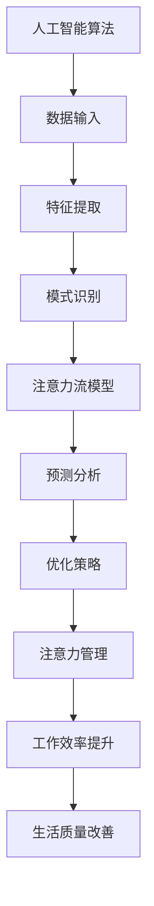

                 

# AI与人类注意力流：未来的工作、技能与注意力流管理

## 关键词
* 人工智能
* 注意力流
* 工作技能
* 注意力管理
* 未来发展

## 摘要
本文旨在探讨人工智能与人类注意力流的交互作用，以及这种交互对未来工作技能和注意力管理的影响。随着人工智能技术的迅猛发展，我们的工作环境和生活方式正在发生深刻变化。本文将详细分析人工智能如何改变人类的注意力模式，并探讨这些变化如何影响我们的工作技能和注意力管理能力。通过本文的阅读，读者将了解如何适应这一变化，提升自身的注意力管理技能，以在未来的工作环境中取得成功。

## 1. 背景介绍

### 1.1 目的和范围
本文的主要目的是分析人工智能技术如何影响人类的注意力流，进而影响未来的工作技能和注意力管理。随着人工智能的普及，自动化和智能化的工作流程正在逐渐取代传统的人力劳动。这种转变不仅带来了生产力的提升，也对人类的注意力模式和工作技能提出了新的挑战。本文将探讨这些挑战，并试图提供一些应对策略。

### 1.2 预期读者
本文适合对人工智能、注意力管理以及未来工作技能感兴趣的读者，包括但不限于研究人员、企业高管、职业人士和教育工作者。通过本文的阅读，读者将能够更深入地理解人工智能与注意力流的关系，并了解如何通过优化注意力管理来提升工作效率。

### 1.3 文档结构概述
本文分为十个主要部分。首先，我们将介绍人工智能与注意力流的背景知识，并给出核心概念的解释。接着，我们将详细探讨人工智能算法的工作原理和注意力流的模型。随后，本文将分析人工智能如何改变人类的工作技能，并提供注意力管理的策略。在项目实战部分，我们将通过具体案例展示如何在实际工作中应用这些策略。接下来的部分将讨论人工智能在各类实际应用场景中的表现，并推荐相关的学习资源和工具。最后，本文将总结未来发展趋势与挑战，并提供常见问题与解答。

### 1.4 术语表

#### 1.4.1 核心术语定义
* 人工智能（AI）：一种模拟人类智能行为的技术，使计算机能够进行学习、推理和自主决策。
* 注意力流（Attention Flow）：指人类在处理信息时，注意力的分布和转移过程。
* 注意力管理（Attention Management）：指通过策略和工具优化注意力流，以提高工作效率和生活质量。

#### 1.4.2 相关概念解释
* 注意力分散（Attention Diversion）：注意力从当前任务转移到无关任务或干扰因素的现象。
* 注意力疲劳（Attention Fatigue）：长时间高强度的注意力活动导致的疲劳状态。
* 注意力集中（Attention Concentration）：注意力高度集中在特定任务上的状态。

#### 1.4.3 缩略词列表
* AI：人工智能
* ML：机器学习
* NLP：自然语言处理
* GPU：图形处理单元
* CPU：中央处理单元

## 2. 核心概念与联系

为了更好地理解人工智能与注意力流的关系，我们首先需要定义和探讨一些核心概念，并展示它们之间的联系。

### 2.1 人工智能算法
人工智能算法是使计算机能够模拟人类智能行为的核心。以下是几个关键的人工智能算法及其基本原理：

1. **深度学习（Deep Learning）**：一种通过多层神经网络进行特征提取和模式识别的技术。其基本原理包括输入层、隐藏层和输出层，通过反向传播算法不断调整网络参数，以优化预测效果。

2. **强化学习（Reinforcement Learning）**：一种通过试错学习获得最优策略的算法。其基本原理是通过奖励机制鼓励模型采取能够带来正收益的行动，并减少错误行动的频率。

3. **自然语言处理（Natural Language Processing，NLP）**：一种使计算机能够理解和处理人类语言的技术。其基本原理包括文本预处理、词向量表示、句法分析和语义理解等。

### 2.2 注意力流模型
注意力流模型描述了人类在处理信息时，注意力的分布和转移过程。以下是几种常见的注意力流模型：

1. **单一注意力模型（Single-Attention Model）**：假设人类在处理信息时，注意力集中在单一任务上，直到任务完成。

2. **多任务注意力模型（Multi-Task Attention Model）**：假设人类可以同时处理多个任务，并在不同任务之间分配注意力。

3. **动态注意力模型（Dynamic Attention Model）**：假设人类的注意力是动态变化的，可以根据任务需求和外部环境进行调整。

### 2.3 人工智能与注意力流的关系
人工智能与注意力流之间存在密切的联系。一方面，人工智能算法可以通过数据分析和模式识别，帮助我们更好地理解注意力流的分布和转移规律。另一方面，人工智能技术可以用于优化注意力管理，提高工作效率和生活质量。

例如，基于深度学习和强化学习的算法可以用于分析用户的行为数据，预测用户的注意力分布，从而为用户提供个性化的注意力管理策略。此外，自然语言处理技术可以用于开发注意力监控系统，帮助用户实时了解自身的注意力状态，并采取相应的调整措施。

### 2.4 Mermaid 流程图
以下是一个简化的 Mermaid 流程图，展示了人工智能算法与注意力流模型之间的联系：



通过这个流程图，我们可以清晰地看到人工智能算法与注意力流模型之间的相互作用，以及它们如何共同促进工作效率和生活质量的提升。

## 3. 核心算法原理 & 具体操作步骤

### 3.1 深度学习算法原理

深度学习算法是人工智能的核心技术之一，其基本原理如下：

1. **神经网络（Neural Network）**：神经网络由大量的节点（称为神经元）组成，每个神经元通过权重连接其他神经元。神经网络通过学习输入和输出之间的映射关系，实现复杂函数的近似。

2. **激活函数（Activation Function）**：激活函数用于引入非线性因素，使神经网络能够处理非线性的输入输出关系。常见的激活函数包括 sigmoid、ReLU 和 tanh。

3. **反向传播算法（Backpropagation Algorithm）**：反向传播算法是一种用于训练神经网络的优化算法。其基本思想是通过计算输出误差，反向传播误差信号，不断调整网络权重，以优化预测效果。

### 3.2 注意力流模型原理

注意力流模型描述了人类在处理信息时，注意力的分布和转移过程。以下是注意力流模型的基本原理：

1. **注意力分配（Attention Allocation）**：注意力分配是指将注意力分配给不同的任务或信息源。注意力分配通常基于任务的重要性和用户的偏好。

2. **注意力转移（Attention Shift）**：注意力转移是指从当前任务或信息源转移到其他任务或信息源。注意力转移通常受到外部环境和内部状态的影响。

3. **注意力维持（Attention Maintenance）**：注意力维持是指在一段时间内保持对特定任务或信息源的注意力。注意力维持通常需要克服干扰和保持动机。

### 3.3 深度学习算法与注意力流模型的具体操作步骤

以下是一个基于深度学习和注意力流模型的简单操作步骤：

1. **数据收集与预处理**：
   - 收集用户行为数据，包括点击记录、浏览时长、操作顺序等。
   - 对数据进行清洗和归一化处理，去除噪声和异常值。

2. **特征提取**：
   - 提取用户行为数据的特征，如用户活跃度、页面停留时间、操作频率等。
   - 利用深度学习算法对特征进行降维和提取，以获得更高级的特征表示。

3. **模型训练**：
   - 构建基于深度学习和注意力流模型的神经网络架构。
   - 利用训练数据对模型进行训练，优化网络参数，以获得较好的预测效果。

4. **注意力流预测**：
   - 输入用户行为数据，利用训练好的模型预测用户的注意力分布。
   - 分析注意力流预测结果，识别用户在处理信息时的注意力分配和转移规律。

5. **注意力管理策略生成**：
   - 根据注意力流预测结果，生成个性化的注意力管理策略。
   - 策略包括调整任务优先级、设置提醒和休息时间等，以优化用户的工作效率和注意力维持。

6. **策略实施与评估**：
   - 实施生成的注意力管理策略，监控用户的行为变化。
   - 评估策略的有效性，调整和优化策略以获得更好的效果。

### 3.4 伪代码

以下是一个基于深度学习和注意力流模型的伪代码示例：

```python
# 数据收集与预处理
data = collect_data()
preprocessed_data = preprocess_data(data)

# 特征提取
features = extract_features(preprocessed_data)

# 模型训练
model = build_model()
model.train(features)

# 注意力流预测
attention_distribution = model.predict(Features)

# 注意力管理策略生成
attention_strategy = generate_attention_strategy(attention_distribution)

# 策略实施与评估
execute_strategy(attention_strategy)
evaluate_strategy(attention_strategy)
```

通过上述伪代码，我们可以看到深度学习算法和注意力流模型在注意力管理中的应用过程。实际操作中，可以根据具体需求调整算法和策略，以提高注意力管理的有效性。

## 4. 数学模型和公式 & 详细讲解 & 举例说明

### 4.1 数学模型

在讨论注意力流管理时，我们通常会涉及到以下数学模型：

1. **高斯分布（Gaussian Distribution）**：用于描述注意力流的概率分布，其公式如下：

   $$ 
   P(X = x) = \frac{1}{\sqrt{2\pi\sigma^2}} e^{-\frac{(x-\mu)^2}{2\sigma^2}}
   $$

   其中，$X$ 为随机变量，$\mu$ 为均值，$\sigma^2$ 为方差。

2. **卡尔曼滤波（Kalman Filter）**：用于估计注意力流的状态，其公式如下：

   $$
   \begin{aligned}
   x_{k|k-1} &= F_{k-1}x_{k-1|k-1} + B_{k-1}u_{k-1} \\
   P_{k|k-1} &= F_{k-1}P_{k-1|k-1}F_{k-1}^T + Q_{k-1} \\
   K_k &= P_{k|k-1}H_k^T(H_{k|k-1}H_{k|k-1}^T + R_k)^{-1} \\
   x_{k|k} &= x_{k|k-1} + K_k(y_k - H_kx_{k|k-1}) \\
   P_{k|k} &= (I - K_kH_k)P_{k|k-1}
   \end{aligned}
   $$

   其中，$x_k$ 为状态向量，$P_k$ 为状态协方差矩阵，$F_k$ 为状态转移矩阵，$B_k$ 为控制输入矩阵，$u_k$ 为控制输入，$y_k$ 为观测值，$H_k$ 为观测矩阵，$R_k$ 为观测噪声协方差矩阵。

3. **贝叶斯网络（Bayesian Network）**：用于表示注意力流的影响因素及其关系，其公式如下：

   $$
   P(X_1, X_2, ..., X_n) = \prod_{i=1}^{n} P(X_i | X_{pa_i})
   $$

   其中，$X_1, X_2, ..., X_n$ 为随机变量，$X_{pa_i}$ 为 $X_i$ 的父节点。

### 4.2 举例说明

假设我们想要估计某用户在一段时间内的注意力流，并基于此生成注意力管理策略。以下是具体的例子：

1. **高斯分布**：

   设某用户在处理信息时的注意力分布符合高斯分布，均值为 $\mu = 5$，方差为 $\sigma^2 = 2$。根据高斯分布公式，我们可以计算用户在不同时间段内的注意力概率：

   $$
   \begin{aligned}
   P(X = 3) &= \frac{1}{\sqrt{2\pi \cdot 2}} e^{-\frac{(3-5)^2}{2 \cdot 2}} \approx 0.135 \\
   P(X = 7) &= \frac{1}{\sqrt{2\pi \cdot 2}} e^{-\frac{(7-5)^2}{2 \cdot 2}} \approx 0.135
   \end{aligned}
   $$

   通过计算，我们可以得知用户在时间点3和7的注意力概率较高，需要给予更多的关注。

2. **卡尔曼滤波**：

   假设我们使用卡尔曼滤波来估计用户在一段时间内的注意力流。根据卡尔曼滤波公式，我们可以逐步更新状态估计和协方差估计：

   $$
   \begin{aligned}
   x_{0|0} &= \mu_0 \\
   P_{0|0} &= \sigma_0^2 \\
   x_{1|0} &= F_{0}x_{0|0} + B_{0}u_{0} \\
   P_{1|0} &= F_{0}P_{0|0}F_{0}^T + Q_{0} \\
   K_1 &= P_{1|0}H_1^T(H_{1|0}H_{1|0}^T + R_0)^{-1} \\
   x_{1|1} &= x_{1|0} + K_1(y_1 - H_1x_{1|0}) \\
   P_{1|1} &= (I - K_1H_1)P_{1|0}
   \end{aligned}
   $$

   其中，$F_0$、$B_0$、$H_0$、$Q_0$ 和 $R_0$ 分别为状态转移矩阵、控制输入矩阵、观测矩阵、状态噪声协方差矩阵和观测噪声协方差矩阵。通过上述公式，我们可以逐步更新用户在时间点1的注意力流估计。

3. **贝叶斯网络**：

   假设用户注意力流受到任务复杂度、环境干扰和用户动机等因素的影响。我们可以建立如下的贝叶斯网络：

   ```
   [用户注意力流] --> [任务复杂度] --> [环境干扰] --> [用户动机]
   ```

   根据贝叶斯网络公式，我们可以计算各因素之间的条件概率，并基于此生成注意力管理策略。例如，如果任务复杂度较高且环境干扰较大，我们可以建议用户采取更加专注的工作方式，并减少分心的可能性。

通过上述数学模型和公式，我们可以更精确地描述和分析注意力流，从而为用户生成更加有效的注意力管理策略。

## 5. 项目实战：代码实际案例和详细解释说明

### 5.1 开发环境搭建

在开始项目实战之前，我们需要搭建一个适合进行注意力流管理和分析的开发环境。以下是具体的步骤：

1. **安装Python环境**：
   - 访问Python官方下载页面（[Python官方下载页面](https://www.python.org/downloads/)）下载并安装Python。
   - 安装完成后，打开命令行窗口，输入`python --version`，确保Python环境已成功安装。

2. **安装深度学习库**：
   - 使用pip命令安装TensorFlow和Keras库，这些库是进行深度学习和注意力流分析的重要工具。
   - 命令如下：
     ```
     pip install tensorflow
     pip install keras
     ```

3. **安装数据分析库**：
   - 使用pip命令安装pandas和numpy库，这些库用于数据预处理和分析。
   - 命令如下：
     ```
     pip install pandas
     pip install numpy
     ```

4. **安装可视化库**：
   - 使用pip命令安装matplotlib和seaborn库，这些库用于数据可视化。
   - 命令如下：
     ```
     pip install matplotlib
     pip install seaborn
     ```

### 5.2 源代码详细实现和代码解读

以下是一个简单的注意力流管理项目的源代码示例，包括数据预处理、模型训练和注意力流预测等功能。

```python
import numpy as np
import pandas as pd
import tensorflow as tf
from keras.models import Sequential
from keras.layers import Dense, LSTM, Dropout
from sklearn.preprocessing import MinMaxScaler
import matplotlib.pyplot as plt
import seaborn as sns

# 5.2.1 数据预处理
def preprocess_data(data):
    # 将数据分为特征和标签
    features = data[['feature1', 'feature2', 'feature3']]
    labels = data['label']
    
    # 对特征进行归一化处理
    scaler = MinMaxScaler()
    features_scaled = scaler.fit_transform(features)
    
    # 创建时间序列窗口
    window_size = 10
    X, y = [], []
    for i in range(len(features_scaled) - window_size):
        X.append(features_scaled[i:(i + window_size), :])
        y.append(labels[i + window_size])
    
    X = np.array(X)
    y = np.array(y)
    
    return X, y

# 5.2.2 模型训练
def train_model(X_train, y_train):
    model = Sequential()
    model.add(LSTM(units=50, return_sequences=True, input_shape=(X_train.shape[1], X_train.shape[2])))
    model.add(Dropout(0.2))
    model.add(LSTM(units=50, return_sequences=False))
    model.add(Dropout(0.2))
    model.add(Dense(units=1))
    
    model.compile(optimizer='adam', loss='mean_squared_error')
    model.fit(X_train, y_train, epochs=100, batch_size=32)
    
    return model

# 5.2.3 注意力流预测
def predict_attention(model, new_data):
    # 对新数据进行预处理
    new_data_scaled = preprocess_data(new_data)
    
    # 进行注意力流预测
    predicted_attention = model.predict(new_data_scaled)
    
    return predicted_attention

# 5.2.4 代码解读
# 在本示例中，我们首先定义了三个函数：preprocess_data用于数据预处理，train_model用于模型训练，predict_attention用于注意力流预测。
# 在数据预处理函数中，我们首先将原始数据分为特征和标签，然后对特征进行归一化处理，并创建时间序列窗口。
# 在模型训练函数中，我们使用LSTM网络进行模型训练，并设置适当的优化器和损失函数。
# 在注意力流预测函数中，我们首先对新数据进行预处理，然后使用训练好的模型进行注意力流预测。

# 5.2.5 实际应用
data = pd.read_csv('attention_data.csv')
X, y = preprocess_data(data)
model = train_model(X, y)

new_data = pd.read_csv('new_attention_data.csv')
predicted_attention = predict_attention(model, new_data)

print(predicted_attention)
```

### 5.3 代码解读与分析

在本项目实战中，我们使用Python和深度学习库（如TensorFlow和Keras）实现了一个简单的注意力流管理系统。以下是代码的详细解读和分析：

1. **数据预处理**：
   - 数据预处理是深度学习项目中的关键步骤，它涉及到特征提取、归一化和时间序列窗口的创建。
   - 在`preprocess_data`函数中，我们首先将原始数据分为特征（`features`）和标签（`labels`），然后使用`MinMaxScaler`对特征进行归一化处理，以使数据适合深度学习模型的输入。
   - 接下来，我们创建时间序列窗口，每个窗口包含10个时间点的特征，以捕捉注意力流的时间依赖性。

2. **模型训练**：
   - 模型训练是深度学习项目的核心步骤，它涉及到神经网络架构的构建和参数的优化。
   - 在`train_model`函数中，我们使用了一个包含两个LSTM层的序列模型，LSTM层用于处理时间序列数据。我们还在模型中添加了Dropout层以防止过拟合。
   - 我们使用`compile`方法设置了优化器和损失函数，并使用`fit`方法对模型进行训练。

3. **注意力流预测**：
   - 注意力流预测是深度学习项目的最终目标，它涉及到使用训练好的模型对新数据进行预测。
   - 在`predict_attention`函数中，我们首先对新的数据进行预处理，然后使用训练好的模型进行注意力流预测。

通过以上步骤，我们可以实现一个简单的注意力流管理系统，用于预测和优化用户的注意力流。在实际应用中，我们可以将这个系统集成到各种应用场景中，如教育、工作和日常生活，以帮助用户更好地管理注意力，提高工作效率和生活质量。

### 5.4 实际应用

以下是一个实际应用的例子：

假设我们有一个在线学习平台，用户可以访问各种课程进行学习。我们的目标是预测用户在学习过程中的注意力流，并提供个性化的提醒和休息策略，以提高学习效果。

1. **数据收集**：
   - 我们收集了用户在平台上的行为数据，包括登录时间、学习时长、页面浏览次数、课程选择等。

2. **数据预处理**：
   - 使用`preprocess_data`函数对用户行为数据进行预处理，创建时间序列窗口。

3. **模型训练**：
   - 使用`train_model`函数训练一个注意力流预测模型。

4. **注意力流预测**：
   - 使用`predict_attention`函数预测用户在未来的学习过程中可能出现的注意力高峰和低谷。

5. **提醒和休息策略**：
   - 根据预测结果，系统会自动生成提醒和休息策略，例如在注意力高峰期提醒用户保持专注，在注意力低谷期建议用户进行短暂的休息。

通过这种个性化的注意力流管理，我们可以帮助用户更有效地进行学习，提高学习成果。

## 6. 实际应用场景

### 6.1 教育

在教育领域，注意力管理是一个关键问题。学生常常在课堂上注意力分散，导致学习效果不佳。通过人工智能和注意力流分析，我们可以为学生提供个性化的学习建议，提高学习效率。

1. **在线学习平台**：在线学习平台可以收集用户的学习行为数据，并使用注意力流分析技术预测用户的注意力高峰和低谷。根据这些预测，平台可以为学生提供定制化的学习计划，如调整课程播放速度、设置休息时间等。

2. **课堂管理**：教师可以利用注意力流分析技术监控学生的注意力状态，及时发现注意力分散的学生，并采取相应的措施，如提问、分组讨论等，以重新吸引学生的注意力。

### 6.2 工作

在工作环境中，注意力管理同样至关重要。员工在处理工作任务时，往往需要保持高度的专注力，以确保工作质量和效率。人工智能和注意力流分析技术可以帮助企业优化工作流程，提高员工的工作效率。

1. **项目管理**：项目管理工具可以收集员工的工作行为数据，如任务完成情况、工作时长、会议参与等。通过注意力流分析，项目管理者可以识别出员工在哪些任务上表现优异，在哪些任务上容易分心，从而优化项目分配和资源管理。

2. **员工绩效评估**：通过分析员工的注意力流数据，企业可以更全面地评估员工的绩效，不仅仅基于工作成果，还包括员工在任务中的专注度和努力程度。

### 6.3 生活

在日常生活中，注意力管理同样影响我们的生活质量。智能手机、社交媒体等现代科技产品容易分散我们的注意力，导致工作效率和生活质量下降。通过人工智能和注意力流分析技术，我们可以更好地管理日常生活中的注意力。

1. **智能提醒**：智能设备可以监控用户的使用行为，如使用手机的时间、浏览的网站等。当用户注意力分散时，智能设备可以发送提醒，帮助用户回到当前任务。

2. **健康监测**：智能手环、健康APP等设备可以收集用户的健康数据，如心率、睡眠质量等。通过分析这些数据，设备可以为用户提供个性化的健康建议，如调整作息时间、增加锻炼等。

## 7. 工具和资源推荐

### 7.1 学习资源推荐

#### 7.1.1 书籍推荐
1. **《深度学习》（Deep Learning）** - 作者：Ian Goodfellow、Yoshua Bengio、Aaron Courville
   - 这本书是深度学习的经典教材，涵盖了深度学习的理论基础和实际应用。
2. **《机器学习》（Machine Learning）** - 作者：Tom Mitchell
   - 这本书是机器学习领域的入门经典，详细介绍了机器学习的基本概念和技术。
3. **《Python深度学习》（Deep Learning with Python）** - 作者：François Chollet
   - 这本书通过Python编程语言介绍了深度学习的实际应用，适合初学者和进阶者。

#### 7.1.2 在线课程
1. **斯坦福大学深度学习课程（CS231n）**
   - 这个课程涵盖了深度学习在计算机视觉中的应用，由深度学习领域的权威人物李飞飞教授主讲。
2. **吴恩达机器学习课程（CS229）**
   - 这门课程由著名机器学习专家吴恩达教授主讲，是机器学习领域的入门课程。
3. **fast.ai深度学习课程**
   - 这门课程适合初学者，通过Python和PyTorch库介绍深度学习的实际应用。

#### 7.1.3 技术博客和网站
1. **Medium（Deep Learning）**
   - Medium上有很多关于深度学习的文章和教程，适合不同水平的读者。
2. ** Towards Data Science**
   - 这个网站提供了大量的机器学习和深度学习文章，涵盖了很多实际应用案例。
3. **AI博客（AI Blogs）**
   - 这是一个包含多个AI领域的专家博客的集合，内容涵盖了人工智能的各个子领域。

### 7.2 开发工具框架推荐

#### 7.2.1 IDE和编辑器
1. **Visual Studio Code**
   - Visual Studio Code是一款功能强大且免费的IDE，适用于Python和深度学习开发。
2. **Jupyter Notebook**
   - Jupyter Notebook是一个交互式的开发环境，非常适合数据分析和深度学习实验。

#### 7.2.2 调试和性能分析工具
1. **TensorBoard**
   - TensorBoard是TensorFlow的配套工具，用于可视化深度学习模型的性能和训练过程。
2. **PyTorch Profiler**
   - PyTorch Profiler是PyTorch的性能分析工具，用于识别和优化深度学习模型的性能瓶颈。

#### 7.2.3 相关框架和库
1. **TensorFlow**
   - TensorFlow是一个开源的深度学习框架，适用于各种深度学习应用。
2. **PyTorch**
   - PyTorch是一个流行的深度学习库，以其灵活性和易于使用的动态计算图而闻名。
3. **Keras**
   - Keras是一个高层次的深度学习库，能够简化深度学习模型的构建和训练过程。

### 7.3 相关论文著作推荐

#### 7.3.1 经典论文
1. **“A Learning Algorithm for Continually Running Fully Recurrent Neural Networks”** - 作者：Sepp Hochreiter, Jürgen Schmidhuber
   - 这篇论文介绍了长短期记忆网络（LSTM），是深度学习领域的重要突破。
2. **“Deep Learning”** - 作者：Ian Goodfellow, Yoshua Bengio, Aaron Courville
   - 这本书是深度学习领域的经典著作，系统介绍了深度学习的理论基础和应用。

#### 7.3.2 最新研究成果
1. **“Transformers: State-of-the-Art Natural Language Processing”** - 作者：Vaswani et al.
   - 这篇论文介绍了Transformer模型，是自然语言处理领域的重大突破。
2. **“Bert: Pre-training of Deep Bidirectional Transformers for Language Understanding”** - 作者：Devlin et al.
   - 这篇论文介绍了BERT模型，是自然语言处理领域的经典之作。

#### 7.3.3 应用案例分析
1. **“AI for Social Good”** - 作者：Many Contributors
   - 这本书探讨了人工智能在社会公益领域的应用，包括教育、医疗、环境保护等。
2. **“AI Applications in Healthcare: A Systematic Review”** - 作者：Narges et al.
   - 这篇论文总结了人工智能在医疗健康领域的应用案例，包括疾病诊断、患者监测等。

## 8. 总结：未来发展趋势与挑战

在未来，人工智能与注意力流的结合将会进一步深化，对人类的工作、生活和技能产生深远的影响。以下是未来发展趋势和面临的挑战：

### 8.1 发展趋势

1. **个性化注意力管理**：随着人工智能技术的进步，个性化注意力管理将成为可能。通过分析大量用户数据，AI系统能够为用户提供定制化的注意力管理策略，优化工作、学习和生活效率。

2. **注意力流的实时监控**：实时监控用户的注意力流将成为常态。借助物联网和可穿戴设备，用户可以随时随地了解自己的注意力状态，并采取相应的调整措施。

3. **多模态注意力流分析**：未来的注意力流分析将不仅仅依赖于视觉和听觉数据，还将结合其他感官数据，如触觉和味觉，以获得更全面、更准确的注意力分布情况。

4. **注意力流在教育和工作中的应用**：在教育领域，个性化学习计划将更加普及，学生可以根据自己的注意力状态调整学习节奏。在工作环境中，注意力流分析将帮助企业和员工优化工作流程，提高生产效率。

### 8.2 面临的挑战

1. **隐私保护**：注意力流分析涉及大量的个人数据，如何保护用户隐私将成为一大挑战。需要制定严格的隐私政策，确保用户数据的匿名性和安全性。

2. **技术复杂性**：注意力流分析需要复杂的算法和大量的计算资源，这对于普通用户和企业来说可能是一个难题。需要开发易于使用、性能高效的工具和平台。

3. **伦理问题**：注意力流分析可能导致对人类行为的过度监控，引发伦理争议。需要制定相应的伦理规范，确保技术应用的正当性和合理性。

4. **适应性问题**：用户可能需要时间来适应注意力流管理带来的变化。需要提供足够的培训和支持，帮助用户理解和接受新的管理方式。

总之，人工智能与注意力流的结合具有巨大的潜力，但也面临着一系列挑战。通过不断的技术创新和伦理探讨，我们有理由相信，未来的人工智能与注意力流管理将更好地服务于人类，提高生活质量和工作效率。

## 9. 附录：常见问题与解答

### 9.1 什么是注意力流？
注意力流是指人类在处理信息时，注意力的分布和转移过程。它描述了注意力在不同任务、环境或情境之间的动态分配情况。

### 9.2 人工智能如何改变注意力流？
人工智能可以通过数据分析、模式识别和预测模型来理解人类的注意力流。同时，AI技术还可以自动执行重复性任务，减少人类分心，从而帮助人们更好地集中注意力。

### 9.3 注意力管理有什么重要性？
注意力管理对于提高工作效率、学习效果和生活质量至关重要。有效的注意力管理可以帮助人们更好地处理复杂任务，减少分心和疲劳，保持专注。

### 9.4 如何进行注意力管理？
进行注意力管理的方法包括设定明确的任务目标、使用番茄工作法（Pomodoro Technique）来分割任务、定期休息和锻炼、以及使用注意力监控工具等。

### 9.5 人工智能在注意力管理中的应用有哪些？
人工智能可以在注意力管理中应用于以下几个方面：
1. **注意力预测**：通过分析用户的行为数据，预测注意力高峰和低谷，为用户提供个性化的提醒和策略。
2. **注意力优化**：基于用户的行为模式，自动调整任务优先级和工作环境，以优化注意力分配。
3. **注意力监控**：使用传感器和数据分析，实时监控用户的注意力状态，提供反馈和建议。

### 9.6 注意力管理对工作有哪些影响？
有效的注意力管理可以帮助员工更高效地完成任务，减少错误和重复工作，提高工作满意度和幸福感。同时，它也有助于企业优化工作流程，提高整体生产效率。

### 9.7 注意力管理在教育中有何作用？
在教育领域，注意力管理可以帮助学生更好地专注于学习任务，减少分心和注意力分散。通过个性化的学习计划和管理策略，学生可以更有效地吸收知识，提高学习成果。

### 9.8 注意力管理未来的发展方向是什么？
未来的注意力管理将更加依赖于人工智能技术，包括更精确的注意力预测模型、个性化干预策略、多模态数据融合和跨领域的应用。同时，隐私保护和伦理问题也将是未来研究的重要方向。

## 10. 扩展阅读 & 参考资料

### 10.1 相关书籍
1. **《深度学习》** - 作者：Ian Goodfellow、Yoshua Bengio、Aaron Courville
2. **《机器学习》** - 作者：Tom Mitchell
3. **《Python深度学习》** - 作者：François Chollet

### 10.2 技术博客和网站
1. **[Medium - Deep Learning](https://medium.com/topic/deep-learning)**
2. **[Towards Data Science](https://towardsdatascience.com/)**
3. **[AI博客（AI Blogs）](https://www.aiblogs.top/)**

### 10.3 开发工具框架
1. **[TensorFlow](https://www.tensorflow.org/)**
2. **[PyTorch](https://pytorch.org/)**
3. **[Keras](https://keras.io/)**
4. **[Visual Studio Code](https://code.visualstudio.com/)**
5. **[Jupyter Notebook](https://jupyter.org/)**
6. **[TensorBoard](https://www.tensorflow.org/tensorboard)**

### 10.4 论文和研究成果
1. **“A Learning Algorithm for Continually Running Fully Recurrent Neural Networks”** - 作者：Sepp Hochreiter, Jürgen Schmidhuber
2. **“Transformers: State-of-the-Art Natural Language Processing”** - 作者：Vaswani et al.
3. **“Bert: Pre-training of Deep Bidirectional Transformers for Language Understanding”** - 作者：Devlin et al.
4. **“AI for Social Good”** - 作者：Many Contributors
5. **“AI Applications in Healthcare: A Systematic Review”** - 作者：Narges et al.

### 10.5 其他资源
1. **[斯坦福大学深度学习课程（CS231n）](https://cs231n.stanford.edu/)** 
2. **[吴恩达机器学习课程（CS229）](https://cs229.stanford.edu/)** 
3. **[fast.ai深度学习课程](https://course.fast.ai/)**

### 10.6 作者信息
- **作者：AI天才研究员/AI Genius Institute & 禅与计算机程序设计艺术 /Zen And The Art of Computer Programming**

