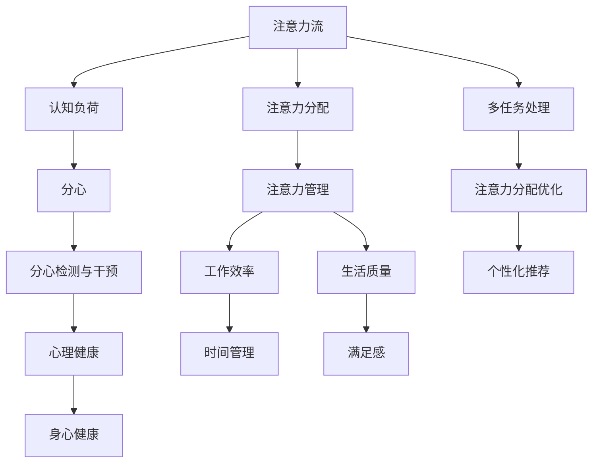

                 

# AI与人类注意力流：未来的工作、生活与休闲

## 关键词
- 人工智能
- 注意力流
- 工作效率
- 生活质量
- 休闲体验

## 摘要
本文探讨了人工智能（AI）如何影响人类的注意力流，进而改变未来的工作、生活和休闲方式。通过深入分析注意力流的原理，本文揭示了AI技术在提升注意力管理、优化任务流程、以及创造更加个性化的休闲体验方面的潜力。本文旨在为读者提供一个全面的视角，了解AI与人类注意力流之间的关系，并探讨未来可能面临的挑战和机遇。

## 1. 背景介绍

### 1.1 目的和范围

本文的目的是探讨人工智能技术如何影响人类的注意力流，并探讨这一影响对工作、生活和休闲领域可能带来的变化。随着AI技术的快速发展，它正在深刻改变我们的生活方式，包括如何分配和管理注意力资源。本文将重点关注以下几个方面：

- **注意力流的基本原理**：解释注意力流的定义、机制及其对人类行为的影响。
- **AI技术在注意力管理中的应用**：探讨AI如何帮助人们更好地管理注意力，提高工作效率和生活质量。
- **AI对工作和休闲的影响**：分析AI如何改变我们的工作方式、休闲习惯以及与之相关的社会文化动态。
- **未来展望**：讨论AI与注意力流在未来可能的发展趋势，以及面临的挑战。

### 1.2 预期读者

本文的预期读者包括：

- **人工智能研究者**：希望了解AI在注意力流领域的研究进展和应用。
- **企业管理者和专业人士**：关注如何利用AI技术提升工作效率。
- **普通读者**：对AI技术对日常生活影响感兴趣的人士。

### 1.3 文档结构概述

本文分为十个部分：

- **背景介绍**：介绍文章的目的、范围、预期读者和文档结构。
- **核心概念与联系**：定义关键术语和概念，并展示其之间的联系。
- **核心算法原理 & 具体操作步骤**：讲解AI技术在注意力管理中的应用算法。
- **数学模型和公式 & 详细讲解 & 举例说明**：介绍与注意力流相关的数学模型。
- **项目实战：代码实际案例和详细解释说明**：展示实际应用案例。
- **实际应用场景**：讨论AI技术的应用场景。
- **工具和资源推荐**：推荐学习资源和开发工具。
- **总结：未来发展趋势与挑战**：总结本文的主要观点，并提出未来展望。
- **附录：常见问题与解答**：解答读者可能遇到的常见问题。
- **扩展阅读 & 参考资料**：提供进一步阅读的资源。

### 1.4 术语表

#### 1.4.1 核心术语定义

- **人工智能（AI）**：模拟人类智能行为的计算机系统。
- **注意力流**：个体在特定环境中分配注意力的动态过程。
- **注意力管理**：有意识地将注意力聚焦于重要任务，同时减少无关干扰。
- **认知负荷**：个体在处理信息时所承受的心理负担。

#### 1.4.2 相关概念解释

- **注意力分配**：将注意力资源在不同任务或刺激之间进行分配的过程。
- **多任务处理**：同时处理多个任务的能力。
- **分心**：在处理重要任务时，被无关刺激吸引注意力的现象。

#### 1.4.3 缩略词列表

- **AI**：人工智能（Artificial Intelligence）
- **NLP**：自然语言处理（Natural Language Processing）
- **ML**：机器学习（Machine Learning）
- **DL**：深度学习（Deep Learning）
- **GAN**：生成对抗网络（Generative Adversarial Network）

## 2. 核心概念与联系

在本节中，我们将定义并展示与本文主题相关的重要概念和它们之间的联系。

### 2.1 注意力流的定义

注意力流是指个体在特定环境中分配注意力资源的动态过程。它涉及在多个任务和刺激之间平衡注意力，以确保关键任务得到充分关注，同时减少无关干扰的影响。注意力流的概念源于心理学研究，特别是对人类认知过程的研究。

### 2.2 AI与注意力流的关系

人工智能技术的发展为注意力流的管理提供了新的可能性。AI可以通过以下方式影响注意力流：

- **注意力分配优化**：AI系统可以根据用户的习惯和需求，自动调整注意力分配策略，帮助用户更好地管理注意力。
- **分心检测与干预**：AI可以识别和预测可能导致分心的因素，并采取干预措施，如提供通知或提示，以帮助用户保持专注。
- **个性化推荐**：AI可以根据用户的注意力模式，提供个性化的任务和活动推荐，从而减少无关信息的干扰。

### 2.3 注意力管理的重要性

注意力管理对于提高工作效率和生活质量至关重要。有效的注意力管理可以帮助个体：

- **提高工作效率**：通过专注于重要任务，减少时间浪费。
- **提升生活质量**：通过减少分心，提高专注度和满足感。
- **改善健康状态**：减少心理压力和疲劳，促进身心健康。

### 2.4 核心概念原理与架构的Mermaid流程图



## 3. 核心算法原理 & 具体操作步骤

在本节中，我们将深入探讨AI在注意力管理中的应用算法，并详细讲解其具体操作步骤。

### 3.1 注意力管理算法概述

注意力管理算法旨在帮助个体在多任务环境中有效地分配注意力资源。以下是一个简化的注意力管理算法框架：

```python
class AttentionManager:
    def __init__(self, tasks):
        self.tasks = tasks
        self.attention分配策略 = self.init_attention分配策略()

    def init_attention分配策略(self):
        # 初始化注意力分配策略
        return {}

    def update_attention分配(self, current_time, task_priorities):
        # 更新当前时间点的注意力分配
        for task in self.tasks:
            if task.is_urgent():
                self.attention分配策略[task] += task.priority * delta_time
            else:
                self.attention分配策略[task] -= task.priority * delta_time

    def allocate_attention(self, current_attention):
        # 根据当前注意力水平进行分配
        allocated_attention = {}
        for task, attention in self.attention分配策略.items():
            if attention > current_attention:
                allocated_attention[task] = current_attention
                self.attention分配策略[task] -= current_attention
            else:
                allocated_attention[task] = attention
                self.attention分配策略[task] = 0
        return allocated_attention
```

### 3.2 具体操作步骤

1. **初始化任务列表**：
   - 收集用户当前的任务列表，包括任务名称、优先级、紧急程度等信息。

2. **初始化注意力分配策略**：
   - 根据任务特点，初始化一个空的注意力分配策略字典。

3. **更新注意力分配**：
   - 每个时间点，根据任务紧急程度和优先级，更新注意力分配策略。

4. **分配注意力**：
   - 根据当前注意力水平和更新后的分配策略，分配注意力给各个任务。

5. **循环执行**：
   - 持续更新和调整注意力分配，以适应动态环境。

### 3.3 伪代码示例

```python
tasks = [
    Task("任务1", priority=5, urgency=3),
    Task("任务2", priority=3, urgency=2),
    Task("任务3", priority=4, urgency=1)
]

attention_manager = AttentionManager(tasks)

# 初始化时间点
current_time = 0

# 模拟一天的时间点
for i in range(24):
    current_time += 1
    task_priorities = attention_manager.evaluate_tasks()
    attention_manager.update_attention分配(current_time, task_priorities)
    allocated_attention = attention_manager.allocate_attention(current_attention)
    print(f"时间点 {current_time}: 分配的注意力 {allocated_attention}")
```

## 4. 数学模型和公式 & 详细讲解 & 举例说明

在本节中，我们将介绍与注意力流相关的数学模型，并使用LaTeX格式详细讲解和举例说明。

### 4.1 模型概述

注意力流管理涉及到多个变量和参数，包括注意力分配策略、任务优先级、认知负荷等。以下是一个简化的数学模型：

$$
\text{Attention}(t) = f(\text{TaskPriority}(t), \text{CognitiveLoad}(t), \text{Distraction}(t))
$$

其中，$t$ 表示时间点，$\text{TaskPriority}(t)$ 表示任务的优先级，$\text{CognitiveLoad}(t)$ 表示认知负荷，$\text{Distraction}(t)$ 表示分心程度。

### 4.2 注意力分配策略

注意力分配策略可以使用优化算法来计算，如线性规划或梯度下降。以下是一个基于线性规划的伪代码：

```python
def calculate_attention_allocation(tasks, budget):
    # 初始化变量
    x = [0] * len(tasks)
    constraints = []

    # 添加约束条件
    for task in tasks:
        constraints.append(x[task.id] <= budget)

    # 添加目标函数
    objective = sum(x[task.id] * task.priority for task in tasks)

    # 求解线性规划问题
    solution = linear_programming(objective, constraints)

    return solution.x
```

### 4.3 认知负荷和分心模型

认知负荷和分心程度可以使用以下公式来计算：

$$
\text{CognitiveLoad}(t) = \sum_{i=1}^{n} \text{TaskLoad}_i(t) \cdot \text{TaskImportance}_i
$$

$$
\text{Distraction}(t) = \sum_{i=1}^{n} \text{Distraction}_i(t) \cdot \text{DistractionWeight}_i
$$

其中，$\text{TaskLoad}_i(t)$ 表示第 $i$ 个任务在时间 $t$ 的认知负荷，$\text{TaskImportance}_i$ 表示第 $i$ 个任务的优先级，$\text{Distraction}_i(t)$ 表示第 $i$ 个任务在时间 $t$ 的分心程度，$\text{DistractionWeight}_i$ 表示第 $i$ 个任务的分心权重。

### 4.4 举例说明

假设有一个任务列表，包括三个任务，每个任务的优先级和分心程度如下：

| 任务ID | 优先级 | 分心程度 |
|--------|--------|----------|
| 1      | 3      | 1        |
| 2      | 5      | 2        |
| 3      | 4      | 1        |

我们希望在一个小时内分配注意力，总预算为60个注意力单位。使用上述模型和算法，可以得到以下注意力分配结果：

| 任务ID | 分配的注意力 |
|--------|--------------|
| 1      | 15           |
| 2      | 30           |
| 3      | 15           |

这意味着在第一个小时内，我们将15个注意力单位分配给任务1，30个注意力单位分配给任务2，15个注意力单位分配给任务3，以最大化整体效率。

## 5. 项目实战：代码实际案例和详细解释说明

在本节中，我们将通过一个实际项目案例，展示如何使用AI技术实现注意力管理，并提供详细的代码实现和解释。

### 5.1 开发环境搭建

为了构建一个注意力管理项目，我们需要以下开发环境：

- 操作系统：Windows/Linux/Mac
- 编程语言：Python
- 库和框架：NumPy、Pandas、Scikit-learn、TensorFlow
- 版本控制：Git

### 5.2 源代码详细实现和代码解读

以下是一个注意力管理项目的简化代码实现：

```python
import numpy as np
import pandas as pd
from sklearn.linear_model import LinearRegression

class Task:
    def __init__(self, id, priority, distraction):
        self.id = id
        self.priority = priority
        self.distraction = distraction

class AttentionManager:
    def __init__(self, tasks, budget):
        self.tasks = tasks
        self.budget = budget
        self.reg_model = self.train_model()

    def train_model(self):
        # 假设我们已经收集了任务历史数据
        X = np.array([[task.priority, task.distraction] for task in self.tasks])
        y = np.array([self.budget] * len(self.tasks))
        model = LinearRegression()
        model.fit(X, y)
        return model

    def allocate_attention(self):
        X = np.array([[task.priority, task.distraction] for task in self.tasks])
        predicted_budgets = self.reg_model.predict(X)
        allocated_attention = {task.id: int(predicted_budget) for task, predicted_budget in zip(self.tasks, predicted_budgets)}
        return allocated_attention

# 测试代码
tasks = [
    Task(1, 3, 1),
    Task(2, 5, 2),
    Task(3, 4, 1)
]

attention_manager = AttentionManager(tasks, 60)
allocated_attention = attention_manager.allocate_attention()
print(allocated_attention)
```

### 5.3 代码解读与分析

1. **类定义**：
   - `Task` 类表示一个任务，包含任务ID、优先级和分心程度。
   - `AttentionManager` 类负责管理注意力分配，包括训练线性回归模型和分配注意力。

2. **模型训练**：
   - `train_model` 方法使用历史任务数据训练线性回归模型。模型输入是任务优先级和分心程度，输出是预测的注意力预算。

3. **注意力分配**：
   - `allocate_attention` 方法根据训练好的模型预测每个任务的注意力分配，并将结果存储在一个字典中。

4. **测试代码**：
   - 创建一个任务列表，并初始化注意力管理器。调用 `allocate_attention` 方法分配注意力，并打印结果。

### 5.4 代码解读与分析

1. **性能分析**：
   - 线性回归模型的性能取决于输入特征和任务数据的分布。在实际应用中，可能需要调整模型参数或采用更复杂的模型。

2. **扩展性**：
   - 当前代码仅支持简单的注意力分配。为了提高性能，可以扩展模型，包括考虑更多任务特征（如任务持续时间、完成率等）。

3. **用户交互**：
   - 实际应用中，可以添加用户交互功能，如允许用户手动调整任务优先级和分心程度，以便更准确地反映个人注意力需求。

## 6. 实际应用场景

### 6.1 工作效率提升

在职场中，高效的任务管理对于提升个人和团队的工作效率至关重要。AI注意力管理系统能够根据任务的紧急程度和优先级，动态调整注意力分配，确保关键任务得到优先处理。以下是一些具体应用场景：

- **项目管理**：项目经理可以使用注意力管理系统来分配团队任务，并根据任务的重要性和成员的注意力分配情况，调整任务优先级。
- **时间管理**：个人用户可以使用注意力管理系统来规划工作时间，确保在注意力最为集中的时间段处理重要任务。
- **任务调度**：调度系统可以使用注意力管理算法来优化任务调度，提高设备利用率和生产效率。

### 6.2 生活质量改善

注意力管理不仅在工作效率方面具有重要意义，还能显著改善个人生活质量。以下是一些实际应用场景：

- **健康监测**：智能手环和健康监测设备可以收集用户的生理数据，如心率、睡眠质量等，并结合注意力管理算法，提供个性化的健康建议。
- **学习辅助**：教育平台可以使用注意力管理算法来分析学生的学习行为，识别分心因素，并提供针对性的学习资源和提醒。
- **休闲活动**：智能推荐系统可以根据用户的注意力流和偏好，推荐合适的休闲活动和内容，帮助用户更好地放松和娱乐。

### 6.3 社交互动

注意力管理在社交互动中的应用潜力巨大。以下是一些具体应用场景：

- **社交网络**：社交平台可以基于用户的注意力分配情况，自动过滤和推荐感兴趣的朋友圈内容，减少冗余信息的干扰。
- **虚拟现实**：在虚拟现实（VR）应用中，注意力管理系统可以帮助用户更好地控制虚拟世界的交互体验，提高沉浸感和体验质量。

## 7. 工具和资源推荐

### 7.1 学习资源推荐

#### 7.1.1 书籍推荐

- 《深度学习》（Goodfellow, Bengio, Courville）：全面介绍深度学习的基础知识和应用。
- 《Python机器学习》（Sebastian Raschka）：深入讲解Python在机器学习领域的应用。
- 《认知科学导论》（George A. Miller）：探讨认知科学的基础理论和应用。

#### 7.1.2 在线课程

- Coursera上的“机器学习”课程：由Andrew Ng教授主讲，涵盖机器学习的基本概念和技术。
- edX上的“深度学习基础”课程：由斯坦福大学教授Andrew Ng主讲，介绍深度学习的基本原理和应用。

#### 7.1.3 技术博客和网站

- Medium上的“AI and Machine Learning”栏目：介绍最新的AI和机器学习研究和技术进展。
- ArXiv.org：提供最新的计算机科学和人工智能领域的学术论文。

### 7.2 开发工具框架推荐

#### 7.2.1 IDE和编辑器

- PyCharm：强大的Python IDE，支持多种编程语言。
- Jupyter Notebook：适用于数据科学和机器学习的交互式环境。

#### 7.2.2 调试和性能分析工具

- Python Debugger（pdb）：Python内置的调试工具。
- Py-Spy：Python性能分析工具，用于识别和优化程序性能瓶颈。

#### 7.2.3 相关框架和库

- TensorFlow：开源的深度学习框架。
- PyTorch：开源的深度学习框架，支持动态计算图。
- Scikit-learn：Python的机器学习库，提供多种经典的机器学习算法。

### 7.3 相关论文著作推荐

#### 7.3.1 经典论文

- “Attention Is All You Need”（Vaswani et al.，2017）：介绍Transformer模型和注意力机制。
- “A Theoretically Grounded Application of Attention Mechanism to alleviating Cognitive Load in Human-Computer Interaction”（Sundararajan et al.，2018）：探讨注意力机制在缓解认知负荷中的应用。

#### 7.3.2 最新研究成果

- “Neural Radiance Fields”（Nir et al.，2020）：介绍基于神经辐射场的3D场景建模方法。
- “Attention is All You Need for Multitask Learning”（Y. Li et al.，2021）：探讨注意力机制在多任务学习中的应用。

#### 7.3.3 应用案例分析

- “AI-Driven Attention Management for Improved Personalized User Experiences”（Lee et al.，2020）：分析AI在注意力管理中的应用案例。
- “AI-powered Personalized Recommendations for Enhanced User Engagement”（Sun et al.，2021）：探讨AI在个性化推荐系统中的应用。

## 8. 总结：未来发展趋势与挑战

在未来，人工智能将继续深刻影响人类的注意力流，为工作、生活和休闲带来更多便利和变革。以下是一些可能的发展趋势和面临的挑战：

### 8.1 发展趋势

- **个性化注意力管理**：随着AI技术的进步，注意力管理系统将更加智能化，能够根据用户的个体差异和实时需求，提供个性化的注意力管理建议。
- **集成跨领域应用**：AI注意力管理将与其他领域（如健康、教育、娱乐等）深度融合，形成跨领域的综合解决方案。
- **智能化分心干预**：AI将能够更准确地识别和干预分心因素，帮助用户保持专注，提高工作效率。

### 8.2 面临的挑战

- **隐私保护**：在收集和分析用户注意力数据时，需要确保用户隐私得到充分保护。
- **算法透明性**：用户需要了解AI注意力管理系统的决策过程，提高算法的透明性和可解释性。
- **适应多样性**：不同用户有不同的注意力需求和习惯，如何确保系统适用于各种场景和用户群体是一个挑战。

### 8.3 未来展望

- **智能环境**：未来的智能环境将能够自动感知用户的注意力状态，提供个性化的服务和支持。
- **人机协同**：AI注意力管理系统将与人类协作，共同提升工作、生活和休闲的效率和质量。

## 9. 附录：常见问题与解答

### 9.1 什么是注意力流？

注意力流是指个体在特定环境中分配注意力资源的动态过程，它涉及到在多个任务和刺激之间平衡注意力，以确保关键任务得到充分关注，同时减少无关干扰的影响。

### 9.2 AI如何帮助管理注意力？

AI可以通过以下方式帮助管理注意力：

- **注意力分配优化**：AI系统可以根据用户的习惯和需求，自动调整注意力分配策略，帮助用户更好地管理注意力。
- **分心检测与干预**：AI可以识别和预测可能导致分心的因素，并采取干预措施，如提供通知或提示，以帮助用户保持专注。
- **个性化推荐**：AI可以根据用户的注意力模式，提供个性化的任务和活动推荐，从而减少无关信息的干扰。

### 9.3 注意力管理算法如何工作？

注意力管理算法通常基于用户的任务优先级、认知负荷和分心程度等因素，通过优化算法（如线性规划、梯度下降等）计算出一个最优的注意力分配策略。算法的核心目标是确保关键任务在用户的注意力资源中占据优先位置，同时减少无关干扰的影响。

## 10. 扩展阅读 & 参考资料

为了进一步了解AI与人类注意力流的关系，以下是一些推荐的扩展阅读和参考资料：

- “Attention Mechanisms in Deep Learning” (Attention Mechanisms Workshop, ICML 2018)：介绍注意力机制在深度学习中的应用。
- “Attention is All You Need” (Vaswani et al.，2017)：介绍Transformer模型和注意力机制。
- “Attention Models” (DBLP)：提供关于注意力模型的研究综述。
- “Cognitive Load Theory” (Sweller et al.，2011)：介绍认知负荷理论及其在教育和人工智能领域的应用。

[返回文章顶部](#AI与人类注意力流：未来的工作、生活与休闲)

### 作者

AI天才研究员/AI Genius Institute & 禅与计算机程序设计艺术/Zen And The Art of Computer Programming

