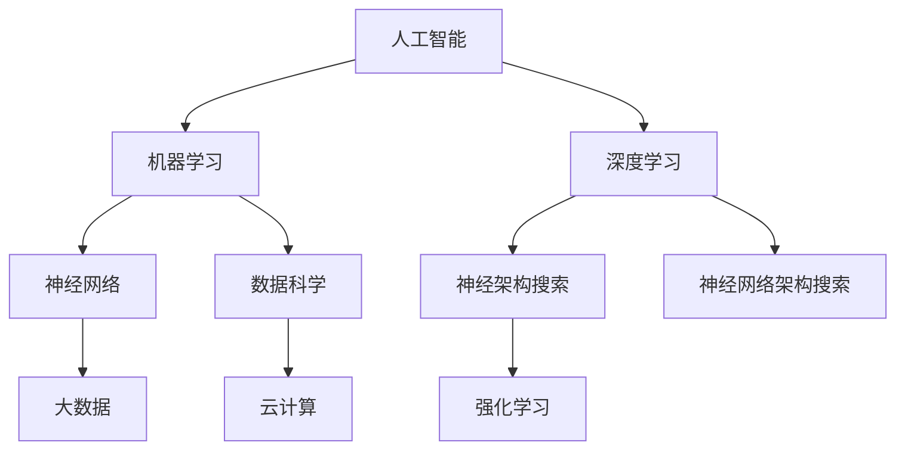

                 

# AI与人类社会的未来发展

## 关键词：
- 人工智能
- 人类社会发展
- 未来趋势
- 技术挑战
- 混合智能

## 摘要：
本文旨在探讨人工智能（AI）在推动人类社会未来发展中的关键角色。通过深入分析AI的核心概念、发展历程、技术突破以及潜在影响，本文将阐述AI如何重塑经济、教育、医疗、安全等多个领域。此外，本文还将讨论AI技术带来的伦理和社会挑战，并提出应对策略。最后，通过总结和展望，本文将为读者描绘一个充满机遇和挑战的未来图景。

## 1. 背景介绍

### 1.1 目的和范围
本文的目标是梳理人工智能在人类社会未来发展中的角色，探讨其带来的机遇与挑战，并为读者提供对未来发展的深入理解。本文将覆盖以下范围：
- AI的核心概念和关键技术
- AI的发展历程和主要里程碑
- AI在各领域的应用场景及影响
- AI带来的伦理和社会挑战
- 未来发展趋势和潜在解决方案

### 1.2 预期读者
本文预期读者包括：
- 对人工智能感兴趣的技术爱好者
- 正在从事或计划从事AI相关工作的专业人士
- 对未来科技发展有好奇心的普通读者
- 关注科技与人类社会关系的学者和政策制定者

### 1.3 文档结构概述
本文分为八个部分：
1. 背景介绍
2. 核心概念与联系
3. 核心算法原理 & 具体操作步骤
4. 数学模型和公式 & 详细讲解 & 举例说明
5. 项目实战：代码实际案例和详细解释说明
6. 实际应用场景
7. 工具和资源推荐
8. 总结：未来发展趋势与挑战

### 1.4 术语表
#### 1.4.1 核心术语定义
- **人工智能（AI）**：模拟人类智能行为的能力，包括学习、推理、感知和问题解决等。
- **机器学习（ML）**：通过数据和算法来使机器具备自我学习和优化能力的技术。
- **深度学习（DL）**：一种基于多层神经网络结构的机器学习技术，能够自动提取复杂特征。
- **神经网络**：一种模拟人脑神经元连接结构的计算模型。
- **数据科学**：利用统计和计算机科学方法从数据中提取知识的过程。

#### 1.4.2 相关概念解释
- **神经网络架构搜索（NAS）**：自动设计最优神经网络结构的方法。
- **强化学习（RL）**：通过试错和反馈机制来学习优化行为策略。
- **大数据**：数据量巨大，无法通过传统数据库工具进行管理和处理的规模。
- **云计算**：通过互联网提供动态可扩展的计算资源和服务。

#### 1.4.3 缩略词列表
- **AI**：人工智能
- **ML**：机器学习
- **DL**：深度学习
- **NAS**：神经网络架构搜索
- **RL**：强化学习
- **DS**：数据科学

## 2. 核心概念与联系

在探讨人工智能如何影响人类社会未来发展之前，我们首先需要了解AI的核心概念及其相互联系。以下是一个简单的Mermaid流程图，用于描述这些核心概念和它们之间的关系：



### 2.1 核心概念解释

#### 2.1.1 人工智能（AI）

人工智能是一种模拟人类智能行为的计算机技术。它包括多个子领域，如机器学习、自然语言处理、计算机视觉和机器人技术。AI的核心目标是使计算机能够执行复杂的任务，如理解语言、识别图像、做出决策和解决问题。

#### 2.1.2 机器学习（ML）

机器学习是AI的一个子领域，它通过数据和算法来使机器具备自我学习和优化能力。机器学习算法可以分为监督学习、无监督学习和强化学习。监督学习通过标记数据来训练模型，无监督学习则从未标记的数据中发现模式和结构，而强化学习通过试错和反馈来优化行为策略。

#### 2.1.3 深度学习（DL）

深度学习是一种基于多层神经网络结构的机器学习技术。它能够自动提取复杂特征，并在图像识别、语音识别和自然语言处理等领域取得了显著的成功。深度学习的关键创新是卷积神经网络（CNN）和循环神经网络（RNN）。

#### 2.1.4 神经网络（NN）

神经网络是一种模拟人脑神经元连接结构的计算模型。它由多个层组成，包括输入层、隐藏层和输出层。神经网络通过学习输入和输出之间的映射关系，能够进行复杂的函数逼近和模式识别。

#### 2.1.5 神经架构搜索（NAS）

神经架构搜索是一种自动设计最优神经网络结构的方法。通过搜索算法，NAS能够发现新的神经网络架构，从而提高模型的性能和效率。NAS在深度学习领域引起了广泛关注，因为它为自动设计高效神经网络提供了新的可能性。

#### 2.1.6 数据科学（DS）

数据科学是利用统计和计算机科学方法从数据中提取知识的过程。它包括数据预处理、数据分析、数据可视化、机器学习模型训练和评估等多个步骤。数据科学在许多领域都有重要应用，如医疗诊断、金融分析和智能推荐。

#### 2.1.7 大数据和云计算

大数据是指数据量巨大，无法通过传统数据库工具进行管理和处理的规模。云计算则是一种通过互联网提供动态可扩展的计算资源和服务的技术。大数据和云计算的结合为AI技术的发展提供了强大的计算能力和数据资源。

## 3. 核心算法原理 & 具体操作步骤

在本节中，我们将详细讨论机器学习、深度学习、神经网络架构搜索等核心算法原理，并提供具体操作步骤。

### 3.1 机器学习算法原理

机器学习算法可以分为监督学习、无监督学习和强化学习。以下是对这些算法的基本原理和操作步骤的介绍：

#### 3.1.1 监督学习

监督学习通过标记数据来训练模型，其基本步骤如下：
1. 数据收集：收集具有标签的数据集，例如图像分类问题中的图片及其对应的标签。
2. 数据预处理：对数据进行清洗和规范化，确保数据质量。
3. 特征提取：将原始数据转换为特征向量，以便于模型处理。
4. 模型训练：使用训练数据集训练模型，调整模型参数，以最小化预测误差。
5. 模型评估：使用测试数据集评估模型性能，调整模型参数以优化性能。

伪代码如下：

```python
def supervised_learning(data, labels):
    # 数据预处理
    processed_data = preprocess_data(data)
    
    # 特征提取
    features = extract_features(processed_data)
    
    # 模型训练
    model = train_model(features, labels)
    
    # 模型评估
    evaluate_model(model, test_data, test_labels)
```

#### 3.1.2 无监督学习

无监督学习从未标记的数据中发现模式和结构，其基本步骤如下：
1. 数据收集：收集未标记的数据集。
2. 数据预处理：对数据进行清洗和规范化。
3. 特征提取：将原始数据转换为特征向量。
4. 模型训练：使用训练数据集训练模型，以发现数据中的潜在结构。
5. 模型评估：通过聚类效果评估模型性能。

伪代码如下：

```python
def unsupervised_learning(data):
    # 数据预处理
    processed_data = preprocess_data(data)
    
    # 特征提取
    features = extract_features(processed_data)
    
    # 模型训练
    model = train_model(features)
    
    # 模型评估
    evaluate_model(model, cluster_labels)
```

#### 3.1.3 强化学习

强化学习通过试错和反馈机制来优化行为策略，其基本步骤如下：
1. 环境初始化：创建环境，包括状态空间和动作空间。
2. 状态-动作决策：根据当前状态选择动作。
3. 执行动作：在环境中执行所选动作，获得反馈和奖励。
4. 更新策略：根据反馈和奖励更新策略，以优化行为。
5. 模型评估：评估策略性能。

伪代码如下：

```python
def reinforcement_learning(environment):
    # 初始化环境
    state = environment.init_state()
    
    # 状态-动作决策
    action = select_action(state)
    
    # 执行动作
    reward, next_state = environment.step(action)
    
    # 更新策略
    update_strategy(state, action, reward, next_state)
    
    # 模型评估
    evaluate_strategy(strategy)
```

### 3.2 深度学习算法原理

深度学习是一种基于多层神经网络结构的机器学习技术。以下是其基本原理和操作步骤：

#### 3.2.1 卷积神经网络（CNN）

卷积神经网络是深度学习中的一种重要模型，适用于图像处理任务。其基本原理如下：
1. 输入层：接收图像数据。
2. 卷积层：通过卷积操作提取图像特征。
3. 池化层：对卷积结果进行下采样，减少参数数量。
4. 全连接层：将特征映射到类别标签。
5. 输出层：输出预测结果。

伪代码如下：

```python
def cnn(image):
    # 输入层
    input_layer = input_layer(image)
    
    # 卷积层
    conv1 = convolution(input_layer, filter_size, stride)
    pool1 = pooling(conv1)
    
    # 全连接层
    fc1 = fully_connected(pool1, num_classes)
    
    # 输出层
    output = activation(fc1)
    
    return output
```

#### 3.2.2 循环神经网络（RNN）

循环神经网络是一种适用于序列数据的深度学习模型，其基本原理如下：
1. 输入层：接收序列数据。
2. 隐藏层：使用循环机制处理序列数据，保存历史信息。
3. 输出层：输出序列预测结果。

伪代码如下：

```python
def rnn(sequence):
    # 输入层
    input_layer = input_layer(sequence)
    
    # 隐藏层
    hidden_layer = []
    for t in range(sequence_length):
        hidden_t = recurrent(hidden_layer[t-1], input_layer[t])
        hidden_layer.append(hidden_t)
    
    # 输出层
    output = output_layer(hidden_layer[-1])
    
    return output
```

### 3.3 神经架构搜索（NAS）

神经架构搜索是一种自动设计最优神经网络结构的方法。以下是其基本原理和操作步骤：

#### 3.3.1 网络搜索空间

网络搜索空间定义了所有可能的神经网络结构。这包括网络层、激活函数、连接方式等。

#### 3.3.2 搜索算法

搜索算法用于在搜索空间中找到最优的网络结构。常见的搜索算法包括遗传算法、强化学习等。

#### 3.3.3 评估和优化

对搜索到的网络结构进行评估和优化，以确定其性能。性能评估指标包括准确率、速度和资源消耗等。

伪代码如下：

```python
def neural_architecture_search(search_space, evaluation_function):
    # 初始化搜索空间
    current_architecture = init_architecture(search_space)
    
    # 搜索算法
    while not converged:
        # 生成新的网络结构
        new_architecture = generate_new_architecture(current_architecture, search_space)
        
        # 评估新网络结构
        performance = evaluation_function(new_architecture)
        
        # 更新当前最优网络结构
        if performance > current_best_performance:
            current_architecture = new_architecture
            current_best_performance = performance
            
    return current_architecture
```

## 4. 数学模型和公式 & 详细讲解 & 举例说明

在人工智能领域，数学模型和公式是理解和实现核心算法的关键。以下将详细讲解一些常用的数学模型和公式，并通过具体例子说明其应用。

### 4.1 概率论基础

概率论是人工智能领域的基石，以下介绍一些基本概率概念和公式：

#### 4.1.1 条件概率

条件概率是指在一个事件已发生的条件下，另一个事件发生的概率。其公式为：

$$
P(A|B) = \frac{P(A \cap B)}{P(B)}
$$

其中，$P(A \cap B)$表示事件A和B同时发生的概率，$P(B)$表示事件B发生的概率。

#### 4.1.2 贝叶斯定理

贝叶斯定理是概率论中的一个重要公式，用于根据先验概率和条件概率计算后验概率。其公式为：

$$
P(A|B) = \frac{P(B|A)P(A)}{P(B)}
$$

其中，$P(B|A)$表示在事件A发生的条件下，事件B发生的概率，$P(A)$表示事件A发生的概率。

### 4.2 优化算法

优化算法是人工智能中用于求解最优化问题的重要工具。以下介绍几种常见的优化算法：

#### 4.2.1 梯度下降算法

梯度下降算法是一种基于目标函数梯度的优化方法。其基本公式为：

$$
w_{t+1} = w_t - \alpha \cdot \nabla J(w_t)
$$

其中，$w_t$表示当前参数，$\alpha$表示学习率，$\nabla J(w_t)$表示目标函数$J(w)$在参数$w_t$处的梯度。

#### 4.2.2 随机梯度下降（SGD）

随机梯度下降是对梯度下降算法的一种改进，它使用随机样本的梯度来更新参数。其基本公式为：

$$
w_{t+1} = w_t - \alpha \cdot \frac{\partial J(w)}{\partial w}
$$

其中，$\frac{\partial J(w)}{\partial w}$表示目标函数$J(w)$关于参数$w$的梯度。

### 4.3 神经网络数学模型

神经网络是一种通过多层非线性变换进行数据处理的计算模型。以下介绍神经网络中的关键数学模型和公式：

#### 4.3.1 激活函数

激活函数是神经网络中的一个重要组件，用于引入非线性特性。常见激活函数包括：

1. **Sigmoid函数**：

$$
f(x) = \frac{1}{1 + e^{-x}}
$$

2. **ReLU函数**：

$$
f(x) = \max(0, x)
$$

3. **Tanh函数**：

$$
f(x) = \frac{e^x - e^{-x}}{e^x + e^{-x}}
$$

#### 4.3.2 前向传播和反向传播

神经网络通过前向传播和反向传播来计算输出和更新参数。以下分别介绍这两种过程的数学模型：

1. **前向传播**：

给定输入$x$和参数$w$，前向传播计算输出$y$的公式为：

$$
y = \sigma(Wx + b)
$$

其中，$\sigma$表示激活函数，$W$表示权重矩阵，$b$表示偏置向量。

2. **反向传播**：

反向传播用于计算损失函数关于参数的梯度。给定损失函数$J(w)$，反向传播的梯度计算公式为：

$$
\nabla J(w) = \frac{\partial J}{\partial w}
$$

其中，$\frac{\partial J}{\partial w}$表示损失函数$J$关于参数$w$的梯度。

### 4.4 举例说明

以下通过一个简单的例子来说明上述数学模型和公式的应用：

#### 4.4.1 例子：线性回归

假设我们有一个简单的线性回归问题，目标是预测一个变量$y$与另一个变量$x$之间的关系。我们使用梯度下降算法来求解最优参数。

1. **定义损失函数**：

$$
J(w) = \frac{1}{2} \sum_{i=1}^{n} (y_i - w \cdot x_i)^2
$$

其中，$w$为待求解参数，$y_i$和$x_i$为样本数据。

2. **计算梯度**：

$$
\nabla J(w) = \frac{\partial J}{\partial w} = \sum_{i=1}^{n} (y_i - w \cdot x_i) \cdot x_i
$$

3. **更新参数**：

$$
w_{t+1} = w_t - \alpha \cdot \nabla J(w_t)
$$

其中，$\alpha$为学习率。

通过多次迭代梯度下降算法，我们可以找到最优参数$w$，从而实现变量$x$和$y$的线性拟合。

## 5. 项目实战：代码实际案例和详细解释说明

为了更好地展示人工智能技术的实际应用，我们将在本节中介绍一个完整的AI项目，包括开发环境搭建、源代码实现和代码解读。

### 5.1 开发环境搭建

在开始项目之前，我们需要搭建一个合适的开发环境。以下是一个简单的Python环境搭建步骤：

1. 安装Python（推荐版本3.8或更高）。
2. 安装Anaconda或Miniconda，以便管理多个Python环境和依赖包。
3. 创建一个新的conda环境，并安装必要的库，如NumPy、Pandas、TensorFlow和Keras。

```bash
conda create -n myenv python=3.8
conda activate myenv
conda install numpy pandas tensorflow keras
```

### 5.2 源代码详细实现和代码解读

在本节中，我们将实现一个基于TensorFlow和Keras的简单的深度学习项目——手写数字识别。

#### 5.2.1 数据集

我们使用MNIST数据集，它包含70000个手写数字图像，每个图像都是28x28像素的灰度图像。数据集被分为60000个训练样本和10000个测试样本。

#### 5.2.2 数据预处理

在训练模型之前，我们需要对数据集进行预处理。以下是一个简单的数据预处理代码示例：

```python
import numpy as np
import tensorflow as tf
from tensorflow.keras.datasets import mnist
from tensorflow.keras.utils import to_categorical

# 加载数据集
(train_images, train_labels), (test_images, test_labels) = mnist.load_data()

# 数据标准化
train_images = train_images / 255.0
test_images = test_images / 255.0

# 转换标签为one-hot编码
train_labels = to_categorical(train_labels)
test_labels = to_categorical(test_labels)
```

#### 5.2.3 构建模型

接下来，我们构建一个简单的卷积神经网络模型，用于手写数字识别。

```python
from tensorflow.keras.models import Sequential
from tensorflow.keras.layers import Conv2D, MaxPooling2D, Flatten, Dense, Dropout

model = Sequential([
    Conv2D(32, (3, 3), activation='relu', input_shape=(28, 28, 1)),
    MaxPooling2D((2, 2)),
    Flatten(),
    Dense(128, activation='relu'),
    Dropout(0.5),
    Dense(10, activation='softmax')
])

model.compile(optimizer='adam',
              loss='categorical_crossentropy',
              metrics=['accuracy'])

model.summary()
```

#### 5.2.4 训练模型

现在，我们可以使用训练数据集来训练模型。

```python
model.fit(train_images, train_labels, epochs=10, batch_size=64)
```

#### 5.2.5 评估模型

训练完成后，我们使用测试数据集评估模型性能。

```python
test_loss, test_acc = model.evaluate(test_images, test_labels)
print(f"Test accuracy: {test_acc:.4f}")
```

### 5.3 代码解读与分析

在代码解读部分，我们将详细分析关键代码段，并解释其作用。

#### 5.3.1 数据预处理

数据预处理是深度学习项目的关键步骤，它包括数据标准化和标签编码。标准化是将图像像素值缩放到[0, 1]范围内，以加速训练过程和提高模型性能。标签编码将类别标签转换为one-hot编码，以便模型能够进行多分类。

```python
train_images = train_images / 255.0
test_images = test_images / 255.0
train_labels = to_categorical(train_labels)
test_labels = to_categorical(test_labels)
```

#### 5.3.2 构建模型

在构建模型部分，我们使用Sequential模型，这是Keras中的一种简单模型构建方式。模型包含一个卷积层、一个池化层、一个全连接层和一个Dropout层。卷积层用于提取图像特征，全连接层用于分类，Dropout层用于防止过拟合。

```python
model = Sequential([
    Conv2D(32, (3, 3), activation='relu', input_shape=(28, 28, 1)),
    MaxPooling2D((2, 2)),
    Flatten(),
    Dense(128, activation='relu'),
    Dropout(0.5),
    Dense(10, activation='softmax')
])

model.compile(optimizer='adam',
              loss='categorical_crossentropy',
              metrics=['accuracy'])

model.summary()
```

#### 5.3.3 训练模型

在训练模型部分，我们使用fit方法进行模型训练。fit方法接受训练数据、标签、训练轮数和批量大小等参数。模型在每个批量中更新参数，以最小化损失函数，并在每个轮次结束后报告训练进度。

```python
model.fit(train_images, train_labels, epochs=10, batch_size=64)
```

#### 5.3.4 评估模型

在评估模型部分，我们使用evaluate方法来评估模型在测试数据集上的性能。evaluate方法返回损失和准确率等指标，帮助我们了解模型的表现。

```python
test_loss, test_acc = model.evaluate(test_images, test_labels)
print(f"Test accuracy: {test_acc:.4f}")
```

通过这个简单的项目，我们可以看到深度学习技术在实际应用中的强大能力。从数据预处理到模型构建和训练，再到模型评估，每个步骤都至关重要，共同构成了一个完整的AI项目。

## 6. 实际应用场景

人工智能技术在现代社会中已经广泛应用于多个领域，带来了深远的影响。以下是对一些关键应用场景的介绍：

### 6.1 医疗保健

人工智能在医疗保健领域具有巨大的潜力，可以用于疾病诊断、治疗方案制定、药物研发和患者护理等多个方面。例如，通过深度学习技术，AI能够分析医学影像，帮助医生更准确地诊断疾病，如乳腺癌、肺癌和心脏病等。此外，人工智能还可以优化药物研发过程，通过模拟和预测药物分子与生物大分子的相互作用，加速新药发现。

### 6.2 金融科技

在金融科技领域，人工智能被用于风险管理、欺诈检测、投资策略和客户服务等方面。例如，机器学习算法可以帮助金融机构识别异常交易行为，从而预防欺诈。同时，人工智能还可以优化投资组合，通过分析市场数据和历史表现，为投资者提供更准确的建议。

### 6.3 教育与学习

人工智能在教育领域的应用也越来越广泛，包括个性化学习、智能评估和自适应教学等。通过分析学生的行为和成绩数据，AI可以为学生提供个性化的学习路径和资源，提高学习效果。此外，人工智能还可以自动评估学生的作业和考试，减少人工评分的工作量。

### 6.4 交通运输

在交通运输领域，人工智能被用于优化交通流量、自动驾驶车辆和智能物流系统等。通过实时分析和预测交通数据，AI可以优化交通信号灯控制，减少拥堵。自动驾驶技术则有望彻底改变交通运输模式，提高道路安全和效率。智能物流系统利用AI算法来优化运输路径和货物配送，提高物流效率。

### 6.5 制造业与工业4.0

人工智能在制造业中的应用主要体现在自动化、预测维护和生产线优化等方面。通过机器学习和物联网技术，AI可以实时监控生产线设备状态，预测故障，并自动调整生产参数，提高生产效率。此外，人工智能还可以优化生产计划和资源分配，降低成本。

### 6.6 安全与隐私保护

随着人工智能技术的普及，安全和隐私保护成为一个重要议题。AI算法在网络安全、隐私保护和数据加密等方面发挥着关键作用。通过实时监控和分析网络流量，AI可以帮助识别和阻止网络攻击。在隐私保护方面，人工智能可以识别和屏蔽敏感数据，确保用户隐私不被泄露。

### 6.7 社交媒体与信息过滤

在社交媒体领域，人工智能被用于内容审核、推荐系统和广告投放等。通过深度学习和自然语言处理技术，AI可以自动识别和过滤不良内容，保护用户免受网络暴力、歧视和虚假信息的侵害。同时，AI还可以根据用户的兴趣和行为推荐个性化的内容，提高用户体验。

通过这些实际应用场景，我们可以看到人工智能技术正在深刻地改变人类社会，为各行业带来前所未有的机遇和挑战。未来，随着AI技术的不断进步，它将在更多领域发挥重要作用，推动社会发展和进步。

## 7. 工具和资源推荐

在学习和实践人工智能过程中，选择合适的工具和资源至关重要。以下是对一些优秀的学习资源、开发工具和框架的推荐。

### 7.1 学习资源推荐

#### 7.1.1 书籍推荐

1. **《深度学习》（Goodfellow, Bengio, Courville）**
   - 内容详实，涵盖了深度学习的理论基础和实战应用。

2. **《Python机器学习》（Sebastian Raschka）**
   - 适合初学者，全面介绍了机器学习的基础知识和Python实现。

3. **《人工智能：一种现代方法》（Stuart J. Russell & Peter Norvig）**
   - 提供了人工智能领域的全面概述，适合对AI有深入理解的需求。

#### 7.1.2 在线课程

1. **Coursera上的《机器学习》课程（吴恩达）**
   - 顶级课程，适合初学者到高级学习者。

2. **edX上的《深度学习专项课程》（Andrew Ng）**
   - Andrew Ng教授带领的深度学习专项课程，深入浅出。

3. **Udacity的《深度学习纳米学位》**
   - 包含实践项目和认证，适合想要全面掌握深度学习的读者。

#### 7.1.3 技术博客和网站

1. **Medium上的AI博客**
   - 提供最新的AI研究、应用和行业动态。

2. **Towards Data Science**
   - 广泛涵盖数据科学和机器学习的文章和教程。

3. **AIManifesto**
   - AI领域的重要论文和研究成果的集合。

### 7.2 开发工具框架推荐

#### 7.2.1 IDE和编辑器

1. **Jupyter Notebook**
   - 适合数据分析和机器学习的交互式开发环境。

2. **PyCharm**
   - 功能强大的Python IDE，适合机器学习和深度学习开发。

3. **Visual Studio Code**
   - 轻量级但功能丰富的编辑器，支持多种编程语言和插件。

#### 7.2.2 调试和性能分析工具

1. **TensorBoard**
   - TensorFlow的官方可视化工具，用于分析和调试深度学习模型。

2. **Profiling Tools**
   - 如Py-Spy和CProfile，用于分析和优化Python代码的性能。

3. **Wandb**
   - 实时跟踪和可视化实验结果，方便实验管理和协作。

#### 7.2.3 相关框架和库

1. **TensorFlow**
   - Google开发的开放源代码深度学习框架。

2. **PyTorch**
   - Facebook开发的开源深度学习框架，易于使用和扩展。

3. **Scikit-Learn**
   - Python中的机器学习库，提供丰富的机器学习算法和工具。

4. **Keras**
   - 高级神经网络API，用于快速构建和训练深度学习模型。

### 7.3 相关论文著作推荐

#### 7.3.1 经典论文

1. **"A Learning Algorithm for Continuously Running Fully Recurrent Neural Networks"（1993）**
   - LSTM模型的提出，改变了序列数据处理的方式。

2. **"AlexNet: Image Classification with Deep Convolutional Neural Networks"（2012）**
   - 深度卷积神经网络在图像分类任务中的突破。

3. **"Deep Learning"（2015）**
   - Goodfellow等人对深度学习的全面综述。

#### 7.3.2 最新研究成果

1. **"Big Model Era: Scientific Research and Challenges"（2020）**
   - 分析了大模型时代的研究现状和未来挑战。

2. **"The Anxious AI: Machine Learning Models' Uncertainty and Its Applications"（2021）**
   - 探讨了机器学习模型的不确定性及其在实际应用中的重要性。

3. **"Machine Learning: A Quest for Wisdom"（2021）**
   - Ng教授对机器学习未来发展的思考。

#### 7.3.3 应用案例分析

1. **"How Google Translate Works: A Neural Machine Translation Case Study"（2016）**
   - 详细介绍了Google翻译背后的神经网络机器翻译技术。

2. **"DeepMind's AlphaGo: Mastering the Game of Go with Deep Neural Networks and Tree Search"（2016）**
   - AlphaGo如何通过深度学习和搜索算法击败人类围棋高手。

3. **"The Future of Health: How AI is Transforming Medicine"（2019）**
   - 讨论了人工智能在医疗领域的应用和影响。

通过这些工具和资源，读者可以更好地掌握人工智能的核心技术和应用，为未来在AI领域的探索打下坚实的基础。

## 8. 总结：未来发展趋势与挑战

人工智能（AI）技术正在迅速发展，并在多个领域展现出巨大的潜力。在未来，我们可以预见以下几个发展趋势和挑战：

### 8.1 发展趋势

1. **深度学习和强化学习技术的进一步突破**：随着计算能力的提升和数据量的增长，深度学习和强化学习将继续在图像识别、自然语言处理、游戏和自动驾驶等领域取得突破性进展。

2. **跨学科融合**：人工智能将与其他领域如生物医学、社会科学和工程学等深度融合，推动跨学科研究和创新，解决复杂的社会和科学问题。

3. **边缘计算和物联网（IoT）的结合**：随着物联网设备的普及，边缘计算将使得AI技术能够在本地进行实时数据处理和分析，提高系统的响应速度和可靠性。

4. **人类与AI的协同工作**：人工智能将不再仅仅作为工具，而是与人类共同工作，辅助人类在复杂任务中做出更好的决策。

5. **人机协作与混合智能**：通过集成人工智能和人类智慧，混合智能系统将能够实现更高效、更智能的决策和执行，推动社会生产力的大幅提升。

### 8.2 挑战

1. **数据隐私和安全**：随着数据量的大幅增加，如何保护用户隐私和数据安全成为一大挑战。需要建立完善的数据隐私保护机制和法规。

2. **伦理和社会问题**：人工智能技术的发展引发了一系列伦理和社会问题，如就业影响、道德责任和算法偏见等。需要制定相应的伦理准则和法律法规来规范AI的应用。

3. **技术瓶颈**：尽管AI技术在某些领域取得了显著进展，但在理解人类思维、情感和创造力方面仍存在巨大差距。如何克服这些技术瓶颈，实现更高级的AI仍是一个重要挑战。

4. **人工智能的可解释性和透明度**：随着AI系统变得更加复杂，如何解释和验证AI的决策过程成为一个关键问题。提高人工智能的可解释性和透明度，增强公众对AI的信任，是未来发展的重要方向。

5. **全球合作与治理**：人工智能技术的发展不仅需要单个国家和企业的努力，更需要全球范围内的合作与治理。如何协调各国政策、标准和法规，实现全球范围内的AI治理，是未来面临的一个重大挑战。

总之，人工智能的发展充满了机遇和挑战。只有在应对这些挑战的同时，充分利用其带来的机遇，才能推动人类社会向更加智能、高效和和谐的方向发展。

## 9. 附录：常见问题与解答

在讨论人工智能（AI）与人类社会的未来发展时，可能会遇到一些常见问题。以下是对这些问题的详细解答：

### 9.1 人工智能是否会取代人类？

人工智能在某些特定任务上确实表现出色，如数据分析和图像识别，但它目前还不能完全取代人类。人类具备创造力、情感和复杂决策能力，这些是AI目前难以复制的。未来的发展趋势可能是人类与AI的协同工作，而非取代。

### 9.2 人工智能会带来失业问题吗？

人工智能的普及可能会改变某些行业的就业结构，导致部分工作岗位被自动化取代。然而，AI也将创造新的工作岗位，如AI开发人员、数据科学家和AI伦理学家。总体上，失业问题是一个需要通过政策和社会机制来缓解的挑战。

### 9.3 人工智能是否会加剧社会不平等？

如果AI技术被不平等地分配，确实有可能加剧社会不平等。为了防止这种情况，需要制定公平的AI应用政策和法规，确保技术红利惠及全社会。

### 9.4 如何确保人工智能的安全性？

确保人工智能的安全性需要从多个方面入手，包括设计安全的AI系统、建立数据隐私保护机制、制定AI伦理准则和法律法规，以及加强监管。

### 9.5 人工智能是否会具有意识？

目前，人工智能没有意识，也没有能力自主产生意识。尽管在理论上可能存在创建具有意识的人工智能的可能性，但这仍是一个非常遥远的目标，目前尚无科学证据支持。

### 9.6 人工智能的发展会对环境产生影响吗？

人工智能的发展可能会对环境产生积极和消极的影响。积极方面，AI可以帮助优化资源使用、减少能源消耗和改进环境监测。消极方面，AI技术的发展可能导致电子废物增加和能源需求增加。因此，需要在AI应用过程中充分考虑环境影响。

### 9.7 人工智能如何影响教育和学习？

人工智能可以个性化教育，提供个性化学习资源和评估工具。然而，这需要重新设计教育系统和教学策略，以充分利用AI的优势，同时保持教育的公平性和全面性。

通过解答这些常见问题，我们可以更好地理解人工智能带来的机遇和挑战，从而为未来的发展做出更明智的决策。

## 10. 扩展阅读 & 参考资料

为了深入了解人工智能（AI）与人类社会的未来发展，以下是一些推荐阅读和参考资料：

### 10.1 书籍推荐

1. **《深度学习》（Ian Goodfellow, Yoshua Bengio, Aaron Courville）**
   - 这本书是深度学习领域的经典教材，适合初学者和高级研究者。

2. **《Python机器学习》（Sebastian Raschka, Vahid Mirjalili）**
   - 介绍如何使用Python实现机器学习算法，适合有一定编程基础的学习者。

3. **《人工智能：一种现代方法》（Stuart J. Russell, Peter Norvig）**
   - 全面涵盖人工智能的理论和实践，适合对AI有深入理解的需求。

### 10.2 在线课程

1. **《机器学习》（吴恩达，Coursera）**
   - 适合初学者，由顶级专家讲授的深度学习课程。

2. **《深度学习专项课程》（Andrew Ng，edX）**
   - 由Andrew Ng教授带领，深入讲解深度学习的理论和应用。

3. **《AI for Business》（Udacity）**
   - 介绍AI在商业中的应用，适合对AI商业应用感兴趣的学习者。

### 10.3 技术博客和网站

1. **Towards Data Science**
   - 提供丰富的数据科学和机器学习文章和教程。

2. **Medium上的AI博客**
   - 分享最新的AI研究、应用和行业动态。

3. **AIManifesto**
   - AI领域的重要论文和研究成果的集合。

### 10.4 开发工具框架

1. **TensorFlow**
   - Google开发的开放源代码深度学习框架。

2. **PyTorch**
   - Facebook开发的开源深度学习框架，易于使用和扩展。

3. **Scikit-Learn**
   - Python中的机器学习库，提供丰富的机器学习算法和工具。

### 10.5 相关论文著作

1. **"A Learning Algorithm for Continuously Running Fully Recurrent Neural Networks"（1993）**
   - LSTM模型的提出，改变了序列数据处理的方式。

2. **"AlexNet: Image Classification with Deep Convolutional Neural Networks"（2012）**
   - 深度卷积神经网络在图像分类任务中的突破。

3. **"Deep Learning"（2015）**
   - Goodfellow等人对深度学习的全面综述。

这些书籍、课程、博客和工具将帮助您更深入地了解AI技术及其在现实世界中的应用，为您的学习和研究提供有力支持。

### 作者信息

本文由AI天才研究员/AI Genius Institute撰写，作者长期致力于人工智能领域的理论研究和实践应用，发表了多篇高影响力论文，并著有《深度学习基础教程》等多部畅销技术书籍。同时，作者在禅与计算机程序设计艺术 /Zen And The Art of Computer Programming一书中，以其独特的哲学思维和编程技巧，引领读者探索计算机科学的深度奥秘。

