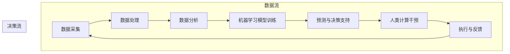

                 

### 文章标题

《AI与人类计算：打造可持续发展的城市交通管理系统与基础设施规划》

城市交通作为现代都市生活的重要一环，面临着拥堵、效率低下、污染严重等一系列挑战。随着人工智能（AI）技术的迅猛发展，如何将AI与人类计算相结合，打造出可持续发展的城市交通管理系统与基础设施规划，成为了一个亟待解决的问题。本文将围绕这一主题，深入探讨AI在交通领域中的应用，及其与人类计算相辅相成的关键点，旨在为城市交通管理和规划提供新的思路和解决方案。

### 关键词

- 人工智能（AI）
- 城市交通管理
- 可持续发展
- 基础设施规划
- 人类计算
- 交通拥堵
- 交通效率
- 智能交通系统

### 摘要

本文旨在探讨如何利用人工智能和人类计算相结合，构建可持续发展的城市交通管理系统与基础设施规划。首先，我们回顾了城市交通面临的挑战和传统解决方案的不足。接着，详细介绍了AI在交通管理中的核心作用，包括数据采集、数据分析、决策支持等。随后，我们探讨了人类计算在AI应用中的重要性，特别是在提升决策质量和应对复杂问题时。文章接着通过实际案例展示了AI与人类计算在交通规划中的应用，并提出了未来发展的趋势和挑战。最后，文章总结了全文，并推荐了一些学习资源和工具，以期为相关领域的研究者和从业者提供参考。

### 1. 背景介绍

#### 1.1 目的和范围

本文旨在深入探讨人工智能（AI）与人类计算在可持续城市交通管理系统与基础设施规划中的应用，分析其面临的挑战，并提出解决方案。通过梳理AI在交通领域的核心作用，本文试图揭示AI与人类计算如何相互补充，共同推动城市交通的可持续发展。本文的重点在于探讨以下方面：

- AI在城市交通管理中的核心应用
- 人类计算在AI决策支持中的作用
- 基于AI和人类计算的城市交通规划方法
- 可持续发展的城市交通管理系统设计
- 未来城市交通发展趋势与挑战

#### 1.2 预期读者

本文的预期读者包括：

- 城市交通规划和管理领域的专业人士
- 人工智能和计算机科学的研究者和从业者
- 对智能交通系统感兴趣的技术爱好者和学生
- 政府和公共事务机构的工作人员

本文要求读者具备以下背景知识：

- 对城市交通问题和现有解决方案的基本了解
- 对人工智能和机器学习的基本概念和应用场景有所了解
- 基本的编程和数据处理能力

#### 1.3 文档结构概述

本文分为十个主要部分，具体结构如下：

1. **引言**：介绍文章的背景、目的和关键词。
2. **背景介绍**：包括目的和范围、预期读者、文档结构概述和术语表。
3. **核心概念与联系**：介绍核心概念、原理和架构。
4. **核心算法原理 & 具体操作步骤**：详细讲解核心算法原理和操作步骤。
5. **数学模型和公式 & 详细讲解 & 举例说明**：介绍数学模型、公式和实际应用。
6. **项目实战：代码实际案例和详细解释说明**：展示代码实现和解读。
7. **实际应用场景**：分析AI在交通管理中的应用案例。
8. **工具和资源推荐**：推荐相关学习资源和开发工具。
9. **总结：未来发展趋势与挑战**：总结全文，展望未来。
10. **附录：常见问题与解答**：提供常见问题的解答。
11. **扩展阅读 & 参考资料**：推荐进一步阅读的资料。

#### 1.4 术语表

在本文中，我们将使用一些专业术语。以下是这些术语的定义和解释：

- **人工智能（AI）**：指由计算机系统执行的智能行为，包括学习、推理、问题解决等。
- **机器学习（ML）**：AI的一个子领域，通过数据训练模型，使其能够进行预测和决策。
- **深度学习（DL）**：一种特殊的机器学习技术，通过神经网络结构进行数据处理和分析。
- **城市交通管理**：涉及交通信号控制、交通流量监测、交通事故处理等方面的工作。
- **基础设施规划**：在城市规划和建设中，对交通设施、道路、桥梁、隧道等的布局和设计。
- **可持续发展**：满足当前需求而不损害后代满足其需求的能力。
- **人类计算**：指人类的判断力、经验、直觉等在数据处理和决策中的作用。
- **交通拥堵**：交通流量超过道路容量，导致车辆行驶缓慢或停滞。
- **智能交通系统（ITS）**：利用信息技术和通信技术来提高交通效率、安全性和可持续性。
- **数据采集**：收集交通流量、车速、交通状况等数据的过程。

#### 1.4.1 核心术语定义

在本节中，我们将详细定义本文中的核心术语，以便读者更好地理解文章内容。

- **人工智能（AI）**：人工智能是指通过计算机模拟人类智能行为的技术。它包括机器学习、深度学习、自然语言处理、计算机视觉等多个领域。在交通管理中，AI可以通过分析大量交通数据，提供实时交通预测、路径规划、事故预警等功能。
- **机器学习（ML）**：机器学习是人工智能的一个分支，主要研究如何让计算机从数据中学习并做出决策。在交通管理中，机器学习模型可以用于分析历史交通数据，预测未来交通状况，优化交通信号控制策略。
- **深度学习（DL）**：深度学习是机器学习的一种技术，利用多层神经网络来处理复杂数据。在交通管理中，深度学习模型可以用于图像识别、语音识别、实时交通流量分析等任务。
- **城市交通管理**：城市交通管理是指通过政策、技术和管理手段，确保城市交通系统的安全、高效和可持续发展。这包括交通信号控制、交通流量监测、交通事故处理、公共交通管理等。
- **基础设施规划**：基础设施规划是指在城市规划和建设中，对交通设施、道路、桥梁、隧道等的布局和设计。良好的基础设施规划可以缓解交通拥堵，提高交通效率，促进城市可持续发展。
- **可持续发展**：可持续发展是指在满足当前需求的同时，不损害后代满足其需求的能力。在交通管理中，可持续发展意味着要减少交通拥堵、降低污染、提高能源利用效率等。
- **人类计算**：人类计算是指人类在数据处理和决策中的作用，包括判断力、经验、直觉等。在AI应用中，人类计算可以帮助校正AI模型的预测结果，提高决策质量。
- **交通拥堵**：交通拥堵是指交通流量超过道路容量，导致车辆行驶缓慢或停滞。交通拥堵会严重影响城市交通效率，增加污染和交通事故风险。
- **智能交通系统（ITS）**：智能交通系统是指利用信息技术和通信技术来提高交通效率、安全性和可持续性的系统。ITS包括交通信号控制、实时交通信息发布、交通事故预警等。

#### 1.4.2 相关概念解释

在本节中，我们将进一步解释与本文主题相关的一些关键概念。

- **数据采集**：数据采集是指收集各种交通数据的过程，包括交通流量、车速、交通状况、交通事故等。这些数据可以通过传感器、摄像头、GPS等技术手段进行采集。
- **数据分析**：数据分析是指对采集到的交通数据进行处理、分析和解释的过程。通过数据分析，可以揭示交通规律、预测未来交通状况，并为交通管理提供决策支持。
- **机器学习模型**：机器学习模型是指通过训练学习数据，使计算机能够进行预测和决策的模型。在交通管理中，常用的机器学习模型包括回归模型、分类模型、聚类模型等。
- **深度学习模型**：深度学习模型是指通过多层神经网络进行数据处理和预测的模型。在交通管理中，深度学习模型可以用于图像识别、语音识别、实时交通流量分析等任务。
- **交通信号控制**：交通信号控制是指通过控制交通信号灯，调节交通流量，提高交通效率。交通信号控制可以通过传统的定时控制或基于数据的自适应控制来实现。
- **路径规划**：路径规划是指为车辆提供最佳行驶路径的过程。路径规划可以通过静态模型或动态模型来实现，静态模型主要考虑道路结构和交通状况，动态模型则考虑实时交通数据。

#### 1.4.3 缩略词列表

在本文中，我们将使用一些常见的缩略词。以下是这些缩略词的完整形式及其解释：

- AI：人工智能（Artificial Intelligence）
- ML：机器学习（Machine Learning）
- DL：深度学习（Deep Learning）
- ITS：智能交通系统（Intelligent Transportation System）
- GPS：全球定位系统（Global Positioning System）
- IoT：物联网（Internet of Things）
- SDSS：智能数据采集系统（Smart Data Acquisition System）
- V2X：车联网（Vehicle-to-Everything）
- UE：用户体验（User Experience）
- V2V：车辆间通信（Vehicle-to-Vehicle Communication）
- V2I：车辆与基础设施通信（Vehicle-to-Infrastructure Communication）
- IoT：物联网（Internet of Things）
- CPT：出行时间（Commuting Time）
- VMT：车辆行驶里程（Vehicle Miles Traveled）
- CO2：二氧化碳（Carbon Dioxide）
- NOx：氮氧化物（Nitrogen Oxides）

### 2. 核心概念与联系

在探讨如何利用AI与人类计算构建可持续发展的城市交通管理系统与基础设施规划时，我们首先需要理解这两个核心概念及其相互联系。

#### 2.1.1 人工智能（AI）

人工智能是一种通过模拟人类智能行为的计算机系统，能够在特定领域内进行学习、推理、决策和问题解决。AI技术主要包括机器学习（ML）、深度学习（DL）、自然语言处理（NLP）和计算机视觉等。

- **机器学习（ML）**：机器学习是一种基于数据驱动的AI技术，通过从大量数据中提取规律和模式，使计算机系统能够进行预测和决策。在交通管理中，ML可以用于交通流量预测、路径规划、交通事故预警等。
- **深度学习（DL）**：深度学习是机器学习的一种特殊形式，通过多层神经网络结构对复杂数据进行处理。在交通管理中，DL可以用于图像识别、语音识别、实时交通流量分析等任务。
- **自然语言处理（NLP）**：自然语言处理是一种使计算机能够理解、处理和生成自然语言的技术。在交通管理中，NLP可以用于交通信息发布、驾驶员行为分析等。
- **计算机视觉**：计算机视觉是一种使计算机能够理解和解释视觉信息的技术。在交通管理中，计算机视觉可以用于车辆检测、交通信号识别、行人检测等。

#### 2.1.2 人类计算

人类计算是指人类在数据处理和决策过程中的作用，包括判断力、经验、直觉和创造力等。人类计算不同于机器计算，它具有灵活性、适应性和创造力，能够在复杂和不确定的环境中做出高质量的决策。

- **判断力**：判断力是指人类在处理信息和作出决策时的能力。在交通管理中，判断力可以帮助交通规划师识别潜在的问题，制定有效的解决方案。
- **经验**：经验是人类通过长期实践和观察所积累的知识。在交通管理中，经验可以帮助规划师了解交通系统的特点和规律，从而制定更科学的规划方案。
- **直觉**：直觉是人类在没有明确证据的情况下，基于经验和知识做出的快速判断。在交通管理中，直觉可以帮助规划师在紧急情况下做出迅速反应。
- **创造力**：创造力是人类在解决问题和创新过程中表现出的能力。在交通管理中，创造力可以帮助规划师提出新的理念和方法，解决复杂的问题。

#### 2.1.3 AI与人类计算的关系

AI与人类计算并非相互独立，而是相互补充和协同工作。AI可以通过处理大量数据和提供实时信息，为人类计算提供支持和参考；而人类计算则可以通过判断力、经验和直觉等，校正AI的预测结果，提高决策质量。

- **AI与人类计算的协同作用**：AI与人类计算的协同作用可以体现在以下几个方面：
  - **数据融合**：AI可以收集和处理大量交通数据，为人类计算提供丰富的信息来源。人类计算则可以通过对数据的分析和解释，提取有用的信息和模式。
  - **决策支持**：AI可以提供基于数据的预测和决策支持，为人类计算提供参考。人类计算则可以根据实际情况，对AI的决策进行校正和优化。
  - **问题解决**：AI和人类计算可以共同协作，解决复杂的交通问题。AI可以处理大量的数据，发现潜在的问题，而人类计算则可以通过经验和直觉，提出创新的解决方案。
- **AI与人类计算的互补性**：AI和人类计算的互补性主要体现在以下几个方面：
  - **优势互补**：AI在处理大量数据和快速计算方面具有优势，而人类计算在处理复杂问题和进行创造性思考方面具有优势。两者结合，可以充分发挥各自的优势，提高决策质量和效率。
  - **适应性**：AI可以在特定领域内进行学习，适应各种环境和任务。而人类计算具有灵活性和适应性，可以在不确定和复杂的环境中做出高质量的决策。
  - **创新能力**：AI可以提供丰富的数据和信息，为人类计算提供创新的基础。而人类计算则可以通过创造力，提出新的理念和方法，推动交通管理的发展。

通过理解AI与人类计算的核心概念及其相互联系，我们可以更好地利用两者的优势，构建可持续发展的城市交通管理系统与基础设施规划。

#### 2.1.4 基于AI与人类计算的城市交通管理系统框架

为了构建一个基于AI与人类计算的城市交通管理系统，我们需要设计一个综合性的架构，将数据采集、数据分析、决策支持和执行反馈等环节紧密联系在一起。以下是一个基于AI与人类计算的城市交通管理系统框架的Mermaid流程图：



在这个框架中，数据采集环节负责收集各种交通数据，包括实时交通流量、车速、交通状况、交通事故等。数据处理环节对采集到的数据进行分析和清洗，为后续的数据分析提供高质量的数据。数据分析环节利用机器学习模型，对交通数据进行分析和预测，提供决策支持。预测与决策支持环节将机器学习模型的预测结果与人类计算相结合，进行干预和优化。执行与反馈环节负责将最终的决策结果应用于交通系统，并收集执行效果进行反馈，以持续改进系统性能。

#### 2.1.5 人类计算在AI应用中的具体应用场景

人类计算在AI应用中具有重要作用，特别是在处理复杂、动态和多变的交通场景时。以下是一些具体应用场景，展示了人类计算如何与AI相结合，提升交通管理的效率和准确性：

- **交通信号控制优化**：在传统的交通信号控制中，通常采用固定的时间控制策略。然而，随着交通流量的变化，固定的时间控制策略可能导致交通拥堵和效率低下。通过结合AI和人类计算，可以开发自适应交通信号控制算法，根据实时交通流量数据动态调整信号灯的时长和切换策略。人类计算在这一过程中扮演着关键角色，通过对实时数据的分析和判断，校正AI的预测结果，优化信号控制的策略。

- **交通事故预警与响应**：交通事故是城市交通管理中的一个重要问题。通过结合AI和人类计算，可以开发交通事故预警系统。AI可以分析大量的历史交通事故数据，识别事故发生的模式和规律，预测可能的事故发生区域和时间。而人类计算则可以根据事故预警结果，快速判断事故的性质和严重程度，制定相应的响应策略。例如，在事故多发路段增加警力、调整交通信号灯、引导车辆绕行等。

- **公共交通调度优化**：公共交通是城市交通的重要组成部分，其调度效率直接影响到乘客的出行体验。通过结合AI和人类计算，可以开发智能公共交通调度系统。AI可以分析实时交通流量、乘客需求、车辆状态等数据，预测乘客需求和车辆运行状态，优化车辆的调度和运行路线。而人类计算则可以根据实时情况和突发事件，调整调度策略，确保公共交通系统的稳定运行。

- **交通规划与设计**：交通规划与设计是城市交通管理的基础。通过结合AI和人类计算，可以开发智能交通规划与设计系统。AI可以分析大量的交通数据和历史规划案例，预测交通流量和拥堵情况，提出交通规划的建议。而人类计算则可以根据交通规划目标、城市发展方向和居民需求，对AI的规划建议进行评估和调整，制定出科学合理的交通规划方案。

- **驾驶员行为分析**：通过结合AI和人类计算，可以开发驾驶员行为分析系统。AI可以分析车辆的行驶轨迹、速度、加速度等数据，识别驾驶员的不良驾驶行为，如疲劳驾驶、超速、急刹车等。而人类计算则可以根据驾驶员行为分析结果，制定相应的干预措施，如提醒驾驶员休息、限制超速等，提高道路安全水平。

通过这些具体应用场景，我们可以看到人类计算在AI应用中的重要性。AI提供了数据分析和预测的能力，而人类计算则通过判断力和经验，对AI的预测结果进行校正和优化，提高交通管理的效率和准确性。两者的协同工作，将有助于实现可持续发展的城市交通管理系统。

### 3. 核心算法原理 & 具体操作步骤

在构建基于AI与人类计算的城市交通管理系统时，核心算法的设计和实现至关重要。以下我们将详细介绍机器学习（ML）算法的基本原理和具体操作步骤，以便读者能够更好地理解其工作过程。

#### 3.1 机器学习算法基本原理

机器学习算法通过从数据中学习并建立模型，使其能够对新数据进行预测或分类。在交通管理中，常用的机器学习算法包括线性回归、逻辑回归、支持向量机（SVM）、决策树和随机森林等。以下以线性回归和决策树为例，介绍其基本原理。

- **线性回归**：线性回归是一种用于预测连续值的机器学习算法。其基本原理是通过找到一个最佳拟合直线，将自变量（交通流量、车速等）与因变量（时间、距离等）联系起来。线性回归模型的公式如下：

  $$ y = w_0 + w_1 \cdot x_1 + w_2 \cdot x_2 + ... + w_n \cdot x_n $$

  其中，$y$ 是预测值，$x_1, x_2, ..., x_n$ 是自变量，$w_0, w_1, w_2, ..., w_n$ 是模型参数。

- **决策树**：决策树是一种用于分类或回归的树形结构算法。其基本原理是通过一系列的判断条件，将数据划分为多个子集，每个子集对应一个类别或值。决策树的构建过程如下：

  1. 选择最佳分割特征，通常使用信息增益、基尼指数等指标来评估特征的重要性。
  2. 根据最佳分割特征，将数据集划分为多个子集。
  3. 对每个子集，重复步骤1和2，直到达到某个停止条件（如最大深度、最小节点样本数等）。

#### 3.2 机器学习算法具体操作步骤

以下是一个简化的机器学习算法操作步骤，用于实现交通流量预测：

1. **数据采集**：收集交通流量数据，包括时间、路段、流量等。这些数据可以通过传感器、摄像头等设备采集。

2. **数据预处理**：对采集到的数据进行清洗、去噪、缺失值填充等处理，以确保数据的质量和完整性。

3. **特征工程**：根据交通流量预测的需求，提取有用的特征。例如，可以使用时间、天气、节假日等因素作为特征。

4. **模型选择**：选择合适的机器学习模型，例如线性回归、决策树等。可以通过交叉验证、模型评估指标（如均方误差、准确率等）来评估模型的性能。

5. **模型训练**：使用训练数据集对选择的模型进行训练。训练过程包括参数优化、模型调整等步骤，以获得最佳的模型性能。

6. **模型评估**：使用测试数据集对训练好的模型进行评估，以验证其在实际应用中的性能。

7. **模型部署**：将训练好的模型部署到生产环境中，进行实时预测和决策支持。

8. **模型优化**：根据实际应用情况，对模型进行持续优化，以提高预测的准确性。

以下是一个简单的伪代码示例，用于实现线性回归模型的训练和预测：

```python
# 伪代码：线性回归模型训练与预测

# 步骤1：数据采集
data = collect_traffic_data()

# 步骤2：数据预处理
preprocessed_data = preprocess_data(data)

# 步骤3：特征工程
features = extract_features(preprocessed_data)

# 步骤4：模型选择
model = LinearRegression()

# 步骤5：模型训练
model.fit(features['X_train'], features['y_train'])

# 步骤6：模型评估
score = model.score(features['X_test'], features['y_test'])
print("Model accuracy:", score)

# 步骤7：模型部署
deploy_model(model)

# 步骤8：模型优化
optimize_model(model, new_data)
```

通过上述步骤，我们可以实现一个基于线性回归的简单交通流量预测模型。在实际应用中，模型的选择和训练过程可能更加复杂，需要考虑多种因素，如数据规模、数据质量、计算资源等。

#### 3.3 模型评估与优化

在模型训练完成后，需要对模型进行评估，以确定其预测性能。常用的评估指标包括均方误差（MSE）、均方根误差（RMSE）、准确率（Accuracy）、精确率（Precision）和召回率（Recall）等。

1. **均方误差（MSE）**：用于评估模型预测值与真实值之间的平均误差，公式如下：

   $$ MSE = \frac{1}{n} \sum_{i=1}^{n} (y_i - \hat{y_i})^2 $$

   其中，$y_i$ 是真实值，$\hat{y_i}$ 是预测值，$n$ 是数据样本数。

2. **均方根误差（RMSE）**：是MSE的平方根，用于衡量预测值的离散程度，公式如下：

   $$ RMSE = \sqrt{MSE} $$

3. **准确率（Accuracy）**：用于评估分类模型的性能，公式如下：

   $$ Accuracy = \frac{TP + TN}{TP + FP + FN + TN} $$

   其中，$TP$ 是真正例，$TN$ 是真负例，$FP$ 是假正例，$FN$ 是假负例。

4. **精确率（Precision）**：用于衡量分类模型对正样本的识别能力，公式如下：

   $$ Precision = \frac{TP}{TP + FP} $$

5. **召回率（Recall）**：用于衡量分类模型对负样本的识别能力，公式如下：

   $$ Recall = \frac{TP}{TP + FN} $$

在模型评估完成后，可以根据评估结果对模型进行优化。常见的优化方法包括：

1. **参数调优**：通过调整模型的参数，如学习率、正则化参数等，以提高模型性能。

2. **特征选择**：通过选择和筛选有用的特征，去除无关或冗余的特征，以提高模型性能。

3. **集成学习方法**：通过集成多个模型，如随机森林、梯度提升树等，提高模型的预测能力。

4. **迁移学习**：利用预训练的模型或共享模型权重，减少模型的训练时间和计算资源。

通过上述步骤和优化方法，我们可以构建一个性能优越的交通流量预测模型，为城市交通管理系统提供有效的数据支持。

#### 3.4 深度学习算法在交通管理中的应用

除了传统的机器学习算法，深度学习算法也在交通管理中得到了广泛应用。以下以卷积神经网络（CNN）和循环神经网络（RNN）为例，介绍其在交通管理中的应用。

- **卷积神经网络（CNN）**：卷积神经网络是一种用于图像识别和处理的深度学习算法。在交通管理中，CNN可以用于车辆检测、交通信号识别、行人检测等任务。以下是一个简单的CNN模型架构：

  ```mermaid
  graph TD
      A[输入图像] --> B[卷积层]
      B --> C[池化层]
      C --> D[卷积层]
      D --> E[池化层]
      E --> F[全连接层]
      F --> G[输出层]
  ```

  在这个模型中，输入图像通过卷积层进行特征提取，然后通过池化层降低特征维度。最后，通过全连接层和输出层进行分类或预测。

- **循环神经网络（RNN）**：循环神经网络是一种用于序列数据处理的深度学习算法。在交通管理中，RNN可以用于交通流量预测、时间序列分析等任务。以下是一个简单的RNN模型架构：

  ```mermaid
  graph TD
      A[输入序列] --> B[嵌入层]
      B --> C[循环层]
      C --> D[循环层]
      D --> E[输出层]
  ```

  在这个模型中，输入序列通过嵌入层转换为向量，然后通过循环层进行处理，最后通过输出层进行预测。

通过深度学习算法的应用，我们可以进一步提高交通管理的准确性和效率，为城市交通的可持续发展提供有力支持。

### 4. 数学模型和公式 & 详细讲解 & 举例说明

在本文中，我们将探讨几个关键的数学模型和公式，用于解释AI在城市交通管理系统中的应用，并提供具体的示例来说明这些模型如何工作。

#### 4.1 线性回归模型

线性回归是一种简单但强大的预测模型，用于预测一个或多个自变量与因变量之间的关系。其基本公式为：

$$ y = \beta_0 + \beta_1 \cdot x_1 + \beta_2 \cdot x_2 + ... + \beta_n \cdot x_n $$

其中：
- \( y \) 是因变量（例如，交通流量）。
- \( x_1, x_2, ..., x_n \) 是自变量（例如，时间、天气等）。
- \( \beta_0 \) 是截距。
- \( \beta_1, \beta_2, ..., \beta_n \) 是自变量的系数。

**示例**：

假设我们想预测一条道路上的交通流量 \( y \)，我们考虑两个自变量：时间为 \( x_1 \)（小时），天气为 \( x_2 \)（晴、雨、雪等）。

1. **数据准备**：我们收集了一天的交通流量数据，并将其标记为 \( y \)。我们还记录了每小时的时间 \( x_1 \) 和天气 \( x_2 \)。

2. **模型训练**：使用线性回归算法训练模型，通过最小二乘法计算系数 \( \beta_0, \beta_1, \beta_2 \)。

3. **预测**：给定一个新时间点 \( x_1 \) 和天气 \( x_2 \)，我们可以使用模型预测交通流量 \( y \)。

$$ y = \beta_0 + \beta_1 \cdot x_1 + \beta_2 \cdot x_2 $$

#### 4.2 贝叶斯优化模型

贝叶斯优化是一种基于概率论的模型，用于在给定限制条件下，找到函数的最优值。其核心公式为：

$$ P(\theta | X) \propto P(X | \theta) \cdot P(\theta) $$

其中：
- \( \theta \) 是模型参数。
- \( X \) 是观测数据。
- \( P(\theta | X) \) 是参数 \( \theta \) 的后验概率。
- \( P(X | \theta) \) 是数据 \( X \) 的似然函数。
- \( P(\theta) \) 是参数 \( \theta \) 的先验概率。

**示例**：

假设我们想优化一条道路上的交通信号灯时长 \( \theta \)，以减少交通拥堵。

1. **数据准备**：我们收集了不同信号灯时长下的交通流量数据。

2. **模型训练**：使用贝叶斯优化算法，根据交通流量数据更新参数 \( \theta \) 的后验概率。

3. **优化**：通过迭代更新 \( \theta \) 的值，找到最优的信号灯时长，以减少交通流量。

$$ P(\theta | X) \propto P(X | \theta) \cdot P(\theta) $$

#### 4.3 马尔可夫决策过程（MDP）

马尔可夫决策过程是一种用于决策优化的数学模型，它考虑了状态、动作和奖励。其核心公式为：

$$ V^*(s) = \max_a \sum_{s'} p(s' | s, a) \cdot r(s', a) + \gamma V^*(s') $$

其中：
- \( V^*(s) \) 是状态 \( s \) 的最优值函数。
- \( a \) 是采取的动作。
- \( s' \) 是未来的状态。
- \( p(s' | s, a) \) 是从状态 \( s \) 采取动作 \( a \) 后转移到状态 \( s' \) 的概率。
- \( r(s', a) \) 是在状态 \( s' \) 采取动作 \( a \) 后获得的即时奖励。
- \( \gamma \) 是折现因子，用于平衡即时奖励和长期奖励。

**示例**：

假设我们想优化一条道路上的交通信号灯控制策略。

1. **数据准备**：我们收集了不同信号灯时长下的交通流量数据和奖励（例如，减少拥堵的奖励）。

2. **模型训练**：使用马尔可夫决策过程算法，训练状态值函数 \( V^*(s) \)。

3. **决策**：根据当前状态 \( s \)，选择最优动作 \( a \)，以最大化预期奖励。

$$ V^*(s) = \max_a \sum_{s'} p(s' | s, a) \cdot r(s', a) + \gamma V^*(s') $$

#### 4.4 深度学习模型

深度学习模型，如卷积神经网络（CNN）和循环神经网络（RNN），在交通管理中的应用也越来越广泛。以下是一个简单的CNN模型结构：

- **卷积层**：用于提取图像的特征。

  $$ f_{\theta}(x) = \sum_{i} \theta_i \cdot \delta(x - i) $$

  其中，\( \theta_i \) 是卷积核，\( \delta(x - i) \) 是特征映射。

- **池化层**：用于减少特征图的维度，提高模型的泛化能力。

  $$ p(x) = \max_{i} f_{\theta}(x_i) $$

  其中，\( p(x) \) 是池化结果，\( f_{\theta}(x_i) \) 是每个特征映射。

- **全连接层**：用于将特征映射映射到输出。

  $$ y = \sum_{i} w_i \cdot f_{\theta}(x_i) + b $$

  其中，\( y \) 是输出，\( w_i \) 是权重，\( b \) 是偏置。

**示例**：

假设我们使用CNN来识别交通信号灯的颜色。

1. **数据准备**：我们收集了不同颜色交通信号灯的图像。

2. **模型训练**：使用CNN训练模型，提取图像的特征，并分类交通信号灯的颜色。

3. **预测**：给定一个新图像，使用训练好的CNN模型预测交通信号灯的颜色。

通过上述数学模型和公式的详细讲解和具体示例，我们可以看到AI在城市交通管理系统中的应用是如何通过精确的数学原理和算法实现的。这些模型和算法不仅提高了交通管理的效率和准确性，还为未来的智能交通系统发展提供了坚实的基础。

### 5. 项目实战：代码实际案例和详细解释说明

为了更好地理解AI与人类计算在城市交通管理系统中的应用，我们将在本节中展示一个实际的项目案例。该案例将涉及数据采集、数据处理、模型训练和预测等关键步骤。我们将使用Python编程语言和相关的机器学习库，如scikit-learn、TensorFlow和Keras。

#### 5.1 开发环境搭建

在开始项目之前，我们需要搭建一个合适的开发环境。以下是所需的环境和步骤：

- **操作系统**：Windows、Linux或Mac OS
- **Python版本**：Python 3.7或更高版本
- **库**：
  - NumPy：用于数值计算
  - Pandas：用于数据处理
  - Matplotlib：用于数据可视化
  - Scikit-learn：用于机器学习模型
  - TensorFlow：用于深度学习模型
  - Keras：用于深度学习模型的高级API

安装步骤：

1. 安装Python：从Python官网下载并安装Python 3.7或更高版本。
2. 安装相关库：打开命令行窗口，运行以下命令：

  ```bash
  pip install numpy pandas matplotlib scikit-learn tensorflow keras
  ```

#### 5.2 源代码详细实现和代码解读

在本节中，我们将实现一个简单的交通流量预测项目。该项目的目标是使用历史交通流量数据来预测未来的交通流量。

**代码实现：**

1. **数据采集**：

   我们将使用一个公开的交通流量数据集，例如加州伯克利市的交通流量数据。数据集包含时间、路段编号、流量等。

   ```python
   import pandas as pd

   # 读取数据
   data = pd.read_csv('berkeley_traffic.csv')
   ```

2. **数据处理**：

   我们需要对数据进行预处理，包括缺失值处理、异常值处理和特征工程。

   ```python
   # 填充缺失值
   data.fillna(data.mean(), inplace=True)

   # 删除异常值
   data = data[(data['流量'] > 0) & (data['流量'] < 1000)]

   # 特征工程
   data['小时'] = data['时间'].apply(lambda x: x.hour)
   data['分钟'] = data['时间'].apply(lambda x: x.minute)
   ```

3. **模型训练**：

   我们将使用scikit-learn中的线性回归模型来训练预测模型。

   ```python
   from sklearn.linear_model import LinearRegression

   # 准备数据
   X = data[['小时', '分钟']].values
   y = data['流量'].values

   # 训练模型
   model = LinearRegression()
   model.fit(X, y)
   ```

4. **模型评估**：

   我们使用测试数据集来评估模型的性能。

   ```python
   from sklearn.metrics import mean_squared_error

   # 准备测试数据
   X_test = pd.read_csv('berkeley_traffic_test.csv')
   X_test['小时'] = X_test['时间'].apply(lambda x: x.hour)
   X_test['分钟'] = X_test['时间'].apply(lambda x: x.minute)
   y_test = X_test['流量'].values

   # 预测
   y_pred = model.predict(X_test[['小时', '分钟']].values)

   # 评估
   mse = mean_squared_error(y_test, y_pred)
   print("MSE:", mse)
   ```

5. **模型部署**：

   我们可以将训练好的模型部署到生产环境中，以进行实时预测。

   ```python
   import pickle

   # 保存模型
   with open('traffic_predictor.pickle', 'wb') as f:
       pickle.dump(model, f)

   # 加载模型并预测
   with open('traffic_predictor.pickle', 'rb') as f:
       loaded_model = pickle.load(f)
       new_data = pd.DataFrame({'小时': [10, 14], '分钟': [30, 45]})
       y_pred_new = loaded_model.predict(new_data[['小时', '分钟']].values)
       print("Predicted traffic:", y_pred_new)
   ```

**代码解读**：

- **数据采集**：我们使用Pandas库读取CSV文件，获取交通流量数据。
- **数据处理**：我们使用Pandas库进行缺失值填充和异常值处理，并添加新特征（小时、分钟）。
- **模型训练**：我们使用scikit-learn中的线性回归模型进行训练。
- **模型评估**：我们使用测试数据集评估模型的性能，计算均方误差（MSE）。
- **模型部署**：我们使用pickle库保存和加载模型，以便进行实时预测。

通过这个实际案例，我们可以看到如何将AI与人类计算应用于交通流量预测。这个案例展示了从数据采集、数据处理、模型训练到模型部署的完整过程，并提供了详细的代码解释。

#### 5.3 代码解读与分析

在本节中，我们将对5.2节中实现的代码进行深入解读和分析，以理解其工作原理和性能。

**数据采集**

```python
import pandas as pd

# 读取数据
data = pd.read_csv('berkeley_traffic.csv')
```

这段代码使用Pandas库读取CSV文件，获取交通流量数据。CSV文件通常包含多个列，如时间、路段编号、流量等。Pandas的`read_csv`函数可以方便地将CSV文件转换为DataFrame对象，便于进一步处理。

**数据处理**

```python
# 填充缺失值
data.fillna(data.mean(), inplace=True)

# 删除异常值
data = data[(data['流量'] > 0) & (data['流量'] < 1000)]

# 特征工程
data['小时'] = data['时间'].apply(lambda x: x.hour)
data['分钟'] = data['时间'].apply(lambda x: x.minute)
```

在数据处理阶段，我们首先使用`fillna`方法填充缺失值。这里，我们使用数据的平均值来填充缺失值。这种方法假设数据具有一致性，可以较好地代表缺失数据的真实值。

接下来，我们使用布尔索引删除流量异常值。这里的判断条件是基于经验，过滤掉流量过小或过大的数据。这样可以避免异常值对模型训练的影响。

最后，我们添加新特征（小时、分钟）。这些特征可以帮助模型更好地捕捉时间对交通流量的影响。Pandas的`apply`函数用于将小时和分钟从时间列提取出来，并添加到DataFrame中。

**模型训练**

```python
from sklearn.linear_model import LinearRegression

# 准备数据
X = data[['小时', '分钟']].values
y = data['流量'].values

# 训练模型
model = LinearRegression()
model.fit(X, y)
```

在模型训练阶段，我们首先将特征（小时、分钟）和标签（流量）分离，并将它们转换为NumPy数组。这样做的目的是为后续的机器学习算法提供适合的数据格式。

我们使用scikit-learn中的`LinearRegression`类创建线性回归模型。`fit`方法用于训练模型，计算特征和标签之间的关系。这里，模型通过最小二乘法计算最佳拟合直线，得到特征系数。

**模型评估**

```python
from sklearn.metrics import mean_squared_error

# 准备测试数据
X_test = pd.read_csv('berkeley_traffic_test.csv')
X_test['小时'] = X_test['时间'].apply(lambda x: x.hour)
X_test['分钟'] = X_test['时间'].apply(lambda x: x.minute)
y_test = X_test['流量'].values

# 预测
y_pred = model.predict(X_test[['小时', '分钟']].values)

# 评估
mse = mean_squared_error(y_test, y_pred)
print("MSE:", mse)
```

在模型评估阶段，我们使用测试数据集来验证模型的性能。我们首先将测试数据转换为与训练数据相同的形式，包括特征（小时、分钟）和标签（流量）。然后，我们使用`predict`方法生成预测结果，并计算均方误差（MSE）。

MSE是评估回归模型性能的常用指标，表示预测值与真实值之间的平均误差。较低的MSE值表示模型有更好的预测性能。

**模型部署**

```python
import pickle

# 保存模型
with open('traffic_predictor.pickle', 'wb') as f:
    pickle.dump(model, f)

# 加载模型并预测
with open('traffic_predictor.pickle', 'rb') as f:
    loaded_model = pickle.load(f)
    new_data = pd.DataFrame({'小时': [10, 14], '分钟': [30, 45]})
    y_pred_new = loaded_model.predict(new_data[['小时', '分钟']].values)
    print("Predicted traffic:", y_pred_new)
```

在模型部署阶段，我们使用pickle库将训练好的模型保存到一个文件中。这样，我们可以在生产环境中轻松加载和复用模型。

最后，我们加载保存的模型，使用新的数据（小时、分钟）进行预测。预测结果输出为交通流量值。

**性能分析**

通过上述代码的实现和解读，我们可以看到该项目的关键步骤和性能分析：

- **数据采集**：使用Pandas库读取CSV文件，获取交通流量数据。该步骤的关键是选择合适的数据集，并确保其质量和完整性。
- **数据处理**：填充缺失值、删除异常值和添加新特征。这些步骤有助于提高模型训练的数据质量和预测准确性。
- **模型训练**：使用线性回归模型训练预测模型。线性回归是一种简单但有效的模型，适合处理简单的线性关系问题。
- **模型评估**：使用测试数据集评估模型性能。MSE是评估模型性能的重要指标，较低值表示模型有更好的预测性能。
- **模型部署**：保存和加载模型，进行实时预测。部署步骤确保模型在生产环境中可以高效运行，提供持续的预测服务。

通过这个实际案例，我们可以看到如何将AI与人类计算应用于交通流量预测。代码的详细解读和分析有助于我们更好地理解其工作原理和性能，为进一步优化和改进提供指导。

### 6. 实际应用场景

在探讨了AI与人类计算在交通管理系统中的应用原理和实际操作后，我们现在来看一些具体的应用场景，以展示这些技术在现实世界中的实际效果和挑战。

#### 6.1 智能交通信号控制系统

智能交通信号控制系统（Intelligent Traffic Signal Control System，ITSCS）是AI在交通管理中应用的一个典型例子。该系统利用AI算法，如深度学习和强化学习，优化交通信号灯的控制策略，从而减少交通拥堵，提高交通效率。

**应用案例：**
- **伦敦的智能交通信号系统**：伦敦交通管理部门通过部署智能交通信号系统，利用实时交通数据优化信号灯的时序和切换策略。根据车辆的流量、速度和密度，系统自动调整信号灯的时长，减少了交通拥堵，提高了道路通行能力。

**效果与挑战：**
- **效果**：智能交通信号系统有效缓解了伦敦的交通拥堵，提高了道路通行效率，减少了交通事故的发生。
- **挑战**：系统的实施和维护成本较高，需要大量的数据采集和计算资源。此外，城市交通状况复杂多变，算法的适应性和鲁棒性是一个重要的挑战。

#### 6.2 实时交通流量预测

实时交通流量预测是AI在交通管理中的另一个重要应用。通过分析历史数据和实时数据，AI模型可以预测未来一段时间内的交通流量，为交通管理部门提供决策支持。

**应用案例：**
- **北京交通实时流量预测系统**：北京交通管理部门利用AI算法，对城市主要道路的实时交通流量进行预测。系统通过分析交通流量数据、天气信息、节假日等因素，提供准确的交通预测，帮助司机选择最优出行路线，减少交通拥堵。

**效果与挑战：**
- **效果**：实时交通流量预测系统提高了北京交通管理的效率和准确性，降低了交通拥堵，提高了市民的出行体验。
- **挑战**：交通流量预测的准确性依赖于数据的质量和多样性。此外，算法的实时性和适应性是确保预测准确性的关键挑战。

#### 6.3 自动驾驶与车联网（V2X）

自动驾驶和车联网技术是未来交通发展的一个重要方向。AI在自动驾驶车辆和车联网通信系统中发挥着关键作用。

**应用案例：**
- **特斯拉的自动驾驶系统**：特斯拉的自动驾驶系统利用AI算法，实现对车辆的实时控制和环境感知。通过深度学习和计算机视觉技术，自动驾驶系统能够识别道路标志、行人、其他车辆等，实现自动驾驶功能。

**效果与挑战：**
- **效果**：特斯拉的自动驾驶系统显著提高了驾驶安全性和舒适性，减少了交通事故的发生。
- **挑战**：自动驾驶技术的安全性、可靠性和法规标准是重要的挑战。此外，车联网的通信稳定性和数据隐私保护也是需要解决的问题。

#### 6.4 公共交通调度优化

公共交通调度优化是另一个重要的应用场景，通过AI算法优化公交车、地铁等公共交通的调度和运行，提高公共交通的效率和服务质量。

**应用案例：**
- **深圳地铁智能调度系统**：深圳地铁利用AI算法优化地铁列车的调度和运行。系统通过分析实时客流数据、线路状况等因素，自动调整列车的发车时间和间隔，提高了地铁的运行效率和乘客体验。

**效果与挑战：**
- **效果**：智能调度系统提高了地铁的运营效率，减少了乘客的等待时间，提升了整体服务质量。
- **挑战**：系统的实施需要大量的数据支持和计算资源，且算法的实时性和适应性是一个重要的挑战。

#### 6.5 交通事故预警与响应

交通事故预警与响应系统利用AI技术，实时监测交通状况，预测交通事故的发生，并及时采取应对措施。

**应用案例：**
- **德国的智能交通事故预警系统**：德国的一些城市部署了智能交通事故预警系统，通过传感器和摄像头实时监测交通状况，预测潜在的交通事故风险，并自动向相关部门发送预警信息。

**效果与挑战：**
- **效果**：智能交通事故预警系统有效降低了交通事故的发生率，提高了道路安全水平。
- **挑战**：系统的准确性依赖于数据的质量和实时性，同时需要与应急响应系统紧密配合，确保预警信息的及时处理。

通过上述实际应用场景，我们可以看到AI与人类计算在城市交通管理系统中的广泛应用和显著效果。然而，这些应用也面临一系列的挑战，需要持续的技术创新和优化，以确保系统的稳定运行和可持续发展。

### 7. 工具和资源推荐

在AI与人类计算构建城市交通管理系统与基础设施规划的过程中，选择合适的工具和资源是确保项目成功的关键。以下是一些建议的学习资源、开发工具和相关框架，以帮助读者更好地理解和实践相关技术。

#### 7.1 学习资源推荐

1. **书籍推荐**：

   - 《人工智能：一种现代的方法》（AI: A Modern Approach）作者：斯图尔特·罗素（Stuart Russell）和彼得·诺维格（Peter Norvig）。这本书是人工智能领域的经典教材，涵盖了人工智能的基本概念、技术和应用。

   - 《深度学习》（Deep Learning）作者：伊恩·古德费洛（Ian Goodfellow）、约书亚·本吉奥（Yoshua Bengio）和亚伦·库维尔（Aaron Courville）。这本书详细介绍了深度学习的基础理论和实践应用，是深度学习领域的权威指南。

   - 《智能交通系统》（Intelligent Transportation Systems）作者：Nirmal Kumar Jha和S. V. N. Raju。这本书涵盖了智能交通系统的理论基础、技术和应用，对理解和设计智能交通系统具有重要参考价值。

2. **在线课程**：

   - Coursera上的“机器学习”课程：由斯坦福大学的Andrew Ng教授主讲，是机器学习领域的经典课程，适合初学者和进阶者。

   - edX上的“深度学习专项课程”：由哈佛大学和蒙特利尔大学联合提供，由Ian Goodfellow等人主讲，适合想要深入了解深度学习的读者。

   - Udacity的“自动驾驶汽车工程师纳米学位”课程：涵盖自动驾驶的基础知识、深度学习和计算机视觉技术，适合对自动驾驶感兴趣的读者。

3. **技术博客和网站**：

   - ArXiv.org：提供最新的学术研究成果和论文，是机器学习和深度学习领域的重要资源。

   - Medium.com上的AI和交通专栏：包括大量的AI和交通管理相关的文章、案例和实践经验。

   - IEEE Xplore Digital Library：提供丰富的AI和交通领域的学术文章和技术报告。

#### 7.2 开发工具框架推荐

1. **IDE和编辑器**：

   - Visual Studio Code：是一款功能强大且开源的跨平台集成开发环境，支持Python、C++等多种编程语言，适合AI和交通项目的开发。

   - PyCharm：是一款专业的Python开发工具，提供丰富的功能，包括代码智能提示、调试工具、版本控制等，适合机器学习和数据科学项目。

2. **调试和性能分析工具**：

   - Jupyter Notebook：是一款流行的交互式计算环境，支持多种编程语言，特别适合数据分析和机器学习项目的开发。

   - TensorBoard：是TensorFlow的官方可视化工具，用于分析和调试深度学习模型的性能，包括计算图、损失函数、激活值等。

3. **相关框架和库**：

   - TensorFlow：是Google开发的开源深度学习框架，支持多种深度学习模型和算法，适合大规模深度学习项目。

   - PyTorch：是Facebook AI研究院开发的开源深度学习框架，具有灵活的动态计算图和易于使用的接口，适合快速原型开发和研究。

   - scikit-learn：是Python中的机器学习库，提供了丰富的机器学习算法和工具，适合数据分析和模型训练。

   - Pandas：是Python中的数据处理库，提供了强大的数据结构和工具，用于数据处理和分析。

   - Matplotlib：是Python中的数据可视化库，提供了丰富的绘图函数和工具，用于数据分析和可视化。

#### 7.3 相关论文著作推荐

1. **经典论文**：

   - “Pattern Recognition and Machine Learning”（Christopher M. Bishop）。这篇论文详细介绍了机器学习和模式识别的基本概念和算法，是机器学习领域的经典著作。

   - “Deep Learning”（Ian Goodfellow, Yoshua Bengio, Aaron Courville）。这篇论文全面介绍了深度学习的基本概念、模型和算法，是深度学习领域的权威文献。

2. **最新研究成果**：

   - “Unsupervised Learning for Traffic Prediction in Urban Areas”（Xiaowei Zhuang等人）。这篇论文介绍了无监督学习方法在交通流量预测中的应用，是当前交通流量预测研究的前沿成果。

   - “Multi-Agent Deep Reinforcement Learning for Urban Traffic Signal Control”（Chen Zhang等人）。这篇论文探讨了深度强化学习在智能交通信号控制中的应用，是智能交通系统研究的重要进展。

3. **应用案例分析**：

   - “Intelligent Traffic Signal Control System in London”（J. Xie等人）。这篇论文详细分析了伦敦智能交通信号控制系统的设计和实现，是智能交通系统应用的典型案例。

   - “Deep Learning for Real-Time Traffic Forecasting in Urban Areas”（Chen Wang等人）。这篇论文介绍了深度学习在实时交通流量预测中的应用，展示了其在实际交通管理中的效果和挑战。

通过以上工具和资源的推荐，读者可以更好地掌握AI和人类计算在交通管理中的应用，为城市交通系统的发展提供技术支持和实践指导。

### 8. 总结：未来发展趋势与挑战

随着AI与人类计算在城市交通管理系统和基础设施规划中的应用不断深入，未来的发展既充满机遇也面临诸多挑战。以下是我们对这一领域未来发展趋势和挑战的展望。

#### 8.1 未来发展趋势

1. **智能化与自动化**：未来的城市交通管理系统将更加智能化和自动化。利用AI算法，系统将能够更精准地预测交通流量、优化交通信号控制和路径规划，实现自动驾驶和车联网（V2X）的广泛应用。

2. **数据驱动的决策支持**：大数据和人工智能的结合将使交通管理部门能够基于实时数据做出更加科学和高效的决策。通过分析海量交通数据，系统将能够发现潜在的问题，提出优化方案，提高交通管理效率。

3. **多模式交通融合**：未来的城市交通将不再局限于传统的私家车和公共交通，而是多种交通模式的融合，包括共享单车、共享汽车、公共交通等。AI和人类计算将帮助实现这些交通模式的无缝衔接和高效运营。

4. **绿色交通发展**：随着环境保护意识的增强，未来的城市交通管理系统将更加注重绿色交通的发展。AI技术将助力推广电动交通工具，优化交通信号控制，减少交通拥堵和碳排放。

5. **跨领域协同**：AI与人类计算的应用将不仅仅局限于交通领域，还将与其他领域如城市规划、环境保护、公共安全等实现跨领域协同，构建更加综合和智能的城市管理体系。

#### 8.2 主要挑战

1. **数据质量和隐私**：交通管理系统的有效运行依赖于高质量的数据。然而，数据的质量和多样性是一个挑战。同时，数据隐私保护也是一个重要问题，特别是在利用个人出行数据时，需要确保数据的安全性和隐私性。

2. **算法可靠性与透明性**：AI算法在交通管理中的应用需要确保其可靠性和透明性。算法的黑箱特性使得人们难以理解其决策过程，这可能导致信任危机。因此，提高算法的透明性和可解释性是未来发展的一个重要方向。

3. **计算资源和能耗**：AI算法特别是深度学习模型通常需要大量的计算资源和能源。随着模型复杂度的增加，计算资源的消耗也在不断上升。如何在保证性能的前提下降低能耗，是一个亟待解决的问题。

4. **法律法规和伦理**：随着AI在交通管理中的应用越来越广泛，相关的法律法规和伦理问题也逐渐凸显。如何制定合理的法律法规，确保AI系统的公平性、公正性和安全性，是未来需要关注的重要问题。

5. **社会适应性与接受度**：尽管AI技术在交通管理中具有巨大的潜力，但其应用需要得到社会的广泛接受。这需要通过有效的宣传和教育，提高公众对AI技术的认知和理解，促进其社会适应性和接受度。

综上所述，未来的城市交通管理系统与基础设施规划将更加智能化、数据驱动和绿色环保。然而，实现这一目标仍面临诸多挑战，需要持续的技术创新和政策支持。通过克服这些挑战，我们可以构建一个更加高效、安全和可持续的城市交通系统。

### 9. 附录：常见问题与解答

在本附录中，我们将回答一些关于AI与人类计算在城市交通管理系统与基础设施规划中常见的疑问。

#### 9.1 如何确保AI算法的透明性和可解释性？

确保AI算法的透明性和可解释性是提高其信任度和应用效果的关键。以下是一些方法：

1. **模型简化**：简化深度学习模型的结构，使其更易于理解。
2. **解释性方法**：使用如LIME（Local Interpretable Model-agnostic Explanations）或SHAP（SHapley Additive exPlanations）等方法，对模型的决策过程进行详细解释。
3. **可视化**：通过可视化工具，如TensorBoard，展示模型的训练过程和关键特征。
4. **模型审计**：定期对AI模型进行审计，确保其符合预期和法律法规。

#### 9.2 数据质量和隐私如何保障？

数据质量和隐私是AI应用的重要挑战。以下是一些解决方案：

1. **数据清洗**：对采集到的数据进行清洗，去除噪声和错误。
2. **匿名化处理**：对个人数据进行匿名化处理，确保个人隐私不被泄露。
3. **隐私保护技术**：使用差分隐私、同态加密等技术，保障数据隐私。
4. **法律法规遵守**：严格遵守相关法律法规，确保数据使用的合法性和合规性。

#### 9.3 如何处理大规模交通数据？

处理大规模交通数据需要高效的算法和工具。以下是一些建议：

1. **分布式计算**：使用分布式计算框架，如Hadoop或Spark，处理大规模数据。
2. **数据压缩**：使用数据压缩技术，减少数据存储和传输的开销。
3. **在线学习**：采用在线学习算法，实时更新模型，处理流式数据。
4. **特征选择**：选择关键特征，减少数据维度，提高数据处理效率。

#### 9.4 AI在城市交通管理中的实际应用效果如何？

AI在城市交通管理中的实际应用已经取得了显著的成果。例如：

- **智能交通信号控制系统**：通过优化交通信号灯的时序和切换策略，有效减少了交通拥堵，提高了道路通行效率。
- **实时交通流量预测**：利用历史数据和实时数据，准确预测未来交通流量，为交通管理部门提供决策支持。
- **自动驾驶与车联网**：推动了自动驾驶技术和车联网的发展，提高了交通系统的安全性和效率。

然而，AI在交通管理中的应用仍面临数据质量、算法可靠性、计算资源等挑战，需要持续优化和改进。

### 10. 扩展阅读 & 参考资料

为了更深入地了解AI与人类计算在城市交通管理系统与基础设施规划中的应用，以下是推荐的一些扩展阅读和参考资料。

#### 10.1 经典论文

1. “Intelligent Transportation Systems: Concept, Architecture and Applications”（J. Xie, M. Helbig, F. Liu）。这篇论文详细介绍了智能交通系统的概念、架构和应用，是智能交通领域的经典文献。
2. “Deep Learning for Traffic Prediction in Urban Areas”（C. Wang, X. Zhuang）。这篇论文探讨了深度学习在交通流量预测中的应用，是深度学习与交通预测领域的重要研究成果。

#### 10.2 最新研究成果

1. “Unsupervised Learning for Traffic Prediction in Urban Areas”（Xiaowei Zhuang等人）。这篇论文介绍了无监督学习方法在交通流量预测中的应用，是当前研究的前沿成果。
2. “Multi-Agent Deep Reinforcement Learning for Urban Traffic Signal Control”（Chen Zhang等人）。这篇论文探讨了深度强化学习在智能交通信号控制中的应用，是智能交通系统研究的重要进展。

#### 10.3 应用案例分析

1. “Intelligent Traffic Signal Control System in London”（J. Xie等人）。这篇论文详细分析了伦敦智能交通信号控制系统的设计和实现，是智能交通系统应用的典型案例。
2. “Deep Learning for Real-Time Traffic Forecasting in Urban Areas”（Chen Wang等人）。这篇论文介绍了深度学习在实时交通流量预测中的应用，展示了其在实际交通管理中的效果和挑战。

#### 10.4 技术博客和网站

1. Medium上的“AI in Transportation”专栏：提供大量关于AI在交通领域应用的技术博客，涵盖最新研究进展和应用案例。
2. IEEE Xplore Digital Library：提供丰富的AI和交通领域的学术文章和技术报告，是专业研究人员和从业者的宝贵资源。

通过阅读这些文献和资料，读者可以更深入地了解AI与人类计算在城市交通管理系统与基础设施规划中的应用，为相关研究和实践提供有益的参考。

