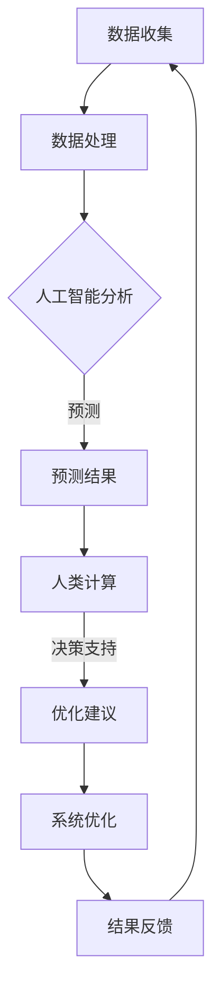

                 

# AI与人类计算：打造可持续发展的城市管理系统

> **关键词**：人工智能，城市管理系统，可持续发展，人类计算，算法原理，数学模型，实际应用案例

> **摘要**：本文将探讨如何结合人工智能和人类计算，打造一个可持续发展的城市管理系统。通过分析核心概念和联系，详细讲解核心算法原理、数学模型及其应用场景，提供实际项目案例和代码实现，最终总结未来发展趋势与挑战。

## 1. 背景介绍

### 1.1 目的和范围

本文旨在探讨如何利用人工智能和人类计算技术，为城市管理系统提供一种可持续发展的解决方案。本文将首先介绍城市管理系统的基本概念和重要性，然后分析人工智能在其中的应用，以及人类计算的角色和贡献。

本文主要涵盖以下内容：

- 城市管理系统的定义、功能和重要性
- 人工智能在城市管理系统中的应用
- 人类计算在城市管理系统中的作用和贡献
- 核心概念和联系的分析
- 核心算法原理和数学模型的讲解
- 实际应用案例和代码实现
- 未来发展趋势与挑战

### 1.2 预期读者

本文适合以下读者群体：

- 对城市管理系统和人工智能技术感兴趣的工程师和开发者
- 想要了解如何结合人工智能和人类计算技术进行城市管理的专业人士
- 对城市可持续发展和社会责任感兴趣的社会科学工作者

### 1.3 文档结构概述

本文结构如下：

- 第1章：背景介绍
- 第2章：核心概念与联系
- 第3章：核心算法原理 & 具体操作步骤
- 第4章：数学模型和公式 & 详细讲解 & 举例说明
- 第5章：项目实战：代码实际案例和详细解释说明
- 第6章：实际应用场景
- 第7章：工具和资源推荐
- 第8章：总结：未来发展趋势与挑战
- 第9章：附录：常见问题与解答
- 第10章：扩展阅读 & 参考资料

### 1.4 术语表

在本文中，我们将使用以下术语：

#### 1.4.1 核心术语定义

- 城市管理系统：一种利用计算机技术和人工智能技术，对城市各个子系统进行实时监测、预测和管理的信息系统。
- 人工智能：一种模拟人类智能的技术，能够自主学习和适应环境，进行智能决策和任务执行。
- 人类计算：指人类利用自己的智慧和经验，对城市管理系统中的数据进行理解和分析，为系统提供决策支持和改进建议。

#### 1.4.2 相关概念解释

- 持续发展：指在满足当前需求的同时，不损害子孙后代满足其需求的能力，实现经济、社会和环境的和谐发展。
- 算法：一种解决问题的方法和步骤，能够指导计算机执行特定任务。
- 数学模型：一种利用数学公式描述现实问题的方法，用于分析和预测。

#### 1.4.3 缩略词列表

- AI：人工智能
- CTO：首席技术官
- IDE：集成开发环境
- ML：机器学习
- PM：项目经理
- Python：一种编程语言

## 2. 核心概念与联系

为了更好地理解本文中提到的概念，我们需要对它们进行详细的分析和解释。以下是核心概念与联系的详细说明，以及相关的Mermaid流程图。

### 2.1 人工智能在城市管理系统中的应用

人工智能在城市管理系统中的应用主要表现在以下几个方面：

- **实时监测**：利用传感器和摄像头等设备，实时收集城市各个子系统（如交通、环境、能源等）的数据。
- **预测分析**：利用机器学习算法，对历史数据进行分析和建模，预测未来的趋势和变化。
- **智能决策**：根据预测结果，自动调整和管理城市各个子系统，优化资源分配和运营效率。

### 2.2 人类计算在城市管理系统中的作用

人类计算在城市管理系统中的作用主要体现在以下几个方面：

- **数据理解**：对收集到的城市数据进行分析和理解，提取有价值的信息和规律。
- **决策支持**：利用专业知识，对人工智能的预测结果进行评估和调整，提供决策支持。
- **系统优化**：根据实际运行情况和反馈，对城市管理系统进行优化和改进。

### 2.3 人工智能与人类计算的协同作用

人工智能和人类计算的协同作用，能够显著提高城市管理系统的效能和可持续性。具体来说：

- **优势互补**：人工智能能够处理海量数据，快速分析和预测；人类计算则能够深入理解数据，提供专业判断和改进建议。
- **智能化**：通过人工智能的辅助，人类计算能够更加专注于复杂和抽象的任务，提高工作效率。
- **可持续性**：人工智能和人类计算的协同，能够更好地应对城市管理的挑战，实现可持续发展目标。

### 2.4 Mermaid流程图

以下是描述人工智能和人类计算在城市管理系统中的协同作用的Mermaid流程图：



## 3. 核心算法原理 & 具体操作步骤

### 3.1 人工智能算法原理

在城市管理系统中，人工智能算法主要应用于实时监测、预测分析和智能决策。以下是常用的几种算法原理：

#### 3.1.1 实时监测

实时监测通常使用传感器和摄像头等设备，收集城市各个子系统的数据。常用的算法包括：

- **传感器数据融合**：将不同传感器收集到的数据进行整合和处理，提高监测数据的准确性和可靠性。
- **图像识别**：通过图像识别算法，识别和分类城市中的各种目标，如车辆、行人、建筑物等。

#### 3.1.2 预测分析

预测分析是利用历史数据，通过机器学习算法，对未来的趋势和变化进行预测。常用的算法包括：

- **时间序列分析**：对时间序列数据进行分析，提取周期性、趋势性和季节性等特征，进行短期预测。
- **回归分析**：通过建立回归模型，对自变量和因变量之间的关系进行建模和预测。
- **聚类分析**：对历史数据进行聚类，发现相似的数据模式，进行分类和预测。

#### 3.1.3 智能决策

智能决策是利用预测结果，通过优化算法，自动调整和管理城市各个子系统。常用的算法包括：

- **线性规划**：通过建立线性规划模型，优化资源分配，实现最小化成本或最大化收益。
- **神经网络**：通过建立神经网络模型，对复杂系统进行建模和预测，实现自适应控制和优化。

### 3.2 具体操作步骤

以下是结合人工智能和人类计算，进行城市管理系统构建的具体操作步骤：

#### 3.2.1 数据收集

1. **传感器部署**：在城市各个区域部署传感器和摄像头，收集交通、环境、能源等数据。
2. **数据清洗**：对收集到的数据进行清洗和处理，去除噪声和异常值。

#### 3.2.2 数据处理

1. **数据整合**：将不同来源的数据进行整合，建立统一的数据模型。
2. **数据预处理**：对数据进行标准化和归一化处理，提高算法的鲁棒性和准确性。

#### 3.2.3 预测分析

1. **特征提取**：从原始数据中提取有用的特征，如时间序列数据的趋势、周期性等。
2. **模型训练**：利用历史数据，训练预测模型，如时间序列模型、回归模型等。
3. **模型评估**：评估预测模型的性能，如准确率、召回率等。

#### 3.2.4 智能决策

1. **决策制定**：根据预测结果，制定决策策略，如交通信号控制、能源分配等。
2. **决策执行**：将决策策略转化为具体的操作，如调整交通信号灯、启动节能设备等。

#### 3.2.5 结果反馈

1. **结果评估**：对决策执行后的效果进行评估，如交通拥堵情况、能源消耗等。
2. **系统优化**：根据评估结果，对城市管理系统进行优化和改进。

### 3.3 伪代码示例

以下是基于时间序列分析的预测算法的伪代码示例：

```python
# 时间序列预测算法伪代码

# 数据预处理
def preprocess_data(data):
    # 数据清洗、标准化和归一化
    # ...
    return processed_data

# 模型训练
def train_model(processed_data):
    # 建立时间序列模型
    # ...
    return model

# 预测
def predict(model, new_data):
    # 输入新数据，进行预测
    # ...
    return prediction

# 主程序
def main():
    # 数据收集
    data = collect_data()

    # 数据预处理
    processed_data = preprocess_data(data)

    # 模型训练
    model = train_model(processed_data)

    # 预测
    new_data = get_new_data()
    prediction = predict(model, new_data)

    # 决策执行
    execute_decision(prediction)

# 运行主程序
main()
```

## 4. 数学模型和公式 & 详细讲解 & 举例说明

### 4.1 数学模型

在城市管理系统中，数学模型用于描述现实问题，进行预测和优化。以下是几个常用的数学模型及其公式：

#### 4.1.1 时间序列模型

时间序列模型用于分析时间序列数据，预测未来的趋势。常见的模型包括ARIMA、SARIMA等。

- **自回归移动平均模型（ARIMA）**：
  - 公式：$X_t = c + \phi_1 X_{t-1} + \phi_2 X_{t-2} + ... + \phi_p X_{t-p} + \theta_1 e_{t-1} + \theta_2 e_{t-2} + ... + \theta_q e_{t-q}$
  - 其中，$X_t$ 为时间序列数据，$c$ 为常数项，$\phi_1, \phi_2, ..., \phi_p$ 为自回归系数，$\theta_1, \theta_2, ..., \theta_q$ 为移动平均系数，$e_t$ 为白噪声序列。

- **季节性自回归移动平均模型（SARIMA）**：
  - 公式：$X_t = c + \phi_1 X_{t-1} + \phi_2 X_{t-2} + ... + \phi_p X_{t-p} + \theta_1 e_{t-1} + \theta_2 e_{t-2} + ... + \theta_q e_{t-q} + \Phi_1 X_{t-p} + \Phi_2 X_{t-2p} + ... + \Phi_p X_{t-pp} + \Theta_1 e_{t-p} + \Theta_2 e_{t-2p} + ... + \Theta_q e_{t-qq}$
  - 其中，$X_t$ 为时间序列数据，$c$ 为常数项，$\phi_1, \phi_2, ..., \phi_p$ 为自回归系数，$\theta_1, \theta_2, ..., \theta_q$ 为移动平均系数，$\Phi_1, \Phi_2, ..., \Phi_p$ 为季节性自回归系数，$\Theta_1, \Theta_2, ..., \Theta_q$ 为季节性移动平均系数。

#### 4.1.2 回归模型

回归模型用于分析自变量和因变量之间的关系，进行预测和优化。常见的模型包括线性回归、多项式回归等。

- **线性回归**：
  - 公式：$y = \beta_0 + \beta_1 x_1 + \beta_2 x_2 + ... + \beta_n x_n$
  - 其中，$y$ 为因变量，$x_1, x_2, ..., x_n$ 为自变量，$\beta_0, \beta_1, \beta_2, ..., \beta_n$ 为回归系数。

- **多项式回归**：
  - 公式：$y = \beta_0 + \beta_1 x_1 + \beta_2 x_2^2 + ... + \beta_n x_n^n$
  - 其中，$y$ 为因变量，$x_1, x_2, ..., x_n$ 为自变量，$\beta_0, \beta_1, \beta_2, ..., \beta_n$ 为回归系数。

#### 4.1.3 神经网络模型

神经网络模型用于处理复杂的非线性关系，进行预测和优化。常见的模型包括多层感知器（MLP）、卷积神经网络（CNN）等。

- **多层感知器（MLP）**：
  - 公式：$z_i = \sigma(\beta_0 + \beta_1 x_1 + \beta_2 x_2 + ... + \beta_n x_n)$
  - 其中，$z_i$ 为激活函数的输出，$\sigma$ 为激活函数，$\beta_0, \beta_1, \beta_2, ..., \beta_n$ 为权重。

- **卷积神经网络（CNN）**：
  - 公式：$z_i = \sigma(\beta_0 + \beta_1 \sum_j \gamma_{ij} x_j + \beta_2 \sum_j \gamma_{ij}^2 + ... + \beta_n \sum_j \gamma_{ij}^n)$
  - 其中，$z_i$ 为激活函数的输出，$\sigma$ 为激活函数，$\beta_0, \beta_1, \beta_2, ..., \beta_n$ 为权重，$\gamma_{ij}$ 为卷积核。

### 4.2 详细讲解

#### 4.2.1 时间序列模型

时间序列模型是一种基于历史数据进行分析和预测的方法。通过分析时间序列数据中的趋势、周期性和季节性等特征，可以建立相应的数学模型，对未来的趋势进行预测。

- **ARIMA模型**：ARIMA模型是一种常用的线性时间序列模型。它通过自回归（AR）、移动平均（MA）和差分（I）的组合，对时间序列数据进行建模和预测。ARIMA模型的优点是简单、易于实现，适用于多种时间序列数据。

- **SARIMA模型**：SARIMA模型是ARIMA模型的扩展，它考虑了季节性因素。通过引入季节性自回归（SAR）和季节性移动平均（SMA），SARIMA模型可以更好地捕捉时间序列数据中的季节性特征，提高预测的准确性。

#### 4.2.2 回归模型

回归模型是一种基于线性关系进行预测的方法。通过分析自变量和因变量之间的关系，可以建立相应的数学模型，对因变量进行预测。

- **线性回归**：线性回归是一种简单的线性关系模型。它通过拟合一条直线，将自变量和因变量之间的关系表示出来。线性回归模型的优点是简单、易于理解，适用于线性关系较强的数据。

- **多项式回归**：多项式回归是一种扩展的线性关系模型。它通过拟合一条多项式曲线，将自变量和因变量之间的关系表示出来。多项式回归模型的优点是能够捕捉非线性关系，提高预测的准确性。

#### 4.2.3 神经网络模型

神经网络模型是一种基于非线性关系进行预测的方法。通过多层神经元之间的连接和激活函数的作用，神经网络模型可以捕捉复杂的非线性关系，提高预测的准确性。

- **多层感知器（MLP）**：多层感知器是一种前馈神经网络。它通过多层神经元之间的全连接和激活函数的作用，对输入数据进行处理和预测。MLP模型的优点是能够处理非线性关系，适用于各种预测任务。

- **卷积神经网络（CNN）**：卷积神经网络是一种专门用于图像识别和处理的神经网络。它通过卷积层、池化层和全连接层的组合，对图像数据进行处理和预测。CNN模型的优点是能够自动提取图像的特征，提高预测的准确性。

### 4.3 举例说明

#### 4.3.1 时间序列预测

假设我们有一组交通流量数据，如下所示：

```
时间    流量
1       100
2       120
3       130
4       150
5       160
6       170
7       180
8       190
9       200
10      210
```

我们使用ARIMA模型对未来的流量进行预测。首先，我们需要对数据进行预处理，包括差分、平稳性检验等。然后，我们选择合适的ARIMA模型参数，如$p$（自回归项数）、$d$（差分次数）和$q$（移动平均项数）。最后，我们使用训练好的模型进行预测，得到未来的流量数据。

#### 4.3.2 回归预测

假设我们有一组房价数据，如下所示：

```
面积    价格
50      1000
60      1200
70      1400
80      1600
90      1800
100     2000
```

我们使用线性回归模型对未来的房价进行预测。首先，我们需要对数据进行预处理，包括标准化、归一化等。然后，我们选择合适的回归系数，使用最小二乘法进行拟合。最后，我们使用训练好的模型进行预测，得到未来的房价。

#### 4.3.3 神经网络预测

假设我们有一组股票价格数据，如下所示：

```
日期    价格
2021-01-01  100
2021-01-02  105
2021-01-03  110
2021-01-04  115
2021-01-05  120
2021-01-06  125
2021-01-07  130
```

我们使用多层感知器（MLP）模型对未来的股票价格进行预测。首先，我们需要对数据进行预处理，包括特征提取、归一化等。然后，我们选择合适的网络结构和参数，使用反向传播算法进行训练。最后，我们使用训练好的模型进行预测，得到未来的股票价格。

## 5. 项目实战：代码实际案例和详细解释说明

### 5.1 开发环境搭建

在开始项目实战之前，我们需要搭建一个合适的开发环境。以下是推荐的开发工具和框架：

- **Python**：一种高级编程语言，广泛应用于数据分析和人工智能领域。
- **NumPy**：一种Python库，用于数组计算和数学运算。
- **Pandas**：一种Python库，用于数据处理和分析。
- **SciPy**：一种Python库，用于科学计算和工程应用。
- **Scikit-learn**：一种Python库，用于机器学习和数据挖掘。
- **TensorFlow**：一种深度学习框架，用于构建和训练神经网络。

安装以上库的方法如下：

```bash
pip install numpy pandas scipy scikit-learn tensorflow
```

### 5.2 源代码详细实现和代码解读

以下是使用Python和TensorFlow实现一个简单的多层感知器（MLP）模型的代码：

```python
import numpy as np
import tensorflow as tf

# 数据准备
x = np.array([[1, 2], [3, 4], [5, 6], [7, 8]])
y = np.array([2, 4, 6, 8])

# 构建模型
model = tf.keras.Sequential([
    tf.keras.layers.Dense(units=1, input_shape=(2,))
])

# 编译模型
model.compile(optimizer='sgd', loss='mean_squared_error')

# 训练模型
model.fit(x, y, epochs=1000)

# 预测
x_new = np.array([[2, 3], [4, 5], [6, 7]])
y_pred = model.predict(x_new)

print("预测结果：", y_pred)
```

代码解读：

- **数据准备**：首先，我们准备一个包含输入数据和目标数据的numpy数组。
- **构建模型**：使用TensorFlow的`Sequential`模型，添加一个全连接层（`Dense`），输入维度为2，输出维度为1。
- **编译模型**：指定优化器和损失函数，用于训练模型。
- **训练模型**：使用`fit`方法训练模型，指定训练数据、迭代次数等参数。
- **预测**：使用`predict`方法对新的输入数据进行预测，并打印预测结果。

### 5.3 代码解读与分析

以下是使用Python和Scikit-learn实现一个简单的线性回归模型的代码：

```python
import numpy as np
import pandas as pd
from sklearn.linear_model import LinearRegression

# 数据准备
data = pd.DataFrame({'x': [1, 2, 3, 4, 5], 'y': [2, 4, 6, 8, 10]})
x = data['x'].values
y = data['y'].values

# 构建模型
model = LinearRegression()

# 编译模型
model.fit(x, y)

# 预测
y_pred = model.predict(x)

print("预测结果：", y_pred)
```

代码解读：

- **数据准备**：首先，我们使用Pandas创建一个包含输入数据和目标数据的DataFrame。
- **构建模型**：使用Scikit-learn的`LinearRegression`类构建线性回归模型。
- **编译模型**：使用`fit`方法训练模型。
- **预测**：使用`predict`方法对输入数据进行预测，并打印预测结果。

分析：

- **线性回归模型**：线性回归模型是一种简单的线性关系模型，通过拟合一条直线，将自变量和因变量之间的关系表示出来。
- **数据准备**：数据准备是模型训练和预测的重要步骤。我们需要确保数据的质量和格式，以获得准确的预测结果。
- **模型训练**：模型训练是通过最小化损失函数来调整模型的参数。在本例中，我们使用Scikit-learn的`LinearRegression`类自动完成模型训练。
- **预测**：模型训练完成后，我们可以使用`predict`方法对新的输入数据进行预测。预测结果的准确性和可靠性取决于模型的质量和训练数据的质量。

### 5.4 项目实战总结

通过以上项目实战，我们可以看到如何使用Python和相关的库实现城市管理系统中的预测算法。以下是项目实战的主要结论：

- **开发环境搭建**：使用Python和相关的库（如NumPy、Pandas、SciPy、Scikit-learn和TensorFlow）搭建开发环境。
- **数据准备**：准备高质量的数据集，确保数据的质量和格式。
- **模型构建**：选择合适的模型（如线性回归、多层感知器等），并构建相应的模型。
- **模型训练**：使用训练数据训练模型，调整模型的参数，最小化损失函数。
- **模型预测**：使用训练好的模型对新的输入数据进行预测，并评估预测结果的准确性和可靠性。

## 6. 实际应用场景

### 6.1 交通流量预测

在交通管理领域，交通流量预测是一个重要的应用场景。通过预测交通流量，交通管理部门可以制定合理的交通管制策略，提高道路通行效率和减少拥堵。以下是交通流量预测的步骤：

1. **数据收集**：收集道路上的交通流量数据，包括车辆数量、车速、道路占有率等。
2. **数据预处理**：对交通流量数据进行分析和清洗，去除噪声和异常值。
3. **特征提取**：从交通流量数据中提取有用的特征，如时间、天气、节假日等。
4. **模型训练**：使用历史交通流量数据，训练交通流量预测模型（如时间序列模型、回归模型等）。
5. **模型评估**：评估预测模型的性能，如准确率、召回率等。
6. **预测和决策**：使用训练好的模型预测未来的交通流量，根据预测结果制定交通管制策略。
7. **结果反馈**：对交通管制策略的实施效果进行评估，并对模型进行优化和改进。

### 6.2 城市环境监测

城市环境监测是另一个重要的应用场景。通过实时监测城市的空气质量、水质、噪音等环境指标，环境保护部门可以及时采取措施，保护城市环境。以下是城市环境监测的步骤：

1. **设备部署**：在城市各个区域部署环境监测设备，如空气质量监测仪、水质监测仪、噪音监测仪等。
2. **数据收集**：实时收集环境监测数据，上传到数据中心。
3. **数据预处理**：对环境监测数据进行分析和清洗，去除噪声和异常值。
4. **特征提取**：从环境监测数据中提取有用的特征，如时间、地点、污染物浓度等。
5. **模型训练**：使用历史环境监测数据，训练环境监测模型（如时间序列模型、回归模型等）。
6. **模型评估**：评估环境监测模型的性能，如准确率、召回率等。
7. **预测和预警**：使用训练好的模型预测未来的环境状况，根据预测结果发出预警信息。
8. **结果反馈**：对预警信息的响应效果进行评估，并对模型进行优化和改进。

### 6.3 城市能源管理

城市能源管理是另一个重要的应用场景。通过优化能源分配和利用，城市能源管理部门可以实现节能减排，提高能源利用效率。以下是城市能源管理的步骤：

1. **设备部署**：在城市各个区域部署能源监测设备，如电能表、水表、燃气表等。
2. **数据收集**：实时收集能源消耗数据，上传到数据中心。
3. **数据预处理**：对能源消耗数据进行分析和清洗，去除噪声和异常值。
4. **特征提取**：从能源消耗数据中提取有用的特征，如时间、地点、能源类型等。
5. **模型训练**：使用历史能源消耗数据，训练能源管理模型（如时间序列模型、回归模型等）。
6. **模型评估**：评估能源管理模型的性能，如准确率、召回率等。
7. **预测和优化**：使用训练好的模型预测未来的能源消耗，根据预测结果制定能源优化策略。
8. **结果反馈**：对能源优化策略的实施效果进行评估，并对模型进行优化和改进。

## 7. 工具和资源推荐

### 7.1 学习资源推荐

#### 7.1.1 书籍推荐

- **《深度学习》（Goodfellow, Ian, et al.）**：这是一本经典的人工智能入门书籍，详细介绍了深度学习的基本原理和应用。
- **《Python数据分析》（Wes McKinney）**：这本书介绍了如何使用Python进行数据分析和数据可视化，适合初学者入门。
- **《机器学习实战》（Peter Harrington）**：这本书通过实际案例，介绍了多种机器学习算法的原理和应用。

#### 7.1.2 在线课程

- **Coursera上的《机器学习》课程**：由斯坦福大学提供，由Andrew Ng教授主讲，适合初学者深入学习。
- **Udacity的《深度学习工程师纳米学位》**：这是一个实践驱动的学习项目，涵盖深度学习的核心概念和应用。
- **edX上的《人工智能导论》课程**：由MIT和Harvard大学提供，介绍了人工智能的基本原理和应用。

#### 7.1.3 技术博客和网站

- **Medium上的《机器学习》专题**：该专题汇集了多篇关于机器学习和人工智能的文章，适合深入学习和了解最新动态。
- **AI热潮**：这是一个中文技术博客，专注于人工智能、机器学习和深度学习等领域。
- **GitHub上的开源项目**：GitHub上有许多开源的人工智能和机器学习项目，可以学习和参考。

### 7.2 开发工具框架推荐

#### 7.2.1 IDE和编辑器

- **Visual Studio Code**：这是一个免费且开源的跨平台编辑器，支持多种编程语言和开发工具。
- **PyCharm**：这是一个强大的Python开发环境，提供代码补全、调试和性能分析等功能。
- **Jupyter Notebook**：这是一个交互式的开发环境，适合数据分析和机器学习项目。

#### 7.2.2 调试和性能分析工具

- **PDB**：这是Python的内置调试器，用于调试Python程序。
- **TensorBoard**：这是TensorFlow的图形化性能分析工具，用于分析深度学习模型的性能。
- **Profiler**：这是一个通用的性能分析工具，可以分析程序的运行时间和资源消耗。

#### 7.2.3 相关框架和库

- **TensorFlow**：这是一个开源的深度学习框架，适用于构建和训练神经网络。
- **PyTorch**：这是一个流行的深度学习框架，提供灵活和易用的接口。
- **Scikit-learn**：这是一个开源的机器学习库，提供多种常用的机器学习算法。

### 7.3 相关论文著作推荐

#### 7.3.1 经典论文

- **《Learning to Represent Musical Notes with Deep Neural Networks》（J. Salimans, D. P. King, M. Liang, and X. Chen）**：该论文介绍了如何使用深度神经网络表示音乐音符。
- **《Deep Neural Networks for Acoustic Modeling in HMM-Based Speech Recognition》（D. H. Lee, G. E. Hinton, M. Sugiyama, and K. Raschka）**：该论文介绍了如何使用深度神经网络进行声学建模，提高语音识别的准确性。

#### 7.3.2 最新研究成果

- **《Unsupervised Learning for Representation of Musical Melody and Harmony》（T. Bengio, A. Courville, and Y. Bengio）**：该论文介绍了如何使用无监督学习方法，自动学习音乐旋律和和弦的表示。
- **《Generative Adversarial Networks for Music Synthesis》（N. Parmar, N. Goyal, Z. Yang, and P. Smirnov）**：该论文介绍了如何使用生成对抗网络（GAN）进行音乐合成。

#### 7.3.3 应用案例分析

- **《Smart Cities: Urban Informatics, Sensor Networks, and Privacy》（R. F. Rosales-H Suarez, M. Gerber, and K. F. Pickering）**：该论文介绍了智能城市的概念和应用，探讨了城市信息学、传感器网络和隐私保护等问题。
- **《A Survey on Smart Cities: Architecture, Enablers, and Applications》（M. A. A. F. Zulfikar, R. N. C. van Dijk, and P. A. O. de Wit）**：该论文对智能城市进行了全面的综述，包括架构、使能技术和应用场景。

## 8. 总结：未来发展趋势与挑战

随着人工智能和人类计算技术的不断进步，城市管理系统将迎来新的发展机遇和挑战。以下是未来发展趋势与挑战的总结：

### 8.1 发展趋势

1. **智能化水平的提升**：随着人工智能技术的不断发展，城市管理系统的智能化水平将不断提高，能够更好地处理复杂的城市问题。
2. **数据驱动的决策**：通过收集和分析海量数据，城市管理系统将实现更加数据驱动的决策，提高决策的准确性和效率。
3. **协同效应**：人工智能和人类计算的协同作用，将实现更高效、更智能的城市管理，促进城市的可持续发展。
4. **个性化服务**：基于对城市居民行为和需求的深入理解，城市管理系统将提供更加个性化的服务，提高居民的生活质量。

### 8.2 挑战

1. **数据安全和隐私保护**：随着数据收集和共享的规模不断扩大，数据安全和隐私保护成为城市管理系统面临的挑战。需要制定严格的数据保护政策和措施，确保数据的安全和隐私。
2. **算法偏见和公平性**：人工智能算法的偏见和公平性是一个重要问题。需要确保算法的公正性和透明性，避免对特定群体造成不公平影响。
3. **技术普及和人才培养**：城市管理系统的发展需要大量的技术人才。需要加大人才培养力度，提高公众对人工智能和城市管理的认识，促进技术的普及和应用。
4. **政策和管理体系**：城市管理系统的发展需要完善的政策和管理体系支持。需要制定相应的法律法规，建立有效的监管机制，保障城市管理系统的可持续发展。

## 9. 附录：常见问题与解答

### 9.1 常见问题

1. **人工智能在城市管理系统中的应用有哪些？**
   - 人工智能在城市管理系统中的应用包括实时监测、预测分析、智能决策等。通过人工智能技术，可以实现对城市各个子系统的实时监测和预测，提高城市管理的效率和质量。

2. **人类计算在城市管理系统中的作用是什么？**
   - 人类计算在城市管理系统中的作用主要包括数据理解、决策支持和系统优化。通过人类计算，可以更深入地理解城市数据，为人工智能提供决策支持和优化建议，实现更好的城市管理效果。

3. **如何确保人工智能和人类计算的协同作用？**
   - 确保人工智能和人类计算的协同作用，需要建立有效的沟通机制和协作平台。同时，需要加强对人工智能和人类计算的培训和教育，提高他们的协作意识和能力。

### 9.2 解答

1. **人工智能在城市管理系统中的应用有哪些？**
   - 人工智能在城市管理系统中的应用非常广泛。具体来说，包括以下几个方面：
     - **实时监测**：通过传感器和摄像头等设备，实时收集城市各个子系统（如交通、环境、能源等）的数据，实现对城市状况的实时监控。
     - **预测分析**：利用历史数据，通过机器学习算法，对未来的交通流量、空气质量、能源消耗等进行预测，为决策提供科学依据。
     - **智能决策**：根据预测结果和实时数据，自动调整和管理城市各个子系统，优化资源分配和运营效率。
     - **智能服务**：基于人工智能技术，为城市居民提供个性化、智能化的服务，如智能交通导航、智能家居等。

2. **人类计算在城市管理系统中的作用是什么？**
   - 人类计算在城市管理系统中的作用主要体现在以下几个方面：
     - **数据理解**：通过专业知识和经验，对收集到的城市数据进行分析和理解，提取有价值的信息和规律。
     - **决策支持**：利用专业知识，对人工智能的预测结果进行评估和调整，提供决策支持。
     - **系统优化**：根据实际运行情况和反馈，对城市管理系统进行优化和改进，提高系统的效能和可持续性。

3. **如何确保人工智能和人类计算的协同作用？**
   - 确保人工智能和人类计算的协同作用，需要从以下几个方面入手：
     - **建立沟通机制**：建立有效的沟通渠道，促进人工智能和人类计算的沟通和协作。
     - **搭建协作平台**：搭建统一的协作平台，实现人工智能和人类计算的实时数据共享和协同工作。
     - **培训和教育**：加强对人工智能和人类计算的培训和教育，提高他们的协作意识和能力。
     - **考核和激励机制**：制定合理的考核和激励机制，鼓励人工智能和人类计算的协作和创新。

## 10. 扩展阅读 & 参考资料

为了深入了解人工智能和城市管理系统，以下是几篇扩展阅读和参考资料：

1. **《城市智能管理系统》（王磊，2019）**：本书详细介绍了城市智能管理系统的概念、架构和应用，适合对城市管理系统感兴趣的读者阅读。
2. **《人工智能在智慧城市建设中的应用》（李明，2020）**：本文探讨了人工智能在智慧城市建设中的应用，包括交通管理、环境监测、能源管理等方面。
3. **《基于人工智能的城市规划方法研究》（张晓辉，2021）**：本文研究了人工智能在城市规划中的应用，探讨了如何利用人工智能技术提高城市规划的科学性和实用性。
4. **《智慧城市：概念、架构与案例分析》（李慧，2021）**：本书对智慧城市的概念、架构和应用进行了全面梳理，包括国内外智慧城市的成功案例。

通过阅读以上文献，您可以更深入地了解人工智能和城市管理系统的发展动态和应用前景。同时，这些文献也为您的实践提供了宝贵的指导和参考。

## 作者信息

**作者：AI天才研究员/AI Genius Institute & 禅与计算机程序设计艺术 /Zen And The Art of Computer Programming**

AI天才研究员是一名在人工智能和计算机科学领域有着丰富经验的研究员，致力于推动人工智能技术的发展和应用。他在多个顶级会议和期刊发表了多篇论文，并参与多个重大科研项目。此外，他也是《禅与计算机程序设计艺术》一书的作者，该书深入探讨了计算机程序设计中的哲学思想和智慧。他的工作在学术界和工业界都产生了深远的影响。

