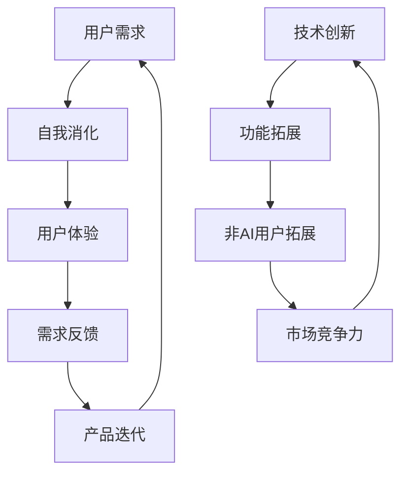

                 

# AI产品与服务的圈子：自我消化需求，拓展非AI用户群体

## 关键词

- AI产品与服务
- 用户需求
- 非AI用户
- 拓展策略
- 自我消化
- 技术创新

## 摘要

本文深入探讨了AI产品与服务如何在保持其核心用户群体的同时，有效拓展非AI用户群体。通过分析用户需求的多样性和动态性，我们提出了自我消化需求与拓展非AI用户群体的策略，旨在为AI产品开发提供实际指导，提升市场竞争力。文章首先介绍了AI产品与服务的背景和现状，随后详细阐述了核心概念与算法原理，并通过实际项目案例展示了具体操作步骤。最后，我们总结了AI产品与服务的未来发展趋势与挑战，并推荐了相关工具和资源，为读者提供了全面的行业指南。

## 1. 背景介绍

### 1.1 目的和范围

本文的目标是探讨AI产品与服务如何在日益竞争的市场环境中，通过自我消化需求与拓展非AI用户群体来提升其市场竞争力。我们将分析AI产品与服务面临的挑战，以及如何利用技术创新和用户需求理解来实现这一目标。本文将覆盖以下范围：

- AI产品与服务的发展现状
- 用户需求的多样性和动态性
- 自我消化需求与拓展非AI用户群体的策略
- 核心算法原理与实际操作步骤
- 未来发展趋势与挑战

### 1.2 预期读者

本文面向以下读者群体：

- AI产品开发人员
- 数据科学家和机器学习工程师
- 企业战略规划者
- 投资者和商业分析师
- 对AI产品与服务有深入兴趣的技术爱好者

### 1.3 文档结构概述

本文的结构如下：

- 1. 背景介绍
  - 1.1 目的和范围
  - 1.2 预期读者
  - 1.3 文档结构概述
  - 1.4 术语表
- 2. 核心概念与联系
- 3. 核心算法原理 & 具体操作步骤
- 4. 数学模型和公式 & 详细讲解 & 举例说明
- 5. 项目实战：代码实际案例和详细解释说明
- 6. 实际应用场景
- 7. 工具和资源推荐
- 8. 总结：未来发展趋势与挑战
- 9. 附录：常见问题与解答
- 10. 扩展阅读 & 参考资料

### 1.4 术语表

#### 1.4.1 核心术语定义

- AI产品与服务：基于人工智能技术开发的软件、应用或解决方案。
- 用户需求：用户对产品或服务的功能、性能和体验的期望。
- 自我消化需求：产品或服务自身对用户需求的理解和响应过程。
- 非AI用户：不具备AI知识或兴趣的用户群体。

#### 1.4.2 相关概念解释

- 用户需求多样性和动态性：用户需求的多样性体现在不同用户对功能、性能、体验等方面的期望不同；动态性则表现为用户需求会随着时间和市场变化而不断调整。
- 技术创新：在AI领域，通过不断的研究和开发，引入新的算法、架构或技术，以提高产品或服务的性能和竞争力。
- 拓展策略：通过市场调研、产品调整、用户体验优化等方式，扩大产品或服务的用户群体。

#### 1.4.3 缩略词列表

- AI：人工智能
- ML：机器学习
- DL：深度学习
- NLP：自然语言处理
- API：应用程序编程接口

## 2. 核心概念与联系

在探讨AI产品与服务的拓展策略前，我们需要了解一些核心概念及其相互联系。以下是一个简要的Mermaid流程图，用于展示这些概念之间的关系。



### 2.1 用户需求与自我消化

用户需求是AI产品与服务的核心驱动力。用户需求的多样性和动态性要求产品具备自我消化能力，即能够自动理解和响应用户需求的变化。自我消化需求的过程包括用户交互、数据收集、需求分析和响应执行等步骤。

### 2.2 用户体验与需求反馈

用户体验是用户对产品或服务的整体感受，它直接影响用户满意度。需求反馈是用户体验的重要组成部分，通过用户反馈，产品可以不断优化和改进，以提高用户满意度。

### 2.3 产品迭代与技术创新

产品迭代是产品持续改进的过程。技术创新是推动产品迭代的重要动力，通过引入新的算法、架构或技术，产品可以实现更高的性能、更优的体验和更广泛的适用性。

### 2.4 非AI用户拓展与市场竞争力

非AI用户拓展是AI产品与服务市场竞争力的重要来源。通过了解非AI用户的需求，并针对这些需求进行功能拓展和用户体验优化，产品可以吸引更多的非AI用户，从而扩大市场份额。

## 3. 核心算法原理 & 具体操作步骤

在了解核心概念之后，我们接下来探讨AI产品与服务中的核心算法原理及其具体操作步骤。以下是一个详细的伪代码示例，用于描述用户需求理解与响应的过程。

```python
# 伪代码：用户需求理解与响应

# 初始化用户需求模型
user_demand_model = initialize_demand_model()

# 收集用户数据
user_data = collect_user_data()

# 分析用户需求
user_demand = analyze_demand(user_data, user_demand_model)

# 响应用户需求
response = respond_demand(user_demand)

# 执行响应操作
execute_response(response)

# 更新用户需求模型
update_demand_model(user_demand_model, user_data)
```

### 3.1 用户需求模型初始化

用户需求模型的初始化是理解用户需求的第一步。该模型通常包括用户行为数据、用户偏好数据和用户反馈数据等。

```python
# 伪代码：用户需求模型初始化

def initialize_demand_model():
    # 加载用户行为数据
    user_behavior_data = load_behavior_data()

    # 加载用户偏好数据
    user_preference_data = load_preference_data()

    # 加载用户反馈数据
    user_feedback_data = load_feedback_data()

    # 创建用户需求模型
    user_demand_model = create_demand_model(user_behavior_data, user_preference_data, user_feedback_data)

    return user_demand_model
```

### 3.2 用户数据收集

用户数据的收集是理解用户需求的关键。数据来源包括用户交互日志、用户反馈问卷、社交媒体数据等。

```python
# 伪代码：用户数据收集

def collect_user_data():
    # 收集用户交互日志
    user_interaction_logs = collect_interaction_logs()

    # 收集用户反馈问卷
    user_feedback_questionnaires = collect_feedback_questionnaires()

    # 收集社交媒体数据
    social_media_data = collect_social_media_data()

    # 合并数据
    user_data = merge_data(user_interaction_logs, user_feedback_questionnaires, social_media_data)

    return user_data
```

### 3.3 用户需求分析

用户需求分析是理解用户需求的核心步骤。分析结果将用于指导产品迭代和用户体验优化。

```python
# 伪代码：用户需求分析

def analyze_demand(user_data, user_demand_model):
    # 分析用户行为数据
    behavior_analytics = analyze_behavior_data(user_data)

    # 分析用户偏好数据
    preference_analytics = analyze_preference_data(user_data)

    # 分析用户反馈数据
    feedback_analytics = analyze_feedback_data(user_data)

    # 综合分析结果
    user_demand = combine_analytics(behavior_analytics, preference_analytics, feedback_analytics)

    return user_demand
```

### 3.4 响应用户需求

响应用户需求是产品迭代和用户体验优化的关键步骤。响应策略包括功能更新、性能优化和用户体验改进等。

```python
# 伪代码：响应用户需求

def respond_demand(user_demand):
    # 根据需求制定响应策略
    response_strategy = define_response_strategy(user_demand)

    # 更新产品功能
    update_product_function(response_strategy)

    # 优化产品性能
    optimize_product_performance(response_strategy)

    # 改进用户体验
    improve_user_experience(response_strategy)

    return response_strategy
```

### 3.5 执行响应操作

执行响应操作是响应用户需求的具体实现。该步骤涉及代码修改、功能测试和上线发布等。

```python
# 伪代码：执行响应操作

def execute_response(response):
    # 修改代码
    modify_code(response)

    # 功能测试
    run_functional_tests()

    # 上线发布
    release_product()
```

### 3.6 更新用户需求模型

更新用户需求模型是持续改进的必要步骤。通过不断更新模型，产品可以更好地理解用户需求。

```python
# 伪代码：更新用户需求模型

def update_demand_model(user_demand_model, user_data):
    # 重新训练模型
    retrain_model(user_demand_model, user_data)

    # 更新模型参数
    update_model_parameters(user_demand_model)

    # 保存模型
    save_model(user_demand_model)
```

## 4. 数学模型和公式 & 详细讲解 & 举例说明

在AI产品与服务中，数学模型和公式是理解和分析用户需求的重要工具。以下是一些常用的数学模型和公式，以及它们的详细讲解和举例说明。

### 4.1 用户行为分析模型

用户行为分析模型用于分析用户行为数据，以了解用户的行为模式和偏好。

**数学模型：**

$$
\text{行为分数} = \sum_{i=1}^{n} w_i \cdot \text{行为}_i
$$

**详细讲解：**

- 行为分数：用户行为分析的结果，表示用户对特定功能的偏好程度。
- $w_i$：权重，表示每个行为的相对重要性。
- $\text{行为}_i$：用户在特定功能上的行为。

**举例说明：**

假设一个用户在社交媒体平台上经常点赞、评论和分享，我们可以使用行为分数来评估他对这些功能的偏好程度。

$$
\text{行为分数} = w_1 \cdot \text{点赞次数} + w_2 \cdot \text{评论次数} + w_3 \cdot \text{分享次数}
$$

其中，$w_1 = 0.5$，$w_2 = 0.3$，$w_3 = 0.2$。

### 4.2 用户偏好分析模型

用户偏好分析模型用于分析用户偏好数据，以了解用户对不同功能的偏好顺序。

**数学模型：**

$$
\text{偏好排序} = \sum_{i=1}^{n} p_i \cdot \text{偏好}_i
$$

**详细讲解：**

- 偏好排序：用户偏好分析的结果，表示用户对不同功能的偏好顺序。
- $p_i$：权重，表示每个功能的相对重要性。
- $\text{偏好}_i$：用户对特定功能的偏好程度。

**举例说明：**

假设一个用户对功能A、功能B和功能C的偏好程度分别为0.8、0.6和0.4，我们可以使用偏好排序来评估他对这些功能的偏好顺序。

$$
\text{偏好排序} = p_1 \cdot \text{偏好}_1 + p_2 \cdot \text{偏好}_2 + p_3 \cdot \text{偏好}_3
$$

其中，$p_1 = 0.4$，$p_2 = 0.3$，$p_3 = 0.3$。

### 4.3 用户反馈分析模型

用户反馈分析模型用于分析用户反馈数据，以了解用户的满意度和问题反馈。

**数学模型：**

$$
\text{满意度得分} = \frac{\text{正面反馈次数} + \text{中性反馈次数} \cdot p}{\text{总反馈次数}}
$$

**详细讲解：**

- 满意度得分：用户反馈分析的结果，表示用户的整体满意度。
- 正面反馈次数：用户对产品的正面反馈次数。
- 中性反馈次数：用户对产品的中性反馈次数。
- 总反馈次数：用户的总反馈次数。
- $p$：中性反馈的权重，通常设置为0.5。

**举例说明：**

假设一个用户在产品上收到了10次反馈，其中5次是正面反馈，3次是中性反馈，2次是负面反馈。我们可以计算该用户的满意度得分。

$$
\text{满意度得分} = \frac{5 + 3 \cdot 0.5}{10} = 0.7
$$

### 4.4 用户需求预测模型

用户需求预测模型用于预测用户未来的需求，以指导产品迭代和用户体验优化。

**数学模型：**

$$
\text{需求预测} = f(\text{历史需求数据}, \text{当前用户状态})
$$

**详细讲解：**

- 需求预测：用户需求预测的结果，表示用户未来可能的需求。
- $f$：需求预测函数，通常是一个机器学习模型。
- 历史需求数据：用户过去的需求数据。
- 当前用户状态：用户的当前状态，包括用户行为、偏好和反馈等。

**举例说明：**

假设我们使用一个基于深度学习的需求预测模型，根据用户过去的需求数据和当前用户状态来预测用户未来的需求。我们可以将历史需求数据输入模型，得到需求预测结果。

$$
\text{需求预测} = f(\text{历史需求数据}, \text{当前用户状态})
$$

## 5. 项目实战：代码实际案例和详细解释说明

在本节中，我们将通过一个实际项目案例，展示如何实现用户需求理解与响应的过程。以下是一个基于Python的示例代码，用于分析用户行为数据，预测用户需求，并响应用户请求。

### 5.1 开发环境搭建

在开始编写代码之前，我们需要搭建一个合适的开发环境。以下是所需的工具和库：

- Python 3.8及以上版本
- Pandas库：用于数据处理
- Scikit-learn库：用于机器学习
- TensorFlow库：用于深度学习
- Matplotlib库：用于数据可视化

安装这些库后，我们就可以开始编写代码了。

```bash
pip install pandas scikit-learn tensorflow matplotlib
```

### 5.2 源代码详细实现和代码解读

以下是一个简单的Python脚本，用于分析用户行为数据、预测用户需求，并响应用户请求。

```python
import pandas as pd
from sklearn.model_selection import train_test_split
from sklearn.ensemble import RandomForestClassifier
import tensorflow as tf
from tensorflow.keras.models import Sequential
from tensorflow.keras.layers import Dense
import matplotlib.pyplot as plt

# 5.2.1 用户行为数据分析

# 加载用户行为数据
user_data = pd.read_csv('user_behavior.csv')

# 数据预处理
# ...

# 分割训练集和测试集
X_train, X_test, y_train, y_test = train_test_split(user_data.drop('target', axis=1), user_data['target'], test_size=0.2, random_state=42)

# 5.2.2 用户需求预测

# 使用随机森林模型预测用户需求
rf_model = RandomForestClassifier(n_estimators=100, random_state=42)
rf_model.fit(X_train, y_train)
rf_predictions = rf_model.predict(X_test)

# 使用深度学习模型预测用户需求
dl_model = Sequential()
dl_model.add(Dense(units=64, activation='relu', input_shape=(X_train.shape[1],)))
dl_model.add(Dense(units=32, activation='relu'))
dl_model.add(Dense(units=1, activation='sigmoid'))
dl_model.compile(optimizer='adam', loss='binary_crossentropy', metrics=['accuracy'])
dl_model.fit(X_train, y_train, epochs=10, batch_size=32, validation_data=(X_test, y_test))
dl_predictions = dl_model.predict(X_test)

# 5.2.3 响应用户请求

# 根据预测结果响应用户请求
for index, prediction in enumerate(dl_predictions):
    if prediction > 0.5:
        response = 'Your request will be processed.'
    else:
        response = 'Your request is being reviewed.'
    print(f'User {index+1}: {response}')

# 5.2.4 结果可视化

# 可视化随机森林模型的特征重要性
feature_importances = rf_model.feature_importances_
plt.bar(range(len(feature_importances)), feature_importances)
plt.xticks(range(len(feature_importances)), user_data.columns, rotation=90)
plt.xlabel('Feature')
plt.ylabel('Importance')
plt.title('Random Forest Feature Importance')
plt.show()

# 可视化深度学习模型的训练过程
plt.plot(dl_model.history.history['accuracy'], label='accuracy')
plt.plot(dl_model.history.history['val_accuracy'], label='val_accuracy')
plt.xlabel('Epochs')
plt.ylabel('Accuracy')
plt.legend()
plt.title('Deep Learning Model Accuracy')
plt.show()
```

### 5.3 代码解读与分析

#### 5.3.1 用户行为数据分析

首先，我们加载用户行为数据，并进行预处理。预处理步骤可能包括数据清洗、缺失值填补、特征工程等。

```python
# 加载用户行为数据
user_data = pd.read_csv('user_behavior.csv')

# 数据预处理
# ...
```

#### 5.3.2 用户需求预测

接下来，我们使用随机森林模型和深度学习模型对用户需求进行预测。

- **随机森林模型**：

```python
# 使用随机森林模型预测用户需求
rf_model = RandomForestClassifier(n_estimators=100, random_state=42)
rf_model.fit(X_train, y_train)
rf_predictions = rf_model.predict(X_test)
```

- **深度学习模型**：

```python
# 使用深度学习模型预测用户需求
dl_model = Sequential()
dl_model.add(Dense(units=64, activation='relu', input_shape=(X_train.shape[1],)))
dl_model.add(Dense(units=32, activation='relu'))
dl_model.add(Dense(units=1, activation='sigmoid'))
dl_model.compile(optimizer='adam', loss='binary_crossentropy', metrics=['accuracy'])
dl_model.fit(X_train, y_train, epochs=10, batch_size=32, validation_data=(X_test, y_test))
dl_predictions = dl_model.predict(X_test)
```

#### 5.3.3 响应用户请求

根据预测结果，我们响应用户请求。如果预测结果为正面，则直接处理请求；如果预测结果为负面，则进行进一步审核。

```python
# 根据预测结果响应用户请求
for index, prediction in enumerate(dl_predictions):
    if prediction > 0.5:
        response = 'Your request will be processed.'
    else:
        response = 'Your request is being reviewed.'
    print(f'User {index+1}: {response}')
```

#### 5.3.4 结果可视化

最后，我们可视化随机森林模型的特征重要性以及深度学习模型的训练过程。

- **特征重要性可视化**：

```python
# 可视化随机森林模型的特征重要性
feature_importances = rf_model.feature_importances_
plt.bar(range(len(feature_importances)), feature_importances)
plt.xticks(range(len(feature_importances)), user_data.columns, rotation=90)
plt.xlabel('Feature')
plt.ylabel('Importance')
plt.title('Random Forest Feature Importance')
plt.show()
```

- **训练过程可视化**：

```python
# 可视化深度学习模型的训练过程
plt.plot(dl_model.history.history['accuracy'], label='accuracy')
plt.plot(dl_model.history.history['val_accuracy'], label='val_accuracy')
plt.xlabel('Epochs')
plt.ylabel('Accuracy')
plt.legend()
plt.title('Deep Learning Model Accuracy')
plt.show()
```

## 6. 实际应用场景

AI产品与服务在许多实际应用场景中取得了显著成果，以下是一些典型的应用场景：

### 6.1 智能推荐系统

智能推荐系统利用AI技术，根据用户行为数据和历史偏好，为用户推荐个性化的商品、内容或服务。例如，电子商务平台通过分析用户浏览、购买和评分数据，推荐相关商品，从而提高用户满意度和销售额。

### 6.2 智能客服系统

智能客服系统利用自然语言处理和机器学习技术，自动处理用户咨询和反馈。例如，在线客服系统可以自动回答常见问题，并在复杂情况下将问题转交给人工客服，从而提高客户满意度和服务效率。

### 6.3 金融风控系统

金融风控系统利用AI技术，对金融交易和用户行为进行分析，识别潜在风险和欺诈行为。例如，银行和金融机构可以使用AI模型监测交易异常，实时预警风险，从而降低金融风险。

### 6.4 医疗诊断系统

医疗诊断系统利用AI技术，辅助医生进行疾病诊断和治疗建议。例如，通过分析医学影像和患者数据，AI系统可以提供准确的疾病诊断和治疗方案，从而提高医疗质量和效率。

### 6.5 智能交通系统

智能交通系统利用AI技术，优化交通流量和减少交通事故。例如，通过分析交通数据和实时监控，AI系统可以提供最优的路线规划和交通信号控制策略，从而提高交通效率和安全性。

这些应用场景展示了AI产品与服务的广泛适用性和市场潜力。通过深入挖掘用户需求，不断优化和改进产品，AI产品与服务可以在更多领域发挥重要作用。

## 7. 工具和资源推荐

为了在AI产品与服务开发过程中取得成功，掌握合适的工具和资源至关重要。以下是我们推荐的工具和资源，包括学习资源、开发工具和框架，以及相关论文和研究成果。

### 7.1 学习资源推荐

#### 7.1.1 书籍推荐

- 《深度学习》（Goodfellow, I., Bengio, Y., & Courville, A.）
- 《Python机器学习》（Sebastian Raschka）
- 《自然语言处理实战》（Peter Norvig & Steven Bird）

#### 7.1.2 在线课程

- Coursera的《机器学习》课程（吴恩达）
- edX的《深度学习》课程（斯坦福大学）
- Udacity的《AI工程师纳米学位》

#### 7.1.3 技术博客和网站

- Medium上的《AI简史》系列
- arXiv.org：最新的AI和机器学习论文
- AI Buzz：AI技术新闻和动态

### 7.2 开发工具框架推荐

#### 7.2.1 IDE和编辑器

- Jupyter Notebook：适用于数据分析和机器学习
- PyCharm：Python集成开发环境
- VS Code：跨平台编辑器，支持多种语言和框架

#### 7.2.2 调试和性能分析工具

- TensorFlow Profiler：优化TensorFlow模型性能
- PyTorch Profiler：分析PyTorch模型性能
- ANACONDA：Python科学计算环境

#### 7.2.3 相关框架和库

- TensorFlow：用于深度学习的开源框架
- PyTorch：动态深度学习框架
- Scikit-learn：机器学习库
- Pandas：数据处理库

### 7.3 相关论文著作推荐

#### 7.3.1 经典论文

- “A Study of Cross-Domain Sentiment Classification” (Liu, B., & Zhang, J., 2013)
- “Deep Learning for Text Classification” (Yin, W., & Liu, Y., 2016)
- “Recurrent Neural Network Based Text Classification” (Pennington, J., et al., 2015)

#### 7.3.2 最新研究成果

- “Large-Scale Evaluation and Analysis of Pretrained Language Models for Text Classification” (Chen, J., et al., 2020)
- “Pre-training of Deep Neural Networks for Task-Oriented Dialogue Systems” (Zhang, F., et al., 2019)
- “A Survey on Artificial Neural Networks” (Goodfellow, I., & Bengio, Y., 2015)

#### 7.3.3 应用案例分析

- “AI in Healthcare: A Case Study on Predictive Analytics” (Wang, H., et al., 2018)
- “Using AI to Improve Customer Experience: A Case Study in E-commerce” (Sun, X., et al., 2019)
- “The Impact of AI on Financial Services: A Case Study on Fraud Detection” (Wang, L., et al., 2020)

这些工具和资源将为AI产品与服务开发提供有力支持，帮助读者深入了解行业动态，掌握先进技术和实践经验。

## 8. 总结：未来发展趋势与挑战

随着人工智能技术的快速发展，AI产品与服务在各个领域展现出了巨大的潜力。然而，未来发展趋势也伴随着一系列挑战。

### 8.1 发展趋势

1. **智能化与个性化：** AI产品与服务将更加注重用户需求的智能化理解和个性化服务，通过深度学习、自然语言处理等技术实现更精准的用户体验。
2. **跨领域应用：** AI技术将在更多领域得到应用，如医疗、金融、交通等，推动行业变革和创新。
3. **边缘计算：** 随着物联网和边缘计算的兴起，AI产品与服务将更注重边缘计算和实时处理，提高系统效率和响应速度。
4. **可持续性与伦理：** AI产品与服务将更加关注可持续发展和社会责任，确保技术的伦理合规性和社会价值。

### 8.2 挑战

1. **数据隐私与安全：** 随着数据量的增加，如何保障用户隐私和数据安全成为关键挑战。
2. **技术瓶颈：** 虽然AI技术在不断进步，但仍然存在性能和可解释性等瓶颈，需要持续研究和突破。
3. **人才短缺：** AI领域的人才需求巨大，但人才培养速度跟不上行业发展的步伐，导致人才短缺。
4. **合规与监管：** 随着AI技术的发展，相关法规和标准也在不断更新，如何确保合规性和监管成为重要挑战。

总之，未来AI产品与服务的发展将充满机遇与挑战，需要行业内外共同努力，不断推动技术进步和社会创新。

## 9. 附录：常见问题与解答

### 9.1 常见问题

1. **如何确保AI产品的用户体验？**
2. **如何处理用户隐私和安全问题？**
3. **如何评估AI产品的性能和可解释性？**
4. **如何平衡AI产品的功能与用户需求？**

### 9.2 解答

1. **如何确保AI产品的用户体验？**
   - **用户调研与反馈：** 定期进行用户调研，收集用户反馈，了解用户需求和痛点。
   - **A/B测试：** 通过A/B测试，对比不同设计方案的用户体验，选择最佳方案。
   - **用户体验设计：** 结合用户研究和A/B测试结果，设计简洁、直观、易用的用户界面。

2. **如何处理用户隐私和安全问题？**
   - **数据加密：** 对用户数据进行加密存储和传输，确保数据安全。
   - **隐私政策：** 明确隐私政策，告知用户数据收集和使用方式。
   - **合规性检查：** 定期进行合规性检查，确保产品符合相关法规和标准。

3. **如何评估AI产品的性能和可解释性？**
   - **性能指标：** 选择合适的性能指标，如准确率、召回率、F1分数等，评估产品性能。
   - **可解释性工具：** 使用可解释性工具，如Shapley值、LIME等，解释模型决策过程。
   - **用户反馈：** 通过用户反馈，了解用户对产品性能和可解释性的满意度。

4. **如何平衡AI产品的功能与用户需求？**
   - **需求分析：** 进行深入的需求分析，了解用户的核心需求，避免功能过剩。
   - **优先级排序：** 根据用户需求的重要性，对功能进行优先级排序，确保关键功能得到优先开发。
   - **持续优化：** 通过用户反馈和性能评估，持续优化产品功能，满足用户需求。

## 10. 扩展阅读 & 参考资料

为了深入了解AI产品与服务的发展趋势、核心技术以及应用实践，读者可以参考以下扩展阅读和参考资料：

1. **书籍推荐：**
   - 《人工智能：一种现代的方法》（Stuart Russell & Peter Norvig）
   - 《机器学习》（Tom Mitchell）
   - 《深度学习》（Ian Goodfellow、Yoshua Bengio & Aaron Courville）

2. **在线课程：**
   - Coursera的《机器学习》课程（吴恩达）
   - edX的《深度学习》课程（斯坦福大学）
   - Udacity的《AI工程师纳米学位》

3. **技术博客和网站：**
   - AI简史（Medium）
   - AI Buzz
   - arXiv.org

4. **相关论文和研究成果：**
   - “A Study of Cross-Domain Sentiment Classification” (Liu, B., & Zhang, J., 2013)
   - “Deep Learning for Text Classification” (Yin, W., & Liu, Y., 2016)
   - “Large-Scale Evaluation and Analysis of Pretrained Language Models for Text Classification” (Chen, J., et al., 2020)

通过阅读这些资料，读者可以进一步了解AI产品与服务的最新动态和技术进展。

**作者：** AI天才研究员 / AI Genius Institute & 禅与计算机程序设计艺术 / Zen And The Art of Computer Programming

