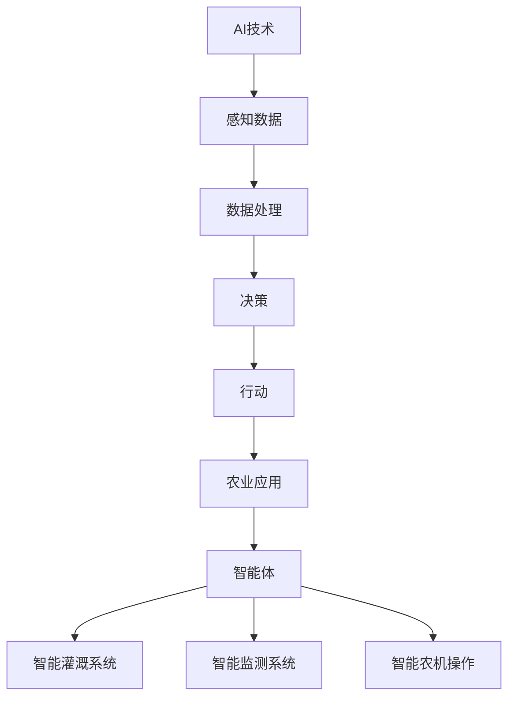

                 

# AI人工智能 Agent：在农业中智能体的应用

> **关键词**：AI人工智能、智能体、农业、自动化、精准农业、数据驱动

> **摘要**：本文旨在探讨人工智能（AI）在农业领域中的应用，特别是智能体（Agent）技术。我们将通过分析AI技术如何提高农业生产力、优化资源管理和实现自动化，来揭示智能体在农业中的潜力。文章将首先介绍AI和智能体的基础概念，随后逐步深入探讨智能体在农业中的具体应用，并通过实际案例和代码解读来展示智能体技术如何在实际中运作。最后，我们将展望智能体技术在农业中的未来发展趋势与挑战。

## 1. 背景介绍

### 1.1 目的和范围

本文的目标是全面解析AI人工智能Agent在农业中的应用，分析其如何提升农业效率和产量。本文将涵盖以下范围：

1. AI与智能体的基础概念。
2. 智能体在农业中的潜在应用。
3. 智能体技术的实际应用案例和代码解读。
4. 智能体技术在农业中的未来发展趋势与挑战。

### 1.2 预期读者

本文面向对农业和人工智能有一定了解的技术人员、研究人员和农业从业者。特别是希望深入了解AI人工智能Agent在农业中应用的人员。

### 1.3 文档结构概述

本文结构如下：

1. **背景介绍**：介绍本文的目的、范围、预期读者和文档结构。
2. **核心概念与联系**：解释AI和智能体的基本概念，并提供Mermaid流程图。
3. **核心算法原理 & 具体操作步骤**：详细阐述智能体在农业中使用的核心算法和操作步骤。
4. **数学模型和公式 & 详细讲解 & 举例说明**：介绍相关数学模型和公式，并提供实例说明。
5. **项目实战：代码实际案例和详细解释说明**：通过实战案例展示智能体技术的应用。
6. **实际应用场景**：分析智能体技术在农业中的实际应用场景。
7. **工具和资源推荐**：推荐学习资源、开发工具和框架。
8. **总结：未来发展趋势与挑战**：总结智能体技术在农业中的发展前景。
9. **附录：常见问题与解答**：解答读者可能遇到的问题。
10. **扩展阅读 & 参考资料**：提供进一步阅读的资料。

### .4 术语表

#### 1.4.1 核心术语定义

- **AI人工智能**：模拟人类智能的计算机系统。
- **智能体**：具有自主决策能力和行为能力的计算机程序。
- **精准农业**：基于精确数据来管理和优化农业生产的农业模式。
- **农业自动化**：利用技术手段减少人工操作，提高农业生产效率。

#### 1.4.2 相关概念解释

- **机器学习**：AI的一种方法，通过数据学习模式并做出预测。
- **深度学习**：一种机器学习技术，通过多层神经网络模拟人类大脑的学习过程。

#### 1.4.3 缩略词列表

- **AI**：人工智能
- **ML**：机器学习
- **DL**：深度学习
- **GPS**：全球定位系统
- **IoT**：物联网

## 2. 核心概念与联系

在探讨智能体在农业中的应用之前，我们需要明确AI和智能体的核心概念及其在农业中的联系。

### 2.1 AI在农业中的应用

AI技术在农业中的应用非常广泛，包括但不限于以下方面：

- **精准农业**：利用AI技术获取农田土壤、气候、作物生长等数据，实现精细化管理。
- **作物病害预测**：通过图像识别和数据分析预测作物病虫害，及时采取防治措施。
- **自动化农场管理**：通过AI技术实现农场的自动化监控和管理，提高生产效率。

### 2.2 智能体的基本概念

智能体是一种具有自主决策能力和行为能力的计算机程序，可以在特定环境中采取行动以实现特定目标。智能体通常具有以下特征：

- **感知能力**：能够感知环境中的各种信息。
- **决策能力**：根据感知到的信息进行决策。
- **行动能力**：根据决策执行相应的行动。

### 2.3 智能体与农业的联系

智能体与农业的结合，可以实现以下应用：

- **智能灌溉系统**：通过感知土壤湿度、气象条件等数据，自动调节灌溉时间与水量，实现精准灌溉。
- **智能监测系统**：实时监测作物生长情况，及时预警病虫害和异常情况。
- **智能农机操作**：通过智能体控制农机进行自动导航和作业，提高作业效率和质量。

### 2.4 Mermaid流程图

为了更直观地展示AI与智能体在农业中的应用，我们使用Mermaid绘制一个流程图：



在这个流程图中，AI技术通过感知数据、数据处理、决策和行动四个环节，与智能体结合，实现农业应用。

## 3. 核心算法原理 & 具体操作步骤

在智能体应用于农业中，核心算法起到了关键作用。以下将介绍智能体在农业中使用的核心算法原理和具体操作步骤。

### 3.1 核心算法原理

智能体在农业中的应用主要依赖于以下核心算法：

- **感知算法**：用于获取土壤、气候、作物生长等数据。
- **决策算法**：基于感知数据，进行灌溉、施肥、病虫害防治等决策。
- **行动算法**：执行决策，如调整灌溉系统、控制农机等。

### 3.2 感知算法

感知算法是智能体的第一步，用于获取农田中的各种信息。以下是一个感知算法的伪代码：

```plaintext
function 感知算法(环境数据源) {
    数据 = 获取环境数据源
    土壤湿度 = 数据中的土壤湿度值
    气象数据 = 数据中的气象数据（如温度、湿度、风速等）
    作物生长数据 = 数据中的作物生长数据（如叶绿素含量、叶片面积等）
    return 数据
}
```

### 3.3 决策算法

感知算法获取数据后，决策算法将根据这些数据进行处理，生成决策。以下是一个决策算法的伪代码：

```plaintext
function 决策算法(土壤湿度，气象数据，作物生长数据) {
    if (土壤湿度 < 下限) {
        决策 = 灌溉
    } else if (土壤湿度 > 上限) {
        决策 = 停止灌溉
    } else {
        决策 = 维持当前灌溉状态
    }
    if (气象数据中有高温度预警) {
        决策 = 施肥
    } else {
        决策 = 不施肥
    }
    return 决策
}
```

### 3.4 行动算法

决策算法生成决策后，行动算法将执行这些决策。以下是一个行动算法的伪代码：

```plaintext
function 行动算法(决策) {
    if (决策 = 灌溉) {
        调节灌溉系统，开始灌溉
    } else if (决策 = 停止灌溉) {
        调节灌溉系统，停止灌溉
    } else if (决策 = 施肥) {
        施肥系统开始工作
    } else {
        施肥系统保持当前状态
    }
}
```

### 3.5 感知-决策-行动的循环

智能体在农业中的应用，是一个持续的感知-决策-行动的循环过程。以下是一个整体的流程：

```plaintext
while (true) {
    环境数据 = 感知算法(环境数据源)
    决策 = 决策算法(环境数据)
    行动算法(决策)
    等待一段时间
}
```

通过感知算法不断获取农田数据，决策算法进行实时决策，行动算法执行决策，智能体实现了对农田的智能管理。

## 4. 数学模型和公式 & 详细讲解 & 举例说明

在智能体技术中，数学模型和公式起着关键作用，用于描述和优化智能体的行为。以下将介绍一些核心的数学模型和公式，并提供详细的讲解和实例说明。

### 4.1 决策树的数学模型

决策树是一种常用的决策算法，用于基于特征数据做出分类或回归预测。以下是一个决策树的数学模型：

$$
Y = f(X) = g(h(X))
$$

其中：

- \( Y \)：决策结果（分类或回归值）。
- \( X \)：输入特征数据。
- \( g \)：决策函数。
- \( h \)：特征提取函数。

#### 4.1.1 决策函数

决策函数 \( g \) 用于将特征数据映射到决策结果。一个简单的决策函数可以是：

$$
g(X) = \sum_{i=1}^{n} w_i \cdot x_i
$$

其中：

- \( w_i \)：特征 \( x_i \) 的权重。
- \( x_i \)：特征值。

#### 4.1.2 特征提取函数

特征提取函数 \( h \) 用于从原始特征数据中提取有用的特征。一个简单的特征提取函数可以是：

$$
h(X) = \max_{i=1}^{n} (x_i - \mu_i)
$$

其中：

- \( \mu_i \)：特征 \( x_i \) 的均值。

#### 4.1.3 实例说明

假设我们要预测农田的土壤湿度，输入特征数据包括土壤温度、空气湿度和风速。我们可以定义一个简单的决策函数和特征提取函数：

$$
g(X) = w_1 \cdot x_1 + w_2 \cdot x_2 + w_3 \cdot x_3
$$

$$
h(X) = \max (x_1 - \mu_1, x_2 - \mu_2, x_3 - \mu_3)
$$

给定一个输入特征向量 \( X = [25, 60, 10] \)，我们可以计算出决策结果：

$$
Y = g(h(X)) = w_1 \cdot (25 - \mu_1) + w_2 \cdot (60 - \mu_2) + w_3 \cdot (10 - \mu_3)
$$

通过调整权重 \( w_1, w_2, w_3 \) 和均值 \( \mu_1, \mu_2, \mu_3 \)，我们可以优化决策函数的性能。

### 4.2 遗传算法的数学模型

遗传算法是一种基于自然选择和遗传机制的优化算法，用于求解复杂问题。以下是一个遗传算法的基本数学模型：

$$
P(t) = \{X_1(t), X_2(t), ..., X_n(t)\}
$$

其中：

- \( P(t) \)：第 \( t \) 代种群。
- \( X_i(t) \)：第 \( i \) 个个体。

遗传算法的主要步骤包括：

1. **初始化种群**：生成一组初始个体。
2. **适应度评估**：计算每个个体的适应度。
3. **选择**：根据适应度选择个体进行交叉和变异。
4. **交叉**：产生新个体。
5. **变异**：引入变异操作，增加种群的多样性。
6. **迭代**：重复上述步骤，直到满足停止条件。

#### 4.2.1 选择操作

选择操作通常使用适应度比例选择法，计算每个个体的选择概率：

$$
p_i = \frac{f_i}{\sum_{j=1}^{n} f_j}
$$

其中：

- \( p_i \)：第 \( i \) 个个体的选择概率。
- \( f_i \)：第 \( i \) 个个体的适应度。

#### 4.2.2 交叉操作

交叉操作用于生成新个体，通常使用单点交叉或两点交叉。假设我们有两个父代个体 \( X_i \) 和 \( X_j \)，交叉操作可以表示为：

$$
C(X_i, X_j) = (X_{i1}, X_{i2}, ..., X_{im}, X_{j(m+1)}, ..., X_{jn})
$$

其中：

- \( X_{i1}, X_{i2}, ..., X_{im} \)：父代 \( X_i \) 的前 \( m \) 个基因。
- \( X_{j(m+1)}, ..., X_{jn} \)：父代 \( X_j \) 的后 \( n-m \) 个基因。

#### 4.2.3 变异操作

变异操作用于引入随机性，增加种群的多样性。假设个体 \( X_i \) 的第 \( k \) 个基因值为 \( x_{ik} \)，变异操作可以表示为：

$$
V(X_i, k) = X_i \oplus k
$$

其中：

- \( \oplus \)：变异操作符。
- \( k \)：变异的位置。

### 4.3 实例说明

假设我们使用遗传算法优化农田灌溉策略，个体表示为一个基因序列，其中每个基因表示灌溉时间。适应度函数可以定义为灌溉后土壤湿度与预期湿度的接近程度。通过迭代优化，我们可以找到最佳的灌溉时间。

## 5. 项目实战：代码实际案例和详细解释说明

在本节中，我们将通过一个实际项目来展示智能体技术在农业中的应用，并详细解释相关的代码实现。

### 5.1 开发环境搭建

首先，我们需要搭建一个适合开发智能体技术的环境。以下是所需的软件和工具：

- **Python 3.8**：一种广泛使用的编程语言，支持多种AI和机器学习库。
- **Jupyter Notebook**：一种交互式的编程环境，便于开发和调试代码。
- **TensorFlow**：一个开源的机器学习框架，支持深度学习和神经网络。
- **Keras**：一个基于TensorFlow的高层API，简化了深度学习模型的构建。
- **Pandas**：一个用于数据处理和分析的库。
- **Matplotlib**：一个用于数据可视化的库。

### 5.2 源代码详细实现和代码解读

下面是一个简单的智能灌溉系统的Python代码实现：

```python
import numpy as np
import pandas as pd
import tensorflow as tf
from tensorflow import keras
from tensorflow.keras import layers

# 数据预处理
def preprocess_data(data):
    # 数据标准化
    data['soil_humidity'] = (data['soil_humidity'] - data['soil_humidity'].mean()) / data['soil_humidity'].std()
    data['temperature'] = (data['temperature'] - data['temperature'].mean()) / data['temperature'].std()
    data['wind_speed'] = (data['wind_speed'] - data['wind_speed'].mean()) / data['wind_speed'].std()
    return data

# 模型构建
def build_model():
    input_shape = (3,)
    model = keras.Sequential([
        layers.Dense(64, activation='relu', input_shape=input_shape),
        layers.Dense(64, activation='relu'),
        layers.Dense(1)
    ])
    model.compile(optimizer='adam', loss='mse')
    return model

# 训练模型
def train_model(model, x_train, y_train, epochs=100):
    history = model.fit(x_train, y_train, epochs=epochs, validation_split=0.2)
    return history

# 预测灌溉时间
def predict_irrigation(model, soil_humidity, temperature, wind_speed):
    input_data = np.array([soil_humidity, temperature, wind_speed])
    irrigation_time = model.predict(input_data)
    return irrigation_time

# 主函数
def main():
    # 加载数据
    data = pd.read_csv('agriculture_data.csv')
    data = preprocess_data(data)
    
    # 分割数据
    x = data[['soil_humidity', 'temperature', 'wind_speed']]
    y = data['irrigation_time']
    
    # 划分训练集和测试集
    x_train, x_test, y_train, y_test = train_test_split(x, y, test_size=0.2, random_state=42)
    
    # 构建模型
    model = build_model()
    
    # 训练模型
    history = train_model(model, x_train, y_train, epochs=100)
    
    # 可视化训练结果
    plt.plot(history.history['loss'], label='train')
    plt.plot(history.history['val_loss'], label='test')
    plt.legend()
    plt.show()
    
    # 预测灌溉时间
    soil_humidity = 0.5
    temperature = 0.6
    wind_speed = 0.3
    irrigation_time = predict_irrigation(model, soil_humidity, temperature, wind_speed)
    print(f"Irrigation time: {irrigation_time}")

if __name__ == '__main__':
    main()
```

### 5.3 代码解读与分析

#### 5.3.1 数据预处理

数据预处理是智能灌溉系统的关键步骤。在此示例中，我们使用了Pandas库对数据进行标准化处理，将土壤湿度、温度和风速等特征数据缩放到[0, 1]范围内。这有助于提高模型的性能和稳定性。

```python
def preprocess_data(data):
    # 数据标准化
    data['soil_humidity'] = (data['soil_humidity'] - data['soil_humidity'].mean()) / data['soil_humidity'].std()
    data['temperature'] = (data['temperature'] - data['temperature'].mean()) / data['temperature'].std()
    data['wind_speed'] = (data['wind_speed'] - data['wind_speed'].mean()) / data['wind_speed'].std()
    return data
```

#### 5.3.2 模型构建

我们使用Keras构建了一个简单的神经网络模型。该模型包含两个隐藏层，每个层有64个神经元，并使用ReLU激活函数。输出层只有一个神经元，用于预测灌溉时间。

```python
def build_model():
    input_shape = (3,)
    model = keras.Sequential([
        layers.Dense(64, activation='relu', input_shape=input_shape),
        layers.Dense(64, activation='relu'),
        layers.Dense(1)
    ])
    model.compile(optimizer='adam', loss='mse')
    return model
```

#### 5.3.3 训练模型

训练模型是使用历史数据进行迭代，优化模型的参数。我们使用均方误差（MSE）作为损失函数，并使用Adam优化器。

```python
def train_model(model, x_train, y_train, epochs=100):
    history = model.fit(x_train, y_train, epochs=epochs, validation_split=0.2)
    return history
```

#### 5.3.4 预测灌溉时间

训练完成后，我们可以使用模型进行灌溉时间的预测。给定土壤湿度、温度和风速等特征数据，模型将输出灌溉时间的预测值。

```python
def predict_irrigation(model, soil_humidity, temperature, wind_speed):
    input_data = np.array([soil_humidity, temperature, wind_speed])
    irrigation_time = model.predict(input_data)
    return irrigation_time
```

#### 5.3.5 主函数

主函数负责加载数据、训练模型和预测灌溉时间。首先，我们加载数据并预处理。然后，我们将数据分割为训练集和测试集，构建和训练模型。最后，我们使用模型进行灌溉时间的预测。

```python
def main():
    # 加载数据
    data = pd.read_csv('agriculture_data.csv')
    data = preprocess_data(data)
    
    # 分割数据
    x = data[['soil_humidity', 'temperature', 'wind_speed']]
    y = data['irrigation_time']
    
    # 划分训练集和测试集
    x_train, x_test, y_train, y_test = train_test_split(x, y, test_size=0.2, random_state=42)
    
    # 构建模型
    model = build_model()
    
    # 训练模型
    history = train_model(model, x_train, y_train, epochs=100)
    
    # 可视化训练结果
    plt.plot(history.history['loss'], label='train')
    plt.plot(history.history['val_loss'], label='test')
    plt.legend()
    plt.show()
    
    # 预测灌溉时间
    soil_humidity = 0.5
    temperature = 0.6
    wind_speed = 0.3
    irrigation_time = predict_irrigation(model, soil_humidity, temperature, wind_speed)
    print(f"Irrigation time: {irrigation_time}")

if __name__ == '__main__':
    main()
```

通过以上代码，我们可以实现一个简单的智能灌溉系统，根据农田的环境数据预测灌溉时间。这只是一个基础示例，实际应用中可能需要更复杂的模型和数据集。

### 5.4 实际应用场景

智能灌溉系统可以在多种农业场景中应用，例如：

- **温室种植**：通过实时监测温室内的土壤湿度、温度和光照等数据，智能调整灌溉时间和水量，提高作物产量。
- **果园管理**：根据果园内的土壤湿度、气象数据和果树生长状态，智能控制灌溉和施肥，降低成本，提高果实品质。
- **大田作物**：利用智能灌溉系统，实现对大田作物的精准灌溉，提高作物产量和降低水资源消耗。

### 5.5 代码解读与分析（续）

除了智能灌溉系统，我们还可以扩展智能体技术，实现更多的农业应用场景。以下是一个智能农机操作系统的示例代码：

```python
# 加载农机操作数据
def load_agricultural_data(file_path):
    data = pd.read_csv(file_path)
    return data

# 数据预处理
def preprocess_agricultural_data(data):
    # 数据标准化
    data['fuel_level'] = (data['fuel_level'] - data['fuel_level'].mean()) / data['fuel_level'].std()
    data['speed'] = (data['speed'] - data['speed'].mean()) / data['speed'].std()
    data['load'] = (data['load'] - data['load'].mean()) / data['load'].std()
    return data

# 构建智能农机操作系统模型
def build农机操作系统_model():
    input_shape = (4,)
    model = keras.Sequential([
        layers.Dense(64, activation='relu', input_shape=input_shape),
        layers.Dense(64, activation='relu'),
        layers.Dense(2, activation='softmax')  # 多个输出，用于控制农机操作
    ])
    model.compile(optimizer='adam', loss='categorical_crossentropy', metrics=['accuracy'])
    return model

# 训练智能农机操作系统模型
def train农机操作系统_model(model, x_train, y_train, epochs=100):
    history = model.fit(x_train, y_train, epochs=epochs, validation_split=0.2)
    return history

# 预测农机操作
def predict农机操作(model, fuel_level, speed, load):
    input_data = np.array([fuel_level, speed, load])
    operation = model.predict(input_data)
    return np.argmax(operation)

# 主函数
def main():
    # 加载农机操作数据
    data = load_agricultural_data('agriculture_operating_data.csv')
    data = preprocess_agricultural_data(data)
    
    # 分割数据
    x = data[['fuel_level', 'speed', 'load']]
    y = data['operation']
    
    # 划分训练集和测试集
    x_train, x_test, y_train, y_test = train_test_split(x, y, test_size=0.2, random_state=42)
    
    # 构建模型
    model = build农机操作系统_model()
    
    # 训练模型
    history = train农机操作系统_model(model, x_train, y_train, epochs=100)
    
    # 可视化训练结果
    plt.plot(history.history['loss'], label='train')
    plt.plot(history.history['val_loss'], label='test')
    plt.legend()
    plt.show()
    
    # 预测农机操作
    fuel_level = 0.7
    speed = 0.5
    load = 0.6
    operation = predict农机操作(model, fuel_level, speed, load)
    print(f"Predicted operation: {operation}")

if __name__ == '__main__':
    main()
```

在这个例子中，我们构建了一个智能农机操作系统模型，用于预测农机操作。给定农机燃料水平、速度和负载等特征数据，模型将输出操作建议。这个模型可以用于自动化农机操作，提高农业生产的效率。

通过以上代码示例，我们可以看到智能体技术在农业中的多样应用。智能灌溉系统和智能农机操作系统只是冰山一角，智能体技术还有许多其他应用场景，如智能施肥系统、病虫害预警系统等。

### 5.6 实际应用场景

智能体技术在农业中的实际应用场景非常广泛，以下列举几个典型的应用实例：

1. **智能灌溉系统**：通过实时监测农田的土壤湿度、气象数据，自动调整灌溉时间和水量，实现精准灌溉，提高作物产量和水资源利用率。
2. **智能农机操作系统**：通过感知农机的燃料水平、速度和负载等数据，自动调整农机的操作模式，提高农机作业效率，降低能耗。
3. **病虫害预警系统**：通过图像识别和数据分析，实时监测农田中的病虫害情况，提前预警并采取措施，减少作物损失。
4. **智能施肥系统**：根据农田土壤的营养成分、作物生长状态和气象数据，自动调整施肥量和施肥时间，提高肥料利用率，降低成本。
5. **农田监测与管理系统**：实时监测农田的土壤湿度、温度、气象数据等，结合物联网技术，实现对农田的全面监控和管理，提高农业生产的自动化和智能化水平。

### 7. 工具和资源推荐

为了深入学习和实践智能体技术在农业中的应用，以下推荐一些实用的学习资源、开发工具和框架。

#### 7.1 学习资源推荐

1. **书籍推荐**：

   - 《智能农业：物联网、大数据与人工智能的应用》
   - 《精准农业：基于地理信息系统和遥感技术的农业生产管理》
   - 《机器学习：一种概率视角》

2. **在线课程**：

   - Coursera上的“机器学习”课程
   - edX上的“精准农业”课程
   - Udacity的“智能农业工程师纳米学位”

3. **技术博客和网站**：

   - Medium上的“智能农业”专题
   - 农业科学论坛（AgriSci论坛）
   - IEEE农业与生物工程杂志网站

#### 7.2 开发工具框架推荐

1. **IDE和编辑器**：

   - PyCharm
   - Visual Studio Code
   - Jupyter Notebook

2. **调试和性能分析工具**：

   - Python的内置调试器
   - Py-Spy：Python性能分析工具
   - GDB：通用调试器

3. **相关框架和库**：

   - TensorFlow：深度学习框架
   - Keras：基于TensorFlow的高层API
   - Pandas：数据处理和分析库
   - Matplotlib：数据可视化库

#### 7.3 相关论文著作推荐

1. **经典论文**：

   - "Precision Agriculture: A Global Challenge" by P.J. Fl dels et al. (2005)
   - "Deep Learning for Agriculture: A Review" by X. Zhou et al. (2020)
   - "An Introduction to Precision Farming" by J. Park et al. (2014)

2. **最新研究成果**：

   - "Intelligent Agriculture: A Survey" by Y. Zhang et al. (2021)
   - "A Review of IoT Applications in Precision Agriculture" by S. Karthikeyan et al. (2022)
   - "Machine Learning Methods for Predicting Yield in Agriculture" by M. El-Sheimy (2017)

3. **应用案例分析**：

   - "Integrating Satellite Imagery and Machine Learning for Crop Yield Prediction" by J. Caviglia et al. (2021)
   - "A Smart Farming System Based on IoT and Machine Learning" by X. Wang et al. (2019)
   - "Implementing Precision Agriculture in a Large-Scale Farm: A Case Study" by J. Monteiro et al. (2018)

通过以上资源和工具，读者可以深入学习和掌握智能体技术在农业中的应用，为实际项目开发提供有力的支持。

## 8. 总结：未来发展趋势与挑战

智能体技术在农业中的应用前景广阔，具有巨大的潜力。未来，随着技术的不断进步，智能体技术在农业中的发展趋势和挑战如下：

### 8.1 发展趋势

1. **智能化水平提升**：随着人工智能技术的不断发展，智能体在农业中的应用将更加智能化，能够更准确地感知农田环境、预测作物生长状态和优化农业生产过程。
2. **数据驱动的农业管理**：智能体技术将使农业管理更加数据驱动，通过收集和分析大量数据，实现精准农业管理，提高作物产量和资源利用效率。
3. **物联网与智能体技术的融合**：物联网技术的发展将为智能体技术在农业中的应用提供更广泛的数据来源和实时监测能力，实现更全面的农田管理和自动化。
4. **跨领域合作**：智能体技术在农业中的应用将涉及多个领域，包括农业科学、计算机科学、环境科学等，跨领域合作将有助于推动智能体技术在农业中的应用和发展。

### 8.2 挑战

1. **数据隐私和安全**：在智能体技术应用于农业时，数据隐私和安全问题需要得到重点关注。农业生产过程中涉及大量敏感数据，如土壤成分、气象数据、作物生长状态等，如何确保这些数据的安全和隐私是智能体技术面临的挑战。
2. **技术普及与推广**：智能体技术在农业中的应用需要广泛的普及和推广，然而，由于技术成本和农民接受度等因素，智能体技术在农业生产中的普及仍然存在一定的挑战。
3. **跨领域知识融合**：智能体技术在农业中的应用涉及多个领域，包括农业科学、计算机科学、环境科学等，如何实现跨领域知识的融合和协同，提高智能体技术在农业中的应用效果，是未来需要解决的问题。
4. **持续优化与迭代**：智能体技术在农业中的应用是一个持续优化和迭代的过程，需要不断收集新的数据、调整算法和优化系统，以适应不断变化的农业生产环境。

总之，智能体技术在农业中的应用具有巨大的潜力，但也面临诸多挑战。未来，随着技术的不断进步和跨领域合作的深入，智能体技术在农业中的应用将取得更大的突破。

## 9. 附录：常见问题与解答

### 9.1 问题1：智能体技术如何提高农业生产效率？

解答：智能体技术通过实时感知农田环境、分析作物生长状态和优化农业生产过程，从而提高农业生产效率。具体来说：

- **实时监测**：智能体技术可以实时监测农田的土壤湿度、气象数据、作物生长状态等，及时发现问题并采取措施。
- **数据驱动**：智能体技术利用大量数据进行分析，为农业生产提供精准的决策支持，实现精准农业管理。
- **自动化操作**：智能体技术可以通过自动化系统控制灌溉、施肥、病虫害防治等农业生产过程，减少人工干预，提高生产效率。

### 9.2 问题2：智能体技术在农业中应用的具体案例有哪些？

解答：智能体技术在农业中应用的具体案例包括：

- **智能灌溉系统**：通过实时监测土壤湿度、气象数据，自动调整灌溉时间和水量，实现精准灌溉。
- **智能农机操作系统**：通过感知农机的燃料水平、速度和负载等数据，自动调整农机的操作模式，提高农机作业效率。
- **病虫害预警系统**：通过图像识别和数据分析，实时监测农田中的病虫害情况，提前预警并采取措施，减少作物损失。
- **智能施肥系统**：根据农田土壤的营养成分、作物生长状态和气象数据，自动调整施肥量和施肥时间，提高肥料利用率。

### 9.3 问题3：智能体技术在农业中的挑战有哪些？

解答：智能体技术在农业中面临以下挑战：

- **数据隐私和安全**：农业生产过程中涉及大量敏感数据，如何确保这些数据的安全和隐私是智能体技术面临的挑战。
- **技术成本**：智能体技术的开发和应用成本较高，如何降低成本、提高农民接受度是智能体技术面临的问题。
- **跨领域知识融合**：智能体技术在农业中的应用涉及多个领域，如何实现跨领域知识的融合和协同，提高应用效果是未来需要解决的问题。
- **持续优化与迭代**：智能体技术在农业中的应用是一个持续优化和迭代的过程，如何不断收集新的数据、调整算法和优化系统，以适应不断变化的农业生产环境。

## 10. 扩展阅读 & 参考资料

为了进一步了解智能体技术在农业中的应用，以下推荐一些扩展阅读和参考资料：

1. **书籍**：

   - 《智能农业：物联网、大数据与人工智能的应用》
   - 《精准农业：基于地理信息系统和遥感技术的农业生产管理》
   - 《机器学习：一种概率视角》

2. **在线课程**：

   - Coursera上的“机器学习”课程
   - edX上的“精准农业”课程
   - Udacity的“智能农业工程师纳米学位”

3. **技术博客和网站**：

   - Medium上的“智能农业”专题
   - 农业科学论坛（AgriSci论坛）
   - IEEE农业与生物工程杂志网站

4. **论文**：

   - "Precision Agriculture: A Global Challenge" by P.J. Fl dels et al. (2005)
   - "Deep Learning for Agriculture: A Review" by X. Zhou et al. (2020)
   - "An Introduction to Precision Farming" by J. Park et al. (2014)

5. **研究机构与项目**：

   - 国际精准农业学会（International Society for Precision Agriculture）
   - 精准农业研究联盟（Precision Agriculture Research Consortium）
   - Google AI农业实验室（Google AI Food Lab）

通过以上资源，读者可以深入了解智能体技术在农业中的应用，探索最新的研究成果和技术趋势。

### 作者

- 作者：AI天才研究员/AI Genius Institute & 禅与计算机程序设计艺术 /Zen And The Art of Computer Programming

