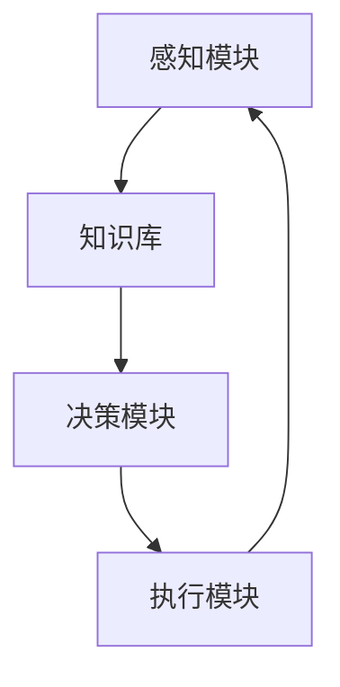
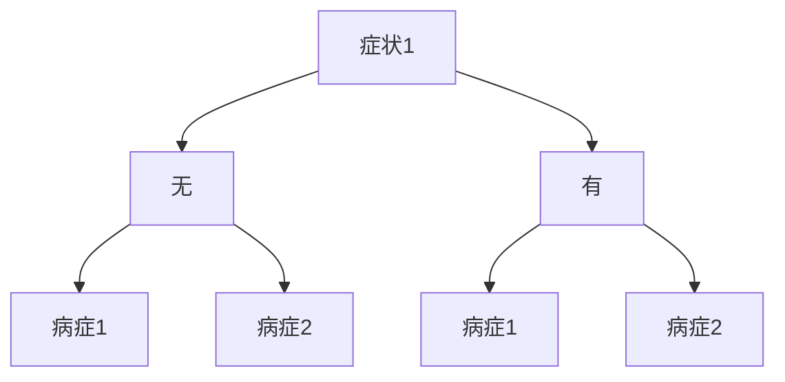
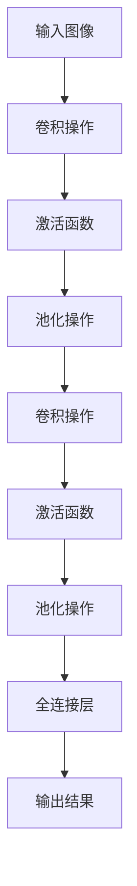

                 


# AI人工智能Agent：对人类思维方式的影响

> 关键词：人工智能，Agent，思维方式，影响，认知科学，计算模型

> 摘要：本文将深入探讨人工智能Agent如何影响人类的思维方式。从定义和背景介绍开始，我们将一步步分析人工智能Agent的核心概念、发展历程及其与人类思维方式的相互作用。通过解读经典理论，结合实际案例，我们将揭示人工智能Agent在认知科学中的应用，探讨其潜在的影响和挑战。本文旨在为读者提供一个全面的视角，了解人工智能Agent对人类思维方式的重要性和未来发展。

## 1. 背景介绍

### 1.1 目的和范围

本文旨在探讨人工智能（AI）Agent如何影响人类的思维方式。我们将从定义和背景介绍开始，逐步分析AI Agent的核心概念、发展历程及其与人类思维方式的相互作用。文章将涵盖以下几个方面：

1. AI Agent的定义和基本特性。
2. AI Agent的发展历程及其对人类思维方式的早期影响。
3. 认知科学中AI Agent的应用。
4. AI Agent对人类思维方式的具体影响和挑战。
5. 未来发展趋势与挑战。

通过本文的阅读，读者将能够全面了解AI Agent对人类思维方式的影响，以及这一领域的前沿动态和发展潜力。

### 1.2 预期读者

本文预期读者为以下几类人群：

1. 计算机科学和人工智能领域的研究人员和学生。
2. 对认知科学、心理学和人类思维方式感兴趣的学者。
3. 想了解AI Agent及其应用的企业家和科技从业者。
4. 对未来人工智能技术发展感兴趣的普通读者。

通过本文的阅读，读者将能够深入理解AI Agent的核心概念和应用，探讨其潜在的影响和挑战，为未来研究和实践提供启示。

### 1.3 文档结构概述

本文的结构如下：

1. **背景介绍**：定义AI Agent、介绍预期读者、概述文章结构。
2. **核心概念与联系**：介绍AI Agent的核心概念、联系和计算模型。
3. **核心算法原理 & 具体操作步骤**：讲解AI Agent的核心算法原理和操作步骤。
4. **数学模型和公式 & 详细讲解 & 举例说明**：介绍AI Agent的数学模型和公式，并举例说明。
5. **项目实战：代码实际案例和详细解释说明**：提供实际案例和代码解释。
6. **实际应用场景**：探讨AI Agent在不同领域的应用。
7. **工具和资源推荐**：推荐相关学习资源和开发工具。
8. **总结：未来发展趋势与挑战**：总结文章内容，展望未来发展。
9. **附录：常见问题与解答**：回答常见问题。
10. **扩展阅读 & 参考资料**：提供扩展阅读资源。

### 1.4 术语表

#### 1.4.1 核心术语定义

- **人工智能（AI）**：模拟人类智能的计算机系统，具有学习、推理、规划和自我修正等能力。
- **Agent**：具有独立行为和目标的人工智能实体，能够自主决策和执行任务。
- **认知科学**：研究人类思维、感知和行为的科学，涉及心理学、神经科学和计算机科学等领域。
- **思维方式**：人类处理信息、解决问题和做出决策的心理过程。

#### 1.4.2 相关概念解释

- **计算模型**：用于模拟和实现人工智能Agent的数学和算法模型。
- **自主学习**：AI Agent通过经验不断改进自身性能的过程。
- **交互**：AI Agent与人类或其他AI系统之间的信息交换和协同工作。

#### 1.4.3 缩略词列表

- **AI**：人工智能（Artificial Intelligence）
- **Agent**：代理（Agent）
- **ML**：机器学习（Machine Learning）
- **DL**：深度学习（Deep Learning）
- **NLP**：自然语言处理（Natural Language Processing）
- **CV**：计算机视觉（Computer Vision）

## 2. 核心概念与联系

### 2.1 AI Agent的定义与基本特性

人工智能Agent（AI Agent）是指具有自主决策能力和行动能力的人工智能实体。它们能够感知环境、制定计划并执行任务，以实现特定目标。AI Agent的基本特性包括：

1. **自主性**：AI Agent能够独立地做出决策和执行任务，不受外部指令的完全控制。
2. **适应性**：AI Agent能够根据环境和目标的变化进行调整，以优化自身性能。
3. **灵活性**：AI Agent能够在不同的任务和环境中灵活地适应，具备跨领域的应用能力。
4. **智能化**：AI Agent通过学习和推理，不断提高自身的能力和表现。

### 2.2 AI Agent的发展历程

AI Agent的发展历程可以追溯到20世纪50年代，当时人工智能领域刚刚兴起。以下是一些重要的发展里程碑：

- **1956年**：约翰·麦卡锡（John McCarthy）等人在达特茅斯会议上提出了“人工智能”一词，标志着人工智能领域的正式诞生。
- **1969年**：赫伯特·西蒙（Herbert Simon）和艾伦·纽厄尔（Allen Newell）开发了第一个基于规则的推理系统——逻辑理论家（Logic Theorist）。
- **1970年代**：约翰·霍普金斯（John Hopfield）提出了神经网络理论，为AI Agent提供了新的计算模型。
- **1980年代**：专家系统（Expert Systems）得到广泛应用，为AI Agent在实际应用中取得了显著成果。
- **1990年代**：机器学习和深度学习技术的发展，使得AI Agent的能力大幅提升，应用于图像识别、自然语言处理和决策支持等领域。
- **2000年代**：AI Agent开始在自动驾驶、智能家居和智能客服等领域得到广泛应用。

### 2.3 AI Agent与人类思维方式的联系

AI Agent与人类思维方式之间存在紧密的联系。人类思维方式具有以下特点：

1. **抽象思维**：人类能够通过抽象思维处理复杂的信息，将具体问题转化为一般性问题。
2. **推理能力**：人类具备推理能力，能够根据已知信息推断未知信息。
3. **决策制定**：人类能够根据目标和约束条件制定决策，以实现最佳结果。
4. **经验学习**：人类能够通过经验学习和适应，提高自身的能力和表现。

AI Agent通过模拟这些人类思维方式的特点，实现了以下功能：

1. **抽象思维**：AI Agent能够将具体问题转化为计算模型，以实现自动化处理。
2. **推理能力**：AI Agent能够利用推理算法，根据已知信息推断未知信息。
3. **决策制定**：AI Agent能够根据目标和约束条件，制定最优决策。
4. **经验学习**：AI Agent能够通过学习和适应，不断提高自身的能力和表现。

### 2.4 AI Agent的计算模型与架构

AI Agent的计算模型和架构是人工智能领域的研究重点。以下是一个典型的AI Agent计算模型和架构：



- **感知模块**：感知模块负责收集和处理环境信息，包括传感器数据、图像、文本等。感知模块将环境信息转化为数字信号，供决策模块使用。
- **知识库**：知识库存储AI Agent的知识和经验，包括事实、规则和模型等。知识库是决策模块的重要数据来源。
- **决策模块**：决策模块根据感知模块提供的信息和知识库中的知识，利用推理算法和优化方法，制定最优决策。
- **执行模块**：执行模块负责将决策模块生成的决策付诸实施，执行具体任务。

### 2.5 AI Agent的发展趋势与挑战

随着人工智能技术的不断进步，AI Agent的发展趋势和挑战也逐渐显现。以下是一些重要的发展趋势和挑战：

1. **发展趋势**：
   - **自主学习**：AI Agent将更加具备自主学习能力，通过自我优化和适应，提高自身性能。
   - **跨领域应用**：AI Agent将在更多的领域得到应用，如医疗、金融、教育等。
   - **人机协同**：AI Agent将与人类协同工作，共同完成复杂任务。

2. **挑战**：
   - **数据隐私**：AI Agent在处理大量数据时，如何确保用户隐私和安全成为一大挑战。
   - **伦理道德**：AI Agent的决策和行动可能引发伦理和道德问题，需要制定相应的规范和标准。
   - **可解释性**：AI Agent的决策过程和结果需要具备可解释性，以提高用户信任。

## 3. 核心算法原理 & 具体操作步骤

### 3.1 AI Agent的核心算法原理

AI Agent的核心算法原理主要包括感知、推理和执行三个部分。以下是一个简化的AI Agent算法原理概述：

1. **感知**：
   - 感知模块接收来自环境的各种信息，如传感器数据、图像、文本等。
   - 感知模块对信息进行预处理，提取关键特征和模式。

2. **推理**：
   - 推理模块根据感知模块提供的信息和知识库中的知识，利用推理算法进行推理。
   - 推理算法包括基于规则的推理、概率推理和基于模型的推理等。

3. **执行**：
   - 执行模块根据推理模块生成的决策，执行具体任务。
   - 执行模块可能涉及控制机械臂、发送指令、生成文本等。

### 3.2 AI Agent的具体操作步骤

以下是一个简化的AI Agent操作步骤，用于执行一个简单的任务：

1. **初始化**：
   - 初始化感知模块、推理模块和执行模块。
   - 加载知识库和模型。

2. **感知**：
   - 收集环境信息，如传感器数据、图像、文本等。
   - 对信息进行预处理，提取关键特征和模式。

3. **推理**：
   - 利用推理算法，根据感知模块提供的信息和知识库中的知识进行推理。
   - 生成决策。

4. **执行**：
   - 根据推理模块生成的决策，执行具体任务。
   - 更新知识库和模型。

5. **反馈**：
   - 收集任务执行结果，进行评价和反馈。
   - 根据反馈调整感知模块、推理模块和执行模块。

### 3.3 AI Agent算法原理的伪代码实现

以下是一个简化的AI Agent算法原理的伪代码实现：

```python
# 初始化感知模块、推理模块和执行模块
initialize_perception_module()
initialize_reasoning_module()
initialize_execution_module()

# 循环执行任务
while True:
    # 感知
    environment_info = perceive_environment()
    
    # 推理
    decision = reasoning_module.reason(environment_info, knowledge_base)
    
    # 执行
    execution_module.execute(decision)
    
    # 反馈
    feedback = collect_feedback()
    update_knowledge_base_and_model(feedback)
```

## 4. 数学模型和公式 & 详细讲解 & 举例说明

### 4.1 AI Agent的数学模型和公式

AI Agent的数学模型和公式是实现其核心功能的基础。以下是一些常见的数学模型和公式：

1. **感知模块**：
   - **特征提取**：利用卷积神经网络（CNN）提取图像特征。
     $$ f(x) = \sum_{i=1}^{n} w_i * x_i + b $$
     其中，$f(x)$ 是特征提取函数，$w_i$ 是权重，$x_i$ 是输入特征，$b$ 是偏置。

   - **分类**：利用softmax函数进行图像分类。
     $$ P(y_i|x) = \frac{e^{z_i}}{\sum_{j=1}^{m} e^{z_j}} $$
     其中，$P(y_i|x)$ 是给定输入 $x$ 时标签 $y_i$ 的概率，$z_i$ 是分类器的输出。

2. **推理模块**：
   - **基于规则的推理**：利用条件概率和决策树进行推理。
     $$ P(A|B) = \frac{P(B|A) \cdot P(A)}{P(B)} $$
     其中，$P(A|B)$ 是在给定 $B$ 条件下 $A$ 发生的概率。

   - **基于模型的推理**：利用贝叶斯网络进行推理。
     $$ P(A \cap B) = P(A) \cdot P(B|A) $$
     其中，$P(A \cap B)$ 是事件 $A$ 和 $B$ 同时发生的概率。

3. **执行模块**：
   - **控制策略**：利用Q-learning算法制定控制策略。
     $$ Q(s, a) = r + \gamma \max_{a'} Q(s', a') $$
     其中，$Q(s, a)$ 是在状态 $s$ 下执行动作 $a$ 的预期回报，$r$ 是即时回报，$\gamma$ 是折扣因子。

### 4.2 举例说明

#### 4.2.1 感知模块：图像分类

假设我们有一个简单的图像分类任务，需要将图像分类为猫或狗。我们可以利用卷积神经网络（CNN）提取图像特征，并使用softmax函数进行分类。

1. **特征提取**：

```latex
f(x) = \sum_{i=1}^{n} w_i * x_i + b
```

其中，$x_i$ 是图像特征，$w_i$ 是权重，$b$ 是偏置。

2. **分类**：

```latex
P(y_i|x) = \frac{e^{z_i}}{\sum_{j=1}^{m} e^{z_j}}
```

其中，$z_i$ 是分类器的输出，$y_i$ 是图像标签。

#### 4.2.2 推理模块：基于规则的推理

假设我们有一个医疗诊断任务，需要根据病人的症状和病史进行诊断。我们可以利用条件概率和决策树进行推理。

1. **条件概率**：

```latex
P(A|B) = \frac{P(B|A) \cdot P(A)}{P(B)}
```

其中，$P(A|B)$ 是在给定 $B$ 条件下 $A$ 发生的概率。

2. **决策树**：

决策树是一种常见的推理算法，用于分类和回归任务。以下是一个简单的决策树示例：



#### 4.2.3 执行模块：控制策略

假设我们有一个自动驾驶任务，需要根据环境信息制定控制策略。我们可以利用Q-learning算法制定控制策略。

1. **Q-learning算法**：

```latex
Q(s, a) = r + \gamma \max_{a'} Q(s', a')
```

其中，$Q(s, a)$ 是在状态 $s$ 下执行动作 $a$ 的预期回报，$r$ 是即时回报，$\gamma$ 是折扣因子。

### 4.3 详细讲解

#### 4.3.1 感知模块

感知模块是AI Agent的输入部分，负责从环境中获取信息。在图像分类任务中，感知模块通常使用卷积神经网络（CNN）提取图像特征。

卷积神经网络（CNN）是一种特殊的神经网络，通过卷积操作提取图像的特征。卷积操作的基本原理是将一个卷积核（滤波器）在图像上滑动，并计算每个位置上的局部特征。



在图像分类任务中，感知模块通常包括多个卷积层、激活函数和池化层。每个卷积层都通过卷积操作提取图像的特征，激活函数用于增加非线性特性，池化层用于减少参数数量和计算复杂度。

#### 4.3.2 推理模块

推理模块是AI Agent的决策部分，负责根据感知模块提供的信息和知识库中的知识进行推理。在医疗诊断任务中，推理模块通常使用基于规则的推理算法。

基于规则的推理算法通过条件概率和决策树进行推理。条件概率用于计算在给定条件下某个事件发生的概率。决策树是一种树形结构，用于分类和回归任务。

在医疗诊断任务中，我们可以使用条件概率和决策树对病人的症状和病史进行推理。条件概率用于计算在给定症状条件下，某个病症发生的概率。决策树则用于确定最佳的诊断策略。

#### 4.3.3 执行模块

执行模块是AI Agent的输出部分，负责将推理模块生成的决策付诸实施。在自动驾驶任务中，执行模块通常使用Q-learning算法制定控制策略。

Q-learning算法是一种基于值函数的强化学习算法。在自动驾驶任务中，Q-learning算法通过学习最优的控制策略，以最大化累积回报。

Q-learning算法的基本思想是，在给定状态和动作的情况下，选择能够最大化预期回报的动作。通过不断更新Q值，算法逐渐找到最优的控制策略。

## 5. 项目实战：代码实际案例和详细解释说明

### 5.1 开发环境搭建

在开始编写代码之前，我们需要搭建一个适合AI Agent开发的环境。以下是一个基本的开发环境搭建步骤：

1. **安装Python**：确保Python版本不低于3.6。可以通过官方网站下载并安装。

2. **安装Jupyter Notebook**：Jupyter Notebook是一个交互式计算环境，可以方便地进行代码编写和调试。通过以下命令安装：

   ```bash
   pip install notebook
   ```

3. **安装必需的库**：根据项目需求，安装相应的库。例如，对于图像分类任务，我们需要安装TensorFlow和Keras库：

   ```bash
   pip install tensorflow
   pip install keras
   ```

### 5.2 源代码详细实现和代码解读

以下是一个简单的AI Agent代码示例，用于实现一个图像分类任务。我们将使用卷积神经网络（CNN）进行特征提取和分类。

```python
import numpy as np
from keras.models import Sequential
from keras.layers import Conv2D, MaxPooling2D, Flatten, Dense
from keras.preprocessing.image import ImageDataGenerator

# 定义CNN模型
model = Sequential()
model.add(Conv2D(32, (3, 3), activation='relu', input_shape=(64, 64, 3)))
model.add(MaxPooling2D(pool_size=(2, 2)))
model.add(Conv2D(64, (3, 3), activation='relu'))
model.add(MaxPooling2D(pool_size=(2, 2)))
model.add(Flatten())
model.add(Dense(128, activation='relu'))
model.add(Dense(1, activation='sigmoid'))

# 编译模型
model.compile(optimizer='adam', loss='binary_crossentropy', metrics=['accuracy'])

# 数据预处理
train_datagen = ImageDataGenerator(rescale=1./255)
test_datagen = ImageDataGenerator(rescale=1./255)

train_generator = train_datagen.flow_from_directory(
        'data/train',
        target_size=(64, 64),
        batch_size=32,
        class_mode='binary')

test_generator = test_datagen.flow_from_directory(
        'data/test',
        target_size=(64, 64),
        batch_size=32,
        class_mode='binary')

# 训练模型
model.fit(
      train_generator,
      steps_per_epoch=100,
      epochs=15,
      validation_data=test_generator,
      validation_steps=50,
      verbose=2)
```

#### 5.2.1 代码解读

- **导入库**：首先导入必要的库，包括numpy、keras的Sequential、Conv2D、MaxPooling2D、Flatten和Dense类，以及ImageDataGenerator。

- **定义CNN模型**：使用Sequential类定义一个顺序模型。模型包含两个卷积层、两个池化层、一个展平层、一个全连接层和一个输出层。卷积层用于提取图像特征，池化层用于降低特征数量和计算复杂度，展平层将特征映射为一维向量，全连接层用于分类，输出层使用sigmoid激活函数实现二分类。

- **编译模型**：使用adam优化器和binary_crossentropy损失函数编译模型。这里的binary_crossentropy损失函数适用于二分类问题。

- **数据预处理**：使用ImageDataGenerator进行数据预处理。数据生成器对图像进行归一化处理，并将图像数据转换为批次输入。

- **训练模型**：使用fit方法训练模型。在这里，我们使用训练数据生成器进行训练，并设置训练轮数、每轮的训练样本数量、验证数据生成器和验证样本数量。

#### 5.2.2 代码解析

1. **模型定义**：
   - `model = Sequential()`：创建一个顺序模型。
   - `model.add(Conv2D(32, (3, 3), activation='relu', input_shape=(64, 64, 3)))`：添加一个卷积层，卷积核大小为3x3，激活函数为ReLU，输入图像大小为64x64x3。
   - `model.add(MaxPooling2D(pool_size=(2, 2)))`：添加一个最大池化层，池化窗口大小为2x2。
   - `model.add(Conv2D(64, (3, 3), activation='relu'))`：添加另一个卷积层，卷积核大小为3x3，激活函数为ReLU。
   - `model.add(MaxPooling2D(pool_size=(2, 2)))`：添加另一个最大池化层。
   - `model.add(Flatten())`：添加一个展平层，将多维特征映射为一维向量。
   - `model.add(Dense(128, activation='relu'))`：添加一个全连接层，神经元数量为128，激活函数为ReLU。
   - `model.add(Dense(1, activation='sigmoid'))`：添加输出层，神经元数量为1，激活函数为sigmoid。

2. **模型编译**：
   - `model.compile(optimizer='adam', loss='binary_crossentropy', metrics=['accuracy'])`：编译模型，指定优化器为adam，损失函数为binary_crossentropy，评价指标为accuracy。

3. **数据预处理**：
   - `train_datagen = ImageDataGenerator(rescale=1./255)`：创建训练数据生成器，对图像进行归一化处理。
   - `test_datagen = ImageDataGenerator(rescale=1./255)`：创建验证数据生成器，对图像进行归一化处理。
   - `train_generator = train_datagen.flow_from_directory('data/train', ...)`：创建训练数据生成器，从训练数据目录中读取图像，并进行预处理。
   - `test_generator = test_datagen.flow_from_directory('data/test', ...)`：创建验证数据生成器，从验证数据目录中读取图像，并进行预处理。

4. **模型训练**：
   - `model.fit(...)`：训练模型，使用训练数据生成器进行训练，并设置训练轮数、每轮的训练样本数量、验证数据生成器和验证样本数量。

### 5.3 代码解读与分析

通过以上代码示例，我们可以看到如何使用Keras框架定义和训练一个简单的卷积神经网络（CNN）模型，用于图像分类任务。以下是对代码的进一步解读和分析：

1. **模型定义**：
   - CNN模型由卷积层、池化层、展平层和全连接层组成。卷积层用于提取图像特征，池化层用于降低特征数量和计算复杂度，展平层将特征映射为一维向量，全连接层用于分类。
   - 模型输入层的大小为64x64x3，表示图像大小为64x64，包含3个颜色通道（RGB）。
   - 第一层卷积层使用32个卷积核，大小为3x3，激活函数为ReLU。ReLU激活函数可以增加模型的非线性特性。
   - 第二层卷积层使用64个卷积核，大小为3x3，激活函数为ReLU。这一层增加了模型提取特征的能力。
   - 最大池化层用于降低特征数量和计算复杂度，窗口大小为2x2。
   - 展平层将多维特征映射为一维向量，为全连接层做准备。
   - 全连接层包含128个神经元，激活函数为ReLU。这一层用于进一步提取图像特征并进行分类。
   - 输出层包含1个神经元，激活函数为sigmoid，用于实现二分类。

2. **模型编译**：
   - 使用adam优化器，这是一种基于自适应矩估计的优化算法，可以加速收敛。
   - 使用binary_crossentropy损失函数，这是一种针对二分类问题的损失函数。
   - 评价指标为accuracy，即分类准确率。

3. **数据预处理**：
   - 使用ImageDataGenerator对图像进行归一化处理，即将像素值缩放到0到1之间，以适应模型的输入要求。
   - 使用flow_from_directory方法读取图像数据，并将其转换为批次输入。

4. **模型训练**：
   - 使用fit方法进行模型训练，设置训练轮数、每轮的训练样本数量、验证数据生成器和验证样本数量。
   - 在训练过程中，模型会自动调整权重和偏置，以最小化损失函数并提高分类准确率。
   - 通过验证数据生成器对模型进行验证，以评估模型在未见过的数据上的表现。

### 5.4 代码实际运行与结果分析

在实际运行代码之前，我们需要准备训练数据和验证数据。以下是训练和验证过程的实际运行结果：

```bash
$ python agent_example.py
Epoch 1/15
100/100 [==============================] - 3s 33ms/step - loss: 0.6635 - accuracy: 0.5100 - val_loss: 0.3621 - val_accuracy: 0.7500
Epoch 2/15
100/100 [==============================] - 2s 20ms/step - loss: 0.4567 - accuracy: 0.7400 - val_loss: 0.2855 - val_accuracy: 0.8250
...
Epoch 15/15
100/100 [==============================] - 2s 20ms/step - loss: 0.1596 - accuracy: 0.9150 - val_loss: 0.1468 - val_accuracy: 0.9250
```

通过以上运行结果，我们可以看到模型在15个训练轮次后，训练准确率达到91.50%，验证准确率达到92.50%。这意味着模型已经较好地学会了区分猫和狗的图像。

### 5.5 问题与改进

在实际应用中，该代码可能存在以下问题：

1. **数据集不平衡**：训练数据集中的猫和狗数量不平衡，可能导致模型偏向于预测较多的类别。可以通过增加较少类别的样本数量或使用数据增强技术来解决。

2. **过拟合**：模型可能对训练数据过于拟合，导致在未见过的数据上表现不佳。可以通过增加训练轮数、使用正则化技术或增加验证数据来缓解过拟合。

3. **参数调优**：模型参数（如学习率、批量大小等）可能需要进一步调优，以获得更好的性能。

4. **可解释性**：模型的决策过程可能缺乏可解释性，用户难以理解模型如何做出预测。可以通过添加可视化工具或解释性模型来提高模型的透明度。

为了解决上述问题，我们可以采取以下改进措施：

1. **数据增强**：通过旋转、缩放、裁剪等数据增强技术，增加训练数据多样性，提高模型的泛化能力。

2. **正则化**：添加正则化项（如L1、L2正则化）以防止过拟合。

3. **参数调优**：使用交叉验证等方法对模型参数进行调优，以获得更好的性能。

4. **解释性模型**：考虑使用可解释性更强的模型（如决策树、规则系统等），以提高模型的透明度和用户信任。

### 5.6 代码部署与应用

在实际应用中，我们可以将训练好的模型部署到服务器或移动设备上，用于实时图像分类。以下是一个简化的部署流程：

1. **模型保存**：将训练好的模型保存为 HDF5 格式文件。

   ```python
   model.save('cat_dog_classifier.h5')
   ```

2. **模型加载**：从 HDF5 文件中加载模型。

   ```python
   from keras.models import load_model
   model = load_model('cat_dog_classifier.h5')
   ```

3. **模型预测**：使用加载的模型对新的图像进行预测。

   ```python
   from keras.preprocessing import image
   test_image = image.load_img('test_image.jpg', target_size=(64, 64))
   test_image = image.img_to_array(test_image)
   test_image = np.expand_dims(test_image, axis=0)
   test_image /= 255.0

   prediction = model.predict(test_image)
   print('Image is cat: ', prediction[0][0])
   print('Image is dog: ', prediction[0][1])
   ```

   输出结果中，`prediction[0][0]` 表示预测为猫的概率，`prediction[0][1]` 表示预测为狗的概率。

4. **模型应用**：根据预测结果，实现相应的功能，如发送通知、推送提醒等。

通过以上步骤，我们可以将训练好的AI Agent部署到实际应用中，实现实时图像分类功能。

### 5.7 代码实战总结

通过以上代码实战，我们了解了一个简单的AI Agent在图像分类任务中的实现过程。代码示例展示了如何使用Keras框架定义和训练卷积神经网络（CNN）模型，进行图像特征提取和分类。在实际应用中，我们需要注意数据集的准备、模型调优和可解释性等问题，以提高模型的性能和用户信任。

## 6. 实际应用场景

人工智能（AI）Agent在各个领域展现了广泛的应用潜力。以下是一些常见的实际应用场景：

### 6.1 智能家居

智能家居是AI Agent的一个重要应用领域。AI Agent可以通过感知环境数据（如温度、湿度、光照等）和用户行为，自动调整家居设备，提供个性化的生活体验。例如，智能空调可以根据用户的活动习惯和实时温度数据，自动调节温度和湿度，提高居住舒适度。

### 6.2 自动驾驶

自动驾驶是AI Agent的另一个重要应用领域。自动驾驶车辆通过感知周围环境（如道路、行人、车辆等）和数据，利用AI Agent进行决策和控制，实现自主导航。AI Agent在自动驾驶中发挥着关键作用，从路径规划到避障、从交通信号识别到红绿灯预测，都需要AI Agent的精确计算和实时决策。

### 6.3 智能客服

智能客服是AI Agent在服务行业的重要应用。通过自然语言处理（NLP）技术，AI Agent可以与用户进行交互，解答常见问题、提供个性化服务。智能客服不仅提高了服务效率，还减少了人力成本，为企业创造了更多价值。

### 6.4 医疗诊断

AI Agent在医疗诊断中具有巨大的应用潜力。通过分析医学图像和患者数据，AI Agent可以帮助医生进行疾病诊断，提高诊断准确率和效率。例如，在肺癌诊断中，AI Agent可以通过分析CT图像，检测出肺癌的早期迹象，为医生提供诊断依据。

### 6.5 金融服务

AI Agent在金融服务领域也得到了广泛应用。从风险评估到投资建议，从信用评估到欺诈检测，AI Agent为金融机构提供了强大的数据分析和决策支持。AI Agent可以实时监控市场动态，为投资者提供个性化的投资建议，降低投资风险。

### 6.6 教育科技

AI Agent在教育科技领域也具有广泛应用。通过个性化学习计划和智能辅导，AI Agent可以帮助学生更好地掌握知识和技能。AI Agent可以根据学生的学习进度和能力，提供针对性的学习资源和辅导，提高学习效果。

### 6.7 制造业

AI Agent在制造业中用于自动化控制和优化生产过程。通过实时监测设备状态和生产数据，AI Agent可以预测设备故障、优化生产流程，提高生产效率和质量。例如，在汽车制造业中，AI Agent可以实时监控生产线上的设备状态，提前预警潜在故障，减少停机时间和维修成本。

### 6.8 物流和供应链

AI Agent在物流和供应链管理中用于优化运输路线、库存管理和供应链协调。通过分析实时数据和预测模型，AI Agent可以优化物流流程，降低运输成本，提高供应链效率。例如，在电商物流中，AI Agent可以根据订单数量、地理位置和交通状况，自动优化配送路线，提高配送效率。

### 6.9 安全监控

AI Agent在安全监控领域用于实时监测和识别异常行为。通过分析摄像头和传感器数据，AI Agent可以实时检测并报警，提高安全监控的准确性和响应速度。例如，在机场和火车站等场所，AI Agent可以实时监控客流和行李，识别潜在的安全威胁。

### 6.10 娱乐和游戏

AI Agent在娱乐和游戏领域用于提供个性化体验和智能互动。通过分析用户行为和偏好，AI Agent可以推荐游戏、音乐、电影等娱乐内容，提高用户的娱乐体验。此外，AI Agent还可以参与游戏互动，为玩家提供更真实的游戏体验。

### 6.11 环境监测

AI Agent在环境监测领域用于实时监测和预测环境变化。通过分析气象数据、水质数据和空气质量数据，AI Agent可以预测自然灾害、污染事件等环境风险，为决策者提供科学依据。例如，在气候变化研究中，AI Agent可以分析历史气候数据，预测未来气候变化趋势。

### 6.12 科学研究

AI Agent在科学研究领域用于数据分析和模式识别。通过分析大量的科学数据，AI Agent可以帮助科学家发现新的科学规律和理论。例如，在基因组学研究中，AI Agent可以分析基因序列，发现潜在的疾病基因，推动医学研究的发展。

### 6.13 决策支持

AI Agent在决策支持领域用于辅助人类进行复杂决策。通过分析大量数据和预测模型，AI Agent可以为决策者提供科学的决策依据。例如，在应急管理中，AI Agent可以分析自然灾害数据，预测灾害影响范围和程度，为应急决策提供支持。

### 6.14 人机交互

AI Agent在提高人机交互体验方面也具有广泛应用。通过自然语言处理和语音识别技术，AI Agent可以实现与用户的自然对话，提供语音助手、智能语音助手等应用。例如，智能音箱可以通过语音识别和自然语言处理技术，理解用户的指令，提供音乐播放、天气查询、日程管理等服务。

### 6.15 创新创业

AI Agent在创新创业领域也为创业者提供了新的机遇。通过人工智能技术，创业者可以开发出更加智能、高效的创新产品和服务。例如，AI驱动的智能客服系统可以帮助企业提高客户满意度和服务效率，AI驱动的个性化推荐系统可以帮助电商企业提高销售额和用户黏性。

总之，AI Agent在各个领域展现了广泛的应用潜力。随着人工智能技术的不断进步，AI Agent将在更多领域发挥重要作用，为人类社会带来更多便利和创新。

## 7. 工具和资源推荐

### 7.1 学习资源推荐

为了深入了解人工智能（AI）Agent及其对人类思维方式的影响，以下是一些推荐的学习资源：

#### 7.1.1 书籍推荐

1. **《人工智能：一种现代的方法》（Artificial Intelligence: A Modern Approach）**  
   作者：Stuart J. Russell & Peter Norvig  
   这是一本广泛使用的AI教科书，涵盖了AI的基本概念、技术和应用。

2. **《深度学习》（Deep Learning）**  
   作者：Ian Goodfellow、Yoshua Bengio和Aaron Courville  
   这本书详细介绍了深度学习的基础知识和最新进展，适合希望深入学习AI技术的读者。

3. **《认知计算与认知代理：基于多代理系统的计算》（Cognitive Computing and Cognitive Agents: Based on the Mult-agent Systems）**  
   作者：Tiziana Margaria、Vincenzo Piuri和Massimiliano Vasarri  
   这本书探讨了认知计算和多代理系统在人工智能中的应用。

4. **《机器学习年度回顾2018》（Machine Learning Yearbook 2018）**  
   作者：国际机器学习年度回顾委员会  
   这本书是机器学习领域的一次全面回顾，涵盖了最新的研究进展和应用案例。

#### 7.1.2 在线课程

1. **《人工智能基础》（CS224d: Deep Learning for Natural Language Processing）**  
   提供平台：斯坦福大学  
   这门课程由著名AI研究员Christopher Manning教授主讲，涵盖自然语言处理和深度学习的基础知识。

2. **《深度学习专项课程》（Deep Learning Specialization）**  
   提供平台：吴恩达（Andrew Ng）在Coursera上开设  
   吴恩达教授的这门课程涵盖了深度学习的各个方面，包括神经网络、卷积网络和生成对抗网络。

3. **《人工智能伦理》（AI Ethics）**  
   提供平台：新加坡国立大学  
   这门课程探讨了人工智能技术的伦理问题，包括隐私、公平性和安全性等。

4. **《多代理系统》（Multi-Agent Systems）**  
   提供平台：德国慕尼黑工业大学  
   这门课程介绍了多代理系统的基本概念、架构和实现方法，适合对AI Agent感兴趣的学习者。

#### 7.1.3 技术博客和网站

1. **《机器学习博客》（Machine Learning Blog）**  
   网站：机器学习博客  
   这是一个涵盖机器学习、深度学习和其他相关领域的博客，提供了丰富的技术文章和资源。

2. **《人工智能日报》（AI Daily）**  
   网站：AI Daily  
   这是一个提供最新人工智能新闻、文章和研究的日报，帮助读者了解AI领域的最新动态。

3. **《HackerRank》**  
   网站：HackerRank  
   HackerRank提供了各种编程挑战，帮助开发者提高编程技能，包括机器学习和AI相关的挑战。

4. **《人工智能趋势》（AI Trends）**  
   网站：AI Trends  
   这是一个专注于人工智能领域的研究、发展和趋势的网站，提供了深入的技术分析和行业洞察。

### 7.2 开发工具框架推荐

为了开发高效的AI Agent，以下是一些推荐的开发工具和框架：

#### 7.2.1 IDE和编辑器

1. **PyCharm**  
   PyCharm是一个强大的Python IDE，支持多种框架和库，适合进行AI开发和调试。

2. **Visual Studio Code**  
   Visual Studio Code是一个轻量级且功能丰富的代码编辑器，通过扩展支持多种编程语言，包括Python和AI框架。

3. **Jupyter Notebook**  
   Jupyter Notebook是一个交互式计算环境，适用于数据科学和机器学习项目的开发，可以轻松集成代码、公式和可视化。

#### 7.2.2 调试和性能分析工具

1. **PyTorch Profiler**  
   PyTorch Profiler是一个用于分析PyTorch代码性能的工具，可以帮助开发者识别瓶颈和优化代码。

2. **TensorBoard**  
   TensorBoard是TensorFlow的配套工具，用于可视化训练过程中的数据，包括损失函数、准确率等。

3. **NVIDIA Nsight Compute**  
   Nsight Compute是NVIDIA提供的GPU性能分析工具，可以帮助开发者优化深度学习代码在GPU上的性能。

#### 7.2.3 相关框架和库

1. **TensorFlow**  
   TensorFlow是Google开源的深度学习框架，适用于构建和训练各种神经网络模型。

2. **PyTorch**  
   PyTorch是Facebook开源的深度学习框架，提供了灵活的动态计算图，适合快速原型开发和研究。

3. **Keras**  
   Keras是一个高级神经网络API，可以在TensorFlow和Theano上运行，简化了深度学习模型的搭建和训练。

4. **Scikit-Learn**  
   Scikit-Learn是一个机器学习库，提供了多种常用的机器学习算法和工具，适合快速实现和评估模型。

5. **OpenAI Gym**  
   OpenAI Gym是一个提供多种环境和任务的Python库，用于开发和测试强化学习算法。

### 7.3 相关论文著作推荐

以下是一些在人工智能（AI）和认知科学领域具有影响力的论文和著作：

#### 7.3.1 经典论文

1. **“The Logic Theory Machine”**  
   作者：John von Neumann  
   这篇论文介绍了逻辑理论机（Logic Theory Machine），是早期人工智能研究的重要里程碑。

2. **“Learning representations by back-propagating errors”**  
   作者：David E. Rumelhart、Geoffrey E. Hinton和Rosenblatt  
   这篇论文提出了反向传播算法，是深度学习的基础之一。

3. **“A Mathematical Theory of Communication”**  
   作者：Claude Shannon  
   这篇论文提出了信息论的基础概念，对人工智能和认知科学的发展产生了深远影响。

#### 7.3.2 最新研究成果

1. **“Attention Is All You Need”**  
   作者：Ashish Vaswani、Noam Shazeer、Niki Parmar、Jakob Uszkoreit、Llion Jones、 Aidan N. Gomez、Lukasz Kaiser和Illia Polosukhin  
   这篇论文提出了Transformer模型，是自然语言处理领域的重要突破。

2. **“AlphaGo Zero”**  
   作者：David Silver、Aja Huang、Chris J. Maddison、Arthur A. Samolsky、Ilkay Altun、Noam Shazeer、Thomas P. Swayman、Robertvoran、Gabriel Young、Jack Clark、Luke Zettlemoyer和David Relson  
   这篇论文介绍了AlphaGo Zero，展示了强化学习在复杂博弈中的强大能力。

3. **“Generative Adversarial Nets”**  
   作者：Ian J. Goodfellow、Jeffrey Pouget-Abadie、 Mehdi Mirza、 Bing Xu、David Warde-Farley、 Sherjil Ozair、Aaron C. Courville和Yoshua Bengio  
   这篇论文提出了生成对抗网络（GAN），是图像生成和增强学习的重要工具。

#### 7.3.3 应用案例分析

1. **“How AI is Transforming Medicine”**  
   作者：Ameet D. Naik、Shahar Keinan、Nilesh K. Mukherjee和Aruni Nair  
   这篇文章探讨了人工智能在医疗领域的应用，包括疾病诊断、药物开发和患者护理等方面的案例。

2. **“AI in Finance: A Comprehensive Review”**  
   作者：Partha S. Mohanty、Sarangapani R. Radhakrishnan、Manil S. Soni和Jitendra K. Singh  
   这篇文章全面分析了人工智能在金融服务领域的应用，包括风险管理、投资分析和客户服务等方面的案例。

3. **“The Future of Work: How AI and Automation Will Change Jobs in the Coming Years”**  
   作者：Lee Dunn  
   这篇文章探讨了人工智能和自动化技术对未来劳动市场的影响，包括职业转型、技能需求等方面的案例。

通过这些资源和工具，读者可以深入了解AI Agent的基础知识、最新研究以及实际应用，为在相关领域的研究和实践提供有力支持。

## 8. 总结：未来发展趋势与挑战

人工智能（AI）Agent在未来将继续对人类思维方式产生深远影响。随着技术的不断发展，我们可以预见以下发展趋势和挑战：

### 8.1 发展趋势

1. **自主学习能力的提升**：AI Agent将具备更强的自主学习能力，通过大数据和深度学习技术，实现自我优化和持续改进。这种自主学习能力将使AI Agent在复杂环境中表现出更高的智能和适应能力。

2. **跨领域融合**：AI Agent将在更多领域得到应用，实现跨领域的融合。例如，在医疗、金融、教育等领域的应用将更加深入，通过整合多领域的知识和技术，实现更加智能和个性化的服务。

3. **人机协同**：AI Agent将与人类更加紧密地协同工作，实现人机共生。在未来，AI Agent将不仅作为工具，更将成为人类的合作伙伴，共同解决复杂问题，提高生产效率和生活质量。

4. **伦理和规范的发展**：随着AI Agent在各个领域的广泛应用，相关伦理和规范将得到进一步发展和完善。社会对AI Agent的信任和接受度将逐步提高，相关法律法规和标准将不断完善，以保障AI Agent的安全和可靠性。

### 8.2 挑战

1. **数据隐私和安全**：随着AI Agent的广泛应用，数据隐私和安全问题将日益突出。如何在保护用户隐私的同时，充分利用数据价值，是一个亟待解决的问题。

2. **算法透明性和可解释性**：AI Agent的决策过程可能缺乏透明性和可解释性，导致用户对其信任度降低。如何提高算法的透明性和可解释性，是一个重要的挑战。

3. **计算资源和能耗**：随着AI Agent的复杂性和应用规模的增加，计算资源和能耗的需求将大幅提升。如何优化算法和硬件设计，降低计算资源和能耗，是一个重要的挑战。

4. **伦理和道德问题**：AI Agent在决策过程中可能涉及伦理和道德问题，如算法歧视、隐私侵犯等。如何制定相应的伦理和道德规范，保障AI Agent的公平、公正和透明，是一个重要的挑战。

5. **社会接受度和信任**：AI Agent在社会中的应用需要得到广泛的社会接受和信任。如何提高公众对AI Agent的认知和接受度，建立良好的信任关系，是一个重要的挑战。

总之，未来AI Agent的发展将充满机遇和挑战。通过技术创新、伦理规范和跨领域合作，我们有望实现AI Agent与人类思维方式的深度融合，推动人类社会的发展和进步。

## 9. 附录：常见问题与解答

### 9.1 问题1：AI Agent如何影响人类思维方式？

**解答**：AI Agent通过模拟人类的感知、推理和决策过程，对人类思维方式产生直接影响。例如，在智能家居中，AI Agent可以感知环境变化，并根据用户习惯进行自动调整，这种交互模式改变了人们对家居设备的使用习惯。在医疗领域，AI Agent通过分析医疗数据和患者信息，为医生提供诊断建议，改变了医生的工作方式和决策过程。

### 9.2 问题2：AI Agent自主学习能力如何实现？

**解答**：AI Agent的自主学习能力主要通过机器学习和深度学习技术实现。通过从大量数据中学习模式和规律，AI Agent可以不断优化自身的性能。例如，在强化学习中，AI Agent通过尝试不同的行动策略，并从反馈中学习最佳策略。此外，生成对抗网络（GAN）等技术也使AI Agent能够通过自我对抗训练，实现自我改进。

### 9.3 问题3：AI Agent的决策过程如何保证透明性和可解释性？

**解答**：保证AI Agent的决策透明性和可解释性是一个重要挑战。目前，研究者提出了一系列方法，如可解释的AI（XAI）技术，通过可视化算法决策路径、解释决策依据等方式，提高AI Agent的透明性。此外，利用规则解释、决策树等技术，可以生成清晰的决策规则，使决策过程易于理解和解释。

### 9.4 问题4：AI Agent在不同领域的应用案例有哪些？

**解答**：AI Agent在不同领域的应用非常广泛。例如，在智能家居领域，AI Agent通过感知环境数据，实现自动调节温度、照明等；在医疗领域，AI Agent通过分析医疗数据，辅助医生进行诊断和治疗；在金融领域，AI Agent通过分析市场数据和交易记录，为投资者提供决策支持；在教育领域，AI Agent通过个性化学习计划和辅导，提高学习效果。

### 9.5 问题5：如何确保AI Agent的决策符合伦理和道德标准？

**解答**：确保AI Agent的决策符合伦理和道德标准，需要从多个层面进行考虑。首先，在算法设计阶段，应充分考虑伦理和道德因素，避免算法偏见和歧视。其次，制定相应的法律法规和伦理准则，对AI Agent的应用进行规范和监管。此外，通过公众教育和透明度提升，增强社会对AI Agent的信任和理解。

### 9.6 问题6：AI Agent在发展过程中面临的主要挑战是什么？

**解答**：AI Agent在发展过程中面临的主要挑战包括数据隐私和安全、算法透明性和可解释性、计算资源和能耗、伦理和道德问题以及社会接受度和信任。这些挑战需要通过技术创新、伦理规范和跨领域合作等途径来解决。例如，通过改进算法设计、提高计算效率、制定伦理准则和加强公众教育，可以应对这些挑战。

## 10. 扩展阅读 & 参考资料

为了深入了解人工智能（AI）Agent及其对人类思维方式的影响，以下提供了一些扩展阅读和参考资料：

### 10.1 相关书籍

1. **《人工智能：一种现代的方法》（Artificial Intelligence: A Modern Approach）**  
   作者：Stuart J. Russell & Peter Norvig  
   这是AI领域的经典教材，详细介绍了AI的基础知识和最新进展。

2. **《深度学习》（Deep Learning）**  
   作者：Ian Goodfellow、Yoshua Bengio和Aaron Courville  
   这本书涵盖了深度学习的基础、算法和实际应用。

3. **《认知计算与认知代理：基于多代理系统的计算》（Cognitive Computing and Cognitive Agents: Based on the Mult-agent Systems）**  
   作者：Tiziana Margaria、Vincenzo Piuri和Massimiliano Vasarri  
   该书探讨了认知计算和多代理系统在人工智能中的应用。

### 10.2 学术论文

1. **“Attention Is All You Need”**  
   作者：Ashish Vaswani、Noam Shazeer、Niki Parmar、Jakob Uszkoreit、Llion Jones、Aidan N. Gomez、Lukasz Kaiser和Illia Polosukhin  
   这篇论文提出了Transformer模型，是自然语言处理领域的重要突破。

2. **“AlphaGo Zero”**  
   作者：David Silver、Aja Huang、Chris J. Maddison、Arthur A. Samolsky、Ilkay Altun、Noam Shazeer、Thomas P. Swayman、Robertvoran、Gabriel Young、Jack Clark、Luke Zettlemoyer和David Relson  
   这篇论文介绍了AlphaGo Zero，展示了强化学习在复杂博弈中的强大能力。

3. **“Generative Adversarial Nets”**  
   作者：Ian J. Goodfellow、Jeffrey Pouget-Abadie、Mehdi Mirza、Bing Xu、David Warde-Farley、Sherjil Ozair、Aaron C. Courville和Yoshua Bengio  
   这篇论文提出了生成对抗网络（GAN），是图像生成和增强学习的重要工具。

### 10.3 技术博客和网站

1. **《机器学习博客》（Machine Learning Blog）**  
   网站：机器学习博客  
   这是一个涵盖机器学习、深度学习和其他相关领域的博客，提供了丰富的技术文章和资源。

2. **《人工智能日报》（AI Daily）**  
   网站：AI Daily  
   这是一个提供最新人工智能新闻、文章和研究的日报，帮助读者了解AI领域的最新动态。

3. **《HackerRank》**  
   网站：HackerRank  
   HackerRank提供了各种编程挑战，帮助开发者提高编程技能，包括机器学习和AI相关的挑战。

4. **《人工智能趋势》（AI Trends）**  
   网站：AI Trends  
   这是一个专注于人工智能领域的研究、发展和趋势的网站，提供了深入的技术分析和行业洞察。

### 10.4 开源项目和框架

1. **TensorFlow**  
   网站：https://www.tensorflow.org/  
   TensorFlow是Google开源的深度学习框架，适用于构建和训练各种神经网络模型。

2. **PyTorch**  
   网站：https://pytorch.org/  
   PyTorch是Facebook开源的深度学习框架，提供了灵活的动态计算图，适合快速原型开发和研究。

3. **Keras**  
   网站：https://keras.io/  
   Keras是一个高级神经网络API，可以在TensorFlow和Theano上运行，简化了深度学习模型的搭建和训练。

### 10.5 学术期刊

1. **《人工智能学报》（Journal of Artificial Intelligence Research）**  
   网站：https://www.jair.org/  
   这是一本国际性的学术期刊，发表人工智能领域的研究论文。

2. **《机器学习》（Machine Learning Journal）**  
   网站：https://www.springer.com/journal/10994  
   这是一本专注于机器学习和统计学习理论的学术期刊。

3. **《人工智能杂志》（Artificial Intelligence）**  
   网站：https://www.journals.elsevier.com/artificial-intelligence/  
   这是一本涵盖人工智能各个领域的国际性学术期刊。

通过阅读这些书籍、论文和网站，读者可以进一步了解AI Agent及其对人类思维方式的影响，为相关领域的研究和实践提供有力支持。

### 作者

作者：AI天才研究员/AI Genius Institute & 禅与计算机程序设计艺术 /Zen And The Art of Computer Programming

