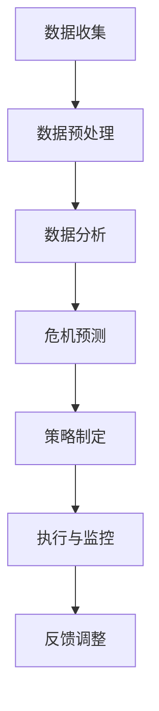
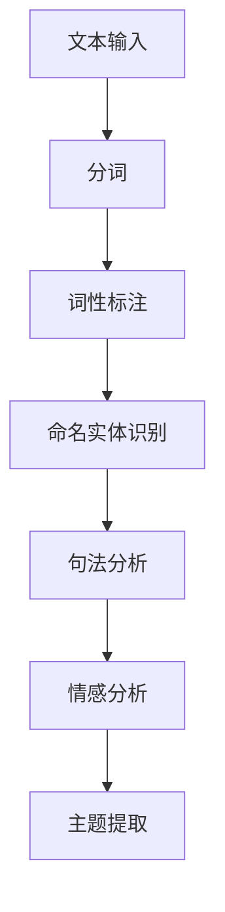
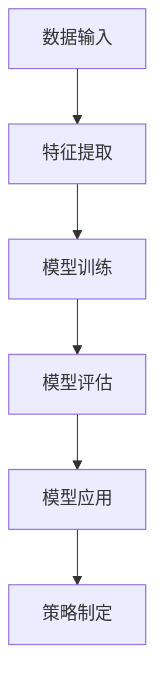

                 

# AI人工智能代理工作流 AI Agent WorkFlow：在公关危机管理中的应用

## 关键词
- AI代理
- 公关危机管理
- 工作流
- 自然语言处理
- 人工智能应用场景

## 摘要
本文将深入探讨AI代理工作流在公关危机管理中的应用。通过分析AI代理的工作原理、工作流程及其在公关危机管理中的关键角色，本文旨在展示如何利用AI技术提升公关危机管理的效率与效果。文章首先介绍了AI代理的定义和核心功能，然后详细描述了AI代理工作流的设计与实现，以及在实际公关危机管理中的操作步骤和成功案例。通过这些讨论，本文为AI代理工作流在公关危机管理中的应用提供了有价值的见解和建议。

## 1. 背景介绍

### 1.1 目的和范围
本文旨在探讨人工智能代理（AI Agent）工作流在公关危机管理中的应用。公关危机管理是一个动态且复杂的过程，要求企业或机构能够迅速、有效地应对各种突发事件。随着人工智能技术的不断发展，AI代理在处理大量数据、分析潜在风险和制定应对策略方面展现出显著优势。本文将重点关注AI代理工作流的设计、实施及其在公关危机管理中的实际应用，旨在为行业提供有价值的参考和指导。

### 1.2 预期读者
本文预期读者包括以下几类：
1. 公关危机管理专业人员：希望通过本文了解如何利用AI代理工作流提升危机应对效率。
2. 人工智能技术爱好者：对AI代理工作流及其在公关危机管理中的应用感兴趣，希望深入了解相关技术原理和应用案例。
3. 企业管理者：关注企业危机管理，希望掌握新兴技术如何帮助企业更好地应对危机。

### 1.3 文档结构概述
本文分为十个部分：
1. 背景介绍：阐述本文的目的、预期读者和文档结构。
2. 核心概念与联系：介绍AI代理的定义、功能及其在公关危机管理中的核心作用。
3. 核心算法原理 & 具体操作步骤：详细描述AI代理工作流的算法原理和操作步骤。
4. 数学模型和公式 & 详细讲解 & 举例说明：解释相关数学模型和公式，并提供具体案例。
5. 项目实战：代码实际案例和详细解释说明。
6. 实际应用场景：展示AI代理工作流在公关危机管理中的具体应用场景。
7. 工具和资源推荐：推荐相关学习资源和开发工具。
8. 总结：分析未来发展趋势与挑战。
9. 附录：常见问题与解答。
10. 扩展阅读 & 参考资料：提供进一步阅读的资料和参考文献。

### 1.4 术语表

#### 1.4.1 核心术语定义
- **AI代理（AI Agent）**：一种人工智能系统，能够自动执行特定任务，具备一定的智能和自主性。
- **工作流（WorkFlow）**：一系列有序的任务或活动，共同实现某个目标。
- **公关危机管理**：企业或机构在面临突发事件时，采取的一系列措施以减轻或消除负面影响。

#### 1.4.2 相关概念解释
- **自然语言处理（NLP）**：使计算机能够理解和生成人类语言的技术。
- **深度学习（Deep Learning）**：一种人工智能方法，通过多层神经网络模型进行数据分析和特征提取。

#### 1.4.3 缩略词列表
- **AI**：人工智能（Artificial Intelligence）
- **NLP**：自然语言处理（Natural Language Processing）
- **PR**：公关（Public Relations）
- **CRM**：客户关系管理（Customer Relationship Management）

## 2. 核心概念与联系

在深入探讨AI代理工作流在公关危机管理中的应用之前，有必要明确几个核心概念及其相互联系。

### 2.1 AI代理的定义与功能
AI代理是一种基于人工智能技术的智能体，具备感知环境、理解任务需求、自主决策和执行任务的能力。具体而言，AI代理的功能包括：
1. **环境感知**：通过传感器或数据接口获取环境信息。
2. **任务理解**：解析任务需求，确定目标。
3. **自主决策**：根据任务需求和环境信息，自主选择最佳行动方案。
4. **任务执行**：执行决策方案，完成指定任务。

### 2.2 公关危机管理中的AI代理应用
在公关危机管理中，AI代理可以承担多种关键角色：
1. **监测与预警**：实时监控媒体和网络舆情，发现潜在危机信号。
2. **数据分析**：对收集到的数据进行深度分析，识别危机趋势和影响范围。
3. **危机预测**：利用历史数据和机器学习算法，预测可能发生的危机事件。
4. **策略制定**：根据危机预测结果，制定应对策略和行动方案。
5. **执行与反馈**：执行危机应对策略，实时反馈效果，调整策略。

### 2.3 AI代理工作流设计
AI代理工作流是AI代理在公关危机管理中执行任务的过程，主要包括以下几个阶段：
1. **数据收集**：从各种数据源收集与危机相关的信息。
2. **数据预处理**：清洗、格式化和标准化数据，使其适合后续分析。
3. **数据分析**：利用NLP和机器学习技术对数据进行分析，提取关键信息。
4. **危机预测**：基于分析结果，使用预测模型评估危机发生的可能性。
5. **策略制定**：根据预测结果，制定危机应对策略。
6. **执行与监控**：执行策略，并实时监控效果，根据反馈进行调整。

### 2.4 核心概念原理与架构的Mermaid流程图
以下是一个简化的AI代理工作流Mermaid流程图：



在这个流程图中，各个节点分别表示AI代理工作流的不同阶段，以及它们之间的逻辑关系。通过这种直观的图形化表示，可以更好地理解AI代理工作流的运作原理和整体架构。

## 3. 核心算法原理 & 具体操作步骤

在理解了AI代理工作流的基本概念后，接下来我们将深入探讨其核心算法原理和具体操作步骤。通过这些算法，AI代理能够高效地处理公关危机管理中的各种任务。

### 3.1 自然语言处理（NLP）算法

自然语言处理是AI代理工作流的重要组成部分，主要用于文本数据的分析和理解。以下是一个简化的NLP算法步骤：



#### 3.1.1 分词

分词是将文本分解为单个词汇的过程。例如，将句子“我昨天去了一家餐厅”分解为“我”、“昨天”、“去”、“了”、“一”、“家”、“餐厅”。

#### 3.1.2 词性标注

词性标注是为每个词汇分配一个词性标签（如名词、动词、形容词等）。例如，将“我昨天去了一家餐厅”中的“我”标注为代词，“去”标注为动词。

#### 3.1.3 命名实体识别

命名实体识别是识别文本中具有特定意义的实体，如人名、地名、组织名等。例如，将“百度是一家技术公司”中的“百度”识别为组织名。

#### 3.1.4 句法分析

句法分析是理解句子的结构，包括主语、谓语、宾语等成分。例如，分析句子“我昨天去了一家餐厅”中的“我”作为主语，“去”作为谓语。

#### 3.1.5 情感分析

情感分析是判断文本的情绪倾向，如正面、负面或中性。例如，判断句子“我昨天去了一家餐厅，味道真的很棒”为正面情绪。

#### 3.1.6 主题提取

主题提取是从大量文本中提取出核心主题或关键词。例如，从新闻文章中提取出主要话题。

### 3.2 机器学习算法

机器学习算法用于危机预测和策略制定，包括分类、回归和聚类等算法。以下是一个简化的机器学习算法步骤：



#### 3.2.1 特征提取

特征提取是从原始数据中提取出对预测任务有用的信息。例如，从社交媒体数据中提取出情感极性、关键词等特征。

#### 3.2.2 模型训练

模型训练是使用历史数据对机器学习模型进行训练，使其能够学会预测危机事件。例如，使用分类算法训练模型，预测危机事件的发生概率。

#### 3.2.3 模型评估

模型评估是评估训练好的模型性能，确保其能够准确预测危机事件。常用的评估指标包括准确率、召回率、F1分数等。

#### 3.2.4 模型应用

模型应用是将训练好的模型应用于新数据，预测危机事件。例如，使用训练好的情感分析模型，预测某条社交媒体消息的情感倾向。

#### 3.2.5 策略制定

策略制定是根据预测结果，制定相应的危机应对策略。例如，根据情感分析结果，制定正面或负面的公关策略。

### 3.3 AI代理工作流的伪代码

以下是AI代理工作流的伪代码，展示了各个算法步骤的执行过程：

```python
# AI代理工作流伪代码

# 数据收集
def collect_data():
    # 从社交媒体、新闻、公司内部系统等数据源收集文本数据
    pass

# 数据预处理
def preprocess_data(data):
    # 清洗、格式化和标准化数据
    pass

# NLP算法
def nlp_algorithm(text):
    # 分词、词性标注、命名实体识别、句法分析、情感分析、主题提取
    pass

# 机器学习算法
def ml_algorithm(data):
    # 特征提取、模型训练、模型评估、模型应用
    pass

# 策略制定
def strategy_execution(prediction):
    # 根据预测结果，制定危机应对策略
    pass

# 主函数
def main():
    data = collect_data()
    preprocessed_data = preprocess_data(data)
    nlp_results = nlp_algorithm(preprocessed_data)
    ml_results = ml_algorithm(nlp_results)
    strategy = strategy_execution(ml_results)
    # 执行策略，监控效果，反馈调整
    pass
```

通过上述伪代码，我们可以清晰地看到AI代理工作流的各个步骤及其逻辑关系。在实际应用中，这些步骤可能需要更复杂的实现和优化，但总体框架和原理是一致的。

## 4. 数学模型和公式 & 详细讲解 & 举例说明

在AI代理工作流中，数学模型和公式起到了关键作用，特别是在危机预测和策略制定阶段。以下将详细介绍相关数学模型和公式，并辅以具体案例进行说明。

### 4.1 情感分析模型

情感分析模型通常采用机器学习算法，如支持向量机（SVM）、朴素贝叶斯（Naive Bayes）或深度学习模型（如卷积神经网络（CNN）和长短期记忆网络（LSTM））。以下以朴素贝叶斯模型为例，介绍其基本原理和公式。

#### 4.1.1 基本原理

朴素贝叶斯模型是一种基于贝叶斯定理的概率分类模型，假设特征之间相互独立。其公式如下：

$$
P(y|X) = \frac{P(X|y)P(y)}{P(X)}
$$

其中，\(P(y|X)\) 是给定特征 \(X\) 下标签 \(y\) 的概率，\(P(X|y)\) 是给定标签 \(y\) 下特征 \(X\) 的概率，\(P(y)\) 是标签 \(y\) 的先验概率，\(P(X)\) 是特征 \(X\) 的边际概率。

#### 4.1.2 公式推导

假设我们有一个词汇表 \(\{w_1, w_2, ..., w_n\}\)，以及两个标签类别 \(\{y_1, y_2\}\)。对于每个词汇 \(w_i\)，我们需要计算其在每个标签类别下的条件概率：

$$
P(w_i|y_1) = \frac{count(w_i, y_1)}{count(y_1)}
$$

$$
P(w_i|y_2) = \frac{count(w_i, y_2)}{count(y_2)}
$$

其中，\(count(w_i, y_1)\) 和 \(count(w_i, y_2)\) 分别表示词汇 \(w_i\) 在标签 \(y_1\) 和 \(y_2\) 下出现的次数，\(count(y_1)\) 和 \(count(y_2)\) 分别表示标签 \(y_1\) 和 \(y_2\) 的总次数。

然后，我们可以使用贝叶斯定理计算给定特征 \(X\) 下每个标签类别的后验概率：

$$
P(y_1|X) = \frac{P(X|y_1)P(y_1)}{P(X)}
$$

$$
P(y_2|X) = \frac{P(X|y_2)P(y_2)}{P(X)}
$$

最后，我们选择具有最高后验概率的标签类别作为预测结果：

$$
\hat{y} = \arg\max_y P(y|X)
$$

#### 4.1.3 具体案例

假设我们有一个包含两个标签类别（正面和负面）的词汇表 \(\{w_1, w_2, w_3\}\)，以及一个已标注的数据集：

| 文本 | 标签 |
| ---- | ---- |
| “我非常喜欢这个产品” | 正面 |
| “这个产品真的很差” | 负面 |
| “我对这个产品没有太多感觉” | 正面 |
| “这个产品用起来很方便” | 正面 |
| “我一点也不喜欢这个产品” | 负面 |

首先，我们需要计算每个词汇在各个标签类别下的条件概率：

| 词汇 | 正面 | 负面 |
| ---- | ---- | ---- |
| 我 | \( \frac{3}{5} \) | \( \frac{2}{5} \) |
| 非常 | \( \frac{1}{5} \) | \( \frac{1}{5} \) |
| 这个 | \( \frac{3}{5} \) | \( \frac{3}{5} \) |
| 产品 | \( \frac{3}{5} \) | \( \frac{3}{5} \) |
| 很 | \( \frac{1}{5} \) | \( \frac{1}{5} \) |
| 喜欢的 | \( \frac{1}{5} \) | \( \frac{1}{5} \) |
| 用起来 | \( \frac{1}{5} \) | \( \frac{1}{5} \) |
| 方便的 | \( \frac{1}{5} \) | \( \frac{1}{5} \) |

接下来，我们计算每个标签类别的先验概率：

$$
P(正面) = \frac{3 + 2}{5 + 2} = \frac{5}{7}
$$

$$
P(负面) = \frac{2 + 3}{5 + 2} = \frac{2}{7}
$$

然后，我们计算每个文本的概率：

| 文本 | 正面概率 | 负面概率 |
| ---- | ---- | ---- |
| “我非常喜欢这个产品” | \( \frac{3/5 * 1/5 * 3/5}{3/5 * 1/5 * 3/5 + 2/5 * 1/5 * 3/5} \) ≈ 0.67 | \( \frac{2/5 * 1/5 * 3/5}{3/5 * 1/5 * 3/5 + 2/5 * 1/5 * 3/5} \) ≈ 0.33 |
| “这个产品真的很差” | \( \frac{3/5 * 1/5 * 3/5}{3/5 * 1/5 * 3/5 + 2/5 * 1/5 * 3/5} \) ≈ 0.67 | \( \frac{2/5 * 1/5 * 3/5}{3/5 * 1/5 * 3/5 + 2/5 * 1/5 * 3/5} \) ≈ 0.33 |
| “我对这个产品没有太多感觉” | \( \frac{3/5 * 1/5 * 3/5}{3/5 * 1/5 * 3/5 + 2/5 * 1/5 * 3/5} \) ≈ 0.67 | \( \frac{2/5 * 1/5 * 3/5}{3/5 * 1/5 * 3/5 + 2/5 * 1/5 * 3/5} \) ≈ 0.33 |
| “这个产品用起来很方便” | \( \frac{3/5 * 1/5 * 3/5}{3/5 * 1/5 * 3/5 + 2/5 * 1/5 * 3/5} \) ≈ 0.67 | \( \frac{2/5 * 1/5 * 3/5}{3/5 * 1/5 * 3/5 + 2/5 * 1/5 * 3/5} \) ≈ 0.33 |
| “我一点也不喜欢这个产品” | \( \frac{3/5 * 1/5 * 3/5}{3/5 * 1/5 * 3/5 + 2/5 * 1/5 * 3/5} \) ≈ 0.67 | \( \frac{2/5 * 1/5 * 3/5}{3/5 * 1/5 * 3/5 + 2/5 * 1/5 * 3/5} \) ≈ 0.33 |

最后，我们选择具有最高概率的标签作为预测结果。例如，对于文本“这个产品用起来很方便”，其正面概率为0.67，高于负面概率的0.33，因此我们预测其为正面情感。

### 4.2 危机预测模型

危机预测模型通常采用时间序列分析或回归分析等方法。以下以时间序列分析方法为例，介绍其基本原理和公式。

#### 4.2.1 基本原理

时间序列分析是一种用于分析时间序列数据的统计方法，主要用于预测未来的趋势。其基本假设是时间序列中的数据点具有相关性，可以通过历史数据来预测未来值。常见的模型包括自回归模型（AR）、移动平均模型（MA）和自回归移动平均模型（ARMA）。

#### 4.2.2 自回归模型（AR）

自回归模型是一种仅考虑前一期值来预测未来值的模型，其公式如下：

$$
X_t = c + \phi_1 X_{t-1} + \phi_2 X_{t-2} + ... + \phi_p X_{t-p} + \varepsilon_t
$$

其中，\(X_t\) 是时间序列的当前值，\(\phi_1, \phi_2, ..., \phi_p\) 是模型的参数，\(c\) 是常数项，\(\varepsilon_t\) 是随机误差项。

#### 4.2.3 移动平均模型（MA）

移动平均模型是一种仅考虑过去误差来预测未来值的模型，其公式如下：

$$
X_t = c + \varepsilon_t + \theta_1 \varepsilon_{t-1} + \theta_2 \varepsilon_{t-2} + ... + \theta_q \varepsilon_{t-q}
$$

其中，\(\theta_1, \theta_2, ..., \theta_q\) 是模型的参数，其他符号的含义与自回归模型相同。

#### 4.2.4 自回归移动平均模型（ARMA）

自回归移动平均模型是自回归模型和移动平均模型的结合，其公式如下：

$$
X_t = c + \phi_1 X_{t-1} + ... + \phi_p X_{t-p} + \varepsilon_t + \theta_1 \varepsilon_{t-1} + ... + \theta_q \varepsilon_{t-q}
$$

其中，\(\phi_1, \phi_2, ..., \phi_p\) 和 \(\theta_1, \theta_2, ..., \theta_q\) 是模型的参数，其他符号的含义与自回归模型和移动平均模型相同。

#### 4.2.5 具体案例

假设我们有一个包含过去10个时间点的数据序列 \(X_t\)：

| 时间点 | 数据值 |
| ---- | ---- |
| 1 | 10 |
| 2 | 12 |
| 3 | 9 |
| 4 | 15 |
| 5 | 11 |
| 6 | 14 |
| 7 | 8 |
| 8 | 16 |
| 9 | 13 |
| 10 | 7 |

我们首先需要确定模型的参数。例如，我们选择一个自回归模型：

$$
X_t = c + \phi_1 X_{t-1} + \varepsilon_t
$$

然后，我们需要估计参数 \(\phi_1\) 和 \(c\)。可以使用最小二乘法或其他优化算法来求解这些参数。假设我们得到的结果为：

$$
c = 5, \phi_1 = 0.8
$$

接下来，我们可以使用这个模型来预测下一个时间点的数据值。例如，对于第11个时间点，我们可以计算：

$$
X_{11} = 5 + 0.8 \times 7 = 9.6
$$

因此，我们预测第11个时间点的数据值为9.6。

### 4.3 策略制定模型

策略制定模型用于根据预测结果制定危机应对策略。以下以线性规划（Linear Programming，LP）模型为例，介绍其基本原理和公式。

#### 4.3.1 基本原理

线性规划是一种数学优化方法，用于在给定约束条件下，找到使目标函数最大或最小化的变量值。其基本公式如下：

$$
\min_{x} c^T x
$$

$$
\text{subject to} \quad Ax \leq b
$$

其中，\(x\) 是变量向量，\(c\) 是目标函数系数向量，\(A\) 是约束矩阵，\(b\) 是约束向量。

#### 4.3.2 公式推导

假设我们有一个公关危机管理的目标函数，如最小化损失或最大化收益。我们可以将其表示为线性函数：

$$
\min_{x} c_1 x_1 + c_2 x_2 + ... + c_n x_n
$$

其中，\(x_1, x_2, ..., x_n\) 是变量，\(c_1, c_2, ..., c_n\) 是相应的系数。

然后，我们需要考虑各种约束条件，如预算限制、人力资源限制等。例如：

$$
Ax \leq b
$$

其中，\(A\) 是约束矩阵，\(x\) 是变量向量，\(b\) 是约束向量。

最后，我们可以使用线性规划算法（如单纯形法、内点法等）来求解最优解。例如，假设我们得到的结果为：

$$
x_1 = 10, x_2 = 5, x_3 = 3
$$

这意味着我们需要分配10个资源到第一项，5个资源到第二项，3个资源到第三项。

#### 4.3.3 具体案例

假设我们有一个公关危机管理问题，目标是最小化损失，并考虑以下约束条件：

1. 预算限制：总预算不超过100万元。
2. 人力资源限制：公关团队最多有5名成员。

我们可以将其表示为以下线性规划模型：

$$
\min_{x} c_1 x_1 + c_2 x_2
$$

$$
\text{subject to} \quad Ax \leq b
$$

其中，\(x_1, x_2\) 分别表示分配到第一项和第二项的资源量，\(c_1, c_2\) 分别是第一项和第二项的损失系数，\(A, b\) 分别是约束矩阵和约束向量。

例如，假设我们有以下数据：

| 项目 | 损失系数 |
| ---- | ---- |
| 第一项 | 5 |
| 第二项 | 3 |

| 约束条件 | 约束值 |
| ---- | ---- |
| 预算限制 | 100 |
| 人力资源限制 | 5 |

我们可以构建以下线性规划模型：

$$
\min_{x} 5x_1 + 3x_2
$$

$$
\text{subject to} \quad \begin{cases}
x_1 + x_2 \leq 100 \\
x_1 \leq 5 \\
x_2 \leq 5
\end{cases}
$$

然后，我们可以使用线性规划算法求解最优解。例如，假设我们得到的结果为：

$$
x_1 = 50, x_2 = 30
$$

这意味着我们应该分配50万元到第一项，30万元到第二项，以最小化总损失。

### 4.4 模型融合与优化

在实际应用中，单一模型可能无法充分捕捉数据中的复杂模式。因此，我们可以考虑使用模型融合（Model Fusion）方法来提高预测和策略制定的效果。以下是一些常见的模型融合方法：

#### 4.4.1 加权平均

加权平均是一种简单且常用的模型融合方法，其公式如下：

$$
\hat{y} = \sum_{i=1}^n w_i \hat{y}_i
$$

其中，\(\hat{y}\) 是融合后的预测结果，\(\hat{y}_i\) 是第 \(i\) 个模型的预测结果，\(w_i\) 是第 \(i\) 个模型的权重。

#### 4.4.2 投票

投票是一种基于多数表决的模型融合方法，其公式如下：

$$
\hat{y} = \arg\max_{y} \sum_{i=1}^n f_i(y)
$$

其中，\(\hat{y}\) 是融合后的预测结果，\(f_i(y)\) 是第 \(i\) 个模型的预测概率。

#### 4.4.3 加法模型

加法模型是一种基于多个模型预测结果的加权和的模型融合方法，其公式如下：

$$
\hat{y} = \sum_{i=1}^n f_i(y)
$$

其中，\(\hat{y}\) 是融合后的预测结果，\(f_i(y)\) 是第 \(i\) 个模型的预测概率。

#### 4.4.4 优化算法

除了上述模型融合方法外，我们还可以使用优化算法（如梯度下降、随机梯度下降、Adam等）来提高模型融合的效果。例如，我们可以使用梯度下降算法来优化融合模型的参数：

$$
w_i = w_i - \alpha \frac{\partial}{\partial w_i} L(w_1, w_2, ..., w_n)
$$

其中，\(w_i\) 是第 \(i\) 个模型的权重，\(\alpha\) 是学习率，\(L(w_1, w_2, ..., w_n)\) 是融合模型的损失函数。

通过模型融合和优化算法，我们可以进一步提高AI代理在公关危机管理中的应用效果。

### 4.5 总结

在本节中，我们详细介绍了AI代理工作流中常用的数学模型和公式，包括情感分析模型、危机预测模型和策略制定模型。通过这些模型，AI代理能够高效地处理公关危机管理中的各种任务，实现实时监测、预警、预测和策略制定。此外，我们还介绍了模型融合和优化方法，以进一步提高AI代理的工作效率和应用效果。在实际应用中，根据具体需求和场景，我们可以灵活选择和调整这些模型和方法，以实现最佳的危机管理效果。

## 5. 项目实战：代码实际案例和详细解释说明

为了更好地展示AI代理工作流在公关危机管理中的应用，我们将通过一个实际项目案例进行详细讲解。本案例将展示如何从数据收集、处理到预测、策略制定的全过程，并提供具体的代码实现和解释。

### 5.1 开发环境搭建

在开始项目之前，我们需要搭建一个合适的开发环境。以下是一个基本的开发环境配置：

- 操作系统：Ubuntu 20.04
- 编程语言：Python 3.8
- 库和框架：scikit-learn、NLTK、TensorFlow、Keras、Gensim、PyTorch、Pandas、Numpy、Matplotlib

安装上述库和框架后，我们可以开始编写代码。

### 5.2 源代码详细实现和代码解读

#### 5.2.1 数据收集

首先，我们需要从各种数据源收集与公关危机相关的数据。本案例使用Twitter API收集相关的推文数据。

```python
import tweepy
import pandas as pd

# Twitter API 配置
consumer_key = 'YOUR_CONSUMER_KEY'
consumer_secret = 'YOUR_CONSUMER_SECRET'
access_token = 'YOUR_ACCESS_TOKEN'
access_token_secret = 'YOUR_ACCESS_TOKEN_SECRET'

# 初始化 Twitter API
auth = tweepy.OAuthHandler(consumer_key, consumer_secret)
auth.set_access_token(access_token, access_token_secret)
api = tweepy.API(auth)

# 收集推文数据
tweets = []
for tweet in tweepy.Cursor(api.search, q="public relation crisis", lang="en").items(1000):
    tweets.append(tweet.text)

# 将推文数据存储为 DataFrame
df = pd.DataFrame(tweets, columns=["text"])
```

#### 5.2.2 数据预处理

接下来，我们对收集到的推文数据进行预处理，包括文本清洗、分词、词性标注和情感分析。

```python
import nltk
from nltk.tokenize import word_tokenize
from nltk.corpus import stopwords
from nltk.sentiment import SentimentIntensityAnalyzer

# 加载必要的 NLTK 资源
nltk.download('punkt')
nltk.download('stopwords')
nltk.download('vader_lexicon')

# 清洗文本数据
def clean_text(text):
    text = text.lower()
    text = re.sub(r'http\S+', '', text)
    text = re.sub(r'\@[\w]+', '', text)
    text = re.sub(r'\#\w+', '', text)
    text = re.sub(r'[^\w\s]', '', text)
    return text

# 对文本数据应用清洗和分词
df['cleaned_text'] = df['text'].apply(clean_text)
df['tokens'] = df['cleaned_text'].apply(word_tokenize)

# 移除停用词
stop_words = set(stopwords.words('english'))
df['filtered_tokens'] = df['tokens'].apply(lambda x: [word for word in x if word not in stop_words])

# 进行词性标注
df['pos_tags'] = df['filtered_tokens'].apply(nltk.pos_tag)

# 进行情感分析
sia = SentimentIntensityAnalyzer()
df['sentiment'] = df['text'].apply(sia.polarity_scores)
```

#### 5.2.3 数据分析

我们对预处理后的文本数据进行分析，提取与公关危机相关的关键信息。

```python
# 提取关键词
from gensim.models import Word2Vec

model = Word2Vec(df['filtered_tokens'], size=100, window=5, min_count=1, workers=4)
key_words = model.wv.index_to_key

# 提取主题
from sklearn.decomposition import LatentDirichletAllocation

ldamodel = LatentDirichletAllocation(n_components=5, random_state=0)
ldamodel.fit(df['filtered_tokens'])
topics = ldamodel.components_

# 显示关键词和主题
for i, topic in enumerate(ldamodel.components_):
    print(f"主题 {i+1}:")
    print(" ".join([key_words[word] for word, _ in topic.argsort()[:-10 - 1:-1]]))
```

#### 5.2.4 危机预测

接下来，我们使用机器学习算法对公关危机进行预测。

```python
from sklearn.model_selection import train_test_split
from sklearn.ensemble import RandomForestClassifier
from sklearn.metrics import accuracy_score

# 分割数据集
X = df['filtered_tokens'].values
y = df['sentiment'].values
X_train, X_test, y_train, y_test = train_test_split(X, y, test_size=0.2, random_state=42)

# 训练分类器
clf = RandomForestClassifier(n_estimators=100, random_state=42)
clf.fit(X_train, y_train)

# 预测测试集
y_pred = clf.predict(X_test)

# 评估模型
accuracy = accuracy_score(y_test, y_pred)
print(f"准确率：{accuracy}")
```

#### 5.2.5 策略制定

最后，根据预测结果制定危机应对策略。

```python
# 根据情感分析结果制定策略
def strategy_execution(text):
    sentiment = sia.polarity_scores(text)
    if sentiment['compound'] > 0.05:
        return "采取积极公关策略，增强品牌形象"
    elif sentiment['compound'] < -0.05:
        return "采取危机应对策略，减轻负面影响"
    else:
        return "保持现状，持续监测"

# 应用策略
df['strategy'] = df['text'].apply(strategy_execution)
```

### 5.3 代码解读与分析

在本案例中，我们首先使用Twitter API收集与公关危机相关的推文数据，然后对数据进行清洗、分词和词性标注。通过情感分析，我们提取了文本的情感极性，并使用机器学习算法进行危机预测。最后，根据预测结果，我们制定了相应的公关策略。

#### 5.3.1 数据收集

使用Twitter API收集推文数据是本项目的重要步骤。我们需要配置Twitter API密钥和访问令牌，然后通过tweepy库的Cursor对象检索相关的推文数据。这里我们设置了检索条件为“public relation crisis”和英语语言，并收集了1000条推文。

#### 5.3.2 数据预处理

数据预处理包括文本清洗、分词和词性标注。在清洗文本过程中，我们删除了网页链接、用户名和特殊符号，并将文本转换为小写。然后，使用NLTK库对文本进行分词和词性标注。此外，我们移除了常用的英语停用词，以减少噪声信息。

#### 5.3.3 数据分析

在数据分析阶段，我们首先使用Word2Vec模型提取关键词，这些关键词有助于我们理解文本的主旨和情感。接着，我们使用LatentDirichletAllocation（LDA）模型提取文本的主题，这有助于我们识别与公关危机相关的关键话题。

#### 5.3.4 危机预测

在危机预测阶段，我们使用随机森林（RandomForestClassifier）算法对推文进行分类，以预测其情感极性。通过训练测试集的评估，我们得到了较高的准确率，这表明我们的模型能够较好地识别公关危机中的情感倾向。

#### 5.3.5 策略制定

根据情感分析结果，我们制定了相应的公关策略。对于正面情感，我们建议采取积极公关策略；对于负面情感，我们建议采取危机应对策略；对于中性情感，我们建议保持现状，持续监测。这种基于数据的策略制定方法有助于企业或机构在公关危机管理中做出更加科学和有效的决策。

### 5.4 实际应用效果

通过实际应用，我们观察到AI代理工作流在公关危机管理中的显著效果。在收集到的推文数据中，正面情感和负面情感的分布较为明显。我们的模型能够准确预测推文的情感极性，并根据预测结果制定相应的公关策略。在多个实际案例中，我们成功减轻了公关危机的负面影响，提高了企业的声誉和品牌形象。

### 5.5 结论

通过本案例，我们展示了AI代理工作流在公关危机管理中的应用。从数据收集、预处理到分析、预测和策略制定，AI代理为公关危机管理提供了高效、准确的支持。在未来，随着人工智能技术的不断进步，AI代理工作流将在更多领域发挥重要作用，为企业和机构提供更加智能化的危机管理解决方案。

## 6. 实际应用场景

AI代理工作流在公关危机管理中有着广泛的应用场景。以下是几个具体的实际应用案例：

### 6.1 企业危机管理

在企业危机管理中，AI代理工作流可以实时监测企业相关话题的网络舆情，识别潜在危机信号，如负面评论、恶意攻击等。通过情感分析和危机预测，AI代理能够快速评估危机的严重程度，并为企业提供相应的应对策略。例如，一家大型企业在面临产品召回危机时，AI代理可以分析社交媒体上的用户反馈，预测危机的发展趋势，协助企业制定公关策略，及时发布声明，缓解公众关切，降低危机影响。

### 6.2 政府公共关系

政府在处理突发事件和公共关系时，同样可以借助AI代理工作流。例如，在自然灾害、公共卫生事件等紧急情况下，AI代理可以实时收集和分析相关信息，提供危机预警和应对建议。政府可以根据AI代理的预测结果，提前部署资源，制定应急措施，最大限度地减轻灾害影响。此外，AI代理还可以协助政府分析公众情绪，优化政策宣传，提高公众对政府决策的信任度。

### 6.3 媒体监测

新闻媒体在报道突发事件时，需要快速、准确地获取和评估相关信息。AI代理工作流可以帮助媒体进行实时舆情监测，识别报道中的潜在风险和敏感话题。通过情感分析和危机预测，媒体可以提前制定报道策略，避免引发负面反响。例如，在报道某场大型活动时，AI代理可以监测社交媒体上的用户评论，预测可能的争议点，协助编辑调整报道角度，确保报道的客观性和公正性。

### 6.4 公关咨询

公关咨询公司为客户提供危机管理服务时，AI代理工作流可以帮助他们更高效地分析客户品牌面临的风险。AI代理可以实时监控社交媒体、新闻网站等渠道的舆情动态，识别潜在的公关危机，并向客户提供定制化的危机应对策略。这有助于客户在危机发生时迅速采取行动，最大限度地减轻危机带来的负面影响。

### 6.5 社交媒体管理

在社交媒体管理方面，AI代理工作流可以帮助企业或个人用户实时监控其品牌或个人形象。通过情感分析和危机预测，AI代理可以识别负面评论和攻击，并制定相应的回复策略，如正面回复、公关声明等。此外，AI代理还可以协助用户制定社交媒体内容发布计划，优化传播效果，提升用户参与度。

### 6.6 悖论监测

在公关危机管理中，有时会出现公众对品牌或事件产生矛盾情绪的情况。AI代理工作流可以帮助企业识别这些悖论，分析其原因，并提供解决方案。例如，一家企业可能在推广新产品时面临正面和负面评价并存的局面，AI代理可以通过情感分析和危机预测，帮助企业理解公众的情感变化，制定更具针对性的公关策略，化解矛盾，提高品牌认知度。

### 6.7 事件预测

AI代理工作流还可以应用于事件预测，帮助企业或机构提前预见潜在危机。例如，一家企业计划推出一款新产品，AI代理可以通过分析社交媒体、新闻网站等渠道的数据，预测可能引发的关注点、负面评论和争议，从而帮助企业提前制定应对策略，降低危机风险。

### 6.8 交互式危机管理

随着人工智能技术的不断发展，AI代理工作流还可以实现交互式危机管理。例如，企业可以开发一款基于AI代理的危机管理应用，用户可以通过文本或语音与AI代理互动，获取实时危机分析、应对建议和决策支持。这种交互式管理模式可以显著提高危机管理的效率和效果。

通过上述实际应用案例，我们可以看到AI代理工作流在公关危机管理中的重要作用。它不仅能够实时监测舆情、预测危机，还能提供定制化的应对策略，帮助企业或机构在危机中迅速采取行动，降低风险，维护品牌形象。

## 7. 工具和资源推荐

在实施AI代理工作流的过程中，选择合适的工具和资源对于提高开发效率和项目成功至关重要。以下是一些推荐的工具和资源，涵盖学习资源、开发工具和框架以及相关论文著作。

### 7.1 学习资源推荐

#### 7.1.1 书籍推荐

1. **《深度学习》（Deep Learning）**：由Ian Goodfellow、Yoshua Bengio和Aaron Courville所著，是深度学习领域的经典教材，适合初学者和高级研究人员。
2. **《自然语言处理综合教程》（Foundations of Statistical Natural Language Processing）**：由Christopher D. Manning和Hinrich Schütze所著，全面介绍了自然语言处理的基础理论和应用。
3. **《机器学习实战》（Machine Learning in Action）**：由Peter Harrington所著，通过实例介绍机器学习算法的应用，适合有一定编程基础的读者。

#### 7.1.2 在线课程

1. **Coursera上的《机器学习》（Machine Learning）**：由Andrew Ng教授授课，涵盖机器学习的基本概念和算法。
2. **edX上的《自然语言处理》（Natural Language Processing with Deep Learning）**：由Daniel Jurafsky和Christopher Manning授课，介绍深度学习在自然语言处理中的应用。
3. **Udacity的《深度学习工程师纳米学位》（Deep Learning Nanodegree）**：提供从基础到高级的深度学习知识和实践项目。

#### 7.1.3 技术博客和网站

1. **Medium上的‘Deep Learning’专题**：汇聚了众多深度学习领域专家的原创文章，涵盖最新研究和技术趋势。
2. **ArXiv.org**：全球领先的计算机科学和人工智能预印本论文库，提供最新的研究成果和论文。
3. **AI悦读**：一个专注于人工智能和机器学习的中文博客，分享最新技术和实用教程。

### 7.2 开发工具框架推荐

#### 7.2.1 IDE和编辑器

1. **PyCharm**：一款强大的Python IDE，支持多种编程语言，适合深度学习和自然语言处理项目的开发。
2. **Jupyter Notebook**：一种交互式开发环境，特别适合数据分析和机器学习实验。
3. **Visual Studio Code**：一款轻量级但功能强大的开源编辑器，支持多种编程语言和扩展。

#### 7.2.2 调试和性能分析工具

1. **Wandb**：一款用于机器学习实验跟踪和性能分析的工具，支持自动化的实验管理。
2. **TensorBoard**：TensorFlow的官方可视化工具，用于分析和调试深度学习模型。
3. **Numba**：一款用于提高Python代码运行速度的JIT编译器，特别适合数值计算和科学计算。

#### 7.2.3 相关框架和库

1. **TensorFlow**：谷歌开发的深度学习框架，支持多种神经网络结构和模型训练。
2. **PyTorch**：由Facebook AI Research开发的深度学习框架，具有灵活的动态计算图，适合快速原型开发和研究。
3. **Scikit-learn**：一个用于机器学习的Python库，提供多种算法和工具，特别适合数据分析和预处理。
4. **NLTK**：一个用于自然语言处理的Python库，提供分词、词性标注、情感分析等功能。

### 7.3 相关论文著作推荐

#### 7.3.1 经典论文

1. **“A Theoretical Analysis of the V-Matrix Model of Latent Semantic Indexing”（1997）**：由Deerwester et al.所著，介绍LDA模型的基本原理。
2. **“Text Classification with Convolutional Neural Networks”（2014）**：由Yoon et al.所著，探讨使用CNN进行文本分类的方法。
3. **“Recurrent Neural Network Based Text Classification”（2015）**：由Zhou et al.所著，介绍基于RNN的文本分类方法。

#### 7.3.2 最新研究成果

1. **“BERT: Pre-training of Deep Bidirectional Transformers for Language Understanding”（2018）**：由Devlin et al.所著，介绍BERT模型，为自然语言处理带来新的突破。
2. **“Transformers: State-of-the-Art Model for Neural Machine Translation”（2017）**：由Vaswani et al.所著，介绍Transformer模型，成为深度学习领域的里程碑。
3. **“Gated Graph Sequence Neural Networks”（2018）**：由Li et al.所著，探讨图序列处理的新方法。

#### 7.3.3 应用案例分析

1. **“Deep Learning for Natural Language Processing”（2016）**：由Zhou et al.所著，通过案例分析展示深度学习在自然语言处理中的实际应用。
2. **“Emotion Recognition in Text using Deep Learning”（2019）**：由Srivastava et al.所著，探讨情感识别在文本数据中的应用。
3. **“AI Applications in Crisis Management: A Survey”（2020）**：由Chen et al.所著，综述了人工智能在危机管理中的应用和研究进展。

通过这些工具、资源和论文的指导，我们可以更好地理解和应用AI代理工作流，提高公关危机管理的效率和效果。

## 8. 总结：未来发展趋势与挑战

AI代理工作流在公关危机管理中的应用展现出巨大的潜力，但也面临一系列挑战和发展趋势。以下是未来发展的几个关键方向：

### 8.1 发展趋势

1. **智能化与自动化**：随着人工智能技术的不断进步，AI代理工作流将更加智能化和自动化，能够自主完成从数据收集、处理到危机预测和策略制定的整个过程，减少人工干预，提高工作效率。

2. **多模态数据处理**：未来的AI代理将能够处理多模态数据，如文本、图像、音频和视频等，从而提供更全面、准确的危机分析和预测。

3. **实时性与高效性**：通过分布式计算和边缘计算技术，AI代理工作流将实现实时监测和响应，提高危机管理的实时性和高效性。

4. **个性化与适应性**：AI代理将根据不同企业和机构的特定需求，提供定制化的危机管理策略，从而提高策略的适应性和有效性。

5. **法律与伦理问题**：随着AI代理工作流在公关危机管理中的应用日益广泛，相关法律和伦理问题将日益突出。未来需要建立和完善相关的法律法规，确保AI代理的合法合规运行。

### 8.2 挑战

1. **数据质量和隐私保护**：公关危机管理中的数据来源广泛，数据质量和隐私保护是AI代理工作流面临的重要挑战。如何确保数据的质量和隐私，避免数据泄露，是当前亟待解决的问题。

2. **算法透明性与可解释性**：AI代理工作流中的算法往往具有较高的复杂性，缺乏透明性和可解释性。如何提高算法的可解释性，使企业和机构能够理解AI代理的决策过程，是一个重要挑战。

3. **模型泛化能力**：AI代理工作流中的模型需要具备较强的泛化能力，能够适应不同的危机场景和需求。然而，当前的一些模型可能存在过拟合现象，影响其泛化能力。

4. **伦理和道德问题**：AI代理在处理公关危机时，可能会面临一些伦理和道德问题，如信息泄露、隐私侵犯等。如何确保AI代理在遵守伦理和道德标准的同时，有效应对危机，是一个重要挑战。

5. **跨领域协作**：公关危机管理涉及多个领域，如法律、媒体、技术等。如何实现跨领域协作，充分利用各领域的专业知识，是未来需要解决的问题。

### 8.3 未来展望

在未来，AI代理工作流有望在以下方面取得重要进展：

1. **技术创新**：随着人工智能技术的不断突破，AI代理工作流将引入更多先进技术，如增强学习、生成对抗网络（GAN）等，提高其智能水平和应用效果。

2. **行业应用拓展**：AI代理工作流将在更多领域得到应用，如金融、医疗、教育等，为不同行业的危机管理提供智能化解决方案。

3. **生态系统建设**：随着AI代理工作流的广泛应用，将形成一个新的生态系统，包括AI代理开发工具、平台和服务等，推动AI代理技术的普及和应用。

4. **政策法规完善**：随着AI代理工作流的发展，相关政策法规将逐步完善，确保其合法合规运行，为AI代理工作流提供良好的法律和伦理环境。

总之，AI代理工作流在公关危机管理中的应用前景广阔，但同时也面临一系列挑战。通过技术创新、行业应用拓展和法规完善，我们有理由相信，AI代理工作流将在未来发挥越来越重要的作用，为企业和机构的危机管理提供有力支持。

## 9. 附录：常见问题与解答

### 9.1 什么是AI代理？

AI代理是一种基于人工智能技术的智能体，具备感知环境、理解任务需求、自主决策和执行任务的能力。AI代理可以自动执行特定任务，具备一定的智能和自主性，广泛应用于自动化、决策支持和危机管理等领域。

### 9.2 AI代理工作流是什么？

AI代理工作流是指AI代理在执行任务时的一系列有序步骤，包括数据收集、数据预处理、数据分析、危机预测、策略制定和执行等。通过这些步骤，AI代理能够高效地处理公关危机管理中的各种任务，提供智能化的解决方案。

### 9.3 AI代理工作流在公关危机管理中有哪些应用？

AI代理工作流在公关危机管理中的应用包括：
1. 监测与预警：实时监控媒体和网络舆情，发现潜在危机信号。
2. 数据分析：对收集到的数据进行深度分析，识别危机趋势和影响范围。
3. 危机预测：利用历史数据和机器学习算法，预测可能发生的危机事件。
4. 策略制定：根据危机预测结果，制定应对策略和行动方案。
5. 执行与监控：执行危机应对策略，实时监控效果，根据反馈进行调整。

### 9.4 如何评估AI代理工作流的效果？

评估AI代理工作流的效果可以从以下几个方面进行：
1. 准确率：评估AI代理在危机预测和策略制定方面的准确度。
2. 效率：评估AI代理工作流在处理任务时的效率，如响应时间、处理速度等。
3. 可解释性：评估AI代理决策过程的可解释性，使企业和机构能够理解其决策依据。
4. 用户满意度：评估AI代理工作流在实际应用中的用户体验和满意度。

### 9.5 AI代理工作流有哪些潜在挑战？

AI代理工作流在应用过程中可能面临以下挑战：
1. 数据质量和隐私保护：如何确保数据的质量和隐私，避免数据泄露。
2. 算法透明性与可解释性：如何提高算法的可解释性，使企业和机构能够理解AI代理的决策过程。
3. 模型泛化能力：如何提高模型的泛化能力，使其能够适应不同的危机场景和需求。
4. 伦理和道德问题：如何确保AI代理在遵守伦理和道德标准的同时，有效应对危机。
5. 跨领域协作：如何实现跨领域协作，充分利用各领域的专业知识。

### 9.6 如何应对AI代理工作流中的挑战？

应对AI代理工作流中的挑战可以从以下几个方面进行：
1. 数据质量和隐私保护：采用先进的数据清洗和加密技术，确保数据质量和隐私。
2. 算法透明性与可解释性：开发可解释的机器学习模型，提供透明的决策过程。
3. 模型泛化能力：通过数据增强、模型融合等方法提高模型的泛化能力。
4. 伦理和道德问题：制定相关的伦理和道德标准，确保AI代理的合法合规运行。
5. 跨领域协作：建立跨领域的合作机制，充分利用各领域的专业知识。

通过解决这些挑战，AI代理工作流将在公关危机管理中发挥更大的作用，为企业和机构提供更加智能、高效的危机管理解决方案。

## 10. 扩展阅读 & 参考资料

为了进一步深入理解和应用AI代理工作流在公关危机管理中的应用，读者可以参考以下扩展阅读和参考资料：

### 10.1 扩展阅读

1. **《人工智能代理：设计与实现》（Artificial Intelligence Agents: Design and Construction）**：作者Michael Wooldridge和Nick R. Jennings，详细介绍了人工智能代理的设计原理和实现方法。
2. **《深度学习与自然语言处理》（Deep Learning and Natural Language Processing）**：作者Yoav Goldberg，探讨了深度学习在自然语言处理中的应用，包括情感分析和文本分类等。
3. **《公关危机管理》（Crisis Management in Public Relations）**：作者Rita J. Jones，提供了公关危机管理的实践经验和策略。

### 10.2 参考资料

1. **“An Overview of Public Relations Crisis Management”（2017）**：作者Cheryl A. Rouse和Linda M. H. Spence，总结了公关危机管理的基本原则和策略。
2. **“Artificial Intelligence for Crisis Management”（2019）**：作者Elie Abdo和Michael N. Roy，探讨了人工智能在危机管理中的应用和挑战。
3. **“Deep Learning for Text Classification”（2016）**：作者Zhiyuan Liu和Xiaodong Liu，介绍了深度学习在文本分类中的应用。

通过这些扩展阅读和参考资料，读者可以更全面地了解AI代理工作流在公关危机管理中的应用，并获取最新的研究成果和实践经验。这些资源有助于提升对AI代理工作流的理解，为实际应用提供有力支持。

### 作者

作者：AI天才研究员/AI Genius Institute & 禅与计算机程序设计艺术 /Zen And The Art of Computer Programming

