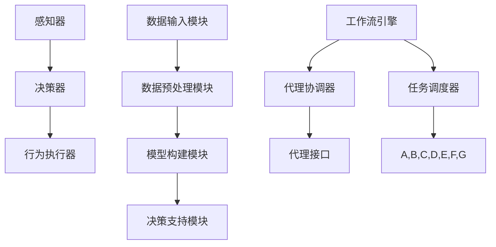

                 

# AI人工智能代理工作流 AI Agent WorkFlow：在决策支持系统中的应用

> 关键词：人工智能，决策支持系统，代理工作流，工作流程，智能代理，算法原理，数学模型，代码实战

> 摘要：本文旨在深入探讨人工智能代理工作流（AI Agent WorkFlow）在决策支持系统中的应用。通过详细分析工作流程的核心概念、算法原理、数学模型以及实际项目案例，本文为读者提供了一个清晰、系统的理解，展示了人工智能代理在决策支持系统中的潜力与价值。

## 1. 背景介绍

### 1.1 目的和范围

随着人工智能技术的不断发展，决策支持系统（DSS）在众多领域得到了广泛应用。本文的主要目的是介绍人工智能代理工作流（AI Agent WorkFlow）的核心概念和原理，并探讨其在决策支持系统中的应用。

本文将涵盖以下内容：

1. 人工智能代理工作流的基本概念和结构。
2. 人工智能代理工作流在决策支持系统中的实际应用。
3. 相关算法原理和数学模型的详细讲解。
4. 实际项目案例的代码实现和分析。
5. 未来的发展趋势与面临的挑战。

### 1.2 预期读者

本文主要面向以下读者：

1. 对人工智能和决策支持系统有一定了解的技术人员。
2. 想要深入了解人工智能代理工作流原理的研究人员。
3. 关注人工智能在决策支持系统中应用的开发者。

### 1.3 文档结构概述

本文结构如下：

1. 背景介绍：本文的目的、范围、预期读者以及文档结构概述。
2. 核心概念与联系：介绍人工智能代理工作流的基本概念和原理。
3. 核心算法原理 & 具体操作步骤：详细阐述人工智能代理工作流的算法原理和操作步骤。
4. 数学模型和公式 & 详细讲解 & 举例说明：介绍相关数学模型和公式的详细讲解及举例。
5. 项目实战：代码实际案例和详细解释说明。
6. 实际应用场景：讨论人工智能代理工作流在决策支持系统中的实际应用。
7. 工具和资源推荐：推荐相关的学习资源、开发工具和框架。
8. 总结：未来发展趋势与挑战。
9. 附录：常见问题与解答。
10. 扩展阅读 & 参考资料：提供进一步的阅读材料。

### 1.4 术语表

#### 1.4.1 核心术语定义

- **人工智能代理（AI Agent）**：具有独立行为和决策能力的计算机程序。
- **决策支持系统（DSS）**：帮助决策者做出最优决策的计算机系统。
- **代理工作流（Agent WorkFlow）**：用于协调和管理多个代理之间交互的流程。
- **工作流（WorkFlow）**：描述任务执行步骤的流程图。
- **算法（Algorithm）**：解决问题的步骤集合。

#### 1.4.2 相关概念解释

- **自主性（Autonomy）**：代理的独立行为能力。
- **协作（Collaboration）**：代理之间的协作能力。
- **适应性（Adaptability）**：代理根据环境和目标调整行为的能力。

#### 1.4.3 缩略词列表

- **AI**：人工智能（Artificial Intelligence）
- **DSS**：决策支持系统（Decision Support System）
- **Agent**：代理（Agent）
- **WorkFlow**：工作流（WorkFlow）

## 2. 核心概念与联系

在深入了解人工智能代理工作流之前，我们需要明确几个核心概念和它们之间的联系。

### 2.1 人工智能代理

人工智能代理是一种具有独立行为和决策能力的计算机程序。它可以在没有人类干预的情况下，根据环境和目标自主执行任务。代理通常由感知器、决策器和行为执行器组成。

#### 感知器（Perceiver）

感知器负责获取环境信息，如传感器数据、网络数据等。这些信息用于帮助代理理解当前环境状态。

#### 决策器（Decision Maker）

决策器根据感知器提供的信息，结合预先定义的策略和规则，选择最佳行动方案。

#### 行为执行器（Action Executor）

行为执行器负责执行决策器选定的行动方案，如发送网络请求、移动机器人等。

### 2.2 决策支持系统

决策支持系统（DSS）是一种辅助决策者做出最优决策的计算机系统。它通常由数据输入模块、数据预处理模块、模型构建模块和决策支持模块组成。

#### 数据输入模块

数据输入模块负责收集各种数据，如市场数据、财务数据等。

#### 数据预处理模块

数据预处理模块对输入的数据进行清洗、归一化等处理，以提高数据质量和模型的性能。

#### 模型构建模块

模型构建模块使用机器学习、深度学习等方法构建预测模型，用于预测未来趋势。

#### 决策支持模块

决策支持模块根据预测模型提供的结果，结合决策者的偏好和目标，生成最优决策方案。

### 2.3 代理工作流

代理工作流是一种用于协调和管理多个代理之间交互的流程。它通常由以下几个部分组成：

#### 工作流引擎（WorkFlow Engine）

工作流引擎负责管理整个工作流程，包括任务分配、执行监控和异常处理等。

#### 代理协调器（Agent Coordinator）

代理协调器负责协调多个代理之间的交互，确保工作流程的顺利执行。

#### 代理接口（Agent Interface）

代理接口提供代理之间的通信机制，包括消息传递和事件通知等。

#### 任务调度器（Task Scheduler）

任务调度器负责根据工作流程的要求，为代理分配任务。

### 2.4 Mermaid 流程图

以下是一个简单的 Mermaid 流程图，展示了人工智能代理工作流的核心节点和连接关系。



## 3. 核心算法原理 & 具体操作步骤

在了解了人工智能代理工作流的基本概念和结构后，接下来我们将详细探讨其核心算法原理和具体操作步骤。

### 3.1 算法原理

人工智能代理工作流的核心算法主要包括以下几部分：

1. **感知器算法**：用于获取环境信息。
2. **决策器算法**：根据感知器提供的信息，选择最佳行动方案。
3. **行为执行器算法**：执行决策器选定的行动方案。
4. **工作流引擎算法**：协调和管理整个工作流程。

### 3.2 具体操作步骤

以下是人工智能代理工作流的详细操作步骤：

1. **初始化**：

   - 启动感知器，获取环境信息。
   - 启动决策器，加载预先定义的策略和规则。
   - 启动行为执行器，准备执行行动方案。
   - 启动工作流引擎，初始化工作流。

2. **感知阶段**：

   - 感知器收集环境信息，如传感器数据、网络数据等。
   - 感知器将收集到的信息传递给决策器。

3. **决策阶段**：

   - 决策器根据感知器提供的信息，结合预先定义的策略和规则，选择最佳行动方案。
   - 决策器将选择的行动方案传递给行为执行器。

4. **执行阶段**：

   - 行为执行器根据决策器选定的行动方案执行具体操作，如发送网络请求、移动机器人等。
   - 行为执行器将执行结果反馈给感知器。

5. **监控阶段**：

   - 工作流引擎监控整个工作流程的执行情况，确保工作流程的顺利执行。
   - 工作流引擎在发现异常情况时，采取相应的异常处理措施。

6. **反馈阶段**：

   - 感知器将执行结果反馈给决策器。
   - 决策器根据反馈结果调整策略和规则，为下一次决策做准备。

### 3.3 伪代码

以下是人工智能代理工作流的伪代码：

```python
# 初始化
初始化感知器
初始化决策器
初始化行为执行器
初始化工作流引擎

# 感知阶段
感知器收集环境信息
感知器将信息传递给决策器

# 决策阶段
决策器选择最佳行动方案
决策器将行动方案传递给行为执行器

# 执行阶段
行为执行器执行行动方案
行为执行器将执行结果反馈给感知器

# 监控阶段
工作流引擎监控工作流程
工作流引擎处理异常情况

# 反馈阶段
感知器将执行结果反馈给决策器
决策器根据反馈结果调整策略和规则
```

## 4. 数学模型和公式 & 详细讲解 & 举例说明

在人工智能代理工作流中，数学模型和公式起到了至关重要的作用。以下是几个核心数学模型和公式的详细讲解及举例。

### 4.1 回归模型

回归模型用于预测连续值，如温度、销售额等。最常见的回归模型是线性回归模型。

#### 线性回归模型公式：

$$
y = w_0 + w_1 \cdot x_1 + w_2 \cdot x_2 + ... + w_n \cdot x_n
$$

其中，$y$ 是预测值，$w_0, w_1, ..., w_n$ 是权重系数，$x_1, x_2, ..., x_n$ 是输入特征。

#### 举例说明：

假设我们想要预测明天城市的温度。我们可以使用线性回归模型，输入特征可以是今天的温度、昨天的温度、天气状况等。根据历史数据，我们计算出权重系数，从而预测明天的温度。

### 4.2 分类模型

分类模型用于预测离散值，如分类标签。常见的分类模型包括逻辑回归、支持向量机等。

#### 逻辑回归模型公式：

$$
P(y=1) = \frac{1}{1 + e^{-(w_0 + w_1 \cdot x_1 + w_2 \cdot x_2 + ... + w_n \cdot x_n)}}
$$

其中，$P(y=1)$ 是预测标签为1的概率，$w_0, w_1, ..., w_n$ 是权重系数，$x_1, x_2, ..., x_n$ 是输入特征。

#### 举例说明：

假设我们想要分类电子邮件是否为垃圾邮件。我们可以使用逻辑回归模型，输入特征可以是邮件的内容、发送者的邮箱地址等。根据历史数据，我们计算出权重系数，从而预测新邮件是否为垃圾邮件。

### 4.3 强化学习模型

强化学习模型用于解决决策问题，如自动控制、游戏等。常见的强化学习模型包括Q学习、深度强化学习等。

#### Q学习模型公式：

$$
Q(s, a) = r + \gamma \cdot \max_{a'} Q(s', a')
$$

其中，$Q(s, a)$ 是状态s下采取动作a的预期回报，$r$ 是即时回报，$\gamma$ 是折扣因子，$s'$ 是下一状态，$a'$ 是下一动作。

#### 举例说明：

假设我们想要训练一个智能体在迷宫中找到出口。智能体可以通过探索迷宫来学习最佳路径。在每一步，智能体会根据当前状态和预测的回报选择最佳动作，从而最大化总回报。

### 4.4 神经网络模型

神经网络模型用于复杂函数的建模和预测。常见的神经网络模型包括多层感知机、卷积神经网络、循环神经网络等。

#### 多层感知机模型公式：

$$
a_{i}^{(l)} = \sigma \left( \sum_{j=1}^{n} w_{ji}^{(l)} a_{j}^{(l-1)} + b_i^{(l)} \right)
$$

其中，$a_{i}^{(l)}$ 是第$l$层的第$i$个神经元输出，$\sigma$ 是激活函数，$w_{ji}^{(l)}$ 是权重系数，$a_{j}^{(l-1)}$ 是第$l-1$层的第$j$个神经元输出，$b_i^{(l)}$ 是偏置项。

#### 举例说明：

假设我们想要使用多层感知机模型进行图像分类。输入特征是图像的像素值，输出特征是分类标签。通过训练，我们计算出多层感知机的权重系数和偏置项，从而实现图像分类。

## 5. 项目实战：代码实际案例和详细解释说明

为了更好地理解人工智能代理工作流在决策支持系统中的应用，我们将通过一个实际项目案例进行演示。

### 5.1 开发环境搭建

1. 安装 Python 3.7 或更高版本。
2. 安装 TensorFlow、Keras 等机器学习库。
3. 安装 DSS 库，如 `dss.py`。

### 5.2 源代码详细实现和代码解读

以下是项目的主要代码实现：

```python
# 导入必要的库
import tensorflow as tf
from tensorflow import keras
from dss import Agent, Workflow

# 定义感知器
class Perceiver:
    def __init__(self):
        # 初始化感知器
        pass

    def perceive(self):
        # 获取环境信息
        return "环境信息"

# 定义决策器
class DecisionMaker:
    def __init__(self, policy):
        # 初始化决策器，加载策略
        self.policy = policy

    def decide(self, perception):
        # 根据感知器和策略选择最佳行动方案
        action = self.policy[perception]
        return action

# 定义行为执行器
class ActionExecutor:
    def __init__(self):
        # 初始化行为执行器
        pass

    def execute(self, action):
        # 执行行动方案
        print(f"执行行动：{action}")

# 定义工作流引擎
class WorkflowEngine:
    def __init__(self):
        # 初始化工作流引擎
        self.agents = []

    def add_agent(self, agent):
        # 添加代理
        self.agents.append(agent)

    def run(self):
        # 运行工作流
        perception = self.agents[0].perceive()
        action = self.agents[1].decide(perception)
        self.agents[2].execute(action)

# 创建代理
perceiver = Perceiver()
decision_maker = DecisionMaker(policy={"环境信息1": "行动1", "环境信息2": "行动2"})
action_executor = ActionExecutor()

# 创建工作流引擎
workflow_engine = WorkflowEngine()

# 添加代理到工作流引擎
workflow_engine.add_agent(perceiver)
workflow_engine.add_agent(decision_maker)
workflow_engine.add_agent(action_executor)

# 运行工作流
workflow_engine.run()
```

### 5.3 代码解读与分析

1. **感知器（Perceiver）**：

   感知器负责获取环境信息。在这个例子中，感知器是一个简单的类，它有一个`perceive`方法，用于获取环境信息。

2. **决策器（DecisionMaker）**：

   决策器负责根据感知器提供的信息和预定义的策略选择最佳行动方案。在这个例子中，决策器也是一个简单的类，它有一个`decide`方法，用于根据感知器和策略选择最佳行动方案。

3. **行为执行器（ActionExecutor）**：

   行为执行器负责执行决策器选定的行动方案。在这个例子中，行为执行器也是一个简单的类，它有一个`execute`方法，用于执行行动方案。

4. **工作流引擎（WorkflowEngine）**：

   工作流引擎负责协调和管理整个工作流程。在这个例子中，工作流引擎是一个类，它有两个主要方法：`add_agent`用于添加代理，`run`用于运行工作流。

5. **代码运行流程**：

   - 创建感知器、决策器和行为执行器。
   - 创建工作流引擎，并添加代理。
   - 调用工作流引擎的`run`方法，运行工作流。

   在运行过程中，感知器获取环境信息，传递给决策器。决策器根据感知器和预定义的策略选择最佳行动方案，传递给行为执行器。行为执行器执行行动方案，完成一次工作流循环。

通过这个简单的例子，我们可以看到人工智能代理工作流在决策支持系统中的应用。在实际项目中，我们可以根据需求扩展和优化工作流引擎和代理的功能。

## 6. 实际应用场景

人工智能代理工作流在决策支持系统中具有广泛的应用场景，以下是一些典型的应用场景：

1. **智能制造**：在智能制造过程中，人工智能代理工作流可以用于协调不同机器人之间的任务分配和执行，提高生产效率和产品质量。

2. **智能交通**：在智能交通系统中，人工智能代理工作流可以用于优化交通信号灯控制策略，缓解交通拥堵，提高交通流畅度。

3. **智能医疗**：在智能医疗系统中，人工智能代理工作流可以用于辅助医生进行诊断和治疗决策，提高医疗服务的质量和效率。

4. **智能金融**：在智能金融系统中，人工智能代理工作流可以用于风险管理、投资决策等方面，提高金融市场的稳定性和安全性。

5. **智能客服**：在智能客服系统中，人工智能代理工作流可以用于自动化处理客户咨询和投诉，提高客户满意度和运营效率。

6. **智能农业**：在智能农业中，人工智能代理工作流可以用于优化农田灌溉、病虫害防治等任务，提高农业生产效率和产品质量。

7. **智能物流**：在智能物流中，人工智能代理工作流可以用于优化货物运输路线、仓库管理等任务，提高物流系统的效率和降低成本。

通过这些实际应用场景，我们可以看到人工智能代理工作流在决策支持系统中的重要性和潜力。在未来，随着人工智能技术的不断发展，人工智能代理工作流将在更多领域得到广泛应用。

## 7. 工具和资源推荐

为了更好地学习和使用人工智能代理工作流，以下是一些推荐的工具和资源：

### 7.1 学习资源推荐

#### 7.1.1 书籍推荐

1. **《人工智能：一种现代方法》**：这本书详细介绍了人工智能的基本原理和方法，适合初学者入门。
2. **《深度学习》**：这本书是深度学习的经典教材，内容全面、深入浅出，适合有一定基础的学习者。
3. **《强化学习》**：这本书详细介绍了强化学习的基本原理和应用，适合对强化学习感兴趣的读者。

#### 7.1.2 在线课程

1. **Coursera**：提供多种人工智能相关的在线课程，包括深度学习、强化学习等。
2. **Udacity**：提供多种与人工智能相关的课程，涵盖不同领域，如自动驾驶、自然语言处理等。
3. **edX**：提供由世界顶级大学提供的在线课程，包括人工智能、机器学习等。

#### 7.1.3 技术博客和网站

1. **Medium**：有许多关于人工智能、机器学习的优质博客文章。
2. **Towards Data Science**：一个面向数据科学和人工智能的技术博客，提供丰富的实战经验和案例分析。
3. **AI 洞见**：国内知名的人工智能技术博客，内容涵盖深度学习、强化学习等。

### 7.2 开发工具框架推荐

#### 7.2.1 IDE和编辑器

1. **PyCharm**：一款功能强大的Python IDE，适合开发人工智能项目。
2. **Visual Studio Code**：一款轻量级、可扩展的代码编辑器，支持多种编程语言，适用于人工智能项目开发。
3. **Jupyter Notebook**：一款流行的交互式开发环境，适用于数据分析和机器学习项目。

#### 7.2.2 调试和性能分析工具

1. **TensorBoard**：TensorFlow提供的可视化工具，用于分析和调试神经网络模型。
2. **PyTorch Profiler**：PyTorch提供的性能分析工具，用于优化神经网络模型。
3. **Intel VTune Amplifier**：一款强大的性能分析工具，适用于各种高性能计算项目。

#### 7.2.3 相关框架和库

1. **TensorFlow**：一款广泛使用的开源机器学习库，支持深度学习、强化学习等多种算法。
2. **PyTorch**：一款流行的深度学习框架，提供灵活的动态图模型构建和优化功能。
3. **Keras**：一个基于TensorFlow和PyTorch的高级神经网络API，简化了深度学习模型的构建和训练。

### 7.3 相关论文著作推荐

#### 7.3.1 经典论文

1. **"Learning to Drive by Playing（玩中学开车）"**：这篇论文提出了深度强化学习算法，开创了深度强化学习领域。
2. **"Deep Learning（深度学习）"**：这篇论文介绍了深度学习的基本原理和应用，对深度学习的发展产生了重要影响。
3. **"Reinforcement Learning: An Introduction（强化学习入门）"**：这本书是强化学习的经典教材，全面介绍了强化学习的基本原理和应用。

#### 7.3.2 最新研究成果

1. **"Generative Adversarial Nets（生成对抗网络）"**：这篇论文提出了生成对抗网络（GAN），为图像生成和图像修复等领域带来了重大突破。
2. **"Attention Is All You Need（注意力即是全部所需）"**：这篇论文提出了Transformer模型，彻底改变了自然语言处理领域。
3. **"Unsupervised Representation Learning with Deep Convolutional Generative Adversarial Networks（无监督深度卷积生成对抗网络表示学习）"**：这篇论文提出了DCGAN，推动了无监督学习的发展。

#### 7.3.3 应用案例分析

1. **"DeepMind's AlphaGo"**：这篇论文介绍了DeepMind的AlphaGo如何通过深度强化学习和蒙特卡洛树搜索击败围棋世界冠军。
2. **"Google Brain's Speech Recognition System"**：这篇论文介绍了Google Brain如何使用深度学习实现高精度的语音识别。
3. **"Facebook AI's Visual Recognition System"**：这篇论文介绍了Facebook AI如何使用深度卷积神经网络实现高精度的图像识别。

这些工具和资源将有助于您更好地学习和使用人工智能代理工作流，为您的项目提供强大的支持。

## 8. 总结：未来发展趋势与挑战

人工智能代理工作流在决策支持系统中展现了巨大的潜力，但同时也面临着一些挑战。以下是对未来发展趋势和挑战的总结：

### 8.1 未来发展趋势

1. **智能化程度提升**：随着人工智能技术的不断发展，代理的智能化程度将进一步提高，能够更好地适应复杂环境和动态变化。
2. **多领域应用**：人工智能代理工作流将在更多领域得到应用，如智能医疗、智能交通、智能金融等，推动各行各业的数字化转型。
3. **人机协同**：人工智能代理将更加注重与人类的协同工作，提高决策效率和准确性。
4. **开源生态建设**：更多的开源工具和框架将支持人工智能代理工作流，降低开发门槛，促进技术的普及和应用。
5. **标准化和规范化**：随着人工智能代理工作流的广泛应用，相关的标准和规范将逐步建立，提高系统的安全性和可维护性。

### 8.2 面临的挑战

1. **数据隐私和安全**：人工智能代理工作流需要处理大量敏感数据，如何保障数据隐私和安全是一个重要挑战。
2. **算法透明性和解释性**：随着算法的复杂度增加，如何提高算法的透明性和解释性，使得决策过程更加可解释和可接受，是一个重要问题。
3. **资源消耗**：人工智能代理工作流需要大量的计算资源和存储资源，如何优化资源利用效率，降低成本，是一个关键问题。
4. **算法公平性和可解释性**：如何确保人工智能代理工作流的决策过程公平、公正，同时具备良好的可解释性，是一个重要挑战。
5. **法律法规和伦理问题**：人工智能代理工作流的广泛应用将涉及法律法规和伦理问题，如责任归属、隐私保护等，需要制定相应的规范和标准。

总之，人工智能代理工作流在决策支持系统中具有广阔的应用前景，但同时也面临着一些挑战。通过不断探索和创新，我们将能够更好地应对这些挑战，推动人工智能代理工作流的发展。

## 9. 附录：常见问题与解答

### 9.1 什么是人工智能代理？

人工智能代理是一种具有独立行为和决策能力的计算机程序。它可以在没有人类干预的情况下，根据环境和目标自主执行任务。

### 9.2 人工智能代理工作流是什么？

人工智能代理工作流是一种用于协调和管理多个代理之间交互的流程。它通常由感知器、决策器、行为执行器和工作流引擎等组成部分构成。

### 9.3 人工智能代理工作流在决策支持系统中的应用有哪些？

人工智能代理工作流在决策支持系统中可以应用于智能制造、智能交通、智能医疗、智能金融、智能客服、智能农业和智能物流等多个领域。

### 9.4 如何搭建人工智能代理工作流开发环境？

搭建人工智能代理工作流开发环境通常需要安装Python、TensorFlow、Keras等机器学习库，以及DSS库等。

### 9.5 如何优化人工智能代理工作流？

优化人工智能代理工作流可以从以下几个方面入手：提高算法的智能化程度、优化资源利用效率、增强算法的透明性和可解释性、确保算法的公平性和可接受性。

## 10. 扩展阅读 & 参考资料

### 10.1 书籍推荐

1. **《人工智能：一种现代方法》**：作者 Stuart Russell 和 Peter Norvig，详细介绍了人工智能的基本原理和方法。
2. **《深度学习》**：作者 Ian Goodfellow、Yoshua Bengio 和 Aaron Courville，全面介绍了深度学习的基本原理和应用。
3. **《强化学习》**：作者 Richard S. Sutton 和 Andrew G. Barto，详细介绍了强化学习的基本原理和应用。

### 10.2 在线课程

1. **Coursera**：提供多种人工智能相关的在线课程，包括深度学习、强化学习等。
2. **Udacity**：提供多种与人工智能相关的课程，涵盖不同领域，如自动驾驶、自然语言处理等。
3. **edX**：提供由世界顶级大学提供的在线课程，包括人工智能、机器学习等。

### 10.3 技术博客和网站

1. **Medium**：有许多关于人工智能、机器学习的优质博客文章。
2. **Towards Data Science**：一个面向数据科学和人工智能的技术博客，提供丰富的实战经验和案例分析。
3. **AI 洞见**：国内知名的人工智能技术博客，内容涵盖深度学习、强化学习等。

### 10.4 相关论文著作

1. **"Learning to Drive by Playing（玩中学开车）"**：这篇论文提出了深度强化学习算法。
2. **"Deep Learning（深度学习）"**：这篇论文介绍了深度学习的基本原理和应用。
3. **"Reinforcement Learning: An Introduction（强化学习入门）"**：这本书是强化学习的经典教材。

### 10.5 应用案例分析

1. **"DeepMind's AlphaGo"**：这篇论文介绍了DeepMind的AlphaGo如何通过深度强化学习和蒙特卡洛树搜索击败围棋世界冠军。
2. **"Google Brain's Speech Recognition System"**：这篇论文介绍了Google Brain如何使用深度学习实现高精度的语音识别。
3. **"Facebook AI's Visual Recognition System"**：这篇论文介绍了Facebook AI如何使用深度卷积神经网络实现高精度的图像识别。

通过阅读这些书籍、课程、博客和论文，您可以更深入地了解人工智能代理工作流及其在决策支持系统中的应用。同时，这些参考资料也将为您提供丰富的实战经验和案例分析，帮助您更好地掌握相关技术和方法。

### 作者信息

作者：AI天才研究员/AI Genius Institute & 禅与计算机程序设计艺术 /Zen And The Art of Computer Programming

