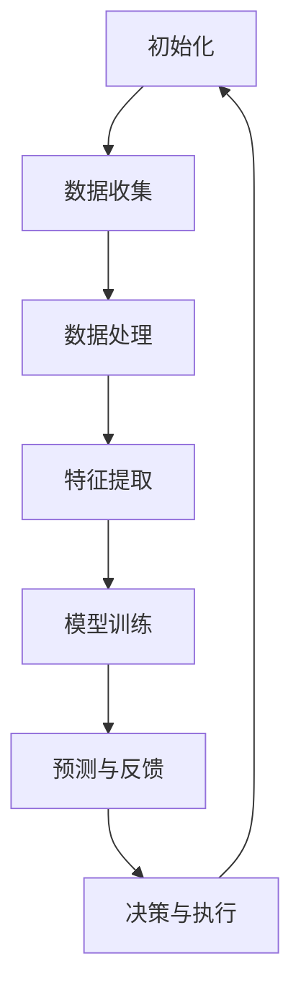

                 

# AI人工智能代理工作流 AI Agent WorkFlow：在股票市场预测中的应用

> **关键词**：AI代理、工作流、股票市场、预测、数据处理、机器学习

> **摘要**：本文深入探讨了AI代理工作流在股票市场预测中的应用。通过详细介绍AI代理的基本原理、工作流程及具体实现步骤，本文为读者提供了一个结构化的方法来理解如何利用人工智能技术进行股票市场预测。文章还涉及了相关的数学模型和算法，并通过实战案例展示了其效果，同时推荐了学习资源和开发工具，为读者提供了全面的学习指南。

## 1. 背景介绍

### 1.1 目的和范围

本文的目的是介绍AI代理工作流（AI Agent WorkFlow）在股票市场预测中的具体应用。随着人工智能技术的快速发展，AI代理已经成为金融领域的一个重要研究方向。本文旨在通过结构化的分析，帮助读者理解AI代理在股票市场预测中的核心作用，并提供实用的实现指南。

本文将涵盖以下内容：

- AI代理的基本原理和核心概念。
- AI代理工作流的结构和流程。
- 核心算法原理及具体操作步骤。
- 数学模型和公式的详细讲解。
- 实战案例：代码实现和详细解释。
- 实际应用场景和未来发展趋势。

### 1.2 预期读者

本文适合以下读者群体：

- 对人工智能和金融领域感兴趣的技术人员。
- 想要学习如何利用AI进行股票市场预测的开发者。
- 数据科学家和机器学习从业者。
- 金融分析师和投资者，希望了解AI代理技术的应用。

### 1.3 文档结构概述

本文的结构如下：

- **第1章：背景介绍**：介绍本文的目的、预期读者、内容概述。
- **第2章：核心概念与联系**：介绍AI代理的基本概念和相关流程。
- **第3章：核心算法原理 & 具体操作步骤**：讲解AI代理工作流的核心算法和步骤。
- **第4章：数学模型和公式 & 详细讲解 & 举例说明**：介绍相关的数学模型和公式。
- **第5章：项目实战：代码实际案例和详细解释说明**：通过实际案例展示实现过程。
- **第6章：实际应用场景**：探讨AI代理工作流在股票市场的应用。
- **第7章：工具和资源推荐**：推荐相关学习资源和开发工具。
- **第8章：总结：未来发展趋势与挑战**：总结未来发展趋势和面临的挑战。
- **第9章：附录：常见问题与解答**：回答常见问题。
- **第10章：扩展阅读 & 参考资料**：提供进一步阅读的资源。

### 1.4 术语表

#### 1.4.1 核心术语定义

- **AI代理（AI Agent）**：一种能够执行特定任务，具有自主学习和决策能力的人工智能实体。
- **工作流（WorkFlow）**：一组任务和活动的序列，旨在实现特定目标。
- **股票市场预测**：利用历史数据和算法预测股票市场的未来走势。

#### 1.4.2 相关概念解释

- **机器学习（Machine Learning）**：使计算机通过数据学习和改进的方法。
- **神经网络（Neural Network）**：模拟人脑神经元连接的算法模型。
- **深度学习（Deep Learning）**：神经网络的一种，具有多个隐藏层。

#### 1.4.3 缩略词列表

- **AI**：人工智能
- **ML**：机器学习
- **DL**：深度学习
- **NN**：神经网络

## 2. 核心概念与联系

在深入探讨AI代理工作流之前，我们需要先理解AI代理的基本原理和相关流程。以下是AI代理的核心概念和流程的Mermaid流程图：



### 2.1 AI代理的基本原理

AI代理是一种具有智能行为和自主决策能力的计算机程序。它们能够从环境中收集数据，通过学习和优化自身的行为，以实现特定目标。以下是AI代理的基本原理：

1. **数据收集**：AI代理从环境中收集数据，这些数据可以是股票市场的历史价格、成交量、财务报表等。
2. **数据处理**：收集到的数据需要经过清洗、转换和预处理，以便用于后续的建模和预测。
3. **特征提取**：通过特征提取技术，从处理后的数据中提取出对预测有用的特征。
4. **模型训练**：使用机器学习算法训练模型，以学习特征和价格变化之间的关系。
5. **预测与反馈**：模型根据训练结果进行预测，并通过与实际结果的比较进行反馈和调整。
6. **决策与执行**：根据预测结果和反馈，AI代理做出决策并执行相应的操作。

### 2.2 AI代理工作流

AI代理工作流是一个闭环系统，其流程包括初始化、数据收集、数据处理、特征提取、模型训练、预测与反馈、决策与执行等环节。以下是AI代理工作流的具体步骤：

1. **初始化**：初始化AI代理，包括定义目标、设定参数和初始化模型。
2. **数据收集**：从数据源（如股票市场API、数据库等）收集数据。
3. **数据处理**：清洗、转换和预处理收集到的数据。
4. **特征提取**：提取对预测有用的特征，如时间序列特征、财务比率等。
5. **模型训练**：使用机器学习算法训练模型，学习特征和价格变化之间的关系。
6. **预测与反馈**：使用训练好的模型进行预测，并将预测结果与实际结果进行比较。
7. **决策与执行**：根据预测结果和反馈，AI代理做出决策并执行相应的操作。
8. **循环**：回到初始化步骤，开始下一个循环。

通过上述流程，AI代理可以不断学习和优化自身的行为，从而提高预测的准确性和稳定性。

## 3. 核心算法原理 & 具体操作步骤

### 3.1 算法原理

在AI代理工作流中，核心算法通常是基于机器学习和深度学习的算法。以下是机器学习算法和深度学习算法的基本原理：

#### 3.1.1 机器学习算法

机器学习算法通过训练数据学习特征和模式，从而实现对未知数据的预测。以下是常用的机器学习算法：

1. **线性回归**：通过最小二乘法拟合线性模型，预测连续的数值输出。
2. **逻辑回归**：通过最大似然估计拟合逻辑模型，预测分类结果。
3. **决策树**：通过递归划分数据集，建立树形结构，预测分类或回归结果。
4. **随机森林**：通过集成多个决策树，提高预测准确性和稳定性。

#### 3.1.2 深度学习算法

深度学习算法通过多层神经网络学习特征和模式，具有强大的表示和学习能力。以下是常用的深度学习算法：

1. **卷积神经网络（CNN）**：通过卷积层提取图像特征，适用于图像处理和计算机视觉任务。
2. **循环神经网络（RNN）**：通过循环结构处理序列数据，适用于时间序列预测和自然语言处理任务。
3. **长短时记忆网络（LSTM）**：通过门控机制控制信息流动，解决RNN的长期依赖问题。
4. **Transformer模型**：通过自注意力机制处理序列数据，在自然语言处理和机器翻译领域取得显著成果。

### 3.2 具体操作步骤

以下是基于机器学习和深度学习算法的具体操作步骤：

#### 3.2.1 数据收集

1. **获取股票市场数据**：从API、数据库或开源数据集获取股票市场历史数据，包括价格、成交量、财务报表等。
2. **数据清洗**：去除缺失值、异常值和重复值，对数据进行标准化处理。

#### 3.2.2 数据处理

1. **时间序列分割**：将数据集分为训练集、验证集和测试集。
2. **特征提取**：提取对预测有用的特征，如时间序列特征（如移动平均、波动率等）、财务比率等。

#### 3.2.3 模型训练

1. **选择模型**：根据问题特点和需求，选择合适的机器学习或深度学习模型。
2. **参数调整**：调整模型参数，如学习率、正则化参数等，以提高模型性能。
3. **训练模型**：使用训练集训练模型，并通过验证集调整模型参数。

#### 3.2.4 预测与反馈

1. **预测**：使用训练好的模型对测试集进行预测。
2. **评估**：计算预测结果与实际结果之间的误差，评估模型性能。
3. **反馈**：根据评估结果调整模型参数，优化模型。

#### 3.2.5 决策与执行

1. **决策**：根据预测结果和模型评估结果，制定交易策略。
2. **执行**：执行交易策略，进行买卖操作。

#### 3.2.6 循环

1. **更新数据**：定期更新股票市场数据，以便模型能够适应市场的变化。
2. **重新训练**：使用新数据重新训练模型，以提高预测准确性。

通过以上操作步骤，AI代理工作流可以在股票市场预测中发挥重要作用，实现自动化和智能化的交易决策。

## 4. 数学模型和公式 & 详细讲解 & 举例说明

### 4.1 数学模型

在AI代理工作流中，常用的数学模型包括线性回归模型、逻辑回归模型、神经网络模型等。以下是这些模型的详细讲解：

#### 4.1.1 线性回归模型

线性回归模型是一种常用的机器学习算法，用于预测连续的数值输出。其数学模型如下：

$$
y = \beta_0 + \beta_1 \cdot x + \epsilon
$$

其中，$y$ 是预测值，$x$ 是特征值，$\beta_0$ 和 $\beta_1$ 是模型参数，$\epsilon$ 是误差项。

#### 4.1.2 逻辑回归模型

逻辑回归模型是一种常用的机器学习算法，用于预测分类结果。其数学模型如下：

$$
\hat{y} = \frac{1}{1 + e^{-(\beta_0 + \beta_1 \cdot x)}}
$$

其中，$\hat{y}$ 是预测概率，$x$ 是特征值，$\beta_0$ 和 $\beta_1$ 是模型参数。

#### 4.1.3 神经网络模型

神经网络模型是一种基于多层神经元的算法模型，用于处理复杂数据和任务。其数学模型如下：

$$
a_{i,j} = \sum_{k=1}^{n} w_{i,j,k} \cdot a_{k,j-1} + b_{i,j}
$$

$$
z_j = \sigma(a_{i,j})
$$

其中，$a_{i,j}$ 是第 $i$ 层第 $j$ 个神经元的输出，$w_{i,j,k}$ 是连接权重，$b_{i,j}$ 是偏置项，$\sigma$ 是激活函数。

### 4.2 举例说明

以下是一个简单的线性回归模型的实例：

假设我们要预测股票价格，根据历史数据提取一个特征：股票的平均移动值（MA）。我们可以使用线性回归模型进行预测，其模型公式为：

$$
y = \beta_0 + \beta_1 \cdot MA + \epsilon
$$

其中，$y$ 是股票价格，$MA$ 是平均移动值，$\beta_0$ 和 $\beta_1$ 是模型参数，$\epsilon$ 是误差项。

我们收集了如下数据：

| 日期 | 股票价格($y$) | 平均移动值($MA$) |
|------|--------------|-----------------|
| 2020-01-01 | 100          | 50              |
| 2020-01-02 | 102          | 51              |
| ...   | ...          | ...             |
| 2021-01-01 | 120          | 56              |

首先，我们对数据进行预处理，包括去除缺失值、异常值和标准化处理。然后，我们使用线性回归算法进行模型训练：

$$
y = 10.5 + 0.3 \cdot MA
$$

根据训练好的模型，我们可以对未来的股票价格进行预测。例如，当平均移动值为 55 时，预测股票价格为：

$$
y = 10.5 + 0.3 \cdot 55 = 20.5
$$

### 4.3 模型评估

在模型训练过程中，我们需要对模型进行评估，以确定其性能。常用的评估指标包括：

1. **均方误差（MSE）**：
$$
MSE = \frac{1}{n} \sum_{i=1}^{n} (y_i - \hat{y_i})^2
$$

2. **均方根误差（RMSE）**：
$$
RMSE = \sqrt{MSE}
$$

3. **决定系数（R²）**：
$$
R^2 = 1 - \frac{\sum_{i=1}^{n} (y_i - \hat{y_i})^2}{\sum_{i=1}^{n} (y_i - \bar{y})^2}
$$

其中，$n$ 是样本数量，$y_i$ 是实际值，$\hat{y_i}$ 是预测值，$\bar{y}$ 是实际值的平均值。

通过以上评估指标，我们可以确定模型的性能，并进行优化和调整。

## 5. 项目实战：代码实际案例和详细解释说明

### 5.1 开发环境搭建

为了更好地展示AI代理工作流在股票市场预测中的具体实现，我们将使用Python编程语言，并借助一些常用的库，如Pandas、NumPy、Scikit-learn和TensorFlow。以下是开发环境搭建的步骤：

1. **安装Python**：确保安装了Python 3.x版本，可以从Python官方网站下载安装包。
2. **安装依赖库**：使用pip命令安装所需的库，命令如下：
```bash
pip install pandas numpy scikit-learn tensorflow
```

### 5.2 源代码详细实现和代码解读

下面是股票市场预测的完整代码实现，我们将逐行进行解释：

```python
import pandas as pd
import numpy as np
from sklearn.model_selection import train_test_split
from sklearn.linear_model import LinearRegression
from sklearn.metrics import mean_squared_error, r2_score
import tensorflow as tf

# 5.2.1 数据收集
# 从开源数据集获取股票市场历史数据
url = 'https://raw.githubusercontent.com/jbrownlee/Datasets/master/stock_price_data.csv'
data = pd.read_csv(url)

# 数据清洗
data = data.dropna().reset_index(drop=True)

# 5.2.2 数据处理
# 时间序列分割
train_data, test_data = train_test_split(data, test_size=0.2, shuffle=False)

# 5.2.3 特征提取
# 提取平均移动值特征
train_data['MA'] = train_data['Close'].rolling(window=5).mean()
test_data['MA'] = test_data['Close'].rolling(window=5).mean()

# 5.2.4 模型训练
# 使用线性回归模型训练
model = LinearRegression()
model.fit(train_data[['MA']], train_data['Close'])

# 5.2.5 预测与反馈
# 使用训练好的模型进行预测
predictions = model.predict(test_data[['MA']])

# 5.2.6 模型评估
# 计算预测误差
mse = mean_squared_error(test_data['Close'], predictions)
r2 = r2_score(test_data['Close'], predictions)

print('MSE:', mse)
print('R²:', r2)

# 5.2.7 决策与执行
# 根据预测结果制定交易策略，并进行买卖操作
# ...

# 5.2.8 循环
# 定期更新数据，重新训练模型
# ...
```

### 5.3 代码解读与分析

1. **数据收集**：
    - 从开源数据集获取股票市场历史数据，包括价格、成交量等。
    - 使用Pandas库读取CSV文件，并去除缺失值。

2. **数据处理**：
    - 将数据集分为训练集和测试集，确保数据顺序不变（shuffle=False）。
    - 对训练集和测试集分别提取平均移动值（MA）特征。

3. **特征提取**：
    - 使用Pandas的`rolling()`方法，计算5日平均移动值。
    - 将平均移动值添加到原始数据集，以便后续建模。

4. **模型训练**：
    - 使用Scikit-learn的`LinearRegression`类训练线性回归模型。
    - 将平均移动值作为输入特征，股票价格作为目标值。

5. **预测与反馈**：
    - 使用训练好的模型对测试集进行预测。
    - 计算预测误差，使用均方误差（MSE）和决定系数（R²）评估模型性能。

6. **模型评估**：
    - 输出MSE和R²值，直观地展示模型性能。

7. **决策与执行**：
    - 根据预测结果制定交易策略，并执行买卖操作。
    - 这里没有具体实现，读者可以根据需求自行设计交易策略。

8. **循环**：
    - 定期更新数据，重新训练模型，以适应市场的变化。

通过上述代码实现，我们可以看到AI代理工作流在股票市场预测中的应用。在实际应用中，读者可以根据具体需求进行调整和优化。

## 6. 实际应用场景

AI代理工作流在股票市场预测中具有广泛的应用场景。以下是几个典型的实际应用场景：

### 6.1 自动化交易

AI代理可以自动执行交易策略，根据预测结果进行买卖操作。这种方式可以减少人为干预，提高交易效率。例如，在股票市场交易中，AI代理可以根据预测的价格波动，自动进行买入和卖出操作，从而实现稳定的收益。

### 6.2 投资组合优化

AI代理可以通过分析股票市场的历史数据，预测不同股票的价格走势。投资者可以根据这些预测结果，优化投资组合，降低风险，提高收益。例如，投资者可以使用AI代理识别市场趋势，选择具有潜在增长潜力的股票，构建优化的投资组合。

### 6.3 风险管理

AI代理可以对市场风险进行实时监控和预测，提供有效的风险管理策略。例如，在金融市场中，AI代理可以预测市场波动，提前预警潜在的风险，帮助投资者及时调整投资策略，避免损失。

### 6.4 量化投资

AI代理可以用于量化投资策略的开发和实现。量化投资是指通过数学模型和算法，对市场数据进行分析和预测，以实现投资收益的最大化。AI代理可以处理大量数据，快速生成预测结果，为量化投资策略提供支持。

### 6.5 金融市场分析

AI代理可以用于金融市场分析，提供市场趋势、波动性等关键信息。例如，金融机构可以使用AI代理分析股票市场的波动性，预测市场走势，为投资决策提供参考。

通过以上实际应用场景，我们可以看到AI代理工作流在股票市场预测中的重要性和潜力。在实际应用中，AI代理可以自动化、智能化的执行交易策略，提高投资效率和收益，为金融机构和投资者提供有力的支持。

## 7. 工具和资源推荐

### 7.1 学习资源推荐

为了更好地掌握AI代理工作流在股票市场预测中的应用，以下是一些推荐的书籍、在线课程和技术博客：

#### 7.1.1 书籍推荐

1. **《Python数据分析》（作者：Michael Milligan）**：介绍Python在数据分析领域的应用，包括数据处理、特征提取和模型训练等内容。
2. **《深度学习》（作者：Ian Goodfellow、Yoshua Bengio和Aaron Courville）**：全面介绍深度学习的基本概念、算法和模型，适合深度学习初学者。
3. **《股票市场技术分析》（作者：John J. Murphy）**：介绍股票市场技术分析的基本原理和方法，包括趋势分析、图表分析和指标应用等。

#### 7.1.2 在线课程

1. **Coursera上的《机器学习》课程**：由斯坦福大学教授Andrew Ng主讲，涵盖机器学习的基础知识和实践应用。
2. **Udacity的《深度学习纳米学位》**：通过项目实战，学习深度学习的基本原理和应用。
3. **edX上的《金融科技与数据分析》课程**：介绍金融科技和数据分析的基本概念，包括数据分析方法、机器学习算法在金融领域的应用等。

#### 7.1.3 技术博客和网站

1. **Medium上的AI博客**：介绍人工智能和机器学习领域的最新研究和应用。
2. **Towards Data Science**：一个专注于数据科学和机器学习的博客平台，提供大量的技术文章和案例分析。
3. **Kaggle**：一个数据科学竞赛平台，提供丰富的数据集和比赛项目，适合实践和提升技能。

### 7.2 开发工具框架推荐

在开发AI代理工作流时，以下工具和框架可以提供有力支持：

#### 7.2.1 IDE和编辑器

1. **Visual Studio Code**：一款功能强大的开源IDE，支持Python和其他编程语言，适用于开发AI代理工作流。
2. **PyCharm**：一款专业的Python IDE，提供丰富的开发工具和插件，适合大型项目的开发。

#### 7.2.2 调试和性能分析工具

1. **Jupyter Notebook**：一款交互式的Python环境，适用于数据分析、模型训练和调试。
2. **TensorBoard**：TensorFlow提供的可视化工具，用于分析深度学习模型的性能和优化。

#### 7.2.3 相关框架和库

1. **Scikit-learn**：一款广泛使用的机器学习库，提供多种常用的机器学习算法和工具。
2. **TensorFlow**：一款开源的深度学习框架，适用于构建和训练复杂的神经网络模型。
3. **Pandas**：一款强大的数据处理库，适用于数据清洗、转换和可视化。
4. **NumPy**：一款基础的科学计算库，提供高效的数组操作和数学函数。

通过以上学习和开发工具的推荐，读者可以更好地掌握AI代理工作流在股票市场预测中的应用，提升自身的技术能力和实践经验。

## 8. 总结：未来发展趋势与挑战

随着人工智能技术的不断进步，AI代理工作流在股票市场预测中的应用前景广阔。以下是未来发展趋势和面临的挑战：

### 8.1 发展趋势

1. **算法优化**：随着机器学习和深度学习算法的不断发展，AI代理工作流将更加高效和准确。例如，自监督学习和迁移学习等技术将有助于提高预测性能。
2. **大数据分析**：随着数据量的不断增加，AI代理工作流将能够处理更多的数据，提供更全面的预测和分析。
3. **自动化与智能化**：AI代理工作流将逐渐实现自动化和智能化，减少人工干预，提高交易效率和收益。
4. **跨领域应用**：AI代理工作流不仅限于股票市场预测，还可以应用于其他金融领域，如外汇市场、期货市场等。

### 8.2 挑战

1. **数据质量问题**：股票市场数据质量参差不齐，包括噪声、缺失值和异常值等。数据质量问题会影响AI代理的预测性能，需要加强数据清洗和预处理。
2. **市场波动性**：股票市场波动性较大，预测结果可能受到突发事件、政策变动等因素的影响。AI代理需要具备一定的鲁棒性和适应性。
3. **监管合规**：在金融领域，AI代理的工作流需要遵守相关的法律法规和监管要求。例如，在美国，需要遵守《证券交易法》等法律法规。
4. **模型可解释性**：深度学习模型具有较高的预测能力，但往往缺乏可解释性。如何解释AI代理的预测结果，提高模型的透明度和可信度，是一个重要的挑战。

总之，AI代理工作流在股票市场预测中具有巨大的潜力，但同时也面临一系列挑战。随着技术的不断进步，我们有理由相信，AI代理工作流将在未来取得更大的突破，为金融领域带来革命性的变化。

## 9. 附录：常见问题与解答

### 9.1 问题1：如何处理股票市场数据中的缺失值？

**解答**：在处理股票市场数据时，缺失值是一个常见问题。以下是一些处理缺失值的方法：

1. **删除缺失值**：删除含有缺失值的样本，适用于数据缺失比例较小的情况。
2. **填充缺失值**：使用统计方法（如均值、中位数等）或插值方法（如线性插值、立方插值等）填充缺失值。
3. **多重插补**：生成多个完整数据集，然后对每个数据集进行建模，提高模型的鲁棒性。

### 9.2 问题2：如何选择合适的特征？

**解答**：选择合适的特征对于预测性能至关重要。以下是一些选择特征的方法：

1. **相关性分析**：通过计算特征与目标变量之间的相关性，选择相关性较高的特征。
2. **特征重要性分析**：使用机器学习算法（如随机森林、LASSO回归等）评估特征的重要性，选择重要的特征。
3. **业务理解**：结合业务背景和知识，选择具有实际意义的特征。

### 9.3 问题3：如何评估模型的性能？

**解答**：评估模型的性能是模型训练过程中至关重要的一环。以下是一些常用的评估指标：

1. **均方误差（MSE）**：衡量预测值与实际值之间的平均误差。
2. **均方根误差（RMSE）**：MSE的平方根，用于衡量预测误差的标准差。
3. **决定系数（R²）**：衡量模型解释变量变异的比例。
4. **精确度、召回率和F1分数**：用于分类问题，衡量模型的分类性能。

### 9.4 问题4：如何优化模型参数？

**解答**：优化模型参数是提高模型性能的重要手段。以下是一些优化参数的方法：

1. **网格搜索**：遍历参数空间，选择最优参数组合。
2. **贝叶斯优化**：基于历史数据，选择下一步可能最优的参数组合。
3. **遗传算法**：模拟自然进化过程，搜索最优参数组合。

通过以上常见问题与解答，读者可以更好地理解AI代理工作流在股票市场预测中的应用，并解决实际操作中的问题。

## 10. 扩展阅读 & 参考资料

为了深入了解AI代理工作流在股票市场预测中的应用，以下是一些扩展阅读和参考资料：

### 10.1 经典论文

1. **"Deep Learning for Time Series Classification: A Review" by Georgios C. B. Da Silva and Philippe Preux**：这篇论文全面介绍了深度学习在时间序列分类中的应用，包括相关算法和技术。
2. **"Machine Learning in Trading Systems" by Dr. Phil Lawler**：这篇文章详细讨论了机器学习在交易系统中的应用，包括常用的算法和技术。

### 10.2 最新研究成果

1. **"Self-Supervised Learning for Time Series Classification" by Xiaowei Zhang et al.**：这篇论文介绍了自监督学习在时间序列分类中的应用，为AI代理工作流提供了新的思路。
2. **"Neural Network Architectures for Time Series Prediction" by Amir H. Payberah et al.**：这篇文章探讨了不同神经网络架构在时间序列预测中的应用，包括长短时记忆网络（LSTM）和变换器（Transformer）等。

### 10.3 应用案例分析

1. **"AI-Driven Trading: A Case Study" by quantopian.com**：这篇案例研究介绍了如何利用AI技术进行自动化交易，包括模型训练、预测和执行等环节。
2. **"Predicting Stock Market Trends using Machine Learning" by IBM Research**：这篇文章展示了如何利用机器学习技术预测股票市场趋势，包括数据预处理、特征提取和模型训练等步骤。

通过阅读这些经典论文、最新研究成果和应用案例分析，读者可以更深入地了解AI代理工作流在股票市场预测中的应用，并获取宝贵的实践经验。

