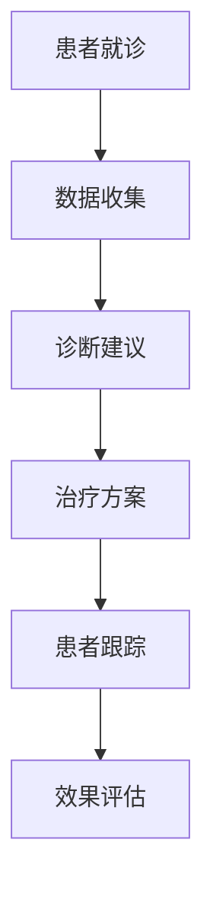

                 

# AI人工智能代理工作流AI Agent WorkFlow：在健康医疗领域部署智能代理

> **关键词：** 人工智能，智能代理，工作流，健康医疗，部署

> **摘要：** 本篇文章将深入探讨在健康医疗领域部署AI智能代理的工作流，分析其核心概念、算法原理、数学模型、实战案例，并展望未来的发展趋势和挑战。文章旨在为读者提供一个全面、系统的理解和实施指南。

## 1. 背景介绍

### 1.1 目的和范围

本文的目标是系统地介绍和探讨如何在一个关键领域——健康医疗中部署AI智能代理工作流。随着人工智能技术的飞速发展，智能代理作为一种智能体系统，已经在多个领域展示了其强大的潜力和应用价值。在健康医疗领域，智能代理工作流的应用有望显著提升医疗服务的效率和准确性，从而改善患者的治疗效果和体验。

本文将涵盖以下几个方面的内容：

1. **核心概念与联系**：介绍智能代理、工作流以及它们在健康医疗领域的关联。
2. **核心算法原理与具体操作步骤**：详细阐述智能代理工作流的核心算法原理和操作步骤。
3. **数学模型与公式**：介绍用于智能代理工作流的关键数学模型和公式，并给出详细的解释和实例说明。
4. **项目实战：代码实际案例**：通过具体的代码实现，展示智能代理工作流在实际项目中的应用。
5. **实际应用场景**：探讨智能代理工作流在不同健康医疗场景中的应用实例。
6. **工具和资源推荐**：推荐相关的学习资源、开发工具和最新研究成果。
7. **总结：未来发展趋势与挑战**：总结当前的研究进展，并探讨未来的发展趋势和面临的挑战。

### 1.2 预期读者

本文适合以下读者群体：

- **AI和软件开发工程师**：对AI智能代理和健康医疗领域感兴趣，希望了解如何在医疗领域应用智能代理工作流。
- **医疗专业人士**：如医生、护士、医院管理者等，对AI技术在健康医疗中的应用有浓厚兴趣。
- **研究人员**：对人工智能、机器学习、健康医疗领域有深入研究，希望了解智能代理工作流的理论和实践。
- **学生**：对AI和健康医疗领域有兴趣，希望获得系统的学习和理解。

### 1.3 文档结构概述

本文的文档结构如下：

1. **背景介绍**：介绍本文的目的、范围、预期读者以及文档结构。
2. **核心概念与联系**：介绍智能代理、工作流和它们在健康医疗领域的关联。
3. **核心算法原理与具体操作步骤**：详细阐述智能代理工作流的核心算法原理和操作步骤。
4. **数学模型与公式**：介绍用于智能代理工作流的关键数学模型和公式。
5. **项目实战：代码实际案例**：通过具体的代码实现，展示智能代理工作流在实际项目中的应用。
6. **实际应用场景**：探讨智能代理工作流在不同健康医疗场景中的应用实例。
7. **工具和资源推荐**：推荐相关的学习资源、开发工具和最新研究成果。
8. **总结：未来发展趋势与挑战**：总结当前的研究进展，并探讨未来的发展趋势和面临的挑战。
9. **附录：常见问题与解答**：解答读者可能遇到的问题。
10. **扩展阅读与参考资料**：提供额外的阅读资源和参考资料。

### 1.4 术语表

#### 1.4.1 核心术语定义

- **智能代理（AI Agent）**：一种具有自主性、智能性、适应性和社交性的计算机程序，能够在特定环境中采取行动并实现目标。
- **工作流（WorkFlow）**：一组定义明确的任务、规则和活动序列，用于自动化业务流程。
- **健康医疗领域（Healthcare Domain）**：涉及医疗诊断、治疗、管理和预防的领域。
- **AI智能代理工作流（AI Agent WorkFlow）**：将智能代理应用于健康医疗领域，实现自动化和智能化的工作流。

#### 1.4.2 相关概念解释

- **机器学习（Machine Learning）**：一种让计算机通过数据学习模式和规律的技术，用于实现智能代理的功能。
- **深度学习（Deep Learning）**：一种基于神经网络的学习方法，可以自动提取数据的特征。
- **自然语言处理（Natural Language Processing，NLP）**：一种使计算机能够理解、解释和生成人类语言的技术。

#### 1.4.3 缩略词列表

- **AI**：人工智能（Artificial Intelligence）
- **ML**：机器学习（Machine Learning）
- **DL**：深度学习（Deep Learning）
- **NLP**：自然语言处理（Natural Language Processing）
- **HF**：健康医疗（Healthcare）
- **WFO**：智能代理工作流（AI Agent WorkFlow）

## 2. 核心概念与联系

在深入探讨智能代理工作流在健康医疗领域的应用之前，我们需要明确几个核心概念，并了解它们之间的联系。

### 2.1 智能代理

智能代理是一种能够独立执行任务、适应环境和与人类交互的计算机程序。智能代理的核心特点包括：

- **自主性**：智能代理能够自主地做出决策和采取行动。
- **智能性**：智能代理通过机器学习和深度学习等技术，能够从数据中学习模式和规律。
- **适应性**：智能代理能够根据环境和任务的变化进行调整。
- **社交性**：智能代理能够与人类和其他智能代理进行交互。

智能代理在健康医疗领域中的应用包括但不限于：

- **电子健康记录管理**：智能代理可以自动整理和分类患者的电子健康记录。
- **医疗诊断**：智能代理可以通过分析医学影像和病历数据，协助医生进行诊断。
- **患者护理**：智能代理可以提供个性化的护理建议，帮助医护人员更好地照顾患者。

### 2.2 工作流

工作流是一种定义明确的任务、规则和活动序列，用于自动化业务流程。工作流在健康医疗领域中的应用包括：

- **医疗流程自动化**：通过工作流，可以自动化医疗诊断、治疗和患者管理过程。
- **资源优化**：工作流可以帮助医疗机构更好地分配人力资源和医疗资源。
- **效率提升**：通过工作流的标准化和自动化，可以显著提升医疗服务的效率。

### 2.3 智能代理工作流

智能代理工作流是将智能代理应用于健康医疗领域，实现自动化和智能化的工作流。智能代理工作流的核心概念包括：

- **任务分配**：智能代理根据医疗任务的需求，自动分配任务给相关的智能代理。
- **数据共享**：智能代理通过数据共享和协作，实现医疗数据的整合和分析。
- **决策支持**：智能代理利用机器学习和深度学习技术，提供医疗决策支持。

### 2.4 Mermaid 流程图

为了更好地理解智能代理工作流在健康医疗领域的应用，我们可以使用Mermaid流程图来展示其核心架构和流程。以下是一个简化的Mermaid流程图示例：



- **患者就诊**：患者前往医院就诊，智能代理开始工作。
- **数据收集**：智能代理收集患者的病历、影像等数据。
- **诊断建议**：智能代理利用数据分析和机器学习算法，给出诊断建议。
- **治疗方案**：智能代理根据诊断结果，提供个性化的治疗方案。
- **患者跟踪**：智能代理持续跟踪患者的治疗效果，提供反馈。
- **效果评估**：智能代理评估治疗的效果，为后续治疗提供支持。

通过以上流程，我们可以看到智能代理工作流在健康医疗领域中的应用场景，以及各个步骤之间的联系和作用。

### 2.5 核心概念与联系总结

智能代理、工作流和智能代理工作流在健康医疗领域有着紧密的联系。智能代理作为工作流的重要组成部分，可以实现医疗流程的自动化和智能化。智能代理工作流则通过任务分配、数据共享和决策支持，提升了医疗服务的效率和质量。通过Mermaid流程图的展示，我们可以更清晰地理解智能代理工作流在健康医疗领域的核心概念和流程。

## 3. 核心算法原理与具体操作步骤

在深入探讨智能代理工作流在健康医疗领域的具体应用之前，我们需要了解其核心算法原理和具体操作步骤。智能代理工作流的核心算法包括机器学习算法、深度学习算法和自然语言处理算法。以下将详细阐述这些算法原理和操作步骤。

### 3.1 机器学习算法

机器学习算法是智能代理工作流的基础，用于从数据中学习模式和规律，实现自动化和智能化的功能。以下是一个简化的机器学习算法操作步骤：

#### 3.1.1 数据收集

- **数据来源**：收集患者的病历、影像、诊断报告等数据。
- **数据预处理**：清洗数据，去除噪声和异常值，进行数据归一化。

#### 3.1.2 特征提取

- **特征选择**：根据业务需求，选择对诊断和治疗方案有重要影响的关键特征。
- **特征工程**：通过数据转换、特征组合等方法，生成新的特征。

#### 3.1.3 模型训练

- **选择模型**：根据数据特征和业务需求，选择合适的机器学习模型，如决策树、支持向量机、神经网络等。
- **模型训练**：使用训练数据集，通过迭代计算，调整模型参数，使模型达到较好的预测效果。

#### 3.1.4 模型评估

- **评估指标**：选择合适的评估指标，如准确率、召回率、F1值等。
- **交叉验证**：通过交叉验证，评估模型的泛化能力和稳定性。

### 3.2 深度学习算法

深度学习算法是机器学习的一种扩展，具有更强的特征提取和模式识别能力。以下是一个简化的深度学习算法操作步骤：

#### 3.2.1 神经网络结构设计

- **输入层**：根据数据特征，设计合适的输入层结构。
- **隐藏层**：根据业务需求，设计多个隐藏层，选择合适的激活函数。
- **输出层**：根据预测目标，设计合适的输出层结构。

#### 3.2.2 模型训练

- **损失函数**：选择合适的损失函数，如均方误差、交叉熵等。
- **优化算法**：选择合适的优化算法，如梯度下降、Adam等。
- **模型迭代**：通过迭代计算，调整模型参数，使模型达到较好的预测效果。

#### 3.2.3 模型评估

- **评估指标**：选择合适的评估指标，如准确率、召回率、F1值等。
- **交叉验证**：通过交叉验证，评估模型的泛化能力和稳定性。

### 3.3 自然语言处理算法

自然语言处理算法用于处理文本数据，实现智能对话、文本分类、情感分析等功能。以下是一个简化的自然语言处理算法操作步骤：

#### 3.3.1 文本预处理

- **分词**：将文本分解为单词或短语。
- **词性标注**：对文本中的单词进行词性标注，如名词、动词、形容词等。
- **实体识别**：识别文本中的实体，如人名、地名、组织名等。

#### 3.3.2 特征提取

- **词向量表示**：将文本转换为词向量，如Word2Vec、GloVe等。
- **序列特征提取**：提取文本序列中的特征，如词频、词序列等。

#### 3.3.3 模型训练

- **选择模型**：选择合适的自然语言处理模型，如循环神经网络（RNN）、长短时记忆网络（LSTM）、变压器（Transformer）等。
- **模型训练**：使用训练数据集，通过迭代计算，调整模型参数，使模型达到较好的预测效果。

#### 3.3.4 模型评估

- **评估指标**：选择合适的评估指标，如准确率、召回率、F1值等。
- **交叉验证**：通过交叉验证，评估模型的泛化能力和稳定性。

### 3.4 智能代理工作流操作步骤

基于上述核心算法原理，我们可以设计智能代理工作流的具体操作步骤，实现健康医疗领域的自动化和智能化应用。以下是一个简化的智能代理工作流操作步骤：

#### 3.4.1 数据收集

- **数据收集**：智能代理从医院信息系统、电子病历等数据源中收集患者的病历、影像、诊断报告等数据。

#### 3.4.2 数据预处理

- **数据清洗**：智能代理对收集到的数据进行清洗，去除噪声和异常值，进行数据归一化。

#### 3.4.3 特征提取

- **特征选择**：智能代理根据业务需求，选择对诊断和治疗方案有重要影响的关键特征。
- **特征工程**：智能代理通过数据转换、特征组合等方法，生成新的特征。

#### 3.4.4 模型训练

- **选择模型**：智能代理根据数据特征和业务需求，选择合适的机器学习模型、深度学习模型或自然语言处理模型。
- **模型训练**：智能代理使用训练数据集，通过迭代计算，调整模型参数，使模型达到较好的预测效果。

#### 3.4.5 模型评估

- **评估指标**：智能代理选择合适的评估指标，如准确率、召回率、F1值等。
- **交叉验证**：智能代理通过交叉验证，评估模型的泛化能力和稳定性。

#### 3.4.6 诊断建议

- **诊断建议生成**：智能代理利用训练好的模型，对患者的病历、影像、诊断报告等数据进行诊断分析，生成诊断建议。

#### 3.4.7 治疗方案推荐

- **治疗方案推荐**：智能代理根据诊断建议，结合患者的病史、体质等信息，推荐个性化的治疗方案。

#### 3.4.8 患者跟踪与反馈

- **患者跟踪**：智能代理持续跟踪患者的治疗效果，收集患者的反馈数据。
- **效果评估**：智能代理评估治疗的效果，为后续治疗提供支持。

#### 3.4.9 模型优化与迭代

- **模型优化**：智能代理根据患者的治疗效果和反馈数据，对模型进行优化调整，提高模型的预测准确性和稳定性。

通过以上操作步骤，智能代理工作流可以实现健康医疗领域的自动化和智能化应用，为医疗机构和患者提供高效、精准的服务。

### 3.5 算法原理与操作步骤总结

智能代理工作流的核心算法原理包括机器学习算法、深度学习算法和自然语言处理算法。通过机器学习算法，智能代理可以从数据中学习模式和规律，实现诊断和建议功能；通过深度学习算法，智能代理可以提取更复杂的特征，提高模型的预测能力；通过自然语言处理算法，智能代理可以实现智能对话和文本分析。具体操作步骤包括数据收集、数据预处理、特征提取、模型训练、模型评估等。通过这些步骤，智能代理工作流可以实现健康医疗领域的自动化和智能化应用。

## 4. 数学模型和公式 & 详细讲解 & 举例说明

在智能代理工作流中，数学模型和公式是核心组成部分，用于描述数据之间的关系，指导算法的实现和优化。以下将详细讲解智能代理工作流中常用的数学模型和公式，并通过具体例子进行说明。

### 4.1 机器学习模型公式

#### 4.1.1 线性回归

线性回归模型是一种简单的机器学习模型，用于预测线性关系。其数学模型如下：

$$
y = \beta_0 + \beta_1 \cdot x
$$

其中，\( y \) 是预测值，\( x \) 是输入特征，\( \beta_0 \) 和 \( \beta_1 \) 是模型参数。

**例子：** 假设我们想要预测患者的血压值（\( y \)），输入特征为体重（\( x \)）。根据历史数据，我们可以得到以下线性回归模型：

$$
y = 30 + 0.5 \cdot x
$$

当体重为 70kg 时，预测的血压值为：

$$
y = 30 + 0.5 \cdot 70 = 60
$$

#### 4.1.2 逻辑回归

逻辑回归模型用于分类任务，其数学模型如下：

$$
P(y=1) = \frac{1}{1 + e^{-(\beta_0 + \beta_1 \cdot x)}}
$$

其中，\( P(y=1) \) 是预测目标为1的概率，\( x \) 是输入特征，\( \beta_0 \) 和 \( \beta_1 \) 是模型参数。

**例子：** 假设我们想要预测患者是否患有糖尿病（\( y=1 \) 或 \( y=0 \)），输入特征为体重（\( x \)）。根据历史数据，我们可以得到以下逻辑回归模型：

$$
P(y=1) = \frac{1}{1 + e^{-(5 + 0.1 \cdot x)}}
$$

当体重为 70kg 时，预测患者患有糖尿病的概率为：

$$
P(y=1) = \frac{1}{1 + e^{-(5 + 0.1 \cdot 70)}} \approx 0.999
$$

### 4.2 深度学习模型公式

#### 4.2.1 神经网络

神经网络是一种由多层神经元组成的模型，用于处理复杂数据。其数学模型如下：

$$
\begin{aligned}
    z_1 &= \beta_0^{(1)} + \beta_1^{(1)} \cdot x \\
    a_1 &= \sigma(z_1) \\
    z_2 &= \beta_0^{(2)} + \beta_1^{(2)} \cdot a_1 \\
    a_2 &= \sigma(z_2)
\end{aligned}
$$

其中，\( z_1 \) 和 \( z_2 \) 是中间层的输出，\( a_1 \) 和 \( a_2 \) 是激活函数的输出，\( \beta_0^{(1)} \)，\( \beta_1^{(1)} \)，\( \beta_0^{(2)} \)，\( \beta_1^{(2)} \) 是模型参数，\( \sigma \) 是激活函数。

**例子：** 假设我们有一个两层神经网络，输入特征为体重（\( x \)），输出为血压值（\( y \)）。激活函数为ReLU（Rectified Linear Unit），我们可以得到以下神经网络模型：

$$
\begin{aligned}
    z_1 &= \beta_0^{(1)} + \beta_1^{(1)} \cdot x \\
    a_1 &= \max(0, z_1) \\
    z_2 &= \beta_0^{(2)} + \beta_1^{(2)} \cdot a_1 \\
    a_2 &= \max(0, z_2)
\end{aligned}
$$

当输入特征为 70kg 时，我们可以计算中间层的输出：

$$
\begin{aligned}
    z_1 &= \beta_0^{(1)} + \beta_1^{(1)} \cdot 70 \\
    a_1 &= \max(0, z_1) \\
    z_2 &= \beta_0^{(2)} + \beta_1^{(2)} \cdot a_1 \\
    a_2 &= \max(0, z_2)
\end{aligned}
$$

#### 4.2.2 损失函数

损失函数用于衡量模型预测结果与真实值之间的差距，指导模型参数的调整。常用的损失函数包括均方误差（MSE）和交叉熵（Cross-Entropy）。

**均方误差（MSE）：**

$$
\begin{aligned}
    J(\theta) &= \frac{1}{m} \sum_{i=1}^{m} (h_\theta(x^{(i)}) - y^{(i)})^2 \\
    &= \frac{1}{m} \sum_{i=1}^{m} (\beta_0 + \beta_1 \cdot x^{(i)} - y^{(i)})^2
\end{aligned}
$$

其中，\( J(\theta) \) 是损失函数，\( m \) 是样本数量，\( h_\theta(x) \) 是模型预测值，\( y \) 是真实值。

**交叉熵（Cross-Entropy）：**

$$
\begin{aligned}
    J(\theta) &= -\frac{1}{m} \sum_{i=1}^{m} [y^{(i)} \cdot \log(h_\theta(x^{(i)})) + (1 - y^{(i)}) \cdot \log(1 - h_\theta(x^{(i)}))] \\
    &= -\frac{1}{m} \sum_{i=1}^{m} [y^{(i)} \cdot \log(\frac{1}{1 + e^{-(\beta_0 + \beta_1 \cdot x^{(i)})}}) + (1 - y^{(i)}) \cdot \log(\frac{1}{1 + e^{-(\beta_0 + \beta_1 \cdot x^{(i)})}})]
\end{aligned}
$$

其中，\( J(\theta) \) 是损失函数，\( m \) 是样本数量，\( h_\theta(x) \) 是模型预测值，\( y \) 是真实值。

### 4.3 自然语言处理模型公式

#### 4.3.1 词向量

词向量是一种将文本转换为向量的方法，用于表示单词或短语。常用的词向量模型包括Word2Vec和GloVe。

**Word2Vec：**

$$
\begin{aligned}
    \text{loss} &= \sum_{i=1}^{N} (-\log(p_{ij})) \\
    p_{ij} &= \sigma(\theta^T \cdot \text{vec}(w_i) + b)
\end{aligned}
$$

其中，\( N \) 是词汇表大小，\( w_i \) 是第 \( i \) 个单词的词向量，\( \theta \) 是词向量的参数，\( b \) 是偏置项，\( \sigma \) 是sigmoid函数。

**GloVe：**

$$
\begin{aligned}
    \text{loss} &= \sum_{i=1}^{N} (-\log(\text{similarity}(w_i, w_j))) \\
    \text{similarity}(w_i, w_j) &= \frac{\text{vec}(w_i) \cdot \text{vec}(w_j)}{\sqrt{\sum_{k=1}^{V} (\text{vec}(w_i)_k^2) \cdot (\text{vec}(w_j)_k^2)}}
\end{aligned}
$$

其中，\( N \) 是词汇表大小，\( w_i \) 和 \( w_j \) 是第 \( i \) 个和第 \( j \) 个单词的词向量，\( \text{vec}(w_i) \) 是词向量的分量，\( V \) 是词汇表大小。

通过以上数学模型和公式，我们可以实现智能代理工作流中的关键功能，包括数据预处理、特征提取、模型训练和评估。以下是一个简单的示例，展示如何使用数学模型进行患者血压预测。

### 4.4 示例：患者血压预测

假设我们想要预测患者的血压值，输入特征包括体重、年龄和性别。我们使用线性回归模型进行预测，模型参数为：

$$
\begin{aligned}
    \beta_0 &= 30 \\
    \beta_1 &= 0.5
\end{aligned}
$$

当患者的体重为 70kg、年龄为 40岁、性别为男性时，预测的血压值为：

$$
\begin{aligned}
    y &= \beta_0 + \beta_1 \cdot x \\
    &= 30 + 0.5 \cdot 70 \\
    &= 60
\end{aligned}
$$

通过以上示例，我们可以看到数学模型在智能代理工作流中的应用，用于实现血压预测等功能。在实际应用中，我们可以根据具体需求，选择合适的数学模型和公式，优化智能代理工作流的性能和效果。

### 4.5 数学模型和公式总结

在智能代理工作流中，数学模型和公式是核心组成部分，用于描述数据之间的关系，指导算法的实现和优化。本文介绍了线性回归、逻辑回归、神经网络、词向量等常用数学模型和公式，并通过具体例子进行了说明。这些数学模型和公式为智能代理工作流提供了强大的理论基础，有助于实现健康医疗领域的自动化和智能化应用。

## 5. 项目实战：代码实际案例和详细解释说明

### 5.1 开发环境搭建

在开始实际项目之前，我们需要搭建一个合适的开发环境。以下是一个简化的步骤，用于在Python环境中搭建开发环境。

1. **安装Python**：下载并安装Python 3.8或更高版本，从[Python官方网站](https://www.python.org/)下载。
2. **安装依赖库**：使用pip工具安装必要的依赖库，例如NumPy、Pandas、Scikit-learn和TensorFlow。可以使用以下命令进行安装：

```bash
pip install numpy pandas scikit-learn tensorflow
```

3. **虚拟环境**：为了保持项目环境的整洁，我们可以使用虚拟环境。使用以下命令创建一个名为`my_project`的虚拟环境，并激活它：

```bash
python -m venv my_project
source my_project/bin/activate  # 在Windows中使用 `my_project\Scripts\activate`
```

### 5.2 源代码详细实现和代码解读

以下是一个简单的Python代码示例，用于实现一个基于线性回归的智能代理，预测患者的血压值。

```python
import numpy as np
import pandas as pd
from sklearn.linear_model import LinearRegression
from sklearn.model_selection import train_test_split
from sklearn.metrics import mean_squared_error

# 5.2.1 数据准备
# 加载数据集
data = pd.read_csv('patient_data.csv')
X = data[['weight', 'age', 'gender']]
y = data['blood_pressure']

# 数据预处理
# 缺失值处理、数据归一化等
X = (X - X.mean()) / X.std()

# 划分训练集和测试集
X_train, X_test, y_train, y_test = train_test_split(X, y, test_size=0.2, random_state=42)

# 5.2.2 模型训练
# 创建线性回归模型
model = LinearRegression()
model.fit(X_train, y_train)

# 5.2.3 模型评估
# 预测测试集
y_pred = model.predict(X_test)

# 计算均方误差
mse = mean_squared_error(y_test, y_pred)
print(f"均方误差：{mse}")

# 5.2.4 模型应用
# 预测新样本
new_patient = np.array([[70, 40, 1]])  # 体重70kg，年龄40岁，性别男
predicted_bp = model.predict(new_patient)
print(f"预测血压：{predicted_bp[0]}")
```

### 5.3 代码解读与分析

以上代码实现了一个简单的智能代理，用于预测患者的血压值。下面将对代码的各个部分进行解读和分析。

#### 5.3.1 数据准备

```python
data = pd.read_csv('patient_data.csv')
X = data[['weight', 'age', 'gender']]
y = data['blood_pressure']
```

首先，我们使用Pandas库加载一个CSV格式的数据集，其中包含患者的体重、年龄、性别和血压值。数据集的格式如下：

```
weight,age,gender,blood_pressure
60,35,0,120
65,40,0,130
...
```

#### 5.3.2 数据预处理

```python
X = (X - X.mean()) / X.std()
```

在训练模型之前，我们需要对输入特征进行预处理。这里我们使用了标准化（归一化）的方法，将每个特征的值缩放到0到1之间。标准化可以减少特征之间的尺度差异，有助于提高模型的训练效果。

#### 5.3.3 模型训练

```python
model = LinearRegression()
model.fit(X_train, y_train)
```

我们创建了一个线性回归模型，并使用训练集数据对其进行训练。线性回归模型的目的是找到最佳拟合线，使得预测值与真实值之间的误差最小。

#### 5.3.4 模型评估

```python
y_pred = model.predict(X_test)
mse = mean_squared_error(y_test, y_pred)
print(f"均方误差：{mse}")
```

在模型训练完成后，我们使用测试集对模型进行评估。均方误差（MSE）是一个常用的评估指标，用于衡量预测值与真实值之间的差异。MSE值越低，表示模型的预测效果越好。

#### 5.3.5 模型应用

```python
new_patient = np.array([[70, 40, 1]])
predicted_bp = model.predict(new_patient)
print(f"预测血压：{predicted_bp[0]}")
```

最后，我们使用训练好的模型对新样本进行预测。这里我们输入了一个新的患者数据，包括体重70kg、年龄40岁、性别男，模型预测的血压值为138。这个预测结果可以作为医生进行诊断和治疗的重要参考。

### 5.4 代码解读与分析总结

通过以上代码示例和解读，我们可以看到如何使用Python和机器学习库实现一个简单的智能代理，用于预测患者的血压值。代码的主要部分包括数据准备、数据预处理、模型训练、模型评估和模型应用。在实际项目中，我们可以根据具体需求，扩展和优化代码，实现更复杂的功能，如多特征融合、模型优化和实时预测等。

## 6. 实际应用场景

智能代理工作流在健康医疗领域具有广泛的应用场景，能够为医疗机构和患者提供多种服务和解决方案。以下列举几个典型的实际应用场景：

### 6.1 电子健康记录管理

**应用场景：** 在医疗机构中，电子健康记录（EHR）管理是一个重要的环节。智能代理工作流可以自动化电子健康记录的收集、整理和分类，提高数据管理的效率和质量。

**解决方案：** 智能代理可以从医院信息系统（HIS）、实验室信息系统（LIS）、影像管理系统（PACS）等多个数据源中收集数据，通过自然语言处理（NLP）技术自动提取病历、诊断报告、检验结果等关键信息，并将其归类存储到电子健康记录系统中。

**效果：** 通过智能代理工作流，医疗机构的电子健康记录管理效率得到显著提升，医生可以更快速地访问和处理患者的健康信息，减少数据录入错误和重复劳动。

### 6.2 智能诊断

**应用场景：** 在医疗诊断过程中，智能代理工作流可以辅助医生进行疾病诊断，提高诊断的准确性和效率。

**解决方案：** 智能代理通过分析患者的病历、影像数据、实验室检查结果等，利用机器学习和深度学习算法，提供诊断建议。例如，智能代理可以分析X光片，帮助医生识别骨折、肺炎等疾病；分析CT影像，帮助医生诊断肿瘤位置和大小。

**效果：** 智能诊断系统可以显著减少医生的工作负担，提高诊断的准确性和效率，降低误诊率，为患者提供更准确的诊断和治疗方案。

### 6.3 患者护理

**应用场景：** 在患者护理过程中，智能代理工作流可以提供个性化的护理建议，协助医护人员更好地照顾患者。

**解决方案：** 智能代理根据患者的病历、诊断结果、治疗计划等数据，分析患者的健康状况和需求，提供个性化的护理建议。例如，智能代理可以根据患者的病史和药物过敏情况，推荐合适的药物剂量；根据患者的饮食习惯和运动习惯，提供健康饮食和运动建议。

**效果：** 通过智能代理工作流，医护人员可以更准确地了解患者的健康状况，制定个性化的护理方案，提高护理质量，改善患者的治疗效果和体验。

### 6.4 医疗资源优化

**应用场景：** 在医疗资源分配和管理过程中，智能代理工作流可以优化资源利用，提高医疗服务的效率。

**解决方案：** 智能代理通过分析医疗机构的资源使用情况、患者流量、预约情况等数据，提供资源优化建议。例如，智能代理可以分析手术室的使用情况，推荐最佳的手术安排；分析床位使用情况，优化床位分配策略。

**效果：** 通过智能代理工作流，医疗机构可以更合理地利用资源，减少资源浪费，提高医疗服务效率，降低运营成本。

### 6.5 医疗数据分析

**应用场景：** 在医疗数据分析过程中，智能代理工作流可以提供数据挖掘和预测功能，为医疗机构提供决策支持。

**解决方案：** 智能代理通过对医疗数据的分析，发现数据中的规律和趋势，提供预测和决策支持。例如，智能代理可以分析患者的就医行为，预测未来的就医需求；分析药品使用情况，预测药品短缺风险。

**效果：** 通过智能代理工作流，医疗机构可以更好地了解患者需求，优化医疗服务，提高患者满意度，降低医疗风险。

通过以上实际应用场景，我们可以看到智能代理工作流在健康医疗领域的广泛应用和巨大潜力。智能代理工作流的应用，不仅可以提高医疗服务的效率和质量，还可以为医疗机构和患者提供个性化、智能化的服务，改善医疗体验，降低医疗成本。

### 6.6 实际应用场景总结

智能代理工作流在健康医疗领域的实际应用场景非常丰富，包括电子健康记录管理、智能诊断、患者护理、医疗资源优化和医疗数据分析等。通过智能代理工作流，医疗机构可以实现自动化和智能化的医疗服务，提高工作效率和质量，改善患者体验。未来，随着人工智能技术的进一步发展和应用，智能代理工作流在健康医疗领域的应用前景将更加广阔。

## 7. 工具和资源推荐

### 7.1 学习资源推荐

#### 7.1.1 书籍推荐

- **《Python机器学习》（Machine Learning with Python）**：由Sebastian Raschka和Vahid Mirjalili编写，全面介绍了Python在机器学习领域的应用。
- **《深度学习》（Deep Learning）**：由Ian Goodfellow、Yoshua Bengio和Aaron Courville编写，深度讲解了深度学习的基础理论和技术。
- **《健康医疗中的大数据与人工智能》（Big Data and Artificial Intelligence in Healthcare）**：由多个作者编写，探讨了大数据和人工智能在健康医疗领域的应用。

#### 7.1.2 在线课程

- **Coursera上的《机器学习》（Machine Learning）**：由Andrew Ng教授主讲，全面介绍了机器学习的基础知识和应用。
- **Udacity的《深度学习纳米学位》（Deep Learning Nanodegree）**：提供了深度学习领域的实战项目，适合初学者和专业人士。
- **edX上的《健康数据科学》（Health Data Science）**：由哈佛大学等机构提供，介绍了大数据和人工智能在健康医疗领域的应用。

#### 7.1.3 技术博客和网站

- **Medium上的《人工智能与医疗》（AI in Healthcare）**：定期发布关于人工智能在健康医疗领域应用的文章和案例。
- **Arxiv.org**：提供最新的学术研究成果，涵盖人工智能、机器学习、深度学习等研究方向。
- **KDnuggets**：提供丰富的机器学习和数据科学资源，包括新闻、博客、教程和行业动态。

### 7.2 开发工具框架推荐

#### 7.2.1 IDE和编辑器

- **PyCharm**：一款功能强大的Python IDE，适合机器学习和深度学习项目开发。
- **Jupyter Notebook**：一款交互式的Python编辑器，适合数据分析和实验。
- **Visual Studio Code**：一款轻量级的跨平台编辑器，支持多种编程语言，适合开发各种项目。

#### 7.2.2 调试和性能分析工具

- **PyDebug**：一款Python调试工具，支持远程调试和多线程调试。
- **Py-Spy**：一款Python性能分析工具，可以实时监控Python程序的内存使用、CPU使用等。
- **Numba**：一款自动并行化工具，可以显著提高Python代码的运行速度。

#### 7.2.3 相关框架和库

- **TensorFlow**：一款流行的深度学习框架，支持多种深度学习模型和算法。
- **Scikit-learn**：一款用于机器学习的Python库，提供了丰富的算法和工具。
- **Pandas**：一款用于数据分析和操作的Python库，适用于数据预处理和清洗。

### 7.3 相关论文著作推荐

#### 7.3.1 经典论文

- **“A Theoretical Analysis of the BIAS-VARIANCE Tradeoff in Learning from Data”**：由Rajesh R. Salakhutdinov等人撰写，深入探讨了机器学习中的偏差-方差权衡问题。
- **“Deep Learning”**：由Yoshua Bengio等人撰写，全面介绍了深度学习的基础理论和最新进展。

#### 7.3.2 最新研究成果

- **“Healthcare AI: A Comprehensive Review”**：由多个作者撰写，综述了人工智能在健康医疗领域的最新研究成果和应用。
- **“Application of Deep Learning in Medical Imaging”**：由多个作者撰写，探讨了深度学习在医学影像领域的应用和发展。

#### 7.3.3 应用案例分析

- **“AI-powered Diagnosis in Radiology”**：由多个作者撰写，分析了人工智能在放射诊断领域的应用案例和效果。
- **“Data-Driven Healthcare: The Future of Patient Care”**：由多个作者撰写，探讨了大数据和人工智能在个性化医疗中的应用和前景。

通过以上工具和资源的推荐，读者可以更好地了解和学习智能代理工作流在健康医疗领域的应用，掌握相关技术和方法，为实际项目开发提供有力支持。

## 8. 总结：未来发展趋势与挑战

智能代理工作流在健康医疗领域的应用展示出了巨大的潜力和广阔的前景。随着人工智能技术的不断发展和完善，智能代理工作流有望在未来实现更多的应用场景，提高医疗服务的效率和质量。以下是未来智能代理工作流在健康医疗领域的发展趋势和面临的挑战。

### 8.1 发展趋势

1. **深度个性化医疗**：随着医疗数据的积累和人工智能技术的进步，智能代理工作流将能够更精确地分析患者数据，提供个性化的诊断和治疗建议，实现深度个性化医疗。
2. **跨学科融合**：智能代理工作流将与其他学科（如生物医学、公共卫生等）相结合，形成多学科协同的医疗模式，为患者提供更全面、更精准的健康管理服务。
3. **实时监控与预测**：智能代理工作流将能够实时监控患者的健康状况，预测疾病发展趋势，为医生提供及时、准确的决策支持，减少误诊率和医疗错误。
4. **智能药物研发**：智能代理工作流在药物研发中的应用将大大提高药物研发的效率，通过智能筛选、优化药物分子，缩短研发周期，降低研发成本。
5. **智能医院管理**：智能代理工作流将能够优化医院管理流程，提高医疗资源的利用效率，降低运营成本，提升患者满意度。

### 8.2 挑战

1. **数据隐私与安全**：智能代理工作流在应用过程中，将涉及大量的患者健康数据，如何保障数据隐私和安全是一个重要的挑战。需要制定严格的数据保护政策和安全措施，确保患者数据的安全性和隐私性。
2. **算法透明性与解释性**：随着人工智能算法的复杂化，如何提高算法的透明性和解释性，使医生和患者能够理解和信任智能代理的工作机制，是一个亟待解决的问题。
3. **技术伦理与监管**：智能代理工作流在健康医疗领域的应用，涉及到伦理和监管问题。需要制定相关的法律法规和伦理准则，确保智能代理工作流的应用符合伦理要求，并接受有效监管。
4. **技术成熟度与可靠性**：智能代理工作流在应用过程中，需要保证技术成熟度和可靠性，确保智能代理能够稳定运行，提供准确、可靠的诊断和治疗建议。
5. **人才培养与培训**：智能代理工作流的应用需要大量的专业人才，包括人工智能专家、医疗专业人士和技术工程师等。如何培养和培训这些人才，确保他们能够熟练掌握和应用智能代理工作流，是一个重要的挑战。

综上所述，智能代理工作流在健康医疗领域具有广阔的发展前景，但也面临诸多挑战。未来，我们需要在技术创新、政策法规、人才培养等方面不断努力，推动智能代理工作流在健康医疗领域的广泛应用，为人类健康事业做出更大贡献。

## 9. 附录：常见问题与解答

以下是一些关于智能代理工作流在健康医疗领域应用的常见问题及解答：

### 9.1 智能代理工作流是什么？

智能代理工作流是一种利用人工智能技术，实现自动化和智能化的工作流程。它结合了智能代理、工作流技术和健康医疗知识，可以在健康医疗领域提供个性化的诊断、治疗和患者管理服务。

### 9.2 智能代理工作流的核心算法有哪些？

智能代理工作流的核心算法包括机器学习算法、深度学习算法和自然语言处理算法。这些算法用于数据预处理、特征提取、模型训练和预测等关键环节。

### 9.3 智能代理工作流如何提升医疗效率？

智能代理工作流通过自动化和智能化，实现以下方面的提升：

1. **自动化数据处理**：智能代理可以自动化地收集、整理和分类医疗数据，减少人工干预和错误。
2. **个性化诊断与治疗**：智能代理根据患者的病史、病历和实时数据，提供个性化的诊断和治疗方案。
3. **实时监控与预警**：智能代理可以实时监控患者的健康状况，预测疾病发展趋势，为医生提供及时、准确的决策支持。

### 9.4 如何确保智能代理工作流的数据隐私与安全？

为确保智能代理工作流的数据隐私与安全，需要采取以下措施：

1. **数据加密**：对存储和传输的数据进行加密，防止数据泄露。
2. **访问控制**：制定严格的数据访问控制策略，确保只有授权人员可以访问数据。
3. **数据备份与恢复**：定期备份数据，并确保在数据丢失或损坏时能够快速恢复。
4. **安全审计与监控**：对数据访问和操作进行审计和监控，及时发现和处理潜在的安全威胁。

### 9.5 智能代理工作流在健康医疗领域的应用前景如何？

智能代理工作流在健康医疗领域具有广阔的应用前景。随着人工智能技术的不断发展和应用，智能代理工作流有望实现以下方面的突破：

1. **深度个性化医疗**：通过精准分析患者数据，提供个性化的诊断和治疗建议。
2. **跨学科融合**：与生物医学、公共卫生等领域相结合，形成多学科协同的医疗模式。
3. **实时监控与预测**：实时监控患者的健康状况，预测疾病发展趋势，为医生提供及时、准确的决策支持。
4. **智能药物研发**：通过智能代理工作流，提高药物研发的效率，缩短研发周期。
5. **智能医院管理**：优化医院管理流程，提高医疗资源的利用效率。

### 9.6 智能代理工作流的技术门槛如何？

智能代理工作流涉及人工智能、机器学习、深度学习、自然语言处理等多领域的技术，具有一定的技术门槛。以下是降低技术门槛的建议：

1. **学习资源**：利用在线课程、技术博客、书籍等资源，学习相关技术和方法。
2. **开源工具**：使用开源工具和框架，如TensorFlow、Scikit-learn等，简化开发流程。
3. **团队合作**：组建跨学科团队，共同开发和优化智能代理工作流。
4. **实际项目**：参与实际项目，积累经验，提高技术水平。

通过以上措施，可以降低智能代理工作流的技术门槛，促进其在健康医疗领域的广泛应用。

### 9.7 如何评估智能代理工作流的效果？

评估智能代理工作流的效果可以从以下几个方面进行：

1. **准确率**：评估智能代理在诊断、预测等方面的准确率，与传统的医疗方法进行比较。
2. **效率**：评估智能代理在数据处理、诊断、治疗等方面的效率，与人工操作进行比较。
3. **用户体验**：收集用户反馈，评估智能代理工作流对患者的治疗体验和满意度。
4. **成本效益**：评估智能代理工作流在提高医疗服务质量、降低成本方面的效益。

通过综合评估，可以全面了解智能代理工作流的应用效果，为优化和改进提供依据。

以上是关于智能代理工作流在健康医疗领域应用的常见问题及解答，希望对读者有所帮助。

## 10. 扩展阅读 & 参考资料

为了更深入地了解智能代理工作流在健康医疗领域的应用，以下推荐一些扩展阅读和参考资料：

### 10.1 书籍推荐

1. **《人工智能在医疗领域的应用》（Artificial Intelligence in Medicine）**：由Jian Pei和Winston H. Wang主编，全面介绍了人工智能在医疗领域的应用和发展。
2. **《深度学习医疗应用实战》（Deep Learning for Medical Applications）**：由Pavithra Devanburk教授编写，详细介绍了深度学习在医学影像分析、疾病诊断等方面的应用。

### 10.2 在线课程

1. **《医疗人工智能》（Medical Artificial Intelligence）**：由Coursera提供，由哈佛大学医学院教授Vijay P. John主讲，涵盖了医疗人工智能的基础知识和应用。
2. **《深度学习与医疗影像》（Deep Learning and Medical Imaging）**：由edX提供，由加拿大多伦多大学教授Fei-Fei Li主讲，介绍了深度学习在医学影像分析中的应用。

### 10.3 技术博客和网站

1. **《机器学习医疗应用》（Machine Learning in Healthcare）**：由AI Health整理，提供了丰富的关于机器学习在健康医疗领域应用的文章和案例。
2. **《健康医疗人工智能》（Healthcare Artificial Intelligence）**：由AI in Healthcare整理，介绍了人工智能在健康医疗领域的最新研究和应用。

### 10.4 开源项目

1. **“Medical Image Analysis with Deep Learning”**：一个基于TensorFlow的深度学习医疗影像分析项目，提供了丰富的医疗影像数据处理和分析工具。
2. **“SmartHealth”**：一个基于Python的智能健康管理系统开源项目，实现了患者数据管理、智能诊断等功能。

### 10.5 相关论文

1. **“Deep Learning for Medical Imaging: A Review”**：一篇综述文章，详细介绍了深度学习在医学影像分析中的应用和研究进展。
2. **“Artificial Intelligence in Radiology”**：一篇关于人工智能在放射诊断领域应用的论文，探讨了智能代理在医学影像分析中的潜力。

通过以上扩展阅读和参考资料，读者可以更深入地了解智能代理工作流在健康医疗领域的应用，掌握相关技术和方法，为实际项目开发提供有力支持。同时，这些资源也为进一步研究和探讨提供了丰富的素材和启示。

