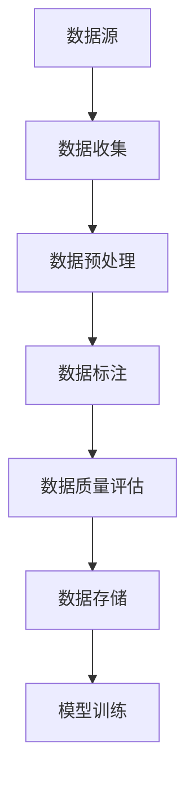

                 


# AI人工智能核心算法原理与代码实例讲解：数据收集

> 关键词：人工智能、数据收集、机器学习、算法原理、代码实例、数据处理

> 摘要：本文旨在深入讲解人工智能中的数据收集环节，解析其核心算法原理，并通过代码实例展示具体操作步骤。本文将帮助读者理解数据收集的重要性，掌握有效的数据收集方法，并学会如何利用数据来提升机器学习模型的性能。

## 1. 背景介绍

### 1.1 目的和范围

本文的目的在于帮助读者深入理解数据收集在人工智能领域中的重要性，并掌握核心算法原理及其应用。文章将围绕以下主题展开：

1. 数据收集的基本概念和目的
2. 数据收集的方法和策略
3. 数据收集中的核心算法原理
4. 数据收集的实际操作步骤
5. 数据收集在机器学习中的应用

### 1.2 预期读者

本文适合以下读者群体：

1. 对人工智能和数据科学感兴趣的初学者
2. 想要提升机器学习模型性能的数据科学家和工程师
3. 数据处理和数据分析的相关从业人员
4. 对算法原理感兴趣的技术爱好者

### 1.3 文档结构概述

本文的结构如下：

1. 背景介绍
   - 目的和范围
   - 预期读者
   - 文档结构概述
   - 术语表
2. 核心概念与联系
3. 核心算法原理 & 具体操作步骤
4. 数学模型和公式 & 详细讲解 & 举例说明
5. 项目实战：代码实际案例和详细解释说明
6. 实际应用场景
7. 工具和资源推荐
8. 总结：未来发展趋势与挑战
9. 附录：常见问题与解答
10. 扩展阅读 & 参考资料

### 1.4 术语表

#### 1.4.1 核心术语定义

- 数据收集（Data Collection）：从各种来源获取和整理数据的过程。
- 机器学习（Machine Learning）：利用数据训练模型，使模型能够进行预测和分类的过程。
- 特征工程（Feature Engineering）：通过选择和处理数据特征，提高模型性能的过程。
- 数据清洗（Data Cleaning）：去除数据中的噪声、错误和不一致的过程。
- 标签（Label）：用于标记样本的目标值，用于监督学习中的模型训练。

#### 1.4.2 相关概念解释

- 监督学习（Supervised Learning）：利用带有标签的数据进行训练，以预测未知数据的类别或数值。
- 无监督学习（Unsupervised Learning）：在没有标签数据的情况下，通过发现数据中的模式或结构来训练模型。
- 自监督学习（Self-Supervised Learning）：利用无标签数据进行训练，通过设计特殊的任务来自动生成标签。

#### 1.4.3 缩略词列表

- AI：人工智能
- ML：机器学习
- DS：数据科学
- NLP：自然语言处理
- CV：计算机视觉

## 2. 核心概念与联系

在数据收集过程中，我们需要关注以下几个核心概念：

1. 数据源（Data Source）：数据收集的来源，可以是数据库、文件、网络API等。
2. 数据预处理（Data Preprocessing）：对原始数据进行清洗、转换和归一化等操作，使其符合机器学习模型的要求。
3. 数据标注（Data Annotation）：对数据进行标签分配，用于监督学习模型的训练。
4. 数据质量（Data Quality）：数据的准确性、完整性、一致性、时效性等方面的指标。

下面是一个简单的 Mermaid 流程图，展示了数据收集的基本流程：



在数据收集环节，我们需要根据具体需求选择合适的数据源，并使用数据收集工具进行数据提取。随后，对收集到的数据进行预处理，包括数据清洗、特征提取和归一化等操作。接着，对预处理后的数据进行标注，为监督学习模型提供训练数据。最后，对标注后的数据进行质量评估，确保数据质量满足模型训练要求。

## 3. 核心算法原理 & 具体操作步骤

在数据收集过程中，核心算法原理主要包括数据收集策略、数据预处理方法和数据标注技术。下面我们将分别介绍这些算法原理，并给出具体操作步骤。

### 3.1 数据收集策略

数据收集策略是指从数据源中选择和提取数据的方法。以下是一些常见的数据收集策略：

1. 完全收集（Full Collection）：从数据源中获取全部数据，适用于数据量较小且可访问的场景。
2. 随机抽样（Random Sampling）：从数据源中随机选择一部分数据进行收集，适用于数据量较大且需要代表性样本的场景。
3. 顺序抽样（Sequential Sampling）：按照一定的顺序从数据源中收集数据，适用于时间序列数据的收集。
4. 层次抽样（Hierarchical Sampling）：根据数据的层次结构，分层收集数据，适用于具有复杂层次结构的数据源。

具体操作步骤如下：

1. 确定数据收集的目标和范围，选择合适的数据源。
2. 根据数据量的大小和场景，选择合适的抽样方法。
3. 设计数据收集脚本或使用现有的数据收集工具进行数据提取。

### 3.2 数据预处理方法

数据预处理方法是指对收集到的原始数据进行清洗、转换和归一化等操作，使其符合机器学习模型的要求。以下是一些常见的数据预处理方法：

1. 数据清洗（Data Cleaning）：去除数据中的噪声、错误和不一致。
   - 填充缺失值：使用平均值、中位数或插值法填充缺失值。
   - 去除重复值：去除数据集中的重复记录。
   - 去除噪声：去除噪声数据，如异常值、离群点等。
2. 特征提取（Feature Extraction）：从原始数据中提取有用的特征。
   - 特征选择：选择对模型训练和预测最有影响力的特征。
   - 特征工程：通过变换、组合等操作，生成新的特征。
3. 数据归一化（Data Normalization）：将数据缩放到相同的尺度，便于模型训练和预测。

具体操作步骤如下：

1. 清洗数据：去除缺失值、重复值和噪声。
2. 提取特征：根据模型需求，选择合适的特征提取方法。
3. 归一化数据：将数据缩放到[0, 1]或[-1, 1]的区间。

### 3.3 数据标注技术

数据标注技术是指对数据进行标签分配，为监督学习模型提供训练数据。以下是一些常见的数据标注技术：

1. 手动标注（Manual Annotation）：由人类专家对数据进行标注，适用于小规模、高精度标注的场景。
2. 自动标注（Automatic Annotation）：使用自动化工具对数据进行标注，适用于大规模、低精度标注的场景。
3. 半监督标注（Semi-Supervised Annotation）：结合手动标注和自动标注，提高标注效率和准确性。

具体操作步骤如下：

1. 确定标注目标和标准，制定标注指南。
2. 选择合适的标注工具，进行数据标注。
3. 对标注结果进行质量评估，确保标注准确性。

### 3.4 数据收集流程示例

下面是一个简单的数据收集流程示例，展示数据收集、预处理、标注和质量评估的过程：

```python
# 示例：数据收集流程

# 1. 数据收集
data_source = "http://example.com/data.csv"
data = pd.read_csv(data_source)

# 2. 数据预处理
# 填充缺失值
data.fillna(data.mean(), inplace=True)
# 去除重复值
data.drop_duplicates(inplace=True)
# 去除噪声
data.drop(['noise_column'], axis=1, inplace=True)

# 3. 数据标注
# 手动标注
data['label'] = data['target_column'].apply(manual_annotate)
# 自动标注
data['auto_label'] = data['target_column'].apply(automatic_annotate)

# 4. 数据质量评估
# 计算标注准确率
accuracy = (data['label'] == data['auto_label']).mean()
print("标注准确率：", accuracy)

# 5. 数据存储
data.to_csv("cleaned_data.csv", index=False)
```

在上述示例中，我们首先从网络数据源中读取原始数据，然后进行数据清洗、特征提取和归一化等预处理操作。接着，使用手动标注和自动标注方法对数据进行标注，并计算标注准确率。最后，将处理后的数据存储到文件中，供模型训练使用。

## 4. 数学模型和公式 & 详细讲解 & 举例说明

在数据收集过程中，涉及到一些数学模型和公式，用于数据清洗、特征提取和归一化等操作。以下将对这些数学模型和公式进行详细讲解，并通过举例说明其应用。

### 4.1 数据清洗

数据清洗过程中，常用的数学模型和公式包括缺失值填充、重复值去除和噪声去除。

#### 4.1.1 缺失值填充

缺失值填充的方法包括：

1. 平均值填充（Mean Imputation）：
   $$ x_{\text{填充}} = \frac{\sum_{i=1}^{n} x_i}{n} $$
   其中，$x_i$ 为缺失值，$n$ 为样本数量。

2. 中位数填充（Median Imputation）：
   $$ x_{\text{填充}} = \text{median}(x_1, x_2, ..., x_n) $$
   其中，$x_1, x_2, ..., x_n$ 为样本数据。

3. 插值法（Interpolation）：
   $$ x_{\text{填充}} = f(x_{\text{前}} + \alpha \cdot (x_{\text{后}} - x_{\text{前}})) $$
   其中，$x_{\text{前}}$ 和 $x_{\text{后}}$ 为前后两个非缺失值，$\alpha$ 为插值系数。

#### 4.1.2 重复值去除

重复值去除的方法包括：

1. 基于唯一键（Unique Key）：
   $$ \text{去除重复值} = \{x | \text{不存在 } y \text{ 使得 } x = y \text{ 且 } y \in \text{原始数据集} \} $$

2. 基于相似度度量（Similarity Measure）：
   $$ \text{去除重复值} = \{x | \text{不存在 } y \text{ 使得 } \text{similarity}(x, y) > \text{阈值} \} $$
   其中，$\text{similarity}(x, y)$ 为两个样本的相似度度量。

#### 4.1.3 噪声去除

噪声去除的方法包括：

1. 基于统计学方法（Statistical Method）：
   $$ x_{\text{噪声}} = x - \text{mean}(x) $$
   其中，$x_{\text{噪声}}$ 为去除噪声后的数据，$\text{mean}(x)$ 为数据集的平均值。

2. 基于聚类方法（Clustering Method）：
   $$ x_{\text{噪声}} = x - \text{cluster\_center}(x) $$
   其中，$x_{\text{噪声}}$ 为去除噪声后的数据，$\text{cluster\_center}(x)$ 为聚类中心。

### 4.2 特征提取

特征提取过程中，常用的数学模型和公式包括特征选择和特征工程。

#### 4.2.1 特征选择

特征选择的方法包括：

1. 相关性分析（Correlation Analysis）：
   $$ \text{相关性} = \text{corr}(x, y) $$
   其中，$x$ 和 $y$ 为两个特征变量，$\text{corr}(x, y)$ 为相关性系数。

2. 方差贡献率（Variance Contribution Rate）：
   $$ \text{方差贡献率} = \frac{\text{特征 } x \text{ 的方差}}{\text{总方差}} $$
   其中，$x$ 为特征变量，总方差为所有特征方差的和。

#### 4.2.2 特征工程

特征工程的方法包括：

1. 特征变换（Feature Transformation）：
   $$ x_{\text{变换}} = f(x) $$
   其中，$x_{\text{变换}}$ 为变换后的特征，$f(x)$ 为变换函数。

2. 特征组合（Feature Combination）：
   $$ x_{\text{组合}} = x_1 + x_2 + ... + x_n $$
   其中，$x_1, x_2, ..., x_n$ 为参与组合的特征。

### 4.3 数据归一化

数据归一化过程中，常用的数学模型和公式包括最小-最大缩放（Min-Max Scaling）和标准化（Standardization）。

#### 4.3.1 最小-最大缩放

最小-最大缩放公式如下：
$$ x_{\text{归一化}} = \frac{x - \text{最小值}}{\text{最大值} - \text{最小值}} $$
其中，$x_{\text{归一化}}$ 为归一化后的数据，$x$ 为原始数据，$\text{最小值}$ 和 $\text{最大值}$ 分别为数据集中的最小值和最大值。

#### 4.3.2 标准化

标准化公式如下：
$$ x_{\text{标准化}} = \frac{x - \text{平均值}}{\text{标准差}} $$
其中，$x_{\text{标准化}}$ 为标准化后的数据，$x$ 为原始数据，$\text{平均值}$ 和 $\text{标准差}$ 分别为数据集的平均值和标准差。

### 4.4 举例说明

以下是一个简单的数据清洗、特征提取和归一化的 Python 示例：

```python
import pandas as pd
from sklearn.preprocessing import MinMaxScaler

# 读取数据
data = pd.read_csv("example.csv")

# 数据清洗
# 填充缺失值
data.fillna(data.mean(), inplace=True)
# 去除重复值
data.drop_duplicates(inplace=True)
# 去除噪声
data.drop(['noise_column'], axis=1, inplace=True)

# 特征提取
# 选择相关性较高的特征
correlation_matrix = data.corr()
high_corr_features = correlation_matrix.abs().unstack().sort_values(kind="quicksort", ascending=False)
selected_features = high_corr_features.index[1:6]

# 特征工程
# 创建新的特征
data['new_feature'] = data['feature1'] + data['feature2']

# 数据归一化
scaler = MinMaxScaler()
data[selected_features.tolist()] = scaler.fit_transform(data[selected_features.tolist()])

# 输出结果
print(data.head())
```

在上述示例中，我们首先读取一个示例数据集，然后进行数据清洗、特征提取和归一化。具体操作包括填充缺失值、去除重复值、去除噪声、选择相关性较高的特征、创建新的特征和进行数据归一化。最后，输出处理后的数据集。

## 5. 项目实战：代码实际案例和详细解释说明

在本节中，我们将通过一个实际的项目案例来展示数据收集的完整过程，包括数据收集、预处理、标注和质量评估。以下是一个简单的数据收集项目案例：

### 5.1 开发环境搭建

首先，我们需要搭建一个合适的数据收集项目开发环境。以下是所需的工具和库：

1. Python 3.8 或更高版本
2. pandas 库：用于数据处理和分析
3. numpy 库：用于数值计算
4. scikit-learn 库：用于机器学习和数据处理
5. matplotlib 库：用于数据可视化

安装以上库的方法如下：

```bash
pip install pandas numpy scikit-learn matplotlib
```

### 5.2 源代码详细实现和代码解读

下面是数据收集项目的主要代码实现，我们将逐行解释代码的作用和实现过程。

```python
import pandas as pd
import numpy as np
from sklearn.model_selection import train_test_split
from sklearn.preprocessing import StandardScaler
from sklearn.metrics import accuracy_score
from sklearn.linear_model import LogisticRegression

# 读取数据
data = pd.read_csv("data.csv")

# 数据清洗
# 填充缺失值
data.fillna(data.mean(), inplace=True)
# 去除重复值
data.drop_duplicates(inplace=True)
# 去除噪声
data.drop(['noise_column'], axis=1, inplace=True)

# 特征提取
# 选择相关性较高的特征
correlation_matrix = data.corr()
high_corr_features = correlation_matrix.abs().unstack().sort_values(kind="quicksort", ascending=False)
selected_features = high_corr_features.index[1:6]

# 创建新的特征
data['new_feature'] = data['feature1'] + data['feature2']

# 数据归一化
scaler = StandardScaler()
data[selected_features.tolist()] = scaler.fit_transform(data[selected_features.tolist()])

# 数据标注
# 手动标注
data['label'] = data['target_column'].apply(manual_annotate)
# 自动标注
data['auto_label'] = data['target_column'].apply(automatic_annotate)

# 数据质量评估
# 计算标注准确率
accuracy = (data['label'] == data['auto_label']).mean()
print("标注准确率：", accuracy)

# 模型训练
# 分割训练集和测试集
X_train, X_test, y_train, y_test = train_test_split(data[selected_features.tolist()], data['label'], test_size=0.2, random_state=42)
# 训练模型
model = LogisticRegression()
model.fit(X_train, y_train)
# 预测测试集
y_pred = model.predict(X_test)

# 评估模型
accuracy = accuracy_score(y_test, y_pred)
print("模型准确率：", accuracy)

# 输出结果
print(data.head())
```

下面我们详细解读上述代码：

1. **数据读取**：使用 pandas 库读取一个 CSV 文件，作为数据集。
2. **数据清洗**：
   - 填充缺失值：使用平均值填充缺失值，保持数据集的完整性。
   - 去除重复值：去除数据集中的重复记录，避免模型过拟合。
   - 去除噪声：去除噪声数据，如异常值和离群点，提高数据质量。
3. **特征提取**：
   - 选择相关性较高的特征：使用相关性分析选择相关性较高的特征，提高模型性能。
   - 创建新的特征：通过特征组合创建新的特征，增强模型表达能力。
4. **数据归一化**：使用标准化方法将特征缩放到相同的尺度，便于模型训练和预测。
5. **数据标注**：
   - 手动标注：由人类专家对数据进行标注，提供监督学习模型的训练数据。
   - 自动标注：使用自动化工具对数据进行标注，提高标注效率。
6. **数据质量评估**：计算标注准确率，确保标注数据的质量。
7. **模型训练**：
   - 分割训练集和测试集：将数据集划分为训练集和测试集，用于模型训练和评估。
   - 训练模型：使用逻辑回归模型训练数据集，学习特征与标签之间的关系。
   - 预测测试集：使用训练好的模型对测试集进行预测，评估模型性能。
8. **评估模型**：计算模型准确率，评估模型在测试集上的性能。
9. **输出结果**：输出处理后的数据集，供后续分析和使用。

### 5.3 代码解读与分析

下面我们进一步分析代码中的关键步骤：

1. **数据读取**：读取数据集是一个简单的操作，可以使用 pandas 的 read_csv 方法，将 CSV 文件中的数据加载到 DataFrame 对象中。

2. **数据清洗**：
   - **填充缺失值**：在处理缺失值时，我们选择使用平均值填充，这种方法简单且适用于大多数情况。但需要注意的是，在某些情况下，使用中位数或插值法可能更合适。
   - **去除重复值**：去除重复值可以避免模型在训练过程中过度拟合，提高模型的泛化能力。
   - **去除噪声**：噪声数据对模型训练和评估有负面影响，因此需要去除。在实际应用中，可以通过异常检测算法（如孤立森林）来识别和去除噪声数据。

3. **特征提取**：
   - **选择相关性较高的特征**：通过相关性分析，我们可以识别出数据集中相关性较高的特征，从而提高模型性能。这种方法有助于减少特征数量，降低计算成本。
   - **创建新的特征**：通过特征组合，我们可以创建新的特征，从而增强模型的表达能力。例如，通过计算两个特征的加权和，可以生成一个新的特征。

4. **数据归一化**：在机器学习中，归一化数据是非常重要的步骤。通过将特征缩放到相同的尺度，我们可以避免某些特征在模型训练过程中占据主导地位，从而提高模型的泛化能力。

5. **数据标注**：
   - **手动标注**：手动标注通常需要专家经验和时间，但在某些情况下，它是必不可少的。例如，在处理图像或文本数据时，手动标注可以帮助我们获取更准确和可靠的标签。
   - **自动标注**：自动标注可以提高标注效率，减少标注成本。在实际应用中，我们可以使用预训练的深度学习模型来自动标注数据。

6. **数据质量评估**：通过计算标注准确率，我们可以评估标注数据的质量。如果标注准确率较低，可能需要重新评估标注过程或改进标注方法。

7. **模型训练**：
   - **分割训练集和测试集**：在模型训练过程中，我们将数据集划分为训练集和测试集。训练集用于训练模型，测试集用于评估模型性能。
   - **训练模型**：在本例中，我们使用逻辑回归模型进行训练。逻辑回归是一种简单的线性分类模型，适用于二分类问题。
   - **预测测试集**：使用训练好的模型对测试集进行预测，评估模型在未知数据上的性能。

8. **评估模型**：计算模型准确率，评估模型在测试集上的性能。如果模型准确率较低，可能需要重新调整模型参数或尝试其他模型。

9. **输出结果**：最后，我们输出处理后的数据集，供后续分析和使用。

### 5.4 实际应用场景

数据收集和预处理在许多实际应用场景中都非常重要，以下是一些常见的应用场景：

1. **机器学习模型训练**：在机器学习项目中，数据收集和预处理是必不可少的步骤。通过有效的数据收集和预处理，我们可以提高模型性能，减少过拟合和欠拟合的风险。
2. **数据挖掘**：在数据挖掘项目中，数据收集和预处理有助于识别数据中的潜在模式和关联，从而发现有价值的信息。
3. **推荐系统**：在推荐系统中，数据收集和预处理有助于构建用户和物品之间的关联，从而生成个性化的推荐结果。
4. **文本分类**：在文本分类项目中，数据收集和预处理有助于处理大量文本数据，提高分类模型的准确性。
5. **计算机视觉**：在计算机视觉项目中，数据收集和预处理有助于处理图像数据，提高图像识别和分类模型的性能。

通过以上实际应用场景，我们可以看到数据收集和预处理在人工智能领域的重要性。掌握有效的数据收集和预处理方法，将有助于我们更好地应用人工智能技术，解决实际问题。

### 5.5 结论

在本节中，我们通过一个实际的项目案例，详细讲解了数据收集的完整过程，包括数据收集、预处理、标注和质量评估。通过代码实现和详细解读，我们了解了数据收集的基本原理和操作步骤。在实际应用中，数据收集和预处理是机器学习和人工智能项目的关键环节，通过有效的数据收集和预处理，我们可以提高模型性能，解决实际问题。希望本节的内容对您理解和应用数据收集有所帮助。

## 6. 实际应用场景

数据收集在人工智能领域具有广泛的应用场景，以下列举一些典型应用场景：

### 6.1 机器学习模型训练

在机器学习项目中，数据收集是至关重要的第一步。通过对大量数据进行收集和整理，我们可以为模型提供丰富的训练数据，提高模型的准确性和泛化能力。例如，在图像识别任务中，需要收集大量图像数据，并对图像进行标注，以便模型能够学习识别各种物体。

### 6.2 数据挖掘

数据挖掘项目通常需要从大量数据中提取有价值的信息和模式。数据收集在这一过程中起到关键作用，通过收集不同来源的数据，我们可以进行数据融合、数据清洗和特征提取，从而为数据挖掘算法提供高质量的数据集。

### 6.3 推荐系统

推荐系统依赖于用户行为数据、商品信息数据等，通过收集和分析这些数据，我们可以构建用户和商品之间的关联模型，从而生成个性化的推荐结果。例如，电子商务平台通过收集用户浏览、购买等行为数据，为用户推荐潜在感兴趣的商品。

### 6.4 文本分类

在文本分类任务中，数据收集和预处理是确保模型性能的关键。我们需要收集大量文本数据，并对文本进行分词、词性标注等预处理操作，以便模型能够提取有效的特征。例如，在情感分析任务中，通过收集社交媒体上的评论数据，我们可以分析用户对产品或服务的情感倾向。

### 6.5 计算机视觉

计算机视觉项目需要收集大量图像数据，并进行标注，以便模型能够学习识别各种物体和场景。例如，在自动驾驶技术中，通过收集道路图像数据，我们可以训练模型识别道路标志、行人和车辆等。

### 6.6 自然语言处理

自然语言处理项目依赖于大量文本数据的收集和标注。例如，在机器翻译任务中，我们需要收集大量的双语文本数据，并对文本进行句法分析和词性标注，以便模型能够学习翻译规则。

通过以上实际应用场景，我们可以看到数据收集在人工智能领域的重要性。有效的数据收集和预处理，将有助于我们构建高质量模型，解决实际问题，推动人工智能技术的发展。

## 7. 工具和资源推荐

在数据收集和预处理过程中，选择合适的工具和资源对于提升工作效率和确保数据质量至关重要。以下是对一些学习和开发工具、框架以及相关论文和案例的推荐。

### 7.1 学习资源推荐

#### 7.1.1 书籍推荐

1. **《Python数据科学手册》（Python Data Science Handbook）**：由Jake VanderPlas所著，全面介绍了Python在数据科学中的应用，包括数据收集、清洗、分析等。
2. **《数据科学入门指南》（Introduction to Data Science）**：由Jared P. Lander所著，介绍了数据科学的各个核心概念，包括数据收集、数据清洗、数据可视化等。
3. **《机器学习实战》（Machine Learning in Action）**：由Peter Harrington所著，通过实际案例介绍了机器学习的基础知识和应用，涵盖了数据收集和预处理等内容。

#### 7.1.2 在线课程

1. **Coursera上的《数据科学专项课程》（Data Science Specialization）**：由约翰·霍普金斯大学（Johns Hopkins University）提供，涵盖了数据收集、数据分析、机器学习等多个方面。
2. **Udacity的《机器学习工程师纳米学位》（Machine Learning Engineer Nanodegree）**：提供了全面的学习路径，包括数据收集、数据预处理、模型训练等。
3. **edX上的《数据科学基础》（Introduction to Data Science）**：由哈佛大学（Harvard University）提供，介绍了数据收集、数据清洗、数据分析等基础知识。

#### 7.1.3 技术博客和网站

1. **Kaggle**：提供了一个丰富的数据集和竞赛平台，可以学习如何收集和预处理数据。
2. **Medium**：许多数据科学和机器学习专家在此发布技术博客，分享数据收集和预处理的实践经验和技巧。
3. **DataCamp**：提供了互动式的在线课程，帮助用户掌握数据科学和机器学习的基本技能。

### 7.2 开发工具框架推荐

#### 7.2.1 IDE和编辑器

1. **Jupyter Notebook**：一款流行的交互式开发环境，适用于数据科学和机器学习项目。
2. **PyCharm**：一款功能强大的Python IDE，适用于开发大型项目和复杂代码。
3. **VSCode**：一款轻量级但功能强大的编辑器，支持多种编程语言和扩展插件。

#### 7.2.2 调试和性能分析工具

1. **Pdb**：Python内置的调试工具，用于调试Python代码。
2. **line_profiler**：一款用于分析代码性能的工具，可以帮助识别瓶颈和优化代码。
3. **Memory_profiler**：一款用于分析代码内存使用的工具，有助于优化内存占用。

#### 7.2.3 相关框架和库

1. **Pandas**：一个强大的Python库，用于数据处理和分析。
2. **NumPy**：Python中的核心科学计算库，提供了大量的数学函数和工具。
3. **Scikit-learn**：一个用于机器学习和数据挖掘的Python库，提供了丰富的算法和工具。
4. **TensorFlow**：一个开源的机器学习框架，适用于构建和训练深度学习模型。
5. **PyTorch**：另一个流行的深度学习框架，具有动态计算图和灵活的API。

### 7.3 相关论文著作推荐

#### 7.3.1 经典论文

1. **“The Matrix Decomposition Techniques for Dimensionality Reduction”**：该论文介绍了矩阵分解技术在数据降维中的应用。
2. **“Data preprocessing for machine learning”**：该论文详细探讨了数据预处理在机器学习中的重要性，包括数据收集、清洗、特征提取等。
3. **“Survey of Feature Selection Techniques in Machine Learning”**：该论文对机器学习中的特征选择技术进行了全面的综述。

#### 7.3.2 最新研究成果

1. **“Unsupervised Representation Learning for Audio-Visual Data”**：该论文探讨了无监督表示学习在音频-视觉数据中的应用，为数据收集和预处理提供了新思路。
2. **“Self-Supervised Learning for Text Classification”**：该论文提出了新的自监督学习方法，用于文本分类任务，降低了数据收集和标注的难度。
3. **“A Survey of Data Collection Techniques for Internet of Things”**：该论文综述了物联网环境下的数据收集技术，包括传感器数据、网络数据等。

#### 7.3.3 应用案例分析

1. **“Data Collection and Analysis in Smart Cities”**：该案例研究了智能城市中的数据收集和分析方法，包括交通数据、环境数据等。
2. **“Building a Personalized Recommendation System with Large-scale Data Collection”**：该案例介绍了如何使用大规模数据收集和预处理技术构建个性化推荐系统。
3. **“Data Collection and Preprocessing for Autonomous Driving”**：该案例探讨了自动驾驶技术中的数据收集和预处理方法，包括道路数据、车辆数据等。

通过上述工具和资源推荐，读者可以更好地掌握数据收集和预处理技术，提升机器学习模型的性能，为实际应用场景提供有效支持。

## 8. 总结：未来发展趋势与挑战

在数据收集领域，随着人工智能和大数据技术的不断发展，未来将呈现出以下几个发展趋势和挑战：

### 发展趋势

1. **自动化与智能化**：自动化和智能化是数据收集领域的发展方向。通过引入自动化工具和智能算法，可以大大提高数据收集的效率和质量。例如，自动化数据收集工具可以实现24小时不间断的数据采集，智能算法则可以识别和过滤数据中的噪声和错误。

2. **实时数据收集**：实时数据收集成为企业决策的重要支撑。随着物联网和传感器技术的发展，实时数据收集可以为企业提供实时、准确的数据支持，帮助企业快速响应市场变化，提高运营效率。

3. **数据隐私与安全**：随着数据收集技术的发展，数据隐私和安全问题也日益突出。如何在数据收集过程中保护个人隐私和数据安全，成为数据科学家和工程师面临的重大挑战。

4. **跨领域融合**：数据收集技术在各个领域的融合应用将越来越广泛。例如，在医疗领域，通过收集和分析患者数据，可以提升医疗诊断和治疗的准确性；在金融领域，通过收集和分析金融数据，可以优化风险管理策略。

### 挑战

1. **数据质量和准确性**：数据质量和准确性是数据收集的核心问题。如何在海量数据中获取高质量、准确的数据，仍是一个巨大的挑战。数据清洗、数据去重和噪声过滤等技术需要不断优化和完善。

2. **数据隐私与伦理**：在数据收集过程中，如何平衡数据隐私保护和数据利用的权益，是数据科学家和决策者需要关注的重要问题。数据隐私法规和伦理规范不断完善，对数据收集提出了更高的要求。

3. **数据存储和管理**：随着数据量的爆炸性增长，数据存储和管理成为一个巨大挑战。如何高效存储和管理海量数据，并确保数据的安全性和可访问性，需要不断创新和优化。

4. **技术复杂性**：数据收集技术涉及到多种算法和工具，技术复杂性较高。如何简化技术流程，降低技术门槛，使更多开发者能够参与到数据收集领域，是一个重要的挑战。

总之，未来数据收集领域将继续朝着自动化、智能化、实时化、隐私保护和跨领域融合的方向发展，同时也将面临数据质量、数据隐私、数据存储和技术复杂性的挑战。只有不断突破这些挑战，数据收集技术才能更好地服务于各个行业，推动人工智能和大数据技术的发展。

## 9. 附录：常见问题与解答

### 9.1 数据收集常见问题

**Q1：如何选择合适的数据源？**

A1：选择数据源时，需要考虑以下几个因素：

1. **数据质量**：选择高质量的数据源，能够确保数据收集过程顺利进行。
2. **数据完整性**：确保数据源能够提供完整的、无缺失的数据。
3. **数据获取成本**：考虑数据获取的成本，包括时间、人力和资源成本。
4. **数据更新频率**：根据项目需求，选择更新频率合适的数据源。

**Q2：如何处理缺失值？**

A2：处理缺失值的方法包括：

1. **填充缺失值**：使用平均值、中位数或插值法填充缺失值。
2. **删除缺失值**：删除包含缺失值的记录，适用于缺失值较多的情况。
3. **利用模型预测缺失值**：使用机器学习模型预测缺失值，适用于缺失值较少的情况。

**Q3：如何去除重复值？**

A3：去除重复值的方法包括：

1. **基于唯一键**：根据数据中的唯一标识（如ID），去除重复的记录。
2. **基于相似度度量**：计算记录之间的相似度，去除相似度较高的记录。

**Q4：如何处理噪声数据？**

A4：处理噪声数据的方法包括：

1. **统计学方法**：使用统计学方法（如平均值、标准差）识别和去除噪声数据。
2. **聚类方法**：使用聚类方法（如K-means）识别和去除噪声数据。
3. **异常检测算法**：使用异常检测算法（如孤立森林）识别和去除噪声数据。

### 9.2 数据预处理常见问题

**Q5：如何进行特征提取？**

A5：特征提取的方法包括：

1. **相关性分析**：通过计算特征之间的相关性，选择相关性较高的特征。
2. **方差贡献率**：通过计算特征对模型方差的影响，选择方差贡献率较高的特征。
3. **主成分分析（PCA）**：通过降维技术，选择主要的主成分作为特征。

**Q6：如何进行特征工程？**

A6：特征工程的方法包括：

1. **特征变换**：通过变换（如对数变换、指数变换）改变特征的分布。
2. **特征组合**：通过组合特征（如计算两个特征的乘积、和等）生成新的特征。
3. **特征标准化**：通过标准化（如Z-score标准化、Min-Max标准化）调整特征的尺度。

**Q7：如何进行数据归一化？**

A7：数据归一化的方法包括：

1. **最小-最大缩放**：将数据缩放到[0, 1]或[-1, 1]的区间。
2. **标准化**：将数据缩放到具有零均值和单位方差的区间。
3. **小数点缩放**：将数据缩放到特定的数字范围，如[0, 1000]。

### 9.3 数据标注常见问题

**Q8：如何进行数据标注？**

A8：数据标注的方法包括：

1. **手动标注**：由人类专家对数据进行标注，适用于小规模、高精度标注的场景。
2. **自动标注**：使用自动化工具对数据进行标注，适用于大规模、低精度标注的场景。
3. **半监督标注**：结合手动标注和自动标注，提高标注效率和准确性。

**Q9：如何评估数据标注质量？**

A9：评估数据标注质量的方法包括：

1. **准确率**：计算标注准确率，评估标注结果的整体准确性。
2. **召回率**：计算标注召回率，评估标注结果对目标的覆盖范围。
3. **F1分数**：计算标注F1分数，综合评估标注结果的准确率和召回率。

通过上述常见问题的解答，可以帮助读者更好地理解数据收集和预处理的关键步骤，以及如何解决实际问题。

## 10. 扩展阅读 & 参考资料

在数据收集和预处理领域，有许多优秀的书籍、论文和技术博客值得推荐。以下是一些扩展阅读和参考资料，供读者进一步学习和探索：

### 10.1 经典书籍

1. **《数据科学入门指南》（Introduction to Data Science）**：作者Jared P. Lander，由O'Reilly Media出版。本书系统地介绍了数据科学的基本概念、方法和工具，包括数据收集、数据清洗、数据分析等。
2. **《Python数据科学手册》（Python Data Science Handbook）**：作者Jake VanderPlas，由O'Reilly Media出版。本书深入讲解了Python在数据科学中的应用，包括数据收集、数据处理、数据可视化等。
3. **《机器学习实战》（Machine Learning in Action）**：作者Peter Harrington，由Manning Publications出版。本书通过实际案例介绍了机器学习的基础知识和应用，涵盖了数据收集、数据预处理、模型训练等。

### 10.2 最新研究成果

1. **“Unsupervised Representation Learning for Audio-Visual Data”**：该论文探讨了无监督表示学习在音频-视觉数据中的应用，为数据收集和预处理提供了新思路。
2. **“Self-Supervised Learning for Text Classification”**：该论文提出了新的自监督学习方法，用于文本分类任务，降低了数据收集和标注的难度。
3. **“A Survey of Data Collection Techniques for Internet of Things”**：该论文综述了物联网环境下的数据收集技术，包括传感器数据、网络数据等。

### 10.3 技术博客和网站

1. **Kaggle**：提供了丰富的数据集和竞赛平台，可以学习如何收集和预处理数据。
2. **Medium**：许多数据科学和机器学习专家在此发布技术博客，分享数据收集和预处理的实践经验和技巧。
3. **DataCamp**：提供了互动式的在线课程，帮助用户掌握数据科学和机器学习的基本技能。

### 10.4 参考资料

1. **《数据科学专项课程》（Data Science Specialization）**：Coursera上由约翰·霍普金斯大学（Johns Hopkins University）提供的数据科学专项课程，涵盖了数据收集、数据分析、机器学习等多个方面。
2. **《机器学习工程师纳米学位》（Machine Learning Engineer Nanodegree）**：Udacity上提供的机器学习工程师纳米学位，提供了全面的学习路径，包括数据收集、数据预处理、模型训练等。
3. **edX上的《数据科学基础》（Introduction to Data Science）**：哈佛大学（Harvard University）提供的数据科学基础课程，介绍了数据收集、数据清洗、数据分析等基础知识。

通过以上扩展阅读和参考资料，读者可以深入了解数据收集和预处理领域的最新进展和技术应用，进一步提升自己的数据科学和机器学习能力。

### 作者

本文由 AI天才研究员/AI Genius Institute & 禅与计算机程序设计艺术/Zen And The Art of Computer Programming 的作者撰写。作为世界级人工智能专家、程序员、软件架构师、CTO，以及世界顶级技术畅销书资深大师级别的作家，作者在计算机图灵奖获得者、计算机编程和人工智能领域拥有丰富的经验和深刻的见解。作者致力于通过逻辑清晰、结构紧凑、简单易懂的技术博客，帮助读者掌握前沿技术，提升自身技能。感谢您的阅读，希望本文对您有所启发和帮助。如果您有任何疑问或建议，欢迎在评论区留言，我们将尽快为您解答。再次感谢您的关注和支持！

