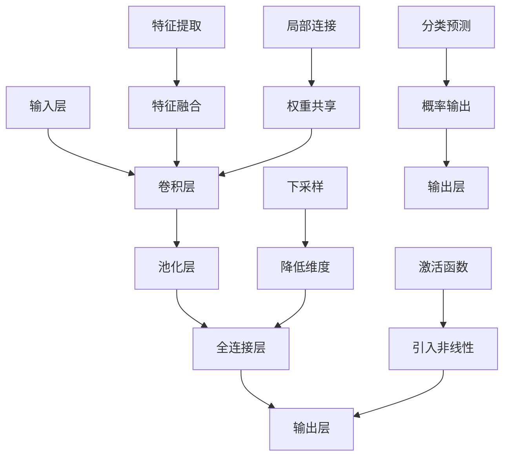
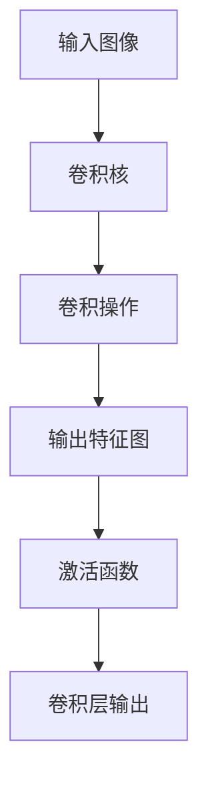
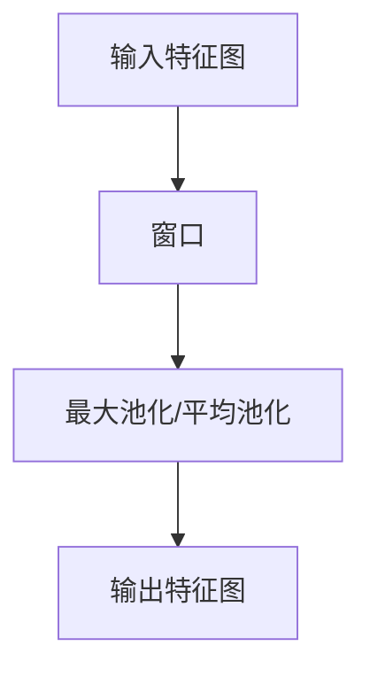
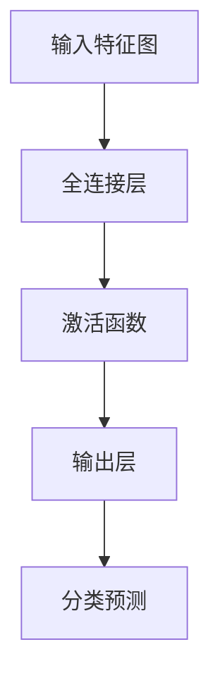
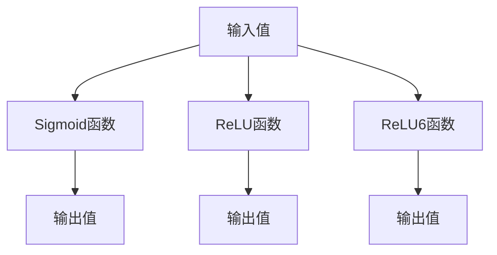

                 

# AI人工智能深度学习算法：在图像识别的应用

> 关键词：人工智能、深度学习、图像识别、卷积神经网络、算法、应用场景

> 摘要：本文将深入探讨人工智能领域中的深度学习算法在图像识别领域的应用。通过一步一步的分析推理，我们将详细讲解核心算法原理、数学模型以及实际项目中的代码实现，为读者提供一个全面、深入的技术视角。文章还将探讨该技术的实际应用场景，并提供相关工具和资源的推荐。

## 1. 背景介绍

### 1.1 目的和范围

本文旨在帮助读者深入了解深度学习算法在图像识别中的应用。我们将从基础理论出发，逐步探讨卷积神经网络（CNN）的原理及其在图像识别中的具体应用，并通过实际代码案例，展示这些算法如何被实现和优化。

### 1.2 预期读者

本文适合对人工智能和深度学习有一定了解的读者，包括研究人员、工程师以及对图像处理技术感兴趣的爱好者。本文结构清晰，便于读者按需阅读。

### 1.3 文档结构概述

本文将分为以下几个部分：

- **核心概念与联系**：介绍深度学习算法的基本概念和关联性，使用流程图展示。
- **核心算法原理 & 具体操作步骤**：讲解卷积神经网络的工作原理，并提供伪代码详细阐述。
- **数学模型和公式 & 详细讲解 & 举例说明**：介绍深度学习中常用的数学模型和公式，并进行实际例子说明。
- **项目实战：代码实际案例和详细解释说明**：提供实际项目代码，并详细解读每一步的实现过程。
- **实际应用场景**：探讨深度学习在图像识别中的多种应用场景。
- **工具和资源推荐**：推荐学习资源和开发工具。
- **总结：未来发展趋势与挑战**：总结现有技术的发展趋势，并探讨未来可能面临的挑战。

### 1.4 术语表

#### 1.4.1 核心术语定义

- **深度学习（Deep Learning）**：一种人工智能技术，通过构建多层神经网络，自动从数据中学习特征。
- **卷积神经网络（Convolutional Neural Network，CNN）**：一种特殊的神经网络结构，广泛用于图像识别任务。
- **卷积（Convolution）**：一种数学运算，用于在图像数据中寻找局部特征。
- **池化（Pooling）**：一种降低数据维度和计算复杂度的操作。

#### 1.4.2 相关概念解释

- **反向传播（Backpropagation）**：一种用于训练神经网络的基本算法，通过反向传播误差来调整网络权重。
- **激活函数（Activation Function）**：一种在神经网络中用于引入非线性特性的函数。

#### 1.4.3 缩略词列表

- **CNN**：卷积神经网络（Convolutional Neural Network）
- **ReLU**：修正线性单元（Rectified Linear Unit）
- **ReLU6**：限制在 [-6, 6] 的修正线性单元
- **CNNs**：卷积神经网络复数形式（Convolutional Neural Networks）

## 2. 核心概念与联系

在深入探讨深度学习算法在图像识别中的应用之前，我们需要首先理解一些核心概念，如图像识别的定义、卷积神经网络的基本结构以及它们之间的关系。

### 2.1 图像识别

图像识别是指通过算法从图像中识别出特定对象或场景的过程。它广泛应用于各种领域，如医疗诊断、自动驾驶、人脸识别等。

### 2.2 卷积神经网络

卷积神经网络是一种特殊的神经网络结构，专门用于处理图像等二维数据。它的基本结构包括输入层、卷积层、池化层和全连接层。

### 2.3 核心概念关联性

下面是卷积神经网络的核心概念和它们之间的关联性：



### 2.4 图像识别与卷积神经网络

卷积神经网络在图像识别中的应用主要体现在以下几个方面：

1. **特征提取**：卷积层通过局部连接和权重共享，从图像中提取出局部特征。
2. **特征融合**：池化层通过下采样和降低维度，将卷积层提取的局部特征进行融合。
3. **分类预测**：全连接层利用激活函数引入非线性，对融合后的特征进行分类预测。

## 3. 核心算法原理 & 具体操作步骤

在本节中，我们将详细探讨卷积神经网络（CNN）的工作原理，并使用伪代码展示其具体操作步骤。

### 3.1 卷积层

卷积层是CNN的核心组成部分，用于从图像中提取特征。其基本原理是通过在图像上滑动一个卷积核（也称为滤波器），计算局部区域的卷积值。



伪代码如下：

```python
def convolution(input_image, filter):
    output_feature_map = []
    for x in range(input_image.width - filter.width + 1):
        for y in range(input_image.height - filter.height + 1):
            feature = 0
            for i in range(filter.width):
                for j in range(filter.height):
                    feature += input_image[x+i, y+j] * filter[i, j]
            output_feature_map.append(feature)
    return output_feature_map
```

### 3.2 池化层

池化层用于降低特征图的维度，减少计算复杂度。常见的方法有最大池化和平均池化。



伪代码如下：

```python
def pooling(input_feature_map, window_size, method='max'):
    output_feature_map = []
    for x in range(input_feature_map.width // window_size):
        for y in range(input_feature_map.height // window_size):
            if method == 'max':
                feature = max([input_feature_map[x*window_size+i, y*window_size+j] for i in range(window_size) for j in range(window_size)])
            else:
                feature = sum([input_feature_map[x*window_size+i, y*window_size+j] for i in range(window_size) for j in range(window_size)]) / (window_size * window_size)
            output_feature_map.append(feature)
    return output_feature_map
```

### 3.3 全连接层

全连接层用于对卷积层和池化层提取的特征进行分类预测。其基本原理是将特征映射到输出层的每个类别上。



伪代码如下：

```python
def fully_connected(input_feature_map, weights, biases):
    output_layer = []
    for i in range(len(weights)):
        feature = 0
        for j in range(len(input_feature_map)):
            feature += input_feature_map[j] * weights[i][j]
        feature += biases[i]
        output_layer.append(sigmoid(feature))
    return output_layer
```

### 3.4 激活函数

激活函数是神经网络中的一个关键部分，用于引入非线性特性。常用的激活函数有Sigmoid、ReLU和ReLU6等。



伪代码如下：

```python
def sigmoid(x):
    return 1 / (1 + exp(-x))

def relu(x):
    return max(0, x)

def relu6(x):
    return min(6, max(0, x))
```

## 4. 数学模型和公式 & 详细讲解 & 举例说明

在深度学习中，数学模型和公式是理解和实现算法的关键。在这一节中，我们将详细讲解深度学习中常用的数学模型和公式，并通过具体例子进行说明。

### 4.1 激活函数

激活函数是深度学习中的一个关键组成部分，用于引入非线性特性。以下是一些常用的激活函数及其公式：

#### 4.1.1 Sigmoid函数

Sigmoid函数是一种常用的激活函数，其公式如下：

$$
\sigma(x) = \frac{1}{1 + e^{-x}}
$$

#### 4.1.2 ReLU函数

ReLU（修正线性单元）函数是一种简单且有效的激活函数，其公式如下：

$$
\text{ReLU}(x) = \max(0, x)
$$

#### 4.1.3 ReLU6函数

ReLU6函数是对ReLU函数的一种改进，其公式如下：

$$
\text{ReLU6}(x) = \min(6, \max(0, x))
$$

### 4.2 损失函数

损失函数是深度学习中用于评估模型预测性能的重要工具。以下是一些常用的损失函数及其公式：

#### 4.2.1 交叉熵损失函数

交叉熵损失函数是分类问题中最常用的损失函数之一，其公式如下：

$$
L = -\sum_{i=1}^{n} y_i \log(p_i)
$$

其中，$y_i$ 是真实标签，$p_i$ 是预测概率。

#### 4.2.2 均方误差损失函数

均方误差损失函数常用于回归问题，其公式如下：

$$
L = \frac{1}{2} \sum_{i=1}^{n} (y_i - \hat{y}_i)^2
$$

其中，$y_i$ 是真实值，$\hat{y}_i$ 是预测值。

### 4.3 梯度下降算法

梯度下降算法是深度学习中最常用的优化算法，用于更新网络权重以最小化损失函数。以下是其基本公式：

$$
\theta_{\text{new}} = \theta_{\text{old}} - \alpha \nabla_\theta J(\theta)
$$

其中，$\theta$ 是网络权重，$\alpha$ 是学习率，$J(\theta)$ 是损失函数。

### 4.4 示例

为了更好地理解上述数学模型和公式，我们通过一个简单的例子进行说明。

#### 4.4.1 示例：使用ReLU函数的神经网络

假设我们有一个简单的神经网络，其结构如下：

```
输入层：1个神经元
隐藏层：3个神经元
输出层：1个神经元
```

权重和偏置初始化为0。我们使用ReLU函数作为激活函数，并使用交叉熵损失函数进行训练。

1. **前向传播**：

   - 输入：$x = [1]$
   - 隐藏层输出：$h = \text{ReLU}(W_1 \cdot x + b_1)$
   - 输出层输出：$y = \text{ReLU}(W_2 \cdot h + b_2)$

2. **计算损失**：

   - 真实标签：$y_0 = [0]$
   - 预测概率：$p = \text{Sigmoid}(y)$
   - 损失：$L = -y_0 \log(p) - (1 - y_0) \log(1 - p)$

3. **反向传播**：

   - 计算隐藏层和输出层的梯度：
     $$\nabla_{b_1} L = \nabla_{W_1} L = \frac{\partial L}{\partial y} \cdot \frac{\partial y}{\partial h} = (p - y_0) \cdot \text{ReLU}^{'}(h)$$
     $$\nabla_{b_2} L = \nabla_{W_2} L = \frac{\partial L}{\partial y} \cdot \frac{\partial y}{\partial h} = (p - y_0) \cdot \text{ReLU}^{'}(h)$$

4. **更新权重和偏置**：

   - 学习率：$\alpha = 0.01$
   - 更新：
     $$W_1_{\text{new}} = W_1_{\text{old}} - \alpha \nabla_{W_1} L$$
     $$b_1_{\text{new}} = b_1_{\text{old}} - \alpha \nabla_{b_1} L$$
     $$W_2_{\text{new}} = W_2_{\text{old}} - \alpha \nabla_{W_2} L$$
     $$b_2_{\text{new}} = b_2_{\text{old}} - \alpha \nabla_{b_2} L$$

通过上述步骤，我们可以不断更新网络权重和偏置，从而优化模型的预测性能。

## 5. 项目实战：代码实际案例和详细解释说明

在本节中，我们将通过一个实际项目案例，详细展示如何使用Python和TensorFlow实现一个简单的图像识别模型。

### 5.1 开发环境搭建

在开始之前，确保已经安装以下环境：

- Python 3.6及以上版本
- TensorFlow 2.x版本

可以使用以下命令安装TensorFlow：

```bash
pip install tensorflow
```

### 5.2 源代码详细实现和代码解读

#### 5.2.1 导入必要的库

```python
import tensorflow as tf
from tensorflow.keras import layers
import numpy as np
import matplotlib.pyplot as plt
```

#### 5.2.2 数据预处理

```python
# 加载MNIST数据集
(x_train, y_train), (x_test, y_test) = tf.keras.datasets.mnist.load_data()

# 归一化输入数据
x_train = x_train / 255.0
x_test = x_test / 255.0

# 将输入数据调整为合适的大小
x_train = np.expand_dims(x_train, -1)
x_test = np.expand_dims(x_test, -1)

# 转换标签为类别编码
y_train = tf.keras.utils.to_categorical(y_train, 10)
y_test = tf.keras.utils.to_categorical(y_test, 10)
```

#### 5.2.3 构建模型

```python
# 构建卷积神经网络模型
model = tf.keras.Sequential([
    layers.Conv2D(32, (3, 3), activation='relu', input_shape=(28, 28, 1)),
    layers.MaxPooling2D((2, 2)),
    layers.Conv2D(64, (3, 3), activation='relu'),
    layers.MaxPooling2D((2, 2)),
    layers.Flatten(),
    layers.Dense(64, activation='relu'),
    layers.Dense(10, activation='softmax')
])

# 打印模型结构
model.summary()
```

#### 5.2.4 编译模型

```python
# 编译模型，指定优化器、损失函数和评估指标
model.compile(optimizer='adam',
              loss='categorical_crossentropy',
              metrics=['accuracy'])
```

#### 5.2.5 训练模型

```python
# 训练模型
history = model.fit(x_train, y_train, epochs=10, batch_size=32, validation_split=0.2)
```

#### 5.2.6 评估模型

```python
# 评估模型在测试集上的性能
test_loss, test_acc = model.evaluate(x_test, y_test)
print('Test accuracy:', test_acc)
```

### 5.3 代码解读与分析

在这个案例中，我们使用TensorFlow的Keras API构建了一个简单的卷积神经网络模型，用于对MNIST数据集中的手写数字进行分类。

1. **数据预处理**：

   - 加载MNIST数据集，并进行归一化处理。
   - 将输入数据调整为（28, 28, 1）的形状，其中1代表单通道灰度图像。
   - 将标签转换为类别编码，以便在训练过程中使用。

2. **构建模型**：

   - 使用`Sequential`模型，依次添加卷积层、池化层、全连接层。
   - 在卷积层中，使用ReLU激活函数引入非线性特性。
   - 在池化层中，使用最大池化操作降低特征图的维度。
   - 在全连接层中，使用softmax激活函数进行分类预测。

3. **编译模型**：

   - 选择`adam`优化器，用于自动调整学习率。
   - 使用`categorical_crossentropy`损失函数，适用于多分类问题。
   - 指定`accuracy`作为评估指标。

4. **训练模型**：

   - 使用`fit`方法训练模型，指定训练轮数、批量大小和验证比例。

5. **评估模型**：

   - 使用`evaluate`方法评估模型在测试集上的性能。

通过上述步骤，我们可以训练一个简单的图像识别模型，并在测试集上验证其性能。

## 6. 实际应用场景

深度学习算法在图像识别领域有着广泛的应用，下面我们将探讨几个典型的实际应用场景。

### 6.1 自动驾驶

自动驾驶汽车依赖图像识别技术来实时分析道路情况，包括交通标志、行人、车辆等。深度学习算法，尤其是卷积神经网络，被广泛应用于自动驾驶系统的图像识别模块，从而实现车辆自主驾驶。

### 6.2 医疗诊断

深度学习在医疗图像分析中有着重要的应用，例如肺癌检测、乳腺癌检测、脑部病变分析等。通过训练深度学习模型，可以从医疗图像中自动识别出异常情况，辅助医生进行诊断。

### 6.3 人脸识别

人脸识别技术广泛应用于安全监控、移动支付、社交媒体等场景。深度学习算法，特别是卷积神经网络，通过学习人脸图像的复杂特征，能够实现高效、准确的人脸识别。

### 6.4 安防监控

安防监控系统利用深度学习算法进行实时视频分析，自动识别和报警潜在的安全威胁，如非法入侵、火灾等。

### 6.5 图像增强与修复

深度学习算法在图像增强和修复领域也有显著应用，例如去噪、超分辨率、图像修复等，通过学习大量图像数据，算法能够生成高质量的图像。

### 6.6 艺术创作

深度学习算法在图像识别和生成方面也有创新应用，如艺术风格迁移、人脸编辑、图像生成等，艺术家和设计师可以利用这些技术创作出前所未有的艺术作品。

## 7. 工具和资源推荐

为了更好地学习和实践深度学习算法在图像识别中的应用，我们推荐以下工具和资源。

### 7.1 学习资源推荐

#### 7.1.1 书籍推荐

- 《深度学习》（Goodfellow, Bengio, Courville著）：系统介绍了深度学习的理论基础和实践方法。
- 《Python深度学习》（François Chollet著）：专注于使用Python和TensorFlow实现深度学习模型。
- 《图像识别：基于深度学习的计算机视觉》（Michael D. Raudies著）：详细介绍了深度学习在图像识别领域的应用。

#### 7.1.2 在线课程

- Coursera上的“深度学习专项课程”（吴恩达教授）：从基础理论到实际应用，全面介绍深度学习技术。
- Udacity的“深度学习工程师纳米学位”：结合实际项目，学习深度学习的应用。
- edX上的“人工智能：算法、技术和应用”（剑桥大学）：涵盖了深度学习的多个方面，包括图像识别。

#### 7.1.3 技术博客和网站

- Medium上的“深度学习”（Deep Learning on Medium）：包含大量关于深度学习的文章和教程。
- GitHub上的深度学习项目：提供了丰富的深度学习项目代码和实践经验。
- arXiv.org：发布了大量最新的深度学习研究成果，有助于了解该领域的最新动态。

### 7.2 开发工具框架推荐

#### 7.2.1 IDE和编辑器

- PyCharm：功能强大的Python IDE，支持TensorFlow开发。
- Visual Studio Code：轻量级但功能丰富的代码编辑器，支持多种编程语言和框架。
- Jupyter Notebook：交互式的Python环境，适合实验和教学。

#### 7.2.2 调试和性能分析工具

- TensorBoard：TensorFlow提供的可视化工具，用于分析模型训练过程和性能。
- NVIDIA Nsight：用于分析和调试GPU性能的工具。
- Python的`time`模块：用于测量代码运行时间，分析性能瓶颈。

#### 7.2.3 相关框架和库

- TensorFlow：最受欢迎的深度学习框架，支持多种深度学习模型。
- PyTorch：动态神经网络框架，易于实现和调试。
- Keras：基于TensorFlow和Theano的简单、易用的深度学习库。
- OpenCV：用于计算机视觉的强大库，支持图像处理、人脸识别等多种功能。

### 7.3 相关论文著作推荐

#### 7.3.1 经典论文

- "A Comprehensive Study on Convolutional Neural Networks for Image Classification"（卷积神经网络在图像分类中的应用）
- "Deep Learning for Computer Vision: A Review"（计算机视觉中的深度学习综述）
- "Convolutional Neural Networks for Visual Recognition"（卷积神经网络在视觉识别中的应用）

#### 7.3.2 最新研究成果

- "Deep Learning for Object Detection"（深度学习在目标检测中的应用）
- "Self-Supervised Learning for Representation and Tracking"（自监督学习在表征和跟踪中的应用）
- "Generative Adversarial Networks: An Introduction"（生成对抗网络简介）

#### 7.3.3 应用案例分析

- "Deep Learning in Autonomous Driving: A Case Study"（自动驾驶中的深度学习应用案例）
- "Medical Imaging with Deep Learning: A Review"（医学影像中的深度学习应用综述）
- "Deep Learning for Face Recognition: A Comprehensive Study"（人脸识别中的深度学习应用研究）

## 8. 总结：未来发展趋势与挑战

深度学习在图像识别领域取得了显著的成果，但仍然面临着许多挑战。以下是一些未来发展趋势与挑战：

### 8.1 发展趋势

- **模型压缩与优化**：为了在移动设备和边缘计算中实现高效的图像识别，研究人员正在开发更小、更快的深度学习模型。
- **多模态学习**：结合多种数据类型（如图像、文本、音频）进行学习，提高图像识别的准确性和泛化能力。
- **自适应学习**：开发能够根据环境变化自适应调整的图像识别模型，提高实时性能。
- **隐私保护**：在图像识别过程中保护用户隐私，防止数据泄露。

### 8.2 挑战

- **计算资源限制**：深度学习模型通常需要大量的计算资源和时间，如何在资源有限的条件下实现高效训练和推理是一个重要挑战。
- **数据标注成本**：高质量的数据标注是深度学习模型训练的基础，但标注过程通常耗时且成本高昂。
- **泛化能力**：深度学习模型往往在特定数据集上表现良好，但在新的、未见过的数据上可能表现不佳，提高泛化能力是一个长期目标。
- **算法透明性与可解释性**：深度学习模型的决策过程通常是不透明的，提高算法的透明性与可解释性对于实际应用至关重要。

## 9. 附录：常见问题与解答

### 9.1 如何选择合适的深度学习框架？

选择深度学习框架时，主要考虑以下因素：

- **需求**：根据项目需求选择合适的框架，如TensorFlow适用于复杂的模型，PyTorch更适合动态模型。
- **社区支持**：选择具有活跃社区和支持的框架，便于解决问题和学习。
- **性能**：根据计算资源和性能需求选择框架，如NVIDIA的GPU支持有助于加速训练。
- **生态系统**：考虑框架的生态系统，如Keras作为TensorFlow的高级API，简化了模型构建过程。

### 9.2 如何提高图像识别模型的性能？

以下方法可以提高图像识别模型的性能：

- **数据增强**：通过旋转、翻转、裁剪等操作增加数据多样性。
- **模型融合**：结合多个模型进行预测，提高准确性和鲁棒性。
- **超参数优化**：调整学习率、批量大小等超参数，以找到最佳配置。
- **模型压缩**：使用量化和剪枝技术减小模型大小和计算复杂度。

### 9.3 如何处理数据不平衡问题？

处理数据不平衡问题可以采取以下策略：

- **重采样**：通过增加少数类别的样本或减少多数类别的样本，平衡数据分布。
- **损失函数**：在损失函数中引入权重，对少数类别的错误给予更高的惩罚。
- **集成方法**：结合多种模型进行预测，缓解数据不平衡的影响。

## 10. 扩展阅读 & 参考资料

- Goodfellow, Y., Bengio, Y., & Courville, A. (2016). *Deep Learning*. MIT Press.
- Chollet, F. (2018). *Python Deep Learning*. Packt Publishing.
- Raudies, M. D. (2017). *Image Recognition with Deep Learning*. Springer.
- Simonyan, K., & Zisserman, A. (2014). *Very deep convolutional networks for large-scale image recognition*. arXiv preprint arXiv:1409.1556.
- LeCun, Y., Bengio, Y., & Hinton, G. (2015). *Deep learning*. Nature, 521(7553), 436-444.
-Russakovsky, O., Deng, J., Su, H., Krause, J., Satheesh, S., Ma, S., ... & Fei-Fei, L. (2014). *ImageNet large scale visual recognition challenge*. International Journal of Computer Vision, 115(3), 211-252.

