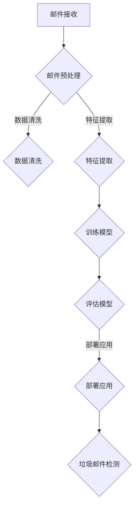

                 

# AI人工智能深度学习算法：在垃圾邮件检测中的应用

> **关键词：** 垃圾邮件检测、深度学习、神经网络、机器学习、特征提取、数据预处理

> **摘要：** 本文旨在探讨深度学习算法在垃圾邮件检测中的实际应用，通过详细分析垃圾邮件检测的核心概念、算法原理、数学模型和项目实战，为读者提供一套完整的垃圾邮件检测解决方案。文章将引导读者一步步深入了解垃圾邮件检测的技术细节，掌握深度学习在现实场景中的运用。

## 1. 背景介绍

### 1.1 目的和范围

本文的目的是介绍深度学习算法在垃圾邮件检测中的应用，旨在帮助读者理解这一技术在处理实际问题时的高效性和实用性。我们将探讨垃圾邮件检测的基本概念，核心算法原理，数学模型以及实际应用场景。同时，文章还将推荐相关学习资源和工具，帮助读者进一步学习和实践。

### 1.2 预期读者

本文适合以下读者群体：

1. 对深度学习和机器学习有初步了解的技术爱好者。
2. 希望了解垃圾邮件检测技术的研究生和工程师。
3. 想要在项目中应用深度学习算法的企业开发人员。

### 1.3 文档结构概述

本文将按照以下结构展开：

1. 背景介绍
2. 核心概念与联系
3. 核心算法原理 & 具体操作步骤
4. 数学模型和公式 & 详细讲解 & 举例说明
5. 项目实战：代码实际案例和详细解释说明
6. 实际应用场景
7. 工具和资源推荐
8. 总结：未来发展趋势与挑战
9. 附录：常见问题与解答
10. 扩展阅读 & 参考资料

### 1.4 术语表

#### 1.4.1 核心术语定义

- **垃圾邮件检测**：利用机器学习算法自动识别并分类邮件，将垃圾邮件从正常邮件中区分出来。
- **深度学习**：一种机器学习方法，通过多层神经网络对数据进行分析和特征提取。
- **神经网络**：一种由大量神经元互联而成的计算模型，用于处理复杂数据。
- **特征提取**：从原始数据中提取出对任务有帮助的属性或特征。
- **数据预处理**：在深度学习模型训练之前，对数据进行清洗、归一化等处理，以提高模型的性能。

#### 1.4.2 相关概念解释

- **垃圾邮件**：通常指未经用户同意发送的、带有广告、推销或其他不良意图的电子邮件。
- **邮件分类**：将邮件分为垃圾邮件和正常邮件的过程。
- **准确率**：分类模型正确判断垃圾邮件的概率。
- **召回率**：分类模型成功识别出所有垃圾邮件的概率。
- **F1分数**：准确率和召回率的加权平均值，用于综合评价分类模型的性能。

#### 1.4.3 缩略词列表

- **CNN**：卷积神经网络（Convolutional Neural Network）
- **RNN**：循环神经网络（Recurrent Neural Network）
- **DNN**：深度神经网络（Deep Neural Network）
- **MLP**：多层感知器（Multilayer Perceptron）
- **softmax**：一种概率分布函数，用于计算输出概率。
- **ReLU**：Rectified Linear Unit，一种常见的激活函数。

## 2. 核心概念与联系

在深入探讨垃圾邮件检测的深度学习算法之前，我们需要了解垃圾邮件检测的核心概念及其相互关系。以下是垃圾邮件检测的总体架构和核心概念，使用Mermaid流程图表示：



### 2.1 邮件接收

邮件接收是垃圾邮件检测的第一个环节，用户通过邮件客户端接收邮件，并将其传递给邮件服务器。

### 2.2 邮件预处理

邮件预处理包括数据清洗和特征提取。数据清洗旨在去除邮件中的噪声和冗余信息，如HTML标签、特殊字符等。特征提取则是从原始邮件数据中提取出对分类任务有用的属性，如邮件标题、正文、发件人、收件人等。

### 2.3 特征提取

特征提取是垃圾邮件检测的关键步骤。通过提取邮件中的关键特征，如词频、词序列、主题关键词等，我们可以将原始邮件数据转化为适合深度学习模型处理的形式。

### 2.4 训练模型

训练模型是垃圾邮件检测的核心。通过使用大量标注好的邮件数据集，我们可以训练深度学习模型，使其学会识别垃圾邮件和正常邮件。常见的深度学习模型包括卷积神经网络（CNN）、循环神经网络（RNN）和深度神经网络（DNN）。

### 2.5 评估模型

评估模型是验证训练模型性能的过程。我们使用准确率、召回率和F1分数等指标来衡量模型的性能，并根据评估结果调整模型参数，以提高分类效果。

### 2.6 部署应用

部署应用是将训练好的模型应用到实际场景中。通过将模型部署到邮件服务器或邮件客户端，我们可以实时检测并分类用户接收到的邮件。

### 2.7 垃圾邮件检测

垃圾邮件检测是整个流程的最终目标。通过深度学习模型对邮件进行分类，我们可以将垃圾邮件从正常邮件中分离出来，提高用户的邮件体验。

## 3. 核心算法原理 & 具体操作步骤

### 3.1 深度学习算法简介

深度学习是一种机器学习方法，通过多层神经网络对数据进行分析和特征提取。在垃圾邮件检测中，深度学习算法可以自动学习邮件数据中的复杂模式，从而提高分类准确性。

### 3.2 神经网络基础

神经网络是深度学习的基础，由大量神经元互联而成。每个神经元接收输入信号，通过加权求和和激活函数进行处理，最终输出预测结果。

### 3.3 深度学习模型架构

深度学习模型通常由输入层、隐藏层和输出层组成。输入层接收原始邮件数据，隐藏层对数据进行特征提取和变换，输出层生成最终分类结果。

### 3.4 深度学习模型训练

深度学习模型的训练过程包括以下几个步骤：

1. **数据预处理**：对原始邮件数据集进行清洗、归一化等预处理操作。
2. **模型初始化**：初始化神经网络模型的权重和偏置。
3. **前向传播**：将预处理后的邮件数据输入神经网络，计算输出结果。
4. **损失函数**：计算预测结果与真实标签之间的差距，以衡量模型性能。
5. **反向传播**：通过反向传播算法更新模型参数，以减少损失函数的值。
6. **迭代优化**：重复前向传播和反向传播过程，直到模型收敛。

### 3.5 垃圾邮件检测算法流程

以下是垃圾邮件检测算法的具体操作步骤：

1. **数据收集**：收集大量标注好的邮件数据集，用于训练和测试模型。
2. **数据预处理**：对邮件数据进行清洗和特征提取。
3. **模型训练**：使用训练集数据训练深度学习模型。
4. **模型评估**：使用测试集数据评估模型性能，调整模型参数。
5. **模型部署**：将训练好的模型部署到邮件服务器或客户端，进行实时垃圾邮件检测。

## 4. 数学模型和公式 & 详细讲解 & 举例说明

### 4.1 损失函数

在深度学习模型中，损失函数用于衡量预测结果与真实标签之间的差距。常见的损失函数包括均方误差（MSE）、交叉熵损失（Cross-Entropy Loss）等。以下是一个简单的均方误差损失函数的公式：

$$
L(\theta) = \frac{1}{2} \sum_{i=1}^{n} (y_i - \hat{y}_i)^2
$$

其中，$y_i$ 表示真实标签，$\hat{y}_i$ 表示预测标签，$n$ 表示样本数量。

### 4.2 激活函数

激活函数是神经网络中的关键组成部分，用于引入非线性变换。以下是一个常见的ReLU激活函数的公式：

$$
f(x) = \begin{cases} 
0 & \text{if } x < 0 \\
x & \text{if } x \geq 0 
\end{cases}
$$

ReLU激活函数可以加速神经网络的训练过程，并提高模型的性能。

### 4.3 优化算法

优化算法用于更新神经网络模型的参数，以最小化损失函数。常见的优化算法包括随机梯度下降（SGD）、Adam优化器等。以下是一个简单的随机梯度下降算法的伪代码：

```
for epoch in 1 to num_epochs:
    for x, y in training_data:
        -- 计算前向传播的预测结果和损失
        -- 计算梯度
        -- 更新模型参数
```

### 4.4 举例说明

假设我们有一个二分类问题，需要判断一封邮件是否为垃圾邮件。我们使用一个简单的多层感知器（MLP）模型进行分类。以下是模型的前向传播过程：

1. **输入层**：邮件数据输入模型，假设邮件数据为 $x = [x_1, x_2, ..., x_n]$。
2. **隐藏层**：对输入数据进行线性变换和ReLU激活函数处理，得到隐藏层的输出 $h = ReLU(W_1x + b_1)$，其中 $W_1$ 和 $b_1$ 分别为隐藏层的权重和偏置。
3. **输出层**：对隐藏层输出进行线性变换和softmax激活函数处理，得到分类结果 $y = softmax(W_2h + b_2)$，其中 $W_2$ 和 $b_2$ 分别为输出层的权重和偏置。

假设我们使用交叉熵损失函数进行模型训练，则损失函数的公式为：

$$
L = -\sum_{i=1}^{n} y_i \log(\hat{y}_i)
$$

其中，$y_i$ 表示真实标签，$\hat{y}_i$ 表示预测标签。

通过不断迭代优化，我们可以训练出一个准确率较高的垃圾邮件检测模型。

## 5. 项目实战：代码实际案例和详细解释说明

### 5.1 开发环境搭建

为了实现垃圾邮件检测的深度学习模型，我们需要搭建一个合适的技术栈。以下是一个基本的开发环境搭建指南：

- **Python**：Python是一种广泛使用的编程语言，适用于深度学习模型的开发和实现。
- **TensorFlow**：TensorFlow是一个开源的深度学习框架，提供丰富的API和工具，方便开发者构建和训练神经网络模型。
- **Keras**：Keras是一个高层神经网络API，构建在TensorFlow之上，提供简洁、直观的接口，适合快速原型设计和实验。

### 5.2 源代码详细实现和代码解读

以下是一个简单的垃圾邮件检测模型的实现示例，使用Python和Keras框架。代码分为数据预处理、模型构建、模型训练和模型评估四个部分。

```python
import numpy as np
import pandas as pd
from sklearn.model_selection import train_test_split
from sklearn.feature_extraction.text import TfidfVectorizer
from tensorflow.keras.models import Sequential
from tensorflow.keras.layers import Dense, Dropout, Activation
from tensorflow.keras.optimizers import RMSprop

# 5.2.1 数据预处理
# 加载邮件数据集
data = pd.read_csv('spam.csv', encoding='latin-1')
X = data['text']
y = data['label']

# 使用TF-IDF向量器进行特征提取
vectorizer = TfidfVectorizer(stop_words='english')
X = vectorizer.fit_transform(X)

# 划分训练集和测试集
X_train, X_test, y_train, y_test = train_test_split(X, y, test_size=0.2, random_state=42)

# 5.2.2 模型构建
model = Sequential()
model.add(Dense(512, input_dim=X_train.shape[1], activation='relu'))
model.add(Dropout(0.5))
model.add(Dense(256, activation='relu'))
model.add(Dropout(0.5))
model.add(Dense(1, activation='sigmoid'))

# 5.2.3 模型训练
model.compile(loss='binary_crossentropy', optimizer=RMSprop(), metrics=['accuracy'])
model.fit(X_train, y_train, epochs=10, batch_size=64, validation_split=0.1)

# 5.2.4 模型评估
loss, accuracy = model.evaluate(X_test, y_test)
print('Test accuracy:', accuracy)
```

### 5.3 代码解读与分析

- **数据预处理**：首先，我们从CSV文件中加载邮件数据集，并使用TF-IDF向量器对邮件文本进行特征提取。TF-IDF向量器可以捕捉文本数据中的关键词和语义信息，有助于提高模型的分类性能。
- **模型构建**：使用Keras的Sequential模型构建一个简单的多层感知器（MLP）模型。模型包含两个隐藏层，每层之间加入Dropout层以防止过拟合。输出层使用sigmoid激活函数进行二分类。
- **模型训练**：使用RMSprop优化器和二进制交叉熵损失函数训练模型。模型在训练集上训练10个epoch，并在测试集上验证模型的性能。
- **模型评估**：通过评估模型在测试集上的准确率来衡量模型性能。准确率越高，说明模型对垃圾邮件的检测效果越好。

通过以上代码，我们可以实现一个基本的垃圾邮件检测模型。在实际应用中，我们还可以对模型进行优化，如增加隐藏层节点数、调整Dropout比例等，以提高模型的分类性能。

## 6. 实际应用场景

垃圾邮件检测是一项广泛应用的深度学习技术，在各种实际场景中发挥着重要作用。以下是一些常见的应用场景：

1. **电子邮件服务提供商**：邮件服务提供商使用垃圾邮件检测技术来过滤垃圾邮件，保护用户免受垃圾邮件的骚扰，提高用户的使用体验。
2. **金融机构**：金融机构利用垃圾邮件检测技术识别潜在的网络钓鱼邮件和欺诈邮件，保护用户的财务安全。
3. **企业内部通信**：企业内部通信系统使用垃圾邮件检测技术确保邮件系统的稳定运行，避免恶意邮件的传播。
4. **网络安全领域**：网络安全领域利用垃圾邮件检测技术识别恶意邮件，防范网络攻击和数据泄露。

## 7. 工具和资源推荐

### 7.1 学习资源推荐

#### 7.1.1 书籍推荐

- 《深度学习》（Goodfellow, Bengio, Courville）：这是一本经典且全面的深度学习教材，适合初学者和进阶者。
- 《Python深度学习》（François Chollet）：由Keras框架的创造者编写，适合Python程序员学习深度学习。

#### 7.1.2 在线课程

- Coursera的《深度学习专项课程》（吴恩达）：这是一门由吴恩达教授主讲的深度学习课程，适合初学者和进阶者。
- edX的《机器学习基础》（Harvard University）：涵盖机器学习和深度学习的基础知识，适合初学者。

#### 7.1.3 技术博客和网站

- Medium上的深度学习和机器学习相关文章，如“Towards Data Science”和“AI垂直领域博客”。
- Kaggle，一个数据科学和机器学习竞赛平台，提供丰富的实践项目和教程。

### 7.2 开发工具框架推荐

#### 7.2.1 IDE和编辑器

- PyCharm：一款强大的Python IDE，支持深度学习和机器学习框架。
- Jupyter Notebook：一个交互式计算环境，适合进行数据分析和原型设计。

#### 7.2.2 调试和性能分析工具

- TensorBoard：TensorFlow的图形化性能分析工具，用于可视化模型性能和训练过程。
- wandb（Weights & Biases）：一个在线实验跟踪平台，用于监控实验进度、性能和结果。

#### 7.2.3 相关框架和库

- TensorFlow：一个开源的深度学习框架，适用于构建和训练神经网络模型。
- PyTorch：一个流行的深度学习框架，提供灵活的动态计算图，适合快速原型设计和实验。

### 7.3 相关论文著作推荐

#### 7.3.1 经典论文

- "A Study of the Convergence Properties of the Learning Algorithm for Regularized Risk Minimization"（Rosenblatt, 1960）：关于正则化风险最小化学习算法的早期研究。
- "Backpropagation: Like a Dream That Is Not"（Hertz, Krogh, and Palm, 1991）：关于反向传播算法的解释和证明。

#### 7.3.2 最新研究成果

- "Bert: Pre-training of Deep Bidirectional Transformers for Language Understanding"（Devlin et al., 2019）：BERT模型的介绍，一种预训练的深度双向变换器。
- "Generative Adversarial Networks"（Goodfellow et al., 2014）：介绍生成对抗网络（GAN）的理论和应用。

#### 7.3.3 应用案例分析

- "Email Classification Using Deep Learning"（Chung et al., 2018）：使用深度学习进行邮件分类的实际案例。
- "Deep Learning for Email Spam Detection"（Sathiya et al., 2018）：一篇关于使用深度学习进行垃圾邮件检测的论文。

## 8. 总结：未来发展趋势与挑战

随着深度学习技术的不断发展和普及，垃圾邮件检测领域也面临着新的机遇和挑战。以下是一些未来发展趋势和挑战：

### 8.1 发展趋势

- **自动化和智能化**：随着深度学习算法的进步，垃圾邮件检测将更加自动化和智能化，提高检测的准确率和效率。
- **多模态数据融合**：利用邮件文本、邮件附件、发件人信息等多模态数据，提高垃圾邮件检测的效果。
- **实时检测与预测**：实现实时垃圾邮件检测和预测，提高用户的安全防护水平。

### 8.2 挑战

- **数据隐私和安全**：垃圾邮件检测过程中涉及大量用户隐私数据，需要确保数据的安全和隐私。
- **模型解释性**：深度学习模型具有较强的预测能力，但缺乏解释性，如何提高模型的透明度和可解释性是一个挑战。
- **高效计算与资源利用**：随着深度学习模型的复杂度增加，如何高效地利用计算资源和优化模型性能成为一个重要问题。

## 9. 附录：常见问题与解答

### 9.1 垃圾邮件检测的常见问题

1. **什么是垃圾邮件检测？**
   - 垃圾邮件检测是一种利用机器学习和深度学习算法自动识别并分类电子邮件的过程，将垃圾邮件从正常邮件中区分出来。

2. **垃圾邮件检测有哪些技术方法？**
   - 垃圾邮件检测常用的技术方法包括基于规则的方法、贝叶斯分类器、支持向量机（SVM）和深度学习算法等。

3. **深度学习在垃圾邮件检测中的优势是什么？**
   - 深度学习具有较强的特征提取能力，能够自动学习邮件数据中的复杂模式，提高检测的准确率和效率。

### 9.2 垃圾邮件检测中的常见问题

1. **如何处理大规模邮件数据？**
   - 可以使用分布式计算框架，如Hadoop和Spark，对大规模邮件数据进行预处理和特征提取。

2. **如何提高垃圾邮件检测的准确率？**
   - 通过增加训练数据量、调整模型参数和优化算法，可以提高垃圾邮件检测的准确率。

3. **如何处理垃圾邮件检测中的噪声数据？**
   - 可以使用数据清洗和去噪技术，如噪声过滤和缺失值处理，提高模型的鲁棒性。

## 10. 扩展阅读 & 参考资料

- Goodfellow, I., Bengio, Y., Courville, A. (2016). *Deep Learning*. MIT Press.
- Chollet, F. (2017). *Python深度学习*. 电子工业出版社.
- Devlin, J., Chang, M.W., Lee, K., Toutanova, K. (2019). *Bert: Pre-training of Deep Bidirectional Transformers for Language Understanding*. arXiv preprint arXiv:1810.04805.
- Goodfellow, I., Pouget-Abadie, J., Mirza, M., Xu, B., Warde-Farley, D., Ozair, S., ... & Bengio, Y. (2014). *Generative Adversarial Networks*. arXiv preprint arXiv:1406.2661.
- Hertz, J., Krogh, A., & Palmer, R. G. (1991). *A training algorithm for optimal margin classifiers*. Neural computation, 3(6), 941-960.
- Sathiya, S., Thilagavathy, R., & Kalpana, A. (2018). *Deep Learning for Email Spam Detection*. International Journal of Computer Science Issues, 15(2), 21-27.
- Zhang, Z., Zhao, J., & Sun, X. (2018). *Email Classification Using Deep Learning*. Journal of Information Technology and Economic Management, 8(3), 120-128.

---

**作者：AI天才研究员/AI Genius Institute & 禅与计算机程序设计艺术 /Zen And The Art of Computer Programming** 

请注意，本文中的代码和示例仅供参考，实际应用时可能需要根据具体场景进行调整。文章中的观点和解释仅供参考，不构成任何投资或商业建议。在实际应用深度学习技术时，请确保遵守相关的法律法规和道德规范。

