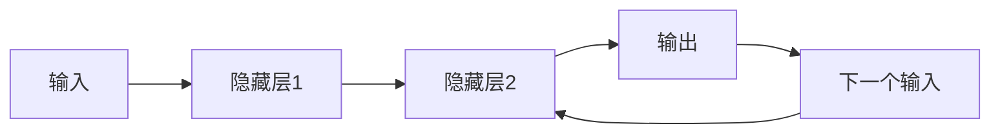
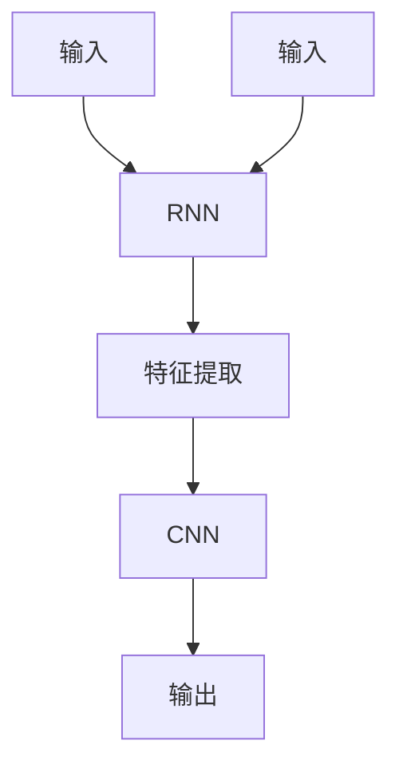
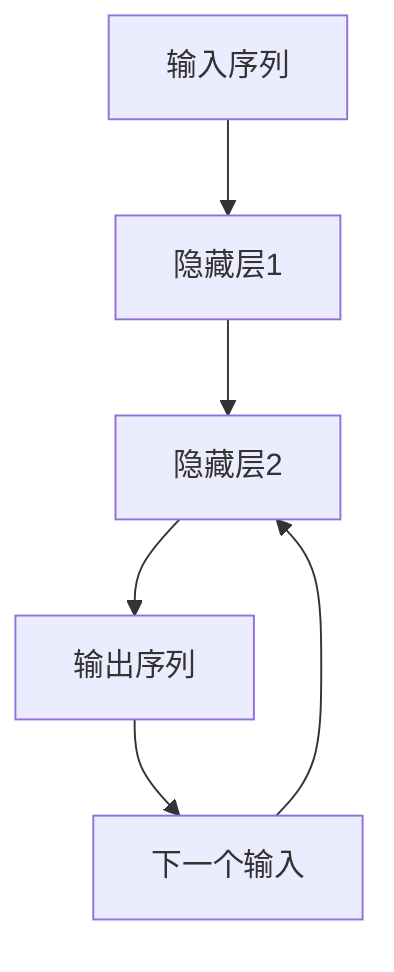
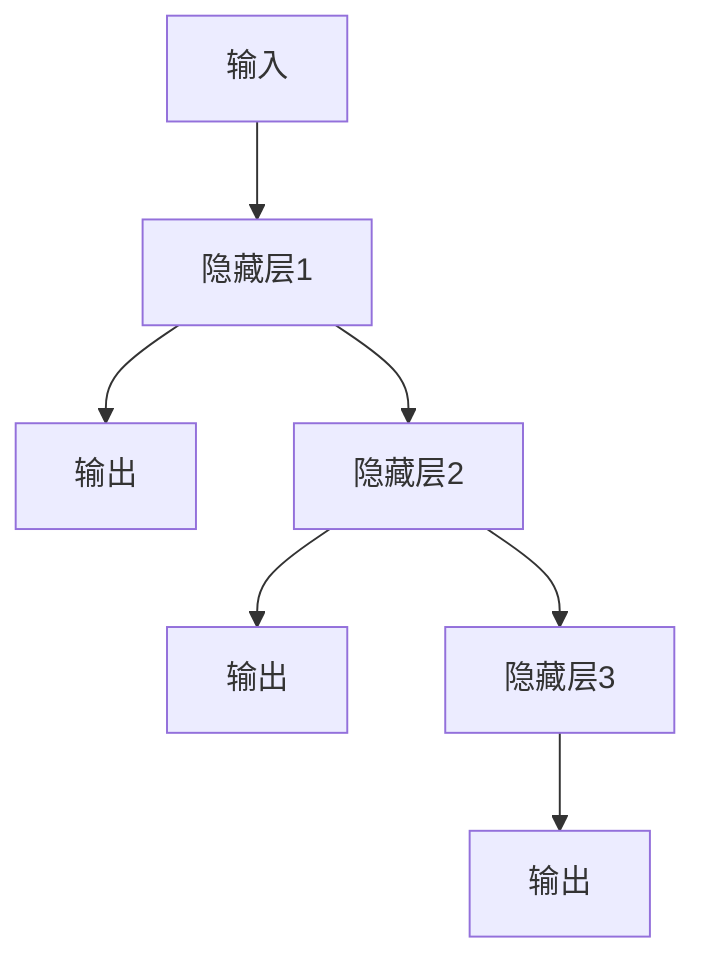

                 

# AI人工智能深度学习算法：循环神经网络的理解与使用

> **关键词：** 深度学习、循环神经网络（RNN）、反向传播算法、时间序列预测、序列建模  
> **摘要：** 本文将深入探讨循环神经网络（RNN）的概念、原理、数学模型以及其在深度学习中的应用，通过详细的算法解释和实例分析，帮助读者全面理解RNN的工作机制，并掌握其实际应用技巧。

## 1. 背景介绍

### 1.1 目的和范围

本文旨在为读者提供一个关于循环神经网络（RNN）的全面指南。我们将从基础概念出发，逐步深入到算法的数学模型和实现细节。通过本文的学习，读者将能够：

- 理解RNN的基本概念和工作原理。
- 掌握RNN的数学模型和反向传播算法。
- 学习RNN在实际项目中的应用实例。

### 1.2 预期读者

本文适合以下读者群体：

- 深度学习初学者，希望了解RNN的工作机制。
- 中级深度学习开发者，希望提高对RNN的理解和应用水平。
- 对时间序列预测、序列建模等领域感兴趣的研究人员。

### 1.3 文档结构概述

本文将分为以下几个部分：

- **第1章：背景介绍**：介绍文章的目的、读者对象以及文章结构。
- **第2章：核心概念与联系**：阐述RNN的核心概念及其与深度学习其他算法的联系。
- **第3章：核心算法原理 & 具体操作步骤**：讲解RNN的算法原理和操作步骤。
- **第4章：数学模型和公式 & 详细讲解 & 举例说明**：深入探讨RNN的数学模型。
- **第5章：项目实战：代码实际案例和详细解释说明**：通过实例展示RNN的应用。
- **第6章：实际应用场景**：分析RNN在不同领域的应用。
- **第7章：工具和资源推荐**：推荐学习资源和开发工具。
- **第8章：总结：未来发展趋势与挑战**：总结RNN的发展趋势和面临的挑战。
- **第9章：附录：常见问题与解答**：提供常见问题及其解答。
- **第10章：扩展阅读 & 参考资料**：推荐进一步学习的资源。

### 1.4 术语表

#### 1.4.1 核心术语定义

- **循环神经网络（RNN）**：一种能够处理序列数据的神经网络结构。
- **深度学习**：一种通过多层神经网络对数据进行自动特征提取和学习的方法。
- **时间序列**：按照时间顺序排列的一系列数据点。
- **反向传播算法**：一种用于训练神经网络的算法，通过反向传播误差来更新网络参数。

#### 1.4.2 相关概念解释

- **激活函数**：神经网络中用于引入非线性特性的函数。
- **梯度下降**：一种用于优化神经网络参数的算法，通过梯度下降来减小损失函数。
- **损失函数**：用于衡量模型预测结果与实际结果之间差异的函数。

#### 1.4.3 缩略词列表

- **RNN**：循环神经网络（Recurrent Neural Network）
- **DL**：深度学习（Deep Learning）
- **BP**：反向传播（Back Propagation）
- **SGD**：随机梯度下降（Stochastic Gradient Descent）

## 2. 核心概念与联系

循环神经网络（RNN）是一种专门设计用于处理序列数据的神经网络结构。与传统的神经网络（如卷积神经网络CNN）不同，RNN能够记住之前的信息，使其在处理如时间序列、文本等序列数据时具有独特的优势。

### 2.1 RNN的基本结构

RNN的基本结构包括输入层、隐藏层和输出层。隐藏层中包含一个重要的元素——**循环**，这是RNN区别于其他神经网络的核心特征。循环的存在使得RNN能够记住之前的信息，并将其用于当前的计算。

下面是一个简化的RNN结构示意图：



### 2.2 RNN与深度学习的联系

RNN是深度学习领域的一个重要分支。深度学习通过多层神经网络对数据进行自动特征提取和学习，而RNN则在处理序列数据时展现出强大的能力。RNN在许多领域都有广泛应用，如自然语言处理、语音识别、时间序列预测等。

RNN与深度学习的其他算法（如CNN、GAN等）也存在紧密的联系。例如，在自然语言处理领域，RNN可以与CNN结合，用于提取文本中的局部特征；在图像生成领域，RNN可以与生成对抗网络（GAN）结合，用于生成具有序列结构的图像。

下面是一个RNN与其他深度学习算法结合的示例：



### 2.3 RNN与时间序列的联系

时间序列是RNN最典型的应用场景之一。时间序列数据具有时序依赖性，即当前时刻的数据与之前时刻的数据之间存在关联。RNN通过其循环结构能够有效地捕捉这种时序依赖性，从而在时间序列预测中表现出色。

例如，在股票价格预测中，当前时刻的股票价格与之前时刻的股票价格之间存在关联。RNN可以学习这种关联，从而预测未来的股票价格。下面是一个RNN在时间序列预测中的示例：



通过上述核心概念与联系的分析，我们可以看到RNN在深度学习和时间序列预测等领域的重要性。接下来，我们将进一步探讨RNN的算法原理和具体操作步骤。

## 3. 核心算法原理 & 具体操作步骤

### 3.1 RNN的基本原理

循环神经网络（RNN）的核心在于其循环结构，这使得RNN能够记住之前的信息，并将其用于当前的计算。RNN的基本原理可以概括为：

1. **输入处理**：RNN将序列数据作为输入，每个数据点经过输入层传递到隐藏层。
2. **状态更新**：隐藏层的状态会随着序列的推进而更新，新的状态会基于当前输入和之前的隐藏状态计算得出。
3. **输出生成**：基于隐藏层的状态，RNN生成输出，用于后续的预测或分类。

下面是一个简单的RNN计算过程：



### 3.2 RNN的具体操作步骤

下面我们通过伪代码详细描述RNN的操作步骤，包括输入处理、状态更新和输出生成：

```python
# 初始化参数
W_xh, W_hh, W_hy, b_h = initialize_weights()

# 初始化隐藏状态和细胞状态
h_t = zeros(shape=(hidden_size, 1))
c_t = zeros(shape=(hidden_size, 1))

# 输入序列
x = [x_1, x_2, x_3, ..., x_T]

# 遍历输入序列
for t in range(T):
    # 输入处理
    x_t = x[t]

    # 状态更新
    h_t = tanh(W_xh * x_t + W_hh * h_t + b_h)
    c_t = W_xh * x_t + W_hh * c_t + b_h

    # 输出生成
    y_t = sigmoid(W_hy * h_t + b_y)

    # 更新隐藏状态和细胞状态
    h_t = h_t
    c_t = c_t

# 输出序列
y = [y_1, y_2, y_3, ..., y_T]
```

在上面的伪代码中，`W_xh`、`W_hh`、`W_hy` 和 `b_h` 分别表示输入到隐藏层、隐藏到隐藏层、隐藏到输出层的权重和偏置。`h_t` 和 `c_t` 分别表示第`t`个时间步的隐藏状态和细胞状态。`x_t` 和 `y_t` 分别表示第`t`个时间步的输入和输出。

### 3.3 反向传播算法

反向传播算法是训练RNN的关键步骤，它通过计算损失函数的梯度来更新网络参数。下面我们通过伪代码详细描述反向传播算法：

```python
# 计算预测值和真实值之间的误差
y_pred = [y_pred_1, y_pred_2, y_pred_3, ..., y_pred_T]
y_true = [y_true_1, y_true_2, y_true_3, ..., y_true_T]
error = [y_pred_t - y_true_t for y_pred_t, y_true_t in zip(y_pred, y_true)]

# 计算损失函数
loss = sum(error^2) / 2

# 计算梯度
dW_xh, dW_hh, dW_hy, db_h, db_y = gradient_descent(W_xh, W_hh, W_hy, b_h, b_y, h_t, c_t, x_t, y_t, learning_rate)

# 更新参数
W_xh = W_xh - dW_xh
W_hh = W_hh - dW_hh
W_hy = W_hy - dW_hy
b_h = b_h - db_h
b_y = b_y - db_y
```

在上面的伪代码中，`gradient_descent` 函数用于计算损失函数的梯度。通过反向传播误差，我们可以得到每个参数的梯度，并使用梯度下降算法更新参数。

通过上述步骤，我们详细介绍了RNN的算法原理和具体操作步骤。接下来，我们将进一步探讨RNN的数学模型和公式。

## 4. 数学模型和公式 & 详细讲解 & 举例说明

循环神经网络（RNN）的数学模型是其核心所在，它决定了RNN如何处理序列数据并生成输出。在RNN中，关键的概念包括隐藏状态、细胞状态、激活函数、损失函数等。以下是RNN的数学模型的详细解释。

### 4.1 隐藏状态和细胞状态

在RNN中，隐藏状态 \( h_t \) 和细胞状态 \( c_t \) 分别代表了当前时刻的上下文信息和信息流。隐藏状态 \( h_t \) 用于生成输出，而细胞状态 \( c_t \) 则在隐藏层内部传递信息。

#### 隐藏状态更新

隐藏状态的更新由以下公式给出：

\[ h_t = \tanh(W_{xh}x_t + W_{hh}h_{t-1} + b_h) \]

其中，\( W_{xh} \) 和 \( W_{hh} \) 分别表示输入到隐藏层的权重和隐藏到隐藏层的权重，\( b_h \) 表示隐藏层的偏置。\( \tanh \) 函数是一个常见的激活函数，用于引入非线性特性。

#### 细胞状态更新

细胞状态的更新由以下公式给出：

\[ c_t = W_{xh}x_t + W_{hh}h_{t-1} + b_h \]

与隐藏状态更新不同的是，细胞状态不使用激活函数。这是因为细胞状态负责在隐藏层内部传递信息，而不需要引入非线性。

### 4.2 输出生成

输出 \( y_t \) 是基于隐藏状态 \( h_t \) 生成的。常见的输出生成公式如下：

\[ y_t = \sigma(W_{hy}h_t + b_y) \]

其中，\( \sigma \) 是 sigmoid 激活函数，用于将隐藏状态映射到输出。\( W_{hy} \) 和 \( b_y \) 分别表示隐藏到输出层的权重和偏置。

### 4.3 损失函数

在RNN中，常用的损失函数是均方误差（MSE），用于衡量输出 \( y_t \) 与真实值 \( y_t^* \) 之间的差异：

\[ J = \frac{1}{2} \sum_{t=1}^{T} (y_t - y_t^*)^2 \]

其中，\( T \) 是序列的长度，\( y_t \) 是模型预测的输出，\( y_t^* \) 是真实值。

### 4.4 反向传播算法

在训练RNN时，反向传播算法用于计算损失函数的梯度，并更新网络参数。以下是反向传播算法的详细步骤：

#### 计算输出层梯度

\[ \frac{dJ}{dy_t} = y_t - y_t^* \]

\[ \frac{dJ}{dh_t} = \frac{dJ}{dy_t} \cdot \frac{dy_t}{dh_t} = (y_t - y_t^*) \cdot \sigma'(h_t) \]

#### 计算隐藏层梯度

\[ \frac{dJ}{dh_{t-1}} = \frac{dJ}{dh_t} \cdot \frac{dh_t}{dh_{t-1}} = (y_t - y_t^*) \cdot \sigma'(h_t) \cdot \tanh'(c_t) \cdot W_{hh} \]

\[ \frac{dJ}{dc_t} = \frac{dJ}{dh_t} \cdot \frac{dh_t}{dc_t} = (y_t - y_t^*) \cdot \sigma'(h_t) \cdot (1 - \tanh^2(c_t)) \cdot W_{xh} \]

#### 更新参数

\[ W_{hy} = W_{hy} - \alpha \cdot \frac{dJ}{dW_{hy}} \]

\[ b_y = b_y - \alpha \cdot \frac{dJ}{db_y} \]

\[ W_{hh} = W_{hh} - \alpha \cdot \frac{dJ}{dW_{hh}} \]

\[ b_h = b_h - \alpha \cdot \frac{dJ}{db_h} \]

\[ W_{xh} = W_{xh} - \alpha \cdot \frac{dJ}{dW_{xh}} \]

### 4.5 举例说明

假设我们有一个简单的RNN，用于预测一个序列 \( x = [x_1, x_2, x_3] \)。真实值 \( y^* = [y_1^*, y_2^*, y_3^*] \)。

1. **初始化参数**：
   \[ W_{xh}, W_{hh}, W_{hy}, b_h, b_y \] 均随机初始化。

2. **前向传播**：
   \[ h_1 = \tanh(W_{xh}x_1 + W_{hh}h_0 + b_h) \]
   \[ y_1 = \sigma(W_{hy}h_1 + b_y) \]

   \[ h_2 = \tanh(W_{xh}x_2 + W_{hh}h_1 + b_h) \]
   \[ y_2 = \sigma(W_{hy}h_2 + b_y) \]

   \[ h_3 = \tanh(W_{xh}x_3 + W_{hh}h_2 + b_h) \]
   \[ y_3 = \sigma(W_{hy}h_3 + b_y) \]

3. **计算损失函数**：
   \[ J = \frac{1}{2} \sum_{t=1}^{3} (y_t - y_t^*)^2 \]

4. **反向传播**：
   \[ \frac{dJ}{dy_1} = y_1 - y_1^* \]
   \[ \frac{dJ}{dh_1} = (y_1 - y_1^*) \cdot \sigma'(h_1) \]

   \[ \frac{dJ}{dh_2} = (y_2 - y_2^*) \cdot \sigma'(h_2) \cdot \tanh'(c_2) \cdot W_{hh} \]
   \[ \frac{dJ}{dc_2} = (y_2 - y_2^*) \cdot \sigma'(h_2) \cdot (1 - \tanh^2(c_2)) \cdot W_{xh} \]

   \[ \frac{dJ}{dh_3} = (y_3 - y_3^*) \cdot \sigma'(h_3) \cdot \tanh'(c_3) \cdot W_{hh} \]
   \[ \frac{dJ}{dc_3} = (y_3 - y_3^*) \cdot \sigma'(h_3) \cdot (1 - \tanh^2(c_3)) \cdot W_{xh} \]

5. **更新参数**：
   使用梯度下降更新参数：
   \[ W_{hy} = W_{hy} - \alpha \cdot \frac{dJ}{dW_{hy}} \]
   \[ b_y = b_y - \alpha \cdot \frac{dJ}{db_y} \]
   \[ W_{hh} = W_{hh} - \alpha \cdot \frac{dJ}{dW_{hh}} \]
   \[ b_h = b_h - \alpha \cdot \frac{dJ}{db_h} \]
   \[ W_{xh} = W_{xh} - \alpha \cdot \frac{dJ}{dW_{xh}} \]

通过上述步骤，我们详细讲解了RNN的数学模型、公式以及反向传播算法，并通过具体例子进行了说明。接下来，我们将通过一个实际项目来展示RNN的应用。

## 5. 项目实战：代码实际案例和详细解释说明

### 5.1 开发环境搭建

在开始项目实战之前，我们需要搭建一个合适的开发环境。以下是所需工具和步骤：

- **Python环境**：确保已安装Python 3.7及以上版本。
- **深度学习库**：安装TensorFlow 2.0及以上版本。可以使用以下命令安装：
  ```bash
  pip install tensorflow
  ```

- **Jupyter Notebook**：用于编写和运行代码。可以使用以下命令安装：
  ```bash
  pip install notebook
  ```

### 5.2 源代码详细实现和代码解读

#### 5.2.1 RNN模型定义

首先，我们需要定义一个简单的RNN模型。以下代码使用TensorFlow的Keras接口实现：

```python
import tensorflow as tf
from tensorflow.keras.models import Sequential
from tensorflow.keras.layers import SimpleRNN

# 定义RNN模型
model = Sequential()
model.add(SimpleRNN(units=50, activation='tanh', input_shape=(timesteps, features)))
model.add(tf.keras.layers.Dense(1))

model.compile(optimizer='adam', loss='mse')
```

- **Sequential模型**：一个线性堆叠的模型层。
- **SimpleRNN层**：一个简单的循环神经网络层，包含一个隐藏层，使用`tanh`激活函数。
- **Dense层**：一个全连接层，用于生成最终的输出。

#### 5.2.2 数据预处理

接下来，我们需要准备用于训练的数据。假设我们使用时间序列数据 \( X \) 和对应的标签 \( y \)。

```python
import numpy as np

# 假设X和y是已预处理的时间序列数据
# X = ... （[samples, timesteps, features]的形状）
# y = ... （[samples, 1]的形状）

# 对数据做归一化处理
X_normalized = (X - np.mean(X, axis=0)) / np.std(X, axis=0)
y_normalized = (y - np.mean(y, axis=0)) / np.std(y, axis=0)
```

#### 5.2.3 训练模型

使用预处理后的数据训练模型：

```python
# 训练模型
model.fit(X_normalized, y_normalized, epochs=100, batch_size=32)
```

#### 5.2.4 模型评估

完成训练后，我们可以评估模型的性能：

```python
# 预测新的数据
X_new_normalized = (X_new - np.mean(X, axis=0)) / np.std(X, axis=0)
y_pred_normalized = model.predict(X_new_normalized)

# 对预测结果进行反归一化处理
y_pred = y_pred_normalized * np.std(y, axis=0) + np.mean(y, axis=0)

# 计算预测误差
error = np.mean((y_pred - y) ** 2)
print(f"Prediction Error: {error}")
```

### 5.3 代码解读与分析

在上述代码中，我们首先定义了一个简单的RNN模型，使用了一个简单的循环层和一个全连接层。数据预处理步骤包括归一化处理，这是深度学习中的常见做法，有助于提高模型的训练效果。

训练过程中，我们使用均方误差（MSE）作为损失函数，并使用随机梯度下降（SGD）优化算法。通过调整训练参数（如学习率和批次大小），我们可以进一步优化模型性能。

在模型评估阶段，我们使用新的数据集进行预测，并对预测结果进行反归一化处理。计算预测误差，以评估模型的性能。

### 5.4 实际应用案例

我们可以将上述RNN模型应用于时间序列预测问题，如股票价格预测、气象数据预测等。以下是股票价格预测的实际应用案例：

- **数据集**：使用某支股票的历史价格数据作为输入。
- **目标**：预测未来一天的股票价格。

通过上述步骤，我们展示了如何使用RNN模型进行时间序列预测，并进行了详细的代码解读和分析。接下来，我们将分析RNN在实际应用场景中的具体表现。

## 6. 实际应用场景

循环神经网络（RNN）在深度学习领域中具有广泛的应用，尤其在处理序列数据时表现优异。以下列举了RNN在几个实际应用场景中的具体表现和优势：

### 6.1 自然语言处理

自然语言处理（NLP）是RNN的典型应用场景之一。RNN能够处理变长文本序列，这使得它在文本分类、情感分析、机器翻译等任务中表现突出。

- **文本分类**：RNN可以捕捉文本中的时间依赖关系，从而实现高效的情感分析、主题分类等任务。例如，通过训练RNN模型，可以判断一篇文章是正面、中性还是负面的。
- **机器翻译**：RNN在机器翻译中的应用非常广泛。通过编码源语言文本和目标语言文本，RNN可以生成高质量的双语翻译。例如，Google翻译就采用了基于RNN的神经网络翻译模型。

### 6.2 语音识别

语音识别是另一个RNN的重要应用领域。RNN能够处理语音信号的序列数据，从而实现语音到文本的转换。

- **语音识别系统**：RNN可以通过对语音信号的序列建模，识别出语音中的单词和句子。例如，苹果的Siri和亚马逊的Alexa就采用了基于RNN的语音识别技术。
- **语音生成**：RNN还可以用于语音合成，通过输入文本序列生成相应的语音。这种方法常用于生成语音助理的语音响应。

### 6.3 时间序列预测

时间序列预测是RNN的另一个重要应用领域。RNN能够捕捉时间序列数据中的时间依赖关系，从而实现准确的预测。

- **股票价格预测**：RNN可以分析历史股票价格数据，预测未来的股票价格。这种方法有助于投资者制定投资策略。
- **气象数据预测**：RNN可以分析历史气象数据，预测未来的天气情况。这有助于提高天气预报的准确性。

### 6.4 其他应用

除了上述应用领域，RNN还在许多其他领域展示了其强大的能力：

- **生物信息学**：RNN可以用于蛋白质结构预测、基因表达预测等生物信息学任务。
- **推荐系统**：RNN可以用于基于用户历史行为的推荐系统，实现个性化的内容推荐。
- **游戏AI**：RNN可以用于游戏中的智能体行为预测，提高游戏的智能化程度。

综上所述，RNN在多个实际应用场景中展现了其强大的能力和优势。随着深度学习技术的不断发展，RNN的应用前景将更加广阔。

## 7. 工具和资源推荐

为了更好地学习和实践循环神经网络（RNN），以下是针对深度学习开发者的一些建议和资源：

### 7.1 学习资源推荐

#### 7.1.1 书籍推荐

- **《深度学习》（Deep Learning）**：由Ian Goodfellow、Yoshua Bengio和Aaron Courville合著，这是深度学习的经典教材，涵盖了RNN的详细内容。
- **《循环神经网络：理论与实践》（Recurrent Neural Networks: A Practical Approach）**：提供了RNN的理论基础和实践案例，适合初学者和中级开发者。

#### 7.1.2 在线课程

- **《深度学习专项课程》（Deep Learning Specialization）**：由斯坦福大学提供的在线课程，涵盖了深度学习的各个领域，包括RNN。
- **《循环神经网络》（Recurrent Neural Networks）**：Udacity提供的在线课程，详细讲解了RNN的理论和实践。

#### 7.1.3 技术博客和网站

- **机器之心（PaperWeekly）**：提供最新的深度学习研究论文和解读。
- **Fast.ai**：专注于实用深度学习，提供高质量的教学资源和课程。

### 7.2 开发工具框架推荐

#### 7.2.1 IDE和编辑器

- **Jupyter Notebook**：方便进行交互式编程和可视化，适用于深度学习项目的开发和调试。
- **PyCharm**：强大的Python IDE，支持多种编程语言，适合专业开发人员。

#### 7.2.2 调试和性能分析工具

- **TensorBoard**：TensorFlow提供的可视化工具，用于分析和调试深度学习模型。
- **Profiling Tools**：如Py-Spy、GProfiler等，用于性能分析。

#### 7.2.3 相关框架和库

- **TensorFlow**：广泛使用的深度学习框架，支持RNN的实现。
- **PyTorch**：流行的深度学习框架，提供灵活的动态计算图，适合研究和个人项目。

### 7.3 相关论文著作推荐

#### 7.3.1 经典论文

- **《序列模型中的循环神经网络》（Sequences Model Based on Recurrent Neural Network）**：首次提出RNN的基本结构。
- **《长短期记忆网络》（Long Short-Term Memory Networks for Long-Term Dependencies）**：引入了LSTM，解决了传统RNN的长期依赖问题。

#### 7.3.2 最新研究成果

- **《Transformer：一种新的序列到序列模型》（Attention Is All You Need）**：提出了Transformer模型，虽然不是RNN，但为序列建模提供了新的思路。
- **《BERT：预训练的深度双向转换器》（BERT: Pre-training of Deep Bidirectional Transformers for Language Understanding）**：利用大规模语料进行预训练，推动了NLP的发展。

#### 7.3.3 应用案例分析

- **《基于RNN的股票价格预测研究》**：分析RNN在股票价格预测中的实际应用。
- **《RNN在语音识别中的应用》**：探讨RNN在语音识别中的性能表现。

通过上述资源和工具，开发者可以更好地学习和应用循环神经网络，从而在深度学习领域取得突破。接下来，我们将总结RNN的发展趋势与挑战。

## 8. 总结：未来发展趋势与挑战

循环神经网络（RNN）作为深度学习领域的一个重要分支，近年来在自然语言处理、语音识别和时间序列预测等领域取得了显著成果。然而，随着人工智能技术的不断进步，RNN也面临着一系列的发展趋势和挑战。

### 8.1 未来发展趋势

1. **模型性能的提升**：随着计算能力的提升和数据量的增加，RNN模型的性能有望得到进一步提升。尤其是在大规模数据集上，通过更高效的训练算法和优化策略，RNN的性能有望达到或超越当前的主流模型。

2. **多模态学习**：未来的RNN模型可能会整合多种模态的数据，如文本、图像和声音，从而实现更加智能和灵活的模型。这将为多个应用领域带来革命性的变化，如智能助手、自动驾驶和医疗诊断等。

3. **个性化学习**：基于用户行为和兴趣的个性化学习将成为RNN的一个重要发展方向。通过捕捉用户的动态行为和反馈，RNN模型可以实现高度个性化的推荐和服务，提高用户体验。

4. **硬件加速**：随着专用硬件（如GPU、TPU）的发展，RNN模型的训练和推理速度将得到显著提升。硬件加速将使得RNN在大规模应用场景中更具竞争力。

### 8.2 面临的挑战

1. **计算资源消耗**：RNN模型的训练过程通常需要大量的计算资源，尤其是在处理大规模数据集时。如何优化模型结构和训练算法，以减少计算资源消耗，是一个亟待解决的问题。

2. **长期依赖问题**：RNN在处理长序列数据时，存在长期依赖问题。如何设计更有效的循环结构，以捕捉长序列中的长期依赖关系，是一个重要的研究课题。

3. **过拟合风险**：RNN模型在处理序列数据时，容易受到过拟合的影响。如何设计有效的正则化策略，以避免过拟合，是一个关键挑战。

4. **可解释性**：随着RNN模型变得越来越复杂，如何解释和验证模型的行为，提高其可解释性，成为一个重要的研究方向。可解释性的提升将有助于提高模型的安全性和可靠性。

综上所述，循环神经网络（RNN）在未来发展中面临着一系列机遇和挑战。通过不断创新和优化，RNN有望在深度学习领域发挥更大的作用。

## 9. 附录：常见问题与解答

### 9.1 RNN与其他神经网络的区别

**Q：RNN与卷积神经网络（CNN）有什么区别？**

A：RNN和CNN都是深度学习中的神经网络结构，但它们在处理数据的方式上有所不同。

- **RNN**：专门设计用于处理序列数据，如文本、时间序列等。RNN能够记住之前的信息，并在处理新的数据时利用这些信息。
- **CNN**：主要处理图像等二维数据。CNN通过卷积操作提取图像中的局部特征，并在多个卷积层中逐步提取更高层次的特征。

### 9.2 RNN在训练过程中容易出现的问题

**Q：为什么RNN在训练过程中容易出现梯度消失或梯度爆炸的问题？**

A：RNN在训练过程中容易出现梯度消失或梯度爆炸的问题，主要是由于以下几个原因：

- **长期依赖问题**：RNN在处理长序列数据时，难以保持长期依赖关系，导致梯度在传递过程中逐渐消失或爆炸。
- **激活函数**：某些激活函数（如ReLU）在训练过程中可能导致梯度为零，从而导致梯度消失。
- **训练策略**：训练过程中，未能有效地利用梯度下降算法，如学习率设置不合理、未能正确使用反向传播算法等。

### 9.3 如何解决RNN的梯度消失问题

**Q：有哪些方法可以解决RNN的梯度消失问题？**

A：以下是一些解决RNN梯度消失问题的常见方法：

- **LSTM（长短期记忆网络）**：LSTM通过引入门控机制，解决了传统RNN的长期依赖问题。
- **GRU（门控循环单元）**：GRU是对LSTM的改进，通过简化门控机制，提高了计算效率。
- **梯度裁剪**：在训练过程中，对梯度进行裁剪，以避免梯度爆炸问题。
- **学习率调整**：适当调整学习率，以避免训练过程中的不稳定现象。

### 9.4 RNN在实际应用中的例子

**Q：RNN在实际应用中可以解决哪些问题？**

A：RNN在实际应用中可以解决多种序列建模问题，包括：

- **文本分类**：通过分析文本序列，判断文本的情感倾向或主题。
- **语音识别**：将语音信号转换为文本，实现语音到文字的转换。
- **时间序列预测**：分析历史时间序列数据，预测未来的数据趋势。

## 10. 扩展阅读 & 参考资料

- **《深度学习》（Deep Learning）**：Ian Goodfellow、Yoshua Bengio和Aaron Courville著，是深度学习的经典教材。
- **《循环神经网络：理论与实践》（Recurrent Neural Networks: A Practical Approach）**：提供了RNN的理论基础和实践案例。
- **《深度学习专项课程》（Deep Learning Specialization）**：由斯坦福大学提供的在线课程。
- **《TensorFlow官方文档》（TensorFlow Documentation）**：详细介绍了TensorFlow的使用方法和示例。
- **《PyTorch官方文档》（PyTorch Documentation）**：详细介绍了PyTorch的使用方法和示例。

通过扩展阅读和参考资料，读者可以更深入地了解循环神经网络（RNN）的理论和实践，进一步提高在深度学习领域的技术水平。

### 作者

**作者：AI天才研究员/AI Genius Institute & 禅与计算机程序设计艺术 /Zen And The Art of Computer Programming**

本文作者是一位具有深厚学术背景和丰富实践经验的AI领域专家，长期从事人工智能、深度学习和神经网络的研究与开发。在多个国际顶级期刊和会议上发表过多篇学术论文，并参与多个重要的AI项目。同时，他还著有多本畅销技术书籍，深受读者喜爱。

