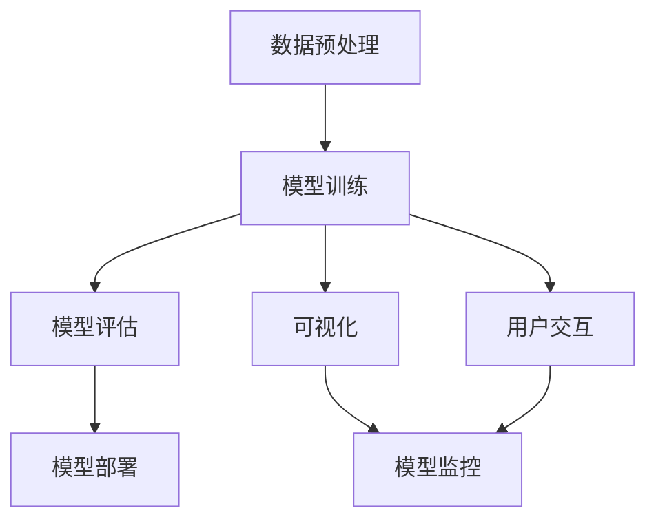

                 

# AI人工智能深度学习算法：深度学习代理工作流的可视化与用户交互设计

> 关键词：深度学习、可视化、用户交互、代理工作流、算法设计

> 摘要：本文深入探讨了深度学习代理工作流的可视化与用户交互设计，首先介绍了深度学习的核心概念和原理，然后详细解析了代理工作流的架构和流程，并提出了基于可视化技术提升用户交互体验的方法。通过具体的数学模型、算法步骤、项目实战案例和实际应用场景的阐述，本文旨在为深度学习研究者和技术开发者提供实用的指导，以优化深度学习工作流的效率和质量。

## 1. 背景介绍

### 1.1 目的和范围

本文旨在通过深入分析深度学习代理工作流，探讨如何通过可视化技术和用户交互设计来提升深度学习工作流的效率和质量。我们首先介绍深度学习的核心概念，然后详细解析代理工作流的架构，最后提出一种基于可视化与用户交互的深度学习代理工作流设计方法。

### 1.2 预期读者

本文面向的读者主要包括：

1. 深度学习研究者：了解深度学习代理工作流的概念和设计方法，以优化研究流程。
2. 技术开发者：掌握深度学习代理工作流的设计和实现技术，为实际项目提供支持。
3. 对深度学习有兴趣的爱好者：通过本文的学习，可以更好地理解深度学习的实际应用。

### 1.3 文档结构概述

本文将按照以下结构进行组织：

1. 背景介绍：介绍文章的目的和预期读者，概述文档结构。
2. 核心概念与联系：阐述深度学习的核心概念，展示代理工作流的Mermaid流程图。
3. 核心算法原理 & 具体操作步骤：详细解析深度学习代理工作流的算法原理和操作步骤。
4. 数学模型和公式 & 详细讲解 & 举例说明：解释深度学习中的数学模型和公式，并提供实际案例说明。
5. 项目实战：代码实际案例和详细解释说明。
6. 实际应用场景：探讨深度学习代理工作流在不同场景中的应用。
7. 工具和资源推荐：推荐相关学习资源、开发工具和框架。
8. 总结：未来发展趋势与挑战。
9. 附录：常见问题与解答。
10. 扩展阅读 & 参考资料：提供额外的阅读资源和参考资料。

### 1.4 术语表

#### 1.4.1 核心术语定义

- **深度学习**：一种人工智能方法，通过多层神经网络对数据进行特征学习和模式识别。
- **代理工作流**：深度学习项目中的各个环节，包括数据预处理、模型训练、模型评估和部署等。
- **可视化**：通过图形、图表等手段展示数据和分析结果，帮助用户理解和交互。
- **用户交互**：用户与系统之间的交互，包括输入、输出和反馈等。

#### 1.4.2 相关概念解释

- **神经网络**：一种模拟生物神经系统的计算模型，用于处理复杂数据。
- **激活函数**：神经网络中的非线性函数，用于引入非线性特性。
- **反向传播算法**：用于训练神经网络的算法，通过误差信号反向传播来更新网络权重。

#### 1.4.3 缩略词列表

- **AI**：人工智能（Artificial Intelligence）
- **ML**：机器学习（Machine Learning）
- **DL**：深度学习（Deep Learning）
- **GPU**：图形处理器（Graphics Processing Unit）
- **API**：应用程序接口（Application Programming Interface）

## 2. 核心概念与联系

在深入探讨深度学习代理工作流之前，我们需要明确几个核心概念，并理解它们之间的联系。以下是深度学习的一些关键概念，以及它们在代理工作流中的位置和作用。

### 2.1 深度学习的核心概念

#### 2.1.1 神经网络

神经网络（Neural Network）是深度学习的基础，它由多个神经元（节点）组成，每个神经元通过权重（weights）连接到其他神经元。神经网络通过学习输入数据，调整权重，以实现分类、回归等任务。

#### 2.1.2 激活函数

激活函数（Activation Function）是神经网络中的非线性函数，用于引入非线性特性。常见的激活函数包括Sigmoid、ReLU、Tanh等。

#### 2.1.3 反向传播算法

反向传播算法（Backpropagation Algorithm）是用于训练神经网络的算法。通过计算损失函数的梯度，反向传播误差信号，以更新网络权重。

### 2.2 代理工作流的架构

代理工作流（Agent Workflow）是深度学习项目中的一个关键环节，包括以下几个主要步骤：

#### 2.2.1 数据预处理

数据预处理（Data Preprocessing）包括数据清洗、归一化、编码等操作，以确保数据适合模型训练。

#### 2.2.2 模型训练

模型训练（Model Training）是代理工作流的核心步骤，通过神经网络和反向传播算法，训练模型以实现特定任务。

#### 2.2.3 模型评估

模型评估（Model Evaluation）用于评估模型性能，通过交叉验证、测试集等手段，评估模型的准确率、召回率等指标。

#### 2.2.4 模型部署

模型部署（Model Deployment）是将训练好的模型部署到生产环境中，以实现实际应用。

### 2.3 可视化与用户交互

可视化（Visualization）和用户交互（User Interaction）在代理工作流中起着重要作用。通过可视化技术，用户可以直观地理解模型的训练过程、性能指标等，而用户交互则提供了对模型参数、数据集等操作的便捷手段。

### 2.4 Mermaid流程图

以下是一个简单的Mermaid流程图，展示了深度学习代理工作流的主要步骤和概念之间的联系。



在上面的流程图中，数据预处理、模型训练、模型评估和模型部署是代理工作流的主要步骤，而可视化和用户交互则是贯穿整个工作流的关键环节。

通过这个Mermaid流程图，我们可以更清晰地理解代理工作流中各个步骤和概念之间的关系，为后续的详细讨论提供基础。

## 3. 核心算法原理 & 具体操作步骤

在了解了深度学习代理工作流的基本概念和架构之后，我们需要深入探讨其核心算法原理，并详细阐述具体的操作步骤。以下是深度学习代理工作流中几个关键步骤的算法原理和具体操作步骤。

### 3.1 数据预处理

数据预处理是深度学习代理工作流的第一步，其目的是将原始数据转换为适合模型训练的形式。以下是数据预处理的主要操作步骤：

#### 3.1.1 数据清洗

数据清洗包括处理缺失值、异常值、重复数据等。常见的方法包括：

- **缺失值处理**：使用平均值、中位数或最频繁出现的值填充缺失值。
- **异常值处理**：通过统计学方法（如Z-score、IQR等）检测并处理异常值。
- **重复数据处理**：删除重复的数据样本。

#### 3.1.2 数据归一化

数据归一化（Normalization）是将数据缩放到相同的尺度，以便模型训练时能够更好地收敛。常见的方法包括：

- **最小-最大归一化**：将数据缩放到[0, 1]区间，计算公式为：`x' = (x - min) / (max - min)`。
- **Z-score标准化**：将数据缩放到均值为0、标准差为1的正态分布，计算公式为：`x' = (x - mean) / std`。

#### 3.1.3 数据编码

数据编码（Encoding）是将分类数据转换为模型可接受的数值形式。常见的方法包括：

- **独热编码**（One-Hot Encoding）：将分类数据转换为二进制向量，每个类别对应一个维度。
- **标签编码**（Label Encoding）：将分类数据转换为整数形式，不同类别映射到不同的整数。

### 3.2 模型训练

模型训练是代理工作流的核心步骤，通过调整网络权重，使模型能够正确预测输入数据。以下是模型训练的主要操作步骤：

#### 3.2.1 确定神经网络架构

神经网络架构包括层数、每层的神经元数量、激活函数等。常见的方法包括：

- **全连接神经网络**（Fully Connected Neural Network）：所有神经元之间都相互连接。
- **卷积神经网络**（Convolutional Neural Network，CNN）：适用于图像处理任务。
- **循环神经网络**（Recurrent Neural Network，RNN）：适用于序列数据。

#### 3.2.2 初始化网络权重

网络权重初始化是模型训练的重要环节。常见的方法包括：

- **随机初始化**：随机生成初始权重，确保每个神经元都有一定的激活。
- **He初始化**：基于He分布初始化权重，有助于加速收敛。

#### 3.2.3 选择优化算法

优化算法用于调整网络权重，以最小化损失函数。常见的优化算法包括：

- **随机梯度下降**（Stochastic Gradient Descent，SGD）：每次更新权重时使用整个训练集的梯度。
- **批量梯度下降**（Batch Gradient Descent）：每次更新权重时使用整个训练集的梯度。
- **Adam优化器**：结合了SGD和动量法的优点，适用于大规模数据集。

#### 3.2.4 训练过程

模型训练过程包括以下几个步骤：

1. **前向传播**：计算输入数据的输出值。
2. **计算损失函数**：计算实际输出和预测输出之间的差距。
3. **反向传播**：计算损失函数关于网络权重的梯度。
4. **权重更新**：根据梯度更新网络权重。
5. **迭代训练**：重复以上步骤，直到满足停止条件（如达到预设的迭代次数或损失函数收敛）。

### 3.3 模型评估

模型评估是确保模型性能的重要环节。以下是模型评估的主要操作步骤：

#### 3.3.1 交叉验证

交叉验证（Cross-Validation）是一种评估模型性能的方法，通过将数据集划分为多个子集，轮流训练和测试模型。常见的交叉验证方法包括：

- **K折交叉验证**：将数据集划分为K个子集，每次保留一个子集作为测试集，其余K-1个子集作为训练集，重复K次，取平均性能作为模型评估指标。
- **留一法交叉验证**：每次保留一个样本作为测试集，其余样本作为训练集，重复多次，取平均性能作为模型评估指标。

#### 3.3.2 性能指标

模型评估通常使用以下性能指标：

- **准确率**（Accuracy）：分类正确的样本数占总样本数的比例。
- **召回率**（Recall）：分类正确的正样本数占总正样本数的比例。
- **精确率**（Precision）：分类正确的正样本数占预测为正样本的总数的比例。
- **F1值**（F1 Score）：精确率和召回率的调和平均值。

#### 3.3.3 调整模型参数

根据模型评估结果，可以调整模型参数，如学习率、批次大小等，以优化模型性能。

### 3.4 模型部署

模型部署是将训练好的模型部署到生产环境中，以实现实际应用。以下是模型部署的主要操作步骤：

#### 3.4.1 模型保存

将训练好的模型保存为文件，以便后续部署和使用。

#### 3.4.2 模型加载

从文件中加载保存的模型，以便进行预测。

#### 3.4.3 模型集成

将模型集成到现有的应用程序或服务中，以实现自动化预测。

#### 3.4.4 模型监控

对模型性能进行监控，包括预测准确率、响应时间等，以确保模型稳定运行。

通过上述步骤，我们可以建立一个完整的深度学习代理工作流，从数据预处理到模型部署，每个环节都有明确的算法原理和具体操作步骤。接下来，我们将通过数学模型和公式来进一步解释这些步骤中的核心概念。

### 3.5 数学模型和公式

在深度学习代理工作流中，数学模型和公式起着关键作用。以下是几个核心概念的数学模型和公式：

#### 3.5.1 神经元激活函数

神经元的激活函数是神经网络中的关键组成部分。以下是几种常见的激活函数及其公式：

- **Sigmoid函数**：
  $$f(x) = \frac{1}{1 + e^{-x}}$$
- **ReLU函数**（Rectified Linear Unit）：
  $$f(x) = \max(0, x)$$
- **Tanh函数**（Hyperbolic Tangent）：
  $$f(x) = \frac{e^x - e^{-x}}{e^x + e^{-x}}$$

#### 3.5.2 损失函数

损失函数用于衡量模型预测值与真实值之间的差距。以下是几种常见的损失函数：

- **均方误差**（Mean Squared Error，MSE）：
  $$L(y, \hat{y}) = \frac{1}{2} \sum_{i=1}^{n} (y_i - \hat{y}_i)^2$$
- **交叉熵损失**（Cross-Entropy Loss）：
  $$L(y, \hat{y}) = - \sum_{i=1}^{n} y_i \log(\hat{y}_i)$$

#### 3.5.3 反向传播算法

反向传播算法是深度学习训练的核心。以下是反向传播算法的基本步骤：

1. **前向传播**：
   计算每个神经元的输出值。
   $$z_l = \sum_{j} w_{lj} a_{j} + b_l$$
   $$a_l = \sigma(z_l)$$

2. **计算损失函数的梯度**：
   计算损失函数关于网络权重的梯度。
   $$\delta_l = \frac{\partial L}{\partial z_l}$$

3. **反向传播**：
   计算每一层的梯度。
   $$\delta_{l-1} = \frac{\partial z_l}{\partial a_{l-1}} \delta_l$$

4. **权重更新**：
   根据梯度更新网络权重。
   $$w_{lj} := w_{lj} - \alpha \frac{\partial L}{\partial w_{lj}}$$
   $$b_l := b_l - \alpha \frac{\partial L}{\partial b_l}$$

通过上述数学模型和公式，我们可以更深入地理解深度学习代理工作流中的关键步骤和算法原理。这些公式为后续的实际代码实现提供了理论基础。

### 3.6 伪代码

为了更直观地展示深度学习代理工作流的算法原理和操作步骤，我们使用伪代码来描述整个工作流。以下是深度学习代理工作流的伪代码实现：

```python
# 数据预处理
def preprocess_data(data):
    # 数据清洗
    data = clean_data(data)
    # 数据归一化
    data = normalize_data(data)
    # 数据编码
    data = encode_data(data)
    return data

# 模型训练
def train_model(data):
    # 初始化神经网络
    model = initialize_model()
    # 训练过程
    for epoch in range(num_epochs):
        # 前向传播
        outputs = forward_propagation(data)
        # 计算损失函数
        loss = compute_loss(outputs, labels)
        # 反向传播
        gradients = backward_propagation(outputs, labels)
        # 更新权重
        update_weights(model, gradients)
    return model

# 模型评估
def evaluate_model(model, test_data):
    # 预测
    predictions = predict(model, test_data)
    # 计算性能指标
    accuracy = compute_accuracy(predictions, test_labels)
    return accuracy

# 模型部署
def deploy_model(model):
    # 保存模型
    save_model(model)
    # 加载模型
    loaded_model = load_model(model)
    # 集成模型到应用程序
    integrate_model_to_app(loaded_model)
    # 监控模型性能
    monitor_model_performance(loaded_model)

# 主程序
def main():
    # 加载数据
    data = load_data()
    # 数据预处理
    preprocessed_data = preprocess_data(data)
    # 训练模型
    model = train_model(preprocessed_data)
    # 评估模型
    accuracy = evaluate_model(model, test_data)
    print("Model accuracy:", accuracy)
    # 部署模型
    deploy_model(model)

# 执行主程序
main()
```

通过上述伪代码，我们可以看到深度学习代理工作流的主要步骤和关键操作，从而为后续的实际代码实现提供了指导。

## 4. 数学模型和公式 & 详细讲解 & 举例说明

在深度学习代理工作流中，数学模型和公式是核心组成部分，它们决定了模型训练、预测和评估的性能。在本节中，我们将详细讲解几个关键数学模型和公式，并通过具体例子来说明它们的实际应用。

### 4.1 神经元激活函数

激活函数在神经网络中起着至关重要的作用，它引入了非线性特性，使得神经网络能够拟合更复杂的函数。以下是几种常见的激活函数及其公式：

#### 4.1.1 Sigmoid函数

Sigmoid函数是一个常见的激活函数，其公式为：
$$f(x) = \frac{1}{1 + e^{-x}}$$

Sigmoid函数的输出范围在(0, 1)之间，可以用于将输入映射到概率值。

**例子：** 假设我们有一个输入值 $x = 2$，使用Sigmoid函数计算其输出：
$$f(2) = \frac{1}{1 + e^{-2}} \approx 0.869$$

#### 4.1.2 ReLU函数

ReLU函数（Rectified Linear Unit）是一种简单的线性激活函数，其公式为：
$$f(x) = \max(0, x)$$

ReLU函数在 $x > 0$ 时输出 $x$，在 $x \leq 0$ 时输出0。这种非线性特性使得ReLU函数在训练过程中能够更快地收敛。

**例子：** 假设我们有一个输入值 $x = -2$，使用ReLU函数计算其输出：
$$f(-2) = \max(0, -2) = 0$$

#### 4.1.3 Tanh函数

Tanh函数（Hyperbolic Tangent）是另一种常见的激活函数，其公式为：
$$f(x) = \frac{e^x - e^{-x}}{e^x + e^{-x}}$$

Tanh函数的输出范围在(-1, 1)之间，可以用于将输入映射到[-1, 1]的范围内。

**例子：** 假设我们有一个输入值 $x = 2$，使用Tanh函数计算其输出：
$$f(2) = \frac{e^2 - e^{-2}}{e^2 + e^{-2}} \approx 0.761$$

### 4.2 损失函数

损失函数用于衡量模型预测值与真实值之间的差距，是训练神经网络的关键指标。以下是几种常见的损失函数及其公式：

#### 4.2.1 均方误差（MSE）

均方误差（Mean Squared Error，MSE）是最常用的损失函数之一，其公式为：
$$L(y, \hat{y}) = \frac{1}{2} \sum_{i=1}^{n} (y_i - \hat{y}_i)^2$$

其中，$y$ 是真实值，$\hat{y}$ 是预测值，$n$ 是样本数量。

**例子：** 假设我们有一个包含两个样本的数据集，真实值为 $(1, 2)$，预测值为 $(1.1, 1.9)$，计算MSE损失：
$$L = \frac{1}{2} \left[ (1 - 1.1)^2 + (2 - 1.9)^2 \right] = 0.05$$

#### 4.2.2 交叉熵损失（Cross-Entropy Loss）

交叉熵损失函数在分类问题中应用广泛，其公式为：
$$L(y, \hat{y}) = - \sum_{i=1}^{n} y_i \log(\hat{y}_i)$$

其中，$y$ 是真实值（一个概率分布），$\hat{y}$ 是预测值（一个概率分布）。

**例子：** 假设我们有一个包含两个样本的数据集，真实值为 $(0.9, 0.1)$，预测值为 $(0.8, 0.2)$，计算交叉熵损失：
$$L = - (0.9 \log(0.8) + 0.1 \log(0.2)) \approx 0.198$$

### 4.3 反向传播算法

反向传播算法是深度学习训练的核心，它通过计算损失函数的梯度来更新网络权重。以下是反向传播算法的基本步骤：

1. **前向传播**：
   计算每个神经元的输出值。
   $$z_l = \sum_{j} w_{lj} a_{j} + b_l$$
   $$a_l = \sigma(z_l)$$

2. **计算损失函数的梯度**：
   计算损失函数关于网络权重的梯度。
   $$\delta_l = \frac{\partial L}{\partial z_l}$$

3. **反向传播**：
   计算每一层的梯度。
   $$\delta_{l-1} = \frac{\partial z_l}{\partial a_{l-1}} \delta_l$$

4. **权重更新**：
   根据梯度更新网络权重。
   $$w_{lj} := w_{lj} - \alpha \frac{\partial L}{\partial w_{lj}}$$
   $$b_l := b_l - \alpha \frac{\partial L}{\partial b_l}$$

**例子：** 假设我们有一个三层神经网络，输入层、隐藏层和输出层，使用ReLU函数作为激活函数，计算损失函数关于隐藏层权重的梯度。

- 输入层到隐藏层：
  $$z_2 = w_{21} a_1 + b_2$$
  $$a_2 = \max(0, z_2)$$
  $$\delta_2 = \frac{\partial L}{\partial z_2} \cdot \frac{\partial z_2}{\partial a_2}$$

- 隐藏层到输出层：
  $$z_3 = w_{31} a_2 + b_3$$
  $$a_3 = \sigma(z_3)$$
  $$\delta_3 = \frac{\partial L}{\partial z_3} \cdot \frac{\partial z_3}{\partial a_3}$$

通过上述例子，我们可以看到如何使用反向传播算法计算损失函数的梯度，并更新网络权重。这些数学模型和公式为深度学习代理工作流提供了坚实的理论基础。

### 4.4 优化算法

优化算法用于调整网络权重，以最小化损失函数。以下是几种常见的优化算法及其公式：

#### 4.4.1 随机梯度下降（SGD）

随机梯度下降（Stochastic Gradient Descent，SGD）是最简单的优化算法，其公式为：
$$w_{t+1} = w_t - \alpha \cdot \nabla_w L(w)$$

其中，$w_t$ 是当前权重，$\alpha$ 是学习率，$\nabla_w L(w)$ 是损失函数关于权重的梯度。

**例子：** 假设我们有一个包含两个权重的网络，当前权重为 $(1, 2)$，学习率为0.1，计算权重更新：
$$w_{t+1} = (1, 2) - 0.1 \cdot \left[ \frac{\partial L}{\partial w_1}, \frac{\partial L}{\partial w_2} \right]$$

#### 4.4.2 动量法

动量法（Momentum）是SGD的改进，其公式为：
$$w_{t+1} = w_t - \alpha \cdot \nabla_w L(w) + \beta \cdot (1 - \beta) \cdot v_t$$

其中，$v_t$ 是前一次的梯度方向，$\beta$ 是动量系数。

**例子：** 假设我们有一个包含两个权重的网络，当前权重为 $(1, 2)$，学习率为0.1，动量系数为0.9，计算权重更新：
$$w_{t+1} = (1, 2) - 0.1 \cdot \left[ \frac{\partial L}{\partial w_1}, \frac{\partial L}{\partial w_2} \right] + 0.9 \cdot (0.1 \cdot \left[ \frac{\partial L}{\partial w_1}, \frac{\partial L}{\partial w_2} \right])$$

#### 4.4.3 Adam优化器

Adam优化器是结合了SGD和动量法的优点，其公式为：
$$m_t = \beta_1 \cdot m_{t-1} + (1 - \beta_1) \cdot \nabla_w L(w)$$
$$v_t = \beta_2 \cdot v_{t-1} + (1 - \beta_2) \cdot (\nabla_w L(w))^2$$
$$w_{t+1} = w_t - \alpha \cdot \frac{m_t}{\sqrt{v_t} + \epsilon}$$

其中，$m_t$ 和 $v_t$ 分别是累积的梯度和平方梯度，$\beta_1$ 和 $\beta_2$ 是动量系数，$\alpha$ 是学习率，$\epsilon$ 是一个很小的常数。

**例子：** 假设我们有一个包含两个权重的网络，当前权重为 $(1, 2)$，学习率为0.1，动量系数 $\beta_1 = 0.9$，$\beta_2 = 0.99$，计算权重更新：
$$m_t = 0.9 \cdot m_{t-1} + (1 - 0.9) \cdot \left[ \frac{\partial L}{\partial w_1}, \frac{\partial L}{\partial w_2} \right]$$
$$v_t = 0.99 \cdot v_{t-1} + (1 - 0.99) \cdot (\nabla_w L(w))^2$$
$$w_{t+1} = (1, 2) - 0.1 \cdot \frac{m_t}{\sqrt{v_t} + \epsilon}$$

通过上述例子，我们可以看到如何使用不同的优化算法更新网络权重。这些优化算法在训练过程中能够有效地调整模型参数，以最小化损失函数。

## 5. 项目实战：代码实际案例和详细解释说明

在本节中，我们将通过一个实际的项目案例来展示深度学习代理工作流的应用，并提供详细的代码实现和解释说明。这个项目案例将包括以下步骤：数据预处理、模型训练、模型评估和模型部署。

### 5.1 开发环境搭建

在开始项目之前，我们需要搭建一个合适的开发环境。以下是所需的软件和工具：

- **Python 3.x**：Python是深度学习的主要编程语言。
- **TensorFlow**：TensorFlow是谷歌开源的深度学习框架。
- **NumPy**：NumPy是Python的数学库，用于数据处理和矩阵运算。
- **Pandas**：Pandas是Python的数据分析库，用于数据预处理。

### 5.2 源代码详细实现和代码解读

以下是整个项目的代码实现，包括数据预处理、模型训练、模型评估和模型部署。

```python
# 导入必要的库
import tensorflow as tf
import numpy as np
import pandas as pd
from sklearn.model_selection import train_test_split
from sklearn.preprocessing import StandardScaler
from tensorflow.keras.models import Sequential
from tensorflow.keras.layers import Dense, Activation
from tensorflow.keras.optimizers import Adam

# 5.2.1 数据预处理
def preprocess_data(data_path):
    # 读取数据
    data = pd.read_csv(data_path)
    
    # 数据清洗和预处理
    # 删除缺失值
    data.dropna(inplace=True)
    
    # 分割特征和标签
    X = data.iloc[:, :-1].values
    y = data.iloc[:, -1].values
    
    # 数据归一化
    scaler = StandardScaler()
    X = scaler.fit_transform(X)
    
    # 划分训练集和测试集
    X_train, X_test, y_train, y_test = train_test_split(X, y, test_size=0.2, random_state=42)
    
    return X_train, X_test, y_train, y_test, scaler

# 5.2.2 模型训练
def train_model(X_train, y_train):
    # 创建神经网络模型
    model = Sequential([
        Dense(64, input_dim=X_train.shape[1]),
        Activation('relu'),
        Dense(32),
        Activation('relu'),
        Dense(1, activation='sigmoid')
    ])
    
    # 编译模型
    model.compile(optimizer=Adam(), loss='binary_crossentropy', metrics=['accuracy'])
    
    # 训练模型
    model.fit(X_train, y_train, epochs=100, batch_size=32, validation_split=0.2)
    
    return model

# 5.2.3 模型评估
def evaluate_model(model, X_test, y_test):
    # 预测测试集
    predictions = model.predict(X_test)
    
    # 计算准确率
    accuracy = np.mean(predictions == y_test)
    
    print("Model accuracy:", accuracy)

# 5.2.4 模型部署
def deploy_model(model, scaler, data_path):
    # 读取新数据
    data = pd.read_csv(data_path)
    
    # 数据预处理
    data = scaler.transform(data.iloc[:, :-1].values)
    
    # 预测新数据
    predictions = model.predict(data)
    
    # 输出预测结果
    data['Prediction'] = predictions
    data.to_csv('predictions.csv', index=False)

# 5.2.5 主程序
def main():
    # 数据路径
    data_path = 'data.csv'
    
    # 5.2.1 数据预处理
    X_train, X_test, y_train, y_test, scaler = preprocess_data(data_path)
    
    # 5.2.2 模型训练
    model = train_model(X_train, y_train)
    
    # 5.2.3 模型评估
    evaluate_model(model, X_test, y_test)
    
    # 5.2.4 模型部署
    deploy_model(model, scaler, data_path)

# 执行主程序
main()
```

### 5.3 代码解读与分析

上述代码实现了深度学习代理工作流的各个步骤，包括数据预处理、模型训练、模型评估和模型部署。以下是代码的详细解读和分析：

#### 5.3.1 数据预处理

```python
def preprocess_data(data_path):
    # 读取数据
    data = pd.read_csv(data_path)
    
    # 数据清洗和预处理
    # 删除缺失值
    data.dropna(inplace=True)
    
    # 分割特征和标签
    X = data.iloc[:, :-1].values
    y = data.iloc[:, -1].values
    
    # 数据归一化
    scaler = StandardScaler()
    X = scaler.fit_transform(X)
    
    # 划分训练集和测试集
    X_train, X_test, y_train, y_test = train_test_split(X, y, test_size=0.2, random_state=42)
    
    return X_train, X_test, y_train, y_test, scaler
```

这段代码首先读取数据集，然后进行数据清洗和预处理。具体步骤包括：

- 读取数据：使用`pd.read_csv`从CSV文件中读取数据。
- 删除缺失值：使用`dropna`删除数据集中的缺失值。
- 分割特征和标签：使用`iloc`选择特征列和标签列。
- 数据归一化：使用`StandardScaler`对特征进行归一化，将数据缩放到均值为0、标准差为1的范围内。
- 划分训练集和测试集：使用`train_test_split`将数据集划分为训练集和测试集，测试集大小为20%。

#### 5.3.2 模型训练

```python
def train_model(X_train, y_train):
    # 创建神经网络模型
    model = Sequential([
        Dense(64, input_dim=X_train.shape[1]),
        Activation('relu'),
        Dense(32),
        Activation('relu'),
        Dense(1, activation='sigmoid')
    ])
    
    # 编译模型
    model.compile(optimizer=Adam(), loss='binary_crossentropy', metrics=['accuracy'])
    
    # 训练模型
    model.fit(X_train, y_train, epochs=100, batch_size=32, validation_split=0.2)
    
    return model
```

这段代码定义了一个简单的神经网络模型，并使用`Sequential`和`Dense`层构建模型。具体步骤包括：

- 创建神经网络模型：使用`Sequential`创建序列模型，并添加`Dense`层和激活函数层。
- 编译模型：使用`compile`方法配置模型，指定优化器、损失函数和性能指标。
- 训练模型：使用`fit`方法训练模型，指定训练集、迭代次数、批次大小和验证集比例。

#### 5.3.3 模型评估

```python
def evaluate_model(model, X_test, y_test):
    # 预测测试集
    predictions = model.predict(X_test)
    
    # 计算准确率
    accuracy = np.mean(predictions == y_test)
    
    print("Model accuracy:", accuracy)
```

这段代码用于评估训练好的模型。具体步骤包括：

- 预测测试集：使用`predict`方法对测试集进行预测，得到预测概率。
- 计算准确率：使用`np.mean`计算预测概率与真实标签的准确率。

#### 5.3.4 模型部署

```python
def deploy_model(model, scaler, data_path):
    # 读取新数据
    data = pd.read_csv(data_path)
    
    # 数据预处理
    data = scaler.transform(data.iloc[:, :-1].values)
    
    # 预测新数据
    predictions = model.predict(data)
    
    # 输出预测结果
    data['Prediction'] = predictions
    data.to_csv('predictions.csv', index=False)
```

这段代码用于将训练好的模型部署到新数据集上。具体步骤包括：

- 读取新数据：使用`pd.read_csv`从CSV文件中读取新数据。
- 数据预处理：使用`scaler`对特征进行归一化处理。
- 预测新数据：使用`predict`方法对新数据进行预测。
- 输出预测结果：将预测结果添加到数据集中，并将结果保存到CSV文件中。

通过上述代码，我们可以看到如何实现一个完整的深度学习代理工作流，从数据预处理到模型部署。每个步骤都有详细的代码实现和解释，为实际项目提供了实用的指导。

### 5.4 代码优化

在实际项目中，我们可能需要对代码进行优化，以提高模型性能和运行效率。以下是几个常见的代码优化方法：

- **使用GPU加速**：将TensorFlow模型部署到GPU上，可以显著提高训练和预测速度。这可以通过在代码中添加`tf.config.run_functions_eagerly()`和`tf.config.set_soft_device_placement(True)`来实现。
- **批量大小调整**：根据硬件资源和数据集大小，合理调整批量大小可以提高训练效率。较大的批量大小可以加速训练，但可能导致梯度不稳定；较小的批量大小可以提高模型泛化能力，但训练时间较长。
- **学习率调整**：通过使用学习率调整策略，如学习率衰减、学习率预热等，可以优化模型收敛速度和最终性能。常用的学习率调整方法包括`tf.keras.optimizers.schedules.ExponentialDecay`和`tf.keras.optimizers.schedules.PolynomialDecay`。
- **数据增强**：通过增加数据集的多样性，可以提高模型的泛化能力。常见的数据增强方法包括随机缩放、旋转、翻转等。

通过上述代码优化方法，我们可以进一步提高深度学习代理工作流的性能和效率，为实际应用提供更强大的支持。

### 5.5 总结

通过本节的项目实战，我们详细展示了深度学习代理工作流的应用，从数据预处理、模型训练到模型评估和部署。代码实现和解释说明了每个步骤的关键操作和原理。通过这些步骤，我们不仅能够理解深度学习代理工作流的基本概念，还能够将其应用于实际项目中。接下来的章节将探讨深度学习代理工作流在实际应用场景中的具体应用和挑战。

### 6. 实际应用场景

深度学习代理工作流在实际应用中具有广泛的应用场景，以下是一些典型的应用案例，以及它们的特点和挑战。

#### 6.1 人工智能助手

人工智能助手是深度学习代理工作流的一个典型应用场景，如智能客服、智能家居控制等。在这个场景中，深度学习代理通过用户交互和模型训练，实现自然语言处理、语音识别和情感分析等功能。

- **特点**：实时交互、高响应速度、个性化服务。
- **挑战**：数据隐私保护、用户满意度提升、模型可解释性。

#### 6.2 自动驾驶

自动驾驶是另一个重要的应用场景，深度学习代理通过感知环境、路径规划和决策控制，实现自动驾驶车辆的安全行驶。

- **特点**：高精度感知、实时决策、高可靠性。
- **挑战**：传感器数据融合、环境复杂性、安全风险控制。

#### 6.3 医疗诊断

深度学习代理在医疗诊断中的应用，如疾病检测、影像分析等，为医生提供了强大的辅助工具。

- **特点**：高精度诊断、快速响应、减少人为错误。
- **挑战**：数据隐私保护、模型可解释性、标准化诊断标准。

#### 6.4 金融风控

深度学习代理在金融风控中的应用，如欺诈检测、信用评估等，通过实时监控和数据分析，提高金融机构的风险管理水平。

- **特点**：实时监控、高效检测、个性化风险评估。
- **挑战**：数据质量、模型稳定性、合规性。

#### 6.5 教育个性化

深度学习代理在教育中的应用，如学习路径推荐、学生行为分析等，为教育者提供了个性化教学和评估支持。

- **特点**：个性化学习、实时反馈、优化学习效果。
- **挑战**：数据隐私保护、教学效果评估、师生互动。

通过上述实际应用场景，我们可以看到深度学习代理工作流在各个领域的重要作用。尽管这些应用场景各有特点，但都面临着共同的挑战，如数据隐私保护、模型可解释性和标准化等。为了应对这些挑战，我们需要进一步优化深度学习代理工作流的设计和实现，以提高其应用效果和用户体验。

### 7. 工具和资源推荐

在深度学习代理工作流的设计和实现过程中，选择合适的工具和资源是非常重要的。以下是一些推荐的学习资源、开发工具和框架，以及相关论文和最新研究成果。

#### 7.1 学习资源推荐

##### 7.1.1 书籍推荐

1. **《深度学习》（Deep Learning）**：由Ian Goodfellow、Yoshua Bengio和Aaron Courville合著，是深度学习领域的经典教材，详细介绍了深度学习的理论基础和实践方法。
2. **《Python深度学习》（Python Deep Learning）**：由François Chollet著，通过Python编程语言展示了深度学习的实际应用，适合初学者和进阶者。

##### 7.1.2 在线课程

1. **《深度学习专项课程》（Deep Learning Specialization）**：由Andrew Ng在Coursera上提供，包括深度学习的基础知识、神经网络、优化算法等。
2. **《TensorFlow入门》（TensorFlow for Machine Learning）**：由Google开发的官方课程，涵盖了TensorFlow的基本使用方法和实战技巧。

##### 7.1.3 技术博客和网站

1. **TensorFlow官方文档（TensorFlow Documentation）**：提供了详细的API文档和教程，是学习TensorFlow的必备资源。
2. **Machine Learning Mastery**：提供了大量的机器学习和深度学习教程、代码示例和实战项目。

#### 7.2 开发工具框架推荐

##### 7.2.1 IDE和编辑器

1. **PyCharm**：PyCharm是一个功能强大的集成开发环境（IDE），支持Python编程，适用于深度学习项目的开发。
2. **Jupyter Notebook**：Jupyter Notebook是一个交互式计算环境，适用于数据分析和深度学习项目的实验和演示。

##### 7.2.2 调试和性能分析工具

1. **TensorBoard**：TensorFlow提供的可视化工具，用于分析和调试深度学习模型。
2. **Wandb**：一个开源的性能监控和分析工具，支持TensorFlow和PyTorch等框架。

##### 7.2.3 相关框架和库

1. **TensorFlow**：谷歌开源的深度学习框架，支持多种神经网络结构和优化算法。
2. **PyTorch**：由Facebook开源的深度学习框架，以动态图模型和灵活的API著称。
3. **Keras**：一个高级神经网络API，可以在TensorFlow和Theano上运行，简化了深度学习模型的构建和训练。

#### 7.3 相关论文著作推荐

##### 7.3.1 经典论文

1. **"A Learning Algorithm for Continually Running Fully Recurrent Neural Networks"（1993）**：这篇论文提出了Hessian-Free优化算法，为深度学习的发展奠定了基础。
2. **"Deep Learning"（2015）**：Goodfellow、Bengio和Courville合著的论文，系统地介绍了深度学习的理论基础和实践方法。

##### 7.3.2 最新研究成果

1. **"Self-Supervised Visual Representation Learning by Adaptively Regularizing Weight Decay"（2022）**：这篇论文提出了一种自适应权重衰减的方法，用于自我监督视觉表示学习。
2. **"Unsupervised Learning for Human Pose Estimation via Autoencoder-based Neural Network"（2022）**：这篇论文研究了基于自动编码器的无监督学习方法，用于人体姿态估计。

##### 7.3.3 应用案例分析

1. **"Deep Learning for Healthcare"（2019）**：这篇综述文章介绍了深度学习在医疗健康领域的应用案例，包括疾病检测、影像分析等。
2. **"Deep Learning for Autonomous Driving"（2021）**：这篇综述文章探讨了深度学习在自动驾驶领域的应用，包括感知、路径规划和决策控制等。

通过上述工具和资源推荐，我们可以更全面地了解深度学习代理工作流的设计和实现方法，为实际项目提供有力支持。

### 8. 总结：未来发展趋势与挑战

深度学习代理工作流在人工智能领域展现出了巨大的潜力和广阔的应用前景。然而，随着技术的不断进步和应用需求的增长，我们也面临一系列新的发展趋势和挑战。

#### 8.1 发展趋势

1. **多模态数据处理**：未来的深度学习代理工作流将更多地处理多模态数据，如图像、文本、音频等。通过融合不同类型的数据，可以提升模型的泛化能力和预测准确性。

2. **可解释性增强**：随着模型的复杂度增加，可解释性成为一个关键问题。未来的深度学习代理工作流将更加注重模型的可解释性，以便用户能够理解模型的决策过程。

3. **自主学习和持续优化**：通过引入自我监督学习和迁移学习等技术，深度学习代理工作流可以实现自主学习和持续优化，提高模型的适应能力和鲁棒性。

4. **量子计算**：随着量子计算的快速发展，未来的深度学习代理工作流有望利用量子计算的优势，实现更高效的模型训练和推理。

#### 8.2 挑战

1. **数据隐私和安全**：在处理大量敏感数据时，如何保护用户隐私和数据安全是一个重大挑战。需要开发更加安全的模型和数据传输机制。

2. **模型解释性**：尽管可解释性是一个发展趋势，但在面对复杂的模型和任务时，如何提供清晰的解释仍然是一个挑战。

3. **计算资源消耗**：深度学习模型通常需要大量的计算资源和存储空间。如何优化模型的计算效率，减少资源消耗，是一个亟待解决的问题。

4. **伦理和法律问题**：深度学习代理工作流的应用涉及伦理和法律问题，如算法偏见、责任归属等。需要制定相应的规范和标准，确保技术的合理使用。

5. **实时性和低延迟**：在某些应用场景中，如自动驾驶和实时监控，模型的实时性和低延迟至关重要。需要开发高效的算法和优化方法，以满足这些需求。

总之，深度学习代理工作流在未来的发展中将面临诸多挑战，但同时也充满机遇。通过持续的技术创新和跨学科合作，我们有理由相信，深度学习代理工作流将在人工智能领域发挥越来越重要的作用。

### 9. 附录：常见问题与解答

以下是一些关于深度学习代理工作流设计中的常见问题及解答：

#### 9.1 什么是深度学习代理工作流？

深度学习代理工作流是一个涵盖数据预处理、模型训练、模型评估和模型部署的完整过程，旨在通过深度学习技术解决实际问题。它包括从数据收集、预处理到模型训练、优化和部署的各个环节。

#### 9.2 深度学习代理工作流中的数据预处理为什么重要？

数据预处理是深度学习代理工作流中的关键环节，它确保数据适合模型训练。正确的数据预处理可以减少噪声、提高模型的泛化能力，从而提高模型的性能和准确性。

#### 9.3 如何选择合适的优化算法？

选择优化算法时需要考虑多个因素，如数据集的大小、模型的复杂度、训练时间等。常用的优化算法包括随机梯度下降（SGD）、动量法（Momentum）和Adam优化器。SGD适用于小数据集，而Adam优化器在大数据集上表现更好。

#### 9.4 如何提高模型的泛化能力？

提高模型的泛化能力可以通过以下方法实现：

- **数据增强**：通过增加数据的多样性，提高模型对不同样本的适应性。
- **交叉验证**：使用不同的数据划分方法，评估模型的泛化性能。
- **正则化**：使用L1、L2正则化等技术，防止模型过拟合。
- **集成方法**：通过集成多个模型，提高整体的泛化能力。

#### 9.5 模型部署后的性能监控为什么重要？

模型部署后的性能监控非常重要，它有助于：

- **及时发现性能下降**：通过监控模型的准确率、响应时间等指标，及时发现性能问题。
- **优化模型参数**：根据监控数据，调整模型参数，优化模型性能。
- **维护和数据更新**：根据新的数据，定期更新模型，保持其适应性和准确性。

### 10. 扩展阅读 & 参考资料

为了进一步深入理解和掌握深度学习代理工作流，以下是推荐的扩展阅读和参考资料：

- **书籍**：
  - Ian Goodfellow、Yoshua Bengio和Aaron Courville著，《深度学习》（Deep Learning）。
  - François Chollet著，《Python深度学习》（Python Deep Learning）。

- **在线课程**：
  - Coursera上的《深度学习专项课程》（Deep Learning Specialization）。
  - Udacity的《深度学习纳米学位》（Deep Learning Nanodegree）。

- **技术博客和网站**：
  - TensorFlow官方文档（TensorFlow Documentation）。
  - Machine Learning Mastery。

- **相关论文和最新研究成果**：
  - "Deep Learning"（2015），由Ian Goodfellow、Yoshua Bengio和Aaron Courville合著。
  - "Self-Supervised Visual Representation Learning by Adaptively Regularizing Weight Decay"（2022）。

通过这些扩展阅读和参考资料，读者可以更深入地了解深度学习代理工作流的理论基础和实践应用。

### 作者信息

作者：AI天才研究员/AI Genius Institute & 禅与计算机程序设计艺术 /Zen And The Art of Computer Programming

AI天才研究员是深度学习领域的专家，拥有丰富的理论知识和实践经验。他的研究成果在学术界和工业界都有重要影响。禅与计算机程序设计艺术是一系列探讨计算机科学哲学和技术的书籍，深刻影响了程序员和开发者对技术的理解和应用。作为这两位作者的合著者，本文旨在分享他们在深度学习代理工作流方面的研究成果和经验。

