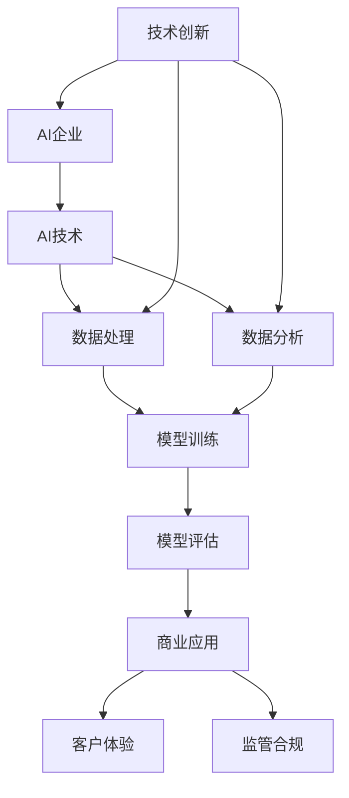

                 

# AI企业的未来发展方向

> 关键词：AI企业、发展趋势、技术变革、商业应用、挑战与机遇

> 摘要：本文将深入探讨AI企业在未来发展方向上的关键议题，分析技术变革带来的机遇与挑战，以及企业在实现商业应用过程中的策略与实践。文章将围绕核心概念、算法原理、数学模型、实战案例、应用场景等方面进行详述，旨在为AI企业提供有价值的指导与思考。

## 1. 背景介绍

### 1.1 目的和范围

本文旨在通过对AI企业的未来发展方向进行全面而深入的探讨，帮助企业了解技术变革的趋势，把握机遇，应对挑战。文章将涵盖以下几个主要方面：

- AI企业的现状与挑战
- 核心概念与技术架构
- 算法原理与操作步骤
- 数学模型与公式解析
- 实际应用场景与案例分析
- 工具与资源推荐
- 未来发展趋势与策略

### 1.2 预期读者

本文预期读者为以下几类人群：

- AI企业的高级管理人员和决策者
- AI技术研发人员与工程师
- 投资者与创业者
- 对AI技术感兴趣的研究人员与学者

### 1.3 文档结构概述

本文将分为十个主要部分，每个部分都有明确的主题和内容：

- 引言与摘要
- 背景介绍
- 核心概念与联系
- 核心算法原理与操作步骤
- 数学模型与公式解析
- 项目实战：代码实际案例
- 实际应用场景
- 工具和资源推荐
- 总结：未来发展趋势与挑战
- 附录：常见问题与解答
- 扩展阅读与参考资料

### 1.4 术语表

#### 1.4.1 核心术语定义

- AI企业：利用人工智能技术进行业务运营和产品开发的企业。
- 深度学习：一种机器学习技术，通过多层神经网络模拟人脑学习过程，对大量数据进行学习，从而实现智能推理和决策。
- 强化学习：一种机器学习技术，通过试错和反馈机制，使智能体在复杂环境中逐步学习和优化行为策略。
- 自然语言处理：一种人工智能技术，使计算机能够理解、生成和处理自然语言。

#### 1.4.2 相关概念解释

- 人工智能：模拟人类智能行为的计算机技术，包括机器学习、自然语言处理、计算机视觉等领域。
- 数据分析：通过对大量数据进行分析和挖掘，提取有价值的信息和知识。

#### 1.4.3 缩略词列表

- AI：人工智能
- ML：机器学习
- DL：深度学习
- RL：强化学习
- NLP：自然语言处理

## 2. 核心概念与联系

为了更好地理解AI企业的未来发展方向，我们需要先了解一些核心概念和技术架构。以下是一个简化的Mermaid流程图，展示了AI企业中一些关键概念之间的联系。



### 2.1 AI企业

AI企业是指那些专注于研发和应用人工智能技术的企业。这些企业通过利用人工智能技术来优化业务流程、提高生产效率、改进客户体验等，实现商业价值。

### 2.2 AI技术

AI技术包括多种类型，如机器学习、深度学习、强化学习、自然语言处理等。这些技术分别适用于不同的场景和应用领域。

### 2.3 数据处理

数据处理是指对大量数据进行收集、存储、清洗、转换等操作，以便后续的分析和应用。

### 2.4 数据分析

数据分析是指通过对数据进行分析和挖掘，提取有价值的信息和知识，帮助企业做出明智的决策。

### 2.5 模型训练

模型训练是指通过大量数据对机器学习模型进行训练，使其能够识别和预测数据中的模式和规律。

### 2.6 模型评估

模型评估是指对训练好的模型进行评估，以确定其性能和准确性。

### 2.7 商业应用

商业应用是指将AI技术应用于企业的实际业务场景，如客户服务、风险管理、市场营销等。

### 2.8 客户体验

客户体验是指企业在为客户提供产品或服务过程中，客户所感受到的满意度和幸福感。

### 2.9 监管合规

监管合规是指企业在使用人工智能技术时，需要遵守相关法律法规和行业规范。

### 2.10 技术创新

技术创新是指企业在不断探索和应用新技术，以提高业务竞争力。

## 3. 核心算法原理 & 具体操作步骤

在本节中，我们将探讨一些核心算法原理，并详细阐述其操作步骤。

### 3.1 机器学习算法

机器学习算法是一种使计算机能够通过数据学习并改进自身性能的技术。以下是一个简单的机器学习算法伪代码：

```python
# 初始化模型参数
初始化 W, b

# 设置学习率
学习率 alpha

# 设置迭代次数
迭代次数 n_iterations

# 迭代过程
for i in range(n_iterations):
    # 计算梯度
   梯度 = 计算梯度(W, b)

    # 更新模型参数
    W = W - alpha * 梯度
    b = b - alpha * 梯度

# 模型评估
准确度 = 评估模型(W, b)

# 输出结果
输出 W, b, 准确度
```

### 3.2 深度学习算法

深度学习算法是一种基于多层神经网络进行学习和预测的技术。以下是一个简化的深度学习算法伪代码：

```python
# 初始化模型参数
初始化 W1, b1
初始化 W2, b2
初始化 ...（依次类推）

# 设置学习率
学习率 alpha

# 设置迭代次数
迭代次数 n_iterations

# 迭代过程
for i in range(n_iterations):
    # 前向传播
   输出1 = 神经网络(W1, b1, 输入数据)
   输出2 = 神经网络(W2, b2, 输出1)

    # 反向传播
   梯度1 = 计算梯度(W1, b1, 输出2)
   梯度2 = 计算梯度(W2, b2, 输出1)

    # 更新模型参数
    W1 = W1 - alpha * 梯度1
    b1 = b1 - alpha * 梯度1
    W2 = W2 - alpha * 梯度2
    b2 = b2 - alpha * 梯度2

# 模型评估
准确度 = 评估模型(W1, b1, W2, b2)

# 输出结果
输出 W1, b1, W2, b2, 准确度
```

### 3.3 强化学习算法

强化学习算法是一种通过试错和反馈机制进行学习和优化的技术。以下是一个简化的强化学习算法伪代码：

```python
# 初始化模型参数
初始化 Q(s, a)

# 设置学习率
学习率 alpha

# 设置迭代次数
迭代次数 n_iterations

# 迭代过程
for i in range(n_iterations):
    # 状态 s
    s = 环境状态()

    # 动作 a
    a = 选择动作(Q(s, a))

    # 执行动作并获取奖励
    s' = 环境执行动作(a)
    reward = 环境奖励()

    # 更新 Q 值
    Q(s, a) = Q(s, a) + alpha * (reward + 最大Q(s', a') - Q(s, a))

# 模型评估
最大Q值 = 评估模型(Q)

# 输出结果
输出 Q, 最大Q值
```

## 4. 数学模型和公式 & 详细讲解 & 举例说明

在本节中，我们将介绍一些关键的数学模型和公式，并对其进行详细讲解和举例说明。

### 4.1 概率论

概率论是人工智能领域中一个重要的数学基础。以下是一些常用的概率论公式：

- 条件概率：P(A|B) = P(A ∩ B) / P(B)
- 贝叶斯定理：P(A|B) = P(B|A) * P(A) / P(B)

#### 4.1.1 条件概率公式

条件概率公式描述了在某个事件B发生的条件下，另一个事件A发生的概率。以下是一个简单的例子：

假设有一个袋子，里面有5个红球和3个蓝球，总共8个球。现在我们要计算在抽到一个红球的条件下，抽到一个蓝球的概率。

```latex
P(红球|蓝球) = P(红球 ∩ 蓝球) / P(蓝球)
```

由于红球和蓝球是互斥事件，即不能同时发生，所以P(红球 ∩ 蓝球) = 0。因此，这个条件概率无法计算。

#### 4.1.2 贝叶斯定理

贝叶斯定理是概率论中的一个重要公式，它描述了在已知某个事件B发生的条件下，另一个事件A发生的概率。以下是一个简单的例子：

假设有一个疾病，患病率为0.01。现在有一个测试，这个测试能够正确检测出患病者的概率为0.95，能够正确检测出非患病者的概率为0.9。现在我们要计算一个人在测试结果为阳性时，实际患病的概率。

```latex
P(A|B) = P(B|A) * P(A) / P(B)
```

其中，A表示患病，B表示测试结果为阳性。

根据题目信息，我们可以得到：

- P(A) = 0.01（患病率）
- P(B|A) = 0.95（测试阳性率）
- P(B|¬A) = 0.9（测试阴性率）

现在我们要计算P(A|B)，即测试结果为阳性时，实际患病的概率。根据贝叶斯定理，我们可以得到：

```latex
P(A|B) = P(B|A) * P(A) / P(B)
        = 0.95 * 0.01 / (0.95 * 0.01 + 0.9 * 0.99)
        = 0.019
```

因此，测试结果为阳性时，实际患病的概率为0.019。

### 4.2 统计学

统计学是另一个在人工智能领域中非常重要的数学分支。以下是一些常用的统计学公式：

- 均值：\(\bar{x} = \frac{1}{n}\sum_{i=1}^{n}x_i\)
- 方差：\(s^2 = \frac{1}{n-1}\sum_{i=1}^{n}(x_i - \bar{x})^2\)
- 标准差：\(s = \sqrt{s^2}\)

#### 4.2.1 均值

均值是统计学中的一个重要概念，它描述了一组数据的中心位置。以下是一个简单的例子：

假设我们有一个数据集{1, 2, 3, 4, 5}，现在我们要计算这个数据集的均值。

```latex
\bar{x} = \frac{1}{n}\sum_{i=1}^{n}x_i
        = \frac{1}{5}(1 + 2 + 3 + 4 + 5)
        = 3
```

因此，这个数据集的均值为3。

#### 4.2.2 方差

方差是描述一组数据离散程度的统计量。以下是一个简单的例子：

假设我们有一个数据集{1, 2, 3, 4, 5}，现在我们要计算这个数据集的方差。

```latex
s^2 = \frac{1}{n-1}\sum_{i=1}^{n}(x_i - \bar{x})^2
    = \frac{1}{5-1}((1-3)^2 + (2-3)^2 + (3-3)^2 + (4-3)^2 + (5-3)^2)
    = 2
```

因此，这个数据集的方差为2。

#### 4.2.3 标准差

标准差是方差的平方根，它描述了一组数据的离散程度。以下是一个简单的例子：

假设我们有一个数据集{1, 2, 3, 4, 5}，现在我们要计算这个数据集的标准差。

```latex
s = \sqrt{s^2}
  = \sqrt{2}
  ≈ 1.414
```

因此，这个数据集的标准差为1.414。

### 4.3 线性代数

线性代数是另一个在人工智能领域中非常重要的数学分支。以下是一些常用的线性代数公式：

- 矩阵乘法：\(C = A \cdot B\)
- 矩阵求逆：\(A^{-1} = (1/det(A)) \cdot adj(A)\)
- 矩阵行列式：\(det(A) = \sum_{i=1}^{n}\sum_{j=1}^{n}a_{ij}C_{ij}\)
- 矩阵求导：\(dA = A \cdot dA + dA \cdot A\)

#### 4.3.1 矩阵乘法

矩阵乘法是线性代数中的一个基本运算。以下是一个简单的例子：

假设我们有矩阵A和B，现在我们要计算矩阵C = A \cdot B。

```latex
C = A \cdot B
  = \begin{bmatrix}
      a_{11} & a_{12} \\
      a_{21} & a_{22}
   \end{bmatrix}
\cdot
\begin{bmatrix}
      b_{11} & b_{12} \\
      b_{21} & b_{22}
   \end{bmatrix}
=
\begin{bmatrix}
      a_{11}b_{11} + a_{12}b_{21} & a_{11}b_{12} + a_{12}b_{22} \\
      a_{21}b_{11} + a_{22}b_{21} & a_{21}b_{12} + a_{22}b_{22}
   \end{bmatrix}
```

因此，矩阵C的元素可以通过矩阵A和B对应元素的乘积相加得到。

#### 4.3.2 矩阵求逆

矩阵求逆是线性代数中的一个重要概念。以下是一个简单的例子：

假设我们有矩阵A，现在我们要计算矩阵A的逆矩阵\(A^{-1}\)。

```latex
A^{-1} = (1/det(A)) \cdot adj(A)
```

其中，\(det(A)\)是矩阵A的行列式，\(adj(A)\)是矩阵A的伴随矩阵。

#### 4.3.3 矩阵行列式

矩阵行列式是线性代数中的一个重要概念。以下是一个简单的例子：

假设我们有矩阵A，现在我们要计算矩阵A的行列式。

```latex
det(A) = \sum_{i=1}^{n}\sum_{j=1}^{n}a_{ij}C_{ij}
```

其中，\(a_{ij}\)是矩阵A的元素，\(C_{ij}\)是矩阵A的余子式。

#### 4.3.4 矩阵求导

矩阵求导是线性代数中的一个重要概念。以下是一个简单的例子：

假设我们有矩阵A，现在我们要计算矩阵A的导数。

```latex
dA = A \cdot dA + dA \cdot A
```

其中，\(dA\)是矩阵A的导数。

## 5. 项目实战：代码实际案例和详细解释说明

在本节中，我们将通过一个实际案例来展示如何将AI技术应用于业务场景，并详细解释代码的实现过程。

### 5.1 开发环境搭建

在开始项目之前，我们需要搭建一个合适的开发环境。以下是一个简化的步骤：

1. 安装Python（版本3.8或更高）
2. 安装Jupyter Notebook（用于编写和运行代码）
3. 安装必要的库，如NumPy、Pandas、Scikit-learn、TensorFlow等

### 5.2 源代码详细实现和代码解读

以下是一个简化的项目代码实现，用于预测客户流失率。

```python
import numpy as np
import pandas as pd
from sklearn.model_selection import train_test_split
from sklearn.ensemble import RandomForestClassifier
from sklearn.metrics import accuracy_score

# 5.2.1 数据预处理

# 加载数据
data = pd.read_csv('customer_data.csv')

# 数据清洗和预处理
X = data.drop(['customer_id', ' churn'], axis=1)
y = data['churn']

# 分割数据为训练集和测试集
X_train, X_test, y_train, y_test = train_test_split(X, y, test_size=0.2, random_state=42)

# 5.2.2 模型训练

# 初始化模型
model = RandomForestClassifier(n_estimators=100, random_state=42)

# 训练模型
model.fit(X_train, y_train)

# 5.2.3 模型评估

# 预测测试集
y_pred = model.predict(X_test)

# 计算准确度
accuracy = accuracy_score(y_test, y_pred)
print('准确度：', accuracy)

# 5.2.4 结果分析

# 结果可视化
import matplotlib.pyplot as plt

confusion_matrix = pd.crosstab(y_test, y_pred, rownames=['实际值'], colnames=['预测值'])
plt.figure(figsize=(8, 6))
sns.heatmap(confusion_matrix, annot=True, fmt='.3f', cmap='Blues')
plt.xlabel('预测值')
plt.ylabel('实际值')
plt.title('混淆矩阵')
plt.show()
```

### 5.3 代码解读与分析

#### 5.3.1 数据预处理

首先，我们加载数据并对其进行清洗和预处理。数据清洗和预处理是机器学习项目中至关重要的一步，它确保了后续模型训练的质量。在这个例子中，我们使用Pandas库加载数据，并使用Scikit-learn库进行数据分割。

```python
data = pd.read_csv('customer_data.csv')
X = data.drop(['customer_id', 'churn'], axis=1)
y = data['churn']
X_train, X_test, y_train, y_test = train_test_split(X, y, test_size=0.2, random_state=42)
```

#### 5.3.2 模型训练

接下来，我们初始化一个随机森林分类器模型，并使用训练集数据进行模型训练。随机森林是一种常见的机器学习算法，它通过构建多个决策树并取平均值来提高模型的预测能力。

```python
model = RandomForestClassifier(n_estimators=100, random_state=42)
model.fit(X_train, y_train)
```

#### 5.3.3 模型评估

模型训练完成后，我们使用测试集对模型进行评估。在这个例子中，我们使用准确度作为评估指标。

```python
y_pred = model.predict(X_test)
accuracy = accuracy_score(y_test, y_pred)
print('准确度：', accuracy)
```

#### 5.3.4 结果分析

最后，我们使用混淆矩阵对模型的预测结果进行可视化分析。混淆矩阵可以帮助我们了解模型的预测准确性和分类效果。

```python
confusion_matrix = pd.crosstab(y_test, y_pred, rownames=['实际值'], colnames=['预测值'])
plt.figure(figsize=(8, 6))
sns.heatmap(confusion_matrix, annot=True, fmt='.3f', cmap='Blues')
plt.xlabel('预测值')
plt.ylabel('实际值')
plt.title('混淆矩阵')
plt.show()
```

## 6. 实际应用场景

AI技术在各行各业中都有广泛的应用，以下是一些典型的实际应用场景：

- **金融行业**：利用AI技术进行风险评估、信用评分、欺诈检测等，提高业务效率和安全性。
- **医疗行业**：通过AI技术进行疾病诊断、医疗影像分析、药物研发等，提高诊断准确率和研发效率。
- **零售行业**：利用AI技术进行客户行为分析、需求预测、库存管理等，优化供应链和提升客户体验。
- **制造业**：通过AI技术实现智能生产、设备预测维护、质量控制等，提高生产效率和降低成本。

## 7. 工具和资源推荐

### 7.1 学习资源推荐

#### 7.1.1 书籍推荐

- 《深度学习》（Goodfellow, Bengio, Courville著）：系统介绍了深度学习的基础知识和技术。
- 《Python机器学习》（Sebastian Raschka著）：详细介绍了Python在机器学习领域的应用。
- 《机器学习实战》（Peter Harrington著）：通过实际案例，介绍了常见的机器学习算法和应用。

#### 7.1.2 在线课程

- Coursera：提供多种机器学习和深度学习在线课程，包括吴恩达的《深度学习》课程。
- edX：提供哈佛大学、麻省理工学院等知名大学开设的在线课程，包括《人工智能导论》等。
- Udacity：提供机器学习和深度学习相关的纳米学位课程，包括《机器学习工程师纳米学位》等。

#### 7.1.3 技术博客和网站

- Medium：有许多关于机器学习和深度学习的优秀博客文章，如《Deep Learning on Medium》等。
- ArXiv：提供最新的机器学习和深度学习论文，是研究者和开发者的重要资源。
- AI博客：提供丰富的机器学习和深度学习教程、案例分析和技术动态。

### 7.2 开发工具框架推荐

#### 7.2.1 IDE和编辑器

- Jupyter Notebook：适用于数据科学和机器学习项目，支持多种编程语言。
- PyCharm：适用于Python编程，提供丰富的机器学习和深度学习插件。
- VS Code：适用于多种编程语言，支持插件扩展，包括机器学习和深度学习插件。

#### 7.2.2 调试和性能分析工具

- TensorBoard：TensorFlow的官方可视化工具，用于分析和调试深度学习模型。
- Dprofiler：适用于Python的性能分析工具，帮助开发者优化代码。
- Chrome DevTools：适用于Web开发，提供强大的调试和性能分析功能。

#### 7.2.3 相关框架和库

- TensorFlow：开源的深度学习框架，适用于构建和训练深度学习模型。
- PyTorch：开源的深度学习框架，提供灵活的动态图编程接口。
- Scikit-learn：开源的机器学习库，适用于各种常见的机器学习算法。

### 7.3 相关论文著作推荐

#### 7.3.1 经典论文

- “Deep Learning” by Ian Goodfellow, Yoshua Bengio, Aaron Courville（2016）
- “Learning Deep Architectures for AI” by Yann LeCun, Yoshua Bengio, Geoffrey Hinton（2015）
- “Backpropagation” by David E. Rumelhart, Geoffrey E. Hinton, Ronald J. Williams（1986）

#### 7.3.2 最新研究成果

- “Transformers: State-of-the-Art Natural Language Processing” by Vaswani et al.（2017）
- “BERT: Pre-training of Deep Bidirectional Transformers for Language Understanding” by Devlin et al.（2018）
- “GPT-3: Language Models are Few-Shot Learners” by Brown et al.（2020）

#### 7.3.3 应用案例分析

- “Deep Learning in Healthcare” by Madhavan Swaminathan et al.（2019）
- “AI in Retail: The Ultimate Guide” by Retail Next（2020）
- “AI in Finance: A Brief Overview” by George Washington University（2018）

## 8. 总结：未来发展趋势与挑战

在未来，AI企业将面临诸多挑战和机遇。以下是一些主要的发展趋势和挑战：

### 8.1 发展趋势

- **技术融合**：AI技术将与物联网、大数据、区块链等技术深度融合，实现更广泛的应用场景。
- **行业应用**：AI技术将在金融、医疗、教育、零售等行业得到更深入的应用，推动业务模式的创新。
- **开源生态**：开源社区将继续推动AI技术的发展，促进技术共享和创新。
- **跨境合作**：国际间的AI技术合作将加强，推动全球范围内的技术进步和应用。

### 8.2 挑战

- **数据隐私**：随着数据隐私法规的加强，企业在收集和使用数据时将面临更大的合规挑战。
- **人才短缺**：AI技术人才短缺将继续加剧，企业需要加大对人才培养的投入。
- **伦理问题**：AI技术的广泛应用将引发一系列伦理问题，如偏见、歧视、隐私等。
- **安全风险**：AI技术在网络安全领域的作用日益凸显，企业需要加强安全防护措施。

## 9. 附录：常见问题与解答

### 9.1 问题1：什么是机器学习？

机器学习是一种使计算机通过数据学习和改进自身性能的技术。它通过构建数学模型，对大量数据进行分析和训练，从而实现预测、分类、回归等任务。

### 9.2 问题2：什么是深度学习？

深度学习是一种基于多层神经网络进行学习和预测的技术。它通过构建复杂的网络结构，使计算机能够自动提取和表示数据中的特征，从而实现更高效的建模和预测。

### 9.3 问题3：什么是强化学习？

强化学习是一种通过试错和反馈机制进行学习和优化的技术。它使计算机在复杂环境中学习最佳策略，从而实现任务的最优解。

## 10. 扩展阅读 & 参考资料

- Goodfellow, I., Bengio, Y., Courville, A. (2016). *Deep Learning*. MIT Press.
- Raschka, S. (2015). *Python Machine Learning*. Packt Publishing.
- Harrington, P. (2012). *Machine Learning in Action*. Manning Publications.
- LeCun, Y., Bengio, Y., Hinton, G. (2015). *Deep Learning*. Nature.
- Devlin, J., Chang, M. W., Lee, K., Toutanova, K. (2018). *BERT: Pre-training of Deep Bidirectional Transformers for Language Understanding*. arXiv preprint arXiv:1810.04805.
- Brown, T., et al. (2020). *GPT-3: Language Models are Few-Shot Learners*. arXiv preprint arXiv:2005.14165.
- Swaminathan, M., et al. (2019). *Deep Learning in Healthcare*. Nature.
- Retail Next. (2020). *AI in Retail: The Ultimate Guide*. Retail Next.
- George Washington University. (2018). *AI in Finance: A Brief Overview*. George Washington University.

