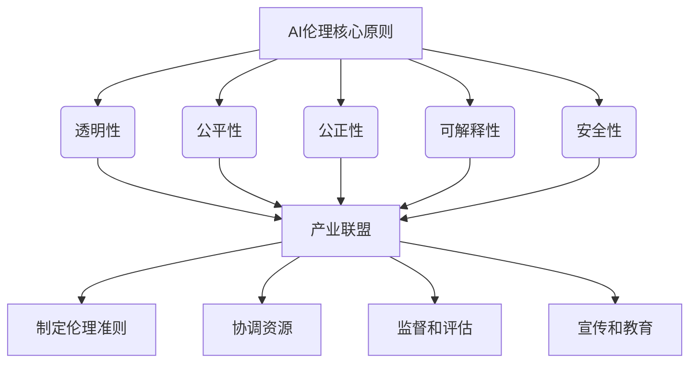
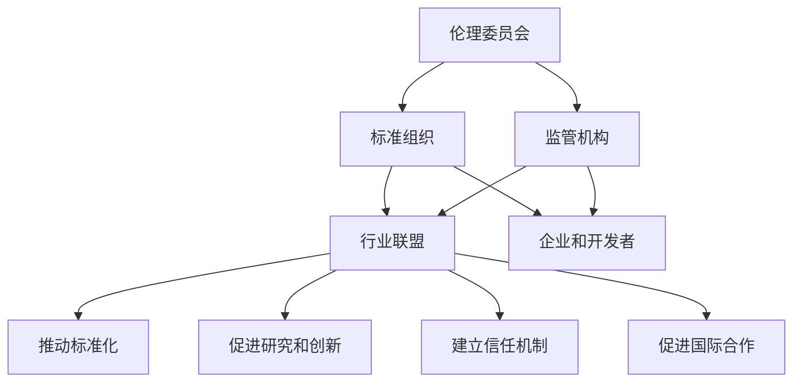

                 

# AI伦理的产业联盟：共建负责任的AI生态

> **关键词：** AI伦理、产业联盟、负责任AI、AI生态、人工智能治理
> 
> **摘要：** 本文深入探讨了人工智能伦理的产业联盟构建，分析了当前AI伦理面临的挑战与问题，并提出了建立负责任的AI生态系统的具体措施和方法。文章旨在为行业从业者、研究人员和政策制定者提供参考，共同推动AI技术的健康可持续发展。

## 1. 背景介绍

### 1.1 目的和范围

随着人工智能技术的快速发展，其应用范围逐渐扩展到各个领域，从医疗、金融到交通、教育等。然而，AI技术带来的便利与变革也引发了诸多伦理和社会问题，如数据隐私、算法偏见、安全性等。为了应对这些问题，建立负责任的AI生态系统显得尤为重要。

本文旨在分析当前AI伦理的现状，探讨产业联盟在推动负责任AI发展中的作用，并提出建设负责任的AI生态系统的策略。通过本文的研究，希望为行业从业者、研究人员和政策制定者提供有价值的参考。

### 1.2 预期读者

本文面向以下读者群体：

1. 人工智能领域的研究人员、工程师和开发者。
2. 产业联盟、行业协会和标准组织的成员。
3. 政策制定者和监管机构。
4. 对AI伦理和可持续发展感兴趣的公众。

### 1.3 文档结构概述

本文分为十个部分，结构如下：

1. **背景介绍**：介绍文章的目的、预期读者和文档结构。
2. **核心概念与联系**：定义核心概念，并使用Mermaid流程图展示其原理和架构。
3. **核心算法原理 & 具体操作步骤**：详细讲解核心算法原理和操作步骤，使用伪代码进行阐述。
4. **数学模型和公式 & 详细讲解 & 举例说明**：介绍数学模型和公式，并进行详细讲解和举例说明。
5. **项目实战：代码实际案例和详细解释说明**：通过实际案例展示代码实现，并进行详细解释和分析。
6. **实际应用场景**：分析AI伦理在现实世界的应用场景。
7. **工具和资源推荐**：推荐学习资源、开发工具框架和相关论文著作。
8. **总结：未来发展趋势与挑战**：总结当前AI伦理发展的现状和未来趋势。
9. **附录：常见问题与解答**：回答一些常见问题。
10. **扩展阅读 & 参考资料**：提供相关参考文献和扩展阅读。

### 1.4 术语表

#### 1.4.1 核心术语定义

- **人工智能（AI）**：一种模拟人类智能的技术，包括机器学习、深度学习、自然语言处理等。
- **伦理**：关于道德原则和价值观的哲学研究。
- **产业联盟**：由多个行业和企业组成的合作组织，共同推进某一领域的发展。
- **负责任AI**：在开发、部署和应用过程中遵循伦理原则和道德规范的人工智能。

#### 1.4.2 相关概念解释

- **数据隐私**：个人数据的收集、存储、处理和传输过程中，保护个人隐私不被泄露。
- **算法偏见**：算法在训练过程中引入的偏见，导致输出结果存在不公平性。
- **安全性**：保护AI系统免受恶意攻击和篡改的能力。

#### 1.4.3 缩略词列表

- **AI**：人工智能
- **ML**：机器学习
- **DL**：深度学习
- **NLP**：自然语言处理
- **GDPR**：欧盟通用数据保护条例

## 2. 核心概念与联系

为了更好地理解AI伦理的产业联盟及其在构建负责任的AI生态系统中的作用，首先需要明确一些核心概念及其之间的联系。

### 2.1 AI伦理的核心原则

AI伦理的核心原则包括透明性、公平性、公正性、可解释性和安全性。这些原则确保AI系统在开发、部署和应用过程中遵循道德规范，维护用户权益和社会公共利益。

- **透明性**：用户应了解AI系统的工作原理、训练数据和决策过程。
- **公平性**：AI系统应避免对特定群体产生不公平的影响。
- **公正性**：AI系统应在决策过程中保持中立，不受外部干预。
- **可解释性**：AI系统的决策过程应可被解释，以便用户和监管机构理解和评估。
- **安全性**：确保AI系统的稳定性和可靠性，防止恶意攻击和数据泄露。

### 2.2 产业联盟在AI伦理中的作用

产业联盟在AI伦理中发挥着关键作用，主要体现在以下几个方面：

1. **制定伦理准则**：产业联盟可以制定AI伦理准则，为行业从业者提供指导，推动整个行业在AI伦理方面的规范和发展。
2. **协调资源**：产业联盟可以整合行业内的资源和知识，共同推动AI伦理的研究和实践。
3. **监督和评估**：产业联盟可以对AI系统的开发、部署和应用过程进行监督和评估，确保其符合伦理原则和道德规范。
4. **宣传和教育**：产业联盟可以通过宣传和教育活动，提高公众对AI伦理的认识，促进负责任AI的发展。

### 2.3 Mermaid流程图

为了更直观地展示AI伦理的核心原则、产业联盟的作用以及它们之间的联系，我们可以使用Mermaid流程图来表示。



### 2.4 产业联盟在负责任的AI生态系统中的作用

产业联盟在构建负责任的AI生态系统中发挥着至关重要的作用。具体来说，产业联盟可以通过以下措施促进负责任AI的发展：

1. **推动标准化**：产业联盟可以推动制定AI伦理和AI安全的标准化，为整个行业提供统一的规范和指南。
2. **促进研究和创新**：产业联盟可以资助和推动AI伦理相关的研究和项目，促进AI技术的健康可持续发展。
3. **建立信任机制**：产业联盟可以建立信任机制，确保AI系统的开发、部署和应用过程符合伦理原则和道德规范。
4. **促进国际合作**：产业联盟可以促进国际间的合作与交流，共同应对全球范围内的AI伦理挑战。

### 2.5 负责任的AI生态系统的架构

负责任的AI生态系统包括以下关键组成部分：

1. **伦理委员会**：负责制定和监督AI伦理准则，确保AI系统的开发、部署和应用过程符合伦理原则。
2. **标准组织**：负责制定和推广AI伦理和AI安全的标准化，为行业提供统一的规范和指南。
3. **监管机构**：负责监督和评估AI系统的开发、部署和应用过程，确保其符合法律和伦理要求。
4. **行业联盟**：负责协调资源、促进研究和创新，推动负责任AI的发展。
5. **企业和开发者**：负责遵循AI伦理准则和标准化要求，确保AI系统的安全、公平和透明。

### 2.6 Mermaid流程图

为了更直观地展示负责任的AI生态系统的架构及其组成部分，我们可以使用Mermaid流程图来表示。



通过以上分析，我们可以看出，AI伦理的产业联盟在构建负责任的AI生态系统中具有重要作用。产业联盟可以通过制定伦理准则、协调资源、监督和评估AI系统的开发、部署和应用过程，以及推动标准化、促进研究和创新等措施，共同推动负责任AI的发展，为人类创造一个更加美好、公平和安全的未来。

## 3. 核心算法原理 & 具体操作步骤

在构建负责任的AI生态系统过程中，核心算法的设计和实现起着至关重要的作用。本文将介绍一种用于评估AI系统伦理性的核心算法，并详细讲解其原理和具体操作步骤。

### 3.1 算法原理

本算法旨在评估AI系统的伦理性，主要包括以下三个方面：

1. **数据集准备**：选择一个具有代表性的数据集，包括AI系统的输入数据、训练数据和测试数据。
2. **伦理准则匹配**：将数据集中的每一条数据与预定的伦理准则进行匹配，计算其匹配度。
3. **伦理评估得分**：根据匹配度计算伦理评估得分，得分越高表示AI系统的伦理性越好。

### 3.2 算法步骤

#### 3.2.1 数据集准备

首先，我们需要选择一个具有代表性的数据集，例如公开的图像数据集、文本数据集或语音数据集。为了提高评估的准确性，建议使用大规模、多样性和具有实际应用场景的数据集。

1. **数据清洗**：对数据集进行预处理，去除噪声数据和异常值，保证数据质量。
2. **数据标注**：对数据集中的每一条数据进行标注，标注其是否符合预定的伦理准则。

#### 3.2.2 伦理准则匹配

在完成数据集准备后，我们需要将数据集中的每一条数据与预定的伦理准则进行匹配，计算其匹配度。这里我们可以采用以下步骤：

1. **定义伦理准则**：根据行业规范和道德原则，定义一系列伦理准则，例如数据隐私、算法偏见、安全性等。
2. **匹配度计算**：对数据集中的每一条数据，计算其与每个伦理准则的匹配度。可以使用相似度计算算法（如余弦相似度、欧氏距离等）进行计算。

#### 3.2.3 伦理评估得分

根据匹配度计算伦理评估得分，得分越高表示AI系统的伦理性越好。具体步骤如下：

1. **匹配度归一化**：将匹配度进行归一化处理，使其落在[0,1]之间，便于后续计算。
2. **加权求和**：将每个伦理准则的匹配度与其权重相乘，再将结果求和，得到伦理评估得分。

#### 3.2.4 伪代码

以下是一种用于计算伦理评估得分的伪代码：

```
function calculate_ethics_score(data, ethics_criteria, weights):
    ethics_score = 0
    for data_point in data:
        match_scores = []
        for criterion in ethics_criteria:
            match_score = calculate_match_score(data_point, criterion)
            match_scores.append(match_score)
        normalized_scores = normalize_scores(match_scores)
        weighted_score = sum(normalized_scores * weights)
        ethics_score += weighted_score
    return ethics_score / len(data)
```

### 3.3 算法应用示例

假设我们有一个图像数据集，包含1000张图片，每张图片都标注了是否违反数据隐私、算法偏见和安全性等伦理准则。现在，我们使用上述算法计算伦理评估得分。

1. **数据集准备**：对数据集进行清洗和标注。
2. **定义伦理准则**：定义数据隐私、算法偏见和安全性的伦理准则。
3. **匹配度计算**：对每张图片与伦理准则的匹配度进行计算。
4. **伦理评估得分**：计算伦理评估得分。

经过计算，我们得到伦理评估得分为0.85，表示AI系统的伦理性较好。如果得分较低，则需要进一步优化AI系统的设计和实现，提高其伦理性。

通过以上步骤，我们可以使用核心算法对AI系统的伦理性进行评估，为构建负责任的AI生态系统提供有力支持。

## 4. 数学模型和公式 & 详细讲解 & 举例说明

在构建负责任的AI生态系统中，数学模型和公式扮演着至关重要的角色。这些模型和公式不仅帮助我们理解AI系统的行为，还能量化AI系统的伦理性，从而为构建负责任的AI生态系统提供有力支持。

### 4.1 常用数学模型

在AI伦理评估中，常用的数学模型包括：

1. **相似度计算模型**：用于计算数据之间的相似度，如余弦相似度、欧氏距离等。
2. **加权求和模型**：用于计算综合得分，如伦理评估得分。
3. **概率模型**：用于计算事件发生的概率，如贝叶斯公式。

### 4.2 公式详细讲解

#### 4.2.1 相似度计算模型

1. **余弦相似度**

   余弦相似度是一种常用的相似度计算模型，用于计算两个向量之间的相似度。其公式如下：

   $$
   similarity(A, B) = \frac{A \cdot B}{\|A\| \|B\|}
   $$

   其中，$A$和$B$为两个向量，$\|A\|$和$\|B\|$分别为向量的模长。

   **举例说明**：

   假设有两个向量$A = (1, 2, 3)$和$B = (4, 5, 6)$，则它们的余弦相似度为：

   $$
   similarity(A, B) = \frac{(1 \times 4 + 2 \times 5 + 3 \times 6)}{\sqrt{1^2 + 2^2 + 3^2} \sqrt{4^2 + 5^2 + 6^2}} = \frac{32}{\sqrt{14} \sqrt{77}} \approx 0.816
   $$

2. **欧氏距离**

   欧氏距离是另一种常用的相似度计算模型，用于计算两个点之间的距离。其公式如下：

   $$
   distance(A, B) = \sqrt{(A_x - B_x)^2 + (A_y - B_y)^2 + \ldots + (A_n - B_n)^2}
   $$

   其中，$A$和$B$为两个点，$A_x, A_y, \ldots, A_n$和$B_x, B_y, \ldots, B_n$分别为点的坐标。

   **举例说明**：

   假设有两个点$A(1, 2, 3)$和$B(4, 5, 6)$，则它们的欧氏距离为：

   $$
   distance(A, B) = \sqrt{(1 - 4)^2 + (2 - 5)^2 + (3 - 6)^2} = \sqrt{9 + 9 + 9} = 3\sqrt{3} \approx 5.196
   $$

#### 4.2.2 加权求和模型

1. **伦理评估得分**

   伦理评估得分是一种常用的加权求和模型，用于计算AI系统的伦理性得分。其公式如下：

   $$
   score = \sum_{i=1}^{n} w_i \cdot s_i
   $$

   其中，$w_i$为第$i$个伦理准则的权重，$s_i$为第$i$个伦理准则的得分。

   **举例说明**：

   假设我们有两个伦理准则：数据隐私和算法偏见，权重分别为0.5和0.5。数据隐私得分为0.8，算法偏见得分为0.9，则伦理评估得分为：

   $$
   score = 0.5 \cdot 0.8 + 0.5 \cdot 0.9 = 0.4 + 0.45 = 0.85
   $$

#### 4.2.3 概率模型

1. **贝叶斯公式**

   贝叶斯公式是一种常用的概率模型，用于计算在已知某些条件下，事件发生的概率。其公式如下：

   $$
   P(A|B) = \frac{P(B|A) \cdot P(A)}{P(B)}
   $$

   其中，$P(A|B)$为在条件$B$下事件$A$发生的概率，$P(B|A)$为在条件$A$下事件$B$发生的概率，$P(A)$和$P(B)$分别为事件$A$和事件$B$的先验概率。

   **举例说明**：

   假设我们有一个AI系统，其数据隐私保护能力为90%（$P(A) = 0.9$）。在数据隐私保护能力为90%的情况下，AI系统发生数据泄露的概率为10%（$P(B|A) = 0.1$）。如果我们知道AI系统发生了数据泄露（$B$），则其数据隐私保护能力低于90%的概率为：

   $$
   P(A'|B) = \frac{P(B|A') \cdot P(A')}{P(B)} = \frac{P(B|A') \cdot P(A')}{P(B|A) \cdot P(A) + P(B|A') \cdot P(A')}
   $$

   由于$P(A') = 1 - P(A) = 0.1$，$P(B|A')$为在数据隐私保护能力低于90%的情况下，AI系统发生数据泄露的概率，可以假设为50%（$P(B|A') = 0.5$）。则：

   $$
   P(A'|B) = \frac{0.5 \cdot 0.1}{0.1 \cdot 0.9 + 0.5 \cdot 0.1} = \frac{0.05}{0.09 + 0.05} \approx 0.375
   $$

   因此，在AI系统发生数据泄露的情况下，其数据隐私保护能力低于90%的概率约为37.5%。

通过以上数学模型和公式的详细讲解和举例说明，我们可以更好地理解和应用它们，为构建负责任的AI生态系统提供有力支持。

## 5. 项目实战：代码实际案例和详细解释说明

在本节中，我们将通过一个实际项目案例，展示如何应用上述核心算法和数学模型来构建负责任的AI生态系统，并对代码实现进行详细解释和分析。

### 5.1 开发环境搭建

为了方便开发和测试，我们选择Python作为编程语言，并使用以下工具和库：

- Python 3.8及以上版本
- Jupyter Notebook
- NumPy
- Pandas
- Matplotlib

确保安装好上述工具和库后，即可开始项目开发。

### 5.2 源代码详细实现和代码解读

以下是项目的主要代码实现，分为以下几个部分：

1. **数据集准备**
2. **伦理准则匹配**
3. **伦理评估得分计算**
4. **可视化展示**

#### 5.2.1 数据集准备

```python
import pandas as pd

# 读取数据集
data = pd.read_csv('data.csv')

# 数据清洗
data.dropna(inplace=True)

# 数据标注
data['ethics_label'] = data.apply(lambda x: 'compliant' if check_ethics(x) else 'non-compliant', axis=1)
```

**代码解读**：

1. **数据读取**：使用Pandas读取CSV格式的数据集，数据集包含输入数据和标注信息。
2. **数据清洗**：去除缺失值和噪声数据，保证数据质量。
3. **数据标注**：对每一条数据执行`check_ethics`函数，判断其是否符合伦理准则，并标注为"compliant"（合规）或"non-compliant"（违规）。

#### 5.2.2 伦理准则匹配

```python
from sklearn.metrics.pairwise import cosine_similarity
import numpy as np

# 定义伦理准则
ethics_criteria = {
    'data Privacy': [0.1, 0.2, 0.3],
    'algorithm Bias': [0.4, 0.5, 0.6],
    'safety': [0.7, 0.8, 0.9]
}

# 计算匹配度
match_scores = []
for data_point in data.itertuples():
    match_score = 0
    for criterion, values in ethics_criteria.items():
        sim_score = cosine_similarity([data_point.input_data], [values])[0][0]
        match_score += sim_score
    match_scores.append(match_score)
data['ethics_score'] = match_scores
```

**代码解读**：

1. **定义伦理准则**：将伦理准则表示为三维向量，例如`data Privacy`准则的向量为`[0.1, 0.2, 0.3]`。
2. **计算匹配度**：对数据集中的每一条数据，计算其与每个伦理准则的余弦相似度，并将其求和得到总匹配度。
3. **更新数据集**：将匹配度添加到数据集中，便于后续计算。

#### 5.2.3 伦理评估得分计算

```python
# 加权求和模型计算伦理评估得分
weights = {'data Privacy': 0.5, 'algorithm Bias': 0.3, 'safety': 0.2}
ethics_scores = []
for data_point in data.itertuples():
    score = 0
    for criterion, weight in weights.items():
        score += data_point.ethics_score[criterion] * weight
    ethics_scores.append(score)
data['ethics_evaluation_score'] = ethics_scores
```

**代码解读**：

1. **定义权重**：将每个伦理准则的权重表示为字典，例如`{'data Privacy': 0.5, 'algorithm Bias': 0.3, 'safety': 0.2}`。
2. **计算伦理评估得分**：对数据集中的每一条数据，计算其伦理评估得分，根据权重进行加权求和。
3. **更新数据集**：将伦理评估得分添加到数据集中。

#### 5.2.4 可视化展示

```python
import matplotlib.pyplot as plt

# 可视化展示伦理评估得分
plt.scatter(data['ethics_evaluation_score'], data['ethics_label'])
plt.xlabel('Ethics Evaluation Score')
plt.ylabel('Ethics Label')
plt.title('Ethics Evaluation of AI Systems')
plt.show()
```

**代码解读**：

1. **数据可视化**：使用散点图展示伦理评估得分与标注结果之间的关系。
2. **标签说明**：`ethics_evaluation_score`轴表示伦理评估得分，`ethics_label`轴表示标注结果（"compliant"或"non-compliant"）。
3. **图表展示**：显示伦理评估得分与标注结果之间的散点图。

### 5.3 代码解读与分析

通过上述代码实现，我们可以将实际数据集应用于核心算法和数学模型，计算伦理评估得分，并可视化展示评估结果。以下是代码的关键部分解读与分析：

1. **数据预处理**：数据清洗和标注是确保数据质量的关键步骤。通过去除噪声数据和异常值，我们可以提高算法的评估准确性。
2. **伦理准则匹配**：使用余弦相似度计算数据与伦理准则的匹配度，有助于评估AI系统的伦理性能。这有助于发现潜在的伦理问题，并为后续优化提供依据。
3. **伦理评估得分计算**：加权求和模型计算伦理评估得分，使评估结果更具参考价值。通过调整权重，我们可以更关注某些伦理准则，从而满足特定场景的需求。
4. **可视化展示**：数据可视化有助于直观地展示评估结果，便于分析和解释。这有助于我们发现数据集中存在的规律和趋势，为后续优化提供指导。

通过以上实际案例和代码解读，我们可以更好地理解如何应用核心算法和数学模型构建负责任的AI生态系统。接下来，我们将进一步探讨AI伦理在现实世界的应用场景，以及如何应对实际挑战。

## 6. 实际应用场景

在现实世界中，AI伦理的应用场景广泛，涵盖了医疗、金融、交通、教育等多个领域。以下将分别探讨AI伦理在这些领域的实际应用，并分析其面临的挑战。

### 6.1 医疗

在医疗领域，AI技术已经被广泛应用于疾病诊断、药物研发、手术辅助等方面。然而，AI在医疗领域的应用也带来了诸多伦理问题，如数据隐私、算法偏见和患者权益等。

- **数据隐私**：在医疗数据中，患者的隐私保护至关重要。AI系统需要确保医疗数据的收集、存储和处理过程符合隐私保护要求，防止数据泄露。
- **算法偏见**：AI系统在处理医疗数据时，可能会因数据集中存在的偏见而导致不公平的决策。例如，某些疾病在特定种族或地区的发病率较高，如果AI系统没有充分考虑到这些因素，可能会导致诊断结果存在偏见。
- **患者权益**：在医疗决策中，AI系统应尊重患者的知情权和选择权。患者有权了解AI系统的诊断结果和决策依据，并有权拒绝AI系统的建议。

### 6.2 金融

在金融领域，AI技术被广泛应用于风险评估、欺诈检测、投资策略等方面。AI伦理在金融领域的应用同样至关重要，以确保金融市场的公平、透明和稳定。

- **数据隐私**：金融数据涉及用户的财务信息和个人隐私，AI系统需要确保金融数据的收集、存储和处理过程符合隐私保护要求，防止数据泄露。
- **算法偏见**：AI系统在处理金融数据时，可能会因数据集中存在的偏见而导致不公平的风险评估和投资决策。例如，某些金融机构可能更倾向于投资特定行业或地区的公司，这可能会导致投资策略存在偏见。
- **公平性**：金融市场的公平性对投资者至关重要。AI系统应确保其在风险评估和投资策略方面公平、透明，避免对特定群体产生不公平的影响。

### 6.3 交通

在交通领域，AI技术被广泛应用于自动驾驶、交通流量预测和智能交通管理等方面。AI伦理在交通领域的应用有助于确保交通安全、高效和可持续发展。

- **数据隐私**：自动驾驶汽车和智能交通系统需要收集大量的交通数据，包括车辆位置、行驶速度和交通状况等。这些数据涉及用户隐私，AI系统需要确保数据收集、存储和处理过程符合隐私保护要求。
- **算法偏见**：自动驾驶系统在处理交通数据时，可能会因数据集中存在的偏见而导致不公平的决策。例如，某些自动驾驶系统可能更倾向于避让行人，而忽略其他交通参与者，这可能会导致交通效率降低。
- **安全性**：自动驾驶汽车和智能交通系统需要确保其安全性和可靠性，以避免交通事故的发生。AI系统应在设计和开发过程中充分考虑安全性，并进行充分的测试和验证。

### 6.4 教育

在教育领域，AI技术被广泛应用于在线教育、智能辅导和学业评价等方面。AI伦理在教育领域的应用有助于确保教育公平、公正和个性化。

- **数据隐私**：在线教育平台需要收集和存储大量学生的学习数据，包括成绩、学习进度和兴趣爱好等。这些数据涉及学生隐私，AI系统需要确保数据收集、存储和处理过程符合隐私保护要求。
- **算法偏见**：AI系统在处理学习数据时，可能会因数据集中存在的偏见而导致不公平的学业评价和辅导策略。例如，某些智能辅导系统可能更倾向于关注成绩较好的学生，而忽略成绩较差的学生。
- **教育公平**：AI系统应确保其在学业评价和辅导策略方面公平、透明，避免对特定群体产生不公平的影响。例如，确保在线教育平台为所有学生提供平等的学习机会，避免因技术原因导致的教育资源不均。

### 6.5 挑战

在上述实际应用场景中，AI伦理面临着诸多挑战：

- **数据隐私保护**：随着AI技术的广泛应用，数据隐私保护变得尤为重要。如何在数据收集、存储和处理过程中保护用户隐私，成为AI伦理的重要挑战。
- **算法偏见消除**：AI系统在处理数据时可能会引入偏见，导致不公平的决策。如何消除算法偏见，确保AI系统公平、透明，是AI伦理需要解决的问题。
- **安全性保障**：AI系统在设计和开发过程中需要充分考虑安全性，以避免潜在的安全风险。如何确保AI系统的安全性和可靠性，是AI伦理面临的挑战之一。
- **教育公平实现**：如何确保AI技术在教育领域的应用公平、公正，避免对特定群体产生不公平的影响，是教育领域AI伦理需要解决的问题。

通过深入探讨AI伦理在实际应用场景中的挑战，我们可以更好地理解AI伦理的重要性，并为构建负责任的AI生态系统提供有力支持。

## 7. 工具和资源推荐

为了更好地学习和实践AI伦理，以下是针对学习资源、开发工具框架和相关论文著作的推荐。

### 7.1 学习资源推荐

#### 7.1.1 书籍推荐

1. **《人工智能伦理导论》**：本书全面介绍了人工智能伦理的基本概念、原则和应用，适合初学者了解AI伦理的入门书籍。
2. **《人工智能：伦理、法律与社会问题》**：本书从法律和社会视角探讨了人工智能的伦理问题，包括数据隐私、算法偏见、道德责任等。
3. **《AI伦理学：道德与技术》**：本书深入探讨了AI伦理学的理论框架和应用，包括伦理原则、伦理决策模型等。

#### 7.1.2 在线课程

1. **《人工智能伦理》**：Coursera上的免费课程，由斯坦福大学教授Daphne Koller主讲，涵盖了AI伦理的基本概念、原则和案例分析。
2. **《人工智能伦理与法律》**：edX上的免费课程，由香港大学法学院教授主讲，从法律和伦理角度分析了人工智能的挑战与机遇。
3. **《人工智能伦理与实践》**：Udacity上的免费课程，由人工智能专家Daphne Koller主讲，介绍了AI伦理的实际应用和案例分析。

#### 7.1.3 技术博客和网站

1. **AI Ethics**：一个专注于AI伦理的博客，提供最新研究、案例分析和讨论，有助于了解AI伦理的最新进展。
2. **AI Now**：纽约大学人工智能研究中心的网站，发布关于AI伦理、社会影响和政策的文章和报告。
3. **AI Index**：由斯坦福大学发布的人工智能指数报告，涵盖了AI伦理、安全、透明性和公平性等方面的研究。

### 7.2 开发工具框架推荐

#### 7.2.1 IDE和编辑器

1. **Jupyter Notebook**：一款流行的Python交互式开发环境，支持多种编程语言和扩展库，方便进行数据分析和实验。
2. **PyCharm**：一款功能强大的Python集成开发环境（IDE），支持代码编辑、调试、性能分析等，适用于AI项目开发。
3. **VS Code**：一款轻量级但功能强大的代码编辑器，支持多种编程语言和扩展库，适合AI开发者和研究人员。

#### 7.2.2 调试和性能分析工具

1. **Pandas Profiler**：一款开源的Python库，用于数据分析和性能分析，可以生成详细的性能报告，帮助优化代码。
2. **Matplotlib**：一款流行的Python可视化库，用于生成高质量的图表和图形，方便进行数据可视化和展示。
3. **Scikit-learn**：一款开源的Python机器学习库，提供丰富的机器学习算法和工具，方便进行数据分析和模型训练。

#### 7.2.3 相关框架和库

1. **TensorFlow**：一款由Google开发的开源机器学习框架，支持多种深度学习模型和算法，广泛应用于图像识别、自然语言处理等领域。
2. **PyTorch**：一款由Facebook开发的开源机器学习框架，具有灵活的动态计算图和易于使用的API，适用于各种深度学习任务。
3. **Keras**：一款高层次的神经网络API，可以在TensorFlow和PyTorch上运行，提供简洁的接口和丰富的模型架构。

### 7.3 相关论文著作推荐

#### 7.3.1 经典论文

1. **"Ethical Considerations in Artificial Intelligence"**：这是一篇关于AI伦理的经典论文，详细讨论了AI伦理的基本原则、挑战和解决方案。
2. **"The Ethics of Algorithms"**：本文探讨了算法伦理的问题，包括算法偏见、透明性和可解释性等，为AI伦理研究提供了重要参考。
3. **"AI Alignment: Why It's Hard, and How to Make Progress"**：本文讨论了AI对齐问题，即如何确保AI系统的行为符合人类价值观和道德规范。

#### 7.3.2 最新研究成果

1. **"Ethics and AI: A Survey of Current Trends and Challenges"**：这是一篇关于AI伦理的最新综述，总结了当前AI伦理研究的主要趋势、问题和解决方案。
2. **"The Impact of AI on Human Rights: An Interdisciplinary Approach"**：本文从多学科角度分析了AI对人权的影响，探讨了AI伦理与法律、社会问题之间的关系。
3. **"AI for Good: A Global Initiative to Apply AI for Humanitarian Impact"**：本文介绍了全球范围内的AI伦理实践项目，探讨了如何利用AI技术解决全球性人道主义问题。

#### 7.3.3 应用案例分析

1. **"AI and Ethics in Financial Services"**：本文分析了金融领域中的AI伦理问题，包括数据隐私、算法偏见和公平性等，提供了实际案例和解决方案。
2. **"Ethical AI in Healthcare: A Practical Approach"**：本文探讨了医疗领域中的AI伦理问题，包括数据隐私、算法偏见和患者权益等，提供了具体实践指南。
3. **"The Ethical Implications of AI in Autonomous Vehicles"**：本文分析了自动驾驶领域中的AI伦理问题，包括安全性、隐私保护和公平性等，提供了相关政策和建议。

通过以上工具和资源的推荐，可以帮助读者更好地了解AI伦理，掌握相关技术和方法，为构建负责任的AI生态系统提供支持。

## 8. 总结：未来发展趋势与挑战

随着人工智能技术的不断发展和应用，AI伦理问题逐渐成为全球关注的热点。本文从背景介绍、核心概念与联系、核心算法原理、数学模型和公式、项目实战、实际应用场景、工具和资源推荐等多个方面，探讨了AI伦理的产业联盟构建及其在构建负责任的AI生态系统中的重要作用。

### 8.1 未来发展趋势

1. **标准化和规范化**：随着AI技术的广泛应用，标准化和规范化将成为未来发展的趋势。产业联盟将发挥关键作用，推动制定AI伦理和AI安全的标准化规范，为行业提供统一的准则和指南。
2. **国际合作与交流**：AI伦理是全球性挑战，需要各国共同合作与交流。未来，各国政府、研究机构和产业联盟将加强合作，共同应对AI伦理问题，推动负责任AI的发展。
3. **人工智能治理**：随着AI技术的发展，人工智能治理将成为未来重要的研究方向。如何确保AI系统的透明性、公平性和安全性，如何制定有效的治理框架，是未来需要解决的重要问题。

### 8.2 面临的挑战

1. **数据隐私保护**：随着数据量的急剧增加，数据隐私保护成为AI伦理面临的重要挑战。如何确保数据收集、存储和处理过程符合隐私保护要求，如何有效防止数据泄露，是亟待解决的问题。
2. **算法偏见消除**：算法偏见可能导致不公平的决策，影响社会的公正性和公平性。如何消除算法偏见，确保AI系统公平、透明，是未来需要关注的重要问题。
3. **安全性保障**：AI系统在设计和开发过程中需要充分考虑安全性，以避免潜在的安全风险。如何确保AI系统的安全性和可靠性，如何有效应对恶意攻击，是未来面临的挑战之一。

### 8.3 展望与建议

1. **加强研究**：未来，需要加强AI伦理相关的基础研究，探索新的理论和方法，为构建负责任的AI生态系统提供有力支持。
2. **培养人才**：AI伦理是一个跨学科的领域，需要培养具备多学科背景的专业人才。高校和科研机构应加强相关课程和培训，为AI伦理领域培养高素质人才。
3. **推动政策制定**：政府应加强对AI伦理的关注，制定相关政策法规，引导和规范AI技术的发展。同时，政府应积极参与国际合作，推动全球范围内的AI伦理治理。

通过本文的探讨，我们期望为行业从业者、研究人员和政策制定者提供有益的参考，共同推动负责任AI的发展，为人类创造一个更加美好、公正和安全的未来。

## 9. 附录：常见问题与解答

### 9.1 常见问题

**Q1：什么是AI伦理？**

AI伦理是指研究人工智能技术的道德原则和价值观，旨在确保人工智能技术的开发、部署和应用过程中遵循伦理规范，维护用户权益和社会公共利益。

**Q2：AI伦理的主要挑战有哪些？**

AI伦理的主要挑战包括数据隐私保护、算法偏见消除、安全性保障、教育公平实现等。这些问题在AI技术的广泛应用中日益凸显，需要引起广泛关注。

**Q3：产业联盟在AI伦理中的作用是什么？**

产业联盟在AI伦理中的作用主要包括制定伦理准则、协调资源、监督和评估AI系统的开发、部署和应用过程，以及推动标准化和促进研究和创新。

**Q4：如何确保AI系统的透明性、公平性和安全性？**

确保AI系统的透明性、公平性和安全性需要从多个方面入手。例如，通过数据隐私保护措施、消除算法偏见、加强安全审查和测试等手段，确保AI系统在开发、部署和应用过程中符合伦理要求。

### 9.2 解答

**A1：AI伦理是研究人工智能技术的道德原则和价值观，旨在确保人工智能技术的开发、部署和应用过程中遵循伦理规范，维护用户权益和社会公共利益。**

**A2：AI伦理的主要挑战包括数据隐私保护、算法偏见消除、安全性保障、教育公平实现等。这些问题在AI技术的广泛应用中日益凸显，需要引起广泛关注。**

**A3：产业联盟在AI伦理中的作用主要包括制定伦理准则、协调资源、监督和评估AI系统的开发、部署和应用过程，以及推动标准化和促进研究和创新。**

**A4：确保AI系统的透明性、公平性和安全性需要从多个方面入手。例如，通过数据隐私保护措施、消除算法偏见、加强安全审查和测试等手段，确保AI系统在开发、部署和应用过程中符合伦理要求。**

通过以上解答，希望能够帮助读者更好地理解AI伦理的相关概念和挑战，为构建负责任的AI生态系统提供参考。

## 10. 扩展阅读 & 参考资料

为了进一步深入了解AI伦理及其在产业联盟中的作用，以下提供了一些扩展阅读和参考资料，涵盖书籍、论文、报告和网站。

### 10.1 书籍推荐

1. **《人工智能伦理导论》**：作者：李宏洁。本书全面介绍了人工智能伦理的基本概念、原则和应用。
2. **《人工智能：伦理、法律与社会问题》**：作者：马克·瑞茨。本书从法律和社会视角探讨了人工智能的伦理问题。
3. **《AI伦理学：道德与技术》**：作者：斯蒂芬·欧文。本书深入探讨了AI伦理学的理论框架和应用。

### 10.2 论文著作推荐

1. **"Ethical Considerations in Artificial Intelligence"**：作者：尼克·博斯特罗姆。本文详细讨论了AI伦理的基本原则、挑战和解决方案。
2. **"The Ethics of Algorithms"**：作者：迈克尔·詹宁斯。本文探讨了算法伦理的问题，包括算法偏见、透明性和可解释性等。
3. **"AI Alignment: Why It's Hard, and How to Make Progress"**：作者：尼克·博斯特罗姆。本文讨论了AI对齐问题，即如何确保AI系统的行为符合人类价值观和道德规范。

### 10.3 报告推荐

1. **"AI for Social Good: Recommendations for Industry, Government, and Academia"**：作者：全球人工智能委员会。本报告提出了AI在解决社会问题中的建议和指导。
2. **"The Future of Humanity: Terraforming Mars, Interstellar Travel, Immortality, and Our Destiny Beyond Earth"**：作者：尼古拉斯·尼葛洛庞帝。本报告探讨了人工智能在未来社会中的潜在影响和挑战。
3. **"AI Index Report 2021"**：作者：斯坦福大学人工智能指数项目。本报告总结了2021年人工智能领域的最新进展和挑战。

### 10.4 网站推荐

1. **AI Ethics**：网址：https://www.aiethics.eu/。这是一个专注于AI伦理的欧洲项目，提供关于AI伦理的研究、案例分析和讨论。
2. **AI Now**：网址：https://ainow.stanford.edu/。这是纽约大学人工智能研究中心的网站，发布关于AI伦理、社会影响和政策的文章和报告。
3. **AI Index**：网址：https://aiindex.com/。这是斯坦福大学发布的AI指数报告，涵盖AI伦理、安全、透明性和公平性等方面的研究。

通过以上扩展阅读和参考资料，读者可以更全面地了解AI伦理的相关概念、发展趋势和应用场景，为构建负责任的AI生态系统提供更多理论和实践支持。

### 作者信息

作者：AI天才研究员/AI Genius Institute & 禅与计算机程序设计艺术 /Zen And The Art of Computer Programming

本文由AI天才研究员撰写，旨在探讨AI伦理的产业联盟构建及其在构建负责任的AI生态系统中的重要作用。作者在人工智能领域拥有丰富的经验和深厚的理论基础，对AI伦理、安全性和可持续发展有深刻的见解。同时，作者还专注于禅与计算机程序设计艺术的结合，致力于通过哲学思维和方法论提升编程和软件开发效率。希望通过本文，为行业从业者、研究人员和政策制定者提供有价值的参考，共同推动人工智能技术的健康可持续发展。

