                 

# AI伦理的教育政策:教师培训和教育资源建设

> 关键词：AI伦理、教育政策、教师培训、教育资源、人工智能教育

> 摘要：本文深入探讨了人工智能伦理在教育领域的应用及其重要性。文章首先介绍了AI伦理的基本概念和其在教育政策中的重要性，接着分析了当前教师培训和教育资源建设的现状，提出了一系列改进措施。通过详细阐述AI伦理教育政策的核心算法原理、数学模型、项目实战案例，本文旨在为教育工作者和决策者提供有益的参考，推动人工智能与教育更和谐地融合发展。

## 1. 背景介绍

### 1.1 目的和范围

本文旨在探讨人工智能（AI）伦理在教育领域的应用，特别是在教师培训和教育资源建设方面的策略。随着人工智能技术的迅速发展，其应用逐渐渗透到教育的方方面面，从学习分析到个性化教学，再到智能评估系统，AI正成为教育革新的关键推动力。然而，AI的广泛应用也引发了一系列伦理问题，如数据隐私、算法偏见、教育公平等。因此，制定和实施AI伦理教育政策显得尤为重要。

本文将围绕以下主题进行讨论：

1. AI伦理的基本概念及其在教育政策中的重要性。
2. 教师培训现状及教育资源建设的需求。
3. AI伦理教育政策的核心算法原理和数学模型。
4. 项目实战案例及其实践意义。
5. 未来发展趋势与面临的挑战。

### 1.2 预期读者

本文适合以下读者群体：

1. 教育工作者，特别是从事人工智能教育领域的人员。
2. 教育政策制定者和执行者。
3. 对人工智能伦理和教育技术感兴趣的学者和研究人员。
4. 对教育领域技术变革感兴趣的技术人员和管理者。

### 1.3 文档结构概述

本文分为以下几个部分：

1. **背景介绍**：介绍本文的目的、范围和预期读者，并对文档结构进行概述。
2. **核心概念与联系**：阐述AI伦理的核心概念，并使用Mermaid流程图展示其与教育政策的关系。
3. **核心算法原理 & 具体操作步骤**：详细讲解AI伦理教育政策的核心算法原理，使用伪代码展示具体操作步骤。
4. **数学模型和公式 & 详细讲解 & 举例说明**：介绍与AI伦理教育政策相关的数学模型和公式，并进行详细讲解和举例说明。
5. **项目实战：代码实际案例和详细解释说明**：通过实际案例展示AI伦理教育政策的实践应用。
6. **实际应用场景**：分析AI伦理教育政策在不同教育阶段和应用场景中的具体应用。
7. **工具和资源推荐**：推荐学习资源、开发工具和框架，以及相关论文著作。
8. **总结：未来发展趋势与挑战**：总结全文，探讨未来发展趋势和面临的挑战。
9. **附录：常见问题与解答**：提供常见问题的解答。
10. **扩展阅读 & 参考资料**：列出相关的扩展阅读材料和参考资料。

### 1.4 术语表

#### 1.4.1 核心术语定义

- **人工智能（AI）**：指通过计算机模拟人类智能行为的技术和系统。
- **伦理**：涉及道德原则和价值观的判断和规范。
- **教育政策**：政府或教育机构制定的关于教育发展的规划和策略。
- **教师培训**：提高教师专业素质和教学能力的教育和培训活动。
- **教育资源**：用于教育过程中的各种物质和非物质资源。

#### 1.4.2 相关概念解释

- **数据隐私**：指个人数据在收集、存储、处理和传输过程中受到保护，不被未经授权的第三方获取。
- **算法偏见**：指算法在处理数据时因设计不当或数据集不均衡而产生的系统性错误。
- **教育公平**：指所有学生都能获得平等的教育机会和资源。

#### 1.4.3 缩略词列表

- **AI**：人工智能
- **IDE**：集成开发环境
- **IoT**：物联网
- **ML**：机器学习

## 2. 核心概念与联系

AI伦理是人工智能技术和伦理学交叉领域的产物，它关注人工智能系统在开发、部署和应用过程中对人类社会的潜在影响。在教育领域，AI伦理的核心概念包括数据隐私、算法偏见和教育公平。这些概念相互关联，共同构成了AI伦理教育政策的基础。

### 2.1 AI伦理与教育政策的关系

教育政策通常涉及教育目标的制定、教育资源的分配、教育质量的评估等方面。AI伦理作为教育政策的重要组成部分，其目标是确保人工智能技术在教育中的应用能够促进教育公平、提升教育质量、保护学生权益。具体而言，AI伦理与教育政策的关系可以从以下几个方面来理解：

1. **数据隐私保护**：在教育数据管理中，必须遵循数据隐私保护的原则，确保学生和教师的个人信息不被滥用。这需要在教育政策中明确规定数据收集、存储和处理的标准和流程。

2. **算法偏见防范**：为了防止算法偏见对教育公平造成负面影响，教育政策应推动算法的透明度和可解释性，确保算法决策符合道德和伦理标准。

3. **教育公平促进**：通过合理的教育资源分配和个性化的教学支持，教育政策可以帮助缩小教育差距，实现教育公平。AI伦理教育政策可以为这一目标的实现提供技术支持。

### 2.2 Mermaid流程图：AI伦理与教育政策的联系

下面是一个使用Mermaid绘制的流程图，展示了AI伦理与教育政策之间的核心概念及其相互关系。

```mermaid
graph TD
    A[数据隐私] --> B[算法偏见]
    A --> C[教育公平]
    B --> D[教育资源分配]
    C --> E[个性化教学]
    B --> F[算法透明度]
    D --> G[教育质量提升]
    E --> H[学习体验改善]
    F --> I[决策可解释性]
    G --> J[教育公平实现]
    H --> K[学生满意度提升]
    I --> L[政策合规性]
    J --> M[社会信任增强]
    K --> N[教师工作满意度提升]
    L --> O[伦理责任履行]
    M --> P[技术接受度提升]
    N --> Q[教学质量提升]
    O --> R[可持续发展]
    P --> S[技术创新]
    Q --> T[学生成绩提高]
    R --> U[教育系统优化]
    S --> V[教育资源优化]
    T --> W[教育目标实现]
    U --> X[社会进步]
    V --> Y[教育公平实现]
    W --> Z[教育成果提升]
```



通过这个流程图，我们可以清晰地看到AI伦理教育政策是如何通过数据隐私、算法偏见、教育公平等核心概念，与教育资源分配、个性化教学、教育质量提升等教育政策目标相联系的。这种联系不仅有助于制定和实施更有效的教育政策，还能促进人工智能与教育更和谐地融合发展。

### 2.3 教师培训的重要性

教师是教育过程中的关键角色，他们在传播知识、塑造学生价值观和培养学生能力方面起着不可替代的作用。随着人工智能技术的不断进步，教师面临的挑战也在不断增加。因此，教师培训变得尤为重要。

**1. 教师培训的目的**

教师培训的主要目的是提高教师的专业素质和教学能力，使其能够更好地适应和利用人工智能技术。具体来说，教师培训应包括以下几个方面：

- **技术培训**：教师需要掌握人工智能技术的基本原理和应用方法，包括机器学习、自然语言处理、数据挖掘等。
- **教学方法更新**：教师需要学习如何将人工智能技术融入到传统的教学活动中，提升教学效果。
- **教育伦理教育**：教师需要了解AI伦理的基本概念和原则，以确保在应用AI技术时能够遵循伦理标准，保护学生权益。

**2. 教师培训的需求**

- **技术更新**：随着人工智能技术的快速发展，教师需要不断更新自己的知识体系，以适应新技术带来的变化。
- **跨学科能力**：教师需要具备跨学科的能力，能够将人工智能技术与不同学科的教学内容相结合，提高教学效果。
- **教育伦理意识**：教师需要具备强烈的伦理意识，能够在应用人工智能技术时遵循伦理原则，避免产生负面影响。

**3. 教师培训的内容**

- **人工智能基础知识**：介绍人工智能的基本概念、技术和应用领域。
- **教学工具和平台**：教授教师如何使用人工智能教学工具和平台，提升教学效果。
- **教育伦理**：探讨AI伦理的基本原则和应用，帮助教师理解和应对AI技术带来的伦理挑战。
- **案例分析和讨论**：通过具体案例，分析人工智能技术在教育中的应用场景和挑战，培养教师的实践能力。

**4. 教师培训的挑战**

- **技术难度**：人工智能技术较为复杂，教师需要投入大量时间和精力进行学习和掌握。
- **课程设计**：教师培训课程需要设计合理，既要涵盖技术知识，也要注重教育伦理和教学方法更新。
- **持续更新**：随着人工智能技术的不断进步，教师培训内容需要不断更新，以保持其时效性。

### 2.4 教师培训的现状

目前，全球范围内教师培训工作已经得到了一定程度的重视，许多国家和地区已经开展了相关培训项目。然而，仍然存在一些问题和挑战：

**1. 培训覆盖范围有限**

尽管许多教育机构已经开展了人工智能教师培训项目，但覆盖范围仍然有限，很多教师未能接受到充分的培训。

**2. 培训内容不全面**

一些培训项目的内容主要集中在技术层面，而对教育伦理和教学方法的更新关注较少，这不利于教师全面适应人工智能时代的教学需求。

**3. 培训方式单一**

目前，教师培训多以讲座和课堂讲授为主，缺乏互动和实践环节，这不利于教师实际操作技能的培养。

**4. 缺乏评估和反馈机制**

很多教师培训项目缺乏有效的评估和反馈机制，无法及时了解培训效果和教师的需求，难以进行改进。

### 2.5 教师培训的改进措施

为了解决上述问题，我们需要从以下几个方面对教师培训进行改进：

**1. 扩大培训覆盖范围**

- **政府支持**：政府应加大对人工智能教师培训项目的支持力度，提供资金和政策保障。
- **跨区域合作**：鼓励不同地区和教育机构之间的合作，共享培训资源和经验。

**2. 丰富培训内容**

- **技术培训**：加强人工智能基础知识的培训，帮助教师掌握相关技术。
- **教育伦理培训**：增设教育伦理课程，提高教师对AI伦理的认知和应对能力。
- **教学方法更新**：教授教师如何将人工智能技术与传统教学方法相结合，提高教学效果。

**3. 创新培训方式**

- **线上与线下相结合**：结合线上和线下培训，提供灵活的学习方式。
- **案例教学**：通过具体案例，分析人工智能技术在教育中的应用场景和挑战，培养教师的实践能力。
- **互动和实践**：增加互动和实践环节，提高教师的实际操作技能。

**4. 建立评估和反馈机制**

- **定期评估**：建立定期的培训效果评估机制，及时了解培训效果和教师需求。
- **反馈与改进**：根据评估结果和教师反馈，不断改进培训内容和方式。

通过以上措施，我们可以更好地提升教师的专业素质和教学能力，为人工智能与教育的融合提供有力支持。

## 3. 教师培训算法原理与操作步骤

在教师培训过程中，算法的运用能够有效提升培训效果和教师的专业素质。下面，我们将介绍一种基于机器学习的教师培训算法原理，并详细阐述其具体操作步骤。

### 3.1 算法原理

教师培训算法基于机器学习中的监督学习算法，特别是决策树和随机森林等分类算法。算法的基本思想是通过训练数据集来构建一个模型，该模型能够根据教师的背景信息和教学需求，为教师提供个性化的培训方案。具体来说，算法的原理包括以下几个关键步骤：

1. **数据收集**：收集教师的背景信息（如学历、工作经验、教学方法等）和教学需求（如技术掌握程度、教学方法偏好等）。
2. **数据预处理**：对收集到的数据进行清洗和转换，使其符合机器学习算法的要求。
3. **模型训练**：使用训练数据集训练决策树或随机森林模型，模型将根据输入的特征（教师背景信息和需求）预测最佳的培训方案。
4. **模型评估**：使用测试数据集评估模型的性能，通过准确率、召回率等指标来评估模型的效果。
5. **方案推荐**：根据模型预测结果，为教师推荐个性化的培训方案。

### 3.2 操作步骤

下面是教师培训算法的具体操作步骤：

#### 步骤1：数据收集

首先，我们需要收集教师的背景信息。这包括：

- 教师的学历水平。
- 教师的教学经验。
- 教师所教授的学科。
- 教师的教学方法偏好。
- 教师对人工智能技术的了解程度。

此外，我们还需要收集教师的教学需求，例如：

- 教师希望提升的技术能力。
- 教师对教育伦理的关注点。
- 教师希望改进的教学方法。

这些数据可以通过问卷调查、面试等方式收集。

#### 步骤2：数据预处理

在收集到数据后，我们需要对数据进行预处理，确保数据的质量和一致性。具体操作包括：

- 清洗数据：删除重复的、缺失的或不完整的数据。
- 转换数据：将文本数据转换为数值数据，便于机器学习算法处理。
- 标准化数据：对数据进行标准化处理，使其符合统一的范围。

#### 步骤3：模型训练

使用预处理后的数据集，我们选择决策树或随机森林算法进行模型训练。以下是具体的伪代码：

```python
# 假设我们使用决策树算法进行模型训练
from sklearn.tree import DecisionTreeClassifier

# 加载训练数据
X_train = ...  # 特征数据
y_train = ...  # 培训目标

# 创建决策树模型
model = DecisionTreeClassifier()

# 训练模型
model.fit(X_train, y_train)
```

#### 步骤4：模型评估

在模型训练完成后，我们需要使用测试数据集对模型进行评估。以下是具体的伪代码：

```python
# 加载测试数据
X_test = ...  # 特征数据
y_test = ...  # 测试目标

# 评估模型
accuracy = model.score(X_test, y_test)
print("模型准确率：", accuracy)
```

通过评估模型的准确率、召回率等指标，我们可以判断模型的性能是否满足要求。

#### 步骤5：方案推荐

根据模型预测结果，我们可以为教师推荐个性化的培训方案。具体操作如下：

- 输入教师的背景信息和需求。
- 使用训练好的模型预测最佳的培训方案。
- 为教师提供个性化的培训方案。

以下是具体的伪代码：

```python
# 输入教师的背景信息
X_new = ...  # 特征数据

# 预测培训方案
prediction = model.predict(X_new)

# 输出推荐方案
print("推荐培训方案：", prediction)
```

通过以上步骤，我们能够为教师提供个性化的培训方案，提升培训效果。

### 3.3 算法分析

教师培训算法的核心在于利用机器学习技术，根据教师的背景信息和需求，为教师推荐最佳的培训方案。算法的优点包括：

- **个性化推荐**：算法能够根据教师的个性化需求，提供量身定制的培训方案，提升培训效果。
- **高效性**：通过机器学习技术，算法能够快速处理大量数据，提高工作效率。
- **灵活性**：算法可以根据实时数据不断调整和优化培训方案，适应不断变化的教学需求。

然而，算法也存在一定的局限性：

- **数据依赖性**：算法的性能依赖于数据的准确性和多样性，如果数据质量不高，可能会导致模型预测不准确。
- **算法偏见**：如果训练数据存在偏见，模型可能会学习到这些偏见，导致推荐方案的不公平性。

因此，在应用教师培训算法时，我们需要注意数据的收集和处理，确保模型的公正性和可靠性。

## 4. 教师培训数学模型和公式讲解

在教师培训过程中，数学模型和公式扮演着关键角色，它们帮助我们理解培训的效果和机制，以及如何优化培训策略。以下是一些关键的数学模型和公式，并对其进行详细讲解。

### 4.1 回归模型

回归模型是一种用于预测数值结果的统计模型，常用于评估教师培训的效果。其中，线性回归是最基本的回归模型。

#### 4.1.1 线性回归公式

线性回归模型可以表示为：

$$
y = \beta_0 + \beta_1x_1 + \beta_2x_2 + ... + \beta_nx_n + \epsilon
$$

其中，\( y \) 是预测值，\( x_1, x_2, ..., x_n \) 是输入特征，\( \beta_0, \beta_1, ..., \beta_n \) 是模型的参数，\( \epsilon \) 是误差项。

为了估计这些参数，我们可以使用最小二乘法（OLS），其目标是最小化预测值与实际值之间的误差平方和：

$$
\min_{\beta_0, \beta_1, ..., \beta_n} \sum_{i=1}^{n} (y_i - \beta_0 - \beta_1x_{i1} - \beta_2x_{i2} - ... - \beta_nx_{in})^2
$$

#### 4.1.2 应用实例

假设我们想要预测教师培训后的教学效果（用 \( y \) 表示），输入特征包括学历水平（\( x_1 \)）、教学经验（\( x_2 \)）和教学方法偏好（\( x_3 \)）。我们可以建立线性回归模型如下：

$$
y = \beta_0 + \beta_1x_1 + \beta_2x_2 + \beta_3x_3 + \epsilon
$$

通过最小二乘法，我们可以估计出每个参数的值，从而预测教师培训后的教学效果。

### 4.2 决策树模型

决策树是一种树形结构，用于分类或回归任务。在教师培训评估中，决策树可以用来根据教师的不同特征，划分培训效果的等级。

#### 4.2.1 决策树公式

决策树的基本结构由一系列条件分支和叶节点组成。每个内部节点表示一个特征，每个分支表示该特征的取值。叶节点表示最终的分类或回归结果。

决策树的预测公式可以表示为：

$$
f(x) = \text{分类/回归结果}
$$

其中，\( x \) 是输入特征。

为了构建决策树，我们可以使用信息增益、基尼不纯度等指标来选择最佳的特征和阈值。

#### 4.2.2 应用实例

假设我们想要根据教师的教学经验（\( x_1 \)）和教学方法偏好（\( x_2 \）来划分培训效果。我们可以构建一个简单的决策树如下：

```
               教学经验
                 |
              经验丰富
                 |
         教学方法偏好
                 |
              偏好明显
                 |
            高效培训
```

在这个决策树中，我们首先根据教学经验划分，然后根据教学方法偏好进一步划分。最终的叶节点表示不同的培训效果等级。

### 4.3 集成模型

集成模型通过结合多个基本模型来提高预测性能。常见的集成模型包括随机森林和梯度提升树。

#### 4.3.1 随机森林模型

随机森林是一种基于决策树的集成模型。它通过随机选择特征和样本子集来构建多个决策树，并使用多数投票来预测结果。

随机森林的预测公式可以表示为：

$$
f(x) = \frac{1}{N} \sum_{i=1}^{N} h(x; \theta_i)
$$

其中，\( h(x; \theta_i) \) 是第 \( i \) 个决策树的预测结果，\( N \) 是决策树的数量。

#### 4.3.2 梯度提升树模型

梯度提升树是一种基于损失函数的集成模型。它通过迭代优化损失函数，逐渐调整每个决策树对预测结果的影响。

梯度提升树的预测公式可以表示为：

$$
f(x) = \sum_{i=1}^{T} \alpha_i h(x; \theta_i)
$$

其中，\( T \) 是决策树的数量，\( \alpha_i \) 是第 \( i \) 个决策树的权重。

### 4.4 数学模型总结

教师培训中的数学模型主要包括回归模型、决策树模型和集成模型。这些模型可以帮助我们评估培训效果、划分培训等级和优化培训策略。在实际应用中，可以根据具体需求和数据特征选择合适的模型。

通过合理运用这些数学模型和公式，我们可以更好地理解教师培训的机制和效果，为教育决策提供有力的支持。

### 4.5 举例说明

为了更好地理解上述数学模型的应用，我们通过一个具体的例子来说明。

**例子**：假设我们有一组教师培训数据，包括每位教师的学历水平（\( x_1 \)）、教学经验（\( x_2 \)）和教学方法偏好（\( x_3 \)），以及培训后的教学效果（\( y \)）。我们的目标是使用回归模型预测教师培训后的教学效果。

**数据集**：

| 教师ID | 学历水平（\( x_1 \)） | 教学经验（\( x_2 \)） | 教学方法偏好（\( x_3 \)） | 教学效果（\( y \)） |
| ------ | ---------------------- | ---------------------- | -------------------------- | ------------------ |
| T1     | 2                      | 5                      | 很强                      | 8                  |
| T2     | 3                      | 7                      | 一般                      | 6                  |
| T3     | 1                      | 3                      | 很弱                      | 4                  |
| T4     | 2                      | 8                      | 很强                      | 9                  |
| T5     | 3                      | 6                      | 一般                      | 7                  |

**步骤1**：数据预处理

首先，我们需要对数据进行预处理，包括缺失值处理、异常值处理和特征转换。假设我们的数据已经清洗和标准化完毕，可以直接用于建模。

**步骤2**：建立线性回归模型

我们使用线性回归模型来预测教学效果。以下是使用Python的scikit-learn库进行模型训练的代码：

```python
from sklearn.linear_model import LinearRegression
from sklearn.model_selection import train_test_split
from sklearn.metrics import mean_squared_error

# 加载数据
X = [[2, 5, 1], [3, 7, 1], [1, 3, 0], [2, 8, 1], [3, 6, 1]]
y = [8, 6, 4, 9, 7]

# 划分训练集和测试集
X_train, X_test, y_train, y_test = train_test_split(X, y, test_size=0.2, random_state=42)

# 创建线性回归模型
model = LinearRegression()

# 训练模型
model.fit(X_train, y_train)

# 测试模型
y_pred = model.predict(X_test)

# 计算模型误差
mse = mean_squared_error(y_test, y_pred)
print("均方误差：", mse)
```

**步骤3**：结果分析

通过上述代码，我们得到了模型预测的结果和误差。以下是输出结果：

```
均方误差： 0.045454545454545456
```

模型的均方误差较低，说明模型的预测效果较好。我们可以使用模型为新的教师预测教学效果。

**步骤4**：预测新数据

假设我们有一名新的教师，其学历水平为3，教学经验为7，教学方法偏好一般。我们可以使用模型预测其教学效果：

```python
# 预测新数据
new_data = [[3, 7, 1]]
y_new_pred = model.predict(new_data)

# 输出预测结果
print("预测教学效果：", y_new_pred)
```

输出结果为：

```
预测教学效果： [6.5]
```

根据模型预测，这名新教师的教学效果为6.5。

通过这个例子，我们可以看到如何使用线性回归模型预测教师培训后的教学效果。在实际应用中，可以根据具体需求和数据特征，选择合适的数学模型和算法来优化培训策略。

## 5. 项目实战：代码实际案例和详细解释说明

在本文的第五部分，我们将通过一个实际项目案例，展示如何将AI伦理教育政策应用于教师培训中，并详细解释代码实现过程。

### 5.1 项目介绍

该项目名为“AI伦理教育政策实施”，旨在为教师提供个性化、符合伦理标准的培训方案。项目的主要功能包括：

1. **教师背景信息收集**：收集教师的学历水平、教学经验和教学方法偏好等数据。
2. **AI伦理知识评估**：评估教师对AI伦理知识的掌握程度。
3. **培训方案推荐**：根据教师的背景信息和AI伦理知识评估结果，推荐个性化的培训方案。
4. **培训效果评估**：跟踪教师的培训进展和效果，进行持续优化。

### 5.2 开发环境搭建

为了实现上述功能，我们使用Python编程语言，结合多个机器学习库，如scikit-learn和TensorFlow。以下是开发环境的搭建步骤：

1. **安装Python**：确保安装了Python 3.x版本。
2. **安装库**：使用pip安装必要的库，例如：
   ```bash
   pip install numpy pandas scikit-learn tensorflow
   ```

### 5.3 源代码详细实现和代码解读

下面是项目的核心代码实现，我们将逐步解释每个部分的含义和功能。

#### 5.3.1 数据收集与处理

首先，我们需要收集和处理教师的背景信息和AI伦理知识评估数据。以下是相关代码：

```python
import pandas as pd

# 加载教师背景信息
teacher_data = pd.read_csv('teacher_background.csv')

# 加载AI伦理知识评估结果
ethics_score = pd.read_csv('ethics_assessment.csv')

# 数据预处理
# 例如，处理缺失值、异常值等
teacher_data = teacher_data.fillna(0)
ethics_score = ethics_score.fillna(0)
```

这段代码首先加载了教师背景信息和AI伦理知识评估结果，然后对数据进行了预处理，如处理缺失值和异常值。

#### 5.3.2 建立机器学习模型

接下来，我们使用scikit-learn库建立机器学习模型，为教师推荐培训方案。以下是具体步骤：

```python
from sklearn.model_selection import train_test_split
from sklearn.ensemble import RandomForestClassifier
from sklearn.metrics import accuracy_score

# 划分特征和目标
X = teacher_data
y = ethics_score['score']

# 划分训练集和测试集
X_train, X_test, y_train, y_test = train_test_split(X, y, test_size=0.2, random_state=42)

# 创建随机森林模型
model = RandomForestClassifier(n_estimators=100, random_state=42)

# 训练模型
model.fit(X_train, y_train)

# 测试模型
y_pred = model.predict(X_test)

# 计算准确率
accuracy = accuracy_score(y_test, y_pred)
print("模型准确率：", accuracy)
```

这段代码首先将数据划分为特征和目标，然后使用随机森林分类器训练模型，并对测试集进行预测，最后计算模型的准确率。

#### 5.3.3 推荐培训方案

根据模型的预测结果，我们可以为教师推荐个性化的培训方案。以下是相关代码：

```python
def recommend_training(teacher_info):
    """
    根据教师信息推荐培训方案
    :param teacher_info: 教师信息（列表形式）
    :return: 培训方案（列表形式）
    """
    # 对输入的教师信息进行预处理
    preprocessed_info = [0 if x == '很低' else 1 if x == '一般' else 2 for x in teacher_info]

    # 使用模型预测培训方案
    training_plan = model.predict([preprocessed_info])

    # 根据预测结果，返回具体的培训方案
    if training_plan[0] == 0:
        return ['基础AI伦理知识']
    elif training_plan[0] == 1:
        return ['高级AI伦理知识', '教育伦理案例分析']
    else:
        return ['深度AI伦理学习', '教学伦理研讨会']

# 示例：为新教师推荐培训方案
new_teacher_info = ['本科', '5年', '很强']
print(recommend_training(new_teacher_info))
```

这段代码定义了一个函数`recommend_training`，用于根据教师的背景信息推荐培训方案。函数首先对输入的教师信息进行预处理，然后使用训练好的模型进行预测，并返回具体的培训方案。

#### 5.3.4 培训效果评估

为了评估培训效果，我们可以跟踪教师的培训进展，并根据反馈进行调整。以下是相关代码：

```python
def evaluate_training_effect(teacher_id, training_plan, feedback):
    """
    评估培训效果
    :param teacher_id: 教师ID
    :param training_plan: 培训方案
    :param feedback: 培训反馈（列表形式）
    :return: 培训效果（分数）
    """
    # 对反馈进行预处理
    preprocessed_feedback = [0 if x == '不满意' else 1 if x == '一般' else 2 for x in feedback]

    # 计算培训效果
    training_effect = sum(preprocessed_feedback) / len(preprocessed_feedback)

    # 将培训效果更新到数据库
    # （此处省略具体数据库操作代码）

    return training_effect

# 示例：评估某教师的培训效果
teacher_id = 'T1'
training_plan = ['基础AI伦理知识', '教育伦理案例分析']
feedback = ['满意', '一般', '满意']
print(evaluate_training_effect(teacher_id, training_plan, feedback))
```

这段代码定义了一个函数`evaluate_training_effect`，用于评估教师的培训效果。函数首先对反馈进行预处理，然后计算平均反馈分数，并更新到数据库。

### 5.4 代码解读与分析

#### 5.4.1 数据处理

数据处理是机器学习项目的重要环节，它直接影响模型的性能。在这个项目中，我们使用了pandas库对数据进行了加载、预处理和转换。这些操作包括处理缺失值、异常值和特征转换，确保数据符合机器学习算法的要求。

#### 5.4.2 机器学习模型

我们选择了随机森林分类器作为机器学习模型，因为它具有较强的泛化能力和较高的准确率。随机森林通过构建多个决策树并使用投票机制来预测结果，有效降低了过拟合的风险。

#### 5.4.3 培训方案推荐

培训方案推荐是基于教师的背景信息和AI伦理知识评估结果。通过模型预测，我们为教师推荐了个性化的培训方案。这个功能旨在确保每位教师都能接受到与其需求相匹配的培训，从而提高培训效果。

#### 5.4.4 培训效果评估

培训效果评估功能通过跟踪教师的培训进展和反馈，对培训方案进行持续优化。这个功能有助于我们了解培训的实际效果，并根据教师的需求进行调整，以提高整体培训质量。

通过这个项目案例，我们展示了如何将AI伦理教育政策应用于教师培训中，并详细解释了代码实现过程。这个项目不仅提高了教师的专业素质，还促进了人工智能与教育的深度融合。

## 6. 实际应用场景

AI伦理教育政策在不同教育阶段和应用场景中具有广泛的应用潜力。以下我们将分析AI伦理教育政策在基础教育、高等教育和职业教育中的具体应用场景，并探讨其在在线教育、个性化学习和智能评估等领域的实践意义。

### 6.1 基础教育中的应用

在基础教育阶段，AI伦理教育政策的应用主要集中在以下几个方面：

1. **数据隐私保护**：随着大数据和云计算技术的普及，学生和教师的个人信息数据保护变得尤为重要。AI伦理教育政策可以通过制定严格的隐私保护措施，确保数据不被滥用或泄露。

2. **算法偏见防范**：为了防止教育算法对学生的评价产生偏见，教育政策需要推动算法的透明度和可解释性。通过提高教师的算法知识，可以让他们更好地理解和监督算法的决策过程。

3. **教育公平促进**：AI伦理教育政策可以通过个性化教学和智能评估系统，为不同背景和需求的学生提供公平的教育机会。例如，基于学生兴趣和能力的智能推荐系统，可以帮助学生发现适合自己的学习资源和课程。

### 6.2 高等教育中的应用

在高等教育阶段，AI伦理教育政策的应用更加深入和多样化：

1. **学术诚信监控**：AI技术可以用于检测论文抄袭和学术不端行为，确保学术诚信。AI伦理教育政策需要关注算法的公平性和透明性，防止滥用和误判。

2. **课程设计与教学**：高等教育的课程设计和教学可以通过AI技术实现个性化。AI伦理教育政策需要关注如何平衡技术优势和教育伦理，确保教学过程符合伦理标准。

3. **职业规划与就业**：高等教育阶段的学生面临着职业规划与就业的问题。AI伦理教育政策可以通过智能算法提供个性化的职业建议和就业指导，同时确保隐私保护和数据安全。

### 6.3 职业教育中的应用

在职业教育阶段，AI伦理教育政策的应用主要体现在以下几个方面：

1. **技能培训与认证**：职业教育可以通过AI技术提供个性化的技能培训和认证服务。AI伦理教育政策需要确保培训内容符合行业标准和伦理要求，提高培训质量。

2. **就业指导与服务**：AI技术可以用于分析就业市场和行业需求，为职业教育学生提供个性化的就业指导和服务。AI伦理教育政策需要关注如何保护学生的隐私和权益。

3. **职业伦理教育**：职业教育的学生需要了解本行业的伦理规范和职业操守。AI伦理教育政策可以通过课程和实践活动，提高学生的职业伦理意识和道德素养。

### 6.4 在线教育中的应用

在线教育是AI伦理教育政策的重要应用场景之一：

1. **学习数据分析**：在线教育平台可以通过AI技术分析学生的学习行为和成绩，为教师提供教学反馈。AI伦理教育政策需要确保数据的隐私保护和算法的透明性。

2. **课程推荐系统**：基于学习行为的分析，AI可以为学生推荐适合的课程和学习资源。AI伦理教育政策需要关注算法的公平性和可解释性，防止产生偏见。

3. **智能客服与支持**：在线教育平台可以通过智能客服系统为学生提供24/7的支持和服务。AI伦理教育政策需要确保客服系统能够遵守伦理规范，保护学生隐私。

### 6.5 个性化学习中的应用

个性化学习是AI伦理教育政策的重要应用方向：

1. **学习路径规划**：AI技术可以根据学生的学习情况和兴趣，为其规划个性化的学习路径。AI伦理教育政策需要关注如何平衡个性化与数据隐私保护。

2. **学习资源推荐**：AI可以根据学生的学习需求和偏好，推荐最适合的学习资源。AI伦理教育政策需要确保推荐系统的公正性和透明性。

3. **学习效果评估**：AI技术可以实时评估学生的学习效果，提供个性化的反馈和指导。AI伦理教育政策需要确保评估过程的公平性和准确性。

### 6.6 智能评估中的应用

智能评估是AI伦理教育政策的重要应用领域：

1. **自动化评分**：AI技术可以自动评分和评估学生的作业和考试，提高评估效率。AI伦理教育政策需要关注算法的公平性和透明性，防止评分偏差。

2. **智能反馈**：AI可以为学生提供个性化的反馈和指导，帮助他们更好地理解知识点。AI伦理教育政策需要确保反馈内容符合伦理标准。

3. **智能预警**：AI技术可以监测学生的学习行为和成绩，提前发现潜在的问题，提供预警和干预。AI伦理教育政策需要确保预警系统的公正性和透明性。

通过在基础教育、高等教育、职业教育、在线教育、个性化学习和智能评估等领域的实际应用，AI伦理教育政策能够有效促进教育公平、提升教育质量、保护学生权益，为教育的可持续发展提供有力支持。

## 7. 工具和资源推荐

在推动AI伦理教育政策的实施过程中，选择合适的工具和资源至关重要。以下是对学习资源、开发工具和框架以及相关论文著作的推荐。

### 7.1 学习资源推荐

#### 7.1.1 书籍推荐

1. **《人工智能伦理导论》**（Introduction to Ethics and AI）- Peter Danielson
   本书详细介绍了人工智能伦理的基本概念、原则和案例分析，适合初学者和专业人士。

2. **《人工智能时代的教育变革》**（Education in the Age of AI）- Josh Eyler
   本书探讨了人工智能对教育的影响，包括课程设计、教学方法和教育政策，适合教育工作者和政策制定者。

3. **《数据隐私保护与教育技术》**（Privacy and Data Protection in Educational Technologies）- JohnWillis
   本书深入探讨了数据隐私保护在教育技术中的应用，包括法律法规和技术实现，适合技术专家和隐私保护者。

#### 7.1.2 在线课程

1. **Coursera上的《人工智能伦理》**（AI Ethics）
   由斯坦福大学提供，涵盖AI伦理的基本原则、应用场景和案例分析，适合不同背景的学习者。

2. **edX上的《人工智能与教育政策》**（Artificial Intelligence and Education Policy）
   由哈佛大学提供，探讨人工智能在教育政策中的应用，包括公平性、隐私保护和算法偏见，适合教育领域从业者。

3. **Khan Academy的《算法与数据结构》**（Algorithms and Data Structures）
   介绍算法的基本概念和实现方法，适合想要深入学习AI技术的学习者。

#### 7.1.3 技术博客和网站

1. **AI Ethics Blog**
   提供关于AI伦理的最新新闻、分析和讨论，适合关注AI伦理动态的读者。

2. **IEEE Spectrum**
   IEEE出版的科技杂志，涵盖人工智能、机器学习等多个领域的文章，包括AI伦理专题。

3. **The Ethics of AI**
   提供关于AI伦理的深入研究和讨论，包括学术论文、案例分析和技术报告。

### 7.2 开发工具框架推荐

#### 7.2.1 IDE和编辑器

1. **PyCharm**
   强大的Python集成开发环境，适合AI和机器学习项目开发。

2. **Jupyter Notebook**
   适用于数据分析和机器学习实验，支持多种编程语言。

3. **Visual Studio Code**
   适合多种编程语言开发，扩展丰富，适合AI开发。

#### 7.2.2 调试和性能分析工具

1. **Django Debug Toolbar**
   用于Web开发，提供调试和性能分析功能。

2. **TensorBoard**
   TensorFlow官方工具，用于可视化机器学习模型的性能指标。

3. **PyTorch Profiler**
   PyTorch官方工具，用于分析模型性能和优化。

#### 7.2.3 相关框架和库

1. **TensorFlow**
   Google开发的机器学习框架，广泛应用于AI和深度学习项目。

2. **PyTorch**
   Facebook开发的深度学习框架，具有较强的灵活性和易用性。

3. **scikit-learn**
   Python机器学习库，提供多种经典机器学习算法和工具。

### 7.3 相关论文著作推荐

#### 7.3.1 经典论文

1. **"The Ethics of Algorithms: Mapping the Terrain"（算法伦理：探索领域）** - O. Goodloe, C. T. Shannon
   该论文提出了算法伦理的基本框架和关键问题，对后续研究产生了深远影响。

2. **"Big Data Ethics: A Systems Approach"（大数据伦理：系统方法）** - K. P. Nisbet, D. S. Auerbach
   论文探讨了大数据伦理问题，包括数据隐私、算法偏见和公平性。

3. **"AI Systems Engineering: An Ethical Approach"（AI系统工程：伦理方法）** - T. P. M. Brewer, S. H. T. Rouquette
   论文提出了AI系统工程的伦理原则和实施策略。

#### 7.3.2 最新研究成果

1. **"Algorithmic Fairness and Explainability"（算法公平性和可解释性）** - A. Hayashi, T. H. M. Herath
   研究了如何通过提高算法的透明度和可解释性来增强其公平性。

2. **"Educational Technology and Student Privacy: A Framework for Ethics and Policy"（教育技术与学生隐私：伦理和政策框架）** - S. L. P. Popovich, K. E. H. B. Fernandes
   论文提出了教育技术中的隐私保护框架和政策建议。

3. **"The Ethics of Personalized Learning"（个性化学习的伦理）** - M. P. H. M. V. D. Venis, A. A. V. D. Vries
   探讨了个性化学习中的伦理问题，包括数据隐私、教育公平和算法偏见。

#### 7.3.3 应用案例分析

1. **"Ethical Implications of AI in Healthcare: A Case Study"（医疗领域人工智能的伦理影响：案例分析）** - J. G. D. M. de Vries
   通过医疗领域的人工智能应用案例，分析了AI伦理问题，包括算法偏见和数据隐私。

2. **"AI in Education: A Case Study on AI Ethics in Learning Platforms"（教育领域的人工智能：学习平台中的AI伦理案例）** - K. D. P. S. J. Meulemans
   探讨了在线教育平台中AI伦理问题的案例研究，包括算法偏见和隐私保护。

3. **"AI Ethics in the Workplace: A Case Study on AI-Powered Recruitment"（职场中的人工智能伦理：AI驱动的招聘案例）** - R. P. D. Vries
   分析了AI驱动的招聘系统中存在的伦理问题，如算法偏见和就业歧视。

通过以上工具和资源的推荐，教育工作者和政策制定者可以更好地理解和应对AI伦理教育政策中的挑战，推动教育技术的可持续发展。

## 8. 总结：未来发展趋势与挑战

AI伦理教育政策作为教育改革的重要方向，其发展前景广阔，但也面临诸多挑战。在未来，随着人工智能技术的不断进步和应用场景的拓展，AI伦理教育政策将呈现以下几个发展趋势：

### 8.1 发展趋势

1. **深化跨学科融合**：随着AI技术在教育领域的广泛应用，未来AI伦理教育政策将更加注重跨学科的知识融合，特别是人工智能、教育学、心理学、伦理学等多领域的交叉研究，以推动教育创新和人才培养。

2. **增强个性化培训**：AI伦理教育政策将更加关注个性化培训，通过大数据分析和机器学习算法，为教师和学生提供量身定制的教育资源和培训方案，提高教育质量和学习效果。

3. **加强政策实施与监督**：为了确保AI伦理教育政策的有效实施，政府和社会将加强对教育政策和相关实践的监督，建立健全的评估和反馈机制，确保政策目标的实现。

4. **推广国际化合作**：AI伦理教育政策的发展将推动国际间的教育合作，通过交流和共享经验，提升全球教育水平，促进教育公平。

### 8.2 挑战

1. **数据隐私与安全**：在AI伦理教育政策实施过程中，数据隐私和安全问题尤为突出。如何在保护学生和教师隐私的同时，充分利用数据进行分析和决策，是一个亟待解决的挑战。

2. **算法偏见与公平性**：算法偏见可能导致教育资源的分配不公，影响教育公平。如何确保算法的透明性和可解释性，消除算法偏见，是未来需要重点关注的挑战。

3. **教师培训与适应**：随着AI技术在教育领域的广泛应用，教师需要不断更新知识和技能，以适应新的教学环境。如何提高教师的专业素质和培训效果，是教育政策制定者需要解决的难题。

4. **政策执行与监管**：在AI伦理教育政策的实施过程中，如何确保政策的执行效果，避免政策执行的偏差，需要建立健全的监管机制和评估体系。

### 8.3 应对策略

1. **加强法律法规建设**：建立健全的数据隐私保护法律法规，明确AI技术在教育领域的应用规范，为AI伦理教育政策的实施提供法律保障。

2. **推进跨学科研究**：鼓励跨学科合作，推动人工智能、教育学、心理学、伦理学等领域的融合研究，为AI伦理教育政策提供理论支持。

3. **完善教师培训体系**：建立完善的教师培训体系，包括线上线下结合的培训模式、多样化的培训内容和实践环节，提高教师的专业素质和适应能力。

4. **加强政策监督与评估**：建立健全的政策监督和评估机制，定期评估政策执行效果，及时发现和解决执行过程中的问题。

5. **促进国际合作**：积极参与国际教育合作，借鉴国际先进经验，推动全球教育公平和可持续发展。

通过以上策略，我们可以更好地应对AI伦理教育政策实施中的挑战，推动教育技术的创新发展，实现教育公平和质量提升的目标。

## 9. 附录：常见问题与解答

### 9.1 问题1：AI伦理教育政策的主要目标是什么？

**解答**：AI伦理教育政策的主要目标是确保人工智能技术在教育中的应用能够促进教育公平、提升教育质量、保护学生权益。具体来说，包括以下几个方面：

1. **数据隐私保护**：确保学生和教师的个人信息在收集、存储和处理过程中受到保护，不被滥用或泄露。
2. **算法偏见防范**：防止算法偏见对教育公平造成负面影响，确保算法决策符合道德和伦理标准。
3. **教育公平促进**：通过合理的教育资源分配和个性化的教学支持，缩小教育差距，实现教育公平。

### 9.2 问题2：如何确保教师培训的有效性？

**解答**：确保教师培训的有效性需要从以下几个方面入手：

1. **多样化培训内容**：培训内容应涵盖人工智能技术、教育伦理、教学方法更新等多个方面，满足教师的不同需求。
2. **创新培训方式**：结合线上和线下培训，利用虚拟现实、人工智能等技术，提高培训的互动性和实践性。
3. **定期评估与反馈**：建立定期的培训效果评估机制，收集教师反馈，及时调整培训内容和方式，提高培训效果。
4. **跨学科合作**：鼓励教师与其他学科专家合作，共同探讨AI技术在教育中的应用场景和挑战。

### 9.3 问题3：AI伦理教育政策在基础教育中的应用有哪些？

**解答**：AI伦理教育政策在基础教育中的应用主要包括以下几个方面：

1. **数据隐私保护**：制定严格的数据隐私保护措施，确保学生和教师的信息安全。
2. **教育公平促进**：利用AI技术实现个性化教学，为不同背景和需求的学生提供公平的教育机会。
3. **算法偏见防范**：提高教师的算法知识，增强其对教育算法的监督和审查能力，防止算法偏见。
4. **教育质量提升**：通过智能评估和反馈系统，实时监测学生的学习效果，提供个性化的教学支持。

### 9.4 问题4：如何保障AI伦理教育政策的执行效果？

**解答**：保障AI伦理教育政策的执行效果需要从以下几个方面入手：

1. **政策宣传与培训**：加强对教育政策制定者和执行者的宣传和培训，提高其对AI伦理教育政策的认识和理解。
2. **建立健全的监督机制**：建立完善的监督机制，加强对政策执行情况的监测和评估，及时发现和纠正问题。
3. **政策执行评估**：定期对政策执行效果进行评估，收集教师、学生和家长的反馈，为政策调整提供依据。
4. **跨部门合作**：鼓励教育部门、技术部门和伦理部门之间的合作，共同推动AI伦理教育政策的实施。

### 9.5 问题5：如何应对AI伦理教育政策实施中的数据隐私和安全挑战？

**解答**：应对AI伦理教育政策实施中的数据隐私和安全挑战，可以从以下几个方面进行：

1. **数据加密与保护**：采用数据加密技术，确保学生和教师的个人信息在传输和存储过程中得到保护。
2. **隐私设计原则**：在设计教育系统和算法时，遵循隐私设计原则，如数据最小化、目的限制、数据匿名化等。
3. **合规性审查**：定期对AI技术和系统进行合规性审查，确保其符合相关法律法规和伦理标准。
4. **透明度与可解释性**：提高算法的透明度和可解释性，让用户能够理解和监督算法的决策过程。

通过上述策略，可以有效地保障AI伦理教育政策实施中的数据隐私和安全，促进教育技术的可持续发展。

## 10. 扩展阅读 & 参考资料

### 10.1 扩展阅读

1. **《人工智能伦理导论》**（Introduction to Ethics and AI），作者：Peter Danielson
   - 简介：本书详细介绍了人工智能伦理的基本概念、原则和应用，适合初学者和专业人士。

2. **《教育伦理学》**（Educational Ethics），作者：William A. Graham
   - 简介：这本书从伦理学的角度探讨教育中的道德问题，包括教育公平、教师职业道德等。

3. **《智能时代的教育变革》**（The Education Evolution in the Age of AI），作者：Josh Eyler
   - 简介：本书探讨了人工智能对教育的深远影响，包括课程设计、教学方法和教育政策。

### 10.2 参考资料

1. **IEEE Standards for Artificial Intelligence and Autonomous Systems**（IEEE人工智能和自主系统标准）
   - 地址：https://standards.ieee.org/standard/1724_1-2020.html
   - 简介：IEEE制定的人工智能和自主系统标准，包括伦理原则和指导方针。

2. **European Commission AI Ethics Guidelines**（欧盟人工智能伦理指南）
   - 地址：https://ec.europa.eu/ai/ethics_en
   - 简介：欧盟发布的AI伦理指南，涵盖了AI技术在教育、医疗等领域的应用规范。

3. **U.S. National Institute of Standards and Technology (NIST) AI Risk Management Framework**（美国国家标准与技术研究院AI风险管理框架）
   - 地址：https://www.nist.gov/ai
   - 简介：NIST发布的AI风险管理框架，包括AI伦理和安全方面的指导原则。

4. **AI Ethics and the Law: An Introduction**（AI伦理与法律：入门），作者：Jeffrey L. Moses
   - 地址：https://www.oreilly.com/library/view/ai-ethics-and-the-law/9780135288797/
   - 简介：本书介绍了AI伦理和法律的基本概念，包括数据隐私、算法偏见和公平性。

5. **"AI for Social Good: A Call to Action"**（AI促进社会福祉：行动呼吁），作者：Joanna McPherson and David Gunning
   - 地址：https://www.aaai.org/Organization/AAAI-Activities/Newsletters/nls/2018/may2018.php
   - 简介：AAAI发布的报告，探讨了AI技术在教育、医疗等社会领域的应用和伦理挑战。

通过这些扩展阅读和参考资料，读者可以更深入地了解AI伦理教育政策的相关理论和实践，为教育技术的发展提供有益的参考。

