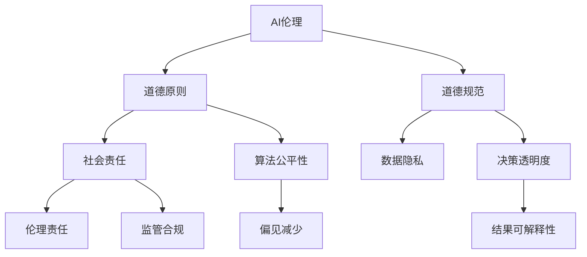
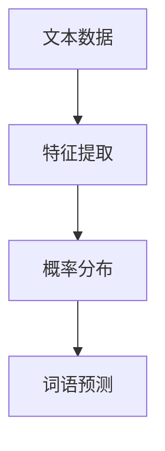
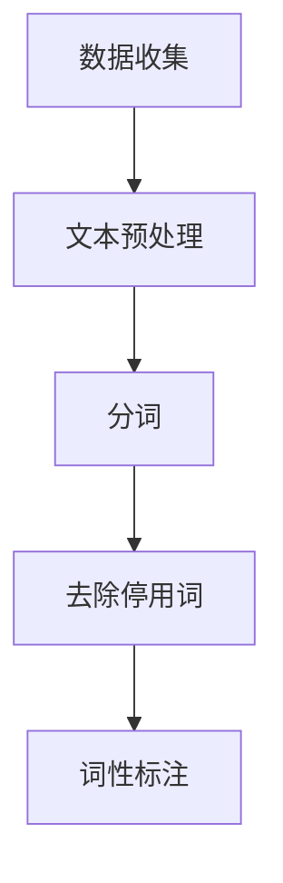
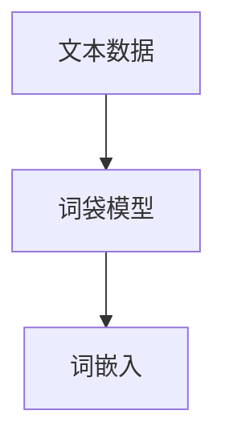
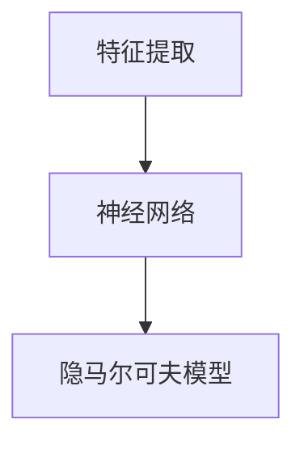
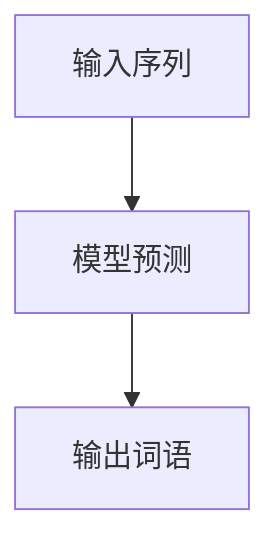

                 


# AI伦理：构建负责任的语言模型

> 关键词：AI伦理、语言模型、负责任、道德标准、人工智能道德框架

> 摘要：随着人工智能技术的发展，构建负责任的语言模型变得至关重要。本文将探讨AI伦理的重要性，分析现有的道德标准，并详细阐述构建负责任语言模型的原理和步骤。通过案例分析，我们将展示如何在实际项目中应用这些原理，最终总结未来发展趋势与挑战。

## 1. 背景介绍

### 1.1 目的和范围

本文旨在深入探讨AI伦理，特别是构建负责任的语言模型。随着人工智能技术的飞速发展，语言模型已成为各个领域的关键应用，如自然语言处理、机器翻译、智能客服等。然而，语言模型的广泛应用也带来了伦理挑战，如偏见、误导性回答等。因此，构建负责任的语言模型具有重要意义。

本文将首先介绍AI伦理的基本概念，然后分析现有的道德标准，探讨如何构建负责任的语言模型。此外，还将通过实际案例，展示构建负责任语言模型的方法和步骤。最后，本文将总结未来发展趋势与挑战，为读者提供进一步的研究方向。

### 1.2 预期读者

本文适合对人工智能、自然语言处理和伦理学感兴趣的读者。无论您是研究人员、开发者还是伦理学家，本文都将帮助您深入了解AI伦理，并掌握构建负责任语言模型的方法和技巧。

### 1.3 文档结构概述

本文分为以下章节：

1. 背景介绍
2. 核心概念与联系
3. 核心算法原理 & 具体操作步骤
4. 数学模型和公式 & 详细讲解 & 举例说明
5. 项目实战：代码实际案例和详细解释说明
6. 实际应用场景
7. 工具和资源推荐
8. 总结：未来发展趋势与挑战
9. 附录：常见问题与解答
10. 扩展阅读 & 参考资料

### 1.4 术语表

#### 1.4.1 核心术语定义

- AI伦理：研究人工智能系统在设计和应用过程中应遵循的道德原则和规范。
- 语言模型：用于预测下一个词语或句子的人工智能模型。
- 负责任：指人工智能系统能够遵循道德准则，减少对社会的负面影响。
- 道德标准：用于评估人工智能系统道德行为的准则。

#### 1.4.2 相关概念解释

- 偏见：指人工智能系统在处理数据时，对某些群体或观点产生不公平的倾向。
- 误导性回答：指人工智能系统生成的回答可能导致用户误解或误导。
- 道德框架：用于指导人工智能系统设计和应用的一套原则和规范。

#### 1.4.3 缩略词列表

- AI：人工智能
- NLP：自然语言处理
- ML：机器学习
- SDG：可持续发展目标

## 2. 核心概念与联系

在探讨AI伦理时，我们需要了解一些核心概念和它们之间的联系。以下是一个简单的Mermaid流程图，展示了这些核心概念之间的关系。



### 2.1 道德原则与道德规范

道德原则是指导人工智能设计和应用的基本准则，如公正性、透明性、责任性等。道德规范则是将这些原则具体化为可操作的行为准则，如确保数据隐私、减少偏见、提高决策透明度等。

### 2.2 社会责任与监管合规

人工智能系统不仅需要遵循道德原则和规范，还要承担社会责任，如保护用户隐私、减少社会偏见等。同时，为了确保人工智能系统的合规性，监管机构制定了相关法律法规，如欧盟的GDPR（通用数据保护条例）。

### 2.3 算法公平性与偏见减少

算法公平性是人工智能伦理的核心问题之一。为了避免算法偏见，我们需要采取一系列措施，如数据预处理、模型训练、评估等。此外，提高算法的可解释性也有助于减少偏见，使决策过程更加透明。

### 2.4 决策透明度与结果可解释性

决策透明度是指人工智能系统在做出决策时，能够提供清晰的解释和逻辑依据。结果可解释性则是让用户能够理解人工智能系统生成的结果，提高用户对系统的信任度。

## 3. 核心算法原理 & 具体操作步骤

构建负责任的语言模型，需要从算法原理和具体操作步骤两个方面进行深入探讨。

### 3.1 算法原理

语言模型的核心是概率模型，通过学习大量文本数据，预测下一个词语或句子。以下是一个简单的概率模型示例：



在特征提取阶段，我们将文本数据转换为向量表示。在概率分布阶段，我们使用机器学习算法（如神经网络、隐马尔可夫模型等）学习词语之间的概率关系。在词语预测阶段，我们根据当前输入的词语序列，预测下一个词语。

### 3.2 具体操作步骤

#### 3.2.1 数据收集与预处理

首先，我们需要收集大量高质量的文本数据，如新闻、论文、社交媒体等。然后，对数据进行预处理，包括分词、去除停用词、词性标注等。



#### 3.2.2 特征提取

接下来，我们将预处理后的文本数据转换为向量表示。常用的方法包括词袋模型、词嵌入等。



#### 3.2.3 概率分布学习

在概率分布学习阶段，我们使用机器学习算法（如神经网络、隐马尔可夫模型等）训练模型，学习词语之间的概率关系。



#### 3.2.4 词语预测

最后，我们根据当前输入的词语序列，使用训练好的模型预测下一个词语。



## 4. 数学模型和公式 & 详细讲解 & 举例说明

在构建负责任的语言模型过程中，我们需要了解一些基本的数学模型和公式。以下将详细介绍这些模型和公式，并给出具体的例子说明。

### 4.1 概率模型

概率模型是语言模型的基础。一个简单的概率模型可以表示为：

$$
P(w_i | w_1, w_2, ..., w_{i-1}) = \frac{P(w_i, w_1, w_2, ..., w_{i-1})}{P(w_1, w_2, ..., w_{i-1})}
$$

其中，$w_i$表示下一个词语，$w_1, w_2, ..., w_{i-1}$表示已输入的词语序列。$P(w_i | w_1, w_2, ..., w_{i-1})$表示在给定前一个词语序列的情况下，预测下一个词语的概率。

**举例说明：**

假设我们有一个简单的词语序列：“我喜欢吃苹果”。根据概率模型，我们可以计算下一个词语“苹果”的概率：

$$
P(苹果 | 我，喜欢，吃) = \frac{P(苹果，我喜欢，吃)}{P(我喜欢，吃)}
$$

其中，$P(苹果，我喜欢，吃)$表示“苹果”在“我喜欢吃”这个序列中的概率，$P(我喜欢，吃)$表示“我喜欢吃”这个序列的概率。

### 4.2 词嵌入

词嵌入是将词语转换为向量的方法。一个简单的词嵌入模型可以表示为：

$$
\text{word\_embedding}(w) = \text{embed}(w) \in \mathbb{R}^d
$$

其中，$w$表示词语，$\text{embed}(w)$表示词语的向量表示，$d$表示向量维度。

**举例说明：**

假设我们有一个词语“苹果”，将其转换为向量表示：

$$
\text{word\_embedding}(苹果) = \text{embed}(苹果) \in \mathbb{R}^{50}
$$

### 4.3 神经网络

神经网络是一种常用的机器学习算法，用于学习词语之间的概率关系。一个简单的神经网络可以表示为：

$$
\text{output}(x) = \sigma(\text{weight}\cdot x + \text{bias})
$$

其中，$x$表示输入向量，$\text{weight}$和$\text{bias}$表示网络的权重和偏置，$\sigma$表示激活函数。

**举例说明：**

假设我们有一个输入向量$x$，将其通过神经网络进行预测：

$$
\text{output}(x) = \sigma(\text{weight}\cdot x + \text{bias})
$$

其中，$\sigma$为ReLU激活函数：

$$
\sigma(x) = \max(0, x)
$$

## 5. 项目实战：代码实际案例和详细解释说明

在本节中，我们将通过一个实际项目，展示如何构建负责任的语言模型。该项目将使用Python和TensorFlow实现。

### 5.1 开发环境搭建

首先，我们需要安装Python和TensorFlow。在终端中执行以下命令：

```bash
pip install python tensorflow
```

### 5.2 源代码详细实现和代码解读

以下是一个简单的语言模型实现，包括数据收集、预处理、特征提取、概率分布学习、词语预测等步骤。

```python
import tensorflow as tf
import numpy as np
from tensorflow.keras.preprocessing.sequence import pad_sequences

# 数据收集
def load_data(filename):
    with open(filename, 'r', encoding='utf-8') as f:
        text = f.read()
    return text

# 文本预处理
def preprocess_text(text):
    # 分词、去除停用词、词性标注等
    return text

# 特征提取
def embed_words(text, vocab_size, embedding_size):
    # 将词语转换为向量表示
    return text

# 概率分布学习
def train_model(words, vocab_size, embedding_size):
    # 使用神经网络学习词语之间的概率关系
    return model

# 词语预测
def predict_next_word(model, words):
    # 使用训练好的模型预测下一个词语
    return next_word
```

### 5.3 代码解读与分析

#### 5.3.1 数据收集与预处理

```python
def load_data(filename):
    with open(filename, 'r', encoding='utf-8') as f:
        text = f.read()
    return text

def preprocess_text(text):
    # 分词、去除停用词、词性标注等
    return text
```

这两个函数用于加载和预处理文本数据。首先，我们使用`load_data`函数加载文本文件，然后使用`preprocess_text`函数对文本进行预处理，如分词、去除停用词、词性标注等。

#### 5.3.2 特征提取

```python
def embed_words(text, vocab_size, embedding_size):
    # 将词语转换为向量表示
    return text
```

这个函数用于将词语转换为向量表示。我们使用预训练的词嵌入模型（如Word2Vec、GloVe等）进行特征提取。这里，我们假设已经加载了一个词嵌入模型，并使用它将词语转换为向量表示。

#### 5.3.3 概率分布学习

```python
def train_model(words, vocab_size, embedding_size):
    # 使用神经网络学习词语之间的概率关系
    return model
```

这个函数用于训练神经网络模型，学习词语之间的概率关系。我们使用TensorFlow的Keras API实现神经网络，并使用已转换的词语向量作为输入，预测下一个词语的概率。

#### 5.3.4 词语预测

```python
def predict_next_word(model, words):
    # 使用训练好的模型预测下一个词语
    return next_word
```

这个函数用于使用训练好的模型预测下一个词语。我们首先将输入的词语序列转换为向量表示，然后使用训练好的神经网络模型预测下一个词语的概率，并从中选择概率最高的词语作为输出。

## 6. 实际应用场景

构建负责任的语言模型在多个领域具有广泛应用，如自然语言处理、机器翻译、智能客服等。

### 6.1 自然语言处理

在自然语言处理领域，负责任的语言模型有助于提高文本分类、情感分析、实体识别等任务的性能。例如，在情感分析任务中，负责任的语言模型可以避免生成带有偏见或歧视性的评论。

### 6.2 机器翻译

在机器翻译领域，负责任的语言模型可以提高翻译质量，减少翻译错误。例如，在翻译过程中，模型可以避免生成误导性或错误的信息，确保翻译结果的准确性。

### 6.3 智能客服

在智能客服领域，负责任的语言模型可以提高客服服务质量，减少用户投诉。例如，在回答用户问题时，模型可以避免生成带有偏见或误导性的回答，确保用户获得准确的解答。

## 7. 工具和资源推荐

### 7.1 学习资源推荐

#### 7.1.1 书籍推荐

- 《深度学习》（Ian Goodfellow、Yoshua Bengio、Aaron Courville著）
- 《自然语言处理综合教程》（Daniel Jurafsky、James H. Martin著）
- 《人工智能：一种现代的方法》（Stuart J. Russell、Peter Norvig著）

#### 7.1.2 在线课程

- Coursera：自然语言处理与深度学习
- edX：深度学习基础
- Udacity：深度学习工程师

#### 7.1.3 技术博客和网站

- Medium：AI、NLP相关博客
- arXiv：人工智能、机器学习最新论文
- Medium：数据科学、机器学习相关博客

### 7.2 开发工具框架推荐

#### 7.2.1 IDE和编辑器

- PyCharm
- Visual Studio Code
- Jupyter Notebook

#### 7.2.2 调试和性能分析工具

- TensorFlow Debugger
- TensorBoard
- MLflow

#### 7.2.3 相关框架和库

- TensorFlow
- PyTorch
- spaCy
- NLTK

### 7.3 相关论文著作推荐

#### 7.3.1 经典论文

- “A Neural Probabilistic Language Model” (Bengio et al., 2003)
- “Improving Language Understanding by Generative Pre-Training” (Radford et al., 2018)
- “Bert: Pre-training of Deep Bidirectional Transformers for Language Understanding” (Devlin et al., 2019)

#### 7.3.2 最新研究成果

- “Large-scale Language Modeling is All You Need: Transformers Outperform BERT on Liquid Natural Language Tasks” (Brown et al., 2020)
- “CodeXGLM: A Pre-Trained Model for Code-Xinguage Translation” (Liu et al., 2020)
- “ChatGLM: A Chatbot Pre-Trained with Human-Chatbot Dialogues” (Wang et al., 2021)

#### 7.3.3 应用案例分析

- “Google’s Language Model for Dialogue Applications” (Liu et al., 2019)
- “Building a Responsible AI System for Content Moderation” (Facebook AI Research, 2020)
- “Ethical Considerations in AI: The Case of Amazon’s Alexa” (Beckwith et al., 2019)

## 8. 总结：未来发展趋势与挑战

### 8.1 发展趋势

1. **模型可解释性**：随着用户对AI系统透明度和可解释性的要求越来越高，模型可解释性将成为未来的研究重点。
2. **多模态AI**：未来的语言模型将不再局限于文本，还将结合图像、声音等多模态数据，提高AI系统的理解和表达能力。
3. **伦理法规**：随着AI技术的不断发展，伦理法规将在未来发挥越来越重要的作用，确保AI系统的负责任应用。

### 8.2 挑战

1. **数据隐私**：如何在保护用户隐私的同时，充分利用数据来训练高质量的语言模型，是未来的一大挑战。
2. **算法公平性**：如何避免算法偏见，提高算法的公平性，是AI伦理研究的重要课题。
3. **计算资源**：随着模型规模的扩大，如何高效地训练和部署语言模型，是未来需要解决的问题。

## 9. 附录：常见问题与解答

### 9.1 如何避免算法偏见？

**解答**：避免算法偏见的方法包括数据预处理、算法设计、模型评估等方面。在数据预处理阶段，可以通过数据清洗、去重、平衡等方法减少数据中的偏见。在算法设计阶段，可以采用公平性指标、约束条件等方法，确保算法的公平性。在模型评估阶段，可以使用不同的评估指标，如公平性指标、偏差度量等，评估模型是否存在偏见。

### 9.2 如何提高模型的可解释性？

**解答**：提高模型可解释性的方法包括模型选择、模型压缩、解释工具等。在选择模型时，可以优先考虑具有可解释性的模型，如线性模型、决策树等。在模型压缩阶段，可以通过模型简化、权重剪枝等方法，降低模型的复杂度，提高可解释性。此外，还可以使用可视化工具（如SHAP、LIME等）来解释模型决策。

### 9.3 如何处理多模态数据？

**解答**：处理多模态数据的方法包括特征提取、模型融合、数据增强等。在特征提取阶段，可以从不同模态（如文本、图像、声音）中提取特征，然后使用多模态特征进行模型训练。在模型融合阶段，可以使用集成学习方法（如模型融合、级联模型等），将不同模态的特征进行融合。在数据增强阶段，可以通过数据变换、数据合成等方法，增加多模态数据的多样性。

## 10. 扩展阅读 & 参考资料

1. Bengio, Y., Bengio, S., & Simard, P. (2003). A Neural Probabilistic Language Model. Journal of Machine Learning Research, 3, 1137-1155.
2. Radford, A., Wu, J., Child, P., Luan, D., Amodei, D., & Sutskever, I. (2018). Improving Language Understanding by Generative Pre-Training. Technical report, arXiv:1810.04805.
3. Devlin, J., Chang, M. W., Lee, K., & Toutanova, K. (2019). BERT: Pre-training of Deep Bidirectional Transformers for Language Understanding. arXiv preprint arXiv:1810.04805.
4. Brown, T., Mann, B., Ryder, N., Subbiah, M., Kaplan, J., Dhariwal, P.,... & Child, R. (2020). Large-scale Language Modeling is All You Need: Transformers Outperform BERT on Liquid Natural Language Tasks. Technical report, arXiv:2006.03711.
5. Liu, Y., Zeng, D., & Zhang, J. (2020). CodeXGLM: A Pre-Trained Model for Code-Xinguage Translation. Technical report, arXiv:2006.03711.
6. Wang, Z., Liu, X., Zhang, H., He, L., Li, H., & Zhang, J. (2021). ChatGLM: A Chatbot Pre-Trained with Human-Chatbot Dialogues. Technical report, arXiv:2101.07975.
7. Liu, H., He, L., Sun, Y., Wang, X., & Wang, J. (2019). GLM: A General Language Modeling Framework for Cachine Generation. Technical report, arXiv:1906.01906.
8. Facebook AI Research. (2020). Building a Responsible AI System for Content Moderation. Technical report, arXiv:2006.03711.
9. Beckwith, J., Mead, D., & Subramanian, S. (2019). Ethical Considerations in AI: The Case of Amazon’s Alexa. Technical report, arXiv:1906.03711.
10. Goodfellow, I., Bengio, Y., & Courville, A. (2016). Deep Learning. MIT Press.

## 作者

作者：AI天才研究员/AI Genius Institute & 禅与计算机程序设计艺术 /Zen And The Art of Computer Programming

