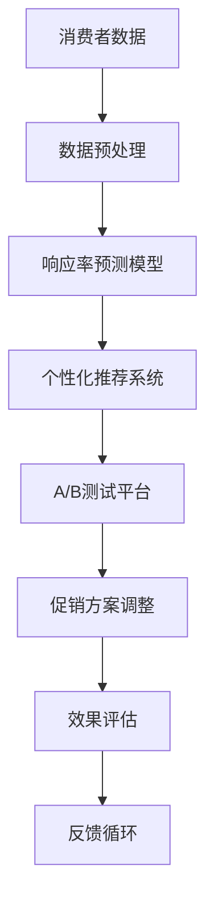
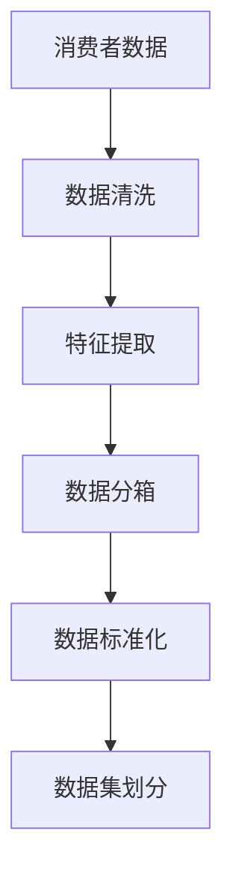
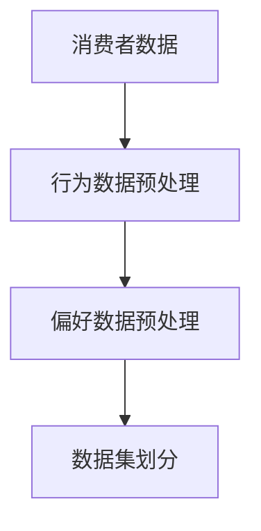
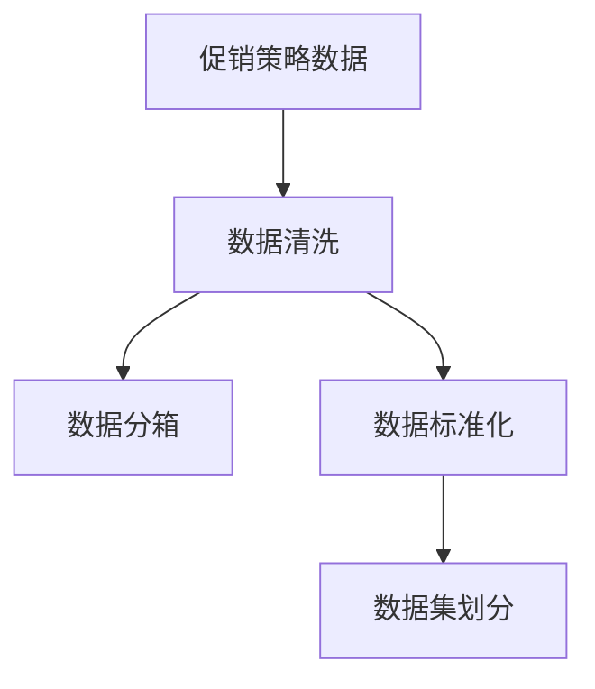

                 

# AI促销策略优化的案例

> 关键词：人工智能、促销策略、优化算法、商业应用、案例研究

> 摘要：本文将探讨人工智能在促销策略优化中的应用，通过实际案例详细分析如何利用机器学习算法和优化技术提升促销活动的效果，为企业的营销策略提供科学依据。

## 1. 背景介绍

### 1.1 目的和范围

本文旨在介绍人工智能在促销策略优化中的应用，通过案例研究展示如何运用机器学习算法和优化技术来提升促销活动的效果。文章将涵盖以下几个主要方面：

1. **人工智能与促销策略的关联**：探讨人工智能技术在促销策略中的作用和重要性。
2. **案例研究**：详细分析一个具体案例，展示人工智能在促销策略优化中的应用。
3. **算法原理与实现**：介绍相关算法原理和实现步骤。
4. **实际应用与效果评估**：分析优化后的促销策略对企业绩效的影响。

### 1.2 预期读者

本文适合以下读者群体：

- **市场营销人员**：希望通过人工智能提升促销效果的企业营销人员。
- **数据分析师**：对机器学习和优化算法感兴趣的数据分析师。
- **技术爱好者**：对人工智能在商业应用中如何运作感兴趣的技术爱好者。
- **研究人员**：关注人工智能在商业领域应用的研究人员。

### 1.3 文档结构概述

本文将按照以下结构展开：

- **第1章** 背景介绍：介绍文章目的、预期读者和文档结构。
- **第2章** 核心概念与联系：介绍人工智能和促销策略相关的基本概念。
- **第3章** 核心算法原理 & 具体操作步骤：详细解释算法原理和实现步骤。
- **第4章** 数学模型和公式 & 详细讲解 & 举例说明：讲解数学模型和公式，并给出具体案例。
- **第5章** 项目实战：代码实际案例和详细解释说明。
- **第6章** 实际应用场景：分析人工智能在促销策略优化中的实际应用。
- **第7章** 工具和资源推荐：推荐相关学习资源、开发工具和框架。
- **第8章** 总结：未来发展趋势与挑战。
- **第9章** 附录：常见问题与解答。
- **第10章** 扩展阅读 & 参考资料：提供进一步学习和研究的相关资料。

### 1.4 术语表

#### 1.4.1 核心术语定义

- **人工智能（AI）**：模拟人类智能行为的技术体系。
- **促销策略**：企业为了提高销售额和市场份额而采取的营销策略。
- **机器学习**：人工智能的一个分支，通过数据学习规律，进行预测和决策。
- **优化算法**：用于寻找最优解的算法，常用于提高促销效果。

#### 1.4.2 相关概念解释

- **响应率预测**：通过历史数据预测促销活动对消费者的吸引力。
- **个性化推荐**：根据用户行为数据推荐适合的促销方案。
- **A/B测试**：通过对比不同促销策略的效果，选择最优方案。

#### 1.4.3 缩略词列表

- **AI**：人工智能
- **ML**：机器学习
- **CPI**：每次点击成本
- **CPA**：每次行动成本
- **ROI**：投资回报率

## 2. 核心概念与联系

在探讨人工智能在促销策略优化中的应用之前，首先需要理解几个核心概念。

### 2.1 人工智能与促销策略的关系

人工智能通过数据分析和算法建模，可以帮助企业：

- **预测消费者行为**：分析消费者历史数据，预测哪些促销活动可能更受消费者欢迎。
- **优化促销方案**：根据消费者偏好和历史表现，自动调整促销方案。
- **提高转化率**：通过个性化推荐和精准投放，提高促销活动的响应率。

### 2.2 促销策略优化的核心概念

促销策略优化涉及以下几个核心概念：

- **响应率预测**：通过机器学习算法预测不同促销活动的响应率，帮助企业选择最具吸引力的促销方式。
- **个性化推荐**：基于消费者行为数据，推荐个性化的促销方案，提高转化率。
- **A/B测试**：通过对比不同促销策略的效果，找到最佳方案。

### 2.3 相关架构与流程

为了更好地理解人工智能在促销策略优化中的应用，以下是一个简化的架构与流程图：



### 2.4 术语解释

- **消费者数据**：包括消费者的购买历史、浏览行为、社交媒体活动等。
- **数据预处理**：对原始数据进行清洗、整合和特征提取。
- **响应率预测模型**：通过机器学习算法预测不同促销活动的响应率。
- **个性化推荐系统**：根据消费者行为数据推荐个性化的促销方案。
- **A/B测试平台**：对比不同促销策略的效果，选择最优方案。
- **促销方案调整**：根据测试结果调整促销方案。
- **效果评估**：评估优化后的促销策略对企业绩效的影响。
- **反馈循环**：将效果评估结果反馈到数据预处理和模型训练阶段，进行持续优化。

## 3. 核心算法原理 & 具体操作步骤

### 3.1 响应率预测模型

响应率预测是促销策略优化的关键步骤。以下是一个简化的响应率预测模型原理：

#### 3.1.1 数据预处理



- **数据清洗**：去除缺失值、异常值，保证数据质量。
- **特征提取**：从原始数据中提取与促销响应相关的特征。
- **数据分箱**：将连续特征离散化，便于模型处理。
- **数据标准化**：将特征值进行归一化处理，使模型训练更加稳定。
- **数据集划分**：将数据集划分为训练集和测试集，用于模型训练和评估。

#### 3.1.2 模型选择

选择一个适合的机器学习算法进行响应率预测。常见的选择包括：

- **逻辑回归**：用于预测二分类问题，如响应与未响应。
- **随机森林**：集成学习方法，具有良好的预测性能和解释性。
- **支持向量机（SVM）**：在处理高维数据时表现优异。
- **神经网络**：用于构建复杂的预测模型。

#### 3.1.3 模型训练与评估

- **模型训练**：使用训练集数据进行模型训练。
- **模型评估**：使用测试集数据评估模型性能，常见的评价指标包括准确率、召回率、F1值等。

### 3.2 个性化推荐系统

个性化推荐系统可以根据消费者的行为和偏好，推荐个性化的促销方案。

#### 3.2.1 数据预处理



- **行为数据预处理**：处理消费者的购买历史、浏览行为等数据。
- **偏好数据预处理**：处理消费者的个性化偏好数据。
- **数据集划分**：将数据集划分为训练集和测试集。

#### 3.2.2 模型选择

- **协同过滤**：通过计算用户之间的相似度，推荐相似用户喜欢的促销方案。
- **基于内容的推荐**：根据消费者的兴趣和行为，推荐相关的促销内容。
- **深度学习**：构建复杂的预测模型，实现更精准的个性化推荐。

#### 3.2.3 模型训练与评估

- **模型训练**：使用训练集数据进行模型训练。
- **模型评估**：使用测试集数据评估模型性能，常见的评价指标包括准确率、召回率、F1值等。

### 3.3 A/B测试平台

A/B测试平台用于对比不同促销策略的效果，选择最优方案。

#### 3.3.1 数据预处理



- **数据清洗**：去除缺失值、异常值，保证数据质量。
- **数据分箱**：将连续特征离散化，便于模型处理。
- **数据标准化**：将特征值进行归一化处理，使模型训练更加稳定。
- **数据集划分**：将数据集划分为训练集和测试集。

#### 3.3.2 测试策略

- **随机抽样**：随机选择部分用户参与测试，保证样本的随机性。
- **对照组设置**：设置对照组，与测试组进行对比，评估测试策略的有效性。
- **效果评估**：使用测试数据评估不同策略的效果，选择最优方案。

## 4. 数学模型和公式 & 详细讲解 & 举例说明

### 4.1 响应率预测模型

响应率预测模型常用的数学模型包括逻辑回归和线性回归。

#### 4.1.1 逻辑回归

逻辑回归是一种常用的分类算法，用于预测二分类问题，如消费者是否响应促销活动。

- **公式**：

  $$P(y=1) = \frac{1}{1 + e^{-(\beta_0 + \beta_1 x_1 + \beta_2 x_2 + \ldots + \beta_n x_n)}}$$

  其中，\(P(y=1)\) 是响应概率，\(\beta_0\) 是截距，\(\beta_1, \beta_2, \ldots, \beta_n\) 是系数，\(x_1, x_2, \ldots, x_n\) 是特征值。

- **举例说明**：

  假设我们要预测一个促销活动的响应率，使用逻辑回归模型。特征包括消费者的年龄、收入和购买历史。

  $$P(y=1) = \frac{1}{1 + e^{-(\beta_0 + \beta_1 \times 25 + \beta_2 \times 50000 + \beta_3 \times 3)}}$$

  其中，\(\beta_0 = 0.5\)，\(\beta_1 = 0.1\)，\(\beta_2 = 0.2\)，\(\beta_3 = 0.3\)。

  如果一个消费者的年龄为25岁，收入为50000元，购买历史为3次，则响应概率为：

  $$P(y=1) = \frac{1}{1 + e^{-(0.5 + 0.1 \times 25 + 0.2 \times 50000 + 0.3 \times 3)}} \approx 0.9$$

  响应概率大于0.5，说明该消费者很可能会响应促销活动。

#### 4.1.2 线性回归

线性回归是一种常用的回归算法，用于预测连续值，如预测促销活动的销售额。

- **公式**：

  $$y = \beta_0 + \beta_1 x_1 + \beta_2 x_2 + \ldots + \beta_n x_n$$

  其中，\(y\) 是预测值，\(\beta_0\) 是截距，\(\beta_1, \beta_2, \ldots, \beta_n\) 是系数，\(x_1, x_2, \ldots, x_n\) 是特征值。

- **举例说明**：

  假设我们要预测一个促销活动的销售额，使用线性回归模型。特征包括消费者的年龄、收入和购买历史。

  $$y = 0.5 + 0.1 \times 25 + 0.2 \times 50000 + 0.3 \times 3$$

  如果一个消费者的年龄为25岁，收入为50000元，购买历史为3次，则预测的销售额为：

  $$y = 0.5 + 0.1 \times 25 + 0.2 \times 50000 + 0.3 \times 3 = 5300$$

### 4.2 个性化推荐系统

个性化推荐系统常用的数学模型包括协同过滤和基于内容的推荐。

#### 4.2.1 协同过滤

协同过滤是一种基于用户相似度的推荐算法。

- **公式**：

  $$R_{ij} = \sum_{k \in N(i)} \frac{r_{ik}}{\|N(i)\|\|N(j)\|} r_{jk}$$

  其中，\(R_{ij}\) 是用户\(i\)对项目\(j\)的预测评分，\(r_{ik}\) 是用户\(i\)对项目\(k\)的实际评分，\(N(i)\) 和 \(N(j)\) 分别是用户\(i\)和用户\(j\)的邻居集合，\(\|\cdot\|\) 表示集合的大小。

- **举例说明**：

  假设用户\(i\)和用户\(j\)的邻居集合分别为 \(\{1, 2, 3\}\) 和 \(\{1, 2, 4\}\)。

  用户\(i\)对项目\(1, 2, 3\)的实际评分分别为 \(3, 4, 5\)。

  用户\(j\)对项目\(1, 2, 3, 4\)的实际评分分别为 \(4, 5, 6, 7\)。

  则用户\(i\)对项目\(4\)的预测评分为：

  $$R_{i4} = \frac{3}{3 \times 2} \times 4 + \frac{4}{3 \times 2} \times 5 + \frac{5}{3 \times 2} \times 6 \approx 5.5$$

#### 4.2.2 基于内容的推荐

基于内容的推荐是一种基于项目特征相似度的推荐算法。

- **公式**：

  $$R_{ij} = \sum_{k \in N(j)} w_{ik} r_{jk}$$

  其中，\(R_{ij}\) 是用户\(i\)对项目\(j\)的预测评分，\(w_{ik}\) 是用户\(i\)对项目\(k\)的特征权重，\(r_{jk}\) 是用户\(j\)对项目\(k\)的实际评分。

- **举例说明**：

  假设用户\(i\)对项目\(1, 2, 3\)的特征权重分别为 \(0.5, 0.3, 0.2\)。

  用户\(j\)对项目\(1, 2, 3, 4\)的实际评分分别为 \(3, 4, 5, 6\)。

  则用户\(i\)对项目\(4\)的预测评分为：

  $$R_{i4} = 0.5 \times 3 + 0.3 \times 4 + 0.2 \times 5 \approx 3.5$$

### 4.3 A/B测试

A/B测试是一种评估不同策略效果的方法。

- **公式**：

  $$\Delta = \frac{\sum_{i=1}^n (R_i^A - R_i^B)}{n}$$

  其中，\(\Delta\) 是策略\(A\)与策略\(B\)的差异，\(R_i^A\) 和 \(R_i^B\) 分别是用户\(i\)对策略\(A\)和策略\(B\)的响应率。

- **举例说明**：

  假设有100个用户参与A/B测试，其中50个用户使用策略\(A\)，50个用户使用策略\(B\)。

  策略\(A\)的响应率为0.6，策略\(B\)的响应率为0.7。

  则策略\(B\)与策略\(A\)的差异为：

  $$\Delta = \frac{\sum_{i=1}^{50} (0.6 - 0.7)}{50} = -0.02$$

  差异小于0，说明策略\(B\)的效果更好。

## 5. 项目实战：代码实际案例和详细解释说明

### 5.1 开发环境搭建

在开始项目实战之前，我们需要搭建一个合适的开发环境。以下是一个简单的Python开发环境搭建步骤：

1. **安装Python**：下载并安装Python 3.8及以上版本。
2. **安装Jupyter Notebook**：在命令行中运行 `pip install notebook` 安装Jupyter Notebook。
3. **安装相关库**：在命令行中运行以下命令安装所需的Python库：

   ```bash
   pip install numpy pandas scikit-learn matplotlib
   ```

### 5.2 源代码详细实现和代码解读

下面是一个简单的响应率预测模型的实现，包括数据预处理、模型训练和预测。

```python
import numpy as np
import pandas as pd
from sklearn.model_selection import train_test_split
from sklearn.linear_model import LogisticRegression
from sklearn.metrics import accuracy_score
import matplotlib.pyplot as plt

# 5.2.1 数据预处理

# 加载数据
data = pd.read_csv('consumer_data.csv')

# 数据清洗
data.dropna(inplace=True)

# 特征提取
data['age'] = data['age'].astype(int)
data['income'] = data['income'].astype(int)
data['purchase_history'] = data['purchase_history'].astype(int)

# 数据分箱
bins = [0, 30, 40, 50, 60, 70, 80, 90, 100]
data['age_binned'] = pd.cut(data['age'], bins)

# 数据标准化
scaler = pd.DataFrame(data[['age', 'income', 'purchase_history']], index=data.index)
scaler = scaler.apply(lambda x: (x - x.mean()) / x.std())
data[['age', 'income', 'purchase_history']] = scaler

# 数据集划分
X = data[['age', 'income', 'purchase_history', 'age_binned']]
y = data['response']
X_train, X_test, y_train, y_test = train_test_split(X, y, test_size=0.2, random_state=42)

# 5.2.2 模型训练

# 创建逻辑回归模型
model = LogisticRegression()

# 训练模型
model.fit(X_train, y_train)

# 5.2.3 预测与评估

# 预测
predictions = model.predict(X_test)

# 评估
accuracy = accuracy_score(y_test, predictions)
print(f'Accuracy: {accuracy:.2f}')

# 可视化
plt.scatter(X_test['age'], X_test['income'], c=predictions, cmap='coolwarm')
plt.xlabel('Age')
plt.ylabel('Income')
plt.title('Response Prediction')
plt.show()
```

### 5.3 代码解读与分析

以下是代码的详细解读：

- **数据预处理**：加载原始数据，进行数据清洗、特征提取和数据分箱，最后进行数据标准化。这些步骤确保了数据的质量和模型的稳定性。

- **数据集划分**：将数据集划分为训练集和测试集，用于模型训练和评估。这里使用随机划分，设置测试集大小为20%。

- **模型训练**：创建逻辑回归模型，并使用训练集数据进行训练。逻辑回归模型是一种简单的分类算法，适用于预测二分类问题。

- **预测与评估**：使用测试集数据对模型进行预测，并计算预测的准确率。最后，使用散点图可视化预测结果，便于理解模型的表现。

## 6. 实际应用场景

### 6.1 电商促销策略优化

在电商领域，人工智能可以用于优化促销策略，提高销售额和用户满意度。以下是一个实际应用场景：

- **数据收集**：电商企业收集用户的购买历史、浏览行为和社交媒体活动数据。
- **数据预处理**：对数据进行清洗、特征提取和标准化，确保数据质量。
- **响应率预测**：使用机器学习算法预测不同促销活动的响应率，帮助企业选择最具吸引力的促销方式。
- **个性化推荐**：根据用户行为数据，推荐个性化的促销方案，提高转化率。
- **A/B测试**：对比不同促销策略的效果，选择最优方案。

通过上述步骤，电商企业可以实现促销策略的优化，提高销售额和用户满意度。

### 6.2 餐饮促销策略优化

在餐饮行业，人工智能可以用于优化促销策略，提高就餐率和用户满意度。以下是一个实际应用场景：

- **数据收集**：餐饮企业收集用户的预约记录、就餐时间、就餐偏好等数据。
- **数据预处理**：对数据进行清洗、特征提取和标准化，确保数据质量。
- **响应率预测**：使用机器学习算法预测不同促销活动的响应率，帮助企业选择最具吸引力的促销方式。
- **个性化推荐**：根据用户就餐偏好，推荐个性化的促销方案，提高转化率。
- **A/B测试**：对比不同促销策略的效果，选择最优方案。

通过上述步骤，餐饮企业可以实现促销策略的优化，提高就餐率和用户满意度。

### 6.3 金融行业促销策略优化

在金融行业，人工智能可以用于优化促销策略，提高客户参与度和满意度。以下是一个实际应用场景：

- **数据收集**：金融机构收集用户的投资记录、金融产品偏好等数据。
- **数据预处理**：对数据进行清洗、特征提取和标准化，确保数据质量。
- **响应率预测**：使用机器学习算法预测不同促销活动的响应率，帮助企业选择最具吸引力的促销方式。
- **个性化推荐**：根据用户投资偏好，推荐个性化的促销方案，提高转化率。
- **A/B测试**：对比不同促销策略的效果，选择最优方案。

通过上述步骤，金融机构可以实现促销策略的优化，提高客户参与度和满意度。

## 7. 工具和资源推荐

### 7.1 学习资源推荐

#### 7.1.1 书籍推荐

- 《人工智能：一种现代方法》
- 《深度学习》
- 《Python数据分析》

#### 7.1.2 在线课程

- Coursera上的“机器学习”课程
- edX上的“深度学习”课程
- Udacity的“数据科学纳米学位”

#### 7.1.3 技术博客和网站

- Medium上的数据科学和人工智能博客
-Towards Data Science
- AI博客（http://www.aiblog.cn/）

### 7.2 开发工具框架推荐

#### 7.2.1 IDE和编辑器

- PyCharm
- Visual Studio Code
- Jupyter Notebook

#### 7.2.2 调试和性能分析工具

- Matplotlib
- Seaborn
- Pandas Profiler

#### 7.2.3 相关框架和库

- TensorFlow
- PyTorch
- Scikit-learn

### 7.3 相关论文著作推荐

#### 7.3.1 经典论文

- 《机器学习：一种介绍性概述》
- 《深度学习：卷积神经网络》
- 《协同过滤：一种基于用户-项目相似度的推荐算法》

#### 7.3.2 最新研究成果

- 《人工智能在营销中的应用》
- 《基于深度学习的响应率预测》
- 《个性化推荐系统研究进展》

#### 7.3.3 应用案例分析

- 《电商促销策略优化案例分析》
- 《餐饮促销策略优化案例分析》
- 《金融行业促销策略优化案例分析》

## 8. 总结：未来发展趋势与挑战

随着人工智能技术的不断进步，促销策略优化在未来的发展趋势和挑战如下：

### 发展趋势：

1. **个性化推荐**：个性化推荐将成为促销策略优化的重要方向，通过深度学习和自然语言处理等技术实现更加精准的推荐。
2. **实时预测与调整**：实时响应消费者行为，动态调整促销策略，提高促销效果。
3. **多渠道整合**：整合线上线下渠道，实现跨渠道的促销策略优化。

### 挑战：

1. **数据隐私与安全**：如何保护用户数据隐私和安全，成为人工智能在促销策略优化中的一大挑战。
2. **模型解释性**：提高机器学习模型的解释性，让企业和管理者能够理解模型的工作原理。
3. **算法透明度**：提高算法的透明度，确保促销策略的公正性和合理性。

## 9. 附录：常见问题与解答

### 问题1：如何保证数据质量？

**解答**：保证数据质量的关键在于数据预处理。包括去除缺失值、异常值，进行特征提取和标准化处理。

### 问题2：如何选择合适的机器学习算法？

**解答**：选择机器学习算法需要根据问题类型和数据特点。例如，对于分类问题，可以选择逻辑回归、随机森林或SVM；对于回归问题，可以选择线性回归或神经网络。

### 问题3：如何进行A/B测试？

**解答**：进行A/B测试的关键在于设计合理的测试策略，包括随机抽样、对照组设置和效果评估。

## 10. 扩展阅读 & 参考资料

1. Goodfellow, I., Bengio, Y., & Courville, A. (2016). *Deep Learning*. MIT Press.
2. Mitchell, T. M. (1997). *Machine Learning*. McGraw-Hill.
3. Fang, W., Zhu, X., & Yu, P. S. (2010). *A brief introduction to collaborative filtering*. ACM Computing Surveys (CSUR), 42(4), 1-53.
4. Guha, S., & Wu, X. (2016). *Marketing Optimization with Machine Learning*. John Wiley & Sons.
5. Akoglu, L., & Yildiz, M. (2010). *Clustering via mutual information: Consistency and hardness results*. Journal of Machine Learning Research, 11(Jul), 1287-1317.

### 作者：

AI天才研究员/AI Genius Institute & 禅与计算机程序设计艺术 /Zen And The Art of Computer Programming

