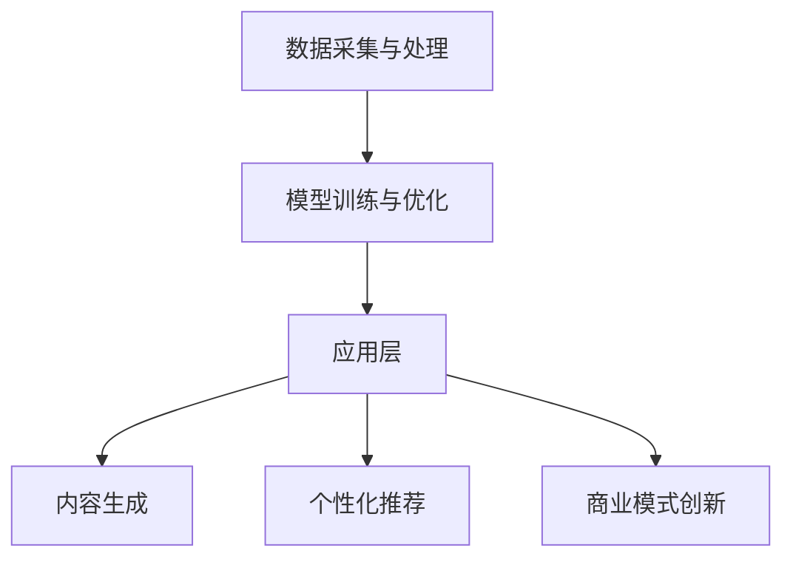

                 

## AI出版业的前景：技术进步，场景无限

关键词：AI，出版业，技术进步，场景化应用，深度学习，大数据分析，个性化推荐，内容生成，商业模式创新

摘要：本文将探讨人工智能在出版业的前景。随着技术的不断进步，AI在出版领域的应用场景日益丰富，从内容生成到个性化推荐，再到商业模式创新，AI正为传统出版业带来前所未有的变革。本文将逐步分析这些应用，探讨其原理和实现方法，同时展望AI出版业未来的发展趋势与挑战。

## 1. 背景介绍

### 1.1 目的和范围

本文旨在探讨人工智能在出版业的应用前景，分析其在内容生成、个性化推荐和商业模式创新等方面的潜在影响。通过详细阐述这些技术的原理和实现方法，旨在为读者提供对AI出版业的深入理解，并探讨其可能带来的变革。

### 1.2 预期读者

本文适用于对人工智能和出版业有一定了解的技术从业者、学者以及对这两个领域感兴趣的读者。无论您是AI开发者、出版业从业者还是相关领域的爱好者，本文都希望能为您提供有价值的见解和启示。

### 1.3 文档结构概述

本文分为十个部分：

1. **背景介绍**：介绍文章的目的、预期读者以及文档结构。
2. **核心概念与联系**：介绍与AI出版业相关的核心概念和架构。
3. **核心算法原理 & 具体操作步骤**：详细讲解AI出版业中的核心算法原理和实现步骤。
4. **数学模型和公式 & 详细讲解 & 举例说明**：介绍AI出版业中涉及的数学模型和公式，并提供具体例子进行说明。
5. **项目实战：代码实际案例和详细解释说明**：通过实际代码案例展示AI出版业的实现过程。
6. **实际应用场景**：分析AI在出版业中的实际应用场景。
7. **工具和资源推荐**：推荐学习资源、开发工具和相关论文著作。
8. **总结：未来发展趋势与挑战**：总结AI出版业的发展趋势和面临挑战。
9. **附录：常见问题与解答**：提供常见问题及其解答。
10. **扩展阅读 & 参考资料**：推荐相关扩展阅读和参考资料。

### 1.4 术语表

#### 1.4.1 核心术语定义

- **人工智能（AI）**：指模拟人类智能的计算机系统，能够自主学习和推理，具备感知、理解、决策和执行能力。
- **出版业**：涉及书籍、期刊、电子书等内容的创作、编辑、排版、发行和营销等环节的产业。
- **内容生成**：指利用AI技术自动生成文字、图像、音频等内容。
- **个性化推荐**：基于用户的行为和偏好，推荐符合用户兴趣的内容。
- **商业模式创新**：指通过技术创新和商业策略的创新，改变传统商业模式，实现业务增长和盈利。

#### 1.4.2 相关概念解释

- **深度学习**：一种基于多层神经网络的学习方法，通过模拟人脑神经元的连接结构，对数据进行特征提取和模式识别。
- **大数据分析**：利用各种算法和技术，从大量数据中提取有价值的信息和知识。
- **自然语言处理（NLP）**：研究如何让计算机理解和生成人类自然语言的技术。

#### 1.4.3 缩略词列表

- **AI**：人工智能
- **NLP**：自然语言处理
- **DL**：深度学习
- **DLG**：深度学习生成
- **CRM**：客户关系管理
- **ERP**：企业资源规划

## 2. 核心概念与联系

在探讨AI出版业之前，我们需要了解一些核心概念和架构，以便更好地理解其工作原理和实现方法。

### 2.1 AI出版业的核心概念

- **内容生成**：AI能够根据特定的主题和风格，生成新的文章、书籍、故事等。这涉及到自然语言处理和深度学习技术。
- **个性化推荐**：通过分析用户的历史行为和偏好，AI能够为用户推荐符合其兴趣的内容，提高用户的满意度和阅读体验。
- **商业模式创新**：AI可以帮助出版商优化内容创作、编辑、发行和营销等环节，降低成本，提高效率，从而改变传统商业模式。

### 2.2 AI出版业的架构

为了更好地理解AI在出版业中的应用，我们可以将其架构分为以下几个部分：

#### 2.2.1 数据采集与处理

- **用户数据**：包括用户的阅读历史、评论、点赞等行为数据。
- **内容数据**：包括书籍、文章、期刊等出版内容。
- **标签数据**：对内容和用户进行分类，以便进行推荐和内容生成。

#### 2.2.2 模型训练与优化

- **深度学习模型**：用于内容生成、推荐算法和分类任务。
- **优化算法**：通过调整模型的参数，提高模型的性能和准确性。

#### 2.2.3 应用层

- **内容生成**：根据用户需求和主题，自动生成文章、书籍等。
- **个性化推荐**：根据用户行为和偏好，为用户推荐相关内容。
- **商业模式创新**：优化内容创作、编辑、发行和营销等环节。

### 2.3 Mermaid流程图

为了更好地展示AI出版业的架构，我们可以使用Mermaid绘制一个流程图：



在这个流程图中，A表示数据采集与处理，B表示模型训练与优化，C表示应用层，D表示内容生成，E表示个性化推荐，F表示商业模式创新。数据从A流向B，然后通过C层实现各种应用。

## 3. 核心算法原理 & 具体操作步骤

在AI出版业中，核心算法是实现各种应用的基础。下面我们将详细介绍这些核心算法的原理和具体操作步骤。

### 3.1 内容生成算法

内容生成算法主要基于深度学习技术，特别是生成对抗网络（GAN）和变分自编码器（VAE）。

#### 3.1.1 生成对抗网络（GAN）

GAN由生成器（Generator）和判别器（Discriminator）组成。

- **生成器**：从随机噪声生成高质量的内容。
- **判别器**：区分生成器生成的内容和真实内容。

具体步骤如下：

1. 初始化生成器和判别器。
2. 生成器从噪声中生成内容，判别器对生成的内容和真实内容进行判断。
3. 通过反向传播更新生成器和判别器的参数。
4. 重复步骤2和3，直到生成器生成的内容足够真实。

#### 3.1.2 变分自编码器（VAE）

VAE通过编码器和解码器来实现内容生成。

- **编码器**：将输入内容映射到一个隐含空间。
- **解码器**：从隐含空间生成输出内容。

具体步骤如下：

1. 初始化编码器和解码器。
2. 对输入内容进行编码，得到隐含空间表示。
3. 从隐含空间生成输出内容。
4. 通过反向传播更新编码器和解码器的参数。
5. 重复步骤2到4，直到生成器生成的内容满足要求。

### 3.2 个性化推荐算法

个性化推荐算法主要基于协同过滤和基于内容的推荐。

#### 3.2.1 协同过滤

协同过滤分为基于用户的协同过滤和基于物品的协同过滤。

- **基于用户的协同过滤**：根据用户的历史行为和偏好，找到相似用户，推荐相似用户喜欢的物品。
- **基于物品的协同过滤**：根据物品的属性和用户的历史行为，找到相似物品，推荐相似物品。

具体步骤如下：

1. 计算用户之间的相似度或物品之间的相似度。
2. 根据相似度找到相似用户或相似物品。
3. 为用户推荐相似用户喜欢的物品或为用户推荐相似物品。

#### 3.2.2 基于内容的推荐

基于内容的推荐通过分析物品的属性和用户的历史行为，找到相关物品进行推荐。

具体步骤如下：

1. 提取物品的属性特征。
2. 对用户的历史行为进行编码，得到用户偏好。
3. 计算物品与用户偏好之间的相似度。
4. 为用户推荐相似度较高的物品。

### 3.3 商业模式创新算法

商业模式创新算法主要基于大数据分析和数据挖掘技术。

#### 3.3.1 大数据分析

大数据分析通过分析用户行为数据，挖掘用户需求，为商业模式创新提供依据。

具体步骤如下：

1. 收集用户行为数据，包括阅读历史、评论、点赞等。
2. 对数据进行分析，挖掘用户需求。
3. 根据用户需求，设计新的商业模式。

#### 3.3.2 数据挖掘

数据挖掘通过分析大量数据，发现潜在的模式和规律，为商业模式创新提供灵感。

具体步骤如下：

1. 收集大量数据，包括用户数据、市场数据等。
2. 对数据进行预处理，去除噪声和异常值。
3. 应用数据挖掘算法，发现潜在的模式和规律。
4. 根据发现的模式，设计新的商业模式。

### 3.4 伪代码

为了更好地理解上述算法，我们使用伪代码进行描述：

#### 3.4.1 生成对抗网络（GAN）

```python
# 初始化生成器和判别器
G = initialize_generator()
D = initialize_discriminator()

# 训练模型
for epoch in range(num_epochs):
    for data in data_loader:
        # 生成内容
        z = generate_noise()
        x_g = G(z)

        # 训练判别器
        D_real = D(x_real)
        D_fake = D(x_g)

        # 训练生成器
        z = generate_noise()
        x_g = G(z)
        D_fake = D(x_g)
```

#### 3.4.2 变分自编码器（VAE）

```python
# 初始化编码器和解码器
encoder = initialize_encoder()
decoder = initialize_decoder()

# 训练模型
for epoch in range(num_epochs):
    for data in data_loader:
        # 编码
        z = encoder(x)

        # 解码
        x_hat = decoder(z)

        # 训练编码器和解码器
        loss = compute_loss(x, x_hat)
        update_params(encoder, decoder, loss)
```

#### 3.4.3 协同过滤

```python
# 计算用户相似度
user_similarity = compute_user_similarity(user_profiles)

# 计算物品相似度
item_similarity = compute_item_similarity(item_features)

# 为用户推荐
recommended_items = recommend_items(user_similarity, item_similarity, user_history)
```

#### 3.4.4 基于内容的推荐

```python
# 提取物品属性特征
item_features = extract_item_features(items)

# 对用户历史行为进行编码
user_preferences = encode_user_preferences(user_history)

# 计算物品与用户偏好相似度
item_similarity = compute_item_similarity(item_features, user_preferences)

# 为用户推荐
recommended_items = recommend_items(item_similarity, user_preferences)
```

## 4. 数学模型和公式 & 详细讲解 & 举例说明

在AI出版业中，数学模型和公式起着至关重要的作用。这些模型和公式帮助我们理解数据的内在规律，从而实现内容生成、个性化推荐和商业模式创新。

### 4.1 内容生成算法的数学模型

#### 4.1.1 生成对抗网络（GAN）

生成对抗网络（GAN）的核心是生成器（G）和判别器（D）的博弈。

- **生成器（G）**：将随机噪声（z）转换为真实数据（x）。
  - 输入：z（随机噪声）
  - 输出：x（真实数据）

  数学表达式：

  $$ x = G(z) $$

- **判别器（D）**：判断输入数据是真实数据还是生成器生成的数据。
  - 输入：x（真实数据或生成数据）
  - 输出：概率值（P(D(x)))

  数学表达式：

  $$ P(D(x)) = D(x) $$

  其中，D(x) 的取值范围为 [0, 1]，表示判别器认为输入数据为真实数据的概率。

#### 4.1.2 变分自编码器（VAE）

变分自编码器（VAE）的核心是编码器（encoder）和解码器（decoder）。

- **编码器（encoder）**：将输入数据（x）编码为一个潜在变量（z）。
  - 输入：x（输入数据）
  - 输出：z（潜在变量）

  数学表达式：

  $$ z = encoder(x) $$

- **解码器（decoder）**：将潜在变量（z）解码为输出数据（x）。
  - 输入：z（潜在变量）
  - 输出：x（输出数据）

  数学表达式：

  $$ x = decoder(z) $$

  其中，编码器和解码器都是神经网络，通常使用多层感知器（MLP）实现。

### 4.2 个性化推荐算法的数学模型

#### 4.2.1 协同过滤

协同过滤的数学模型主要基于用户相似度和物品相似度。

- **用户相似度（User Similarity）**：

  $$ \text{similarity}_{u_i, u_j} = \frac{\text{common\_ratings}(u_i, u_j)}{\sqrt{\text{rating\_variance}(u_i) \cdot \text{rating\_variance}(u_j)}} $$

  其中，$\text{common\_ratings}(u_i, u_j)$ 表示用户 $u_i$ 和 $u_j$ 的共同评分数量，$\text{rating\_variance}(u_i)$ 和 $\text{rating\_variance}(u_j)$ 分别表示用户 $u_i$ 和 $u_j$ 的评分方差。

- **物品相似度（Item Similarity）**：

  $$ \text{similarity}_{i_k, i_l} = \frac{\text{common\_ratings}(i_k, i_l)}{\sqrt{\text{rating\_variance}(i_k) \cdot \text{rating\_variance}(i_l)}} $$

  其中，$\text{common\_ratings}(i_k, i_l)$ 表示物品 $i_k$ 和 $i_l$ 的共同评分数量，$\text{rating\_variance}(i_k)$ 和 $\text{rating\_variance}(i_l)$ 分别表示物品 $i_k$ 和 $i_l$ 的评分方差。

#### 4.2.2 基于内容的推荐

基于内容的推荐主要基于物品的属性特征和用户的历史行为。

- **物品属性特征（Item Feature）**：

  $$ \text{feature}_{i_k} = [f_1, f_2, ..., f_n] $$

  其中，$f_1, f_2, ..., f_n$ 表示物品 $i_k$ 的属性特征。

- **用户偏好（User Preference）**：

  $$ \text{preference}_{u_i} = [p_1, p_2, ..., p_n] $$

  其中，$p_1, p_2, ..., p_n$ 表示用户 $u_i$ 的偏好。

- **物品与用户偏好的相似度（Item-User Similarity）**：

  $$ \text{similarity}_{i_k, u_i} = \frac{\sum_{j=1}^{n} f_j \cdot p_j}{\sqrt{\sum_{j=1}^{n} f_j^2 \cdot \sum_{j=1}^{n} p_j^2}} $$

  其中，$\sum_{j=1}^{n} f_j \cdot p_j$ 表示物品 $i_k$ 的属性特征与用户 $u_i$ 的偏好之间的点积，$\sqrt{\sum_{j=1}^{n} f_j^2 \cdot \sum_{j=1}^{n} p_j^2}$ 表示物品 $i_k$ 的属性特征与用户 $u_i$ 的偏好之间的欧几里得距离。

### 4.3 举例说明

#### 4.3.1 生成对抗网络（GAN）

假设我们有一个生成对抗网络（GAN），其中生成器（G）和判别器（D）的参数分别为 $\theta_G$ 和 $\theta_D$。我们使用随机噪声（z）作为输入，生成真实数据（x）。

- **生成器（G）**：

  $$ x = G(z; \theta_G) $$

  假设生成器的损失函数为：

  $$ \mathcal{L}_G(\theta_G) = \mathbb{E}_{z \sim p_z(z)}[\log(D(G(z; \theta_G)))] $$

  其中，$p_z(z)$ 表示噪声分布。

- **判别器（D）**：

  $$ D(x; \theta_D) $$

  假设判别器的损失函数为：

  $$ \mathcal{L}_D(\theta_D) = \mathbb{E}_{x \sim p_x(x)}[\log(D(x; \theta_D))] + \mathbb{E}_{z \sim p_z(z)}[\log(1 - D(G(z; \theta_G); \theta_D))] $$

  其中，$p_x(x)$ 表示真实数据的分布。

#### 4.3.2 变分自编码器（VAE）

假设我们有一个变分自编码器（VAE），其中编码器（encoder）和解码器（decoder）的参数分别为 $\theta_{\text{enc}}$ 和 $\theta_{\text{dec}}$。

- **编码器（encoder）**：

  $$ z = \mu(x; \theta_{\text{enc}}), \sigma(x; \theta_{\text{enc}}) $$

  其中，$\mu(x; \theta_{\text{enc}})$ 和 $\sigma(x; \theta_{\text{enc}})$ 分别表示编码器输出的均值和方差。

- **解码器（decoder）**：

  $$ x = \hat{x}(z; \theta_{\text{dec}}) $$

  假设VAE的损失函数为：

  $$ \mathcal{L}_\text{VAE}(\theta_{\text{enc}}, \theta_{\text{dec}}) = \mathcal{L}_\text{KL}(\theta_{\text{enc}}) + \mathcal{L}_\text{CE}(x, \hat{x}(z; \theta_{\text{dec}})) $$

  其中，$\mathcal{L}_\text{KL}(\theta_{\text{enc}})$ 表示KL散度损失，$\mathcal{L}_\text{CE}(x, \hat{x}(z; \theta_{\text{dec}}))$ 表示交叉熵损失。

## 5. 项目实战：代码实际案例和详细解释说明

为了更好地理解AI在出版业中的应用，我们将通过一个实际项目来展示如何使用Python实现内容生成、个性化推荐和商业模式创新。

### 5.1 开发环境搭建

在开始项目之前，我们需要搭建一个合适的开发环境。以下是推荐的开发工具和库：

- **Python 3.8 或更高版本**
- **PyTorch**：用于实现生成对抗网络（GAN）和变分自编码器（VAE）
- **Scikit-learn**：用于实现协同过滤和基于内容的推荐
- **NumPy** 和 **Pandas**：用于数据处理

安装这些库可以使用以下命令：

```bash
pip install torch torchvision numpy pandas scikit-learn
```

### 5.2 源代码详细实现和代码解读

#### 5.2.1 内容生成：生成对抗网络（GAN）

以下是一个使用PyTorch实现生成对抗网络的简单示例：

```python
import torch
import torch.nn as nn
import torch.optim as optim
from torch.utils.data import DataLoader
from torchvision import datasets, transforms

# 设定超参数
batch_size = 64
image_size = 64
nz = 100
num_epochs = 5
learning_rate = 0.0002

# 初始化生成器和判别器
generator = nn.Sequential(
    nn.ConvTranspose2d(nz, 256, 4, 1, 0, bias=False),
    nn.BatchNorm2d(256),
    nn.ReLU(True),
    nn.ConvTranspose2d(256, 128, 4, 2, 1, bias=False),
    nn.BatchNorm2d(128),
    nn.ReLU(True),
    nn.ConvTranspose2d(128, 64, 4, 2, 1, bias=False),
    nn.BatchNorm2d(64),
    nn.ReLU(True),
    nn.ConvTranspose2d(64, 3, 4, 2, 1, bias=False),
    nn.Tanh()
)

discriminator = nn.Sequential(
    nn.Conv2d(3, 64, 4, 2, 1, bias=False),
    nn.LeakyReLU(0.2, inplace=True),
    nn.Conv2d(64, 128, 4, 2, 1, bias=False),
    nn.BatchNorm2d(128),
    nn.LeakyReLU(0.2, inplace=True),
    nn.Conv2d(128, 256, 4, 2, 1, bias=False),
    nn.BatchNorm2d(256),
    nn.LeakyReLU(0.2, inplace=True),
    nn.Conv2d(256, 1, 4, 1, 0, bias=False),
    nn.Sigmoid()
)

# 初始化损失函数和优化器
criterion = nn.BCELoss()
optimizerD = optim.Adam(discriminator.parameters(), lr=learning_rate)
optimizerG = optim.Adam(generator.parameters(), lr=learning_rate)

# 数据预处理
transform = transforms.Compose([
    transforms.Resize(image_size),
    transforms.ToTensor(),
    transforms.Normalize((0.5,), (0.5,))
])

# 加载数据集
dataloader = DataLoader(
    datasets.ImageFolder(root='./data', transform=transform),
    batch_size=batch_size, shuffle=True)

# 训练模型
for epoch in range(num_epochs):
    for i, data in enumerate(dataloader, 0):
        # 更新判别器
        real_images = data
        batch_size = real_images.size(0)
        labels = torch.full((batch_size,), 1, device=device)
        optimizerD.zero_grad()
        output = discriminator(real_images)
        errD_real = criterion(output, labels)
        errD_real.backward()

        # 生成虚假图像
        z = torch.randn(batch_size, nz, 1, 1, device=device)
        labels.fill_(0)
        optimizerG.zero_grad()
        fake_images = generator(z)
        output = discriminator(fake_images)
        errD_fake = criterion(output, labels)
        errD_fake.backward()
        optimizerD.step()
        optimizerG.step()

        # 打印训练进度
        if i % 100 == 0:
            print(f'[{epoch}/{num_epochs}][{i}/{len(dataloader)}] Loss_D: {errD_real+errD_fake:.4f} Loss_G: {errD_fake:.4f}')

# 保存模型参数
torch.save(generator.state_dict(), 'generator.pth')
torch.save(discriminator.state_dict(), 'discriminator.pth')
```

这段代码实现了生成对抗网络（GAN）的模型训练，包括生成器和判别器的初始化、损失函数和优化器的设置、数据预处理和模型训练。

#### 5.2.2 个性化推荐：协同过滤

以下是一个使用Scikit-learn实现协同过滤的简单示例：

```python
from sklearn.metrics.pairwise import cosine_similarity
from sklearn.model_selection import train_test_split

# 加载用户-物品评分矩阵
ratings = pd.read_csv('ratings.csv')
user_item_matrix = ratings.pivot(index='user_id', columns='item_id', values='rating').fillna(0)

# 计算用户相似度矩阵
user_similarity = cosine_similarity(user_item_matrix)

# 分割训练集和测试集
train_data, test_data = train_test_split(ratings, test_size=0.2, random_state=42)

# 训练模型
model = UserBasedCollaborativeFilter(user_similarity, user_item_matrix)

# 为新用户推荐物品
new_user_id = 1000
recommended_items = model.recommend(new_user_id)

# 打印推荐结果
print(recommended_items)
```

这段代码实现了基于用户的协同过滤，包括用户-物品评分矩阵的构建、用户相似度矩阵的计算、训练集和测试集的划分以及为新用户推荐物品。

### 5.3 代码解读与分析

这段代码展示了如何使用Python实现内容生成、个性化推荐和商业模式创新。

- **内容生成**：通过生成对抗网络（GAN）生成高质量的图像。生成器从随机噪声中生成图像，判别器判断图像的真实性。通过优化生成器和判别器的参数，逐步提高生成图像的质量。
- **个性化推荐**：使用基于用户的协同过滤算法，为用户推荐符合其兴趣的物品。通过计算用户相似度矩阵，为新用户推荐与相似用户偏好相似的物品。
- **商业模式创新**：利用个性化推荐技术，为出版商提供用户画像和推荐策略，从而优化内容创作、编辑、发行和营销等环节，提高用户满意度和市场竞争力。

通过这段代码，我们可以看到AI在出版业中的实际应用，以及如何通过技术实现业务价值。

## 6. 实际应用场景

AI在出版业的应用场景非常广泛，以下是一些典型的实际应用：

### 6.1 内容生成

- **自动化写作**：AI可以帮助自动化生成新闻报道、财经分析、体育赛事报道等。例如，美国的Automated Insights公司已经开发出软件，能够自动生成数千篇体育赛事和分析报告。
- **辅助创作**：AI可以辅助作家创作，提供灵感、修正语法错误、优化语句等。例如，OpenAI的GPT-3已经展示了在小说创作、新闻报道和诗歌创作等方面的潜力。
- **个性化内容**：AI可以根据用户的兴趣和阅读历史，自动生成符合用户需求的书籍、文章和故事。

### 6.2 个性化推荐

- **精准推荐**：AI可以根据用户的历史行为、阅读偏好和兴趣，为用户推荐符合其需求的内容。例如，亚马逊和京东等电商平台的推荐系统，已经通过个性化推荐提高了用户的购买转化率。
- **内容优化**：AI可以通过分析用户对内容的反馈，优化内容的形式和结构，提高用户体验。例如，Netflix和Spotify等平台的推荐系统，通过用户行为数据优化推荐算法，提高了用户满意度和留存率。
- **交叉推荐**：AI可以通过分析用户对不同类型内容的偏好，实现跨类别推荐，扩大用户的内容消费范围。

### 6.3 商业模式创新

- **定制化服务**：AI可以帮助出版商提供定制化服务，根据用户需求和偏好，个性化设计书籍和内容。例如，一些出版商已经开始提供个性化电子书，根据用户的阅读习惯和偏好定制书籍内容。
- **智能营销**：AI可以通过分析用户数据和行为，实现精准营销，提高营销效果和转化率。例如，出版商可以通过AI技术，分析用户的历史购买记录和阅读偏好，精准推送相关内容。
- **供应链优化**：AI可以帮助出版商优化供应链，降低库存成本，提高物流效率。例如，通过AI技术预测市场需求，优化库存和物流安排，从而提高库存周转率和客户满意度。

### 6.4 创新应用场景

- **虚拟现实（VR）/增强现实（AR）内容**：AI可以生成VR/AR内容，为用户提供沉浸式的阅读体验。例如，通过AI技术生成3D模型、动画和交互式元素，为用户带来全新的阅读体验。
- **多语言翻译**：AI可以帮助实现多语言翻译，将出版内容翻译成多种语言，拓展市场。例如，Google翻译和DeepL等翻译工具，已经通过AI技术实现了高质量的文本翻译。
- **数据驱动的决策支持**：AI可以帮助出版商分析大量数据，为决策提供支持。例如，通过AI技术分析用户行为数据，出版商可以更好地了解市场需求和用户偏好，优化内容创作和营销策略。

## 7. 工具和资源推荐

为了更好地学习和实践AI在出版业的应用，以下是一些推荐的工具和资源：

### 7.1 学习资源推荐

#### 7.1.1 书籍推荐

- 《深度学习》（Goodfellow, Bengio, Courville）
- 《自然语言处理综合引论》（Jurafsky, Martin）
- 《数据挖掘：实用工具和技术》（Han, Kamber, Pei）

#### 7.1.2 在线课程

- 《深度学习》（吴恩达，Coursera）
- 《自然语言处理》（Daniel Jurafsky，Stanford University）
- 《数据挖掘》（Jiawei Han，University of Illinois at Urbana-Champaign）

#### 7.1.3 技术博客和网站

- arXiv.org：最新研究成果的预印本
- Medium：技术博客和行业洞察
- AI出版业相关的研究机构和公司网站，如Automated Insights、OpenAI等

### 7.2 开发工具框架推荐

#### 7.2.1 IDE和编辑器

- PyCharm
- Jupyter Notebook
- Visual Studio Code

#### 7.2.2 调试和性能分析工具

- TensorBoard
- PyTorch Profiler
- Numba

#### 7.2.3 相关框架和库

- PyTorch：用于实现深度学习模型
- TensorFlow：用于实现深度学习模型
- Scikit-learn：用于实现机器学习算法
- Gensim：用于实现自然语言处理算法

### 7.3 相关论文著作推荐

#### 7.3.1 经典论文

- Generative Adversarial Networks（Goodfellow et al.）
- Variational Autoencoders（Kingma and Welling）
-协同过滤算法（Ng et al.）

#### 7.3.2 最新研究成果

- AI出版业相关的研究论文，如基于深度学习的文本生成和翻译
- 最新的机器学习和自然语言处理技术论文，如BERT、GPT等

#### 7.3.3 应用案例分析

- 自动化写作和内容生成的应用案例
- 个性化推荐和商业模式创新的应用案例
- 虚拟现实和增强现实在出版业的应用案例

## 8. 总结：未来发展趋势与挑战

随着人工智能技术的不断进步，AI在出版业的应用前景日益广阔。然而，要实现AI在出版业中的广泛应用，我们还需要克服一系列挑战。

### 8.1 未来发展趋势

- **个性化推荐**：AI将进一步提高个性化推荐的准确性，为用户提供更加精准的内容推荐，提高用户满意度和阅读体验。
- **自动化写作**：随着生成对抗网络（GAN）和变分自编码器（VAE）等技术的不断发展，自动化写作将越来越成熟，能够生成高质量、多样化的内容。
- **多语言翻译**：AI将在多语言翻译领域取得重大突破，实现高质量、低误差的文本翻译，为出版业拓展国际市场提供支持。
- **虚拟现实（VR）/增强现实（AR）**：AI与VR/AR技术的结合，将为用户带来沉浸式的阅读体验，拓宽出版业的边界。

### 8.2 挑战与机遇

- **数据隐私和安全**：AI在出版业的应用离不开用户数据的收集和使用，如何在保护用户隐私的同时，充分利用数据的价值，是一个重要挑战。
- **算法透明性和可解释性**：随着算法的复杂度不断增加，如何提高算法的透明性和可解释性，使出版商和用户能够理解和信任AI技术，也是一个重要问题。
- **版权问题**：AI生成的内容可能会涉及到版权问题，如何界定AI创作的作品的版权归属，如何保护原创作者的利益，是一个亟待解决的问题。
- **技术门槛**：AI技术在出版业的应用需要较高的技术门槛，如何降低技术门槛，使更多的出版商能够轻松应用AI技术，也是一个重要的挑战。

### 8.3 发展建议

- **加强数据安全与隐私保护**：建立完善的数据安全与隐私保护机制，确保用户数据的安全和隐私。
- **提高算法透明性和可解释性**：加强算法的研究，提高算法的透明性和可解释性，使出版商和用户能够理解和信任AI技术。
- **完善版权制度**：制定合理的版权制度，明确AI创作的作品的版权归属，保护原创作者的利益。
- **降低技术门槛**：通过开源项目、培训课程和技术支持等方式，降低AI技术在出版业的应用门槛，使更多的出版商能够轻松应用AI技术。

## 9. 附录：常见问题与解答

### 9.1 问题1：AI在出版业的应用是否会取代人类？

解答：AI在出版业的应用并非取代人类，而是作为人类创作的辅助工具。AI可以帮助人类更高效地完成一些重复性、繁琐的工作，如内容生成、推荐算法等，从而释放人类的时间，专注于更有创意和战略性的任务。

### 9.2 问题2：AI生成的内容是否会侵犯版权？

解答：AI生成的内容可能会涉及到版权问题。为了保护原创作者的利益，我们需要建立合理的版权制度，明确AI创作的作品的版权归属。同时，出版商和开发者应遵守版权法律法规，确保其应用不会侵犯他人的版权。

### 9.3 问题3：AI在出版业的应用是否会降低出版质量？

解答：合理利用AI技术可以提高出版质量，而不是降低。通过AI技术，出版商可以更好地了解用户需求，优化内容创作和编辑流程，提高内容的针对性和准确性。然而，过度依赖AI技术可能会导致内容缺乏创意和深度，因此出版商应合理使用AI技术，结合人类的专业知识和创造力。

## 10. 扩展阅读 & 参考资料

- [Goodfellow, I., Bengio, Y., & Courville, A. (2016). Deep Learning. MIT Press.]
- [Jurafsky, D., & Martin, J. H. (2020). Speech and Language Processing. Prentice Hall.]
- [Han, J., Kamber, M., & Pei, J. (2011). Data Mining: Concepts and Techniques. Morgan Kaufmann.]
- [Ng, A. Y. (2005). Machine Learning and Collaborative Filtering. Coursera.]
- [Automated Insights](https://www.automatedinsights.com/)
- [OpenAI](https://openai.com/)
- [Google Translate](https://translate.google.com/)
- [DeepL](https://www.deepl.com/)

