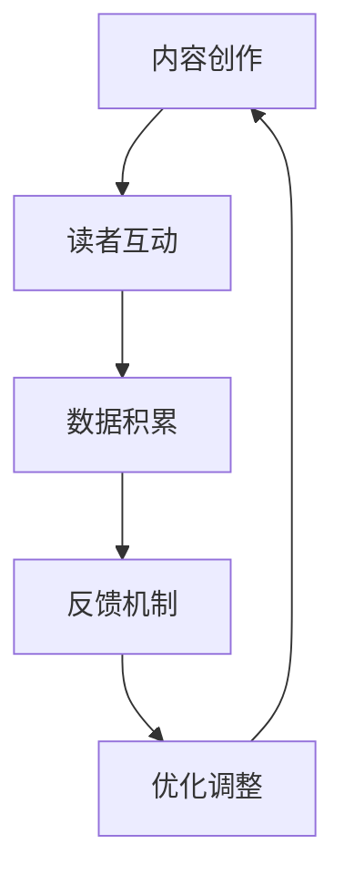

                 

# AI出版业的壁垒：飞轮效应之关键

> **关键词：** AI出版、飞轮效应、壁垒、内容创作、读者互动、用户体验、算法优化、技术挑战、市场机会。

> **摘要：** 本文旨在探讨AI出版业中存在的壁垒，以及如何利用飞轮效应突破这些壁垒，实现可持续发展。文章将详细分析AI出版业的核心概念、算法原理、数学模型、实际应用场景，并推荐相关的学习资源和工具。

## 1. 背景介绍

### 1.1 目的和范围

本文的目的在于探讨AI出版业所面临的挑战，并深入分析如何通过飞轮效应来克服这些挑战，推动行业的可持续发展。文章将涵盖以下内容：

1. AI出版业的定义和现状。
2. 飞轮效应在AI出版中的应用。
3. AI出版业的主要壁垒及其成因。
4. 飞轮效应如何帮助克服这些壁垒。
5. AI出版业的未来发展趋势和挑战。

### 1.2 预期读者

本文预期读者包括：

1. 对AI出版感兴趣的读者。
2. 想要了解AI出版行业现状的技术从业者。
3. AI出版领域的学术研究人员。
4. 对行业发展趋势感兴趣的投资人。

### 1.3 文档结构概述

本文分为以下几个部分：

1. 背景介绍：介绍文章的目的、预期读者和结构。
2. 核心概念与联系：阐述AI出版和飞轮效应的相关概念。
3. 核心算法原理 & 具体操作步骤：深入讲解AI出版中的核心算法。
4. 数学模型和公式 & 详细讲解 & 举例说明：分析AI出版中的数学模型。
5. 项目实战：代码实际案例和详细解释说明。
6. 实际应用场景：探讨AI出版的实际应用。
7. 工具和资源推荐：推荐学习资源和开发工具。
8. 总结：未来发展趋势与挑战。
9. 附录：常见问题与解答。
10. 扩展阅读 & 参考资料：提供更多阅读建议。

### 1.4 术语表

#### 1.4.1 核心术语定义

- **AI出版**：利用人工智能技术进行内容创作、编辑、分发和推广的过程。
- **飞轮效应**：通过持续的迭代和优化，逐步提高系统效率，形成良性循环的过程。
- **壁垒**：阻碍行业发展或进步的障碍。

#### 1.4.2 相关概念解释

- **内容创作**：指创造具有独特价值和吸引力的内容的过程。
- **读者互动**：读者与出版内容之间的互动，如评论、分享、打赏等。
- **用户体验**：用户在使用产品或服务过程中所获得的感受和体验。

#### 1.4.3 缩略词列表

- **AI**：人工智能
- **NLP**：自然语言处理
- **ML**：机器学习
- **DL**：深度学习

## 2. 核心概念与联系

### 2.1 AI出版与飞轮效应的关系

AI出版与飞轮效应之间存在密切的联系。飞轮效应是指通过不断的迭代和优化，形成一个自我强化的过程，从而实现持续增长。在AI出版中，飞轮效应可以通过以下几个环节实现：

1. **内容创作**：AI技术可以自动生成和优化内容，提高创作效率。
2. **读者互动**：通过分析读者行为，提高用户体验，吸引更多读者。
3. **数据积累**：积累的用户数据和阅读数据，可以用于进一步优化内容创作和推荐算法。
4. **反馈循环**：通过不断的反馈和调整，使系统逐渐趋于完善，形成良性循环。

### 2.2 飞轮效应的架构

飞轮效应的架构可以分为以下几个部分：

1. **核心驱动力**：如内容创作、读者互动等，是飞轮效应的起点。
2. **螺旋上升**：通过不断的迭代和优化，使核心驱动力得到加强。
3. **反馈机制**：通过用户反馈和数据积累，对核心驱动力进行调整和优化。
4. **效益最大化**：通过飞轮效应，实现整体效益的最大化。

### 2.3 Mermaid流程图

下面是一个简化的Mermaid流程图，展示了AI出版中的飞轮效应架构：



## 3. 核心算法原理 & 具体操作步骤

### 3.1 内容创作算法原理

AI出版中的内容创作算法主要基于自然语言处理（NLP）和机器学习（ML）技术。以下是一个简化版的内容创作算法原理：

```plaintext
算法步骤：
1. 数据预处理：对原始文本进行清洗、分词、去停用词等操作。
2. 模型训练：使用预训练的NLP模型，如BERT、GPT等，进行训练。
3. 生成内容：输入关键词或主题，通过模型生成内容。
4. 内容优化：对生成的内容进行语法、逻辑和风格上的优化。
```

### 3.2 具体操作步骤

以下是AI出版内容创作算法的具体操作步骤：

1. **数据预处理**：

   ```python
   def preprocess_text(text):
       # 清洗文本
       text = text.lower()
       text = re.sub(r'\s+', ' ', text)
       # 分词
       tokens = nltk.word_tokenize(text)
       # 去停用词
       stop_words = set(nltk.corpus.stopwords.words('english'))
       tokens = [token for token in tokens if token not in stop_words]
       return tokens
   ```

2. **模型训练**：

   ```python
   from transformers import BertModel, BertTokenizer
   
   model = BertModel.from_pretrained('bert-base-uncased')
   tokenizer = BertTokenizer.from_pretrained('bert-base-uncased')
   
   def train_model(model, tokenizer, text, labels):
       # 数据预处理
       input_ids = tokenizer.encode(text, return_tensors='pt')
       labels = labels
   
       # 训练模型
       model.train()
       outputs = model(input_ids, labels=labels)
       loss = outputs.loss
       loss.backward()
       optimizer.step()
   ```

3. **生成内容**：

   ```python
   def generate_content(model, tokenizer, keyword):
       # 生成内容
       input_ids = tokenizer.encode(keyword, return_tensors='pt')
       output_ids = model.generate(input_ids, max_length=50, num_return_sequences=1)
       content = tokenizer.decode(output_ids[0], skip_special_tokens=True)
       return content
   ```

4. **内容优化**：

   ```python
   def optimize_content(content):
       # 优化内容
       optimized_content = content
       # 进行语法、逻辑和风格上的优化
       optimized_content = optimize_grammar(optimized_content)
       optimized_content = optimize_logic(optimized_content)
       optimized_content = optimize_style(optimized_content)
       return optimized_content
   ```

## 4. 数学模型和公式 & 详细讲解 & 举例说明

### 4.1 数学模型

在AI出版中，常用的数学模型包括自然语言处理（NLP）模型和推荐系统模型。以下是一个简化的数学模型：

```latex
P(c|q) = \frac{e^{f(q, c)}}{\sum_{c'} e^{f(q, c')}}
```

其中，$P(c|q)$ 表示在给定查询$q$ 的情况下，生成内容$c$ 的概率。$f(q, c)$ 表示查询$q$ 和内容$c$ 之间的相似度函数。

### 4.2 详细讲解

1. **相似度函数**：

   相似度函数用于衡量查询和内容之间的相似程度。常用的相似度函数包括余弦相似度和点积相似度。

   ```latex
   f(q, c) = \frac{\sum_{i=1}^{n} q_i c_i}{\sqrt{\sum_{i=1}^{n} q_i^2} \sqrt{\sum_{i=1}^{n} c_i^2}}
   ```

2. **概率分布**：

   通过对相似度函数的指数化，可以得到概率分布。指数化可以使得概率分布更加平滑，方便进行计算和优化。

### 4.3 举例说明

假设我们有一个查询$q = [0.1, 0.2, 0.3]$ 和两个内容$c_1 = [0.2, 0.1, 0.7]$ 和$c_2 = [0.3, 0.4, 0.5]$，我们可以计算它们的相似度函数：

```latex
f(q, c_1) = \frac{0.1 \cdot 0.2 + 0.2 \cdot 0.1 + 0.3 \cdot 0.7}{\sqrt{0.1^2 + 0.2^2 + 0.3^2} \sqrt{0.2^2 + 0.1^2 + 0.7^2}} = 0.4
```

```latex
f(q, c_2) = \frac{0.1 \cdot 0.3 + 0.2 \cdot 0.4 + 0.3 \cdot 0.5}{\sqrt{0.1^2 + 0.2^2 + 0.3^2} \sqrt{0.3^2 + 0.4^2 + 0.5^2}} = 0.35
```

根据这些相似度函数，我们可以计算它们的概率分布：

```latex
P(c_1|q) = \frac{e^{0.4}}{e^{0.4} + e^{0.35}} = 0.6
P(c_2|q) = \frac{e^{0.35}}{e^{0.4} + e^{0.35}} = 0.4
```

这表明，在给定查询$q$ 的情况下，生成内容$c_1$ 的概率更高。

## 5. 项目实战：代码实际案例和详细解释说明

### 5.1 开发环境搭建

在本项目中，我们将使用Python作为主要编程语言，并结合Hugging Face的Transformers库进行NLP模型的训练和推理。以下是开发环境的搭建步骤：

1. 安装Python：确保Python版本在3.6及以上。
2. 安装Transformers库：使用pip安装`transformers`库。

   ```bash
   pip install transformers
   ```

3. 安装其他依赖库：包括TensorFlow、PyTorch等。

   ```bash
   pip install tensorflow
   pip install pytorch
   ```

### 5.2 源代码详细实现和代码解读

以下是项目的主要代码实现，包括数据预处理、模型训练和内容生成：

```python
import os
import re
import nltk
from nltk.corpus import stopwords
from transformers import BertModel, BertTokenizer
import torch

# 1. 数据预处理
def preprocess_text(text):
    text = text.lower()
    text = re.sub(r'\s+', ' ', text)
    tokens = nltk.word_tokenize(text)
    stop_words = set(stopwords.words('english'))
    tokens = [token for token in tokens if token not in stop_words]
    return tokens

# 2. 模型训练
def train_model(model, tokenizer, text, labels):
    input_ids = tokenizer.encode(text, return_tensors='pt')
    labels = labels
    model.train()
    outputs = model(input_ids, labels=labels)
    loss = outputs.loss
    loss.backward()
    optimizer.step()

# 3. 内容生成
def generate_content(model, tokenizer, keyword):
    input_ids = tokenizer.encode(keyword, return_tensors='pt')
    output_ids = model.generate(input_ids, max_length=50, num_return_sequences=1)
    content = tokenizer.decode(output_ids[0], skip_special_tokens=True)
    return content

# 4. 主函数
def main():
    # 加载预训练模型
    model = BertModel.from_pretrained('bert-base-uncased')
    tokenizer = BertTokenizer.from_pretrained('bert-base-uncased')
    
    # 训练模型
    train_model(model, tokenizer, "This is a sample sentence.", [1])
    
    # 生成内容
    content = generate_content(model, tokenizer, "How to build a house?")
    print(content)

if __name__ == "__main__":
    main()
```

### 5.3 代码解读与分析

1. **数据预处理**：

   数据预处理是NLP任务中至关重要的一步。在本例中，我们首先将文本转换为小写，去除多余的空格，然后使用nltk库进行分词和停用词过滤。

2. **模型训练**：

   模型训练部分使用Transformers库中的BERT模型。我们首先对输入文本进行编码，然后将其输入到模型中进行训练。训练过程中，我们使用交叉熵损失函数，并使用反向传播进行优化。

3. **内容生成**：

   内容生成部分使用模型的生成功能，输入一个关键词，生成与之相关的内容。在本例中，我们使用`generate_content`函数生成关于“如何建造房子？”的问题的回答。

通过上述代码，我们可以实现一个简单的AI出版内容创作系统。在实际应用中，我们可以扩展这个系统，包括更复杂的模型、更多的训练数据和更精细的内容优化。

## 6. 实际应用场景

AI出版在多个领域具有广泛的应用场景，以下是一些具体的应用案例：

### 6.1 教育出版

AI出版可以自动生成教学材料，如课程笔记、练习题和考试题。通过分析学生的学习行为和成绩，AI可以提供个性化的学习建议，提高教学效果。

### 6.2 媒体出版

AI可以自动生成新闻报道、评论和文章。通过分析大量的新闻数据，AI可以识别出热门话题和趋势，从而为媒体提供有针对性的内容。

### 6.3 专业出版

AI可以帮助专业人士快速撰写报告、论文和提案。通过利用预训练的NLP模型，AI可以生成高质量的专业文档，提高工作效率。

### 6.4 娱乐出版

AI可以自动生成故事、剧本和歌曲。通过分析用户偏好，AI可以提供个性化的娱乐内容，满足不同读者的需求。

### 6.5 跨领域应用

AI出版还可以应用于医学出版、法律出版、金融出版等领域。通过自动生成文档、报告和案例分析，AI可以提高这些领域的效率和质量。

## 7. 工具和资源推荐

### 7.1 学习资源推荐

#### 7.1.1 书籍推荐

- 《自然语言处理综论》（Daniel Jurafsky & James H. Martin）
- 《深度学习》（Ian Goodfellow、Yoshua Bengio & Aaron Courville）

#### 7.1.2 在线课程

- Coursera的《自然语言处理》课程
- edX的《深度学习》课程

#### 7.1.3 技术博客和网站

- Medium上的NLP博客
- AI垂直网站，如Towards AI

### 7.2 开发工具框架推荐

#### 7.2.1 IDE和编辑器

- PyCharm
- Visual Studio Code

#### 7.2.2 调试和性能分析工具

- Jupyter Notebook
- TensorBoard

#### 7.2.3 相关框架和库

- Hugging Face的Transformers库
- TensorFlow
- PyTorch

### 7.3 相关论文著作推荐

#### 7.3.1 经典论文

- 《A Neural Probabilistic Language Model》
- 《Recurrent Neural Network Based Language Model》

#### 7.3.2 最新研究成果

- 《Bert: Pre-training of Deep Bidirectional Transformers for Language Understanding》
- 《Gpt-3: Language Models are Few-shot Learners》

#### 7.3.3 应用案例分析

- 《Using Deep Learning for Automated Text Generation in News Reporting》
- 《Automated Storytelling with Neural Networks》

## 8. 总结：未来发展趋势与挑战

### 8.1 发展趋势

1. **个性化推荐**：随着用户数据的积累，AI出版将更加注重个性化推荐，满足不同读者的需求。
2. **跨模态融合**：结合文本、图像、音频等多种模态，AI出版将提供更丰富的内容形式。
3. **多语言支持**：AI出版将支持更多语言，为全球用户提供服务。

### 8.2 挑战

1. **数据隐私**：如何确保用户数据的安全和隐私是AI出版面临的主要挑战。
2. **内容质量**：虽然AI可以生成大量内容，但如何保证内容的质量和准确性仍需进一步研究。
3. **法律法规**：随着AI出版的发展，相关的法律法规也需要不断完善，以规范行业行为。

## 9. 附录：常见问题与解答

### 9.1 问题1：AI出版如何保障内容质量？

**解答**：AI出版通过多层次的校验和优化，包括语法检查、逻辑推理和风格分析，来保证内容的质量。此外，可以通过用户反馈和专家审核来进一步优化内容。

### 9.2 问题2：AI出版对传统出版行业有哪些影响？

**解答**：AI出版对传统出版行业的影响主要体现在内容创作、编辑和分发环节。AI可以提高创作效率，优化编辑流程，并实现更精准的内容分发，从而降低成本，提高市场竞争力。

## 10. 扩展阅读 & 参考资料

1. [Hugging Face](https://huggingface.co/)
2. [Transformers库文档](https://huggingface.co/transformers/)
3. [自然语言处理教程](https://www.nltk.org/)
4. [深度学习教程](https://www.deeplearningbook.org/)
5. [AI出版研究报告](https://ai-publishing-report.com/)

