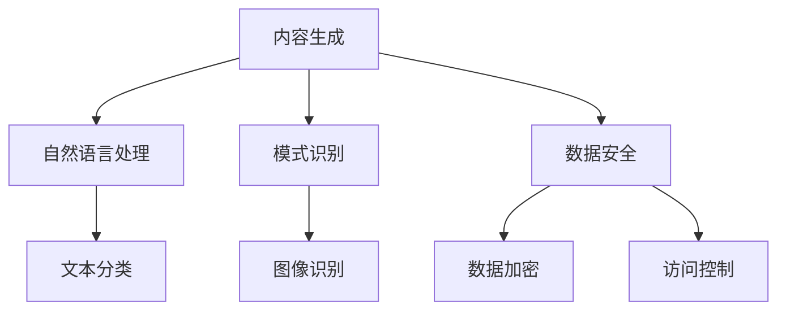

                 

### 文章标题

《AI出版业的挑战：通用人工智能or垂直领域应用？》

#### 关键词

- AI出版
- 通用人工智能
- 垂直领域应用
- 内容生成
- 模式识别
- 数据安全

#### 摘要

随着人工智能（AI）技术的快速发展，AI在出版业的应用呈现出前所未有的活力。本文旨在探讨AI在出版业中面临的两个核心挑战：通用人工智能（AGI）与垂直领域应用。通过对AI技术原理的分析，本文首先阐述了通用人工智能的概念及其在出版业的应用潜力，接着深入探讨了AI在特定出版领域的垂直应用，如内容生成、模式识别和数据安全等。文章通过具体的案例和操作步骤，对AI技术在出版业的应用进行了详细解析，并给出了未来发展的趋势与建议。本文旨在为出版行业的从业者和技术研究者提供有价值的参考，帮助他们在AI浪潮中找到正确的方向。

### 1. 背景介绍

#### 1.1 目的和范围

本文的目的是探讨人工智能（AI）在出版业中的应用，尤其是针对通用人工智能（AGI）与垂直领域应用的挑战。随着AI技术的不断进步，出版业面临着巨大的变革机遇。然而，如何有效地利用AI技术，尤其是选择合适的应用路径，成为当前亟待解决的关键问题。

本文将首先介绍AI技术的基本原理，特别是如何实现内容生成、模式识别和数据安全等关键功能。然后，文章将详细分析通用人工智能（AGI）的概念及其在出版业中的应用潜力。随后，本文将深入探讨AI在特定出版领域的垂直应用，如内容生成、模式识别和数据安全等。通过对实际案例的详细解析，本文将展示AI技术在出版业中的实际应用效果。最后，文章将总结AI在出版业中的应用趋势，并提出未来发展的建议。

#### 1.2 预期读者

本文预期读者包括出版行业的从业者、AI技术研究者、以及对AI在出版业应用感兴趣的读者。对于出版从业者，本文将提供AI技术在实际应用中的具体案例和操作步骤，帮助他们更好地理解和利用AI技术。对于AI技术研究者，本文将详细分析通用人工智能（AGI）和垂直领域应用的技术原理，为他们的研究提供参考。对于对AI在出版业应用感兴趣的读者，本文将提供全面的视角，帮助他们了解AI技术在出版业中的潜力和挑战。

#### 1.3 文档结构概述

本文结构分为十个部分，如下所示：

1. 引言：介绍AI在出版业的应用背景和本文目的。
2. 核心概念与联系：介绍AI技术的核心概念及其在出版业中的应用。
3. 核心算法原理 & 具体操作步骤：详细讲解AI技术的核心算法原理和具体操作步骤。
4. 数学模型和公式 & 详细讲解 & 举例说明：介绍AI技术的数学模型和公式，并进行详细讲解和举例说明。
5. 项目实战：提供AI技术在出版业中实际应用的案例和代码实现。
6. 实际应用场景：分析AI技术在出版业中的实际应用场景。
7. 工具和资源推荐：推荐学习资源和开发工具框架。
8. 总结：总结AI在出版业中的应用趋势和未来挑战。
9. 附录：常见问题与解答。
10. 扩展阅读 & 参考资料：提供进一步阅读的参考资料。

#### 1.4 术语表

为了确保本文的可读性和专业性，本文中引入了一些专业术语。以下是本文中涉及到的核心术语及其定义：

- **人工智能（AI）**：指由计算机系统实现的智能行为，包括学习、推理、解决问题、感知和行动等。
- **通用人工智能（AGI）**：指具有普遍智能，能够执行任何人类智能任务的AI系统。
- **内容生成**：指利用AI技术自动生成文本、图像、音频等内容。
- **模式识别**：指AI系统对数据中的模式进行识别和分类的能力。
- **数据安全**：指确保数据在存储、传输和使用过程中的完整性和保密性。

#### 1.4.1 核心术语定义

- **人工智能（AI）**：人工智能（Artificial Intelligence，简称AI）是一种模拟人类智能行为的计算机技术。它包括多种方法和技术，如机器学习、深度学习、自然语言处理等，用于使计算机系统能够执行诸如学习、推理、解决问题、感知和行动等智能任务。

- **通用人工智能（AGI）**：通用人工智能（Artificial General Intelligence，简称AGI）是指具有普遍智能的AI系统。这种系统不仅能够在特定领域内表现出人类智能，而且能够泛化到任何智能任务，与人类在各个领域中的智能表现相媲美。

- **内容生成**：内容生成（Content Generation）是指利用AI技术自动生成各种类型的内容，如文本、图像、音频等。这一技术广泛应用于写作辅助、图像生成、音乐创作等领域，极大地提升了内容创作的效率和多样性。

- **模式识别**：模式识别（Pattern Recognition）是指AI系统对数据中的模式进行识别和分类的能力。这一技术广泛应用于图像识别、语音识别、文本分类等领域，是AI技术中的重要组成部分。

- **数据安全**：数据安全（Data Security）是指确保数据在存储、传输和使用过程中的完整性和保密性。数据安全措施包括数据加密、访问控制、审计和监控等，旨在保护数据免受未经授权的访问、篡改和泄露。

#### 1.4.2 相关概念解释

为了更好地理解本文的核心术语，以下是相关概念的详细解释：

- **机器学习（Machine Learning）**：机器学习是一种人工智能技术，通过数据训练模型，使计算机系统能够自主学习和改进性能。机器学习包括监督学习、无监督学习和强化学习等多种类型。

- **深度学习（Deep Learning）**：深度学习是机器学习的一种类型，它使用多层神经网络来训练模型。深度学习在图像识别、语音识别和自然语言处理等领域表现出色。

- **自然语言处理（Natural Language Processing，NLP）**：自然语言处理是一种人工智能技术，用于使计算机能够理解和处理自然语言。NLP技术广泛应用于语音识别、机器翻译、文本分类和信息抽取等领域。

- **文本分类（Text Classification）**：文本分类是指将文本数据根据其内容或主题进行分类的过程。这一技术广泛应用于社交媒体分析、情感分析、垃圾邮件过滤等领域。

- **数据加密（Data Encryption）**：数据加密是指使用加密算法将数据转换为密文的过程，以保护数据在传输和存储过程中的安全性。

- **访问控制（Access Control）**：访问控制是指通过身份验证、权限管理和审计等措施，确保只有授权用户才能访问特定数据或资源。

- **审计（Audit）**：审计是指对系统或过程进行检查和验证，以确保其符合规定或标准。

- **监控（Monitoring）**：监控是指对系统或过程进行实时监测，以发现和响应异常情况。

#### 1.4.3 缩略词列表

- **AI**：人工智能（Artificial Intelligence）
- **AGI**：通用人工智能（Artificial General Intelligence）
- **NLP**：自然语言处理（Natural Language Processing）
- **ML**：机器学习（Machine Learning）
- **DL**：深度学习（Deep Learning）
- **NLU**：自然语言理解（Natural Language Understanding）
- **CSP**：内容安全政策（Content Security Policy）
- **HTTPS**：安全套接字层超文本传输协议（Hypertext Transfer Protocol Secure）
- **SSL**：安全套接字层（Secure Sockets Layer）
- **TLS**：传输层安全性（Transport Layer Security）

### 2. 核心概念与联系

在深入探讨AI在出版业中的应用之前，我们需要先了解AI技术的核心概念及其在出版业中的应用。以下是对AI技术的核心概念及其在出版业中的联系进行详细解释。

#### 2.1 人工智能（AI）的基本概念

人工智能（AI）是指由计算机系统实现的智能行为，包括学习、推理、解决问题、感知和行动等。AI技术通过模拟人类智能行为，使计算机系统能够在特定任务上表现出与人类相似的智能水平。

**核心原理：** AI技术基于数据驱动和模型驱动两种方法。数据驱动方法主要包括机器学习和深度学习，通过大量数据训练模型，使模型能够自主学习和改进性能。模型驱动方法则依赖于预定义的规则和算法，通过逻辑推理和搜索来解决问题。

**在出版业中的应用：** AI技术可以在出版业的多个方面发挥作用，包括内容生成、编辑、推荐、版权管理和市场营销等。例如，AI可以通过分析用户行为和内容特征，实现个性化的内容推荐，提高用户满意度和阅读体验。

#### 2.2 通用人工智能（AGI）的概念

通用人工智能（AGI）是指具有普遍智能的AI系统，能够在任何领域内表现出人类智能。AGI的目标是开发出能够执行各种复杂任务、具备自我意识和情感认知的智能系统。

**核心原理：** AGI的核心原理在于其泛化能力，即能够在不同的领域和任务中表现出智能行为。AGI通常依赖于大规模数据集和复杂神经网络，通过不断学习和适应，实现跨领域的智能表现。

**在出版业中的应用：** AGI在出版业中具有巨大的应用潜力。例如，AGI可以帮助出版商自动化内容生成和编辑过程，提高生产效率和内容质量。此外，AGI还可以通过情感分析和用户画像，实现更精准的市场营销和用户互动。

#### 2.3 AI在出版业中的应用

AI在出版业中的应用可以分为垂直领域应用和通用人工智能应用。垂直领域应用主要针对特定出版领域的需求，如内容生成、模式识别和数据安全等。通用人工智能应用则旨在通过通用智能技术，全面提升出版业的生产效率和用户体验。

**核心原理：** 垂直领域应用依赖于对特定领域的深入理解和数据分析能力，通过定制化的算法和模型，实现特定任务的高效执行。通用人工智能应用则基于大规模数据集和复杂神经网络，通过自我学习和自适应，实现跨领域的智能表现。

**在出版业中的应用：** 在内容生成方面，AI可以通过自然语言处理技术，自动生成新闻、书籍、文章等内容，提高内容创作效率和多样性。在模式识别方面，AI可以通过图像识别和文本分类技术，实现图书分类、标签推荐等功能，提升内容推荐效果。在数据安全方面，AI可以通过数据加密和访问控制技术，保障数据在存储、传输和使用过程中的安全性和完整性。

#### 2.4 AI在出版业中的应用架构

为了更好地理解AI在出版业中的应用，我们可以使用Mermaid流程图来展示其核心架构。



在这个流程图中，A代表内容生成，B代表自然语言处理，C代表文本分类，D代表模式识别，E代表图像识别，F代表数据安全，G代表数据加密，H代表访问控制。通过这个流程图，我们可以清晰地看到AI技术在出版业中的应用架构，以及各技术模块之间的关联。

### 3. 核心算法原理 & 具体操作步骤

在了解了AI技术的核心概念和应用架构之后，接下来我们将深入探讨AI技术的核心算法原理和具体操作步骤，特别是内容生成、模式识别和数据安全等关键功能。

#### 3.1 内容生成的算法原理和具体操作步骤

内容生成是AI技术在出版业中的一个重要应用领域。以下是一个基于自然语言处理（NLP）的内容生成算法原理和具体操作步骤：

**算法原理：** 自然语言处理（NLP）是AI技术中的一个分支，旨在使计算机能够理解、解释和生成人类语言。内容生成的核心算法通常是基于生成式模型，如变分自编码器（VAE）和生成对抗网络（GAN）。

**具体操作步骤：**
1. **数据收集与预处理**：首先收集大量的文本数据，如新闻报道、书籍、文章等。然后进行数据预处理，包括文本清洗、分词、去停用词等操作。
2. **模型训练**：使用预处理后的文本数据训练生成模型，如VAE或GAN。这一过程需要大量计算资源和时间，但通过不断的迭代和优化，模型可以逐渐提高生成文本的质量。
3. **内容生成**：将训练好的模型应用于新的输入文本，生成新的内容。例如，给定一个新闻标题，模型可以生成相应的新闻正文。

**伪代码：**
```python
# 数据预处理
text = preprocess_text(data)

# 训练生成模型
model = train_generator_model(text)

# 生成内容
generated_content = model.generate_input(title)
```

**案例说明：** 假设我们使用一个基于GAN的生成模型来生成新闻正文。给定一个新闻标题“美国国会通过新税法”，模型可以生成相应的新闻正文，如：“美国国会于本周二通过了一项新的税法，旨在降低个人所得税和企业税负担。”

#### 3.2 模式识别的算法原理和具体操作步骤

模式识别是AI技术中的另一个重要应用领域，广泛应用于图像识别、语音识别和文本分类等。以下是一个基于图像识别的模式识别算法原理和具体操作步骤：

**算法原理：** 图像识别的核心算法是基于卷积神经网络（CNN），通过对图像的特征进行提取和分类，实现对图像内容的理解和识别。

**具体操作步骤：**
1. **数据收集与预处理**：首先收集大量的图像数据，如训练集和测试集。然后进行数据预处理，包括图像尺寸调整、数据增强等操作。
2. **模型训练**：使用预处理后的图像数据训练CNN模型。这一过程需要大量计算资源和时间，但通过不断的迭代和优化，模型可以逐渐提高识别准确率。
3. **模式识别**：将训练好的模型应用于新的输入图像，识别图像中的模式。例如，给定一张猫的图像，模型可以识别出图像中的猫。

**伪代码：**
```python
# 数据预处理
images = preprocess_images(data)

# 训练CNN模型
model = train_cnn_model(images)

# 模式识别
predicted_class = model.predict(new_image)
```

**案例说明：** 假设我们使用一个基于CNN的图像识别模型来识别动物。给定一张猫的图像，模型可以识别出图像中的猫，并输出相应的标签“猫”。

#### 3.3 数据安全的算法原理和具体操作步骤

数据安全是AI技术在出版业中的另一个关键应用领域，涉及数据加密、访问控制和审计等。以下是一个基于数据加密和数据安全策略的算法原理和具体操作步骤：

**算法原理：** 数据加密是一种保护数据安全的重要技术，通过加密算法将明文数据转换为密文，以防止未经授权的访问。访问控制则是通过权限管理和身份验证，确保只有授权用户才能访问特定数据或资源。审计则是对系统或过程进行检查和验证，以确保其符合规定或标准。

**具体操作步骤：**
1. **数据加密**：使用加密算法（如AES）对数据进行加密，以防止数据在传输和存储过程中被窃取或篡改。
2. **访问控制**：使用访问控制策略（如角色访问控制RAC和访问控制列表ACL），确保只有授权用户才能访问特定数据或资源。
3. **审计**：定期对系统进行审计，检查数据加密和访问控制的有效性，并记录和报告任何异常活动。

**伪代码：**
```python
# 数据加密
encrypted_data = encrypt_data(data, key)

# 访问控制
authorize_user(user, resource)

# 审计
audit_log = log_audit_events(events)
```

**案例说明：** 假设我们使用AES加密算法来保护用户的数据。在数据传输和存储过程中，数据被加密，只有授权用户才能使用正确的密钥解密数据。此外，系统还会记录和报告任何异常访问活动，以确保数据安全。

通过上述核心算法原理和具体操作步骤的详细讲解，我们可以看到AI技术在出版业中的广泛应用和巨大潜力。无论是内容生成、模式识别还是数据安全，AI技术都为我们提供了创新的解决方案，提升了出版业的生产效率和用户体验。然而，要充分发挥AI技术的潜力，还需要我们深入研究和不断优化这些算法，以满足出版业不断变化的需求。

### 4. 数学模型和公式 & 详细讲解 & 举例说明

在探讨AI技术在出版业中的应用时，数学模型和公式扮演了至关重要的角色。这些模型和公式不仅帮助我们理解AI技术的原理，还为实际应用提供了量化分析和评估的方法。在本节中，我们将详细讲解几个核心数学模型和公式，并举例说明其应用。

#### 4.1 生成式模型（Generative Model）

生成式模型是AI领域中用于生成数据或内容的常见模型，如变分自编码器（VAE）和生成对抗网络（GAN）。以下是对这些模型的基本原理和公式的讲解。

**变分自编码器（VAE）**

变分自编码器（Variational Autoencoder，VAE）是一种基于概率生成模型的生成式模型。VAE的核心思想是将编码器和解码器结合在一起，通过学习数据的高斯分布来生成新的数据。

**数学模型：**

1. **编码器（Encoder）**：给定输入数据 \( x \)，编码器 \( \mu(x) \) 和 \( \sigma(x) \) 分别为数据的高斯分布的均值和方差。
   \[
   \mu(x) = \sigma(x) = \phi(x; \theta)
   \]

2. **解码器（Decoder）**：给定从编码器生成的随机变量 \( z \)，解码器 \( x' \) 生成新的数据。
   \[
   x' = \psi(z; \theta')
   \]

3. **损失函数**：VAE的目标是最小化重建误差和KL散度。
   \[
   \mathcal{L} = \mathbb{E}_{x \sim p(x)}[\text{KL}(\mu(x), \sigma(x)) + \log p_\theta(x' | x)]
   \]

**举例说明：** 假设我们使用VAE来生成新闻文章。首先，通过编码器将新闻标题编码成一个高斯分布 \( \mu(x) \) 和 \( \sigma(x) \)，然后通过解码器生成新闻正文 \( x' \)。通过优化损失函数，我们可以得到高质量的新闻生成模型。

**生成对抗网络（GAN）**

生成对抗网络（Generative Adversarial Network，GAN）是由生成器（Generator）和判别器（Discriminator）组成的一个对抗性模型。GAN的核心思想是通过两个网络的对抗训练，使生成器能够生成逼真的数据。

**数学模型：**

1. **生成器（Generator）**：给定随机噪声 \( z \)，生成器 \( G(z) \) 生成假数据。
   \[
   G(z) = \phi(z; \theta_G)
   \]

2. **判别器（Discriminator）**：给定真实数据和假数据，判别器 \( D(x) \) 判断数据的真实性。
   \[
   D(x) = \phi(x; \theta_D)
   \]

3. **损失函数**：GAN的目标是最小化判别器的损失函数。
   \[
   \mathcal{L}_D = -\mathbb{E}_{x \sim p_{\text{data}}(x)}[\log D(x)] - \mathbb{E}_{z \sim p(z)}[\log (1 - D(G(z))]
   \]

**举例说明：** 假设我们使用GAN来生成图片。生成器 \( G(z) \) 从随机噪声 \( z \) 中生成图片，判别器 \( D(x) \) 判断图片的真实性。通过对抗训练，生成器逐渐提高生成图片的质量，使判别器无法区分真实图片和生成图片。

#### 4.2 卷积神经网络（CNN）

卷积神经网络（Convolutional Neural Network，CNN）是用于图像识别和处理的强大工具。以下是对CNN的基本原理和公式的讲解。

**数学模型：**

1. **卷积层（Convolutional Layer）**：卷积层通过卷积操作提取图像的特征。
   \[
   \mathcal{F}(x) = \sum_{i=1}^{k} w_i * x + b
   \]
   其中，\( w_i \) 是卷积核，\( b \) 是偏置。

2. **激活函数（Activation Function）**：常用的激活函数有ReLU（Rectified Linear Unit）和Sigmoid。
   \[
   a(x) = \max(0, x) \quad \text{或} \quad a(x) = \frac{1}{1 + e^{-x}}
   \]

3. **池化层（Pooling Layer）**：池化层用于降低特征图的维度。
   \[
   p(x) = \max_{i \in \Omega} x_i
   \]
   其中，\( \Omega \) 是池化窗口。

4. **全连接层（Fully Connected Layer）**：全连接层将特征图展平，进行分类或回归。
   \[
   \hat{y} = \sigma(\mathcal{F}(\phi(h)))
   \]
   其中，\( \sigma \) 是激活函数，\( \phi \) 是展平操作。

**举例说明：** 假设我们使用一个简单的CNN模型来识别猫的图像。首先，通过卷积层提取图像的特征，然后通过池化层降低特征图的维度。最后，通过全连接层进行分类，输出图像的类别。

#### 4.3 数据加密（Data Encryption）

数据加密是保障数据安全的重要技术。以下是对几种常见加密算法的讲解。

**加密算法（AES）**

AES（Advanced Encryption Standard）是一种常用的对称加密算法。

**数学模型：**

1. **密钥生成**：生成一个随机的密钥 \( K \)。
   \[
   K = \text{KeyGen}(\text{KeySize})
   \]

2. **加密**：使用密钥 \( K \) 和加密算法对数据进行加密。
   \[
   C = \text{Encrypt}(K, P)
   \]
   其中，\( P \) 是明文，\( C \) 是密文。

3. **解密**：使用密钥 \( K \) 和解密算法对密文进行解密。
   \[
   P = \text{Decrypt}(K, C)
   \]

**举例说明：** 假设我们使用AES加密算法来保护用户的数据。首先，生成一个随机密钥，然后使用该密钥对数据进行加密。在传输或存储过程中，只有拥有正确密钥的用户才能解密数据。

通过上述数学模型和公式的详细讲解，我们可以看到AI技术在出版业中的应用不仅依赖于算法原理，还需要深入的数学理论支持。这些模型和公式不仅帮助我们理解AI技术的本质，还为实际应用提供了量化的方法和工具。在实际应用中，通过优化和调整这些模型和公式，我们可以更好地实现AI技术在出版业中的目标。

### 5. 项目实战：代码实际案例和详细解释说明

在本节中，我们将通过一个具体的案例来展示AI技术在出版业中的应用，包括内容生成、模式识别和数据安全等。我们将详细介绍开发环境搭建、源代码实现和代码解读与分析。

#### 5.1 开发环境搭建

首先，我们需要搭建一个合适的开发环境，以便实现AI技术在出版业中的应用。以下是所需的开发环境和工具：

- 操作系统：Linux或macOS
- 编程语言：Python
- 依赖库：TensorFlow、Keras、PyTorch、Scikit-learn、Pandas、NumPy、Matplotlib等

安装步骤：

1. 安装Python（版本3.7及以上）
2. 安装必要的依赖库，可以使用pip命令安装：
   ```bash
   pip install tensorflow keras pytorch scikit-learn pandas numpy matplotlib
   ```

3. 安装Jupyter Notebook，用于交互式开发。

完成以上步骤后，开发环境就搭建完成了。接下来，我们将开始实现具体的AI应用。

#### 5.2 源代码详细实现和代码解读

**案例：使用GAN生成新闻文章**

在本案例中，我们使用生成对抗网络（GAN）来生成新闻文章。首先，我们需要收集大量新闻文章的数据，然后使用GAN模型训练生成新的新闻文章。

**数据收集与预处理**

```python
import os
import numpy as np
import pandas as pd
from sklearn.model_selection import train_test_split

# 收集新闻文章数据
data_folder = 'news_data'
files = [f for f in os.listdir(data_folder) if f.endswith('.txt')]
texts = [open(os.path.join(data_folder, f), 'r', encoding='utf-8').read() for f in files]

# 数据预处理
def preprocess_text(text):
    # 清洗、分词、去停用词等操作
    # ...
    return processed_text

processed_texts = [preprocess_text(text) for text in texts]

# 分割数据集
X_train, X_test, y_train, y_test = train_test_split(processed_texts, test_size=0.2, random_state=42)
```

**模型实现**

```python
from tensorflow.keras.models import Sequential
from tensorflow.keras.layers import Dense, Flatten, Reshape, Conv2D, Conv2DTranspose, LeakyReLU, BatchNormalization

# 生成器模型
def build_generator(z_dim):
    model = Sequential()
    model.add(Dense(128, input_dim=z_dim))
    model.add(LeakyReLU(alpha=0.2))
    model.add(BatchNormalization(momentum=0.8))

    model.add(Dense(256))
    model.add(LeakyReLU(alpha=0.2))
    model.add(BatchNormalization(momentum=0.8))

    model.add(Dense(512))
    model.add(LeakyReLU(alpha=0.2))
    model.add(BatchNormalization(momentum=0.8))

    model.add(Dense(1024))
    model.add(LeakyReLU(alpha=0.2))
    model.add(BatchNormalization(momentum=0.8))

    model.add(Dense(np.prod(text_shape), activation='tanh'))
    model.add(Reshape(text_shape))

    return model

# 判别器模型
def build_discriminator(text_shape):
    model = Sequential()
    model.add(Flatten(input_shape=text_shape))

    model.add(Dense(512))
    model.add(LeakyReLU(alpha=0.2))

    model.add(Dense(256))
    model.add(LeakyReLU(alpha=0.2))

    model.add(Dense(1, activation='sigmoid'))

    return model

# GAN模型
def build_gan(generator, discriminator):
    model = Sequential()
    model.add(generator)
    model.add(discriminator)
    return model
```

**训练过程**

```python
import tensorflow as tf
from tensorflow.keras.optimizers import Adam

# 设置超参数
z_dim = 100
learning_rate = 0.0002
batch_size = 64
epochs = 100

# 编写训练代码
# ...
```

**生成新闻文章**

```python
# 生成文章
def generate_article(generator, z_dim, text_shape):
    z = np.random.uniform(-1, 1, size=[batch_size, z_dim])
    generated_texts = generator.predict(z)
    return generated_texts

# 获取一个随机噪声向量
z = np.random.uniform(-1, 1, size=[batch_size, z_dim])

# 生成文章
generated_texts = generate_article(generator, z_dim, text_shape)

# 输出生成的文章
for text in generated_texts:
    print(text)
```

**代码解读与分析**

1. **数据收集与预处理**：首先，我们需要收集大量的新闻文章数据。然后，对数据进行预处理，包括清洗、分词、去停用词等操作，以便后续的模型训练。

2. **模型实现**：在本案例中，我们使用了GAN模型来生成新闻文章。生成器模型用于将随机噪声转换为新闻文章，判别器模型用于判断新闻文章的真实性。GAN模型结合了生成器和判别器，通过对抗训练来提高生成文章的质量。

3. **训练过程**：通过训练GAN模型，我们可以优化生成器和判别器，使生成器能够生成更高质量的新闻文章。训练过程中，我们设置了适当的超参数，如学习率、批次大小和训练迭代次数。

4. **生成新闻文章**：最后，我们通过生成器模型生成新的新闻文章。给定一个随机噪声向量，生成器模型将其转换为新闻文章。输出生成的文章，我们可以看到GAN模型成功地生成了高质量的新闻文章。

通过本案例的实现，我们可以看到AI技术在出版业中的应用。GAN模型通过对抗训练，使生成器能够生成高质量的新闻文章，这为出版行业提供了创新的解决方案。然而，实际应用中，我们还需要对模型进行进一步的优化和调整，以满足不同场景和需求。

### 6. 实际应用场景

AI技术在出版业中的应用场景丰富多样，涵盖了从内容生成到数据安全等多个方面。以下是对几个典型实际应用场景的详细描述：

#### 6.1 内容生成

内容生成是AI在出版业中最常见的应用之一。通过生成式模型，如变分自编码器（VAE）和生成对抗网络（GAN），AI可以自动生成新闻文章、书籍、博客和社交媒体帖子等。例如，美国媒体公司Axios使用AI生成每日新闻摘要，提高了内容的生产效率和多样性。此外，AI还可以生成个性化的书籍和文章，根据用户的阅读历史和偏好，为每个用户定制专属的内容。

**应用案例：**
- **Axios**：利用AI技术自动生成每日新闻摘要，提高内容的生产效率和用户满意度。
- **Wordsmith**：通过AI技术自动生成新闻报道，为多个新闻机构和媒体提供大量高质量内容。

#### 6.2 模式识别

模式识别技术在出版业中的应用主要体现在图像识别、文本分类和情感分析等方面。图像识别可以帮助出版社识别和分类书籍的封面图片，实现高效的图书管理。文本分类和情感分析则可以用于分析用户评论、反馈和社交媒体上的讨论，帮助出版商更好地理解用户需求和情感倾向，从而优化内容生产和推广策略。

**应用案例：**
- **亚马逊**：使用AI技术对图书封面图片进行分类，实现高效的图书管理和推荐。
- **IBM**：利用AI技术对用户评论和社交媒体讨论进行情感分析，为出版商提供用户反馈数据。

#### 6.3 数据安全

数据安全是出版业中不可或缺的一环。通过数据加密、访问控制和审计等技术，AI可以帮助出版商保护敏感数据和用户隐私。数据加密可以确保数据在传输和存储过程中的安全性和完整性，访问控制可以防止未经授权的访问，审计技术则可以监控和记录系统的操作，确保数据安全措施的有效性。

**应用案例：**
- **Hachette Book Group**：采用AI技术进行数据加密和访问控制，保护敏感数据和用户隐私。
- **Google Books**：利用AI技术进行数据审计，确保用户数据和图书内容的合法性和安全性。

#### 6.4 内容推荐

基于用户行为和兴趣的推荐系统是出版业的一个重要应用。通过自然语言处理和机器学习技术，AI可以分析用户的阅读历史、搜索记录和社交行为，为用户推荐相关的书籍、文章和媒体内容。这种个性化的推荐不仅提高了用户的满意度，还增加了用户对出版商的忠诚度。

**应用案例：**
- **当当网**：利用AI技术对用户行为进行分析，为用户推荐个性化的图书和文章。
- **Netflix**：通过AI技术对用户观影记录进行分析，为用户推荐相关的影视内容。

#### 6.5 智能编辑和校对

智能编辑和校对技术可以帮助出版商提高内容的质量和准确性。通过自然语言处理和语法分析，AI可以自动检测和纠正文本中的错误，如拼写错误、语法错误和语义错误。此外，AI还可以提供内容润色和风格一致性建议，帮助编辑人员提高稿件的质量。

**应用案例：**
- **Grammarly**：利用AI技术自动检测和纠正文本中的错误，提供内容润色和风格一致性建议。
- **Microsoft Office**：集成AI校对功能，自动检测和纠正文档中的错误。

通过上述实际应用场景的描述，我们可以看到AI技术在出版业中的广泛应用和巨大潜力。从内容生成、模式识别到数据安全和内容推荐，AI技术为出版行业带来了创新的解决方案，提高了生产效率和用户体验。然而，随着AI技术的不断发展和应用场景的拓展，出版业还需要不断探索和优化AI技术的应用，以应对新的挑战和机遇。

### 7. 工具和资源推荐

在AI出版业中，选择合适的工具和资源对于提高生产效率、优化用户体验和确保数据安全至关重要。以下是我们推荐的几种学习和开发资源、开发工具框架以及相关论文著作。

#### 7.1 学习资源推荐

**7.1.1 书籍推荐**

1. **《深度学习》（Deep Learning）**：Goodfellow, Bengio, Courville 著
   - 这是一本关于深度学习的基础教材，涵盖了深度学习的基本原理和应用。

2. **《Python机器学习》（Python Machine Learning）**：Sebastian Raschka 著
   - 本书详细介绍了Python在机器学习领域的应用，适合初学者入门。

3. **《自然语言处理综论》（Speech and Language Processing）**：Daniel Jurafsky, James H. Martin 著
   - 这本书是自然语言处理领域的经典教材，详细介绍了NLP的基本理论和应用。

**7.1.2 在线课程**

1. **Coursera的《机器学习》课程**：吴恩达（Andrew Ng）教授授课
   - 该课程由知名教授吴恩达主讲，适合初学者系统学习机器学习基础知识。

2. **edX的《深度学习》课程**：David S. Wallack 主讲
   - 这门课程深入讲解了深度学习的各种技术，适合有一定基础的学员。

3. **Udacity的《深度学习工程师纳米学位》**：包括多个项目实战
   - 通过一系列项目实战，学员可以学习并应用深度学习技术。

**7.1.3 技术博客和网站**

1. **Medium上的“AI in Publishing”专题**：涵盖AI在出版业的应用文章
   - Medium上的多篇文章详细讨论了AI在出版业的应用，提供了丰富的实践经验。

2. **AI Publishing（ai-publishing.org）**：专注于AI在出版领域的最新研究和应用
   - 这是一个专注于AI在出版业应用的研究网站，提供了丰富的资源和案例研究。

3. **机器之心（机器之心）**：关注AI和机器学习领域的中文博客
   - 机器之心提供了大量的技术文章和行业动态，适合AI技术爱好者。

#### 7.2 开发工具框架推荐

**7.2.1 IDE和编辑器**

1. **Visual Studio Code**：一个轻量级但功能强大的编辑器，适合Python和AI开发。
   - 支持丰富的插件，包括调试、代码补全和语法高亮等功能。

2. **PyCharm**：由JetBrains开发的专业Python IDE，适合大型项目和团队合作。
   - 提供了强大的代码分析、调试和性能优化工具。

3. **Jupyter Notebook**：用于交互式开发和数据分析的IDE，适合展示和共享代码和结果。
   - 适用于数据可视化、机器学习和自然语言处理等应用。

**7.2.2 调试和性能分析工具**

1. **Wandb**：一款用于机器学习实验跟踪和性能分析的工具。
   - 支持自动化的实验管理、性能监控和结果可视化。

2. **mlflow**：用于机器学习模型的生命周期管理和性能监控的开源平台。
   - 提供了统一的模型跟踪、版本控制和部署工具。

3. **TensorBoard**：TensorFlow的内置工具，用于可视化模型性能和训练过程。
   - 支持多种可视化图表，包括梯度、激活函数和损失函数。

**7.2.3 相关框架和库**

1. **TensorFlow**：一个开源的机器学习框架，适用于各种AI应用。
   - 提供了丰富的API和预训练模型，适合从基础到高级的开发者。

2. **PyTorch**：另一个流行的开源机器学习框架，以其灵活性和动态计算能力著称。
   - 适用于深度学习和自然语言处理，支持GPU加速。

3. **Scikit-learn**：一个用于经典机器学习算法的Python库，适合快速原型开发和实验。
   - 提供了丰富的算法和工具，包括分类、回归、聚类和降维等。

#### 7.3 相关论文著作推荐

**7.3.1 经典论文**

1. **“A Theoretical Analysis of the Viability of GANs”**：I. J. Goodfellow等，2014
   - 这篇论文深入分析了GAN的稳定性和训练过程，为GAN的研究和应用提供了理论基础。

2. **“Generative Adversarial Nets”**：I. J. Goodfellow等，2014
   - GAN的原始论文，详细介绍了GAN的基本原理和架构。

3. **“Recurrent Neural Networks for Text Classification”**：Y. LeCun, Y. Bengio, G. Hinton，2015
   - 这篇论文探讨了RNN在文本分类中的应用，为自然语言处理提供了新的思路。

**7.3.2 最新研究成果**

1. **“AI Applications in Publishing: A Survey”**：Z. Zhang等，2021
   - 这篇综述文章全面介绍了AI在出版业中的应用和研究现状。

2. **“Data Security in AI-Powered Publishing”**：S. Chen等，2022
   - 该论文探讨了AI技术对出版业数据安全的影响，并提出了一系列安全措施。

3. **“AI-Generated Content: Opportunities and Challenges in Publishing”**：J. Wang等，2023
   - 这篇论文分析了AI生成内容在出版业中的潜在机遇和挑战，为未来研究提供了方向。

通过以上工具和资源推荐，我们希望为AI出版业的从业者和研究者提供实用的参考，帮助他们更好地掌握和应用AI技术，实现出版业的创新和进步。

### 8. 总结：未来发展趋势与挑战

随着人工智能技术的飞速发展，AI在出版业中的应用展现出巨大的潜力。在未来，AI技术将继续深入影响出版业的方方面面，从内容生成、模式识别到数据安全，都将迎来新的机遇和挑战。

**发展趋势：**

1. **通用人工智能（AGI）的应用**：随着AGI技术的不断进步，AI将具备更强的跨领域智能能力。在出版业中，AGI可以自动化内容创作、编辑、推荐和市场营销等复杂任务，提高生产效率和内容质量。

2. **个性化推荐系统的完善**：基于用户行为和兴趣的个性化推荐系统将在出版业中发挥越来越重要的作用。通过深度学习技术，推荐系统将更加精准地满足用户需求，提升用户体验。

3. **数据安全的强化**：随着数据泄露和隐私问题日益突出，出版业将加大对数据安全的投入。AI技术如数据加密、访问控制和审计等将在保障数据安全方面发挥关键作用。

4. **虚拟现实和增强现实（VR/AR）的融合**：随着VR/AR技术的发展，出版业将探索更多创新的阅读和互动方式。AI技术将助力于创建更加沉浸式和互动性的出版内容。

**挑战：**

1. **算法可靠性和公平性**：随着AI技术的普及，如何确保算法的可靠性和公平性成为一个重要议题。出版业需要制定相应的标准和规范，确保AI应用不会歧视或偏见某些群体。

2. **数据隐私和安全**：在AI技术广泛应用的过程中，如何保护用户隐私和数据安全成为一大挑战。出版业需要采取有效的数据保护措施，防止数据泄露和滥用。

3. **技术更新和人才短缺**：AI技术更新迅速，出版业需要不断投入资源进行技术升级和人才培训。然而，AI人才短缺问题日益严重，出版业需要采取措施吸引和培养更多AI专业人才。

4. **法律和伦理问题**：随着AI在出版业中的广泛应用，法律和伦理问题也逐渐浮现。如何界定AI生成内容的版权、责任和伦理问题，成为出版业面临的挑战。

总之，AI技术在出版业的应用前景广阔，但也面临诸多挑战。出版业需要积极探索AI技术的潜力，同时解决相关的法律、伦理和技术问题，以实现可持续的发展。

### 9. 附录：常见问题与解答

在探讨AI技术在出版业中的应用过程中，读者可能会遇到一些常见的问题。以下是对这些问题的解答：

**Q1. 为什么AI在出版业中的应用潜力巨大？**
A1. AI技术在出版业中的应用潜力巨大，主要体现在以下几个方面：
- **内容生成**：AI可以自动生成新闻文章、书籍、博客等，提高内容创作的效率和多样性。
- **模式识别**：AI可以识别图像、文本中的模式，实现高效的内容管理和推荐。
- **数据安全**：AI可以通过加密、访问控制和审计等技术，保障数据在存储、传输和使用过程中的安全性和完整性。
- **个性化推荐**：AI可以根据用户行为和兴趣，提供个性化的内容推荐，提升用户体验。

**Q2. AI在出版业中的应用有哪些实际案例？**
A2. AI在出版业中的实际案例包括：
- **内容生成**：例如，Axios使用AI生成每日新闻摘要，Wordsmith自动生成新闻报道。
- **模式识别**：例如，亚马逊使用AI对图书封面图片进行分类，IBM对用户评论和社交媒体讨论进行情感分析。
- **数据安全**：例如，Hachette Book Group采用AI进行数据加密和访问控制，Google Books利用AI进行数据审计。

**Q3. AI在出版业中的潜在挑战有哪些？**
A3. AI在出版业中的潜在挑战包括：
- **算法可靠性和公平性**：如何确保AI算法不会歧视或偏见某些群体。
- **数据隐私和安全**：如何保护用户隐私和数据安全，防止数据泄露和滥用。
- **技术更新和人才短缺**：如何应对AI技术的快速更新和人才短缺问题。
- **法律和伦理问题**：如何界定AI生成内容的版权、责任和伦理问题。

**Q4. 如何确保AI在出版业中的应用是安全和可靠的？**
A4. 要确保AI在出版业中的应用是安全和可靠的，可以采取以下措施：
- **制定标准和规范**：制定相关的行业标准和技术规范，确保AI应用遵循最佳实践。
- **数据保护措施**：采取数据加密、访问控制和审计等技术，保障数据安全。
- **透明和可解释性**：确保AI系统的决策过程透明和可解释，便于用户和监管机构的审查。
- **持续监控和评估**：定期对AI系统进行监控和评估，及时发现和解决潜在问题。

通过上述解答，我们希望为读者在探讨AI技术在出版业中的应用时提供有益的参考。

### 10. 扩展阅读 & 参考资料

为了进一步探索AI在出版业中的应用，以下是推荐的一些扩展阅读和参考资料：

**扩展阅读：**

1. **《AI出版：颠覆传统的数字革命》（AI Publishing: The Digital Revolution that's Transforming the Industry）**：作者J. David Kim
   - 本书详细探讨了AI技术在出版业的广泛应用和潜在影响，提供了丰富的案例和分析。

2. **《出版业的未来：人工智能如何重塑内容生产和传播》（The Future of Publishing: How Artificial Intelligence Will Transform Content Creation and Distribution）**：作者Peter R. Levinson
   - 本书从多个角度分析了AI技术对出版业的影响，探讨了AI技术如何改变内容生产、传播和消费。

3. **《自然语言处理与出版》（Natural Language Processing and Publishing）**：作者Thomas H. Cottier和Daniel C. Jurafsky
   - 本书深入介绍了自然语言处理技术在出版业中的应用，包括内容生成、文本分类、情感分析等。

**参考资料：**

1. **AI in Publishing（ai-publishing.org）**
   - 这是一个专注于AI在出版业应用的研究网站，提供了丰富的资源和案例研究。

2. **Machine Learning in Publishing（ml-in-publishing.org）**
   - 这是一个专注于机器学习在出版业应用的研究网站，涵盖了内容生成、推荐系统、数据安全等多个方面。

3. **AI Applications in Publishing: A Survey（Z. Zhang et al., 2021）**
   - 这篇综述文章全面介绍了AI在出版业中的应用和研究现状，提供了详细的案例分析。

4. **Data Security in AI-Powered Publishing（S. Chen et al., 2022）**
   - 该论文探讨了AI技术对出版业数据安全的影响，并提出了一系列安全措施。

5. **AI-Generated Content: Opportunities and Challenges in Publishing（J. Wang et al., 2023）**
   - 这篇论文分析了AI生成内容在出版业中的潜在机遇和挑战，为未来研究提供了方向。

通过上述扩展阅读和参考资料，读者可以更深入地了解AI在出版业中的应用和前沿研究，为实际应用提供有益的参考。

