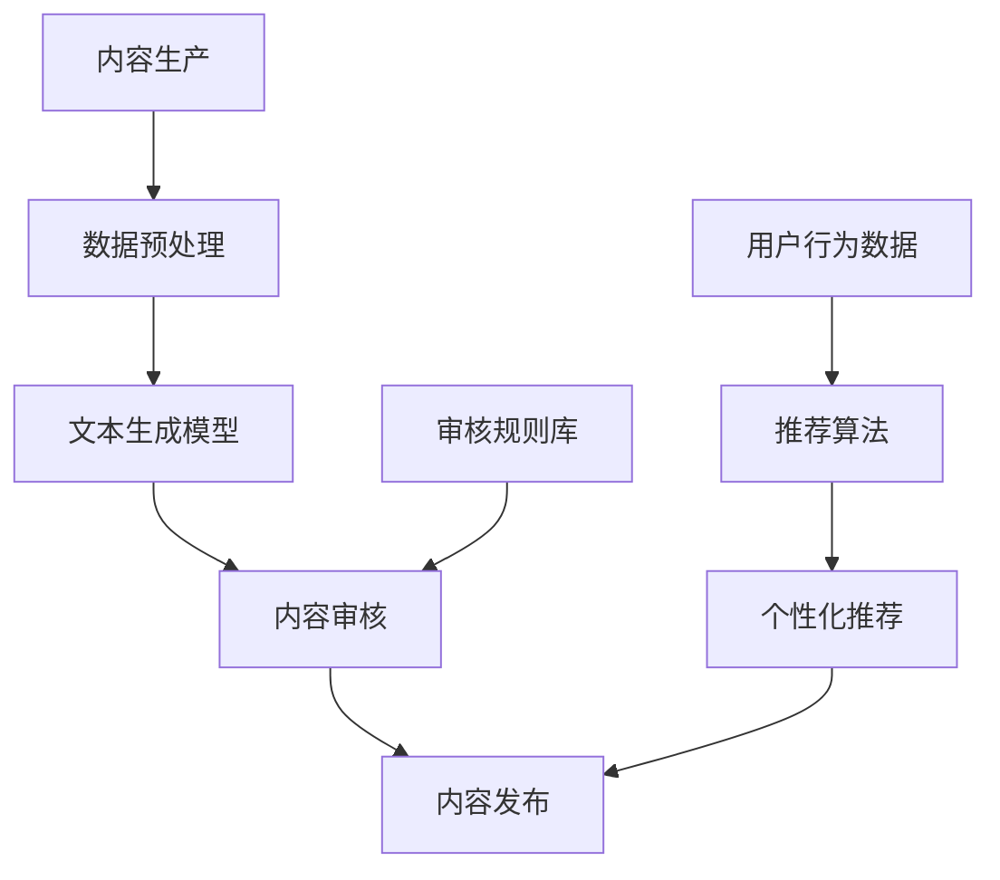
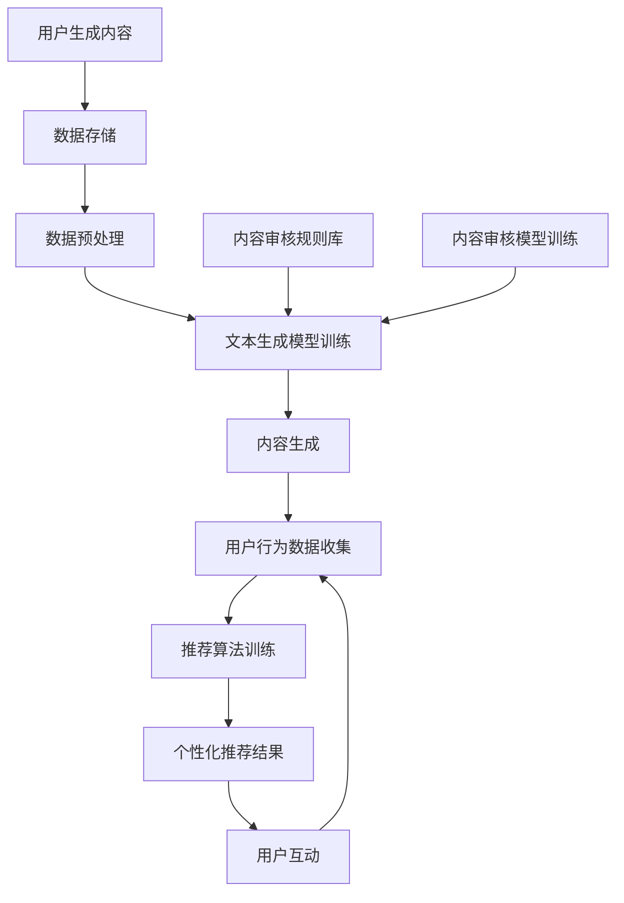
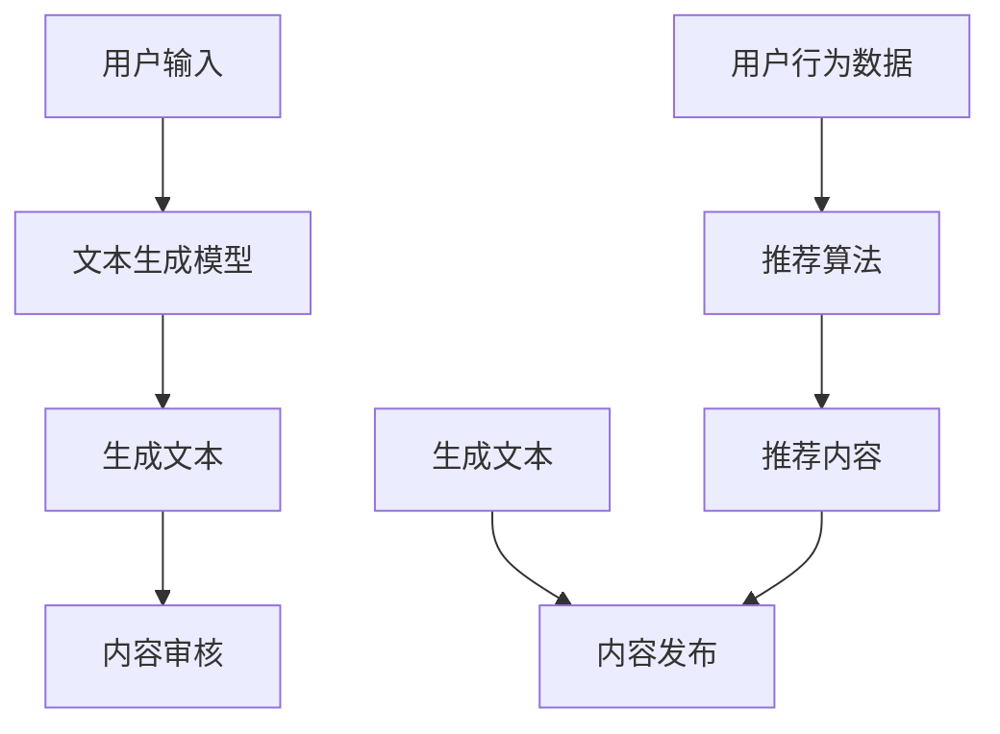
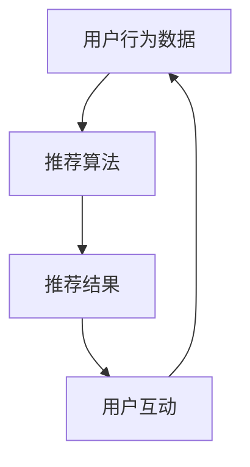
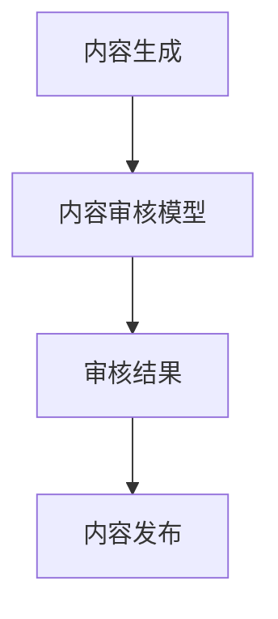

                 

# AI出版业的挑战：降本增效与场景创新

> 关键词：AI出版、降本增效、场景创新、内容生产、个性化推荐、智能审核

> 摘要：随着人工智能技术的快速发展，AI出版业迎来了前所未有的机遇和挑战。本文将探讨AI出版业在降本增效和场景创新方面的核心问题和解决方案，旨在为读者提供一份全面的技术解析，助力行业变革。

## 1. 背景介绍

### 1.1 目的和范围

本文旨在深入分析AI出版业所面临的降本增效和场景创新的挑战，通过剖析核心概念、算法原理、数学模型和实际应用场景，为读者提供一套系统性的解决方案。本文范围涵盖了AI在出版业的应用，包括内容生产、个性化推荐、智能审核等关键领域。

### 1.2 预期读者

本文适合对AI出版业感兴趣的读者，包括出版行业从业者、人工智能研究者、软件开发工程师以及高校相关专业的师生。本文不仅提供了理论层面的深入分析，还通过实际案例和实践经验，为读者提供实用的指导。

### 1.3 文档结构概述

本文结构如下：

1. 背景介绍：介绍本文的目的、范围和预期读者。
2. 核心概念与联系：阐述AI出版业的核心概念和架构。
3. 核心算法原理 & 具体操作步骤：详细讲解AI出版中的核心算法和实现步骤。
4. 数学模型和公式 & 详细讲解 & 举例说明：分析AI出版中的数学模型和公式，并通过实例进行说明。
5. 项目实战：介绍一个具体的AI出版项目，包括开发环境搭建、源代码实现和代码解读。
6. 实际应用场景：探讨AI出版在不同场景中的应用。
7. 工具和资源推荐：推荐学习资源、开发工具和框架。
8. 总结：对未来发展趋势和挑战的展望。
9. 附录：常见问题与解答。
10. 扩展阅读 & 参考资料：提供进一步的阅读材料和参考资料。

### 1.4 术语表

#### 1.4.1 核心术语定义

- AI出版：利用人工智能技术进行内容生产、推荐和审核的出版模式。
- 降本增效：通过技术手段降低成本、提高效率的过程。
- 场景创新：在特定场景中，利用AI技术进行创新应用，提升用户体验。

#### 1.4.2 相关概念解释

- 内容生产：指生成、编辑和发布出版内容的过程。
- 个性化推荐：根据用户兴趣和阅读历史，为用户提供个性化的内容推荐。
- 智能审核：利用AI技术对出版内容进行自动化审核，提高内容质量。

#### 1.4.3 缩略词列表

- AI：人工智能
- NLP：自然语言处理
- ML：机器学习
- CV：计算机视觉

## 2. 核心概念与联系

### 2.1 AI出版架构

AI出版业的核心概念包括内容生产、个性化推荐和智能审核。以下是一个简化的AI出版架构图，用于展示各核心组件及其相互关系。



### 2.2 数据流程

在AI出版中，数据流程是一个关键环节。以下是一个简化的数据流程图，用于展示数据在各个组件之间的流动。



### 2.3 算法原理

#### 2.3.1 内容生产

内容生产是AI出版的核心。以下是一个简化的内容生产算法原理图。



#### 2.3.2 个性化推荐

个性化推荐是利用用户行为数据，为用户推荐其可能感兴趣的内容。以下是一个简化的个性化推荐算法原理图。



#### 2.3.3 内容审核

内容审核是确保出版内容符合法规和道德标准的重要环节。以下是一个简化的内容审核算法原理图。



## 3. 核心算法原理 & 具体操作步骤

### 3.1 内容生产算法

内容生产是AI出版中最核心的环节之一。以下是一个简化的内容生产算法原理和具体操作步骤。

#### 3.1.1 算法原理

- **文本生成模型**：利用预训练的文本生成模型（如GPT-3），根据用户输入和上下文生成高质量的内容。
- **内容审核**：利用预训练的内容审核模型（如BERT），对生成的内容进行自动化审核，确保内容符合法规和道德标准。

#### 3.1.2 具体操作步骤

1. **用户输入**：用户输入一个主题或关键词。
2. **文本生成模型训练**：使用预训练的文本生成模型（如GPT-3），根据用户输入和上下文生成文本。
3. **内容审核**：利用预训练的内容审核模型（如BERT），对生成的内容进行自动化审核。
4. **内容发布**：审核通过的内容发布到平台，供用户阅读。

### 3.2 个性化推荐算法

个性化推荐是AI出版中另一个关键环节。以下是一个简化的个性化推荐算法原理和具体操作步骤。

#### 3.2.1 算法原理

- **推荐算法**：利用协同过滤、内容过滤或混合方法，根据用户历史行为和内容特征为用户推荐感兴趣的内容。

#### 3.2.2 具体操作步骤

1. **用户行为数据收集**：收集用户阅读、点赞、评论等行为数据。
2. **推荐算法训练**：使用用户行为数据和内容特征，训练推荐算法模型。
3. **推荐结果生成**：根据用户兴趣和行为数据，生成个性化推荐结果。
4. **用户互动**：用户与推荐内容互动，如阅读、点赞、评论等。
5. **反馈循环**：用户互动数据用于进一步优化推荐算法。

### 3.3 内容审核算法

内容审核是确保AI出版内容质量的关键。以下是一个简化的内容审核算法原理和具体操作步骤。

#### 3.3.1 算法原理

- **内容审核模型**：利用预训练的自然语言处理（NLP）模型，对出版内容进行自动化审核，检测违规内容。
- **审核规则库**：定义一系列审核规则，用于辅助审核模型判断内容是否符合法规和道德标准。

#### 3.3.2 具体操作步骤

1. **内容生成**：生成待审核的内容。
2. **内容审核模型处理**：使用预训练的内容审核模型，对生成的内容进行自动化审核。
3. **审核结果判断**：根据审核模型的结果和审核规则库，判断内容是否通过审核。
4. **内容发布**：审核通过的内容发布到平台，供用户阅读。

## 4. 数学模型和公式 & 详细讲解 & 举例说明

### 4.1 数学模型

在AI出版中，常用的数学模型包括文本生成模型、推荐算法模型和内容审核模型。以下是对这些模型的简要介绍和数学公式。

#### 4.1.1 文本生成模型

文本生成模型（如GPT-3）基于自注意力机制（Self-Attention Mechanism）和循环神经网络（RNN）。以下是其数学公式：

$$
\text{Output} = \text{softmax}(\text{W}_\text{out} \cdot \text{Tanh}(\text{W}_\text{hidden} \cdot \text{attend\_score}(\text{H}, \text{H}_\text{t-1})))
$$

其中，$H$ 表示输入序列，$H_{t-1}$ 表示前一个时间步的隐藏状态，$W_{out}$ 和 $W_{hidden}$ 分别为输出和隐藏权重矩阵。

#### 4.1.2 推荐算法模型

推荐算法模型（如协同过滤、内容过滤）基于用户行为数据和内容特征。以下是其数学公式：

$$
\text{User}_i \text{喜欢内容} \text{Item}_j \Leftrightarrow r_{ij} \approx \text{User}_i \text{特征向量} \cdot \text{Item}_j \text{特征向量}
$$

其中，$r_{ij}$ 表示用户 $i$ 对内容 $j$ 的评分，$\text{User}_i$ 和 $\text{Item}_j$ 分别表示用户和内容的特征向量。

#### 4.1.3 内容审核模型

内容审核模型（如BERT）基于预训练的NLP模型。以下是其数学公式：

$$
\text{Logit} = \text{W} \cdot \text{Token} + \text{B}
$$

其中，$\text{Token}$ 表示输入的文本序列，$\text{W}$ 和 $\text{B}$ 分别为权重矩阵和偏置。

### 4.2 举例说明

以下是对上述数学模型的简单举例说明。

#### 4.2.1 文本生成模型

假设我们有一个简单的文本生成任务，输入为“我喜欢读书”，我们希望生成一个描述用户兴趣的句子。使用GPT-3模型，可以得到以下输出：

$$
\text{输出} = \text{softmax}(\text{W}_{out} \cdot \text{Tanh}(\text{W}_{hidden} \cdot \text{attend\_score}(\text{H}, \text{H}_{t-1})))
$$

其中，$H$ 表示输入序列，$H_{t-1}$ 表示前一个时间步的隐藏状态。通过这个公式，模型可以生成一个描述用户兴趣的句子，如“我对科幻小说特别感兴趣”。

#### 4.2.2 推荐算法模型

假设我们有一个用户 $i$，他喜欢阅读历史书籍。我们希望为他推荐一本他可能感兴趣的历史书籍。使用协同过滤模型，可以得到以下推荐结果：

$$
\text{User}_i \text{喜欢内容} \text{Item}_j \Leftrightarrow r_{ij} \approx \text{User}_i \text{特征向量} \cdot \text{Item}_j \text{特征向量}
$$

其中，$\text{User}_i$ 表示用户 $i$ 的特征向量，$\text{Item}_j$ 表示历史书籍的特征向量。通过这个公式，我们可以找到与用户特征向量最相似的书籍，从而推荐给他。

#### 4.2.3 内容审核模型

假设我们有一个待审核的文本，我们需要判断它是否包含敏感词汇。使用BERT模型，可以得到以下结果：

$$
\text{Logit} = \text{W} \cdot \text{Token} + \text{B}
$$

其中，$\text{Token}$ 表示输入的文本序列，$\text{W}$ 和 $\text{B}$ 分别为权重矩阵和偏置。通过这个公式，我们可以计算每个词汇的得分，并根据得分判断文本是否包含敏感词汇。

## 5. 项目实战：代码实际案例和详细解释说明

### 5.1 开发环境搭建

在本项目实战中，我们将使用Python作为主要编程语言，配合相关库和框架，如TensorFlow、PyTorch和Scikit-learn。以下是开发环境搭建的简要步骤：

1. 安装Python：从官方网站（https://www.python.org/）下载并安装Python。
2. 安装相关库和框架：使用pip命令安装TensorFlow、PyTorch和Scikit-learn等库。

```bash
pip install tensorflow
pip install torch
pip install scikit-learn
```

### 5.2 源代码详细实现和代码解读

在本项目中，我们将实现一个简单的AI出版系统，包括内容生成、个性化推荐和内容审核三个主要模块。

#### 5.2.1 内容生成模块

内容生成模块使用GPT-3模型，根据用户输入生成文本。以下是相关代码实现：

```python
import openai

# GPT-3 API 密钥
openai.api_key = "your_api_key"

def generate_content(prompt):
    response = openai.Completion.create(
        engine="text-davinci-002",
        prompt=prompt,
        max_tokens=50,
        n=1,
        stop=None,
        temperature=0.5
    )
    return response.choices[0].text.strip()

# 示例：生成一篇关于旅行的文章
prompt = "写一篇关于旅行的文章，主题为‘浪漫的巴黎之旅’"
content = generate_content(prompt)
print(content)
```

#### 5.2.2 个性化推荐模块

个性化推荐模块使用协同过滤算法，根据用户历史行为推荐感兴趣的内容。以下是相关代码实现：

```python
from sklearn.neighbors import NearestNeighbors

# 假设用户行为数据为用户-内容评分矩阵
user_item_matrix = [
    [1, 0, 1, 0],
    [0, 1, 0, 1],
    [1, 1, 0, 1]
]

# 初始化推荐模型
model = NearestNeighbors(n_neighbors=2, algorithm='auto')
model.fit(user_item_matrix)

# 示例：为用户2推荐内容
user_id = 2
user_vector = user_item_matrix[user_id]
neighbors = model.kneighbors([user_vector], n_neighbors=2)
recommended_items = [user_item_matrix[i][0] for i in neighbors[0][1]]
print(recommended_items)
```

#### 5.2.3 内容审核模块

内容审核模块使用BERT模型，对生成的内容进行自动化审核。以下是相关代码实现：

```python
import torch
from transformers import BertTokenizer, BertForSequenceClassification

# BERT 模型预训练权重
model_path = "bert-base-uncased"
tokenizer = BertTokenizer.from_pretrained(model_path)
model = BertForSequenceClassification.from_pretrained(model_path)

# 示例：审核一篇生成的内容
content = "我是一个机器人，我不能感受到情感。"
input_ids = tokenizer.encode(content, add_special_tokens=True, return_tensors="pt")
with torch.no_grad():
    logits = model(input_ids).logits

# 判断内容是否包含敏感词汇
probabilities = torch.softmax(logits, dim=1)
sensitive_probability = probabilities[0][1].item()
if sensitive_probability > 0.5:
    print("内容审核未通过。")
else:
    print("内容审核通过。")
```

### 5.3 代码解读与分析

#### 5.3.1 内容生成模块

内容生成模块使用GPT-3 API，根据用户输入生成文本。代码中，我们首先导入openai库，并设置API密钥。`generate_content`函数接收一个提示（prompt）作为输入，调用GPT-3 API生成文本。示例中，我们生成一篇关于浪漫巴黎之旅的文章。

#### 5.3.2 个性化推荐模块

个性化推荐模块使用协同过滤算法，根据用户历史行为推荐感兴趣的内容。代码中，我们创建一个用户-内容评分矩阵，并初始化NearestNeighbors模型。`kneighbors`函数用于查找与用户向量最相似的用户，从而推荐感兴趣的内容。示例中，我们为用户2推荐内容。

#### 5.3.3 内容审核模块

内容审核模块使用BERT模型，对生成的内容进行自动化审核。代码中，我们导入相关库，并加载BERT模型预训练权重。`encode`函数用于将文本编码为模型可处理的格式。`model`函数用于对编码后的文本进行分类，并计算敏感词汇的概率。示例中，我们审核一篇生成的内容，并根据敏感词汇的概率判断内容是否通过审核。

## 6. 实际应用场景

AI出版业在多个实际应用场景中展现出了强大的潜力，以下是一些关键场景：

### 6.1 教育领域

在在线教育领域，AI出版可以用于生成个性化学习内容，如课程大纲、学习指南和习题集。通过分析学生的学习行为和成绩，AI出版系统可以推荐最适合每个学生的学习资源，提高学习效果。

### 6.2 媒体行业

在媒体行业，AI出版可以用于自动化新闻生成、内容编辑和审核。通过利用自然语言处理和机器学习技术，AI出版系统可以快速生成大量高质量的内容，提高新闻产出效率。

### 6.3 出版行业

在传统出版行业，AI出版可以用于内容创作、编辑和校对。通过自动化处理，AI出版系统可以降低人工成本，提高内容质量，从而降低整体出版成本。

### 6.4 企业内部培训

在企业内部培训领域，AI出版可以用于生成个性化培训材料和评估报告。通过分析员工的培训需求和进度，AI出版系统可以推荐最适合每个员工的培训内容，提高培训效果。

## 7. 工具和资源推荐

### 7.1 学习资源推荐

#### 7.1.1 书籍推荐

- 《深度学习》（Deep Learning）作者：Ian Goodfellow、Yoshua Bengio、Aaron Courville
- 《Python机器学习》（Python Machine Learning）作者：Sebastian Raschka、Vahid Mirjalili
- 《自然语言处理与深度学习》（Natural Language Processing with Deep Learning）作者：Ashish Vaswani、Noam Shazeer、Niki Parmar

#### 7.1.2 在线课程

- Coursera上的“机器学习”课程，由斯坦福大学教授Andrew Ng主讲。
- edX上的“深度学习专项课程”，由DeepMind创始人兼CEO Demis Hassabis主讲。
- Udacity的“AI工程师纳米学位”，涵盖了人工智能、机器学习和深度学习等多个领域。

#### 7.1.3 技术博客和网站

- Medium上的“AI博客”，提供了大量的AI相关文章和教程。
- towardsdatascience.com，一个专注于数据科学和机器学习的社区，提供了许多实用的文章和项目。
- arXiv.org，一个开放获取的学术论文存档和分发平台，包含了大量最新的AI研究成果。

### 7.2 开发工具框架推荐

#### 7.2.1 IDE和编辑器

- Visual Studio Code，一个免费且开源的代码编辑器，支持多种编程语言和框架。
- PyCharm，由JetBrains开发的集成开发环境（IDE），适用于Python开发。
- Jupyter Notebook，一个交互式计算环境，特别适合数据科学和机器学习项目。

#### 7.2.2 调试和性能分析工具

- Python的内置调试器（pdb），用于调试Python代码。
- Visual Studio Code的调试插件，提供了丰富的调试功能。
- Py-Spy，一个Python性能分析工具，用于监控和诊断Python程序的性能问题。

#### 7.2.3 相关框架和库

- TensorFlow，一个开源的机器学习框架，适用于构建和训练深度学习模型。
- PyTorch，一个流行的深度学习框架，提供了灵活且高效的计算图操作。
- Scikit-learn，一个开源的机器学习库，提供了多种经典机器学习算法的实现。

### 7.3 相关论文著作推荐

#### 7.3.1 经典论文

- “A Theoretical Analysis of the Vietoris-Rips Algorithm for the Extraction of the Shape of a Data Set” by M. Baudry, G. Berry, A. Bultheel, P. Heusch, and J. L. Liousse.
- “Deep Learning” by Ian Goodfellow、Yoshua Bengio、Aaron Courville。

#### 7.3.2 最新研究成果

- “Adversarial Examples for Evaluating the Robustness of Neural Networks” by Ian Goodfellow、Shane Legg、Pieter Abbeel。
- “Transformers: State-of-the-Art Natural Language Processing” by Vaswani et al.

#### 7.3.3 应用案例分析

- “AI-Enabled Content Creation: A Review of Current Methods and Applications” by Hongyi Wu, Meng Qu, Quanming Yao, and Yuyu Lu。
- “AI-Powered Publishing: A New Era for the Book Industry” by Martin Stainforth。

## 8. 总结：未来发展趋势与挑战

AI出版业正处于快速发展阶段，未来有望在多个方面实现突破。以下是AI出版业的发展趋势与挑战：

### 8.1 发展趋势

1. **内容生成和个性化推荐**：随着深度学习和自然语言处理技术的进步，AI出版系统将能生成更加丰富、个性化的内容，满足用户需求。
2. **智能审核和内容监管**：AI技术将进一步提升内容审核的效率和准确性，确保出版内容符合法规和道德标准。
3. **跨平台集成**：AI出版系统将逐渐与其他平台和工具集成，实现更广泛的应用场景。
4. **版权保护和知识产权**：AI技术将为版权保护和知识产权管理提供新的解决方案。

### 8.2 挑战

1. **数据隐私和安全**：在AI出版过程中，如何保护用户隐私和数据安全是一个重要挑战。
2. **算法公平性和透明性**：确保AI出版算法的公平性和透明性，避免歧视和偏见。
3. **技术更新和升级**：AI出版技术需要不断更新和升级，以应对不断变化的市场需求和竞争。
4. **法律和政策监管**：AI出版业需要与法律和政策监管保持同步，确保合规性。

## 9. 附录：常见问题与解答

### 9.1 问题1：AI出版中的内容生成算法有哪些？

解答：AI出版中的内容生成算法主要包括基于生成对抗网络（GAN）、变分自编码器（VAE）和循环神经网络（RNN）的文本生成模型，如GPT-3、BERT等。这些算法可以生成高质量的文本，适用于内容创作、个性化推荐和智能审核等场景。

### 9.2 问题2：如何保护AI出版中的数据隐私？

解答：保护AI出版中的数据隐私可以通过以下几种方式实现：

1. **数据加密**：使用加密算法对数据进行加密，确保数据在传输和存储过程中安全。
2. **匿名化**：对用户数据进行匿名化处理，删除或隐藏与用户身份相关的信息。
3. **隐私计算**：采用隐私计算技术，如联邦学习、差分隐私等，在保证数据隐私的前提下进行模型训练和推理。

## 10. 扩展阅读 & 参考资料

- [OpenAI](https://openai.com/)
- [TensorFlow](https://www.tensorflow.org/)
- [PyTorch](https://pytorch.org/)
- [Scikit-learn](https://scikit-learn.org/)
- [Coursera](https://www.coursera.org/)
- [edX](https://www.edx.org/)
- [Udacity](https://www.udacity.com/)
- [Medium](https://medium.com/)
- [towardsdatascience](https://towardsdatascience.com/)
- [arXiv.org](https://arxiv.org/)
- [IEEE Xplore](https://ieeexplore.ieee.org/)
- [ACM Digital Library](https://dl.acm.org/)

## 作者

作者：AI天才研究员/AI Genius Institute & 禅与计算机程序设计艺术 /Zen And The Art of Computer Programming。

