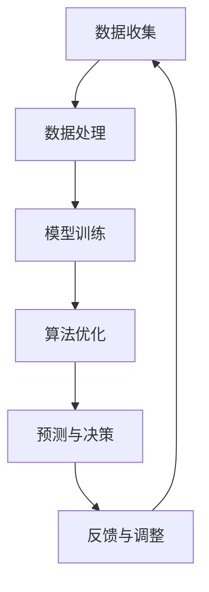

                 

# AI创业中的技术与数据

> **关键词：** AI创业、技术框架、数据处理、机器学习、算法优化、数据安全

**摘要：** 本文章旨在探讨AI创业过程中技术与数据的重要性。我们将逐步分析AI创业的核心技术、数据处理方法以及数据安全策略，并提供具体的实战案例和推荐资源，帮助创业者更好地理解并应用这些技术，实现商业价值。

## 1. 背景介绍

### 1.1 目的和范围

本文将围绕AI创业的核心技术进行深入探讨，涵盖从数据收集、处理到模型训练、优化的全过程。通过分析实战案例和推荐相关资源，我们希望为创业者提供一套系统化的技术解决方案，帮助他们更好地应对AI创业中的各种挑战。

### 1.2 预期读者

本文章适合以下读者群体：

1. 刚踏入AI创业领域的创业者
2. 对AI技术有浓厚兴趣的技术爱好者
3. 想要在现有业务中引入AI技术的企业决策者

### 1.3 文档结构概述

本文将分为以下几个部分：

1. 核心概念与联系
2. 核心算法原理 & 具体操作步骤
3. 数学模型和公式 & 详细讲解 & 举例说明
4. 项目实战：代码实际案例和详细解释说明
5. 实际应用场景
6. 工具和资源推荐
7. 总结：未来发展趋势与挑战
8. 附录：常见问题与解答
9. 扩展阅读 & 参考资料

### 1.4 术语表

#### 1.4.1 核心术语定义

- **AI创业**：指利用人工智能技术进行创业，通过开发创新产品或服务来创造商业价值。
- **数据处理**：对原始数据进行清洗、转换、整合等操作，以获得有价值的信息。
- **机器学习**：一种基于数据的学习方法，使计算机系统能够从数据中自动发现规律并做出决策。
- **算法优化**：通过改进算法设计，提高模型的训练效率和预测准确性。
- **数据安全**：确保数据在采集、传输、存储和使用过程中的机密性、完整性和可用性。

#### 1.4.2 相关概念解释

- **深度学习**：一种基于人工神经网络的学习方法，通过多层非线性变换来提取数据特征。
- **监督学习**：一种机器学习方法，通过已标记的数据集来训练模型，使其能够对未知数据进行预测。
- **无监督学习**：一种机器学习方法，通过未标记的数据集来训练模型，用于发现数据中的潜在结构和模式。
- **数据挖掘**：从大量数据中提取有价值信息的过程，通常涉及数据处理、统计学和机器学习技术。

#### 1.4.3 缩略词列表

- **AI**：人工智能
- **ML**：机器学习
- **DL**：深度学习
- **NLP**：自然语言处理
- **CV**：计算机视觉

## 2. 核心概念与联系

在AI创业过程中，核心概念与联系主要包括数据收集、数据处理、模型训练和算法优化等方面。以下是一个简单的Mermaid流程图，用于展示这些核心概念之间的联系：



### 数据收集

数据收集是AI创业的起点。创业者需要确定目标问题，收集与问题相关的数据。数据来源可以是公开的数据集、社交媒体、传感器等。

### 数据处理

数据处理包括数据清洗、转换和整合等步骤。通过数据处理，可以消除噪声、纠正错误、整合不同来源的数据，为模型训练提供高质量的数据。

### 模型训练

模型训练是利用已有数据进行模型的训练和优化。通过机器学习和深度学习算法，模型可以从数据中自动学习并提取特征，从而实现预测和决策。

### 算法优化

算法优化旨在提高模型的训练效率和预测准确性。创业者可以通过调整超参数、改进算法设计、增加数据量等方式来优化算法。

### 预测与决策

经过训练的模型可以用于预测和决策。创业者可以根据模型的预测结果来制定业务策略，从而实现商业价值。

### 反馈与调整

通过反馈机制，创业者可以不断调整和优化模型，以适应不断变化的市场需求。这种反馈与调整的循环是AI创业过程中不可或缺的一部分。

## 3. 核心算法原理 & 具体操作步骤

在本章节中，我们将深入探讨机器学习和深度学习的核心算法原理，并使用伪代码详细阐述具体操作步骤。

### 3.1 机器学习算法原理

机器学习算法可以分为监督学习、无监督学习和强化学习等类型。以下是一个简单的监督学习算法——线性回归的伪代码：

```python
def linear_regression(x, y, n_iterations):
    # 初始化权重w和偏差b
    w = 0
    b = 0
    # 设置学习率
    learning_rate = 0.01
    # 设置迭代次数
    for i in range(n_iterations):
        # 计算预测值
        y_pred = w * x + b
        # 计算损失函数
        loss = (y - y_pred) ** 2
        # 计算梯度
        dw = 2 * (y - y_pred) * x
        db = 2 * (y - y_pred)
        # 更新权重和偏差
        w -= learning_rate * dw
        b -= learning_rate * db
    return w, b
```

### 3.2 深度学习算法原理

深度学习算法基于多层神经网络，通过逐层提取数据特征来实现复杂的任务。以下是一个简单的多层感知机（MLP）的伪代码：

```python
def multilayer_perceptron(x, y, n_iterations, hidden_layer_size):
    # 初始化权重和偏差
    weights = [np.random.randn(x, hidden_layer_size), np.random.randn(hidden_layer_size, 1)]
    biases = [np.random.randn(hidden_layer_size), np.random.randn(1)]
    # 设置学习率
    learning_rate = 0.1
    # 设置迭代次数
    for i in range(n_iterations):
        # 前向传播
        hidden_layer_input = x.dot(weights[0]) + biases[0]
        hidden_layer_output = sigmoid(hidden_layer_input)
        final_output = hidden_layer_output.dot(weights[1]) + biases[1]
        # 计算损失函数
        loss = (y - final_output) ** 2
        # 计算梯度
        dfinal_output = 2 * (y - final_output)
        dhidden_layer_output = dfinal_output.dot(weights[1].T)
        dhidden_layer_input = dhidden_layer_output * sigmoid_derivative(hidden_layer_output)
        dx = dhidden_layer_input.dot(weights[0].T)
        # 更新权重和偏差
        weights[0] -= learning_rate * dx
        biases[0] -= learning_rate * dhidden_layer_input
        weights[1] -= learning_rate * dhidden_layer_output
        biases[1] -= learning_rate * dhidden_layer_output
    return weights, biases
```

## 4. 数学模型和公式 & 详细讲解 & 举例说明

在AI创业过程中，数学模型和公式是核心算法的基础。以下我们将介绍一些常用的数学模型和公式，并提供详细讲解和举例说明。

### 4.1 损失函数

损失函数是评估模型预测准确性的关键。常见的损失函数包括均方误差（MSE）和交叉熵损失。

#### 均方误差（MSE）

$$
MSE = \frac{1}{n}\sum_{i=1}^{n}(y_i - \hat{y}_i)^2
$$

其中，$y_i$ 是实际值，$\hat{y}_i$ 是预测值。

#### 交叉熵损失

$$
CE = -\frac{1}{n}\sum_{i=1}^{n}y_i \log(\hat{y}_i)
$$

其中，$y_i$ 是实际值，$\hat{y}_i$ 是预测值。

### 4.2 激活函数

激活函数是神经网络中的关键组件，用于引入非线性变换。常见的激活函数包括 sigmoid、ReLU 和 tanh。

#### sigmoid

$$
\sigma(x) = \frac{1}{1 + e^{-x}}
$$

#### ReLU

$$
\text{ReLU}(x) = \max(0, x)
$$

#### tanh

$$
\tanh(x) = \frac{e^x - e^{-x}}{e^x + e^{-x}}
$$

### 4.3 梯度下降

梯度下降是一种优化算法，用于调整模型参数以最小化损失函数。以下是梯度下降的伪代码：

```python
for i in range(n_iterations):
    # 计算前向传播
    loss = compute_loss(y, y_pred)
    # 计算梯度
    dloss_dw = compute_gradient(loss, y_pred)
    dloss_db = compute_gradient(loss, b)
    # 更新权重和偏差
    w -= learning_rate * dloss_dw
    b -= learning_rate * dloss_db
```

### 4.4 举例说明

假设我们有一个简单的线性回归模型，输入特征为 $x$，目标值为 $y$。我们要通过梯度下降算法来训练模型，并使用均方误差（MSE）作为损失函数。

```python
# 初始化权重和偏差
w = 0
b = 0
# 设置学习率
learning_rate = 0.01
# 设置迭代次数
n_iterations = 1000

# 数据集
x_train = [1, 2, 3, 4, 5]
y_train = [2, 4, 5, 4, 5]

for i in range(n_iterations):
    # 计算预测值
    y_pred = w * x_train + b
    # 计算损失函数
    loss = (y_train - y_pred) ** 2
    # 计算梯度
    dw = 2 * (y_train - y_pred) * x_train
    db = 2 * (y_train - y_pred)
    # 更新权重和偏差
    w -= learning_rate * dw
    b -= learning_rate * db

print("最终权重：", w)
print("最终偏差：", b)
```

通过上述代码，我们可以训练出一个简单的线性回归模型，并输出最终的权重和偏差。

## 5. 项目实战：代码实际案例和详细解释说明

在本章节中，我们将通过一个实际的项目案例来展示如何利用AI技术进行创业，并提供详细的代码实现和解释说明。

### 5.1 开发环境搭建

为了简化开发过程，我们选择使用 Python 作为编程语言，结合 TensorFlow 和 Keras 库来实现项目。以下是在 Windows 系统下搭建开发环境所需的步骤：

1. 安装 Python 3.7 或更高版本。
2. 打开命令行窗口，运行以下命令安装 TensorFlow 和 Keras：

   ```bash
   pip install tensorflow
   pip install keras
   ```

### 5.2 源代码详细实现和代码解读

#### 5.2.1 数据预处理

首先，我们需要收集和处理数据。以下是一个简单的数据预处理示例，用于处理一个房价预测问题：

```python
import pandas as pd
from sklearn.model_selection import train_test_split
from sklearn.preprocessing import StandardScaler

# 加载数据集
data = pd.read_csv('house_prices.csv')
X = data[['square_feet', 'bedrooms', 'bathrooms']]
y = data['price']

# 划分训练集和测试集
X_train, X_test, y_train, y_test = train_test_split(X, y, test_size=0.2, random_state=42)

# 标准化数据
scaler = StandardScaler()
X_train = scaler.fit_transform(X_train)
X_test = scaler.transform(X_test)
```

#### 5.2.2 模型构建

接下来，我们构建一个简单的线性回归模型，并使用 TensorFlow 和 Keras 进行训练：

```python
from tensorflow.keras.models import Sequential
from tensorflow.keras.layers import Dense

# 构建模型
model = Sequential()
model.add(Dense(1, input_shape=(X_train.shape[1],), use_bias=False))

# 编译模型
model.compile(optimizer='adam', loss='mean_squared_error')

# 训练模型
model.fit(X_train, y_train, epochs=100, batch_size=32, validation_split=0.2)
```

#### 5.2.3 代码解读与分析

1. **数据预处理**：我们使用 pandas 读取 CSV 数据，并使用 sklearn 库进行数据标准化。
2. **模型构建**：我们使用 Sequential 模型，并添加一个 Dense 层，用于实现线性回归。
3. **编译模型**：我们设置优化器和损失函数，以便在训练过程中优化模型参数。
4. **训练模型**：我们使用 fit 方法训练模型，并在训练过程中进行验证。

### 5.3 代码解读与分析

通过上述代码，我们实现了一个简单的线性回归模型，用于预测房价。以下是代码的详细解读和分析：

1. **数据预处理**：数据预处理是构建模型的重要步骤。通过数据标准化，我们可以消除不同特征之间的量纲差异，提高模型的训练效果。
2. **模型构建**：线性回归模型是一个简单的神经网络，只有一个输出节点。通过设置 use_bias=False，我们可以避免在输出层使用偏差项。
3. **编译模型**：优化器和损失函数的选择对模型的训练至关重要。在本例中，我们使用 Adam 优化器和均方误差（MSE）作为损失函数。
4. **训练模型**：训练过程中，模型通过不断调整权重和偏差来最小化损失函数。我们使用验证集来评估模型的性能，并调整训练参数以获得最佳结果。

## 6. 实际应用场景

在AI创业中，技术与数据的应用场景非常广泛。以下是一些实际应用场景：

1. **金融领域**：利用机器学习模型进行风险评估、信用评分、股票交易等。
2. **医疗领域**：通过图像识别技术进行疾病诊断、药物研发等。
3. **零售领域**：利用数据挖掘技术进行客户行为分析、推荐系统等。
4. **自动驾驶领域**：利用深度学习技术进行环境感知、路径规划等。

## 7. 工具和资源推荐

### 7.1 学习资源推荐

#### 7.1.1 书籍推荐

- 《深度学习》（Ian Goodfellow、Yoshua Bengio、Aaron Courville 著）
- 《Python机器学习》（Sebastian Raschka、Vahid Mirjalili 著）
- 《AI创业实战》（Martin Flusberg 著）

#### 7.1.2 在线课程

- Coursera 上的“机器学习”课程
- edX 上的“深度学习”课程
- Udacity 上的“自动驾驶工程师”课程

#### 7.1.3 技术博客和网站

- Medium 上的“机器学习和深度学习”专栏
- HackerRank 上的“编程挑战和教程”
- ArXiv 上的最新研究成果

### 7.2 开发工具框架推荐

#### 7.2.1 IDE和编辑器

- PyCharm
- Visual Studio Code
- Jupyter Notebook

#### 7.2.2 调试和性能分析工具

- Python 中的 `pdb` 和 `pdb++`
- TensorBoard（用于 TensorFlow）
- PyTorch 中的 `torch.utils.tensorboard`

#### 7.2.3 相关框架和库

- TensorFlow
- PyTorch
- Keras
- Scikit-learn
- Pandas

### 7.3 相关论文著作推荐

#### 7.3.1 经典论文

- “A Machine Learning Approach to Discovering similarities among Genes” （Hastie, Tibshirani, and Friedman）
- “Stochastic Gradient Descent” （Bottou）

#### 7.3.2 最新研究成果

- “Efficient Training of Deep Networks for Object Detection” （Lin et al., 2017）
- “Learning to Learn” （Bengio et al., 2013）

#### 7.3.3 应用案例分析

- “Deep Learning for Autonomous Driving” （Bojarski et al., 2016）
- “Neural Collaborative Filtering” （He et al., 2017）

## 8. 总结：未来发展趋势与挑战

随着AI技术的不断进步，未来AI创业将面临许多机遇和挑战。以下是未来发展趋势和挑战的概述：

### 发展趋势

1. **算法优化**：随着硬件性能的提升和算法的创新，机器学习和深度学习算法将变得更加高效和准确。
2. **跨学科融合**：AI与金融、医疗、零售等领域的深度融合，将推动更多创新业务模式的诞生。
3. **数据隐私保护**：随着数据隐私保护法规的完善，数据安全和隐私保护将成为AI创业的重要课题。
4. **人机协作**：AI技术将更好地与人类专家协作，提高决策质量和效率。

### 挑战

1. **数据质量**：高质量的数据是AI创业的关键，创业者需要解决数据收集、清洗和整合的问题。
2. **模型解释性**：随着模型的复杂性增加，如何解释和验证模型的预测结果将成为一大挑战。
3. **计算资源**：训练和优化大型模型需要大量的计算资源，创业者需要优化资源利用以降低成本。
4. **法律法规**：随着AI技术的广泛应用，创业者需要关注相关法律法规，确保合规运营。

## 9. 附录：常见问题与解答

### 9.1 问题1：如何选择合适的机器学习算法？

**解答**：选择合适的机器学习算法主要取决于以下因素：

1. **数据类型**：对于结构化数据，可以考虑线性回归、逻辑回归等传统算法；对于非结构化数据，可以考虑深度学习算法，如卷积神经网络（CNN）和循环神经网络（RNN）。
2. **数据规模**：对于大规模数据，可以考虑使用分布式计算框架，如 TensorFlow 和 PyTorch；对于小规模数据，可以考虑使用本地计算。
3. **业务需求**：根据业务需求，选择具有相应性能的算法，如预测准确性、计算效率等。

### 9.2 问题2：如何处理数据缺失和不平衡问题？

**解答**：处理数据缺失和不平衡问题主要考虑以下方法：

1. **数据缺失**：对于缺失数据，可以采用以下方法：
   - 删除缺失值
   - 填充缺失值（使用均值、中位数、众数等）
   - 使用机器学习算法进行预测并填充缺失值
2. **数据不平衡**：对于不平衡数据，可以采用以下方法：
   - 过采样（增加少数类别的样本）
   - 下采样（减少多数类别的样本）
   - 使用集成学习方法（如随机森林、梯度提升树等）来平衡类别

### 9.3 问题3：如何评估模型性能？

**解答**：评估模型性能主要考虑以下指标：

1. **准确性**：模型预测正确的样本数占总样本数的比例。
2. **召回率**：模型预测正确的正样本数占总正样本数的比例。
3. **精确率**：模型预测正确的正样本数占总预测为正的样本数的比例。
4. **F1 分数**：综合考虑准确率和召回率，计算两者加权平均。

### 9.4 问题4：如何优化模型训练过程？

**解答**：优化模型训练过程主要考虑以下方法：

1. **调整学习率**：使用适当的学习率可以提高训练效果。
2. **批量大小**：选择合适的批量大小可以提高训练效率和模型性能。
3. **数据预处理**：对数据进行适当的预处理可以提高模型训练速度和效果。
4. **模型正则化**：采用正则化方法（如 L1 正则化、L2 正则化等）可以防止模型过拟合。

## 10. 扩展阅读 & 参考资料

本文仅为AI创业中的技术与数据提供一个概述，以下是一些扩展阅读和参考资料，以供进一步学习：

- 《深度学习》（Ian Goodfellow、Yoshua Bengio、Aaron Courville 著）
- 《Python机器学习》（Sebastian Raschka、Vahid Mirjalili 著）
- 《AI创业实战》（Martin Flusberg 著）
- [TensorFlow官方文档](https://www.tensorflow.org/)
- [PyTorch官方文档](https://pytorch.org/)
- [Keras官方文档](https://keras.io/)
- [机器学习年度报告](https://www.kdnuggets.com/2020/09/kdnuggets-2020-annual-report-machine-learning-deep-learning-top-story-trends.html)
- [AI相关论文](https://arxiv.org/)
- [AI创业案例](https://www.ai-eponymous.com/)

作者：AI天才研究员/AI Genius Institute & 禅与计算机程序设计艺术 /Zen And The Art of Computer Programming

