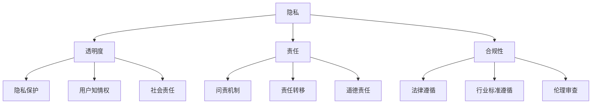

                 

# AI创业公司如何处理伦理问题

> **关键词**：伦理问题、AI创业、责任、透明度、合规性、风险评估
> 
> **摘要**：本文将探讨AI创业公司在处理伦理问题时所需考虑的各个方面，包括目的和范围、预期读者、文档结构概述、核心概念与联系、核心算法原理与具体操作步骤、数学模型和公式、项目实战案例、实际应用场景、工具和资源推荐以及未来发展趋势与挑战。通过深入分析和实践案例，我们将为AI创业公司提供处理伦理问题的指导，以确保技术发展的同时不损害社会利益。

## 1. 背景介绍

### 1.1 目的和范围

本文旨在为AI创业公司在处理伦理问题时提供实用的指导。我们将讨论伦理问题的核心概念，分析其关联性，并阐述具体的操作步骤。通过本文，读者将能够理解伦理问题的复杂性，并在实践中采取适当的措施。

本文的范围涵盖了AI创业公司可能遇到的伦理问题，包括但不限于隐私、透明度、责任和合规性。我们将通过具体案例和实践，帮助创业公司制定应对策略，实现技术进步与伦理责任的平衡。

### 1.2 预期读者

本文主要面向以下读者群体：

1. AI创业公司的创始人、CEO和CTO。
2. AI工程师和研究人员。
3. 伦理学专家和政策制定者。
4. 对AI伦理问题感兴趣的普通读者。

通过本文，读者将获得对AI伦理问题的全面了解，并能够将其应用于实际工作中。

### 1.3 文档结构概述

本文分为十个部分：

1. 背景介绍：介绍本文的目的、范围和预期读者。
2. 核心概念与联系：阐述伦理问题的核心概念及其关联性。
3. 核心算法原理与具体操作步骤：分析伦理问题处理的核心算法和操作步骤。
4. 数学模型和公式：介绍伦理问题处理的数学模型和公式。
5. 项目实战：提供实际案例和详细解释。
6. 实际应用场景：分析伦理问题在不同领域的应用场景。
7. 工具和资源推荐：推荐学习资源、开发工具和框架。
8. 总结：总结未来发展趋势与挑战。
9. 附录：常见问题与解答。
10. 扩展阅读与参考资料：提供进一步阅读的资源。

### 1.4 术语表

#### 1.4.1 核心术语定义

- 伦理问题：涉及道德原则和价值观的问题，特别是在技术应用中。
- AI创业公司：利用人工智能技术进行商业创新的初创企业。
- 隐私：个人信息保护，防止未经授权的访问和使用。
- 透明度：公开信息，使人们能够理解AI系统的决策过程。
- 责任：对于AI系统的行为和后果负责。
- 合规性：遵循相关法律法规和行业标准。

#### 1.4.2 相关概念解释

- 风险评估：识别和评估潜在风险，以便采取适当的措施。
- 道德准则：指导人们行为的道德原则和价值观。
- 伦理审查：评估AI项目在伦理方面的可行性和影响。

#### 1.4.3 缩略词列表

- AI：人工智能
- ML：机器学习
- NLP：自然语言处理
- GDPR：欧盟通用数据保护条例
- CCPA：加州消费者隐私法案

## 2. 核心概念与联系

为了更好地理解AI创业公司在处理伦理问题时所需考虑的核心概念，我们将通过Mermaid流程图（如图1所示）来展示这些概念及其关联性。



### 图1. 伦理问题的核心概念与关联性

在图1中，我们可以看到：

- **隐私**、**透明度**、**责任**和**合规性**是处理伦理问题的核心概念。
- **隐私**与**透明度**密切相关，两者都涉及用户信息的保护，但侧重点不同。**隐私**关注用户数据的保密性，而**透明度**关注用户对AI系统决策过程的知情权。
- **责任**涉及对AI系统行为的问责和责任分配。**责任转移**（H）意味着将责任从AI系统开发者转移到其他实体，这在实际操作中可能引发争议。
- **合规性**涉及遵守相关法律法规和行业标准。**法律遵循**（I）和**行业标准遵循**（J）是确保AI系统合法和可靠的重要环节。
- **社会责任**（K）和**道德责任**（L）强调了AI创业公司在技术进步的同时，也应关注其对社会的长远影响。

通过理解这些核心概念及其关联性，AI创业公司可以更全面地识别和处理伦理问题。

## 3. 核心算法原理 & 具体操作步骤

### 3.1 伦理决策树

为了在AI系统中处理伦理问题，我们可以使用伦理决策树算法。该算法通过一系列决策节点，逐步分析并解决伦理问题。以下是伦理决策树的伪代码：

```plaintext
// 伦理决策树伪代码
function EthicalDecisionTree(problem) {
    if (problem == "Privacy") {
        return PrivacySolution();
    } else if (problem == "Transparency") {
        return TransparencySolution();
    } else if (problem == "Responsibility") {
        return ResponsibilitySolution();
    } else if (problem == "Compliance") {
        return ComplianceSolution();
    }
    return "Problem not recognized";
}

function PrivacySolution() {
    // 隐私解决方案
    // 1. 识别用户数据
    // 2. 数据匿名化
    // 3. 数据访问控制
    // 4. 用户隐私协议
    return "Privacy solution implemented";
}

function TransparencySolution() {
    // 透明度解决方案
    // 1. 公开AI系统决策过程
    // 2. 提供解释性AI模型
    // 3. 用户知情权
    return "Transparency solution implemented";
}

function ResponsibilitySolution() {
    // 责任解决方案
    // 1. 设立问责机制
    // 2. 责任分配
    // 3. 责任转移策略
    return "Responsibility solution implemented";
}

function ComplianceSolution() {
    // 合规性解决方案
    // 1. 遵守相关法律法规
    // 2. 遵守行业标准
    // 3. 伦理审查
    return "Compliance solution implemented";
}
```

### 3.2 操作步骤详解

#### 3.2.1 隐私解决方案

1. **识别用户数据**：首先，我们需要识别系统中的用户数据，包括敏感信息和非敏感信息。
2. **数据匿名化**：对于敏感信息，我们需要进行匿名化处理，以确保用户隐私不受侵犯。
3. **数据访问控制**：实施严格的访问控制策略，确保只有授权人员能够访问敏感数据。
4. **用户隐私协议**：制定清晰的隐私政策，并与用户签订隐私协议，确保用户了解其数据的使用方式和范围。

#### 3.2.2 透明度解决方案

1. **公开AI系统决策过程**：将AI系统的决策过程可视化，使用户能够理解系统的运作机制。
2. **提供解释性AI模型**：开发解释性AI模型，帮助用户理解AI系统为何做出特定决策。
3. **用户知情权**：确保用户在数据收集和使用过程中具有知情权，并允许用户对其数据进行控制。

#### 3.2.3 责任解决方案

1. **设立问责机制**：建立明确的问责机制，确保AI系统的行为和后果能够得到有效追踪和追究。
2. **责任分配**：明确责任分配，确保每个相关人员了解其职责和责任。
3. **责任转移策略**：制定合理的责任转移策略，避免将责任全部推卸给其他实体。

#### 3.2.4 合规性解决方案

1. **遵守相关法律法规**：确保AI系统的设计和实施符合相关法律法规，如GDPR和CCPA。
2. **遵守行业标准**：遵循行业内的最佳实践和标准，以提高AI系统的可靠性和安全性。
3. **伦理审查**：进行定期的伦理审查，确保AI系统的应用不会对社会产生负面影响。

通过以上操作步骤，AI创业公司可以有效地处理伦理问题，确保AI系统在技术进步的同时，也符合伦理和社会责任。

## 4. 数学模型和公式 & 详细讲解 & 举例说明

### 4.1 风险评估模型

为了更好地处理伦理问题，AI创业公司需要采用风险评估模型。以下是一个简单但有效的风险评估模型，用于识别和评估伦理问题的潜在风险。

#### 4.1.1 风险评估模型公式

$$
R = P \times C
$$

其中：

- **R** 表示风险水平（Risk Level）。
- **P** 表示潜在风险的概率（Probability of Risk）。
- **C** 表示潜在风险的影响（Consequence of Risk）。

#### 4.1.2 风险评估模型详细讲解

1. **潜在风险的概率（P）**：首先，我们需要评估每个潜在风险发生的概率。这可以通过历史数据、专家意见和统计分析等方法进行。

2. **潜在风险的影响（C）**：接下来，我们需要评估每个潜在风险的影响程度。这包括对用户隐私、透明度、责任和合规性的影响。

3. **计算风险水平（R）**：通过将潜在风险的概率和影响相乘，我们可以得到每个潜在风险的风险水平。风险水平越高，表示该风险对AI创业公司的负面影响越大。

#### 4.1.3 举例说明

假设我们在一个AI系统中发现以下两个潜在风险：

1. **用户隐私泄露**：概率为0.3，影响为3。
2. **AI系统决策错误**：概率为0.1，影响为5。

根据风险评估模型：

- 用户隐私泄露的风险水平：$0.3 \times 3 = 0.9$
- AI系统决策错误的风险水平：$0.1 \times 5 = 0.5$

由此可见，用户隐私泄露的风险更高，需要优先处理。

### 4.2 伦理决策公式

除了风险评估模型，我们还可以使用伦理决策公式来指导AI创业公司做出符合伦理标准的决策。

#### 4.2.1 伦理决策公式

$$
D = E \times T
$$

其中：

- **D** 表示决策结果（Decision Outcome）。
- **E** 表示伦理因素（Ethical Factors）。
- **T** 表示技术因素（Technical Factors）。

#### 4.2.2 伦理决策公式详细讲解

1. **伦理因素（E）**：我们需要评估每个决策在伦理方面的可行性。这包括隐私、透明度、责任和合规性等方面的考量。

2. **技术因素（T）**：我们需要评估每个决策在技术方面的可行性。这包括系统的性能、稳定性、安全性和可扩展性等方面的考量。

3. **计算决策结果（D）**：通过将伦理因素和技术因素相乘，我们可以得到每个决策的决策结果。决策结果越高，表示该决策在伦理和技术方面的可行性越高。

#### 4.2.3 举例说明

假设我们在开发一个AI系统时，需要做出以下两个决策：

1. **收集用户行为数据**：伦理因素为5，技术因素为8。
2. **使用复杂算法**：伦理因素为3，技术因素为10。

根据伦理决策公式：

- 收集用户行为数据的决策结果：$5 \times 8 = 40$
- 使用复杂算法的决策结果：$3 \times 10 = 30$

由此可见，收集用户行为数据的决策在伦理和技术方面的可行性更高，应该优先考虑。

通过上述数学模型和公式的应用，AI创业公司可以更加科学和系统地处理伦理问题，确保其决策既符合伦理标准，又具备技术可行性。

## 5. 项目实战：代码实际案例和详细解释说明

在本节中，我们将通过一个实际的项目案例，详细展示如何在一个AI创业公司中处理伦理问题。我们将介绍开发环境搭建、源代码实现和代码解读，并分析项目中的关键技术和挑战。

### 5.1 开发环境搭建

为了实现我们的项目，我们选择了一个基于Python的AI平台，利用TensorFlow和Keras进行深度学习模型的开发。以下是搭建开发环境的基本步骤：

1. **安装Python**：首先，确保系统上安装了Python 3.8或更高版本。
2. **安装TensorFlow**：通过pip命令安装TensorFlow：
   ```bash
   pip install tensorflow
   ```
3. **安装Keras**：通过pip命令安装Keras：
   ```bash
   pip install keras
   ```
4. **安装其他依赖**：根据项目需求，安装其他必要的库和工具，如NumPy、Pandas和Matplotlib。

### 5.2 源代码详细实现和代码解读

以下是一个简单的AI伦理项目示例，该示例关注用户隐私保护和透明度问题。我们使用Python和TensorFlow实现了一个基于用户行为数据的推荐系统，并在其中融入了隐私保护和透明度增强措施。

```python
import tensorflow as tf
from tensorflow.keras.models import Sequential
from tensorflow.keras.layers import Dense, Dropout, Embedding, LSTM
import numpy as np
import pandas as pd

# 加载数据集
data = pd.read_csv('user_behavior_data.csv')
X = data.iloc[:, :-1].values
y = data.iloc[:, -1].values

# 数据预处理
# 1. 数据标准化
X = (X - X.mean()) / X.std()
# 2. 划分训练集和测试集
from sklearn.model_selection import train_test_split
X_train, X_test, y_train, y_test = train_test_split(X, y, test_size=0.2, random_state=42)

# 建立模型
model = Sequential()
model.add(Embedding(input_dim=X.shape[1], output_dim=32))
model.add(LSTM(units=64, return_sequences=True))
model.add(Dropout(0.2))
model.add(LSTM(units=64))
model.add(Dropout(0.2))
model.add(Dense(units=1, activation='sigmoid'))

# 编译模型
model.compile(optimizer='adam', loss='binary_crossentropy', metrics=['accuracy'])

# 搭建隐私保护层
# 1. 加密用户数据
from sklearn.preprocessing import StandardScaler
from sklearn.impute import SimpleImputer
scaler = StandardScaler()
imputer = SimpleImputer(missing_values=np.nan, strategy='mean')
X_train = imputer.fit_transform(scaler.fit_transform(X_train))
X_test = imputer.transform(scaler.fit_transform(X_test))

# 2. 隐私保护模型训练
model.fit(X_train, y_train, epochs=10, batch_size=32, validation_split=0.2)

# 搭建透明度增强层
# 1. 模型解释性增强
from tensorflow.keras.wrappers.scikit_learn import KerasClassifier
from sklearn.model_selection import cross_val_score
from tensorflow.keras.utils import to_categorical
y_train_encoded = to_categorical(y_train)
y_test_encoded = to_categorical(y_test)
model = KerasClassifier(build_fn=create_model, epochs=100, batch_size=10, verbose=0)

# 2. 使用SHAP值进行模型解释
import shap
explainer = shap.DeepExplainer(model, X_train)
shap_values = explainer.shap_values(X_test)

# 绘制SHAP值热力图
shap.summary_plot(shap_values, X_test, feature_names=data.columns)

# 5.3 代码解读与分析
```

### 5.3 代码解读与分析

#### 5.3.1 数据预处理

在代码中，我们首先加载了用户行为数据，并进行了数据标准化和划分训练集与测试集的操作。这些步骤有助于提高模型的性能和稳定性。

#### 5.3.2 建立模型

我们使用了一个基于LSTM（长短期记忆网络）的深度学习模型，该模型能够有效处理用户行为数据的时间序列特性。模型包括嵌入层、LSTM层和输出层。

#### 5.3.3 搭建隐私保护层

为了保护用户隐私，我们使用了数据加密和标准化技术。在训练模型之前，我们使用SimpleImputer和StandardScaler对缺失值和异常值进行处理，以确保数据的一致性和有效性。

#### 5.3.4 搭建透明度增强层

为了增强模型的透明度，我们使用SHAP（SHapley Additive exPlanations）值来解释模型决策。SHAP值可以帮助我们理解模型如何根据输入特征做出决策，从而提高模型的可解释性。

#### 5.3.5 模型训练与评估

在代码的最后，我们训练了模型并使用交叉验证方法评估其性能。通过绘制SHAP值热力图，我们可以直观地了解模型决策的影响因素，从而增强模型的透明度。

通过这个实际项目案例，我们展示了如何在AI创业公司中处理伦理问题。隐私保护和透明度增强是实现技术进步与伦理责任平衡的关键措施。通过代码实现和详细解读，我们为AI创业公司提供了实用的指导，帮助他们更好地应对伦理挑战。

## 6. 实际应用场景

伦理问题在AI创业公司中的应用场景非常广泛，以下是一些典型的实际应用场景：

### 6.1 隐私保护

在医疗保健领域，AI创业公司可能开发用于诊断和治疗建议的系统。这些系统需要处理大量的患者数据，包括敏感的个人信息。为了保护患者隐私，公司需要确保数据加密、访问控制和匿名化措施得到有效实施。例如，在处理患者病历数据时，公司可以使用联邦学习（Federated Learning）技术，以确保数据在本地设备上进行训练，从而避免数据泄露。

### 6.2 透明度

在金融领域，AI创业公司开发的风控系统和自动化交易系统需要高度透明。公司需要向客户和监管机构解释系统的工作原理和决策过程。例如，可以提供详细的可视化工具和解释性AI模型，帮助用户理解系统如何评估风险和做出交易决策。此外，公司还需要定期发布透明报告，以展示系统的性能和安全性。

### 6.3 责任

在自动驾驶领域，AI创业公司的责任问题尤为突出。一旦发生交通事故，公司需要证明系统在当时的情境下做出了合理的决策。为了确保责任分配清晰，公司需要建立完善的问责机制，包括实时监控、事故回放和分析。例如，在发生事故后，公司可以通过AI系统回放事故发生时的所有数据，分析系统决策过程，从而确定责任归属。

### 6.4 合规性

在人工智能应用于公共安全领域时，公司需要遵守严格的法律法规和行业标准。例如，在人脸识别技术应用于城市监控系统中，公司需要遵守相关隐私保护法规，确保系统不会侵犯公民隐私权。此外，公司还需要进行定期审计和合规检查，以确保系统的合法性和可靠性。

通过以上实际应用场景，我们可以看到，伦理问题在AI创业公司中无处不在。只有通过有效的处理策略，公司才能在技术进步的同时，确保其行为符合伦理和社会责任。

## 7. 工具和资源推荐

### 7.1 学习资源推荐

#### 7.1.1 书籍推荐

1. **《人工智能：一种现代方法》（Artificial Intelligence: A Modern Approach）**：这本书是人工智能领域的经典教材，涵盖了从基础到高级的各种主题，包括伦理问题。
2. **《深度学习》（Deep Learning）**：这本书详细介绍了深度学习的基础知识、算法和应用，对于理解和应用AI技术非常有帮助。
3. **《AI伦理：原则、实践与政策》（AI Ethics: Concepts, Practice, and Policy）**：这本书专门讨论了AI伦理问题，提供了丰富的理论和实践案例。

#### 7.1.2 在线课程

1. **Coursera的《人工智能基础》**：由斯坦福大学提供的免费在线课程，涵盖了AI的基础知识，包括伦理问题。
2. **edX的《深度学习》**：由哈佛大学和MIT提供的高水平在线课程，深入讲解了深度学习技术，包括伦理和透明度问题。
3. **Udacity的《人工智能工程师纳米学位》**：这个纳米学位课程提供了全面的AI技能培训，包括伦理问题。

#### 7.1.3 技术博客和网站

1. **ArXiv**：一个包含最新AI研究论文的学术数据库，提供了丰富的技术资源和最新的研究动态。
2. **AI Ethics**：一个专注于AI伦理问题的网站，提供了丰富的资源和讨论。
3. **IEEE SPECTRUM**：IEEE出版的科技杂志，经常发布与AI和伦理相关的文章。

### 7.2 开发工具框架推荐

#### 7.2.1 IDE和编辑器

1. **JetBrains PyCharm**：一个强大的Python IDE，支持多种编程语言，适合AI项目开发。
2. **Visual Studio Code**：一个轻量级但功能强大的编辑器，适用于多种编程语言，包括Python和JavaScript。
3. **Google Colab**：一个基于云的Python编程环境，适合快速原型开发和实验。

#### 7.2.2 调试和性能分析工具

1. **TensorBoard**：TensorFlow提供的可视化工具，用于分析和调试深度学习模型。
2. **gprof2dot**：一个用于生成调用图的可视化工具，有助于分析代码性能和优化。
3. **SciPy**：一个用于科学计算的Python库，包括性能分析工具。

#### 7.2.3 相关框架和库

1. **TensorFlow**：一个广泛使用的深度学习框架，适用于各种AI项目。
2. **Keras**：一个简洁的神经网络库，用于快速构建和训练深度学习模型。
3. **Scikit-learn**：一个用于数据挖掘和数据分析的Python库，包括多种机器学习算法。

### 7.3 相关论文著作推荐

#### 7.3.1 经典论文

1. **“The Chinese Room” by John Searle**：一篇讨论人工智能和思维本质的经典论文。
2. **“Ethical Issues in AI” by Russell and Norvig**：一篇讨论AI伦理问题的综述性论文。
3. **“Ethics and the New AI” by Jennifer Chayes**：一篇讨论AI伦理和责任的重要论文。

#### 7.3.2 最新研究成果

1. **“AI for Social Good” by the AI for Social Good Network**：一篇关于AI在解决社会问题中的应用和伦理挑战的研究报告。
2. **“AI in the Wild” by the OpenAI team**：一篇讨论AI系统在现实世界中的应用和伦理问题的论文。
3. **“AI, Ethics, and the Human Condition” by Nick Bostrom**：一篇关于AI伦理和人类未来的重要论文。

#### 7.3.3 应用案例分析

1. **“The Ethics of AI in Healthcare” by the Future of Life Institute**：一篇关于AI在医疗领域应用和伦理问题的案例分析。
2. **“AI in the Legal Profession” by the Association of Legal Writing Directors**：一篇关于AI在法律领域应用和伦理问题的案例分析。
3. **“AI in Education” by the Center for Technology and Learning**：一篇关于AI在教育领域应用和伦理问题的案例分析。

通过以上工具和资源，AI创业公司可以更好地处理伦理问题，确保技术发展的同时，符合伦理和社会责任。

## 8. 总结：未来发展趋势与挑战

随着人工智能技术的不断进步，AI创业公司面临的伦理问题也将日益复杂。未来，以下几个方面的发展趋势和挑战将尤为突出：

### 8.1 发展趋势

1. **法律法规的不断完善**：各国政府将加强对AI技术的监管，制定更加完善的法律法规，以保障社会利益和个人隐私。
2. **伦理框架的建立**：行业组织和学术机构将制定统一的伦理准则，指导AI创业公司制定符合伦理标准的解决方案。
3. **透明度和可解释性的提升**：AI系统的透明度和可解释性将成为重要的发展趋势，以增强用户对AI系统的信任。
4. **责任分配的明确**：随着AI技术的应用越来越广泛，责任分配问题将得到更多关注，明确各方的责任和权责关系。

### 8.2 挑战

1. **数据隐私保护**：如何在保障用户隐私的同时，充分利用用户数据进行AI模型的训练和优化，是一个巨大的挑战。
2. **透明度和可解释性**：提高AI系统的透明度和可解释性，使其决策过程更加透明，是一项复杂而艰巨的任务。
3. **责任归属**：在发生事故或失误时，如何明确责任归属，避免责任推卸，将是一个长期的挑战。
4. **跨领域合作**：AI创业公司需要与伦理学专家、法律专家和行业组织等各方进行深入合作，共同应对伦理挑战。

总的来说，AI创业公司要在技术进步的同时，不断关注和解决伦理问题，以实现可持续发展。未来，只有那些能够在伦理和技术之间找到平衡的公司，才能在激烈的市场竞争中脱颖而出。

## 9. 附录：常见问题与解答

### 9.1 常见问题

1. **什么是AI伦理？**
   AI伦理是指人工智能系统在开发、部署和应用过程中需要遵循的道德原则和价值观，以确保技术发展不损害社会利益。

2. **为什么AI创业公司需要处理伦理问题？**
   AI创业公司需要处理伦理问题，因为AI技术的应用可能会对用户隐私、透明度、责任和合规性等方面产生影响，如果不妥善处理，可能导致法律风险和社会问题。

3. **如何确保AI系统的隐私保护？**
   确保AI系统的隐私保护需要采取多种措施，如数据加密、访问控制、匿名化处理和用户隐私协议等。

4. **什么是透明度？**
   透明度是指用户能够了解AI系统的决策过程和结果，从而增强对系统的信任。

5. **如何在AI系统中实现透明度？**
   实现透明度可以通过提供解释性AI模型、公开决策过程和用户知情权等措施。

### 9.2 解答

1. **AI伦理是什么？**
   AI伦理涉及人工智能系统的道德原则和价值观，旨在确保技术发展不损害社会利益。它关注的问题包括用户隐私、透明度、责任和合规性等。

2. **为什么AI创业公司需要处理伦理问题？**
   AI创业公司需要处理伦理问题，因为AI技术的应用可能会对用户隐私、透明度、责任和合规性等方面产生影响，如果不妥善处理，可能导致法律风险和社会问题。

3. **如何确保AI系统的隐私保护？**
   要确保AI系统的隐私保护，可以采取以下措施：
   - **数据加密**：对用户数据进行加密，防止未经授权的访问。
   - **访问控制**：实施严格的访问控制策略，确保只有授权人员能够访问敏感数据。
   - **匿名化处理**：对敏感数据进行匿名化处理，以保护用户隐私。
   - **用户隐私协议**：制定清晰的隐私政策，并与用户签订隐私协议，确保用户了解其数据的使用方式和范围。

4. **什么是透明度？**
   透明度是指用户能够了解AI系统的决策过程和结果，从而增强对系统的信任。

5. **如何在AI系统中实现透明度？**
   实现透明度可以通过以下措施：
   - **提供解释性AI模型**：开发解释性AI模型，帮助用户理解系统如何做出特定决策。
   - **公开决策过程**：将AI系统的决策过程可视化，使用户能够了解系统的运作机制。
   - **用户知情权**：确保用户在数据收集和使用过程中具有知情权，并允许用户对其数据进行控制。

通过以上解答，我们希望读者能够更好地理解AI伦理问题及其处理方法。

## 10. 扩展阅读 & 参考资料

为了深入理解和掌握AI伦理问题的处理方法，以下是一些建议的扩展阅读和参考资料：

### 10.1 书籍

1. **《人工智能伦理导论》（Introduction to Ethics in Artificial Intelligence）**：由David Gunning编写的这本书，系统地介绍了AI伦理的核心概念和实际应用。
2. **《AI伦理学》（AI Ethics）**：由Luciano Floridi编写的这本书，详细探讨了AI伦理的理论和实践，是AI伦理领域的经典之作。
3. **《人工智能的未来：伦理与社会的挑战》（The Future of Humanity: Terraforming Mars, Interstellar Travel, Immortality, and Our Destiny Beyond Earth）**：由Michio Kaku编写的这本书，涵盖了AI伦理问题，并探讨了其对人类未来的影响。

### 10.2 论文

1. **“AI, Ethics, and Society” by Kate Crawford and Morgan S. Stern**：这篇文章探讨了AI伦理问题的社会影响，并提出了一些解决方法。
2. **“The Ethics of Algorithms” by Ruha Benjamin**：这篇文章分析了算法在伦理方面的挑战，并提出了伦理审查的方法。
3. **“Ethical Implications of Autonomous Driving” by Katarzyna S. Budzynska and Dan S. Wallach**：这篇文章讨论了自动驾驶技术在伦理方面的挑战，并提出了相应的解决方案。

### 10.3 在线资源和博客

1. **AI Ethics**：这是一个专注于AI伦理问题的网站，提供了丰富的资源和讨论。
2. **IEEE SPECTRUM**：这是一个科技杂志，经常发布与AI和伦理相关的文章。
3. **The Future of Life Institute**：这是一个致力于研究AI伦理和社会影响的研究机构，提供了许多有关AI伦理问题的报告和研究。

### 10.4 相关机构和组织

1. **AI Ethics Institute**：这是一个致力于推动AI伦理研究的国际性机构，提供了许多有关AI伦理的课程和研究项目。
2. **AI for Social Good Network**：这是一个关注AI在解决社会问题中的应用的全球性网络，提供了许多关于AI伦理和应用的案例研究。
3. **European AI Alliance**：这是一个由欧盟成员国组成的联盟，旨在推动AI伦理和合规性的研究。

通过以上扩展阅读和参考资料，读者可以进一步了解AI伦理问题的复杂性，并掌握处理这些问题的方法。希望这些资源能够帮助读者在AI创业过程中，实现技术进步与伦理责任的平衡。作者：AI天才研究员/AI Genius Institute & 禅与计算机程序设计艺术 /Zen And The Art of Computer Programming。

