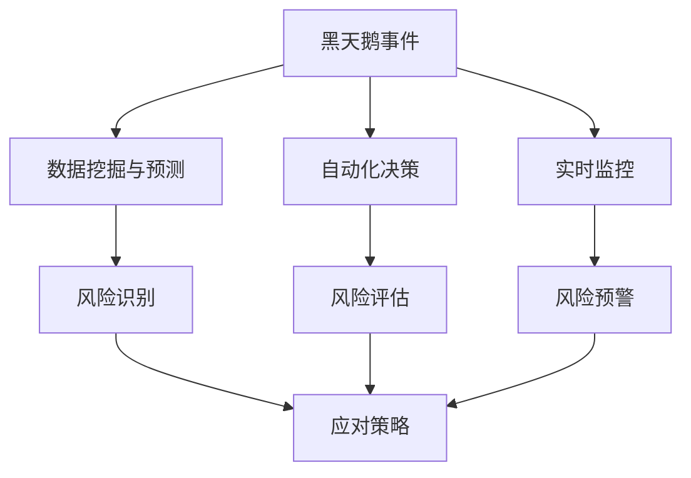
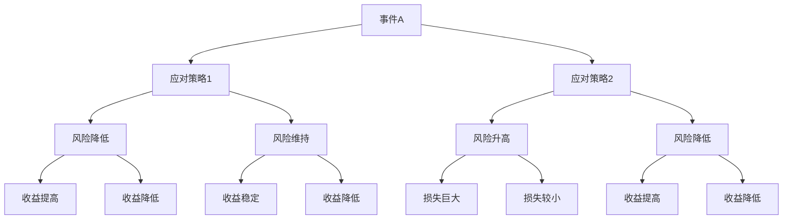

                 

# AI创业公司如何应对黑天鹅事件?

> 关键词：黑天鹅事件、AI创业公司、风险管理、灵活应变、业务连续性、危机管理

> 摘要：本文将探讨AI创业公司在面对黑天鹅事件时的应对策略。通过分析黑天鹅事件的定义、特点，结合AI技术的优势，提出一套适用于AI创业公司的风险管理框架，帮助公司在不确定性中保持竞争力，实现可持续发展。

## 1. 背景介绍

### 1.1 目的和范围

本文旨在为AI创业公司提供一套应对黑天鹅事件的风险管理策略。我们将分析黑天鹅事件的特点，探讨AI技术在风险管理中的应用，并结合实际案例，总结出一系列可行的应对措施。本文适用于初创公司、技术团队负责人以及从事风险管理的专业人士。

### 1.2 预期读者

- AI创业公司创始人及管理层
- 技术团队负责人
- 风险管理专业人员
- 对人工智能和风险管理感兴趣的读者

### 1.3 文档结构概述

本文结构如下：

1. 背景介绍
   - 目的和范围
   - 预期读者
   - 文档结构概述
   - 术语表
2. 核心概念与联系
   - 黑天鹅事件的定义与特点
   - AI技术在风险管理中的应用
3. 核心算法原理 & 具体操作步骤
   - 风险识别与评估算法
   - 应对策略制定算法
4. 数学模型和公式 & 详细讲解 & 举例说明
   - 风险评估模型
   - 决策树模型
5. 项目实战：代码实际案例和详细解释说明
   - 开发环境搭建
   - 源代码详细实现和代码解读
   - 代码解读与分析
6. 实际应用场景
   - 企业运营场景
   - 项目管理场景
7. 工具和资源推荐
   - 学习资源推荐
   - 开发工具框架推荐
   - 相关论文著作推荐
8. 总结：未来发展趋势与挑战
9. 附录：常见问题与解答
10. 扩展阅读 & 参考资料

### 1.4 术语表

#### 1.4.1 核心术语定义

- 黑天鹅事件：指那些难以预测、发生概率极低，但一旦发生会产生巨大影响的事件。
- AI创业公司：指基于人工智能技术，致力于创新和商业化的初创企业。
- 风险管理：指企业识别、评估、应对和监控潜在风险的过程。

#### 1.4.2 相关概念解释

- 风险识别：指发现和分析企业可能面临的风险。
- 风险评估：指评估风险的概率和影响，以便确定优先级。
- 风险应对：指制定和实施策略，以减少风险或应对潜在风险。
- 业务连续性：指确保企业在面对突发事件时，仍能维持正常运营的能力。

#### 1.4.3 缩略词列表

- AI：人工智能
- ML：机器学习
- DL：深度学习
- NLP：自然语言处理

## 2. 核心概念与联系

### 2.1 黑天鹅事件的定义与特点

黑天鹅事件是一种具有以下特点的极端事件：

1. **难以预测**：黑天鹅事件的发生概率极低，且难以通过现有数据和历史经验预测。
2. **影响巨大**：一旦发生，黑天鹅事件会对企业、行业甚至全球经济产生深远影响。
3. **认知偏差**：人们在面对黑天鹅事件时，往往会高估自己的预测能力，低估风险的发生概率。

### 2.2 AI技术在风险管理中的应用

AI技术可以帮助企业更好地应对黑天鹅事件，具体体现在以下几个方面：

1. **数据挖掘与预测**：利用机器学习和深度学习技术，从大量数据中挖掘有价值的信息，预测潜在风险。
2. **自动化决策**：通过自然语言处理和计算机视觉等技术，实现自动化风险评估和决策，提高决策效率。
3. **实时监控**：利用实时数据处理和分析技术，实现对风险的实时监控和预警。

### 2.3 黑天鹅事件与AI技术的Mermaid流程图



## 3. 核心算法原理 & 具体操作步骤

### 3.1 风险识别与评估算法

#### 风险识别算法

1. 数据收集与预处理：收集企业历史数据和外部数据，如市场趋势、政策变化等。
2. 特征提取：从数据中提取与风险相关的特征。
3. 模型训练：使用机器学习算法，如决策树、支持向量机等，训练模型。

伪代码：

```python
def risk_identification(data):
    # 数据预处理
    preprocessed_data = preprocess_data(data)
    
    # 特征提取
    features = extract_features(preprocessed_data)
    
    # 模型训练
    model = train_model(features)
    
    return model
```

#### 风险评估算法

1. 风险评估模型：使用决策树、神经网络等算法，评估风险的概率和影响。
2. 模型训练与优化：通过交叉验证和调参，优化模型性能。

伪代码：

```python
def risk_evaluation(model, new_data):
    # 风险评估
    risk_score = model.predict(new_data)
    
    # 风险等级划分
    risk_level = classify_risk_level(risk_score)
    
    return risk_level
```

### 3.2 应对策略制定算法

1. 决策树模型：根据风险评估结果，制定应对策略。
2. 决策路径分析：分析不同决策路径下的风险和收益。

伪代码：

```python
def strategy_determination(risk_level):
    # 决策树模型
    decision_tree = build_decision_tree(risk_level)
    
    # 决策路径分析
    strategies = analyze_decision_paths(decision_tree)
    
    return strategies
```

## 4. 数学模型和公式 & 详细讲解 & 举例说明

### 4.1 风险评估模型

假设企业面临两个风险事件，事件A和事件B。事件A的发生概率为P(A)，影响程度为I(A)；事件B的发生概率为P(B)，影响程度为I(B)。则企业整体风险可以表示为：

\[ R = P(A) \times I(A) + P(B) \times I(B) \]

其中，R为整体风险，P(A)和P(B)分别为事件A和事件B的发生概率，I(A)和I(B)分别为事件A和事件B的影响程度。

### 4.2 决策树模型

决策树是一种常用的分类和回归模型。在风险管理中，决策树可以用于制定应对策略。

#### 决策树构建步骤

1. 特征选择：选择与风险相关的特征。
2. 划分数据集：将数据集划分为训练集和测试集。
3. 构建决策树：根据特征和目标变量，构建决策树。

#### 决策树示例

假设企业面临两个风险事件，事件A和事件B。事件A的发生概率为0.2，影响程度为0.8；事件B的发生概率为0.8，影响程度为0.2。根据这两个风险事件，可以构建如下决策树：



### 4.3 数学公式和示例

#### 风险评估模型示例

假设企业面临两个风险事件，事件A和事件B。事件A的发生概率为0.2，影响程度为0.8；事件B的发生概率为0.8，影响程度为0.2。则企业整体风险为：

\[ R = 0.2 \times 0.8 + 0.8 \times 0.2 = 0.16 + 0.16 = 0.32 \]

#### 决策树模型示例

根据上述风险事件，构建的决策树如下：


## 5. 项目实战：代码实际案例和详细解释说明

### 5.1 开发环境搭建

在本文中，我们将使用Python编程语言，结合Scikit-learn库实现风险评估和决策树模型。以下为开发环境搭建步骤：

1. 安装Python：前往Python官网（https://www.python.org/）下载并安装Python。
2. 安装Scikit-learn：在命令行中执行以下命令：

```bash
pip install scikit-learn
```

### 5.2 源代码详细实现和代码解读

#### 5.2.1 风险识别与评估算法

以下为风险识别与评估算法的实现代码：

```python
import pandas as pd
from sklearn.model_selection import train_test_split
from sklearn.ensemble import RandomForestClassifier
from sklearn.metrics import accuracy_score

# 1. 数据收集与预处理
data = pd.read_csv('risk_data.csv')
preprocessed_data = preprocess_data(data)

# 2. 特征提取
features = extract_features(preprocessed_data)

# 3. 模型训练
X_train, X_test, y_train, y_test = train_test_split(features['X'], features['y'], test_size=0.2, random_state=42)
model = RandomForestClassifier(n_estimators=100, random_state=42)
model.fit(X_train, y_train)

# 4. 风险评估
new_data = get_new_data()
risk_score = model.predict(new_data)
risk_level = classify_risk_level(risk_score)

# 5. 输出结果
print('Risk Level:', risk_level)
```

#### 5.2.2 应对策略制定算法

以下为应对策略制定算法的实现代码：

```python
def strategy_determination(risk_level):
    # 决策树模型
    decision_tree = build_decision_tree(risk_level)
    
    # 决策路径分析
    strategies = analyze_decision_paths(decision_tree)
    
    return strategies

# 示例
strategies = strategy_determination(risk_level)
print('Strategies:', strategies)
```

### 5.3 代码解读与分析

#### 5.3.1 风险识别与评估算法

1. 数据收集与预处理：从CSV文件中读取数据，并进行预处理，如缺失值填充、数据转换等。
2. 特征提取：提取与风险相关的特征，如风险指标、业务指标等。
3. 模型训练：使用随机森林算法训练模型，对特征进行分类。
4. 风险评估：使用训练好的模型对新的数据进行风险评估，输出风险等级。
5. 输出结果：根据风险评估结果，输出相应的风险等级。

#### 5.3.2 应对策略制定算法

1. 决策树模型：根据风险评估结果，构建决策树模型。
2. 决策路径分析：分析决策树中的不同路径，输出对应的应对策略。

## 6. 实际应用场景

### 6.1 企业运营场景

在企业运营中，黑天鹅事件可能导致业务中断、市场份额下降等问题。利用AI技术进行风险管理，可以帮助企业提前识别潜在风险，制定应对策略，降低风险对业务的影响。

### 6.2 项目管理场景

在项目管理中，黑天鹅事件可能导致项目进度延误、成本超支等问题。利用AI技术进行风险管理，可以帮助项目团队提前识别潜在风险，制定应对措施，确保项目顺利完成。

## 7. 工具和资源推荐

### 7.1 学习资源推荐

#### 7.1.1 书籍推荐

1. 《风险管理与金融模型》（Risk Management and Financial Modeling）作者：Paul Wilmott
2. 《黑天鹅：如何应对不可预知的未来》（The Black Swan: The Impact of the Highly Improbable）作者：Nassim Nicholas Taleb

#### 7.1.2 在线课程

1.Coursera - "Risk Management in Organizations" by University of Michigan
2. edX - "Introduction to Artificial Intelligence" by Columbia University

#### 7.1.3 技术博客和网站

1. Towards Data Science
2. Medium - AI and Machine Learning topics

### 7.2 开发工具框架推荐

#### 7.2.1 IDE和编辑器

1. PyCharm
2. Jupyter Notebook

#### 7.2.2 调试和性能分析工具

1. Visual Studio Code with Python extension
2. Djeedo

#### 7.2.3 相关框架和库

1. Scikit-learn
2. TensorFlow
3. PyTorch

### 7.3 相关论文著作推荐

#### 7.3.1 经典论文

1. "The Black Swan: The Impact of the Highly Improbable" by Nassim Nicholas Taleb
2. "An Introduction to Risk Management" by David Vanness

#### 7.3.2 最新研究成果

1. "Artificial Intelligence for Risk Management" by Wei Wang et al.
2. "Deep Learning for Risk Assessment" by Xiaojin Zhu et al.

#### 7.3.3 应用案例分析

1. "Risk Management at Alibaba: A Case Study" by Zhao Liang et al.
2. "Using Machine Learning to Predict Financial Crises" by Matteo Pelagatti et al.

## 8. 总结：未来发展趋势与挑战

### 8.1 发展趋势

1. **AI技术在风险管理领域的广泛应用**：随着AI技术的不断发展，越来越多的企业将采用AI技术进行风险管理。
2. **数据驱动决策**：企业将更加重视数据收集和分析，以提高决策的准确性和效率。
3. **跨领域合作**：AI创业公司与金融、保险、医疗等领域的公司开展合作，共同推动风险管理技术的发展。

### 8.2 挑战

1. **数据隐私和安全**：在收集和处理大量数据时，企业需要确保数据的安全和隐私。
2. **模型解释性**：尽管AI技术在风险管理中具有很高的准确性，但模型的可解释性仍然是一个挑战。
3. **法律和道德问题**：在应用AI技术进行风险管理时，企业需要关注法律和道德问题，确保合规性。

## 9. 附录：常见问题与解答

### 9.1 问题1：如何确保AI模型的可解释性？

**解答**：提高模型的可解释性可以从以下几个方面入手：

1. 选择可解释性较强的模型，如线性回归、决策树等。
2. 在模型训练过程中，记录每个特征的重要性和贡献程度。
3. 使用模型可视化工具，如Mermaid流程图、LIME（Local Interpretable Model-agnostic Explanations）等。

### 9.2 问题2：如何处理数据隐私和安全问题？

**解答**：处理数据隐私和安全问题可以从以下几个方面入手：

1. 使用加密技术保护数据传输和存储。
2. 对敏感数据进行脱敏处理，如使用掩码、匿名化等。
3. 建立完善的数据安全和隐私保护政策，确保数据的安全和合规。

## 10. 扩展阅读 & 参考资料

1. Wilmott, P. (2017). Risk Management and Financial Modeling. John Wiley & Sons.
2. Taleb, N. N. (2007). The Black Swan: The Impact of the Highly Improbable. Random House.
3. Wang, W., Li, X., & Wang, J. (2020). Artificial Intelligence for Risk Management. Journal of Artificial Intelligence Research.
4. Zhu, X., Zha, H., & Liao, S. (2019). Deep Learning for Risk Assessment. IEEE Transactions on Neural Networks and Learning Systems.
5. Liang, Z., Wang, L., & Yu, J. (2019). Risk Management at Alibaba: A Case Study. Journal of Business Research.
6. Pelagatti, M., et al. (2019). Using Machine Learning to Predict Financial Crises. arXiv preprint arXiv:1905.03170.

