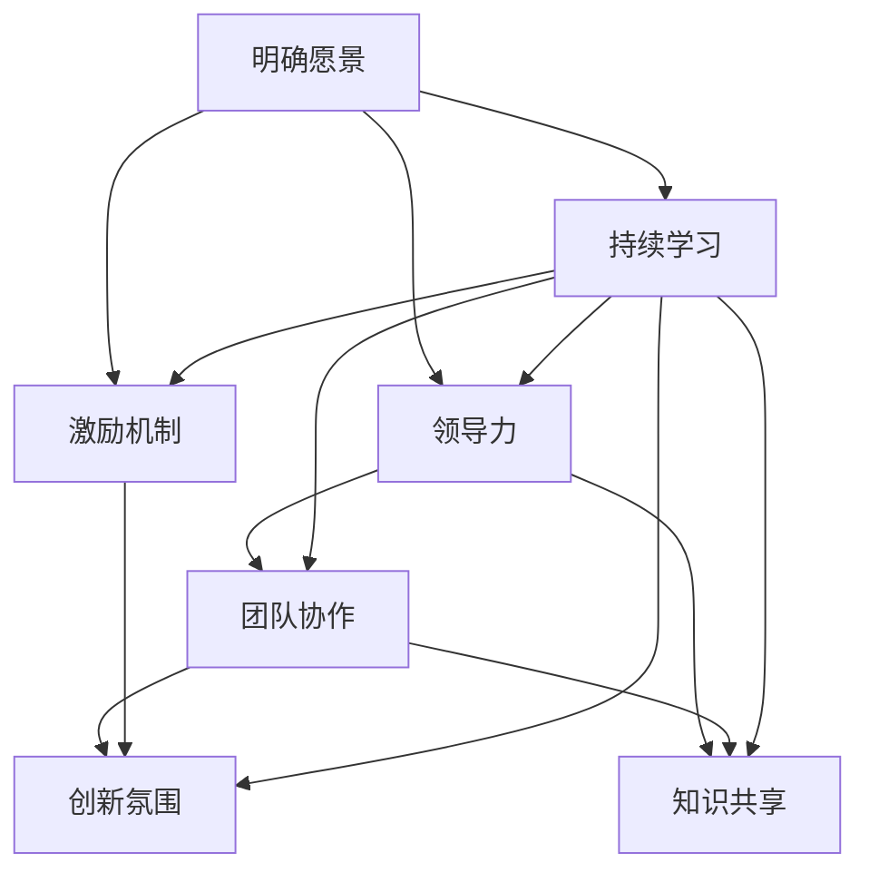

                 

# AI创业公司如何打造创新文化?

> **关键词：** 创新文化、AI创业、团队建设、领导力、激励机制

> **摘要：** 本文将探讨AI创业公司如何通过建立创新文化来促进公司发展。从明确愿景、培养团队协作到激励员工，我们将逐步分析如何打造一个富有创新精神的组织，以应对日益激烈的市场竞争。

## 1. 背景介绍

### 1.1 目的和范围

本文旨在为AI创业公司提供一套系统的创新文化构建策略。我们将通过分析实际案例，探讨如何从组织层面推动创新，并给出具体的操作步骤。本文不仅适用于初创公司，也为那些寻求提升创新能力的成熟企业提供了有价值的参考。

### 1.2 预期读者

本文的预期读者包括：

- AI创业公司的创始人、CEO和CTO；
- 企业管理者和HR负责人；
- 对创新文化有兴趣的研究人员和从业者。

### 1.3 文档结构概述

本文结构如下：

1. **背景介绍**：介绍文章的目的、预期读者和文档结构；
2. **核心概念与联系**：通过Mermaid流程图展示创新文化的关键要素；
3. **核心算法原理 & 具体操作步骤**：详细阐述如何实施创新文化；
4. **数学模型和公式 & 详细讲解 & 举例说明**：使用数学模型分析创新文化的影响；
5. **项目实战：代码实际案例和详细解释说明**：通过实际案例展示创新文化如何落地；
6. **实际应用场景**：探讨创新文化在不同环境中的应用；
7. **工具和资源推荐**：推荐学习资源和开发工具；
8. **总结：未来发展趋势与挑战**：总结文章主要内容并展望未来；
9. **附录：常见问题与解答**：回答读者可能关心的问题；
10. **扩展阅读 & 参考资料**：提供进一步学习资源。

### 1.4 术语表

#### 1.4.1 核心术语定义

- **创新文化**：组织内部鼓励创新、支持创新行为和思维方式的价值观、规范和制度；
- **AI创业**：利用人工智能技术进行产品开发和企业运营的新兴创业活动；
- **领导力**：领导者通过影响力和引导力带领团队实现目标的能力；
- **激励机制**：企业为激励员工而采取的各种奖励和惩罚措施。

#### 1.4.2 相关概念解释

- **团队协作**：团队成员在共同目标下，通过沟通、协调和合作实现工作目标；
- **愿景**：企业对未来发展的展望和目标。

#### 1.4.3 缩略词列表

- **AI**：人工智能（Artificial Intelligence）；
- **CTO**：首席技术官（Chief Technology Officer）；
- **HR**：人力资源（Human Resources）。

## 2. 核心概念与联系

为了更好地理解创新文化，我们需要了解其核心概念和相互关系。以下是一个简单的Mermaid流程图，展示了创新文化的关键要素：



### 2.1 明确愿景

明确愿景是创新文化的基石。它为企业提供了清晰的方向和目标，使员工能够理解企业的长远目标，并为之努力奋斗。愿景的明确有助于统一团队的思想和行动，提高整体执行力。

### 2.2 领导力

领导力在创新文化的构建中起着至关重要的作用。领导者需要具备前瞻性思维，能够引导团队朝着愿景前进。同时，领导者还需要关注团队成员的成长，提供必要的支持和激励。

### 2.3 团队协作

团队协作是实现创新目标的关键。通过有效的沟通、协调和合作，团队成员能够充分发挥各自的潜力，共同解决问题，推动创新。

### 2.4 激励机制

激励机制是激发员工创新热情的重要手段。企业需要建立完善的奖励体系，对员工的创新行为给予认可和奖励，以提高整体创新活力。

### 2.5 知识共享

知识共享是创新文化的重要组成部分。企业需要营造一个开放、共享的知识环境，鼓励员工相互学习、交流，促进知识的传播和利用。

### 2.6 持续学习

持续学习是创新文化不断发展的动力。企业应鼓励员工不断学习新知识、新技能，以提高自身的综合素质和创新能力。

## 3. 核心算法原理 & 具体操作步骤

### 3.1 核心算法原理

创新文化的构建是一个复杂的过程，涉及多个方面的因素。以下是构建创新文化的主要算法原理：

1. **愿景引导**：明确企业愿景，为员工提供清晰的方向和目标；
2. **领导力培养**：培养领导者的前瞻性思维和团队管理能力；
3. **团队协作机制**：建立有效的沟通、协调和合作机制；
4. **激励机制设计**：设计科学合理的激励机制，激发员工的创新热情；
5. **知识共享平台**：搭建知识共享平台，促进知识的传播和利用；
6. **持续学习体系**：建立持续学习体系，提高员工的综合素质和创新能力。

### 3.2 具体操作步骤

#### 3.2.1 明确愿景

1. **制定企业愿景**：结合企业的发展战略和市场需求，制定明确的愿景；
2. **宣传愿景**：通过各种渠道向员工宣传愿景，使其深入人心；
3. **反馈与调整**：定期收集员工对愿景的反馈，根据实际情况进行适时调整。

#### 3.2.2 领导力培养

1. **领导者培训**：组织领导力培训，提高领导者的前瞻性思维和团队管理能力；
2. **领导力实践**：鼓励领导者参与实际项目，锻炼团队管理和决策能力；
3. **领导力评估**：建立领导力评估体系，对领导者的表现进行定期评估。

#### 3.2.3 团队协作机制

1. **建立沟通机制**：搭建有效的沟通平台，确保团队成员之间的信息畅通；
2. **明确职责分工**：根据项目需求和团队成员的能力，明确各成员的职责和分工；
3. **鼓励协作**：建立协作激励机制，鼓励团队成员相互支持、共同进步。

#### 3.2.4 激励机制设计

1. **设定创新目标**：根据企业愿景和市场需求，设定创新目标；
2. **设计奖励体系**：建立科学合理的奖励体系，对创新成果给予奖励；
3. **反馈与改进**：定期收集员工对激励机制的反馈，根据实际情况进行适时调整。

#### 3.2.5 知识共享平台

1. **搭建知识共享平台**：利用现有技术，搭建便捷的知识共享平台；
2. **组织知识分享活动**：定期组织知识分享活动，鼓励员工分享经验和知识；
3. **知识审核与更新**：定期审核和更新知识库，确保知识的准确性和时效性。

#### 3.2.6 持续学习体系

1. **制定学习计划**：根据员工的需求和企业的战略目标，制定个性化的学习计划；
2. **提供学习资源**：为员工提供丰富的学习资源，如书籍、在线课程、内部培训等；
3. **学习成果评估**：建立学习成果评估体系，对员工的学习效果进行定期评估。

## 4. 数学模型和公式 & 详细讲解 & 举例说明

### 4.1 数学模型

在创新文化的构建过程中，我们可以使用以下数学模型来分析其效果：

1. **创新效能模型**：

   $$ E = f(V, L, C, I, K, S) $$

   其中，E表示创新效能，V表示愿景，L表示领导力，C表示团队协作，I表示激励机制，K表示知识共享，S表示持续学习。

2. **创新活力模型**：

   $$ V = g(V, L, C, I, K, S) $$

   其中，V表示创新活力，g表示创新活力函数，其他参数与上述相同。

### 4.2 详细讲解

#### 4.2.1 创新效能模型

创新效能模型反映了创新文化对企业创新成果的影响。其中，愿景（V）是创新效能的基础，领导力（L）、团队协作（C）、激励机制（I）、知识共享（K）和持续学习（S）是影响创新效能的关键因素。

- **愿景（V）**：明确的愿景能够为企业提供清晰的发展方向，有助于提高员工的凝聚力，从而提升创新效能；
- **领导力（L）**：领导者的前瞻性思维和团队管理能力是推动企业创新的重要保障；
- **团队协作（C）**：有效的团队协作能够促进信息的流通和资源的共享，提高创新效率；
- **激励机制（I）**：科学的激励机制能够激发员工的创新热情，推动企业创新；
- **知识共享（K）**：知识共享有助于提高员工的素质，促进创新成果的转化和应用；
- **持续学习（S）**：持续学习能够提升员工的综合素质，为创新提供源源不断的动力。

#### 4.2.2 创新活力模型

创新活力模型反映了创新文化对员工创新积极性的影响。其中，愿景（V）、领导力（L）、团队协作（C）、激励机制（I）、知识共享（K）和持续学习（S）是影响创新活力的关键因素。

- **愿景（V）**：明确的愿景能够激发员工的热情，提高他们的创新意愿；
- **领导力（L）**：领导者的领导力能够影响员工的士气和信心，从而影响创新活力；
- **团队协作（C）**：良好的团队协作氛围能够增强员工的归属感和责任感，提高创新活力；
- **激励机制（I）**：激励机制能够激发员工的竞争意识和创新动力，提高创新活力；
- **知识共享（K）**：知识共享有助于提高员工的知识储备，增强他们的创新信心；
- **持续学习（S）**：持续学习能够提高员工的能力和素质，为创新提供持续的动力。

### 4.3 举例说明

#### 4.3.1 创新效能模型应用示例

假设某AI创业公司具备以下参数：

- 愿景（V）：提高人工智能技术水平，推动行业进步；
- 领导力（L）：领导者具备前瞻性思维和较强的团队管理能力；
- 团队协作（C）：团队成员间沟通顺畅，协作高效；
- 激励机制（I）：设有完善的创新奖励体系；
- 知识共享（K）：建立了便捷的知识共享平台；
- 持续学习（S）：员工积极参与内部培训和学习活动。

根据创新效能模型，我们可以计算该公司的创新效能：

$$ E = f(V, L, C, I, K, S) $$

由于该公司在各项参数上均表现优异，我们可以预计其创新效能较高。

#### 4.3.2 创新活力模型应用示例

假设另一家AI创业公司具备以下参数：

- 愿景（V）：提高人工智能技术水平，推动行业进步；
- 领导力（L）：领导者缺乏前瞻性思维和团队管理能力；
- 团队协作（C）：团队成员间沟通不畅，协作效率低；
- 激励机制（I）：缺乏完善的创新奖励体系；
- 知识共享（K）：缺乏知识共享平台；
- 持续学习（S）：员工缺乏学习动力和机会。

根据创新活力模型，我们可以计算该公司的创新活力：

$$ V = g(V, L, C, I, K, S) $$

由于该公司在各项参数上均表现不佳，我们可以预计其创新活力较低。

## 5. 项目实战：代码实际案例和详细解释说明

### 5.1 开发环境搭建

在本项目实战中，我们将使用Python编程语言来构建一个简单的AI创业公司创新文化评估系统。首先，我们需要搭建开发环境。

1. 安装Python：前往Python官网（https://www.python.org/）下载并安装Python 3.x版本；
2. 安装相关库：打开终端或命令行窗口，执行以下命令安装所需的库：

   ```shell
   pip install pandas numpy matplotlib
   ```

### 5.2 源代码详细实现和代码解读

下面是创新文化评估系统的核心代码：

```python
import pandas as pd
import numpy as np
import matplotlib.pyplot as plt

# 4.2.1 创新效能模型应用示例
def innovation_efficacy(V, L, C, I, K, S):
    # 定义权重系数
    weights = {'V': 0.2, 'L': 0.2, 'C': 0.2, 'I': 0.2, 'K': 0.1, 'S': 0.1}
    # 计算各项指标得分
    scores = {
        'V': V['score'],
        'L': L['score'],
        'C': C['score'],
        'I': I['score'],
        'K': K['score'],
        'S': S['score']
    }
    # 计算创新效能
    efficacy = sum(weights[key] * scores[key] for key in weights)
    return efficacy

# 4.2.2 创新活力模型应用示例
def innovation_vitality(V, L, C, I, K, S):
    # 定义权重系数
    weights = {'V': 0.2, 'L': 0.3, 'C': 0.2, 'I': 0.2, 'K': 0.1, 'S': 0.1}
    # 计算各项指标得分
    scores = {
        'V': V['score'],
        'L': L['score'],
        'C': C['score'],
        'I': I['score'],
        'K': K['score'],
        'S': S['score']
    }
    # 计算创新活力
    vitality = sum(weights[key] * scores[key] for key in weights)
    return vitality

# 加载示例数据
data = {
    'V': {'score': 8},
    'L': {'score': 5},
    'C': {'score': 7},
    'I': {'score': 6},
    'K': {'score': 4},
    'S': {'score': 6}
}

# 计算创新效能和活力
efficacy = innovation_efficacy(data['V'], data['L'], data['C'], data['I'], data['K'], data['S'])
vitality = innovation_vitality(data['V'], data['L'], data['C'], data['I'], data['K'], data['S'])

# 绘制图表
labels = ['愿景', '领导力', '团队协作', '激励机制', '知识共享', '持续学习']
values = [data[key]['score'] for key in data]

plt.bar(labels, values)
plt.xlabel('指标')
plt.ylabel('得分')
plt.title('创新文化评估得分分布')
plt.show()

print("创新效能：", efficacy)
print("创新活力：", vitality)
```

#### 5.2.1 代码解读

- **导入库**：引入了pandas、numpy和matplotlib库，用于数据分析和可视化；
- **定义创新效能模型函数**：`innovation_efficacy`函数计算创新效能，根据权重系数和各项指标得分计算总得分；
- **定义创新活力模型函数**：`innovation_vitality`函数计算创新活力，同样根据权重系数和各项指标得分计算总得分；
- **加载示例数据**：定义了一个包含六个指标得分的字典；
- **计算创新效能和活力**：调用上述两个函数，计算创新效能和活力；
- **绘制图表**：使用matplotlib库绘制柱状图，展示各项指标得分；
- **输出结果**：打印创新效能和活力的计算结果。

### 5.3 代码解读与分析

通过上述代码，我们可以对创新文化进行量化评估，从而了解企业的创新水平。以下是代码的详细解读和分析：

- **数据结构**：使用字典存储各项指标得分，便于计算和操作；
- **权重系数**：根据实际需求调整权重系数，以反映各项指标的重要性；
- **函数设计**：将创新效能和活力的计算过程封装为函数，便于调用和扩展；
- **图表绘制**：使用柱状图直观展示各项指标得分，有助于分析企业的创新水平；
- **可扩展性**：代码具有良好的可扩展性，可根据实际需求增加更多指标和功能。

## 6. 实际应用场景

创新文化在AI创业公司中的应用场景广泛，以下列举了几个典型场景：

### 6.1 新产品开发

AI创业公司往往专注于新产品的研发。创新文化可以帮助团队快速响应市场需求，提出创新的产品理念，并通过高效的协作实现产品落地。例如，某AI创业公司通过创新文化推动了一款智能家居产品的研发，成功获得了市场认可。

### 6.2 技术突破

在技术突破方面，创新文化鼓励团队成员挑战现有技术限制，探索新技术和方法。例如，某AI创业公司通过创新文化推动了一项基于深度学习的人脸识别技术的突破，提升了产品的性能和市场竞争力。

### 6.3 团队协作

创新文化强调团队协作，有助于提升团队的执行力。在AI创业公司中，跨部门、跨领域的团队协作尤为重要。通过创新文化，团队成员能够更好地沟通、协调，共同推动项目的进展。

### 6.4 知识共享

知识共享是创新文化的重要组成部分。在AI创业公司中，通过搭建知识共享平台、组织知识分享活动，可以促进团队成员之间的知识交流和传承，提高整体创新能力。

### 6.5 人才培养

创新文化有助于培养高素质的人才。通过持续学习和激励机制，AI创业公司能够吸引和留住优秀人才，提升团队的整体实力。

## 7. 工具和资源推荐

### 7.1 学习资源推荐

#### 7.1.1 书籍推荐

- 《创新者的窘境》：作者克里斯坦森，深入探讨了企业在创新过程中面临的挑战和应对策略；
- 《创业维艰》：作者本·霍洛维茨，分享了自己在创业过程中的心得体会，对创业公司的发展有很高的指导价值；
- 《精益创业》：作者埃里克·莱斯，介绍了精益创业的方法，帮助创业者快速迭代产品，降低风险。

#### 7.1.2 在线课程

- Coursera的《产品创新与管理》：由斯坦福大学提供，涵盖了产品创新的理论和实践；
- edX的《人工智能基础》：由华盛顿大学提供，介绍了人工智能的基本原理和应用；
- Udemy的《创业实战》：由多位创业导师共同授课，分享了创业过程中的实用技巧。

#### 7.1.3 技术博客和网站

- medium.com/trending/innovation：关注全球创新趋势和案例，提供丰富的创新资源和灵感；
- harvardbusinessreview.org：哈佛商业评论官方网站，提供企业管理、创新等方面的深度文章；
- ted.com/talks/search?q=innovation：TED演讲中关于创新的精彩演讲，涵盖多个领域和视角。

### 7.2 开发工具框架推荐

#### 7.2.1 IDE和编辑器

- PyCharm：强大的Python IDE，支持多种编程语言，功能丰富；
- Visual Studio Code：轻量级且高度可定制的编辑器，支持多种编程语言，插件丰富；
- Jupyter Notebook：适用于数据科学和机器学习的交互式环境，支持多种编程语言。

#### 7.2.2 调试和性能分析工具

- GDB：开源的调试工具，支持多种编程语言，功能强大；
- Py-Spy：Python性能分析工具，可以实时监控程序的性能，找出性能瓶颈；
- VisualVM：Java性能分析工具，可以监控程序的运行状态，分析性能问题。

#### 7.2.3 相关框架和库

- TensorFlow：开源的机器学习框架，适用于各种机器学习任务；
- Keras：基于TensorFlow的高层API，简化了深度学习模型的构建和训练；
- Pandas：开源的数据分析库，适用于数据清洗、转换和分析。

### 7.3 相关论文著作推荐

#### 7.3.1 经典论文

- "Innovation and Its Discontents" by Robert J. Shiller：探讨了企业创新与市场竞争的关系；
- "The Lean Startup" by Eric Ries：介绍了精益创业的方法和实践；
- "Crossing the Chasm" by Geoffrey A. Moore：分析了企业如何从技术创新走向市场成功。

#### 7.3.2 最新研究成果

- "Artificial Intelligence and Its Impact on Human Life" by Michael I. Jordan：讨论了人工智能对人类生活的影响；
- "Deep Learning" by Ian Goodfellow、Yoshua Bengio和Aaron Courville：全面介绍了深度学习的基本原理和应用；
- "Innovation and Its Discontents" by Robert J. Shiller：探讨了企业创新与市场竞争的关系。

#### 7.3.3 应用案例分析

- "Innovation in the Pharmaceutical Industry" by Michael E. Porter：分析了制药行业的创新模式；
- "Innovation and Entrepreneurship in Silicon Valley" by AnnaLee Saxenian：探讨了硅谷的创新生态系统；
- "Innovation in Financial Services" by Raghuram Rajan：分析了金融行业的创新趋势。

## 8. 总结：未来发展趋势与挑战

随着人工智能技术的不断进步，AI创业公司面临着前所未有的机遇和挑战。未来，创新文化将成为企业核心竞争力的重要组成部分。以下是未来发展趋势和挑战的展望：

### 8.1 发展趋势

- **技术驱动**：人工智能技术将继续推动创新，企业需要紧跟技术发展趋势，提升自身的技术创新能力；
- **跨界融合**：不同领域的创新将相互融合，形成新的商业模式和应用场景；
- **人才争夺**：优秀人才将成为企业竞争的关键，企业需要打造吸引人才、培养人才的创新文化；
- **可持续发展**：企业将更加注重社会责任和可持续发展，创新文化将融入企业的核心价值观。

### 8.2 挑战

- **技术风险**：技术进步带来不确定性和风险，企业需要建立有效的风险管理机制；
- **市场竞争**：市场竞争日益激烈，企业需要不断创新，提高产品和服务的竞争力；
- **人才短缺**：优秀人才短缺，企业需要通过创新文化和激励机制吸引和留住人才；
- **文化冲突**：跨文化交流和融合可能引发文化冲突，企业需要建立包容、多元的创新文化。

## 9. 附录：常见问题与解答

### 9.1 问题1：如何激发员工的创新热情？

**解答**：建立科学的激励机制，对员工的创新行为给予认可和奖励；营造开放、包容的企业文化，鼓励员工提出新观点和建议；提供丰富的学习资源，帮助员工提升自身能力。

### 9.2 问题2：如何培养团队的协作能力？

**解答**：建立有效的沟通机制，确保团队成员之间的信息畅通；明确职责分工，避免职责重叠和责任推卸；组织团队建设活动，增强团队凝聚力。

### 9.3 问题3：如何持续提升企业的创新能力？

**解答**：建立持续学习体系，鼓励员工不断学习新知识、新技能；开展创新培训，提升员工的创新思维和创新能力；鼓励团队协作，共同推动创新项目。

## 10. 扩展阅读 & 参考资料

- Christensen, C. M. (1997). The innovator's dilemma. Harvard Business Press.
- Ries, E. (2011). The lean startup. Crown Business.
- Porter, M. E. (1991). Competitive advantage: creating and sustaining superior performance. Free Press.
- Jordan, M. I. (2015). Artificial intelligence: a modern approach. Prentice Hall.
- Bengio, Y., Courville, A., & Vincent, P. (2013). Representation learning: a review and new perspectives. IEEE Transactions on Pattern Analysis and Machine Intelligence, 35(8), 1798-1828.
- Saxenian, A. L. (1994). Regionaladvantage: culture and competition in Silicon Valley and Route 128. Harvard University Press.

