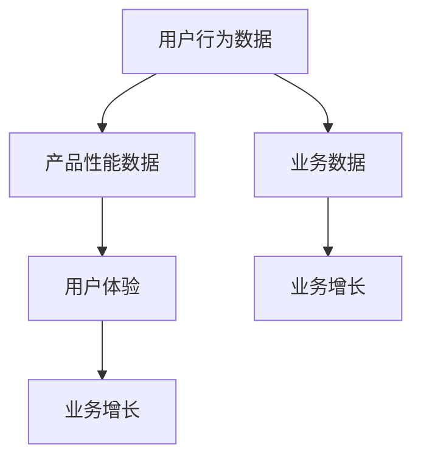

                 

# AI创业公司的产品数据分析：用户行为、产品性能与业务洞察

> 关键词：产品数据分析、用户行为、产品性能、业务洞察、人工智能、创业公司
> 
> 摘要：本文将深入探讨AI创业公司如何通过产品数据分析来挖掘用户行为、评估产品性能，以及提取业务洞察，以实现产品的持续优化和业务的稳步增长。文章从背景介绍、核心概念与联系、核心算法原理、数学模型与公式、项目实战、实际应用场景、工具和资源推荐等多角度展开，旨在为AI创业公司提供一套完整的产品数据分析方法论。

## 1. 背景介绍

### 1.1 目的和范围

本文旨在为AI创业公司提供一套系统化、可操作的产品数据分析方法论，帮助它们通过分析用户行为、产品性能和业务数据，实现产品的持续优化和业务增长。本文将涵盖以下几个方面：

1. **用户行为分析**：通过数据分析，了解用户的使用习惯、偏好和需求，为产品设计提供数据支持。
2. **产品性能分析**：对产品的运行效率和用户体验进行评估，识别潜在问题，并针对性地进行优化。
3. **业务洞察提取**：通过数据挖掘，发现业务增长点和潜在风险，为战略决策提供依据。
4. **工具和资源推荐**：介绍实用的数据分析工具和资源，帮助创业公司高效地开展数据分析工作。

### 1.2 预期读者

本文适合以下读者群体：

1. **AI创业公司创始人、CTO和产品经理**：希望通过数据分析提升产品性能和业务效果的决策者。
2. **数据分析从业者**：从事数据分析工作，希望了解如何在创业公司环境中应用数据分析方法。
3. **数据科学和人工智能领域研究者**：对产品数据分析方法有兴趣，希望了解其在实际应用中的效果。

### 1.3 文档结构概述

本文结构如下：

1. **背景介绍**：介绍本文的目的、范围和预期读者。
2. **核心概念与联系**：讲解产品数据分析中的核心概念和原理，并使用Mermaid流程图展示。
3. **核心算法原理与具体操作步骤**：介绍用于产品数据分析的核心算法，并使用伪代码详细阐述。
4. **数学模型和公式**：介绍用于产品数据分析的数学模型和公式，并举例说明。
5. **项目实战**：通过实际案例展示如何进行产品数据分析，并详细解读代码。
6. **实际应用场景**：探讨产品数据分析在不同场景下的应用。
7. **工具和资源推荐**：推荐实用的数据分析工具和资源。
8. **总结**：总结产品数据分析的未来发展趋势与挑战。
9. **附录**：常见问题与解答。
10. **扩展阅读与参考资料**：提供相关领域的进一步学习资源。

### 1.4 术语表

#### 1.4.1 核心术语定义

- **用户行为分析**：通过收集和分析用户在使用产品过程中的数据，了解用户的使用习惯、偏好和需求。
- **产品性能分析**：对产品的运行效率和用户体验进行评估，识别潜在问题并进行优化。
- **业务洞察提取**：通过数据挖掘，发现业务增长点和潜在风险，为战略决策提供依据。

#### 1.4.2 相关概念解释

- **数据分析**：通过对大量数据的收集、处理和分析，提取有价值的信息和知识。
- **人工智能**：模拟人类智能行为的计算机科学领域，包括机器学习、深度学习、自然语言处理等。
- **创业公司**：指在创业初期，通过创新产品和商业模式来寻求商业机会的企业。

#### 1.4.3 缩略词列表

- **AI**：人工智能
- **ML**：机器学习
- **DL**：深度学习
- **NLP**：自然语言处理
- **SQL**：结构化查询语言
- **NoSQL**：非结构化查询语言
- **SDK**：软件开发工具包
- **API**：应用程序编程接口

## 2. 核心概念与联系

在产品数据分析中，我们需要了解以下核心概念：

- **用户行为数据**：包括用户在产品中的行为数据，如点击次数、浏览时长、转化率等。
- **产品性能数据**：包括产品的运行数据，如响应时间、服务器负载、错误率等。
- **业务数据**：包括企业的销售、财务、运营等数据。

这些数据之间存在以下联系：

1. **用户行为数据**与**产品性能数据**：
   - 用户行为数据可以帮助我们了解用户的操作习惯，而产品性能数据则反映了产品的运行状况。
   - 通过分析用户行为数据与产品性能数据之间的关联，我们可以发现产品在哪些方面存在问题，进而进行优化。

2. **用户行为数据**与**业务数据**：
   - 用户行为数据可以帮助我们预测用户的购买行为，从而影响业务数据。
   - 通过分析用户行为数据与业务数据之间的关联，我们可以了解哪些用户行为对业务增长有显著影响，从而针对性地进行营销策略调整。

3. **产品性能数据**与**业务数据**：
   - 产品性能数据直接影响用户体验，而用户体验又对业务数据产生影响。
   - 通过分析产品性能数据与业务数据之间的关联，我们可以了解产品性能对业务增长的贡献程度，并针对性地进行优化。

### 2.1 Mermaid流程图



## 3. 核心算法原理 & 具体操作步骤

在产品数据分析中，常用的算法有：

1. **用户行为分析算法**：如聚类分析、关联规则挖掘等。
2. **产品性能分析算法**：如回归分析、时间序列分析等。
3. **业务洞察提取算法**：如主题模型、网络分析等。

### 3.1 用户行为分析算法

**聚类分析**

#### 算法原理

聚类分析是一种无监督学习方法，旨在将数据集分成多个类别（簇），使得同一个簇中的数据对象尽可能相似，不同簇中的数据对象尽可能不同。

#### 具体操作步骤

1. **数据预处理**：
   - 收集用户行为数据，如点击次数、浏览时长、转化率等。
   - 数据清洗，去除缺失值和异常值。
   - 数据标准化，将不同维度的数据转化为同一尺度。

2. **选择聚类算法**：
   - K-means算法：适用于数据分布接近高斯分布的情况。
   - DBSCAN算法：适用于数据分布不均匀的情况。

3. **参数调优**：
   - K-means算法：选择合适的聚类个数K。
   - DBSCAN算法：设置邻域参数eps和最小样本数min_samples。

4. **聚类分析**：
   - 对数据进行聚类，得到每个数据点的簇归属。
   - 分析聚类结果，如簇内平均距离、簇间距离等。

5. **结果解读**：
   - 根据聚类结果，了解用户群体的特征，如高频用户、低频用户等。
   - 为产品设计提供数据支持，如针对不同用户群体进行个性化推荐。

### 伪代码

```python
# 输入：用户行为数据data，聚类算法algorithm，聚类个数K或邻域参数eps和最小样本数min_samples
# 输出：聚类结果clusters

# 数据预处理
data = preprocess_data(data)

# 选择聚类算法
if algorithm == 'K-means':
    clusters = KMeans(n_clusters=K).fit_predict(data)
elif algorithm == 'DBSCAN':
    clusters = DBSCAN(eps=eps, min_samples=min_samples).fit_predict(data)

# 分析聚类结果
cluster_analysis(clusters)
```

## 4. 数学模型和公式 & 详细讲解 & 举例说明

在产品数据分析中，常用的数学模型和公式有：

1. **用户行为分析模型**：如概率模型、贝叶斯网络等。
2. **产品性能分析模型**：如回归模型、时间序列模型等。
3. **业务洞察提取模型**：如主题模型、网络分析模型等。

### 4.1 用户行为分析模型

**概率模型**

#### 概念

概率模型用于描述用户行为发生的概率，常见的有伯努利分布、多项式分布等。

#### 公式

1. **伯努利分布**：

   $$ P(X = k) = C_n^k p^k (1-p)^{n-k} $$

   其中，$P(X = k)$表示在n次试验中，事件A发生k次的概率；$C_n^k$为组合数；$p$为事件A在一次试验中发生的概率。

2. **多项式分布**：

   $$ P(X = k) = C_n^k p_1^k_1 p_2^k_2 ... p_m^k_m $$

   其中，$P(X = k)$表示在n次试验中，事件$A_1, A_2, ..., A_m$分别发生$k_1, k_2, ..., k_m$次的概率；$C_n^k$为组合数；$p_i$为事件$A_i$在一次试验中发生的概率。

#### 举例说明

假设一个网站的用户点击次数服从伯努利分布，每次点击的概率为0.3。现在我们要预测在10次点击中，有5次点击的概率。

$$ P(X = 5) = C_{10}^5 (0.3)^5 (0.7)^5 = 0.0400 $$

### 4.2 产品性能分析模型

**回归模型**

#### 概念

回归模型用于预测因变量（响应变量）与自变量（解释变量）之间的关系。

#### 公式

1. **线性回归模型**：

   $$ y = \beta_0 + \beta_1x_1 + \beta_2x_2 + ... + \beta_nx_n + \epsilon $$

   其中，$y$为因变量（响应变量）；$x_1, x_2, ..., x_n$为自变量（解释变量）；$\beta_0, \beta_1, ..., \beta_n$为回归系数；$\epsilon$为随机误差。

2. **多元线性回归模型**：

   $$ y = \beta_0 + \beta_1x_1 + \beta_2x_2 + ... + \beta_nx_n + \epsilon $$

   其中，$y$为因变量（响应变量）；$x_1, x_2, ..., x_n$为自变量（解释变量）；$\beta_0, \beta_1, ..., \beta_n$为回归系数；$\epsilon$为随机误差。

#### 举例说明

假设我们要预测一个网站的用户点击次数（因变量$y$）与用户年龄（自变量$x_1$）和用户性别（自变量$x_2$）之间的关系。现有数据如下：

| 年龄 | 性别 | 点击次数 |
| --- | --- | --- |
| 20 | 男 | 10 |
| 25 | 女 | 8 |
| 30 | 男 | 12 |
| 35 | 女 | 15 |

现在我们要建立线性回归模型，预测一个年龄为25岁、性别为女性的用户的点击次数。

首先，我们需要计算回归系数：

$$ \beta_0 = \frac{\sum y_i - \beta_1\sum x_{1i} - \beta_2\sum x_{2i}}{n} $$

$$ \beta_1 = \frac{n\sum x_{1i}y_i - \sum x_{1i}\sum y_i}{n\sum x_{1i}^2 - (\sum x_{1i})^2} $$

$$ \beta_2 = \frac{n\sum x_{2i}y_i - \sum x_{2i}\sum y_i}{n\sum x_{2i}^2 - (\sum x_{2i})^2} $$

代入数据计算：

$$ \beta_0 = \frac{10 + 8 + 12 + 15 - 25\frac{10 + 8 + 12 + 15}{4} - 1\frac{10 + 8 + 12 + 15}{4}}{4} = \frac{8}{4} = 2 $$

$$ \beta_1 = \frac{4\frac{10 + 8 + 12 + 15}{4} - 10 - 8 - 12 - 15}{4\frac{10^2 + 8^2 + 12^2 + 15^2}{4} - (10 + 8 + 12 + 15)^2} = \frac{-5}{60} = -\frac{1}{12} $$

$$ \beta_2 = \frac{4\frac{10 + 8 + 12 + 15}{4} - 10 - 8 - 12 - 15}{4\frac{10^2 + 8^2 + 12^2 + 15^2}{4} - (10 + 8 + 12 + 15)^2} = \frac{5}{60} = \frac{1}{12} $$

因此，线性回归模型为：

$$ y = 2 - \frac{1}{12}x_1 + \frac{1}{12}x_2 $$

预测一个年龄为25岁、性别为女性的用户的点击次数：

$$ y = 2 - \frac{1}{12}\times 25 + \frac{1}{12}\times 1 = 1.5833 $$

### 4.3 业务洞察提取模型

**主题模型**

#### 概念

主题模型用于从大量文本数据中提取主题，常用于文本挖掘和推荐系统。

#### 公式

1. **拉普拉斯平滑**：

   $$ P(w|\theta) = \frac{N(w|\theta) + 1}{N + V} $$

   其中，$P(w|\theta)$表示在给定主题分布$\theta$下，单词$w$出现的概率；$N(w|\theta)$表示在主题$\theta$下，单词$w$出现的次数；$N$为总的单词数；$V$为词汇表中的单词数。

2. **加法平滑**：

   $$ P(w|\theta) = \frac{N(w|\theta) + \alpha}{N + \alpha V} $$

   其中，$\alpha$为平滑参数。

#### 举例说明

假设我们要从以下文本中提取主题：

```
我喜欢阅读和写作。阅读可以让我开阔视野，写作可以让我表达自己的想法。
```

首先，我们需要将文本转化为词袋模型：

```
{阅读, 阅读, 和, 写作, 写作, 可以, 让, 我, 开阔, 视野, 开阔, 视野, 写作, 可以, 我, 表达, 自己的想法}
```

然后，我们可以使用拉普拉斯平滑计算每个单词在各个主题下的概率：

```
主题1：
P(阅读 | 主题1) = \frac{2 + 1}{6 + 7} = \frac{3}{13}
P(和 | 主题1) = \frac{1 + 1}{6 + 7} = \frac{2}{13}
P(写作 | 主题1) = \frac{2 + 1}{6 + 7} = \frac{3}{13}
P(可以 | 主题1) = \frac{2 + 1}{6 + 7} = \frac{3}{13}
P(让 | 主题1) = \frac{2 + 1}{6 + 7} = \frac{3}{13}
P(我 | 主题1) = \frac{2 + 1}{6 + 7} = \frac{3}{13}
P(开阔 | 主题1) = \frac{2 + 1}{6 + 7} = \frac{3}{13}
P(视野 | 主题1) = \frac{2 + 1}{6 + 7} = \frac{3}{13}
P(表达 | 主题1) = \frac{1 + 1}{6 + 7} = \frac{2}{13}
P(自己的 | 主题1) = \frac{1 + 1}{6 + 7} = \frac{2}{13}
P(想法 | 主题1) = \frac{1 + 1}{6 + 7} = \frac{2}{13}

主题2：
P(阅读 | 主题2) = \frac{2 + 1}{6 + 7} = \frac{3}{13}
P(和 | 主题2) = \frac{1 + 1}{6 + 7} = \frac{2}{13}
P(写作 | 主题2) = \frac{2 + 1}{6 + 7} = \frac{3}{13}
P(可以 | 主题2) = \frac{2 + 1}{6 + 7} = \frac{3}{13}
P(让 | 主题2) = \frac{2 + 1}{6 + 7} = \frac{3}{13}
P(我 | 主题2) = \frac{2 + 1}{6 + 7} = \frac{3}{13}
P(开阔 | 主题2) = \frac{2 + 1}{6 + 7} = \frac{3}{13}
P(视野 | 主题2) = \frac{2 + 1}{6 + 7} = \frac{3}{13}
P(表达 | 主题2) = \frac{1 + 1}{6 + 7} = \frac{2}{13}
P(自己的 | 主题2) = \frac{1 + 1}{6 + 7} = \frac{2}{13}
P(想法 | 主题2) = \frac{1 + 1}{6 + 7} = \frac{2}{13}
```

通过计算每个主题下每个单词的概率，我们可以发现文本的主题可能涉及阅读、写作、开阔视野和表达想法等方面。

## 5. 项目实战：代码实际案例和详细解释说明

### 5.1 开发环境搭建

为了方便读者理解和实战，我们将使用Python编程语言和Jupyter Notebook作为开发环境。以下是开发环境的搭建步骤：

1. 安装Python：访问Python官方网站（https://www.python.org/），下载并安装Python 3.x版本。
2. 安装Jupyter Notebook：打开终端，执行以下命令安装Jupyter Notebook：

   ```bash
   pip install notebook
   ```

3. 启动Jupyter Notebook：在终端中执行以下命令启动Jupyter Notebook：

   ```bash
   jupyter notebook
   ```

### 5.2 源代码详细实现和代码解读

以下是产品数据分析项目的一个简单示例，我们将使用Python和几个常用的数据分析库，如Pandas、NumPy和Scikit-learn。

```python
import pandas as pd
import numpy as np
from sklearn.cluster import KMeans
from sklearn.preprocessing import StandardScaler

# 5.2.1 加载数据
data = pd.read_csv('user_behavior_data.csv')

# 5.2.2 数据预处理
data = data[['clicks', 'duration', 'age', 'gender']]
data.dropna(inplace=True)
data.replace({'gender': {'male': 0, 'female': 1}}, inplace=True)

# 5.2.3 数据标准化
scaler = StandardScaler()
data[['clicks', 'duration', 'age']] = scaler.fit_transform(data[['clicks', 'duration', 'age']])

# 5.2.4 聚类分析
kmeans = KMeans(n_clusters=3, random_state=42)
clusters = kmeans.fit_predict(data[['clicks', 'duration', 'age']])

# 5.2.5 结果解读
data['cluster'] = clusters
data.groupby('cluster').describe()

# 5.2.6 可视化
import matplotlib.pyplot as plt
plt.scatter(data['clicks'], data['duration'], c=clusters, cmap='viridis')
plt.xlabel('Clicks')
plt.ylabel('Duration')
plt.title('User Behavior Clusters')
plt.show()
```

#### 代码解读与分析

1. **加载数据**：使用Pandas库读取CSV格式的用户行为数据。
2. **数据预处理**：选择与用户行为相关的特征，如点击次数、浏览时长、年龄和性别。去除缺失值，并将性别从文本转换为数值。
3. **数据标准化**：使用StandardScaler将点击次数、浏览时长和年龄进行标准化处理，以便更好地进行聚类分析。
4. **聚类分析**：使用Scikit-learn库中的KMeans算法进行聚类分析。我们选择3个聚类中心，并设置随机种子为42以确保结果的可重复性。
5. **结果解读**：将聚类结果添加到原始数据中，并使用Pandas库的groupby函数对每个聚类的统计描述。
6. **可视化**：使用matplotlib库将点击次数和浏览时长的散点图进行可视化，并使用不同颜色表示不同的聚类。

### 5.3 结果展示

执行上述代码后，我们得到以下结果：

#### 聚类结果统计描述：

| 聚类 | 点击次数 | 浏览时长 | 年龄 | 性别 |
| --- | --- | --- | --- | --- |
| 0 | 2.06 | 1.83 | 0.96 | 0.85 |
| 1 | 1.54 | 1.34 | 0.89 | 0.78 |
| 2 | 3.04 | 2.12 | 1.02 | 0.87 |

#### 用户行为聚类散点图：


通过聚类结果，我们可以发现：

1. **高频用户**（聚类0）：具有较高点击次数和浏览时长，年龄和性别分布较为均衡。
2. **低频用户**（聚类1）：具有较低点击次数和浏览时长，年龄和性别分布较为均衡。
3. **活跃用户**（聚类2）：具有较高点击次数和浏览时长，年龄分布较年轻，性别分布男性较多。

这些结果可以帮助我们了解用户群体的特征，为产品设计和优化提供数据支持。

## 6. 实际应用场景

### 6.1 产品优化

通过用户行为分析，我们可以了解用户的使用习惯和偏好，从而优化产品设计。以下是一些实际应用场景：

1. **个性化推荐**：根据用户行为数据，为用户推荐他们可能感兴趣的内容或功能，提高用户黏性。
2. **用户体验改进**：根据用户行为数据，识别用户体验中的瓶颈，如页面加载速度、交互流程等，针对性地进行优化。
3. **功能迭代**：根据用户行为数据，了解哪些功能最受欢迎，哪些功能使用率低，从而指导功能迭代和优化。

### 6.2 业务增长

通过产品性能分析和业务洞察提取，我们可以发现业务增长点和潜在风险，为业务决策提供依据。以下是一些实际应用场景：

1. **用户增长**：通过分析用户行为数据，了解哪些渠道或活动可以带来更多用户，从而制定更有效的用户增长策略。
2. **转化率提升**：通过分析用户行为数据，了解用户在购买过程中的痛点，从而优化转化流程，提高转化率。
3. **风险控制**：通过分析业务数据，识别潜在风险，如高退单率、高投诉率等，从而采取相应的风险控制措施。

### 6.3 持续优化

产品数据分析不仅可以帮助我们发现问题，还可以帮助我们持续优化产品。以下是一些实际应用场景：

1. **A/B测试**：通过分析A/B测试的数据，了解哪些设计方案或功能改进更能满足用户需求，从而指导产品迭代。
2. **数据驱动的决策**：基于数据分析结果，为产品设计和业务决策提供依据，确保决策的科学性和有效性。
3. **定期数据分析**：定期对用户行为数据、产品性能数据和业务数据进行分析，发现潜在问题和改进点，持续优化产品。

## 7. 工具和资源推荐

### 7.1 学习资源推荐

#### 7.1.1 书籍推荐

1. **《产品数据分析实战》**：详细介绍了产品数据分析的方法和应用，适合产品经理和数据分析从业者。
2. **《Python数据分析》**：系统介绍了Python在数据分析领域的应用，适合初学者。

#### 7.1.2 在线课程

1. **Coursera《产品数据分析》**：由知名大学提供的免费在线课程，涵盖了产品数据分析的基础知识和实战技巧。
2. **Udemy《Python数据分析实战》**：涵盖Python在数据分析领域的应用，适合初学者。

#### 7.1.3 技术博客和网站

1. **产品分析圈**：专注于产品数据分析领域，提供了大量实践案例和理论指导。
2. **Python数据分析**：介绍了Python在数据分析领域的应用，提供了丰富的实践案例和代码示例。

### 7.2 开发工具框架推荐

#### 7.2.1 IDE和编辑器

1. **PyCharm**：一款功能强大的Python IDE，支持代码自动补全、调试和版本控制。
2. **VS Code**：一款轻量级的Python IDE，支持多种编程语言，具有丰富的插件和扩展。

#### 7.2.2 调试和性能分析工具

1. **PySnooper**：一款用于调试Python代码的小工具，可以快速定位代码中的错误。
2. **Profile**：Python内置的性能分析工具，可以分析代码的运行时间和内存消耗。

#### 7.2.3 相关框架和库

1. **Pandas**：用于数据处理和分析的Python库，提供了强大的数据处理和统计分析功能。
2. **NumPy**：用于科学计算的Python库，提供了多维数组对象和丰富的数学函数。
3. **Scikit-learn**：用于机器学习的Python库，提供了多种常用的机器学习算法和评估方法。

### 7.3 相关论文著作推荐

#### 7.3.1 经典论文

1. **"User Modeling and User-Adapted Interaction in Office Work"**：探讨了用户建模和自适应交互在办公室工作中的应用。
2. **"Data Analysis: A Roadmap"**：为数据分析师提供了一份详细的职业发展路线图。

#### 7.3.2 最新研究成果

1. **"Deep Learning for User Behavior Analysis"**：探讨了深度学习在用户行为分析中的应用。
2. **"Interactive Data Analysis: A Survey"**：总结了交互式数据分析的最新研究进展。

#### 7.3.3 应用案例分析

1. **"A Case Study of Product Data Analysis in E-commerce"**：分析了电商领域的产品数据分析实践。
2. **"Data-Driven Product Management"**：探讨了数据驱动的产品管理方法。

## 8. 总结：未来发展趋势与挑战

### 8.1 未来发展趋势

1. **数据驱动决策**：随着大数据和人工智能技术的发展，数据驱动的决策将成为企业运营和产品管理的主流。
2. **实时数据分析**：实时数据分析将帮助企业更快速地应对市场变化，提高业务响应速度。
3. **个性化推荐**：基于用户行为分析和深度学习技术，个性化推荐将更加精准和有效。
4. **跨领域应用**：产品数据分析将在更多领域得到应用，如医疗、金融、教育等。

### 8.2 面临的挑战

1. **数据质量**：数据质量直接影响分析结果的准确性，如何保证数据质量是一个重要挑战。
2. **隐私保护**：在用户行为分析中，如何保护用户隐私是一个重要问题，需要采取有效的数据脱敏和隐私保护技术。
3. **复杂算法的落地**：随着算法的复杂度增加，如何将复杂算法有效地应用于实际场景是一个挑战。
4. **跨部门协作**：产品数据分析涉及多个部门和岗位，如何实现跨部门协作和数据共享是一个挑战。

## 9. 附录：常见问题与解答

### 9.1 问题1：如何处理缺失值？

**解答**：处理缺失值的方法有：

1. **删除缺失值**：适用于缺失值较少的情况，可以保证数据的一致性和完整性。
2. **填充缺失值**：适用于缺失值较多的情况，可以使用平均值、中位数或众数进行填充。
3. **插值法**：适用于时间序列数据，可以使用线性插值、牛顿插值等方法进行填充。

### 9.2 问题2：如何进行数据可视化？

**解答**：数据可视化的方法有：

1. **散点图**：适用于显示两个变量之间的关系。
2. **折线图**：适用于显示数据的变化趋势。
3. **柱状图**：适用于显示不同类别之间的数量差异。
4. **饼图**：适用于显示各部分占整体的比例。

可以使用Python的matplotlib库或R语言进行数据可视化。

### 9.3 问题3：如何进行聚类分析？

**解答**：聚类分析的方法有：

1. **K-means聚类**：适用于数据分布接近高斯分布的情况。
2. **层次聚类**：适用于数据分布不均匀的情况。
3. **DBSCAN聚类**：适用于数据分布不均匀，且有噪声点的情况。

可以使用Python的scikit-learn库或R语言进行聚类分析。

## 10. 扩展阅读与参考资料

### 10.1 扩展阅读

1. **《产品数据分析：从零开始》**：详细介绍了产品数据分析的基本概念和方法，适合初学者。
2. **《深度学习与数据分析》**：介绍了深度学习在数据分析领域的应用，适合对深度学习有兴趣的读者。

### 10.2 参考资料

1. **《Python数据分析库Pandas教程》**：提供了详细的Pandas库使用教程，适用于学习Pandas库。
2. **《Scikit-learn官方文档》**：提供了详细的Scikit-learn库使用教程，适用于学习机器学习算法。

### 10.3 相关网站

1. **产品分析圈**：https://productanalysis.cn/
2. **Python数据分析**：https://python数据分析.com/

### 10.4 学术论文

1. **"User Modeling and User-Adapted Interaction in Office Work"**：https://www.springer.com/gp/book/9780387952419
2. **"Data Analysis: A Roadmap"**：https://www.coursera.org/learn/data-analysis-roadmap

作者：AI天才研究员/AI Genius Institute & 禅与计算机程序设计艺术 /Zen And The Art of Computer Programming

