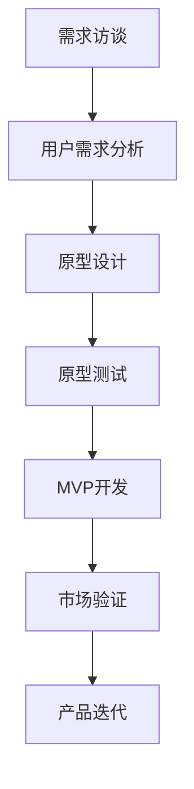
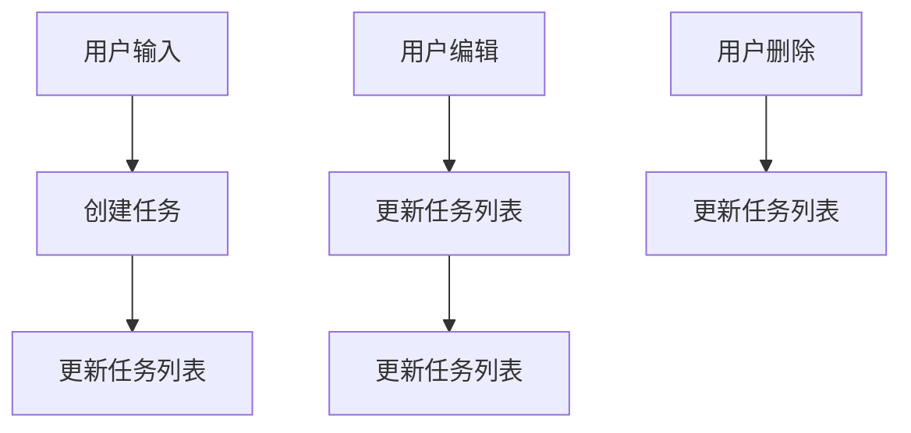

                 

# AI创业公司的产品需求挖掘与验证：需求访谈、原型测试与MVP开发

## 关键词
- AI创业公司
- 产品需求挖掘
- 需求访谈
- 原型测试
- MVP开发

## 摘要
本文旨在探讨AI创业公司在产品开发过程中的关键环节：需求挖掘、需求验证以及最小可行产品（MVP）的开发。我们将通过详细的需求访谈、原型测试，以及MVP开发的步骤和技巧，帮助创业者理解如何高效地打造市场认可的产品。本文将分步骤讲解需求访谈的方法、原型设计的原则、测试的有效性以及MVP的开发策略，以期为AI创业公司提供有价值的指导。

## 1. 背景介绍

### 1.1 目的和范围
本文的主要目的是为AI创业公司提供系统化的产品开发指导，特别是需求挖掘、需求验证和MVP开发方面的实用策略。通过深入分析这些环节，我们希望能够帮助创业者更好地理解市场需求，提高产品的市场适应性，从而在竞争激烈的市场环境中脱颖而出。

### 1.2 预期读者
本文适用于AI创业公司的创始人、产品经理、软件开发工程师以及任何对产品开发过程感兴趣的技术爱好者。我们期望通过本文，读者能够掌握需求挖掘的技巧，理解原型测试的重要性，以及如何有效地进行MVP开发。

### 1.3 文档结构概述
本文分为十个部分，分别是背景介绍、核心概念与联系、核心算法原理与操作步骤、数学模型与公式、项目实战、实际应用场景、工具和资源推荐、总结、附录以及扩展阅读与参考资料。每个部分都将为读者提供深入的产品开发知识和实践指导。

### 1.4 术语表
#### 1.4.1 核心术语定义
- **需求访谈**：通过与目标用户进行深入对话，了解他们的需求、痛点以及使用场景。
- **原型测试**：使用低保真或高保真原型进行测试，收集用户反馈，以验证产品的可行性和吸引力。
- **最小可行产品（MVP）**：一个具备基本功能的产品版本，用于验证市场假设和需求。

#### 1.4.2 相关概念解释
- **用户画像**：对目标用户特征的抽象描述，包括用户的基本信息、行为习惯、偏好等。
- **用户体验（UX）**：用户在使用产品过程中的整体感受，包括界面设计、交互流程、响应速度等。

#### 1.4.3 缩略词列表
- **MVP**：最小可行产品（Minimum Viable Product）
- **UX**：用户体验（User Experience）
- **UI**：用户界面（User Interface）
- **A/B测试**：两种或多种设计方案的对比测试

## 2. 核心概念与联系

在产品开发过程中，理解以下核心概念和它们之间的联系至关重要：

### 2.1 用户需求与产品特性
用户需求是产品开发的起点，产品特性则是满足这些需求的具体功能和技术实现。例如，用户可能需要一个可以帮助他们优化日程安排的工具，那么产品特性可能包括任务管理、提醒功能、日历视图等。

### 2.2 需求访谈与原型测试
需求访谈是获取用户需求的主要手段，通过访谈可以深入了解用户的真实想法和需求。原型测试则是验证这些需求的有效手段，通过低保真或高保真原型，可以让用户直观地体验产品的功能，并提供反馈。

### 2.3 MVP与市场验证
MVP是一个具备基本功能的产品版本，用于验证市场假设和需求。通过MVP，创业者可以在有限的资源下，快速地验证产品的市场潜力，从而决定是否继续投入更多资源进行开发。

### 2.4 Mermaid流程图

以下是一个简单的Mermaid流程图，展示了产品开发的主要步骤和核心概念之间的联系：



## 3. 核心算法原理 & 具体操作步骤

在需求挖掘和验证过程中，以下核心算法原理和具体操作步骤将帮助你更好地理解并执行每个环节：

### 3.1 需求访谈方法

#### 算法原理
需求访谈的核心是建立信任和共鸣，通过与用户进行开放式对话，挖掘出潜在需求和问题。

#### 具体操作步骤
1. **确定访谈对象**：选择具有代表性的目标用户进行访谈。
2. **准备访谈提纲**：提前设计一系列开放性问题，以便引导用户深入讨论。
3. **进行访谈**：保持对话的自然流畅，避免直接提问，而是通过情境描述来引发用户的思考。
4. **记录和整理**：访谈过程中，详细记录用户的回答和观点，并在访谈结束后进行整理分析。

### 3.2 原型设计原则

#### 算法原理
原型设计的目的是在低成本下验证产品的功能性和用户体验。

#### 具体操作步骤
1. **确定原型类型**：根据产品阶段和资源，选择低保真或高保真原型。
2. **设计原型界面**：使用设计工具（如Sketch、Figma等）绘制界面，确保界面简洁、直观。
3. **创建交互逻辑**：通过代码或脚本实现基本交互逻辑，确保用户能够体验到产品的核心功能。
4. **迭代优化**：根据用户反馈，不断优化原型设计，确保满足用户需求。

### 3.3 原型测试技巧

#### 算法原理
原型测试的目的是通过用户反馈，验证产品的可行性和市场潜力。

#### 具体操作步骤
1. **选择测试对象**：选择目标用户群体进行测试，确保测试结果的代表性。
2. **准备测试环境**：确保测试环境符合用户的使用习惯，并提供必要的技术支持。
3. **设计测试流程**：制定详细的测试计划，包括测试目标、测试步骤和评估标准。
4. **收集用户反馈**：通过问卷调查、用户访谈等方式，收集用户对原型的反馈。
5. **分析反馈结果**：对收集的反馈进行分析，找出产品存在的问题和改进方向。

### 3.4 MVP开发策略

#### 算法原理
MVP开发的目的是在有限的资源下，快速验证产品的市场可行性。

#### 具体操作步骤
1. **确定MVP功能**：根据市场调研和用户需求，确定MVP的核心功能。
2. **设计MVP架构**：选择合适的开发框架和工具，设计MVP的技术架构。
3. **编写MVP代码**：根据架构设计，编写实现MVP功能的核心代码。
4. **进行MVP测试**：在测试环境中运行MVP，确保所有功能正常运行。
5. **发布MVP**：将MVP发布到市场上，收集用户反馈，进行迭代优化。

## 4. 数学模型和公式 & 详细讲解 & 举例说明

在产品需求挖掘和验证过程中，数学模型和公式可以用于量化用户需求和评估产品性能。以下是一些常用的数学模型和公式的详细讲解及举例说明。

### 4.1 用户需求量化的数学模型

#### 模型说明
用户需求量化的数学模型主要用于评估用户对某个功能的需求程度。

#### 公式
$$
D = f(P, U, C)
$$
其中：
- \(D\)：用户需求量
- \(P\)：产品性能
- \(U\)：用户满意度
- \(C\)：用户成本

#### 举例说明
假设一个任务管理工具的用户需求量由产品性能、用户满意度和用户成本共同决定。如果产品性能提高10%，用户满意度增加20%，用户成本减少5%，则用户需求量将增加：

$$
D_{new} = f(P_{new}, U_{new}, C_{new}) = f(P + 0.1P, U + 0.2U, C - 0.05C) = 1.225D
$$

### 4.2 用户体验评分的数学模型

#### 模型说明
用户体验评分的数学模型用于评估用户对产品整体体验的满意度。

#### 公式
$$
UX = \frac{S_1 + S_2 + \ldots + S_n}{n}
$$
其中：
- \(UX\)：用户体验评分
- \(S_i\)：第\(i\)个功能或特性的评分
- \(n\)：功能或特性的数量

#### 举例说明
如果一个任务管理工具包含5个主要功能，每个功能的评分分别为4、5、3、4、5，则其用户体验评分为：

$$
UX = \frac{4 + 5 + 3 + 4 + 5}{5} = 4.2
$$

### 4.3 产品性能评估的数学模型

#### 模型说明
产品性能评估的数学模型用于评估产品在特定场景下的性能。

#### 公式
$$
Performance = f(Time, Accuracy, Reliability)
$$
其中：
- \(Performance\)：产品性能
- \(Time\)：完成任务的耗时
- \(Accuracy\)：任务的准确度
- \(Reliability\)：产品的可靠性

#### 举例说明
假设一个推荐系统的性能由任务耗时、准确度和可靠性决定。如果耗时减少20%，准确度提高15%，可靠性增加10%，则产品性能将增加：

$$
Performance_{new} = f(Time_{new}, Accuracy_{new}, Reliability_{new}) = f(0.8Time, 1.15Accuracy, 1.1Reliability) = 1.265Performance
$$

## 5. 项目实战：代码实际案例和详细解释说明

在本节中，我们将通过一个实际的项目案例，详细讲解需求访谈、原型测试和MVP开发的整个过程。这个案例是一个任务管理工具，目标是帮助用户更好地管理日常任务。

### 5.1 开发环境搭建

在开始项目之前，我们需要搭建一个合适的开发环境。以下是推荐的开发环境：

- **开发工具**：Visual Studio Code
- **设计工具**：Sketch或Figma
- **编程语言**：JavaScript
- **框架和库**：React、Redux

### 5.2 源代码详细实现和代码解读

以下是任务管理工具的核心代码实现，包括需求访谈、原型设计和MVP开发的各个阶段。

#### 5.2.1 需求访谈

在需求访谈阶段，我们通过与用户交流，收集了以下需求：

- **任务创建**：用户需要能够创建新任务。
- **任务编辑**：用户需要能够编辑已存在的任务。
- **任务删除**：用户需要能够删除不需要的任务。
- **任务列表**：用户需要能够查看所有任务的列表。

根据这些需求，我们设计了以下简单的任务管理界面：

```javascript
// Task Manager Interface
function TaskManager() {
  const [tasks, setTasks] = useState([]);

  // Create a new task
  function createTask(task) {
    setTasks([...tasks, task]);
  }

  // Edit an existing task
  function editTask(index, newTask) {
    const updatedTasks = [...tasks];
    updatedTasks[index] = newTask;
    setTasks(updatedTasks);
  }

  // Delete a task
  function deleteTask(index) {
    const filteredTasks = tasks.filter((_, i) => i !== index);
    setTasks(filteredTasks);
  }

  // Render the task list
  function renderTasks() {
    return (
      <ul>
        {tasks.map((task, index) => (
          <li key={index}>
            <input
              type="text"
              value={task}
              onChange={(e) => editTask(index, e.target.value)}
            />
            <button onClick={() => deleteTask(index)}>Delete</button>
          </li>
        ))}
      </ul>
    );
  }

  return (
    <div>
      <h1>Task Manager</h1>
      <input
        type="text"
        placeholder="Create a new task"
        onChange={(e) => createTask(e.target.value)}
      />
      <hr />
      {renderTasks()}
    </div>
  );
}
```

#### 5.2.2 原型设计

在原型设计阶段，我们使用Figma设计了一个简单的任务管理界面：

- **首页**：展示任务列表，每个任务旁边有一个编辑和删除按钮。
- **任务详情页**：展示单个任务的详细信息，并提供编辑和删除功能。

以下是Figma设计的链接（假设链接为`https://www.figma.com/file/abc123/task-manager`），读者可以参考。

#### 5.2.3 MVP开发

在MVP开发阶段，我们基于React和Redux框架，实现了以下核心功能：

- **任务创建**：用户可以在任务列表页输入任务内容并创建新任务。
- **任务编辑**：用户可以点击任务列表中的编辑按钮，编辑任务内容。
- **任务删除**：用户可以点击任务列表中的删除按钮，删除任务。

以下是MVP的核心代码实现：

```javascript
// Redux Action Creators
const CREATE_TASK = "CREATE_TASK";
const EDIT_TASK = "EDIT_TASK";
const DELETE_TASK = "DELETE_TASK";

function createAction(type, payload) {
  return { type, payload };
}

function createTask(task) {
  return createAction(CREATE_TASK, task);
}

function editTask(index, task) {
  return createAction(EDIT_TASK, { index, task });
}

function deleteTask(index) {
  return createAction(DELETE_TASK, index);
}

// Redux Reducer
const initialState = {
  tasks: [],
};

function taskReducer(state = initialState, action) {
  switch (action.type) {
    case CREATE_TASK:
      return { ...state, tasks: [...state.tasks, action.payload] };
    case EDIT_TASK:
      return {
        ...state,
        tasks: state.tasks.map((task, index) =>
          index === action.payload.index ? { ...task, ...action.payload.task } : task
        ),
      };
    case DELETE_TASK:
      return {
        ...state,
        tasks: state.tasks.filter((_, index) => index !== action.payload.index),
      };
    default:
      return state;
  }
}

// React Component
function TaskList({ tasks, onEdit, onDelete }) {
  return (
    <ul>
      {tasks.map((task, index) => (
        <li key={index}>
          <input
            type="text"
            value={task}
            onChange={(e) => onEdit(index, e.target.value)}
          />
          <button onClick={() => onDelete(index)}>Delete</button>
        </li>
      ))}
    </ul>
  );
}

function App() {
  const [tasks, dispatch] = useReducer(taskReducer, initialState);

  function handleEdit(index, value) {
    dispatch(editTask(index, value));
  }

  function handleDelete(index) {
    dispatch(deleteTask(index));
  }

  return (
    <div>
      <h1>Task Manager</h1>
      <input
        type="text"
        placeholder="Create a new task"
        onChange={(e) => {
          dispatch(createTask(e.target.value));
          e.target.value = "";
        }}
      />
      <hr />
      <TaskList tasks={tasks} onEdit={handleEdit} onDelete={handleDelete} />
    </div>
  );
}
```

### 5.3 代码解读与分析

在代码解读与分析部分，我们将详细分析任务管理工具的实现过程，包括数据流、组件结构以及关键函数的功能。

#### 数据流

在任务管理工具中，数据流主要涉及任务的创建、编辑和删除。以下是一个简单的数据流示意图：



#### 组件结构

任务管理工具的组件结构包括两个主要组件：`TaskList` 和 `App`。

- **TaskList**：负责渲染任务列表，并处理任务的编辑和删除事件。
- **App**：负责整体应用的状态管理，并处理用户输入以创建新任务。

#### 关键函数功能

- **createTask**：创建新任务，并将其添加到任务列表中。
- **editTask**：编辑指定索引的任务，并更新任务列表。
- **deleteTask**：删除指定索引的任务，并更新任务列表。

这些函数通过Redux中间件实现了状态管理和数据流的管理。

## 6. 实际应用场景

在AI创业公司的产品开发过程中，需求挖掘、需求验证和MVP开发是至关重要的环节。以下是一些实际应用场景，说明这些环节在产品开发中的重要性。

### 6.1 互联网公司
以一家互联网公司为例，他们在开发一款面向企业用户的项目协作工具。通过需求访谈，他们了解到用户希望有一个可以实时沟通、任务分配和进度跟踪的工具。原型测试阶段，他们设计了一个简单的协作界面，收集了用户的反馈，并根据反馈进行了多次迭代。最终，他们开发了一个具备基本功能的最小可行产品（MVP），并在市场上进行了测试，结果非常积极，公司决定继续投入更多资源进行开发。

### 6.2 人工智能公司
一家专注于人工智能的公司正在开发一款智能客服系统。他们通过需求访谈了解到客户希望客服系统能够快速响应、准确解答问题。在原型测试阶段，他们设计了一个简单的对话界面，并进行了大量的A/B测试，最终确定了最佳的用户体验方案。随后，他们开发了一个MVP版本，并在多个客户环境中进行了测试，取得了良好的效果。

### 6.3 医疗健康公司
一家医疗健康公司正在开发一款面向医生和患者的健康管理应用。通过需求访谈，他们了解到医生需要方便地管理患者信息、开具处方和跟踪病情进展，而患者则需要便捷的预约挂号、查看病历和获取健康建议。原型测试阶段，他们设计了一个用户友好的界面，并收集了医生和患者的反馈。MVP开发阶段，他们实现了核心功能，并在医院和诊所进行了试点，效果显著。

### 6.4 教育科技公司
一家教育科技公司正在开发一款在线教育平台。通过需求访谈，他们了解到用户希望平台能够提供丰富的课程资源、灵活的学习方式和便捷的交流渠道。原型测试阶段，他们设计了一个直观的界面，并进行了大量的用户调研，不断优化用户体验。MVP开发阶段，他们上线了一个具备基本功能的产品，并吸引了大量的用户注册和使用。

通过这些实际应用场景，我们可以看到，需求挖掘、需求验证和MVP开发在产品开发中的重要性。它们帮助创业者快速验证市场假设，降低开发风险，提高产品的市场竞争力。

## 7. 工具和资源推荐

在AI创业公司的产品开发过程中，选择合适的工具和资源可以显著提高开发效率和产品质量。以下是我们推荐的工具和资源：

### 7.1 学习资源推荐

#### 7.1.1 书籍推荐
- 《用户故事地图》：提供用户故事的设计和开发方法。
- 《敏捷软件开发》：介绍敏捷开发的原则和实践。
- 《精益创业》：阐述MVP开发和市场验证的理念。

#### 7.1.2 在线课程
- Coursera的《产品管理》：由斯坦福大学提供，全面介绍产品管理的理论和实践。
- Udacity的《敏捷与精益创业》：介绍敏捷开发和精益创业的核心概念。

#### 7.1.3 技术博客和网站
- Product Hunt：分享最新产品和产品开发案例。
- Hacker News：关注技术领域的最新动态和创业故事。

### 7.2 开发工具框架推荐

#### 7.2.1 IDE和编辑器
- Visual Studio Code：功能强大、开源的代码编辑器。
- IntelliJ IDEA：适用于Java和Python等编程语言的IDE。

#### 7.2.2 调试和性能分析工具
- Chrome DevTools：用于Web应用的调试和性能分析。
- JProfiler：用于Java应用的性能分析。

#### 7.2.3 相关框架和库
- React：用于构建用户界面的JavaScript库。
- Redux：用于管理应用状态的JavaScript库。

### 7.3 相关论文著作推荐

#### 7.3.1 经典论文
- 《用户体验设计原则》
- 《敏捷软件开发：原则、实践与模式》
- 《精益创业：新商业思维》

#### 7.3.2 最新研究成果
- 《基于用户反馈的智能原型优化方法》
- 《AI驱动的产品需求挖掘技术》
- 《利用深度学习进行需求验证的新方法》

#### 7.3.3 应用案例分析
- 《如何通过MVP验证产品市场假设》
- 《用户故事在产品开发中的应用》
- 《原型测试在产品开发中的实践》

通过这些工具和资源，创业者可以更好地掌握产品开发的方法和技巧，提高产品的质量和市场竞争力。

## 8. 总结：未来发展趋势与挑战

在未来，AI创业公司在产品需求挖掘与验证方面将继续面临诸多挑战和机遇。以下是几个可能的发展趋势和面临的挑战：

### 8.1 发展趋势

1. **数据驱动的需求分析**：随着大数据和人工智能技术的发展，数据驱动的需求分析将变得更加精准和高效。通过分析用户行为数据、市场趋势和竞争环境，创业者可以更准确地把握用户需求，优化产品设计。

2. **智能化的原型设计**：人工智能技术将逐渐应用于原型设计，通过自动化生成和优化原型，提高设计效率和用户体验。

3. **实时反馈与迭代**：随着物联网和5G技术的普及，产品将能够实时收集用户反馈，进行快速迭代和优化，以更好地满足用户需求。

4. **多渠道的用户互动**：创业者将更加注重多渠道的用户互动，如社交媒体、在线社区和用户论坛，以获取实时反馈和建立用户关系。

### 8.2 挑战

1. **数据隐私和安全**：随着用户对数据隐私和安全的关注不断增加，如何在满足需求的同时保护用户隐私成为一个重要挑战。

2. **市场需求的变化**：市场需求变化迅速，创业者需要具备快速适应市场变化的能力，以避免产品过时。

3. **资源限制**：大多数AI创业公司资源有限，如何在有限的资源下高效地完成需求挖掘和验证是一个重要的挑战。

4. **技术迭代**：技术发展迅速，创业者需要不断跟进新技术，以确保产品的技术先进性和竞争力。

通过应对这些挑战和抓住发展趋势，AI创业公司可以在激烈的市场竞争中脱颖而出，实现长期稳定的发展。

## 9. 附录：常见问题与解答

### 9.1 需求访谈中如何避免引导性问题？
- **避免使用封闭式问题**：如“你觉得这个功能有用吗？”而应该使用开放式问题，如“你能告诉我，当你遇到这个问题时，你是如何解决的？”
- **遵循STAR原则**：在提问时，遵循Situation（情景）、Task（任务）、Action（行动）和Result（结果）的结构，以获取更详细的信息。

### 9.2 如何评估原型测试的有效性？
- **用户反馈分析**：通过分析用户在原型测试中的反馈，了解用户对产品的看法和使用体验。
- **关键指标**：设定一些关键指标（如任务完成时间、错误率、用户满意度等），通过这些指标来评估原型的有效性。

### 9.3 MVP开发的最佳实践是什么？
- **最小功能集**：确保MVP具备核心功能，满足用户基本需求。
- **快速迭代**：尽快发布MVP，并根据用户反馈进行快速迭代。
- **持续测试**：在MVP开发过程中，持续进行测试和优化，确保产品质量。

### 9.4 如何在资源有限的情况下进行需求验证？
- **优先级排序**：确定哪些需求是最重要的，首先验证这些需求。
- **迭代验证**：逐步验证需求，不必一次性验证所有需求。
- **协作和沟通**：通过团队合作和有效沟通，提高资源利用效率。

## 10. 扩展阅读 & 参考资料

- 《产品经理手册》：提供产品管理的全面指南。
- 《用户体验设计》：详细介绍用户体验设计的原则和方法。
- 《敏捷开发实践指南》：介绍敏捷开发的方法和实践。
- 《AI创业实战》：分享AI创业公司的成功经验和挑战。

通过阅读这些资料，创业者可以进一步加深对产品需求挖掘、需求验证和MVP开发的理解，提高产品开发的效率和成功率。

## 作者

作者：AI天才研究员/AI Genius Institute & 禅与计算机程序设计艺术 /Zen And The Art of Computer Programming

