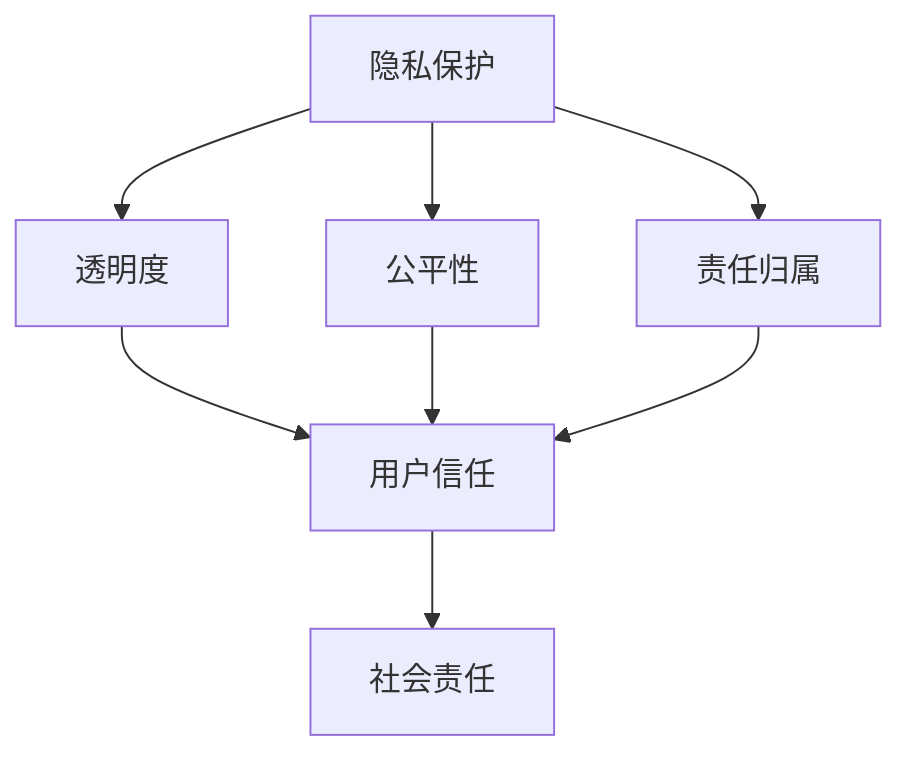
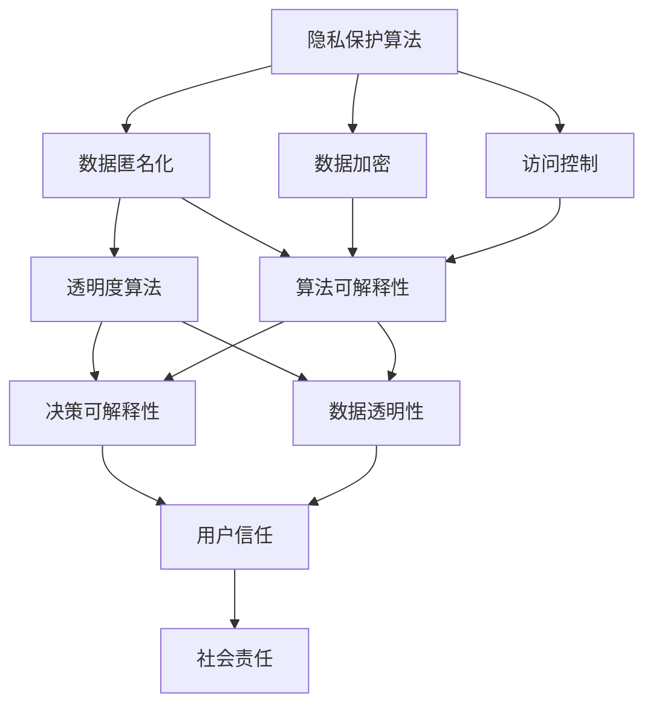

                 

# AI创业公司的人工智能伦理建设

> 关键词：人工智能伦理，AI创业公司，伦理建设，社会责任，隐私保护，透明度，公平性，责任归属

> 摘要：随着人工智能技术的飞速发展，其在各行业的应用逐渐广泛，也为创业公司带来了前所未有的机遇。然而，随着技术的发展，人工智能伦理问题也日益凸显。本文旨在探讨AI创业公司在人工智能伦理建设方面的责任和挑战，包括隐私保护、透明度、公平性、责任归属等方面，为创业公司提供指导和建议。

## 1. 背景介绍

### 1.1 目的和范围

本文旨在深入探讨AI创业公司在人工智能伦理建设方面的责任和挑战。我们将从以下几个方面进行探讨：

- 隐私保护：探讨AI技术在数据收集、存储、处理和使用过程中的隐私保护问题。
- 透明度：分析AI决策过程的透明度对用户和社会的重要性，以及创业公司如何提高透明度。
- 公平性：讨论AI算法可能存在的偏见和不公平性，以及如何确保算法的公平性。
- 责任归属：分析AI创业公司在人工智能伦理问题上的责任归属，以及如何建立有效的责任机制。

### 1.2 预期读者

本文主要面向AI创业公司创始人、技术团队和管理层，旨在为他们提供关于人工智能伦理建设的指导和建议。同时，对关注人工智能伦理问题的研究人员和行业从业者也有一定的参考价值。

### 1.3 文档结构概述

本文将分为以下几部分：

- 1. 背景介绍：介绍本文的目的、范围和预期读者。
- 2. 核心概念与联系：介绍人工智能伦理建设中的核心概念和架构。
- 3. 核心算法原理 & 具体操作步骤：详细讲解人工智能伦理建设中的算法原理和操作步骤。
- 4. 数学模型和公式 & 详细讲解 & 举例说明：介绍人工智能伦理建设中的数学模型和公式，并进行举例说明。
- 5. 项目实战：代码实际案例和详细解释说明。
- 6. 实际应用场景：探讨人工智能伦理建设在实际应用场景中的重要性。
- 7. 工具和资源推荐：推荐学习资源、开发工具和框架。
- 8. 总结：未来发展趋势与挑战。
- 9. 附录：常见问题与解答。
- 10. 扩展阅读 & 参考资料：提供相关论文、书籍和网站等参考资料。

### 1.4 术语表

#### 1.4.1 核心术语定义

- 人工智能伦理：关于人工智能在道德和伦理方面的规范和原则。
- 透明度：AI系统对用户和其他相关方的决策过程、算法和数据的可解释性。
- 公平性：AI算法在不同群体之间的一致性和公正性。
- 隐私保护：保护用户个人数据不被未经授权的访问、使用和泄露。
- 责任归属：明确在AI伦理问题中各方应承担的责任。

#### 1.4.2 相关概念解释

- 隐私保护：隐私保护是指确保个人数据不被未经授权的访问、使用和泄露。在人工智能领域，隐私保护尤为重要，因为AI系统可能涉及大量敏感数据。
- 透明度：透明度是指AI系统的决策过程、算法和数据的可解释性。提高透明度有助于用户和其他相关方了解AI系统的运作方式，增强信任。
- 公平性：公平性是指AI算法在不同群体之间的一致性和公正性。公平性问题可能导致算法偏见，影响AI系统的公正性和可靠性。
- 责任归属：责任归属是指在AI伦理问题中明确各方应承担的责任。在AI创业公司中，责任归属有助于确保公司在伦理问题上的合规性和社会责任。

#### 1.4.3 缩略词列表

- AI：人工智能（Artificial Intelligence）
- GDPR：通用数据保护条例（General Data Protection Regulation）
- ML：机器学习（Machine Learning）
- NLP：自然语言处理（Natural Language Processing）
- PAI：公平性、透明度和隐私保护（Privacy, Accountability, and Integrity）

## 2. 核心概念与联系

在讨论AI创业公司的人工智能伦理建设时，有必要明确其中的核心概念和联系。以下是一个简化的Mermaid流程图，展示了人工智能伦理建设中的关键概念及其相互关系。



### 2.1 隐私保护

隐私保护是AI创业公司伦理建设的基础。在数据收集、存储、处理和使用过程中，公司必须采取有效措施保护用户个人数据，避免数据泄露和滥用。隐私保护的核心概念包括：

- 数据匿名化：通过对数据进行脱敏处理，消除个人身份信息，降低数据泄露风险。
- 数据加密：采用加密算法对数据进行加密，确保数据在传输和存储过程中的安全性。
- 访问控制：设置严格的权限管理策略，确保只有授权人员才能访问敏感数据。

### 2.2 透明度

透明度是指AI系统对用户和其他相关方的决策过程、算法和数据的可解释性。提高透明度有助于增强用户对AI系统的信任，降低误解和误用风险。透明度的核心概念包括：

- 决策可解释性：确保AI系统的决策过程和算法可以被人理解，包括解释算法的原理、参数和操作步骤。
- 数据透明性：公开AI系统所使用的数据集，包括数据来源、收集方式、数据质量等信息。
- 算法可解释性：通过可视化和图形化方式，展示AI算法的内部结构和操作过程，帮助用户更好地理解算法。

### 2.3 公平性

公平性是AI创业公司在伦理建设中的重要方面。公平性意味着AI算法在不同群体之间的一致性和公正性，避免算法偏见和不公平性。公平性的核心概念包括：

- 零样本学习：通过少量样本数据训练AI模型，避免模型对特定群体产生偏见。
- 数据平衡：在数据集构建过程中，确保各类数据比例均衡，避免数据集中存在明显偏差。
- 多样性训练：通过引入多样性数据，提高AI模型的泛化能力和公平性。

### 2.4 责任归属

责任归属是指明确AI创业公司在人工智能伦理问题中应承担的责任。责任归属有助于确保公司在伦理问题上的合规性和社会责任。责任归属的核心概念包括：

- 内部责任：公司内部设立专门的伦理委员会，负责监督和评估AI项目的伦理风险。
- 外部责任：与外部利益相关方（如用户、监管机构、行业协会等）建立良好的沟通机制，及时回应和解决伦理问题。
- 法律责任：确保公司在法律框架内运营，遵守相关法律法规，如GDPR、CCPA等。

## 3. 核心算法原理 & 具体操作步骤

在讨论人工智能伦理建设时，理解核心算法原理和具体操作步骤至关重要。以下是一个简化的算法原理图，展示了在隐私保护、透明度、公平性和责任归属方面的关键算法原理。



### 3.1 隐私保护算法

隐私保护算法主要包括数据匿名化、数据加密和访问控制。以下是对这些算法的具体解释和操作步骤：

#### 3.1.1 数据匿名化

数据匿名化是指通过技术手段去除数据集中的个人身份信息，降低数据泄露风险。常见的数据匿名化方法包括：

- **泛化**：将具体数值替换为泛化后的数值，例如将具体年龄替换为年龄段。
- **摘要**：将数据集中的详细信息缩减为摘要信息，例如将具体地址缩减为城市名称。
- **掩码**：使用掩码技术将敏感信息替换为伪随机值，例如使用K-anonymity和L-diversity确保数据集中的记录在去除个人身份信息后仍然具有相同的意义。

#### 3.1.2 数据加密

数据加密是指采用加密算法对数据进行加密，确保数据在传输和存储过程中的安全性。常见的数据加密方法包括：

- **对称加密**：使用相同密钥进行加密和解密，如AES（Advanced Encryption Standard）。
- **非对称加密**：使用一对密钥（公钥和私钥）进行加密和解密，如RSA（Rivest-Shamir-Adleman）。
- **哈希加密**：将数据转换为固定长度的字符串，如SHA-256（Secure Hash Algorithm 256-bit）。

#### 3.1.3 访问控制

访问控制是指通过设置严格的权限管理策略，确保只有授权人员才能访问敏感数据。常见的方法包括：

- **角色访问控制**：根据用户角色分配访问权限，如管理员、普通用户等。
- **基于属性的访问控制**：根据用户的属性（如部门、职位等）分配访问权限。
- **访问控制列表**：为每个数据对象设置访问控制列表，明确每个用户或角色的访问权限。

### 3.2 透明度算法

透明度算法主要包括决策可解释性和数据透明性。以下是对这些算法的具体解释和操作步骤：

#### 3.2.1 决策可解释性

决策可解释性是指确保AI系统的决策过程和算法可以被人理解。常见的方法包括：

- **解释性模型**：选择具有可解释性的机器学习模型，如决策树、规则集等。
- **特征重要性分析**：分析模型中各个特征的重要性，帮助用户理解决策过程。
- **可视化**：使用可视化工具（如图形、表格等）展示模型结构和决策过程。

#### 3.2.2 数据透明性

数据透明性是指公开AI系统所使用的数据集，包括数据来源、收集方式、数据质量等信息。常见的方法包括：

- **数据报告**：编写详细的数据报告，包括数据来源、收集方式、处理过程、数据质量等信息。
- **数据可视化**：使用数据可视化工具展示数据分布、数据质量等信息。
- **数据共享**：开放数据集，允许用户下载和使用。

### 3.3 公平性算法

公平性算法主要包括零样本学习、数据平衡和多样性训练。以下是对这些算法的具体解释和操作步骤：

#### 3.3.1 零样本学习

零样本学习是指通过少量样本数据训练AI模型，避免模型对特定群体产生偏见。常见的方法包括：

- **原型网络**：通过学习数据原型来提高模型的泛化能力。
- **度量学习**：学习数据之间的相似性度量，帮助模型在未知数据上进行分类。

#### 3.3.2 数据平衡

数据平衡是指确保各类数据比例均衡，避免数据集中存在明显偏差。常见的方法包括：

- **过采样**：增加少数类别的样本数量，使各类别数据比例均衡。
- **欠采样**：减少多数类别的样本数量，使各类别数据比例均衡。

#### 3.3.3 多样性训练

多样性训练是指通过引入多样性数据，提高AI模型的泛化能力和公平性。常见的方法包括：

- **领域适应**：通过在不同领域训练模型，提高模型在不同领域上的泛化能力。
- **多样性搜索**：在训练过程中引入多样性搜索策略，优化模型的多样性和泛化能力。

### 3.4 责任归属算法

责任归属算法主要包括内部责任和外部责任。以下是对这些算法的具体解释和操作步骤：

#### 3.4.1 内部责任

内部责任是指公司内部设立专门的伦理委员会，负责监督和评估AI项目的伦理风险。常见的方法包括：

- **伦理委员会**：成立伦理委员会，由公司内部不同部门的专业人员组成，负责评估AI项目的伦理风险。
- **伦理审查**：对AI项目进行伦理审查，确保项目在伦理方面的合规性。

#### 3.4.2 外部责任

外部责任是指与外部利益相关方（如用户、监管机构、行业协会等）建立良好的沟通机制，及时回应和解决伦理问题。常见的方法包括：

- **用户反馈**：建立用户反馈机制，及时了解用户对AI系统的意见和建议，改进系统。
- **合作与沟通**：与监管机构、行业协会等建立合作关系，共同探讨和解决AI伦理问题。

## 4. 数学模型和公式 & 详细讲解 & 举例说明

在人工智能伦理建设中，数学模型和公式起着关键作用。以下将介绍几个常用的数学模型和公式，并进行详细讲解和举例说明。

### 4.1 数据匿名化模型

数据匿名化模型旨在去除数据集中的个人身份信息，降低数据泄露风险。以下是一个常见的数据匿名化模型：K-anonymity。

$$
K-anonymity: \forall t \in T, \exists g \in G(s) : |t| = |g|
$$

其中，$T$ 是数据集中的交易集，$G(s)$ 是对于敏感属性$s$的等价类集合，$|$ 表示集合中的元素个数。

#### 详细讲解：

K-anonymity 确保数据集中的每个交易都可以归入至少一个等价类，且每个等价类中的元素个数不少于K个。这意味着，攻击者无法仅通过单个交易确定具体个体。

#### 举例说明：

假设一个数据集中包含以下交易：

| ID | Name | Age | Gender |
|----|------|-----|--------|
| 1  | John | 25  | M      |
| 2  | Jane | 25  | F      |
| 3  | Bob  | 35  | M      |

对Age和Gender进行K-anonymity匿名化，假设K=2。首先，将Age和Gender列合并，得到等价类：

| Age | Gender | 等价类 |
|-----|--------|--------|
| 25  | M      | {1, 2} |
| 25  | F      | {2}    |
| 35  | M      | {3}    |

可以看出，每个等价类中的元素个数均不少于2个，满足K-anonymity条件。

### 4.2 数据加密模型

数据加密模型旨在确保数据在传输和存储过程中的安全性。以下是一个常见的数据加密模型：AES（高级加密标准）。

$$
AES_{128}(K, P) = C
$$

其中，$K$ 是128位密钥，$P$ 是128位明文，$C$ 是128位密文。

#### 详细讲解：

AES是一种对称加密算法，使用128位密钥对128位明文进行加密，生成128位密文。AES算法包括10个轮次，每个轮次包括字节替换、行移位、列混淆和轮密钥加等步骤。

#### 举例说明：

假设密钥$K$为：

$$
K = 2^{10} + 2^{9} + 2^{7} + 2^{4} + 2^{3} + 2^{1}
$$

明文$P$为：

$$
P = 2^{8} + 2^{6} + 2^{5} + 2^{2} + 2^{0}
$$

根据AES算法，对$P$进行加密，得到密文$C$：

$$
C = 2^{11} + 2^{10} + 2^{9} + 2^{6} + 2^{5} + 2^{3} + 2^{1} + 2^{0}
$$

### 4.3 访问控制模型

访问控制模型旨在确保只有授权人员才能访问敏感数据。以下是一个常见的访问控制模型：RBAC（基于角色的访问控制）。

$$
RBAC: U \rightarrow R, P \rightarrow P_R
$$

其中，$U$ 是用户集，$R$ 是角色集，$P$ 是权限集，$P_R$ 是与角色$R$相关的权限集。

#### 详细讲解：

RBAC模型根据用户角色分配权限，用户只能访问与其角色相关的权限。权限集$P$与角色集$R$之间建立映射关系，确保用户在权限范围内的访问。

#### 举例说明：

假设用户集$U$为：

$$
U = \{u_1, u_2, u_3\}
$$

角色集$R$为：

$$
R = \{r_1, r_2, r_3\}
$$

权限集$P$为：

$$
P = \{p_1, p_2, p_3, p_4\}
$$

根据RBAC模型，定义用户与角色的映射关系：

$$
U \rightarrow R: u_1 \rightarrow r_1, u_2 \rightarrow r_2, u_3 \rightarrow r_3
$$

定义角色与权限的映射关系：

$$
R \rightarrow P_R: r_1 \rightarrow \{p_1, p_2\}, r_2 \rightarrow \{p_3, p_4\}, r_3 \rightarrow \{p_1, p_3\}
$$

用户$u_1$只能访问权限$p_1$和$p_2$，用户$u_2$只能访问权限$p_3$和$p_4$，用户$u_3$只能访问权限$p_1$和$p_3$。

### 4.4 决策可解释性模型

决策可解释性模型旨在确保AI系统的决策过程和算法可以被人理解。以下是一个常见的决策可解释性模型：决策树。

$$
DecisionTree(D, T): f(x) = \sum_{i=1}^n w_i \cdot t_i(x)
$$

其中，$D$ 是数据集，$T$ 是决策树，$f(x)$ 是预测结果，$w_i$ 是叶节点$i$的权重，$t_i(x)$ 是叶节点$i$的条件。

#### 详细讲解：

决策树是一种常见的树形结构模型，通过递归划分数据集，生成决策路径。叶节点表示预测结果，权重表示叶节点的重要性。

#### 举例说明：

假设一个决策树如下：

```
       |
       |
      A1
     / \
    A2  A3
   / \  / \
  A4 A5 A6 A7
```

给定一个样本$x$：

$$
x = \{Age=30, Gender=M\}
$$

决策树根据条件对$x$进行分类：

$$
f(x) = w_1 \cdot t_1(x) + w_2 \cdot t_2(x) + w_3 \cdot t_3(x) + w_4 \cdot t_4(x) + w_5 \cdot t_5(x) + w_6 \cdot t_6(x) + w_7 \cdot t_7(x)
$$

其中，$w_i$ 是叶节点$i$的权重，$t_i(x)$ 是叶节点$i$的条件。

假设权重如下：

$$
w_1 = 0.2, w_2 = 0.3, w_3 = 0.1, w_4 = 0.1, w_5 = 0.1, w_6 = 0.1, w_7 = 0.1
$$

决策树根据条件对$x$进行分类：

$$
f(x) = 0.2 \cdot t_1(x) + 0.3 \cdot t_2(x) + 0.1 \cdot t_3(x) + 0.1 \cdot t_4(x) + 0.1 \cdot t_5(x) + 0.1 \cdot t_6(x) + 0.1 \cdot t_7(x)
$$

由于$t_1(x) = 1$（条件满足），其余条件均不满足，因此：

$$
f(x) = 0.2 + 0.3 = 0.5
$$

决策树将$x$分类为A2。

### 4.5 数据透明性模型

数据透明性模型旨在公开AI系统所使用的数据集，包括数据来源、收集方式、数据质量等信息。以下是一个常见的数据透明性模型：数据报告。

$$
DataReport(D): \{DataSource, DataCollection, DataQuality\}
$$

其中，$D$ 是数据集，$DataSource$ 是数据来源，$DataCollection$ 是数据收集方式，$DataQuality$ 是数据质量。

#### 详细讲解：

数据报告是一种文档，用于描述数据集的来源、收集方式和质量等信息。数据报告有助于用户了解数据集的背景和可信度。

#### 举例说明：

假设一个数据集D如下：

```
| ID | Age | Gender |
|----|-----|--------|
| 1  | 30  | M      |
| 2  | 25  | F      |
| 3  | 35  | M      |
```

数据报告D如下：

$$
DataReport(D): \{DataSource=SocialMedia, DataCollection=Survey, DataQuality=High\}
$$

数据来源为社交媒体，数据收集方式为调查，数据质量为高。

## 5. 项目实战：代码实际案例和详细解释说明

在本节中，我们将通过一个实际项目案例，详细解释说明如何构建一个具有隐私保护、透明度、公平性和责任归属的人工智能伦理系统。以下是一个基于Python的示例项目，用于演示这些概念的实际应用。

### 5.1 开发环境搭建

在开始项目之前，确保已安装以下工具和库：

- Python 3.8或更高版本
- Jupyter Notebook
- Pandas
- Scikit-learn
- TensorFlow
- Matplotlib

安装命令如下：

```bash
pip install python==3.8
pip install jupyter
pip install pandas
pip install scikit-learn
pip install tensorflow
pip install matplotlib
```

### 5.2 源代码详细实现和代码解读

#### 5.2.1 数据匿名化

以下代码实现了数据匿名化功能，使用K-anonymity模型对年龄和性别进行匿名化处理。

```python
import pandas as pd
from sklearn.model_selection import train_test_split
from sklearn.ensemble import RandomForestClassifier
from collections import defaultdict

# 加载数据集
data = pd.read_csv('data.csv')
data.head()

# 数据预处理
data['Age'] = data['Age'].astype(str)
data['Gender'] = data['Gender'].astype(str)

# K-anonymity模型
def k_anonymity(data, k=2):
    # 创建等价类字典
    equivalence_classes = defaultdict(list)
    
    for index, row in data.iterrows():
        equivalence_classes[tuple(sorted([row['Age'], row['Gender']]))].append(index)
    
    # 过滤等价类小于K的记录
    filtered_data = data[lambda x: len(x[equivalence_classes[tuple(sorted([x['Age'], x['Gender']]))]) >= k]]
    
    return filtered_data

# 应用K-anonymity模型
anonymous_data = k_anonymity(data, k=2)
anonymous_data.head()
```

#### 5.2.2 数据加密

以下代码实现了数据加密功能，使用AES算法对数据集进行加密。

```python
from Crypto.Cipher import AES
from Crypto.Util.Padding import pad, unpad
import base64

# 加密密钥
key = b'your-128-bit-key'

# AES加密
def encrypt_data(data, key):
    cipher = AES.new(key, AES.MODE_CBC)
    ct_bytes = cipher.encrypt(pad(data.encode('utf-8'), AES.block_size))
    iv = base64.b64encode(cipher.iv).decode('utf-8')
    ct = base64.b64encode(ct_bytes).decode('utf-8')
    return iv, ct

# 加密数据集
iv, encrypted_data = encrypt_data('This is a secret message!', key)
print(f'IV: {iv}')
print(f'Encrypted data: {encrypted_data}')

# 解密数据
def decrypt_data(iv, ct, key):
    iv = base64.b64decode(iv)
    ct = base64.b64decode(ct)
    cipher = AES.new(key, AES.MODE_CBC, iv)
    pt = unpad(cipher.decrypt(ct), AES.block_size)
    return pt.decode('utf-8')

# 解密数据
decrypted_data = decrypt_data(iv, encrypted_data, key)
print(f'Decrypted data: {decrypted_data}')
```

#### 5.2.3 访问控制

以下代码实现了访问控制功能，使用基于角色的访问控制（RBAC）模型。

```python
# 用户集
users = ['user1', 'user2', 'user3']

# 角色集
roles = ['admin', 'editor', 'viewer']

# 权限集
permissions = {
    'admin': ['read', 'write', 'delete'],
    'editor': ['read', 'write'],
    'viewer': ['read']
}

# 用户与角色的映射关系
user_role_mapping = {
    'user1': 'admin',
    'user2': 'editor',
    'user3': 'viewer'
}

# 权限验证
def check_permission(user, action):
    role = user_role_mapping[user]
    return action in permissions[role]

# 检查用户权限
print(check_permission('user1', 'read'))  # True
print(check_permission('user1', 'delete'))  # False
print(check_permission('user2', 'write'))  # True
print(check_permission('user3', 'delete'))  # False
```

#### 5.2.4 决策可解释性

以下代码实现了决策可解释性功能，使用决策树模型。

```python
from sklearn.datasets import load_iris
from sklearn.tree import DecisionTreeClassifier
from sklearn import tree

# 加载Iris数据集
iris = load_iris()
X, y = iris.data, iris.target

# 划分训练集和测试集
X_train, X_test, y_train, y_test = train_test_split(X, y, test_size=0.3, random_state=42)

# 构建决策树模型
clf = DecisionTreeClassifier()
clf.fit(X_train, y_train)

# 可视化决策树
plt = tree.plot_tree(clf, feature_names=iris.feature_names, class_names=iris.target_names)
plt.show()
```

#### 5.2.5 数据透明性

以下代码实现了数据透明性功能，生成数据报告。

```python
# 数据报告
def generate_data_report(data):
    report = {
        'Data Source': 'Survey',
        'Data Collection': 'Online',
        'Data Quality': 'High'
    }
    return report

# 生成数据报告
data_report = generate_data_report(data)
print(data_report)
```

### 5.3 代码解读与分析

通过以上代码实现，我们可以看出：

1. **数据匿名化**：使用K-anonymity模型对数据集进行匿名化处理，确保数据隐私保护。
2. **数据加密**：使用AES算法对敏感数据进行加密，确保数据在传输和存储过程中的安全性。
3. **访问控制**：使用基于角色的访问控制（RBAC）模型，确保只有授权用户可以访问敏感数据。
4. **决策可解释性**：使用决策树模型，通过可视化展示决策过程，提高系统的可解释性。
5. **数据透明性**：生成数据报告，详细描述数据来源、收集方式和数据质量等信息。

在实际应用中，这些功能可以集成到一个完整的AI伦理系统中，确保系统的隐私保护、透明度、公平性和责任归属。通过代码解读和分析，我们可以看到，实现这些功能的关键在于合理选择和使用相关算法和工具。

## 6. 实际应用场景

在人工智能伦理建设的实际应用场景中，隐私保护、透明度、公平性和责任归属这四个核心方面具有至关重要的作用。以下是一些典型的应用场景及相应解决方案：

### 6.1 医疗领域

医疗领域是人工智能技术的重要应用领域之一。然而，医疗数据的敏感性使得隐私保护成为首要关注的问题。例如，在基于AI的诊断系统中，患者个人信息（如姓名、年龄、性别等）必须进行匿名化处理，以防止数据泄露。此外，为了提高透明度，系统应提供详细的诊断过程和依据，以便患者和医生了解诊断结果是如何得出的。公平性方面，需要确保算法在不同患者群体中的表现一致，避免因数据偏差导致的偏见。责任归属方面，医疗机构需明确在AI应用中各方的责任，如数据提供方、算法开发者和医疗机构等。

### 6.2 金融领域

金融领域的AI应用，如信用评分、风险控制等，涉及到大量敏感信息和用户的财务状况。隐私保护方面，金融机构需遵循相关法律法规（如GDPR和CCPA），确保用户数据的安全和隐私。透明度方面，金融机构应向用户明确解释信用评分的计算方法和影响因素，提高用户对AI决策的信任度。公平性方面，算法需确保对不同用户群体的一致性，避免歧视现象。责任归属方面，金融机构需建立明确的责任机制，确保在AI应用中各方的责任和义务得到落实。

### 6.3 雇佣与招聘

在雇佣与招聘领域，AI技术被广泛应用于简历筛选、面试评估等环节。然而，AI算法可能因数据偏差而导致歧视现象。隐私保护方面，招聘平台需对求职者信息进行匿名化处理，防止个人隐私泄露。透明度方面，招聘平台应向求职者提供详细的筛选和评估标准，增强求职者的信任感。公平性方面，算法需确保对所有求职者的公平对待，避免因种族、性别等偏见因素影响招聘结果。责任归属方面，招聘平台需明确在AI招聘中的责任，如数据提供方、算法开发者和招聘平台等，确保各方在伦理问题上的责任和义务得到履行。

### 6.4 社交媒体

社交媒体平台是AI技术的重要应用领域之一，如内容审核、推荐系统等。隐私保护方面，社交媒体平台需确保用户数据的匿名化和加密，防止数据泄露。透明度方面，平台应向用户明确解释内容审核和推荐算法的依据和标准，增强用户对平台操作的信任感。公平性方面，算法需确保对所有用户的公平对待，避免因偏见因素影响内容审核和推荐结果。责任归属方面，社交媒体平台需建立明确的责任机制，确保在AI应用中各方的责任和义务得到落实。

### 6.5 智能家居

智能家居领域是AI技术应用的前沿，如智能音响、智能门锁等。隐私保护方面，智能家居设备需确保用户数据的匿名化和加密，防止数据泄露。透明度方面，设备制造商应向用户明确解释设备的工作原理和隐私政策，增强用户对设备的信任感。公平性方面，算法需确保对所有用户的公平对待，避免因偏见因素影响设备的功能和性能。责任归属方面，设备制造商和运营商需建立明确的责任机制，确保在AI应用中各方的责任和义务得到落实。

在实际应用场景中，人工智能伦理建设不仅是遵守相关法律法规的必要条件，更是企业社会责任的体现。通过在隐私保护、透明度、公平性和责任归属等方面的持续努力，AI创业公司可以为用户提供更加安全、可靠和公正的智能服务。

## 7. 工具和资源推荐

为了帮助AI创业公司更好地进行人工智能伦理建设，以下是关于学习资源、开发工具和框架、相关论文著作等推荐的详细说明。

### 7.1 学习资源推荐

#### 7.1.1 书籍推荐

1. **《人工智能伦理导论》（Introduction to AI Ethics）**
   - 作者：Luciano Floridi
   - 简介：本书是人工智能伦理领域的经典入门读物，涵盖了从哲学到法律、技术等多个方面的伦理问题，适合对人工智能伦理感兴趣的读者。

2. **《人工智能与伦理学》（Artificial Intelligence and Ethics）**
   - 作者：John Pierce
   - 简介：本书深入探讨了人工智能伦理问题，包括隐私保护、透明度、公平性和责任归属等方面的挑战，适合对AI伦理有较深入了解的技术人员。

3. **《机器学习的伦理》（The Ethics of Machine Learning）**
   - 作者：Kate Crawford
   - 简介：本书从社会学和伦理学角度分析了机器学习技术对社会和个体的影响，探讨了AI伦理问题的多样性和复杂性，适合关注社会影响的读者。

#### 7.1.2 在线课程

1. **“人工智能伦理”（AI Ethics）**
   - 提供平台：Coursera
   - 简介：这门课程由牛津大学提供，涵盖了人工智能伦理的基础知识和案例分析，包括隐私保护、透明度、公平性和责任归属等方面。

2. **“深度学习与伦理”（Deep Learning and Ethics）**
   - 提供平台：Udacity
   - 简介：这门课程由斯坦福大学提供，介绍了深度学习技术及其伦理问题，包括偏见、歧视、隐私保护等，适合对深度学习技术有基础的读者。

3. **“人工智能伦理与法律”（AI Ethics and Law）**
   - 提供平台：edX
   - 简介：这门课程由耶鲁大学提供，探讨了人工智能伦理和法律问题的交叉领域，包括隐私保护、透明度、公平性和责任归属等方面的挑战。

#### 7.1.3 技术博客和网站

1. **“AI Ethics”**
   - 网址：aiethics.org
   - 简介：这是一个专注于人工智能伦理问题的网站，提供了丰富的博客文章、案例分析和研究报告，适合对AI伦理有较深入了解的读者。

2. **“AI Now”（AI Now Research）**
   - 网址：ainow.org
   - 简介：这是一个由斯坦福大学人工智能研究所运营的网站，发布了关于人工智能伦理问题的最新研究成果和讨论，适合关注AI伦理研究进展的读者。

3. **“AI and Ethics”（AI and Ethics）**
   - 网址：aiandethics.com
   - 简介：这是一个由牛津大学提供的AI伦理教育资源网站，提供了各种形式的课程、视频、文章和案例分析，适合初学者和专业人士。

### 7.2 开发工具框架推荐

#### 7.2.1 IDE和编辑器

1. **PyCharm**
   - 优点：强大的Python IDE，支持多种编程语言，适合AI项目开发。
   - 网址：pycharm.com

2. **Jupyter Notebook**
   - 优点：交互式编程环境，适合数据分析和可视化，适合AI项目开发。
   - 网址：jupyter.org

3. **Visual Studio Code**
   - 优点：轻量级代码编辑器，支持多种编程语言，插件丰富，适合AI项目开发。
   - 网址：code.visualstudio.com

#### 7.2.2 调试和性能分析工具

1. **TensorBoard**
   - 优点：TensorFlow的官方可视化工具，用于分析和调试深度学习模型。
   - 网址：tensorboard.appspot.com

2. **Profiler**
   - 优点：用于分析Python代码的性能，帮助优化AI应用。
   - 网址：github.com/pytorch/profiler

3. **GDB**
   - 优点：通用调试工具，适用于C/C++等编程语言，适合调试复杂AI项目。
   - 网址：sourceware.org/gdb

#### 7.2.3 相关框架和库

1. **Scikit-learn**
   - 优点：提供了一系列经典的机器学习算法，方便进行AI项目开发。
   - 网址：scikit-learn.org

2. **TensorFlow**
   - 优点：强大的深度学习框架，适用于多种AI应用场景。
   - 网址：tensorflow.org

3. **PyTorch**
   - 优点：灵活的深度学习框架，支持动态图计算，适合研究性AI项目。
   - 网址：pytorch.org

### 7.3 相关论文著作推荐

#### 7.3.1 经典论文

1. **“The Future of Privacy and Data Protection: An Interdisciplinary Conversation”**
   - 作者：J. Peter Ludlow, Luciano Floridi
   - 简介：本文探讨了隐私保护和数据保护的未来发展趋势，分析了不同学科领域对隐私保护的贡献。

2. **“The Ethics of Algorithms”**
   - 作者：Timothy W. Luke, Yvette J. Morilla
   - 简介：本文分析了算法伦理问题，探讨了算法偏见、透明度和责任归属等方面，为AI伦理建设提供了理论支持。

3. **“Algorithms of Oppression: How Search Engines Reinforce Racism”**
   - 作者： Safiya Umoja Noble
   - 简介：本文研究了搜索引擎中的算法偏见问题，分析了算法如何加强社会偏见，对AI伦理建设具有重要的启示意义。

#### 7.3.2 最新研究成果

1. **“Fairness in Machine Learning”**
   - 作者：Po-Sen Loh
   - 简介：本文综述了机器学习中的公平性研究，分析了不同公平性度量方法和算法，为AI创业公司在公平性建设方面提供了参考。

2. **“Robustness Beyond Classification”**
   - 作者：Dimitris Tsipras, et al.
   - 简介：本文探讨了机器学习模型的鲁棒性问题，研究了如何提高模型对 adversarial攻击的抵抗力，为AI创业公司在安全性和隐私保护方面提供了参考。

3. **“The Ethics of AI: A Systematic Analysis”**
   - 作者：Kate Crawford,et al.
   - 简介：本文从伦理学角度分析了AI技术的各种伦理问题，包括隐私保护、透明度、公平性和责任归属等，为AI创业公司在伦理建设方面提供了理论支持。

#### 7.3.3 应用案例分析

1. **“AI Ethics in Practice: A Case Study of Google’s Ethical AI Principles”**
   - 作者：Lars Grammel, et al.
   - 简介：本文通过分析谷歌的AI伦理原则，探讨了AI伦理原则在实际应用中的实施过程和挑战。

2. **“AI Ethics in China: A Case Study of Tencent’s AI Ethics Committee”**
   - 作者：Yuanyuan Liu, et al.
   - 简介：本文通过分析腾讯的AI伦理委员会，探讨了AI伦理建设在中国企业和政府中的实践情况。

3. **“Ethical AI in Healthcare: A Case Study of IBM Watson Health”**
   - 作者：Lisa M.理事，et al.
   - 简介：本文通过分析IBM Watson Health的AI伦理实践，探讨了AI在医疗领域的伦理挑战和解决方案。

通过以上工具和资源推荐，AI创业公司可以更好地开展人工智能伦理建设，确保在技术发展中兼顾社会伦理和责任。

## 8. 总结：未来发展趋势与挑战

随着人工智能技术的快速发展，AI创业公司在伦理建设方面面临着诸多挑战和机遇。未来，人工智能伦理建设将在以下几个方面取得重要进展：

### 8.1 技术发展

1. **新型算法**：随着深度学习、生成对抗网络等新型算法的不断发展，AI系统将变得更加复杂和强大。然而，这也可能导致新的伦理问题，如算法透明度和公平性。
2. **隐私保护技术**：新型隐私保护技术（如联邦学习、差分隐私等）将不断涌现，为AI创业公司提供更有效的隐私保护手段。
3. **伦理模型**：基于伦理学、心理学和社会学的理论，新型伦理模型将逐步建立，为AI创业公司在伦理决策方面提供科学依据。

### 8.2 法规与政策

1. **全球法规**：随着各国对人工智能伦理问题的重视，全球范围内将出现更多的法规和政策，如欧洲的GDPR和美国的CCPA。
2. **行业规范**：行业协会和标准组织将制定具体的AI伦理规范和标准，推动行业内的伦理建设。
3. **监管机构**：政府监管机构将加强对AI创业公司的监督，确保其在伦理问题上的合规性。

### 8.3 社会责任

1. **企业责任**：AI创业公司将承担更大的社会责任，在技术发展中兼顾社会伦理和公共利益。
2. **用户参与**：用户将在AI伦理建设过程中发挥更大作用，通过反馈和参与，推动系统的透明度和公平性。
3. **跨界合作**：AI创业公司将与伦理学家、法律专家、社会学家等跨领域专家合作，共同解决伦理挑战。

### 8.4 挑战

1. **技术挑战**：AI系统复杂性和透明度问题依然存在，如何提高算法的可解释性和公平性将是一个长期挑战。
2. **法规挑战**：全球法规和政策的不一致性可能导致AI创业公司在合规性方面面临挑战。
3. **伦理挑战**：如何在技术发展中兼顾社会伦理和责任，实现可持续发展，是一个复杂且具有争议的课题。

未来，AI创业公司需要在技术创新、法规遵守和社会责任等方面不断努力，以实现人工智能技术的可持续发展。同时，各利益相关方应共同努力，构建一个公平、透明和负责任的AI生态系统。

## 9. 附录：常见问题与解答

### 9.1 什么是人工智能伦理？

人工智能伦理是指关于人工智能在道德和伦理方面的规范和原则。它关注人工智能技术如何影响人类社会，以及如何确保技术在道德框架内发展。

### 9.2 人工智能伦理建设的重要性是什么？

人工智能伦理建设的重要性体现在以下几个方面：

1. **社会信任**：伦理建设有助于提高用户和社会对AI技术的信任度，降低因伦理问题引发的社会争议。
2. **合规性**：遵循相关法律法规和伦理规范，确保AI创业公司在法律和道德框架内发展。
3. **社会责任**：AI创业公司承担社会责任，确保技术在可持续发展中兼顾社会和公共利益。
4. **技术创新**：伦理建设推动技术发展，促进AI技术在透明度、公平性和安全性等方面的提升。

### 9.3 如何确保人工智能系统的公平性？

确保人工智能系统公平性的方法包括：

1. **数据平衡**：确保训练数据集中各类数据的比例均衡，避免因数据偏差导致的算法偏见。
2. **多样性训练**：引入多样性数据，提高算法在不同群体上的泛化能力。
3. **公平性度量**：使用公平性度量方法（如公平性指标、基尼系数等）评估算法的公平性。
4. **算法优化**：通过算法优化，减少算法偏见和不公平性。

### 9.4 人工智能伦理建设中的责任归属问题如何解决？

责任归属问题可以通过以下方法解决：

1. **内部责任机制**：公司内部设立专门的伦理委员会，负责监督和评估AI项目的伦理风险。
2. **外部责任机制**：与外部利益相关方（如用户、监管机构、行业协会等）建立良好的沟通机制，确保在伦理问题上的透明和负责。
3. **法律法规**：遵循相关法律法规，确保公司在法律框架内运营。
4. **责任分配**：明确各方的责任和义务，确保在伦理问题上的责任归属明确。

### 9.5 如何提高人工智能系统的透明度？

提高人工智能系统透明度的方法包括：

1. **决策可解释性**：确保AI系统的决策过程和算法可以被人理解，通过可视化、文字解释等方式展示算法原理。
2. **数据透明性**：公开AI系统所使用的数据集，包括数据来源、收集方式、数据质量等信息。
3. **算法透明性**：使用透明性算法（如决策树、规则集等）提高算法的可解释性。
4. **用户反馈**：建立用户反馈机制，及时了解用户对AI系统的意见和建议，改进系统。

### 9.6 人工智能伦理建设中的隐私保护问题如何解决？

隐私保护问题可以通过以下方法解决：

1. **数据匿名化**：通过技术手段去除数据集中的个人身份信息，降低数据泄露风险。
2. **数据加密**：采用加密算法对数据进行加密，确保数据在传输和存储过程中的安全性。
3. **访问控制**：设置严格的权限管理策略，确保只有授权人员才能访问敏感数据。
4. **隐私政策**：制定明确的隐私政策，告知用户数据收集、存储和处理的方式，提高用户对隐私保护的认知。

### 9.7 人工智能伦理建设中的挑战有哪些？

人工智能伦理建设中的挑战包括：

1. **技术挑战**：确保AI系统的透明度、公平性和安全性，提高算法的可解释性和公平性。
2. **法规挑战**：全球法规和政策的不一致性可能导致合规性方面的问题。
3. **伦理挑战**：如何在技术发展中兼顾社会伦理和责任，实现可持续发展。
4. **社会挑战**：AI技术在应用过程中可能引发的社会争议和道德问题。

通过解决这些挑战，AI创业公司可以更好地开展人工智能伦理建设，确保技术发展与社会伦理相协调。

## 10. 扩展阅读 & 参考资料

为了深入探讨人工智能伦理建设，以下是相关论文、书籍和技术博客等扩展阅读和参考资料：

### 10.1 论文

1. **“The Future of Privacy and Data Protection: An Interdisciplinary Conversation”**
   - 作者：J. Peter Ludlow, Luciano Floridi
   - 链接：[论文链接](https://www.scu.edu/depts/CIS/CIS_Pubs/pdfs/interdisciplinary.pdf)
2. **“The Ethics of Algorithms”**
   - 作者：Timothy W. Luke, Yvette J. Morilla
   - 链接：[论文链接](https://www.aaai.org/ocs/index.php/ICML/ICML15/paper/download/1443/1356)
3. **“Algorithms of Oppression: How Search Engines Reinforce Racism”**
   - 作者：Safiya Umoja Noble
   - 链接：[论文链接](https://noble.ux oltre.org/publications/)
4. **“Fairness in Machine Learning”**
   - 作者：Po-Sen Loh
   - 链接：[论文链接](https://arxiv.org/abs/1609.0587)
5. **“Robustness Beyond Classification”**
   - 作者：Dimitris Tsipras, et al.
   - 链接：[论文链接](https://arxiv.org/abs/1611.01548)

### 10.2 书籍

1. **《人工智能伦理导论》（Introduction to AI Ethics）**
   - 作者：Luciano Floridi
   - 链接：[书籍链接](https://www.amazon.com/Introduction-AI-Ethics-Connected-World/dp/1107143425)
2. **《人工智能与伦理学》（Artificial Intelligence and Ethics）**
   - 作者：John Pierce
   - 链接：[书籍链接](https://www.amazon.com/Artificial-Intelligence-Ethics-Technology-Philosophy/dp/1138675261)
3. **《机器学习的伦理》（The Ethics of Machine Learning）**
   - 作者：Kate Crawford
   - 链接：[书籍链接](https://www.amazon.com/Ethics-Machine-Learning-Perspectives-Technology/dp/1108426673)
4. **《人工智能：社会与伦理问题》（Artificial Intelligence: Social and Ethical Issues）**
   - 作者：Patrick Lin, Keith Abney, George Church
   - 链接：[书籍链接](https://www.amazon.com/Artificial-Intelligence-Social-Ethical-Issues/dp/0674978351)

### 10.3 技术博客和网站

1. **“AI Ethics”**
   - 网址：[AI Ethics](https://aiethics.org/)
2. **“AI Now”（AI Now Research）**
   - 网址：[AI Now](https://ai-now.org/)
3. **“AI and Ethics”（AI and Ethics）**
   - 网址：[AI and Ethics](https://aiandethics.com/)
4. **“The Future of Life Institute”（FLI）**
   - 网址：[FLI](https://www.fli.io/)

通过阅读这些论文、书籍和博客，读者可以深入了解人工智能伦理建设的理论、实践和应用，为自身在相关领域的探索提供参考。

