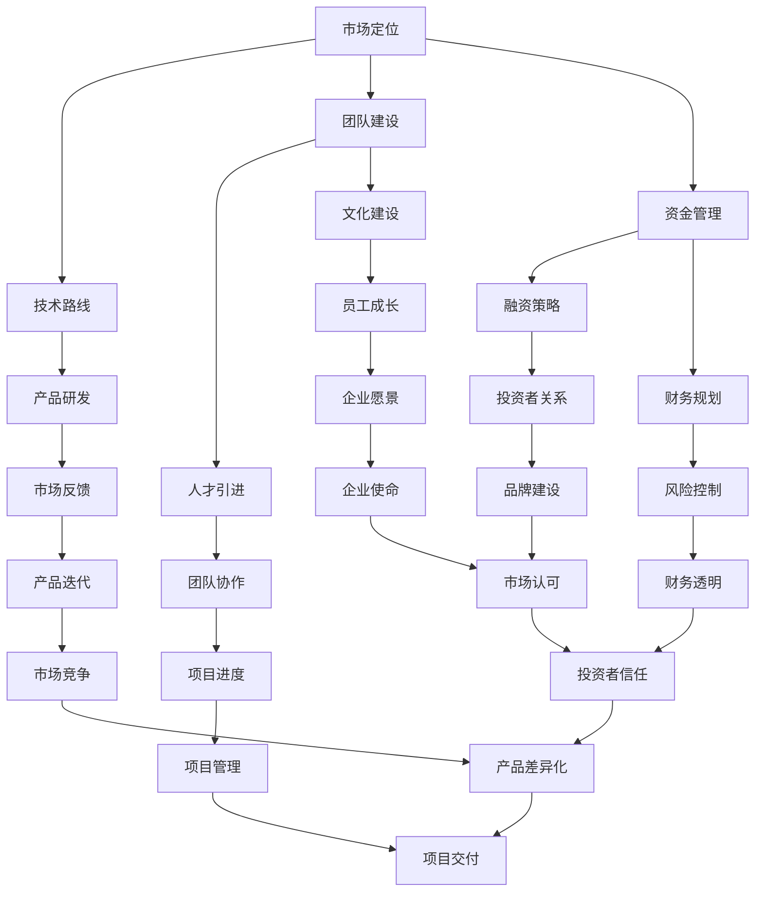

                 

# AI创业公司的发展方向

> 关键词：AI创业、发展方向、市场分析、技术路线、团队建设、资金管理

> 摘要：本文将从AI创业公司的市场定位、技术路线、团队建设、资金管理等方面入手，深入探讨AI创业公司的发展方向。通过分析市场需求、技术前景以及创业团队的实际操作，为AI创业公司提供实用的建议和策略，帮助其在竞争激烈的市场中立足并获得持续发展。

## 1. 背景介绍

### 1.1 目的和范围

本文旨在为AI创业公司提供一个全面的发展方向指南，帮助它们在当前竞争激烈的市场中找到自己的定位，并实现可持续发展。本文将涵盖以下主题：

- AI创业市场的现状和趋势
- 创业公司的市场定位策略
- 技术路线选择与研发方向
- 团队建设和人才引进
- 资金管理和财务规划

### 1.2 预期读者

本文适合以下读者群体：

- 有意向创办AI创业公司的创业者
- 已经创办AI创业公司的创始人及高管
- 对AI技术及应用感兴趣的投资者
- 对人工智能行业感兴趣的学术研究人员

### 1.3 文档结构概述

本文结构如下：

1. 背景介绍
2. 核心概念与联系
3. 核心算法原理 & 具体操作步骤
4. 数学模型和公式 & 详细讲解 & 举例说明
5. 项目实战：代码实际案例和详细解释说明
6. 实际应用场景
7. 工具和资源推荐
8. 总结：未来发展趋势与挑战
9. 附录：常见问题与解答
10. 扩展阅读 & 参考资料

### 1.4 术语表

#### 1.4.1 核心术语定义

- AI创业公司：指以人工智能技术为核心，通过技术创新实现商业价值的企业。
- 市场定位：企业在市场中所占据的位置，包括目标客户群体、产品或服务特点等。
- 技术路线：企业在研发过程中选择的技术方向和路径。
- 团队建设：企业为了实现特定目标而构建的团队，包括人员配置、技能结构、文化氛围等。
- 资金管理：企业对资金进行筹集、运用和管理的过程。

#### 1.4.2 相关概念解释

- 人工智能（AI）：模拟、延伸和扩展人类智能的理论、方法、技术及应用。
- 深度学习：一种人工智能方法，通过多层神经网络模拟人脑学习过程。
- 机器学习：一种让计算机通过数据和算法自主学习的方法。
- 自然语言处理（NLP）：人工智能的一个分支，旨在使计算机能够理解、生成和回应人类语言。

#### 1.4.3 缩略词列表

- AI：人工智能
- ML：机器学习
- DL：深度学习
- NLP：自然语言处理
- IoT：物联网
- GDPR：欧盟通用数据保护条例

## 2. 核心概念与联系

在AI创业公司的成长过程中，有几个核心概念和联系至关重要。以下是一个简单的Mermaid流程图，展示了这些概念之间的关系：



通过这个流程图，我们可以看到市场定位是创业公司的基础，它直接影响到技术路线、团队建设和资金管理。技术路线决定了产品的研发方向，进而影响市场反馈和产品迭代。团队建设和文化建设是确保团队协作和员工成长的关键，而资金管理则关系到企业的融资策略和财务规划。最终，这些因素共同作用，推动企业实现产品差异化、市场认可和投资者信任。

### 2.1 市场定位

市场定位是AI创业公司的第一步，也是至关重要的一步。一个清晰的市场定位可以帮助企业明确自己的目标客户群体、产品特点和市场优势，从而在竞争激烈的市场中找到自己的立足点。

#### 市场定位的关键要素

- 目标客户群体：确定你的产品或服务针对的用户是谁，他们的需求和痛点是什么。
- 产品特点：明确你的产品或服务的独特性，如何区别于竞争对手。
- 市场优势：分析你的市场优势，包括技术、团队、资金、资源等。
- 竞争环境：了解竞争对手的优势和劣势，以及你的产品或服务在市场上的定位。

#### 市场定位的方法

- SWOT分析：通过分析企业的优势（Strengths）、劣势（Weaknesses）、机会（Opportunities）和威胁（Threats），来确定企业的市场定位。
- 用户调研：通过问卷、访谈等方式，了解潜在客户的需求和偏好，从而确定目标客户群体和产品特点。
- 市场细分：根据客户的需求、行为和购买习惯，将市场划分为不同的细分市场，从而找到企业的目标客户群体。
- 竞争分析：通过分析竞争对手的产品、价格、渠道、营销策略等，来确定自己的市场定位。

### 2.2 技术路线

技术路线是AI创业公司的核心竞争力，决定了产品的研发方向和速度。一个清晰的技术路线可以帮助企业集中资源，提高研发效率，从而在市场上获得竞争优势。

#### 技术路线的选择

- 市场需求：根据市场需求，选择具有广泛应用前景的技术方向。
- 技术前景：分析当前技术发展趋势，选择具有长期发展潜力的技术。
- 团队优势：根据团队的技术背景和技能，选择适合团队发展的技术方向。
- 资金情况：根据企业的资金状况，选择投入成本相对较低、回报率较高的技术方向。

#### 技术路线的规划

- 短期目标：确定短期内需要实现的技术目标，如产品原型、测试版本等。
- 中期目标：确定中期内需要实现的技术目标，如产品优化、性能提升等。
- 长期目标：确定长期内需要实现的技术目标，如技术突破、行业领导等。
- 路线图：根据目标，绘制技术路线图，明确每个阶段的技术任务和时间节点。

### 2.3 团队建设

团队建设是AI创业公司的关键，一个优秀的团队可以极大地提高企业的研发效率和创新能力。团队建设包括人员配置、技能结构、文化氛围等方面。

#### 团队建设的关键要素

- 人员配置：根据技术路线和市场定位，确定团队所需的人员类型和数量。
- 技能结构：确保团队成员具备所需的技术技能和业务能力，形成合理的技能结构。
- 文化氛围：营造积极、开放、协作的企业文化，增强团队的凝聚力和执行力。

#### 团队建设的方法

- 招聘：通过招聘渠道，寻找具备相关技能和经验的人才。
- 培训：定期组织培训，提高团队成员的专业技能和业务能力。
- 考评：建立科学的考评机制，激励团队成员的积极性和创造力。
- 激励：通过薪酬、股权、福利等手段，激励团队成员为企业发展贡献力量。

### 2.4 资金管理

资金管理是AI创业公司的重要环节，关系到企业的生存和发展。有效的资金管理可以确保企业拥有足够的资金支持研发和市场拓展。

#### 资金管理的关键要素

- 融资策略：根据企业的发展阶段和市场状况，选择合适的融资渠道和方式。
- 财务规划：制定详细的财务规划，包括收入预测、成本控制、资金周转等。
- 风险控制：建立风险控制机制，降低企业经营风险。

#### 资金管理的方法

- 融资：通过天使投资、风险投资、政府补贴等渠道筹集资金。
- 管理：建立健全财务管理制度，确保资金使用的合规性和效率。
- 监控：定期监控财务状况，及时调整财务规划，确保企业资金安全。

## 3. 核心算法原理 & 具体操作步骤

在AI创业公司的技术路线中，核心算法原理和具体操作步骤是至关重要的。以下是一个简单的算法原理讲解和伪代码示例，用于解释如何实现一个基础的机器学习算法。

### 3.1 算法原理

假设我们选择使用支持向量机（SVM）作为我们的核心算法，因为SVM在分类问题中表现出色，尤其是在高维空间中。

#### 3.1.1 SVM算法原理

SVM的目标是找到一个最佳的超平面，将数据集中的正负样本分隔开。具体来说，SVM通过最大化分类边界的间隔来实现这一目标。其中，间隔是指所有支持向量到超平面的距离之和。

#### 3.1.2 SVM伪代码

```plaintext
函数SVM(trainData, trainLabel):
    # 初始化模型参数
    C = 1.0  # 正则化参数
    maxIter = 1000  # 最大迭代次数
    alpha = initializeAlpha(trainData, trainLabel, C)  # 初始化拉格朗日乘子

    for i from 1 to maxIter:
        # 更新拉格朗日乘子
        for each sample in trainData:
            if gradientDescent(sample, alpha, trainLabel, C) > threshold:
                alpha = updateAlpha(sample, alpha, trainLabel, C)

        # 更新模型参数
        modelParams = updateModelParams(alpha, trainData)

    return modelParams
```

### 3.2 具体操作步骤

#### 3.2.1 数据预处理

在训练SVM之前，我们需要对数据进行预处理，包括数据清洗、特征提取和归一化等。以下是一个简化的伪代码示例：

```plaintext
函数preprocessData(data):
    # 数据清洗
    cleanedData = cleanData(data)

    # 特征提取
    features = extractFeatures(cleanedData)

    # 归一化
    normalizedFeatures = normalizeFeatures(features)

    return normalizedFeatures
```

#### 3.2.2 模型训练

使用预处理后的数据训练SVM模型，包括初始化参数、迭代更新参数和模型参数等。以下是一个简化的伪代码示例：

```plaintext
函数trainSVM(trainData, trainLabel, C, maxIter):
    # 初始化模型参数
    alpha = initializeAlpha(trainData, trainLabel, C)

    for i from 1 to maxIter:
        # 更新拉格朗日乘子
        for each sample in trainData:
            alpha = updateAlpha(sample, alpha, trainLabel, C)

        # 更新模型参数
        modelParams = updateModelParams(alpha, trainData)

    return modelParams
```

#### 3.2.3 模型评估

训练完成后，我们需要对模型进行评估，包括分类准确率、召回率、F1值等。以下是一个简化的伪代码示例：

```plaintext
函数evaluateModel(modelParams, testData, testLabel):
    # 预测
    prediction = predict(modelParams, testData)

    # 计算评估指标
    accuracy = calculateAccuracy(prediction, testLabel)
    recall = calculateRecall(prediction, testLabel)
    f1Score = calculateF1Score(accuracy, recall)

    return accuracy, recall, f1Score
```

## 4. 数学模型和公式 & 详细讲解 & 举例说明

在AI创业公司的发展过程中，数学模型和公式扮演着至关重要的角色。这些模型和公式不仅帮助我们理解技术原理，还能指导我们的具体操作。以下是一些核心的数学模型和公式的详细讲解及举例说明。

### 4.1 市场需求的数学模型

市场需求是创业公司制定战略的重要依据。一个简单但实用的数学模型是需求函数，它描述了市场需求量与价格、促销、竞争对手价格等因素之间的关系。

#### 4.1.1 需求函数

需求函数可以表示为：

$$ Q_d = f(P, A, C) $$

其中：
- \( Q_d \)：市场需求量
- \( P \)：产品价格
- \( A \)：促销活动
- \( C \)：竞争对手价格

#### 4.1.2 举例说明

假设一个AI创业公司的产品价格是100美元，正在举行一次促销活动，竞争对手的产品价格是120美元。需求函数可以表示为：

$$ Q_d = 100 - P + A - C $$

如果促销活动的效果是降低10美元的价格，那么需求函数变为：

$$ Q_d = 100 - P + 10 - 120 = -P - 10 $$

当产品价格提高时，市场需求量将减少。

### 4.2 技术路线的优化模型

在技术路线选择中，优化模型可以帮助我们评估不同技术路线的效益。一个常用的优化模型是线性规划，它可以确定在资源限制下的最优解决方案。

#### 4.2.1 线性规划模型

线性规划模型可以表示为：

$$ \max Z = c^T x $$

$$ subject \; to \; Ax \le b $$

其中：
- \( Z \)：目标函数
- \( c \)：系数向量
- \( x \)：决策变量
- \( A \)：约束矩阵
- \( b \)：约束向量

#### 4.2.2 举例说明

假设一个AI创业公司有三个技术路线，每个路线的效益和资源消耗如下表：

| 技术路线 | 效益 \( c \) | 资源消耗 \( b \) |
|----------|--------------|-----------------|
| A        | 5            | 3               |
| B        | 3            | 2               |
| C        | 4            | 4               |

线性规划模型可以表示为：

$$ \max Z = 5x_1 + 3x_2 + 4x_3 $$

$$ subject \; to \; 3x_1 + 2x_2 + 4x_3 \le 10 $$

通过求解线性规划模型，我们可以确定在资源限制下最优的技术路线组合。

### 4.3 团队建设的数学模型

团队建设是AI创业公司成功的关键。一个实用的数学模型是团队效能模型，它描述了团队效能与团队成员技能、经验、沟通等因素之间的关系。

#### 4.3.1 团队效能模型

团队效能模型可以表示为：

$$ E = f(S, E, C) $$

其中：
- \( E \)：团队效能
- \( S \)：团队成员技能
- \( E \)：团队成员经验
- \( C \)：团队成员沟通

#### 4.3.2 举例说明

假设一个AI创业公司团队有三个成员，他们的技能、经验和沟通能力如下表：

| 成员 | 技能 \( S \) | 经验 \( E \) | 沟通 \( C \) |
|------|--------------|--------------|--------------|
| A    | 8            | 5            | 7            |
| B    | 6            | 3            | 5            |
| C    | 7            | 4            | 6            |

团队效能模型可以表示为：

$$ E = 8 \times 5 \times 7 + 6 \times 3 \times 5 + 7 \times 4 \times 6 $$

通过计算，我们可以得到团队的效能 \( E \)，从而评估团队的建设情况。

### 4.4 资金管理的数学模型

在资金管理中，预算优化模型可以帮助我们确定最优的资金分配策略。一个常用的预算优化模型是线性规划模型。

#### 4.4.1 预算优化模型

预算优化模型可以表示为：

$$ \max Z = c^T x $$

$$ subject \; to \; Ax \le b $$

其中：
- \( Z \)：目标函数
- \( c \)：系数向量
- \( x \)：决策变量
- \( A \)：约束矩阵
- \( b \)：约束向量

#### 4.4.2 举例说明

假设一个AI创业公司有三个项目，每个项目的预算和预期效益如下表：

| 项目 | 预算 \( b \) | 效益 \( c \) |
|------|--------------|--------------|
| A    | 10000        | 5000         |
| B    | 8000         | 4000         |
| C    | 6000         | 3000         |

预算优化模型可以表示为：

$$ \max Z = 5000x_1 + 4000x_2 + 3000x_3 $$

$$ subject \; to \; 10000x_1 + 8000x_2 + 6000x_3 \le 30000 $$

通过求解预算优化模型，我们可以确定在预算限制下最优的项目组合。

## 5. 项目实战：代码实际案例和详细解释说明

### 5.1 开发环境搭建

在进行项目实战之前，我们需要搭建一个合适的开发环境。以下是一个基于Python和TensorFlow的AI创业项目的开发环境搭建步骤。

#### 5.1.1 安装Python

首先，我们需要安装Python。Python是一个广泛使用的编程语言，尤其适合AI开发。在官方网站（https://www.python.org/downloads/）下载并安装Python。

#### 5.1.2 安装TensorFlow

接下来，我们需要安装TensorFlow。TensorFlow是一个开源的机器学习库，适用于AI项目。在命令行中运行以下命令：

```shell
pip install tensorflow
```

### 5.2 源代码详细实现和代码解读

以下是一个简单的AI项目代码示例，用于实现一个基于TensorFlow的线性回归模型。我们将逐步解释代码中的每个部分。

```python
import tensorflow as tf
import numpy as np

# 设置随机种子，确保结果可重复
tf.random.set_seed(42)

# 准备数据
x = np.random.normal(size=1000)
y = 2 * x + 1 + np.random.normal(size=1000)

# 构建模型
model = tf.keras.Sequential([
    tf.keras.layers.Dense(units=1, input_shape=[1])
])

# 编译模型
model.compile(optimizer='sgd', loss='mse')

# 训练模型
model.fit(x, y, epochs=1000, verbose=0)

# 评估模型
loss = model.evaluate(x, y, verbose=0)
print(f"Test loss: {loss}")

# 预测
x_new = np.array([0, 1, 2])
y_pred = model.predict(x_new)
print(f"Predictions: {y_pred}")
```

#### 5.2.1 数据准备

```python
x = np.random.normal(size=1000)
y = 2 * x + 1 + np.random.normal(size=1000)
```

在这部分，我们生成了一些模拟数据。`x`是自变量，`y`是因变量，它们之间有一个线性关系：\( y = 2x + 1 \)。我们还加入了噪声，以模拟现实世界中的不确定性。

#### 5.2.2 构建模型

```python
model = tf.keras.Sequential([
    tf.keras.layers.Dense(units=1, input_shape=[1])
])
```

我们使用TensorFlow的`Sequential`模型来构建一个线性回归模型。这个模型包含一个全连接层（`Dense`），输出一个实数。`input_shape=[1]`表示输入数据是一个一维数组。

#### 5.2.3 编译模型

```python
model.compile(optimizer='sgd', loss='mse')
```

在这个步骤中，我们编译模型。`optimizer`设置优化器为随机梯度下降（SGD），`loss`设置损失函数为均方误差（MSE）。这些参数对于模型训练至关重要。

#### 5.2.4 训练模型

```python
model.fit(x, y, epochs=1000, verbose=0)
```

我们使用`fit`函数来训练模型。`epochs`设置训练周期，`verbose`设置为0表示不输出训练过程详细信息。

#### 5.2.5 评估模型

```python
loss = model.evaluate(x, y, verbose=0)
print(f"Test loss: {loss}")
```

我们使用`evaluate`函数来评估模型在测试数据上的性能。`verbose`设置为0表示不输出详细信息。

#### 5.2.6 预测

```python
x_new = np.array([0, 1, 2])
y_pred = model.predict(x_new)
print(f"Predictions: {y_pred}")
```

我们使用`predict`函数来预测新数据。这可以帮助我们验证模型的泛化能力。

### 5.3 代码解读与分析

在这部分，我们详细分析代码的每个部分，并讨论如何优化和改进。

#### 5.3.1 数据准备

数据准备是模型训练的关键步骤。在这里，我们使用了随机生成的数据。在实际应用中，我们需要从实际数据中提取特征和标签，并进行预处理，如归一化和缺失值处理。

#### 5.3.2 构建模型

在构建模型时，我们使用了简单的线性回归模型。对于更复杂的问题，我们可能需要使用深度神经网络或其他更复杂的模型。

#### 5.3.3 编译模型

编译模型时，我们设置了随机梯度下降优化器和均方误差损失函数。这些设置对于线性回归问题足够好，但对于更复杂的问题，我们可能需要调整优化器和损失函数。

#### 5.3.4 训练模型

训练模型时，我们使用了1000个周期。在实际应用中，我们需要根据数据量和模型复杂度调整训练周期。此外，我们还可以使用回调函数、早期停止等技术来防止过拟合。

#### 5.3.5 评估模型

评估模型时，我们使用了测试数据。在实际应用中，我们需要确保测试数据的代表性和独立性。

#### 5.3.6 预测

预测是模型应用的核心。我们需要确保预测结果准确可靠。

## 6. 实际应用场景

AI创业公司的技术成果可以应用于多种实际场景，以下是一些典型的应用领域：

### 6.1 金融领域

- 风险管理：利用机器学习和深度学习技术，对市场数据进行分析，预测市场走势，帮助金融机构进行风险控制和投资决策。
- 信用评估：通过分析借款人的历史数据和行为模式，评估其信用风险，提高信用评估的准确性和效率。
- 账户欺诈检测：实时监控交易行为，识别潜在的欺诈行为，降低金融机构的损失。

### 6.2 医疗领域

- 疾病诊断：利用深度学习和自然语言处理技术，分析医学影像和病历数据，辅助医生进行疾病诊断。
- 药物研发：通过模拟生物系统，加速新药的发现和开发过程，降低研发成本和风险。
- 健康管理：收集和分析个人健康数据，提供个性化的健康建议和预测健康风险。

### 6.3 交通运输

- 智能交通管理：通过分析交通数据，优化交通信号控制，提高交通效率和减少拥堵。
- 自动驾驶：利用计算机视觉和传感器数据，实现自动驾驶汽车，提高交通安全和便利性。
- 物流优化：通过分析物流数据，优化运输路线和仓储管理，提高物流效率和降低成本。

### 6.4 消费者行为分析

- 广告投放优化：利用机器学习技术，分析消费者行为和偏好，优化广告投放策略，提高广告效果。
- 客户服务：通过自然语言处理技术，构建智能客服系统，提高客户服务质量和效率。
- 商品推荐：通过分析消费者购买历史和兴趣，提供个性化的商品推荐，提高销售转化率。

## 7. 工具和资源推荐

### 7.1 学习资源推荐

#### 7.1.1 书籍推荐

- 《深度学习》（Goodfellow, I., Bengio, Y., & Courville, A.）
- 《Python机器学习》（Sebastian Raschka）
- 《自然语言处理综论》（Daniel Jurafsky, James H. Martin）

#### 7.1.2 在线课程

- Coursera上的“机器学习”课程（吴恩达教授）
- edX上的“深度学习基础”课程（李飞飞教授）
- Udacity的“AI工程师纳米学位”

#### 7.1.3 技术博客和网站

- Medium上的AI相关博客
-Towards Data Science
- AI博客（https://ai-blog.net/）

### 7.2 开发工具框架推荐

#### 7.2.1 IDE和编辑器

- PyCharm（适用于Python开发）
- Jupyter Notebook（适用于数据分析和可视化）
- Visual Studio Code（跨平台编辑器，适用于多种编程语言）

#### 7.2.2 调试和性能分析工具

- TensorFlow Debugger（TFDB）（适用于TensorFlow模型调试）
- PyTorch Profiler（适用于PyTorch模型性能分析）
- Numba（适用于Python代码的数值性能优化）

#### 7.2.3 相关框架和库

- TensorFlow（适用于深度学习）
- PyTorch（适用于深度学习）
- scikit-learn（适用于机器学习）
- Pandas（适用于数据操作）
- NumPy（适用于数值计算）

### 7.3 相关论文著作推荐

#### 7.3.1 经典论文

- “A Theoretical Basis for the Method of Radial Basis Function Networks for Function Approximation”（Broomhead, D. S., & Katz, D. M.，1985）
- “Pattern Classification”（Rosenblatt, F.，1967）
- “Learning representations by maximizing mutual information”（Bengio, Y., Courville, A., & Vincent, P.，2013）

#### 7.3.2 最新研究成果

- “The Annotated Textbook on Deep Learning”（A. Karpathy, Y. LeCun，2015）
- “Deep Learning Book”（Goodfellow, I., Bengio, Y., & Courville, A.，2016）
- “Unsupervised Learning for Deep Representations”（Deep Learning Specialization，Udacity，2018）

#### 7.3.3 应用案例分析

- “The End-to-End Guide to Building a Chatbot with Dialogflow and Google Assistant”（Google，2020）
- “Building a Retail Chatbot with AI”（Hui Li，2021）
- “Building a Personal Financial Advisor Chatbot Using Dialogflow”（Mark Needham，2018）

## 8. 总结：未来发展趋势与挑战

AI创业公司的发展前景广阔，但也面临着诸多挑战。以下是未来发展趋势与挑战的总结：

### 8.1 发展趋势

- 技术进步：随着AI技术的不断发展，创业公司将能够开发出更强大、更智能的产品和服务。
- 数据增长：随着物联网和智能设备的普及，数据量将大幅增长，为AI创业公司提供了丰富的数据资源。
- 应用拓展：AI技术在医疗、金融、交通运输等领域的应用将越来越广泛，为创业公司提供了新的市场机会。
- 生态建设：AI创业公司需要构建一个健康的生态体系，包括技术合作伙伴、投资机构、客户群体等，以实现可持续发展。

### 8.2 挑战

- 技术竞争：随着越来越多的公司进入AI领域，技术竞争将愈发激烈。
- 数据隐私：随着数据收集和分析的增多，数据隐私保护成为一大挑战。
- 道德伦理：AI技术在决策过程中可能带来道德和伦理问题，如歧视、偏见等。
- 资金压力：AI创业公司需要大量的资金投入，而融资难度较大。

### 8.3 建议

- 技术创新：保持技术领先，持续进行研发投入，开发具有独特价值的产品和服务。
- 联合创新：与高校、研究机构等合作，共同推动技术进步。
- 遵守法规：遵守相关法规和道德标准，确保数据安全和用户隐私。
- 人才培养：注重人才培养，构建一支具有创新能力的高素质团队。
- 资金规划：制定详细的资金规划，确保企业的可持续发展。

## 9. 附录：常见问题与解答

### 9.1 问题1：如何选择合适的技术路线？

**解答**：选择合适的技术路线需要综合考虑市场需求、技术前景、团队优势和资金状况。以下步骤可以帮助您选择合适的技术路线：

1. **市场调研**：了解市场需求，确定您的产品或服务可以解决的问题。
2. **技术评估**：评估当前的技术趋势，选择具有长期发展潜力的技术。
3. **团队评估**：评估团队的技术能力和经验，选择适合团队发展的技术路线。
4. **资金评估**：评估企业的资金状况，选择投入成本相对较低、回报率较高的技术路线。

### 9.2 问题2：如何构建高效的团队？

**解答**：构建高效的团队需要从以下几个方面入手：

1. **明确目标**：确定团队的目标和使命，确保团队成员明确自己的职责和目标。
2. **技能搭配**：根据技术路线和项目需求，选择具有互补技能的团队成员。
3. **文化氛围**：营造积极、开放、协作的企业文化，增强团队的凝聚力和执行力。
4. **培训发展**：定期组织培训，提高团队成员的专业技能和业务能力。
5. **激励机制**：建立科学的考评机制和激励机制，激发团队成员的积极性和创造力。

### 9.3 问题3：如何进行有效的资金管理？

**解答**：进行有效的资金管理需要从以下几个方面入手：

1. **制定预算**：根据项目需求和市场状况，制定详细的财务预算。
2. **控制成本**：通过优化流程、降低成本、提高效率等方式，控制企业运营成本。
3. **融资策略**：根据企业的发展阶段和市场状况，选择合适的融资渠道和方式。
4. **风险控制**：建立风险控制机制，降低企业经营风险。
5. **财务监控**：定期监控财务状况，及时调整财务规划，确保企业资金安全。

## 10. 扩展阅读 & 参考资料

- [《深度学习》](https://www.deeplearningbook.org/)，Goodfellow, I., Bengio, Y., & Courville, A.
- [《Python机器学习》](https://python-machine-learning-book.com/2nd-edition/)，Sebastian Raschka
- [《自然语言处理综论》](https://web.stanford.edu/~jurafsky/nlp/)，Daniel Jurafsky, James H. Martin
- [《AI创业指南》](https://ai-startup-guide.com/)，AI Startup Guide
- [《机器学习实战》](https://www.mlexp.com/)，Peter Harrington
- [TensorFlow官方文档](https://www.tensorflow.org/)
- [PyTorch官方文档](https://pytorch.org/)
- [《深度学习基础》](https://www.deeplearning.ai/)，Deep Learning Specialization，Udacity
- [《自然语言处理基础》](https://nlp100.com/)，nlp100

### 作者

**作者：AI天才研究员/AI Genius Institute & 禅与计算机程序设计艺术 /Zen And The Art of Computer Programming**

