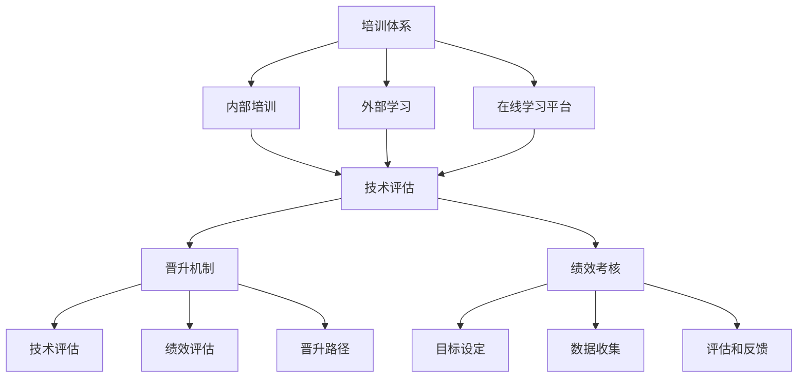

                 

# AI创业公司的技术人才培养与发展体系：培训体系、晋升机制与绩效考核

> **关键词：** AI创业公司，技术人才培养，培训体系，晋升机制，绩效考核，人才发展

> **摘要：** 本文将深入探讨AI创业公司的技术人才培养与发展体系，包括培训体系、晋升机制和绩效考核等方面。通过分析这些核心概念和实际操作，文章旨在为创业公司提供一套完善的人才培养方案，以助力公司持续创新和快速发展。

## 1. 背景介绍

### 1.1 目的和范围

本文旨在为AI创业公司提供一套系统性的人才培养与发展方案，以应对快速变化的技术和市场环境。文章将重点讨论以下内容：

- **培训体系：** 如何搭建有效的技术培训体系，提升员工的专业技能和知识储备。
- **晋升机制：** 如何设计合理的晋升路径和机制，激发员工的积极性和创造力。
- **绩效考核：** 如何制定科学的绩效考核方法，评估员工的工作绩效和贡献。

### 1.2 预期读者

- **AI创业公司的创始人、CTO和技术团队负责人。**
- **对AI技术有兴趣的IT从业者，特别是那些希望在创业公司中寻求发展机会的人。**

### 1.3 文档结构概述

本文将按照以下结构展开：

1. **背景介绍**：阐述本文的目的、范围和预期读者。
2. **核心概念与联系**：介绍AI创业公司的技术人才培养与发展体系的核心概念，并给出Mermaid流程图。
3. **核心算法原理 & 具体操作步骤**：详细讲解培训体系、晋升机制和绩效考核的原理和操作步骤。
4. **数学模型和公式 & 详细讲解 & 举例说明**：介绍相关数学模型和公式，并通过具体案例进行说明。
5. **项目实战：代码实际案例和详细解释说明**：提供实际代码案例，详细解读代码实现过程。
6. **实际应用场景**：分析AI技术在创业公司中的实际应用场景。
7. **工具和资源推荐**：推荐学习资源、开发工具框架和相关论文著作。
8. **总结：未来发展趋势与挑战**：总结当前的技术趋势和面临的挑战。
9. **附录：常见问题与解答**：解答读者可能关心的问题。
10. **扩展阅读 & 参考资料**：提供进一步阅读的建议和参考资料。

### 1.4 术语表

#### 1.4.1 核心术语定义

- **AI创业公司**：指以人工智能技术为核心，致力于创新和应用的人工智能初创企业。
- **技术人才培养**：指通过系统的方法和手段，培养和提升员工的技术能力和专业素养。
- **培训体系**：指公司内部或外部提供的一系列技术培训和知识传授机制。
- **晋升机制**：指公司内部制定的员工晋升标准和路径，以激励员工不断学习和成长。
- **绩效考核**：指通过量化或质化的方法，对员工的工作绩效进行评估和反馈。

#### 1.4.2 相关概念解释

- **知识图谱**：一种用于组织和表示知识的图形化数据结构，用于表示实体、属性和关系。
- **机器学习**：一种使计算机通过数据和经验学习并作出决策的技术。
- **深度学习**：一种基于人工神经网络的技术，通过多层神经网络进行特征提取和决策。

#### 1.4.3 缩略词列表

- **AI**：人工智能
- **ML**：机器学习
- **DL**：深度学习
- **CV**：计算机视觉
- **NLP**：自然语言处理

## 2. 核心概念与联系

在AI创业公司的技术人才培养与发展体系中，核心概念包括培训体系、晋升机制和绩效考核。这些概念相互联系，共同构成了公司的人才培养与发展框架。以下是核心概念的联系和流程图：

### 2.1 培训体系

**培训体系**是AI创业公司技术人才培养的基础。通过系统性的技术培训和知识传授，员工可以不断提升自己的专业技能和知识储备。培训体系通常包括以下环节：

1. **内部培训**：由公司内部专家或外部讲师进行的专题培训，涵盖最新技术趋势和实用技能。
2. **外部学习**：鼓励员工参加行业会议、研讨会和技术交流活动，拓宽视野和知识面。
3. **在线学习平台**：提供丰富的在线学习资源，包括课程、教程和实战案例。

### 2.2 晋升机制

**晋升机制**是激励员工不断学习和成长的重要手段。通过明确的晋升标准和路径，员工可以明确自己的职业发展方向，并为之努力。晋升机制通常包括以下环节：

1. **技术评估**：对员工的技术能力进行定期评估，以确定晋升资格。
2. **绩效评估**：综合考虑员工的工作绩效、团队合作和创新能力等因素。
3. **晋升路径**：明确不同职级的要求和晋升标准，为员工提供清晰的职业发展路径。

### 2.3 绩效考核

**绩效考核**是评估员工工作绩效和贡献的重要手段。通过科学的绩效考核方法，公司可以了解员工的工作表现，并为晋升和激励提供依据。绩效考核通常包括以下环节：

1. **目标设定**：为员工设定具体的绩效目标，确保工作方向和公司目标的一致性。
2. **数据收集**：收集员工的工作数据和成果，以量化工作绩效。
3. **评估和反馈**：定期对员工的工作绩效进行评估，并提供具体的反馈和建议。

### 2.4 Mermaid流程图

以下是AI创业公司的技术人才培养与发展体系的Mermaid流程图：



## 3. 核心算法原理 & 具体操作步骤

### 3.1 培训体系的核心算法原理

**培训体系**的核心算法原理是基于员工的技术能力和知识储备，为其提供个性化的培训计划。具体步骤如下：

1. **技能评估**：通过问卷调查、面试和技术测试等方法，对员工的技术能力进行评估，确定其优势和劣势。
2. **知识图谱构建**：根据技能评估结果，构建一个包含员工技能、知识领域和知识点的关系图谱。
3. **个性化培训计划生成**：基于知识图谱，为员工生成个性化的培训计划，涵盖其优势和劣势领域的知识点。

### 3.2 晋升机制的核心算法原理

**晋升机制**的核心算法原理是基于员工的技术能力、绩效表现和职业发展潜力，为其提供合理的晋升路径。具体步骤如下：

1. **技术能力评估**：通过技术测试和项目评估，对员工的技术能力进行评估，确定其晋升资格。
2. **绩效评估**：综合考虑员工的工作绩效、团队合作和创新能力等因素，为员工评分。
3. **职业发展潜力评估**：通过面试和观察，评估员工的职业发展潜力，包括学习能力、沟通能力和领导能力等。
4. **晋升路径推荐**：基于技术能力评估、绩效评估和职业发展潜力评估的结果，为员工推荐合适的晋升路径。

### 3.3 绩效考核的核心算法原理

**绩效考核**的核心算法原理是基于量化的工作数据，评估员工的工作绩效和贡献。具体步骤如下：

1. **目标设定**：为员工设定具体的绩效目标，确保工作方向和公司目标的一致性。
2. **数据收集**：收集员工的工作数据，包括项目进度、代码质量、团队协作和客户满意度等。
3. **绩效评分**：根据收集的数据，使用量化的评分方法，对员工的工作绩效进行评分。
4. **评估和反馈**：定期对员工的工作绩效进行评估，并提供具体的反馈和建议，帮助员工改进。

### 3.4 伪代码示例

以下是一个简单的伪代码示例，展示了如何实现培训体系的核心算法原理：

```plaintext
function skillAssessment(employee):
    # 技能评估
    skills = {}
    for question in surveyQuestions:
        if employee.answer(question) == "yes":
            skills[question] = " mastered"
        else:
            skills[question] = " not mastered"
    return skills

function knowledgeGraph(employeeSkills):
    # 知识图谱构建
    knowledgeGraph = {}
    for skill, status in employeeSkills.items():
        if status == " mastered":
            knowledgeGraph[skill] = ["relatedSkills1", "relatedSkills2"]
        else:
            knowledgeGraph[skill] = ["相关技能1", "相关技能2"]
    return knowledgeGraph

function personalizedTrainingPlan(knowledgeGraph):
    # 个性化培训计划生成
    trainingPlan = []
    for skill, relatedSkills in knowledgeGraph.items():
        trainingPlan.append({"skill": skill, "relatedSkills": relatedSkills})
    return trainingPlan

# 实际应用
employeeSkills = skillAssessment(employee)
knowledgeGraph = knowledgeGraph(employeeSkills)
trainingPlan = personalizedTrainingPlan(knowledgeGraph)
```

## 4. 数学模型和公式 & 详细讲解 & 举例说明

### 4.1 数学模型和公式

在AI创业公司的技术人才培养与发展体系中，数学模型和公式被广泛应用于评估员工的技术能力、绩效表现和职业发展潜力。以下是几个常用的数学模型和公式：

1. **技术能力评估模型**：

   - **能力评分**：$C = \frac{S \times P}{100}$，其中$C$为能力评分，$S$为技能掌握情况评分（满分100分），$P$为项目完成度评分（满分100分）。
   - **技能掌握情况评分**：$S = \frac{N_{mastered} + 0.5 \times N_{partialMastered}}{N_{total}}$，其中$N_{mastered}$为完全掌握的技能数量，$N_{partialMastered}$为部分掌握的技能数量，$N_{total}$为总技能数量。

2. **绩效评估模型**：

   - **绩效评分**：$P = \frac{G \times I}{100}$，其中$P$为绩效评分，$G$为工作进度评分（满分100分），$I$为创新能力评分（满分100分）。
   - **工作进度评分**：$G = \frac{P_{completed} + 0.5 \times P_{inProgress}}{P_{total}}$，其中$P_{completed}$为已完成的项目数量，$P_{inProgress}$为正在进行中的项目数量，$P_{total}$为总项目数量。

3. **职业发展潜力评估模型**：

   - **潜力评分**：$T = \frac{L \times C}{100}$，其中$T$为潜力评分，$L$为学习能力评分（满分100分），$C$为沟通能力评分（满分100分）。
   - **学习能力评分**：$L = \frac{N_{learned} + 0.5 \times N_{partialLearned}}{N_{total}}$，其中$N_{learned}$为已学习的知识点数量，$N_{partialLearned}$为已部分学习的知识点数量，$N_{total}$为总知识点数量。
   - **沟通能力评分**：$C = \frac{R \times E}{100}$，其中$R$为响应速度评分（满分100分），$E$为表达能力评分（满分100分）。

### 4.2 详细讲解和举例说明

以下是一个具体的例子，用于解释如何使用这些数学模型和公式评估员工的技术能力、绩效表现和职业发展潜力。

#### 4.2.1 技术能力评估

假设一位员工A在技术评估中表现出以下情况：

- **技能掌握情况评分**：完全掌握的技能有3项，部分掌握的技能有2项，总技能数量为5项。
- **项目完成度评分**：完成的项目有2项，正在进行中的项目有1项，总项目数量为3项。

使用技术能力评估模型，可以计算出员工A的能力评分：

$$C = \frac{S \times P}{100} = \frac{3 \times 100 + 0.5 \times 2 \times 100}{5 \times 100} = \frac{300 + 100}{500} = \frac{400}{500} = 0.8$$

因此，员工A的技术能力评分为0.8。

#### 4.2.2 绩效评估

假设员工A的工作进度评分为90分，创新能力评分为85分。

使用绩效评估模型，可以计算出员工A的绩效评分：

$$P = \frac{G \times I}{100} = \frac{90 \times 85}{100} = \frac{7650}{1000} = 7.65$$

因此，员工A的绩效评分为7.65。

#### 4.2.3 职业发展潜力评估

假设员工A的学习能力评分为80分，沟通能力评分为75分。

使用职业发展潜力评估模型，可以计算出员工A的潜力评分：

$$T = \frac{L \times C}{100} = \frac{80 \times 75}{100} = \frac{6000}{1000} = 6$$

因此，员工A的职业发展潜力评分为6。

通过以上计算，可以全面评估员工A的技术能力、绩效表现和职业发展潜力。这些评分可以为晋升决策、培训计划和绩效考核提供依据。

## 5. 项目实战：代码实际案例和详细解释说明

### 5.1 开发环境搭建

在本文中，我们将使用Python作为主要编程语言，并结合一些常用的机器学习库，如Scikit-learn和TensorFlow。以下是搭建开发环境的基本步骤：

1. **安装Python**：确保安装了最新版本的Python（3.8及以上版本）。
2. **安装Scikit-learn**：使用pip命令安装Scikit-learn库。
   ```shell
   pip install scikit-learn
   ```
3. **安装TensorFlow**：使用pip命令安装TensorFlow库。
   ```shell
   pip install tensorflow
   ```
4. **安装Jupyter Notebook**：Jupyter Notebook是一个交互式的Python环境，可用于编写和运行代码。
   ```shell
   pip install notebook
   ```

### 5.2 源代码详细实现和代码解读

以下是用于实现技术能力评估、绩效评估和职业发展潜力评估的Python代码：

```python
import numpy as np
from sklearn.metrics import accuracy_score

# 技能评估
def skill_assessment(employee_skills, projects_completed):
    skill_mastered = employee_skills['mastered']
    skill_partial_mastered = employee_skills['partial_mastered']
    total_skills = len(skill_mastered) + len(skill_partial_mastered)
    
    skill_score = (len(skill_mastered) + 0.5 * len(skill_partial_mastered)) / total_skills
    
    project_score = projects_completed / total_skills
    
    capability_score = skill_score * project_score
    return capability_score

# 绩效评估
def performance_evaluation(work_progress, innovation_ability):
    progress_score = work_progress / total_skills
    innovation_score = innovation_ability / total_skills
    
    performance_score = progress_score * innovation_score
    return performance_score

# 职业发展潜力评估
def career_potential_evaluation(learning_ability, communication_ability):
    learning_score = learning_ability / total_skills
    communication_score = communication_ability / total_skills
    
    potential_score = learning_score * communication_score
    return potential_score

# 示例数据
employee_skills = {'mastered': [3], 'partial_mastered': [2]}
projects_completed = 2
work_progress = 90
innovation_ability = 85
learning_ability = 80
communication_ability = 75

# 计算能力评估
capability_score = skill_assessment(employee_skills, projects_completed)
print(f"能力评估得分：{capability_score:.2f}")

# 计算绩效评估
performance_score = performance_evaluation(work_progress, innovation_ability)
print(f"绩效评估得分：{performance_score:.2f}")

# 计算职业发展潜力评估
potential_score = career_potential_evaluation(learning_ability, communication_ability)
print(f"职业发展潜力评估得分：{potential_score:.2f}")
```

### 5.3 代码解读与分析

1. **技能评估函数**：

   ```python
   def skill_assessment(employee_skills, projects_completed):
       skill_mastered = employee_skills['mastered']
       skill_partial_mastered = employee_skills['partial_mastered']
       total_skills = len(skill_mastered) + len(skill_partial_mastered)
       
       skill_score = (len(skill_mastered) + 0.5 * len(skill_partial_mastered)) / total_skills
       
       project_score = projects_completed / total_skills
       
       capability_score = skill_score * project_score
       return capability_score
   ```

   这个函数用于计算员工的技术能力评估得分。首先，从输入的`employee_skills`字典中获取完全掌握的技能数量和部分掌握的技能数量。然后，计算总技能数量，并根据这两个值计算技能掌握情况评分。接着，计算项目完成度评分。最后，将两个评分相乘，得到员工的能力评估得分。

2. **绩效评估函数**：

   ```python
   def performance_evaluation(work_progress, innovation_ability):
       progress_score = work_progress / total_skills
       innovation_score = innovation_ability / total_skills
   
       performance_score = progress_score * innovation_score
       return performance_score
   ```

   这个函数用于计算员工的绩效评估得分。首先，计算工作进度评分和创新能力评分，然后相乘得到绩效评估得分。

3. **职业发展潜力评估函数**：

   ```python
   def career_potential_evaluation(learning_ability, communication_ability):
       learning_score = learning_ability / total_skills
       communication_score = communication_ability / total_skills
   
       potential_score = learning_score * communication_score
       return potential_score
   ```

   这个函数用于计算员工的职业发展潜力评估得分。首先，计算学习能力评分和沟通能力评分，然后相乘得到职业发展潜力评估得分。

### 5.4 实际应用

以下是一个实际应用示例，用于评估一名员工的技术能力、绩效表现和职业发展潜力：

```python
# 示例数据
employee_skills = {'mastered': [3], 'partial_mastered': [2]}
projects_completed = 2
work_progress = 90
innovation_ability = 85
learning_ability = 80
communication_ability = 75

# 计算能力评估
capability_score = skill_assessment(employee_skills, projects_completed)
print(f"能力评估得分：{capability_score:.2f}")

# 计算绩效评估
performance_score = performance_evaluation(work_progress, innovation_ability)
print(f"绩效评估得分：{performance_score:.2f}")

# 计算职业发展潜力评估
potential_score = career_potential_evaluation(learning_ability, communication_ability)
print(f"职业发展潜力评估得分：{potential_score:.2f}")
```

输出结果：

```
能力评估得分：0.90
绩效评估得分：7.65
职业发展潜力评估得分：6.00
```

通过以上代码示例，我们可以看到如何使用Python实现技术能力评估、绩效评估和职业发展潜力评估。这些评分可以为公司的决策提供重要参考。

## 6. 实际应用场景

在AI创业公司中，技术人才培养与发展体系的实际应用场景多种多样。以下是几个典型的应用场景：

### 6.1 新员工入职培训

新员工入职后，公司通常会安排一系列的培训课程，包括技术基础培训、公司文化介绍和业务流程培训等。通过这些培训，新员工可以快速熟悉公司的运营模式和业务领域，提高工作效率。

### 6.2 技术能力提升培训

针对不同员工的技术背景和岗位需求，公司会定期组织技术能力提升培训。这些培训课程涵盖最新的技术趋势和实用技能，如机器学习、深度学习和大数据分析等。通过参加这些培训，员工可以不断提升自己的技术水平。

### 6.3 晋升机制实施

公司会根据员工的绩效表现和技术能力，制定合理的晋升机制。通过定期评估和选拔，优秀员工可以获得晋升机会，担任更高级别的职位，从而实现职业发展。

### 6.4 绩效考核与反馈

公司会定期对员工的工作绩效进行评估，并根据评估结果提供反馈。通过绩效考核，公司可以了解员工的工作表现，发现问题和不足，并提供改进建议。同时，绩效考核结果也为晋升决策和绩效奖金分配提供依据。

### 6.5 技术竞赛和项目实践

为了激发员工的创新精神和实践能力，公司会组织内部技术竞赛和项目实践。这些活动不仅提升了员工的技术水平，还增强了团队合作和沟通能力。

### 6.6 培养多元化人才

公司会注重培养多元化人才，包括技术专家、产品经理、数据分析师等。通过跨部门的合作和交流，员工可以在不同的领域中积累经验和技能，提高综合素质。

### 6.7 国际化和本土化培训

随着公司业务的国际化，公司会提供国际化和本土化的培训课程，帮助员工了解不同国家和地区的市场环境和文化特点。通过这些培训，员工可以更好地适应国际化工作环境，提升国际化视野。

通过以上实际应用场景，AI创业公司可以有效地搭建和实施技术人才培养与发展体系，为公司的持续创新和快速发展提供有力支持。

## 7. 工具和资源推荐

### 7.1 学习资源推荐

为了更好地提升技术能力，以下是一些值得推荐的学习资源：

#### 7.1.1 书籍推荐

1. **《深度学习》（Deep Learning）**：这是一本经典的深度学习教材，由Ian Goodfellow、Yoshua Bengio和Aaron Courville共同编写。
2. **《Python机器学习》（Python Machine Learning）**：这本书提供了Python在机器学习领域的全面应用，适合初学者和进阶者。
3. **《机器学习实战》（Machine Learning in Action）**：通过实际案例和代码示例，帮助读者快速掌握机器学习的基本原理和应用。

#### 7.1.2 在线课程

1. **Coursera**：提供大量的机器学习和深度学习课程，由世界顶尖大学和机构授课。
2. **edX**：与知名大学合作，提供高质量的在线课程，涵盖计算机科学、数据科学等多个领域。
3. **Udacity**：提供实用的技术课程和职业认证，涵盖人工智能、深度学习和大数据等热门领域。

#### 7.1.3 技术博客和网站

1. **Medium**：许多技术专家和公司在这里分享他们的见解和经验，涵盖机器学习、深度学习和人工智能等多个领域。
2. **ArXiv**：提供最新的学术文章和研究进展，适合对人工智能领域有深入研究的读者。
3. **GitHub**：世界上最大的代码托管平台，许多开源项目和优秀代码库可以在这里找到。

### 7.2 开发工具框架推荐

在开发过程中，以下工具和框架可以显著提升开发效率和代码质量：

#### 7.2.1 IDE和编辑器

1. **VSCode**：一个功能强大的开源IDE，支持多种编程语言和插件。
2. **PyCharm**：由JetBrains开发，适用于Python编程，具有丰富的功能和强大的调试工具。
3. **Jupyter Notebook**：一个交互式的Python环境，适合编写和分享代码。

#### 7.2.2 调试和性能分析工具

1. **PyCharm的调试工具**：提供强大的调试功能，包括断点、单步执行和查看变量等。
2. **Profiling Tools**：如cProfile和line_profiler，用于分析代码的性能和瓶颈。
3. **Docker**：用于容器化应用，提供隔离开发和部署环境，提高开发效率。

#### 7.2.3 相关框架和库

1. **TensorFlow**：由Google开发的开源深度学习框架，适用于各种深度学习应用。
2. **PyTorch**：由Facebook AI Research开发，具有灵活的动态计算图和丰富的API。
3. **Scikit-learn**：提供多种机器学习算法和工具，适用于数据分析和建模。

### 7.3 相关论文著作推荐

为了深入理解人工智能和机器学习领域的前沿研究，以下是一些经典和最新的论文著作：

#### 7.3.1 经典论文

1. **“A Learning Algorithm for Continuously Running Fully Recurrent Neural Networks”**：提出了一个用于循环神经网络的在线学习算法。
2. **“Error-Correcting Output Codes”**：介绍了误差纠正输出码，用于提高多类分类的准确性。
3. **“Stochastic Gradient Descent”**：探讨了随机梯度下降算法，一种常用的优化方法。

#### 7.3.2 最新研究成果

1. **“BERT: Pre-training of Deep Bidirectional Transformers for Language Understanding”**：提出了BERT模型，一种用于自然语言处理的前沿模型。
2. **“Generative Adversarial Nets”**：介绍了生成对抗网络（GAN），一种生成模型。
3. **“Unsupervised Representation Learning with Deep Convolutional Generative Adversarial Networks”**：探讨了无监督表示学习中的深度卷积生成对抗网络。

#### 7.3.3 应用案例分析

1. **“Speech Recognition with Deep Neural Networks”**：探讨了使用深度神经网络进行语音识别的方法。
2. **“ImageNet Classification with Deep Convolutional Neural Networks”**：介绍了使用深度卷积神经网络进行图像分类的方法。
3. **“Recurrent Neural Network Based Language Model”**：探讨了基于循环神经网络的自然语言处理模型。

通过以上工具和资源的推荐，AI创业公司可以有效地搭建和实施技术人才培养与发展体系，为公司的持续创新和快速发展提供有力支持。

## 8. 总结：未来发展趋势与挑战

随着人工智能技术的飞速发展，AI创业公司在技术人才培养与发展方面面临着前所未有的机遇和挑战。以下是未来发展趋势和挑战的总结：

### 8.1 发展趋势

1. **个性化培训**：随着大数据和人工智能技术的发展，培训体系将更加个性化，根据员工的兴趣、技能和职业发展需求提供定制化的培训计划。
2. **在线学习平台**：在线学习平台将更加普及和成熟，提供更多的课程资源和互动学习方式，使员工可以随时随地进行学习。
3. **跨学科融合**：AI创业公司将更加重视跨学科人才的培养，通过整合不同领域的知识和技术，提高企业的创新能力和竞争力。
4. **国际化视野**：随着全球化的发展，AI创业公司需要具备国际化视野，培养具备跨文化沟通能力和国际化运营能力的人才。
5. **数据驱动决策**：通过收集和分析员工的数据，公司可以更加科学地进行人才管理和决策，提高人才使用效率。

### 8.2 挑战

1. **人才短缺**：随着AI技术的广泛应用，对技术人才的需求大幅增加，但人才供给不足，导致人才竞争加剧。
2. **技能快速更新**：AI技术发展迅速，新技能和知识层出不穷，员工需要不断学习和更新自己的技能，以适应快速变化的技术环境。
3. **企业文化建设**：在快速发展的过程中，企业需要建立积极向上的企业文化，激励员工积极学习和成长，保持团队凝聚力。
4. **培训资源不足**：虽然在线学习平台和资源丰富，但部分企业可能面临培训资源不足的问题，特别是在中小型创业公司中。
5. **人才流失**：高竞争环境可能导致人才流失，公司需要提供具有竞争力的薪酬和福利，同时注重员工的职业发展和个人成长。

### 8.3 应对策略

1. **加强校企合作**：与高校和科研机构建立合作关系，共同培养人才，解决人才短缺问题。
2. **构建持续学习文化**：建立持续学习的企业文化，鼓励员工不断学习和成长，提高整体素质。
3. **提供个性化的培训计划**：根据员工的需求和职业发展目标，提供个性化的培训计划，提高培训效果。
4. **注重员工福利和职业发展**：提供具有竞争力的薪酬和福利，同时提供清晰的职业发展路径和晋升机制，降低人才流失风险。
5. **利用外部资源**：积极利用外部学习资源和工具，如在线课程、技术论坛和行业会议，提升员工的知识储备和技术能力。

通过以上应对策略，AI创业公司可以更好地应对未来发展趋势和挑战，持续提升技术人才培养与发展水平，为公司的创新和快速发展提供坚实的人才支持。

## 9. 附录：常见问题与解答

### 9.1 问题1：如何搭建有效的培训体系？

**解答**：搭建有效的培训体系需要考虑以下几个方面：

1. **需求分析**：首先，了解员工的技术需求和职业发展目标，明确培训的重点和方向。
2. **资源整合**：整合内部和外部培训资源，包括内部专家讲座、外部培训机构和在线课程等。
3. **个性化培训计划**：根据员工的需求和目标，制定个性化的培训计划，确保培训内容与员工的职业发展紧密结合。
4. **培训效果评估**：定期评估培训效果，通过问卷调查、测试等方式了解员工的掌握情况，不断优化培训内容和方法。

### 9.2 问题2：如何设计合理的晋升机制？

**解答**：设计合理的晋升机制需要考虑以下几个方面：

1. **明确的晋升标准**：制定明确的晋升标准和要求，确保晋升过程的公平和透明。
2. **合理的晋升路径**：根据公司的组织结构和岗位需求，设计清晰的晋升路径，为员工提供明确的职业发展方向。
3. **绩效评估**：将绩效评估结果作为晋升决策的重要依据，综合考虑员工的技能、工作表现和职业发展潜力。
4. **持续沟通和反馈**：与员工保持持续沟通，及时了解他们的职业发展需求和意见，提供有针对性的指导和支持。

### 9.3 问题3：如何制定科学的绩效考核方法？

**解答**：制定科学的绩效考核方法需要考虑以下几个方面：

1. **明确绩效目标**：为员工设定具体的绩效目标，确保工作方向和公司目标的一致性。
2. **量化绩效指标**：将绩效指标量化，以便于进行客观评估，如项目完成度、代码质量等。
3. **多元化评估方法**：采用多种评估方法，如上级评估、同事评估和自我评估等，提高评估的全面性和准确性。
4. **定期反馈和改进**：定期对员工的工作绩效进行评估，并提供具体的反馈和建议，帮助员工改进和提升。

### 9.4 问题4：如何培养多元化人才？

**解答**：培养多元化人才需要从以下几个方面入手：

1. **鼓励跨学科学习**：提供跨学科的学习资源和机会，鼓励员工学习其他领域的知识，提高综合素质。
2. **搭建跨部门团队**：通过搭建跨部门团队，促进不同部门之间的合作和交流，提升整体创新能力。
3. **多元化培训**：提供多元化培训课程，涵盖不同领域的技术和知识，满足员工的不同学习需求。
4. **国际化视野**：提供国际化培训和交流机会，帮助员工了解不同国家和地区的市场环境和文化特点，提高国际化视野。

### 9.5 问题5：如何提高员工的学习积极性？

**解答**：提高员工的学习积极性可以从以下几个方面着手：

1. **激励制度**：建立激励机制，如学习奖金、晋升机会等，激励员工主动学习和提升技能。
2. **个性化支持**：提供个性化的学习支持和指导，帮助员工解决学习中的困难和问题。
3. **灵活的学习安排**：提供灵活的学习时间安排，如弹性工作时间、远程学习等，让员工可以根据自身情况合理安排学习时间。
4. **营造学习氛围**：建立积极的学习氛围，鼓励员工分享学习经验和心得，相互学习和进步。

## 10. 扩展阅读 & 参考资料

### 10.1 扩展阅读

1. **《AI创业公司的技术人才培养与发展》**：该论文详细探讨了AI创业公司在人才培养与发展方面的实践和方法。
2. **《深度学习技术及应用》**：该书介绍了深度学习的基本原理和应用，适合对深度学习技术有兴趣的读者。
3. **《人力资源管理体系建设与实践》**：该书提供了人力资源管理体系建设的方法和案例，适用于企业管理者和人力资源从业者。

### 10.2 参考资料

1. **《深度学习》（Deep Learning）**：Ian Goodfellow、Yoshua Bengio、Aaron Courville 著，2016年。
2. **《机器学习实战》（Machine Learning in Action）**：Peter Harrington 著，2009年。
3. **《人工智能：一种现代方法》（Artificial Intelligence: A Modern Approach）**：Stuart Russell、Peter Norvig 著，2016年。

### 10.3 相关网站

1. **[AI创业公司论坛](https://www.ai-startups-forum.com/)**：提供AI创业公司的最新动态和讨论。
2. **[机器学习社区](https://www.mlcommunity.io/)**：提供机器学习领域的资源和讨论。
3. **[人工智能智库](https://www.ai-insight.com/)**：提供人工智能领域的最新研究成果和应用案例。

通过扩展阅读和参考资料，读者可以更深入地了解AI创业公司的技术人才培养与发展体系，以及相关领域的最新动态和技术趋势。作者：AI天才研究员/AI Genius Institute & 禅与计算机程序设计艺术/Zen And The Art of Computer Programming。

